# Agent Templates: Learning Task Agents with Feedback Evolution

Date: 2026-02-22
Status: Draft for review
Depends on: Foundation layer (PRs #2683–#2689, all merged), Agentic Product Direction (§9.1 Persona/Soul Contract)

## 1. Objective

Introduce **Agent Templates** — versioned definitions that shape an agent's personality and behavioral directives. Templates are instantiated into agent instances (currently Task Agents) and evolve over time through user feedback in a structured "Weekly 1-on-1" ceremony.

### Key outcomes

1. Users can create and manage multiple agent templates with distinct personalities (e.g., "Laura" the encouraging coach, "Tom" the demanding drill sergeant).
2. Every template edit produces a new **immutable version**; no in-place mutation.
3. Every LLM invocation records which template version was used, enabling analytics and rollback.
4. A "Weekly 1-on-1" inspection mode lets the user review agent performance and evolve the template's directives via voice or text feedback.
5. The system prompt is composed dynamically: rigid scaffold (tools, context rules) + injected user-editable directives.

---

## 2. Architecture Overview

### 2.1 Entity relationship model

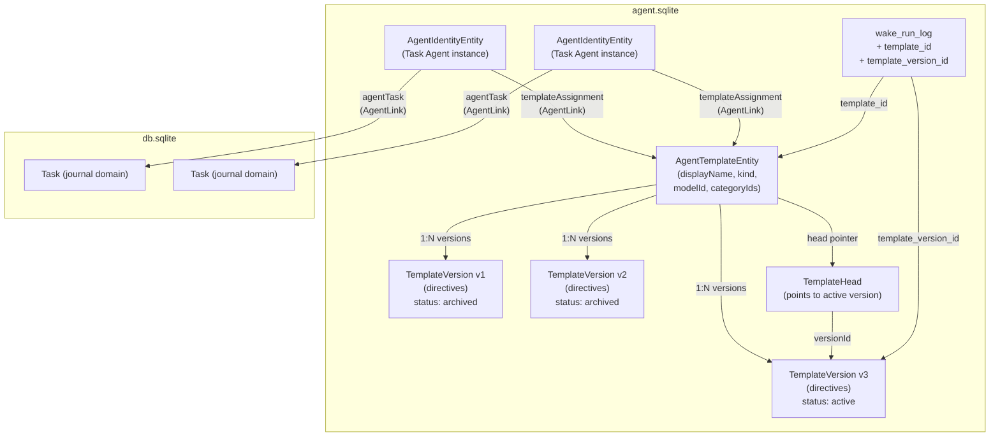

### 2.2 Template-to-instance relationship

A single template can be assigned to many agent instances. Each instance works on its own task but shares the same personality and mission:

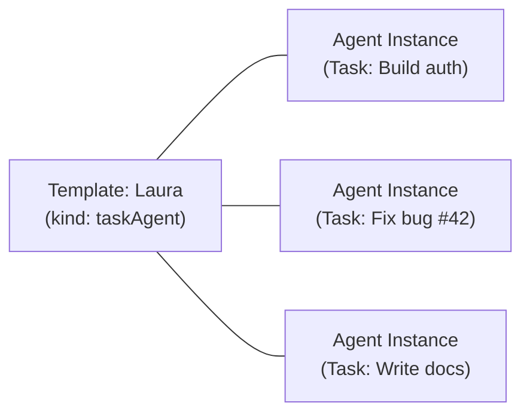

### 2.3 Version lifecycle

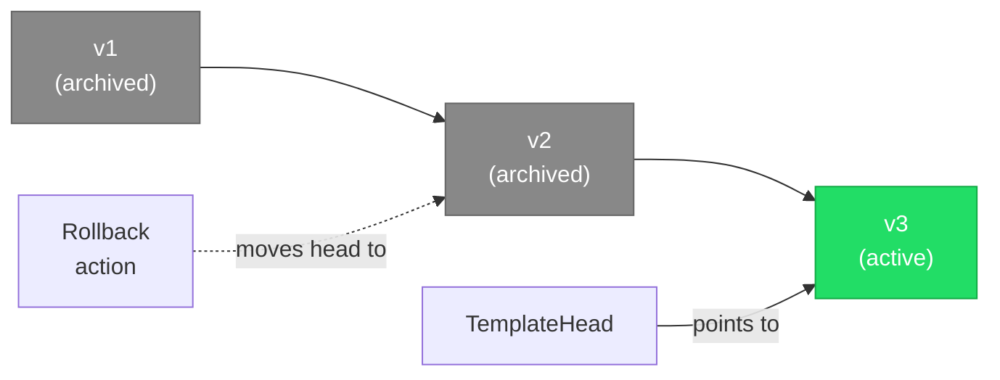

### Design principles

- **Append-only versioning**: Template versions are immutable once created. The "current" version is tracked by a head pointer (like `AgentReportHead`).
- **Separation of concerns**: The template defines *who the agent is*; the agent instance defines *what it's working on*. A single template can be assigned to many agent instances. Templates are a separate domain concept but share the `agent_entities` table and sync infrastructure — distinguished by their `type` discriminator.
- **Canonical assignment via link**: The `AgentLink.templateAssignment` link is the single source of truth for which template an agent uses. There is no redundant `templateId` field in `AgentConfig`.
- **Prompt composition**: The system prompt is assembled at wake time from: `[rigid scaffold] + [directives from active template version]`. The scaffold contains tool definitions, context rules, and output format instructions. The directives are user-editable.
- **Clean-slate database**: The agent feature is unreleased; test users start with a fresh `agent.sqlite`. No migration or backward-compatibility shims are needed — templates are a first-class requirement from day one.

---

## 3. Data Model Changes

### 3.1 New `AgentDomainEntity` variants

Add three new variants to the `AgentDomainEntity` freezed sealed union:

```dart
/// Agent Template identity — the template itself.
/// Stored in `agent_entities` to reuse the existing sync infrastructure.
/// The `agentId` field equals `id` (self-referential) since templates are
/// top-level entities, not children of an agent.
const factory AgentDomainEntity.agentTemplate({
  required String id,
  required String agentId, // self-referential (template's own ID)
  required String displayName,
  required AgentTemplateKind kind, // taskAgent (extensible)
  required String modelId, // default LLM model for this template
  required Set<String> categoryIds, // categories this template is available for
  required DateTime createdAt,
  required DateTime updatedAt,
  required VectorClock? vectorClock,
  String? coverArtId, // future V2: JournalImage ID for avatar
  DateTime? deletedAt,
}) = AgentTemplateEntity;

/// Immutable version of a template's directives.
const factory AgentDomainEntity.agentTemplateVersion({
  required String id,
  required String agentId, // parent template ID
  required int version, // monotonically increasing per template
  required String directives, // unified personality, tone, goals, boundaries
  required AgentTemplateVersionStatus status, // active, archived
  required String authoredBy, // 'user', 'agent', 'system'
  required DateTime createdAt,
  required VectorClock? vectorClock,
  String? diffFromVersionId, // previous version this was derived from
  String? sourceSessionId, // 1-on-1 session that produced this version
  String? approvedBy, // 'user' when explicitly approved
  DateTime? approvedAt,
  DateTime? deletedAt,
}) = AgentTemplateVersionEntity;

/// Head pointer to the active version of a template.
const factory AgentDomainEntity.agentTemplateHead({
  required String id,
  required String agentId, // template ID
  required String versionId, // points to active AgentTemplateVersionEntity
  required DateTime updatedAt,
  required VectorClock? vectorClock,
  DateTime? deletedAt,
}) = AgentTemplateHeadEntity;
```

### 3.2 New enums

Add to `agent_enums.dart`:

```dart
/// Kind of agent template. New kinds are added as they are implemented.
enum AgentTemplateKind {
  /// Task management agent.
  taskAgent,
}

/// Status of a template version in its lifecycle.
enum AgentTemplateVersionStatus {
  /// Active — currently used for new invocations.
  active,

  /// Archived — superseded by a newer version, preserved for history.
  archived,
}
```

### 3.3 New `AgentLink` variant

Add a new link variant for template assignment:

```dart
/// Links an agent instance to its assigned template.
const factory AgentLink.templateAssignment({
  required String id,
  required String fromId, // agent instance ID
  required String toId,   // template ID
  required DateTime createdAt,
  required DateTime updatedAt,
  required VectorClock? vectorClock,
  DateTime? deletedAt,
}) = TemplateAssignmentLink;
```

### 3.4 Wake run log extension

Add `template_id` and `template_version_id` columns directly to the `wake_run_log` table definition (no migration needed — fresh database):

```sql
-- In agent_database.drift, modify the existing CREATE TABLE
CREATE TABLE wake_run_log (
  ...
  template_id TEXT,          -- NEW: which template drove this wake
  template_version_id TEXT,  -- NEW: which version of that template
  ...
);
```

These columns record which template and version were active at the time of each wake, enabling:
- Analytics on version effectiveness (success rate, report quality per version)
- Filtering all wakes by template without joining through version entities
- Audit trail for debugging behavioral changes
- Rollback analysis (compare outcomes across versions)

### 3.5 `AgentConfig` — no changes

The `AgentConfig` class is **not** modified. Template assignment is tracked exclusively via the `AgentLink.templateAssignment` link — there is no redundant `templateId` field in the config. This avoids dual-storage inconsistency and keeps a single source of truth.

### 3.6 Type mapping updates

In `agent_db_conversions.dart`, add type discriminators:
- `'agentTemplate'` → `AgentTemplateEntity`
- `'agentTemplateVersion'` → `AgentTemplateVersionEntity`
- `'agentTemplateHead'` → `AgentTemplateHeadEntity`
- `'templateAssignment'` → `TemplateAssignmentLink`

### 3.7 No drift schema change for entities/links

The `agent_entities` and `agent_links` tables use `type` discriminators and `serialized` JSON. New entity/link variants are stored in existing tables with new `type` values. The `wake_run_log` column addition is made directly in the `.drift` file (clean-slate database, no migration needed).

---

## 4. Business Logic & Service Layer

### 4.1 `AgentTemplateService`

New service at `lib/features/agents/service/agent_template_service.dart`:

```dart
class AgentTemplateService {
  // ── Template CRUD ──

  /// Create a new template with an initial version.
  Future<AgentTemplateEntity> createTemplate({
    required String displayName,
    required AgentTemplateKind kind,
    required String modelId,
    required String directives,
    required Set<String> categoryIds, // categories this template is available for
  });

  /// List all templates, optionally filtered by kind.
  Future<List<AgentTemplateEntity>> listTemplates({
    AgentTemplateKind? kind,
  });

  /// List templates available for a given category.
  /// Returns templates whose `categoryIds` contain [categoryId].
  Future<List<AgentTemplateEntity>> listTemplatesForCategory(
    String categoryId, {
    AgentTemplateKind? kind,
  });

  /// Get a template by ID.
  Future<AgentTemplateEntity?> getTemplate(String templateId);

  /// Soft-delete a template (only if no active agent instances reference it).
  /// Active instances must be destroyed first before the template can be deleted.
  Future<bool> deleteTemplate(String templateId);

  // ── Version management ──

  /// Get the active version for a template.
  Future<AgentTemplateVersionEntity?> getActiveVersion(String templateId);

  /// Get all versions for a template (newest first).
  Future<List<AgentTemplateVersionEntity>> getVersionHistory(
    String templateId,
  );

  /// Create a new version (automatically archives the previous active one).
  /// Returns the new version entity.
  Future<AgentTemplateVersionEntity> createVersion({
    required String templateId,
    required String directives,
    required String authoredBy, // 'user' or 'agent'
    String? sourceSessionId,
  });

  /// Rollback to a previous version by moving the head pointer.
  Future<void> rollbackToVersion({
    required String templateId,
    required String versionId,
  });

  // ── Assignment queries ──

  /// Get the template assigned to an agent instance (via templateAssignment link).
  Future<AgentTemplateEntity?> getTemplateForAgent(String agentId);

  /// Get all agent instances using a given template.
  Future<List<AgentIdentityEntity>> getAgentsForTemplate(String templateId);
}
```

Note: Template assignment is performed during agent creation in `TaskAgentService.createTaskAgent`, which creates the `templateAssignment` link in the same transaction. There is no separate `assignToAgent` method — an agent's template is set at creation time and cannot be reassigned. To switch templates, the user destroys the agent and creates a new one with the desired template (see §4.6).

### 4.2 Prompt composition changes

The system prompt is assembled at wake time by layering user-editable documents onto a rigid scaffold:

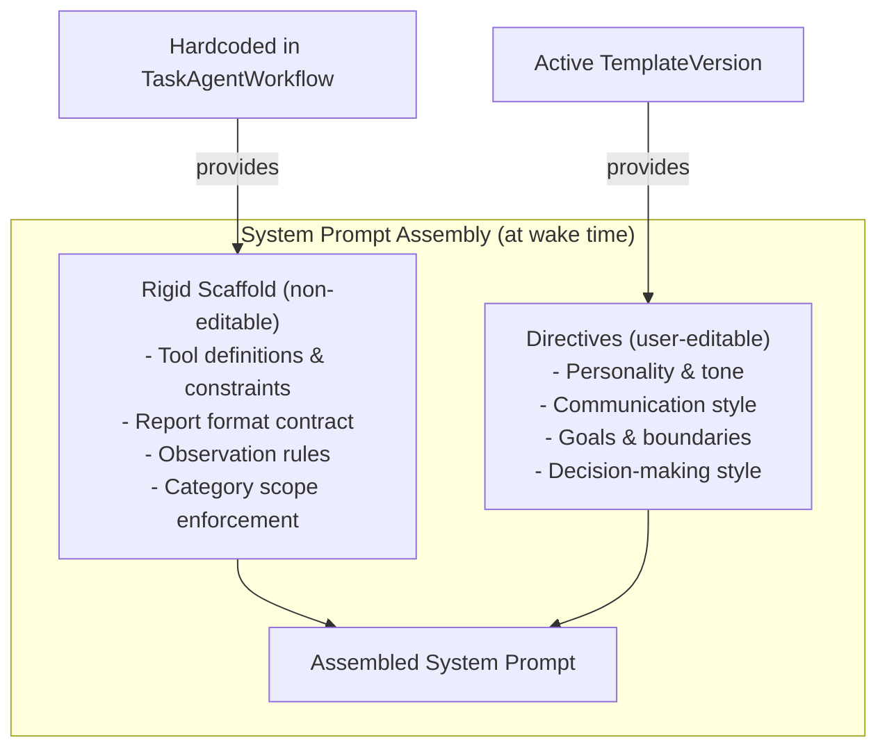

Modify `TaskAgentWorkflow` to compose the system prompt dynamically:

```dart
Future<String> _buildSystemPrompt(AgentIdentityEntity agent) async {
  // 1. Load assigned template and active version via the templateAssignment link.
  // Every agent must have a template — this is enforced at creation time.
  final template = await templateService.getTemplateForAgent(agent.id);
  final version = await templateService.getActiveVersion(template!.id);

  // 2. Build scaffold (rigid, non-editable).
  final scaffold = _buildScaffold(); // tool definitions, output format, rules

  // 3. Inject directives from the active template version.
  return '''
$scaffold

## Your Personality & Directives

${version!.directives}
''';
}
```

The scaffold contains everything that is NOT user-editable:
- Tool usage guidelines and constraints
- Report format requirements (`update_report` contract)
- Observation recording rules
- Category scope enforcement rules
- Context injection format

The directives field is user-editable and covers everything about the agent's character and approach in a single unified document: personality, tone, communication style, goals, behavioral boundaries, and decision-making preferences.

The current hardcoded `taskAgentSystemPrompt` constant is decomposed: its tool/report/observation rules become the scaffold, and the personality-neutral tone becomes the seed content for the default templates (Laura, Tom).

> **Future direction — reusable soul entities**: The directives field is a single document for now. Eventually, the personality/identity portion ("Laura") could be extracted into a standalone, reusable **Soul** entity that can be plugged into multiple templates. This would let Laura power both a task agent and a coach template while maintaining a consistent personality. For now, the unified field is simpler and avoids premature abstraction.

### 4.3 Wake cycle with template integration

The existing wake cycle is extended to resolve the template and inject its directives into the system prompt:

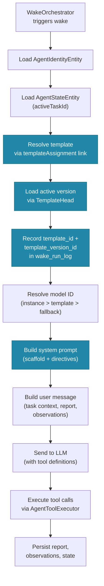

In `TaskAgentWorkflow.execute()`, after resolving the template version, record it in the wake run log:

```dart
// After creating the wake run log entry, record the template provenance.
await agentRepository.updateWakeRunTemplate(
  runKey: runKey,
  templateId: template.id,
  templateVersionId: activeVersion.id,
);
```

### 4.4 Model ID resolution

Currently the model ID is hardcoded as `_modelId = 'models/gemini-3.1-pro-preview'`. With templates, the resolution order becomes:

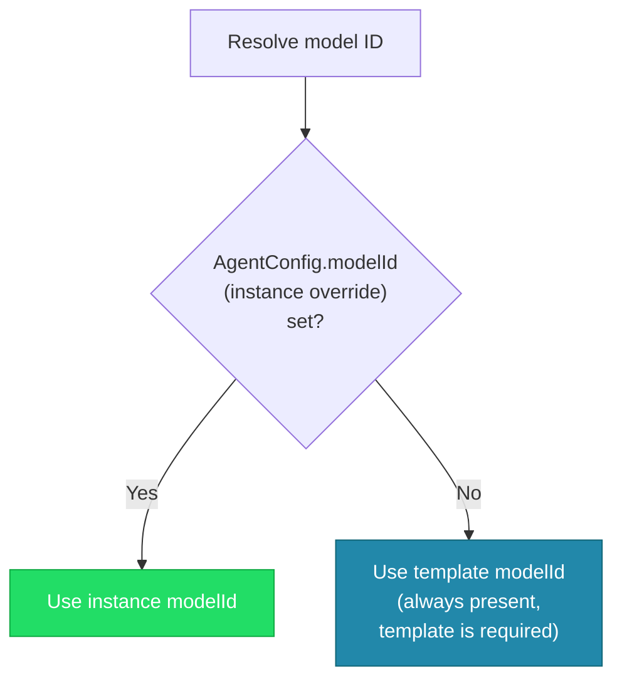

1. `AgentConfig.modelId` on the agent instance (highest priority, per-instance override)
2. `AgentTemplateEntity.modelId` on the assigned template (always available — template assignment is mandatory)

### 4.5 Default template seeding

On first launch (or when the feature flag is enabled), seed two built-in templates:

1. **"Laura"** — Encouraging, supportive, celebrates progress, uses positive reinforcement.
   - Directives: warm tone, uses encouragement, highlights achievements before gaps, helps the user stay on track with gentle nudges, celebrates milestones

2. **"Tom"** — Direct, no-nonsense, focuses on accountability, pushes for results.
   - Directives: crisp tone, uses direct language, prioritizes blockers and deadlines, holds the user accountable, flags missed estimates, pushes for completion

These are editable — they serve as starting points the user can customize.

Seeding runs as part of Phase 1 (see §9) because templates are required for agent creation. The seed logic is idempotent — it checks whether templates already exist before creating.

### 4.6 Switching templates (destroy and recreate)

An agent's template assignment is **immutable after creation**. The agent's entire history (messages, observations, reports) was produced by the assigned template's personality, and mixing personalities within a single agent's history would produce incoherent context.

To switch an agent to a different template:
1. **Destroy** the existing agent (preserves history for audit via `AgentLifecycle.destroyed`)
2. **Create** a new agent for the same task with the desired template

This flow is surfaced in the agent detail page (see §5.5).

---

## 5. UI Implementation

### UI navigation flow

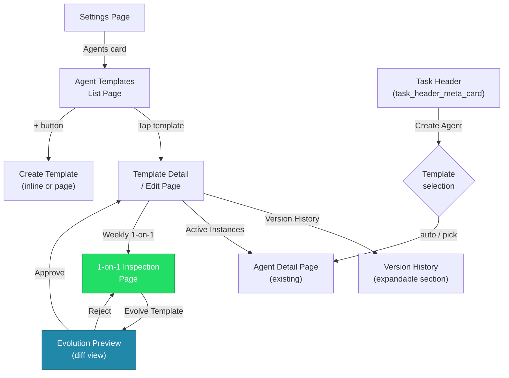

### 5.1 Settings / Agents list page

**Location**: `lib/features/agents/ui/agent_template_list_page.dart`
**Navigation**: Settings → Agents (new card in `settings_page.dart`, gated by `enableAgentsFlag`)

**Layout**:
- App bar: "Agent Templates" with add (+) action
- Body: List of template cards, each showing:
  - Display name (e.g., "Laura")
  - Kind badge (e.g., "Task Agent")
  - Model ID (e.g., "Gemini 3.1 Pro")
  - Active version number (e.g., "v3")
  - Number of active agent instances using this template
  - Placeholder avatar circle (future V2: cover art)
- Tap → navigate to template detail/edit page
- FAB or app bar action → create new template

### 5.2 Template detail/edit page

**Location**: `lib/features/agents/ui/agent_template_detail_page.dart`

**Layout** (scrollable):

1. **Header section**:
   - Display name (editable text field)
   - Model selector (dropdown, populated from `AiConfigRepository`)
   - Category selector (multi-select, populated from categories — defines which task categories this template is available for)
   - Avatar placeholder (future V2)

2. **Directives section**:
   - Multi-line text field with markdown support hint
   - "Define the agent's personality, tone, goals, and style..."
   - Example placeholder text showing how to combine personality + mission in one document

3. **Save button**:
   - Creates a new version (not in-place edit)
   - Shows confirmation: "This will create version N+1. The agent will use the new version on its next wake."

5. **Version History section** (expandable):
   - List of all versions with version number, date, authored-by, status badge
   - Tap to view full content (side-by-side comparison with current active version)
   - "Rollback to this version" action on archived versions

6. **Active Instances section**:
   - List of agent instances currently assigned to this template
   - Tap to navigate to agent detail page

7. **Danger zone**:
   - Delete template (only if no active instances — user must destroy all agents using this template first)

### 5.3 Template assignment in task agent creation

Modify the task agent creation flow (`TaskAgentService.createTaskAgent`) to:

1. Require a `templateId` parameter (every agent must have a template)
2. Create a `TemplateAssignmentLink` (the canonical source of truth)

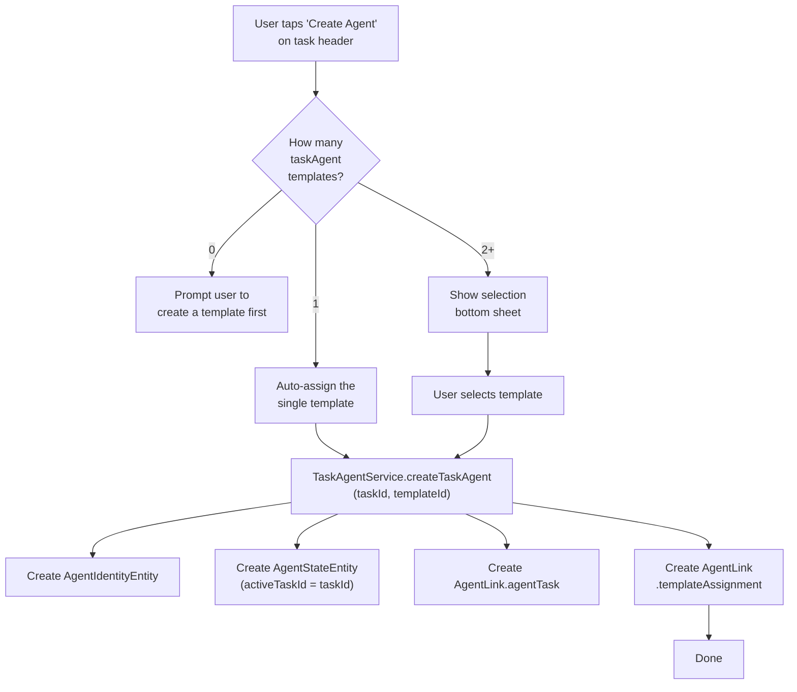

In the UI (`task_header_meta_card.dart`), when creating a task agent:
- Filter available templates by the task's category (via `listTemplatesForCategory`)
- If only one matching template exists, auto-assign it
- If multiple exist, show a selection bottom sheet
- If none exist for this category, prompt the user to create a template first (templates are required, not optional)

### 5.4 Weekly 1-on-1 inspection mode

**Location**: `lib/features/agents/ui/agent_one_on_one_page.dart`

This is a page accessible from the template detail page. A simplified version ships in Phase 3 (metrics + manual editing); the full LLM-assisted evolution workflow ships in Phase 4.

#### 1-on-1 evolution data flow

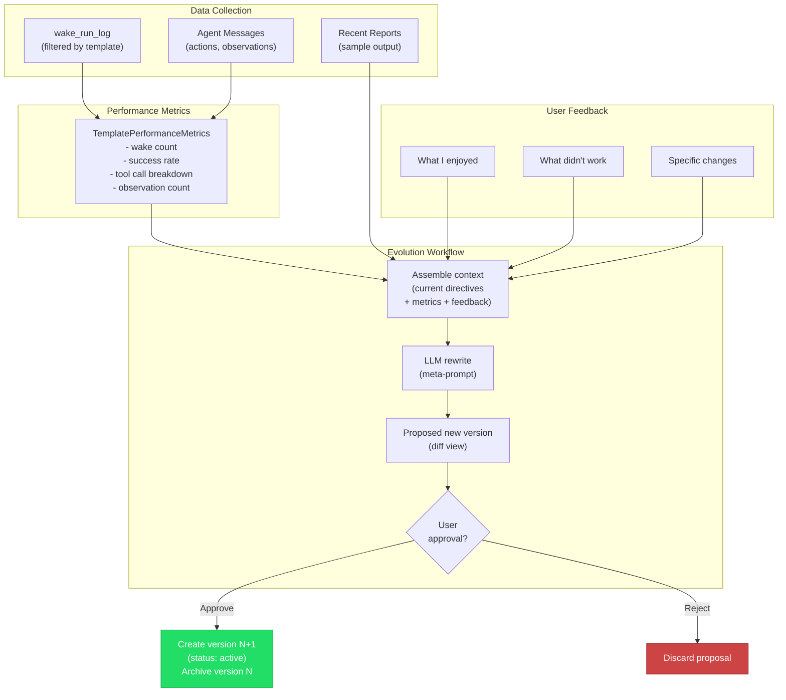

**Layout**:

1. **Performance dashboard** (top section):
   - Number of wakes since last 1-on-1
   - Success/failure rate
   - Number of tool calls by type
   - Number of observations recorded
   - Timeline of wake activity (simple bar chart or sparkline)
   - These metrics are derived from `wake_run_log` and agent messages filtered by template version

2. **Sample reports section**:
   - Show 2-3 recent reports produced by agents using this template
   - Helps the user see the template's output quality

3. **Feedback input section** (Phase 4 — LLM-assisted evolution):
   - "What I enjoyed" — text field (future: voice input via existing speech infrastructure)
   - "What didn't work" — text field
   - "Any specific changes?" — text field
   - These are structured feedback fields, not free-form chat

4. **Evolution action** (Phase 4 — LLM-assisted evolution):
   - "Evolve Template" button
   - Sends the current directives + performance data + user feedback to the LLM
   - The LLM rewrites the directives
   - Result is presented as a diff/preview for user approval
   - Result is shown in a **side-by-side view** (old version on top, new version below) — the most intuitive format for non-technical users reviewing personality changes
   - On approval → creates a new version (status: active)
   - On rejection → discards

### 5.5 Agent detail page — template display

The existing agent detail page is extended to show the assigned template:

- **Template badge/card**: Display the template name (e.g., "Laura"), kind, and model ID
- **Tap to navigate**: Tapping the template card navigates to the template detail page
- **Switch template action**: Since template assignment is immutable, this action prompts: "To use a different template, destroy this agent and create a new one. The current agent's history will be preserved." with a "Destroy & Recreate" button that:
  1. Destroys the current agent
  2. Opens the template selection flow for the same task

### 5.6 Evolution workflow (LLM-assisted rewrite)

The evolution workflow uses the existing conversation infrastructure:

```dart
class TemplateEvolutionWorkflow {
  /// Run the evolution cycle.
  ///
  /// 1. Assemble context: current directives, performance metrics, user feedback.
  /// 2. Send to LLM with a meta-prompt asking it to rewrite the directives.
  /// 3. Parse the structured output.
  /// 4. Return the proposed new version for user preview/approval.
  Future<ProposedTemplateVersion> evolve({
    required AgentTemplateVersionEntity currentVersion,
    required TemplatePerformanceMetrics metrics,
    required UserFeedback feedback,
  });
}
```

The meta-prompt for evolution:

```
You are a meta-agent designer. Your job is to improve an AI agent's personality
and directives based on user feedback and performance data.

## Current Directives
{currentVersion.directives}

## Performance Since Last Review
- Wakes: {metrics.wakeCount}
- Tool calls by type: {metrics.toolCallBreakdown}
- Observations recorded: {metrics.observationCount}
- User satisfaction signals: {feedback.enjoyed}
- User dissatisfaction signals: {feedback.disliked}
- Specific change requests: {feedback.changes}

## Instructions
Rewrite the directives incorporating the user's feedback.
Maintain the agent's core identity while evolving its approach.
Output as structured JSON: {"directives": "..."}
```

---

## 6. Riverpod Providers

Add to `agent_providers.dart`:

```dart
@riverpod
AgentTemplateService agentTemplateService(Ref ref) {
  return AgentTemplateService(
    repository: ref.watch(agentRepositoryProvider),
    syncService: ref.watch(agentSyncServiceProvider),
  );
}

@riverpod
Future<List<AgentTemplateEntity>> agentTemplates(Ref ref) async {
  // Watch the update stream to auto-refresh.
  ref.watch(agentUpdateStreamProvider(''));
  final service = ref.watch(agentTemplateServiceProvider);
  return service.listTemplates();
}

@riverpod
Future<AgentTemplateEntity?> agentTemplate(Ref ref, String templateId) async {
  final service = ref.watch(agentTemplateServiceProvider);
  return service.getTemplate(templateId);
}

@riverpod
Future<AgentTemplateVersionEntity?> activeTemplateVersion(
  Ref ref, String templateId,
) async {
  final service = ref.watch(agentTemplateServiceProvider);
  return service.getActiveVersion(templateId);
}

@riverpod
Future<List<AgentTemplateVersionEntity>> templateVersionHistory(
  Ref ref, String templateId,
) async {
  final service = ref.watch(agentTemplateServiceProvider);
  return service.getVersionHistory(templateId);
}

@riverpod
Future<AgentTemplateEntity?> templateForAgent(
  Ref ref, String agentId,
) async {
  final service = ref.watch(agentTemplateServiceProvider);
  return service.getTemplateForAgent(agentId);
}
```

---

## 7. Localization

Add labels to all arb files (`app_en.arb`, `app_de.arb`, `app_es.arb`, `app_fr.arb`, `app_ro.arb`):

```
agentTemplatesTitle → "Agent Templates"
agentTemplateCreateTitle → "Create Template"
agentTemplateDirectivesLabel → "Directives"
agentTemplateDirectivesHint → "Define the agent's personality, tone, goals, and style..."
agentTemplateVersionLabel → "Version {version}"
agentTemplateVersionHistoryTitle → "Version History"
agentTemplateActiveInstancesTitle → "Active Instances"
agentTemplateSaveNewVersion → "Save as New Version"
agentTemplateRollback → "Rollback to This Version"
agentTemplateDeleteConfirm → "Delete this template? This cannot be undone."
agentTemplateAssignedLabel → "Assigned Template"
agentTemplateSwitchHint → "To use a different template, destroy this agent and create a new one."
agentOneOnOneTitle → "Weekly 1-on-1"
agentOneOnOneEnjoyedLabel → "What I enjoyed"
agentOneOnOneDislikedLabel → "What didn't work"
agentOneOnOneChangesLabel → "Any specific changes?"
agentOneOnOneEvolveButton → "Evolve Template"
agentOneOnOnePreviewTitle → "Proposed Changes"
agentOneOnOneApprove → "Approve & Activate"
agentOneOnOneReject → "Discard"
agentTemplateModelLabel → "LLM Model"
```

---

## 8. Testing Strategy

### 8.1 Model tests
- Serialization roundtrip for `AgentTemplateEntity`, `AgentTemplateVersionEntity`, `AgentTemplateHeadEntity`
- Serialization roundtrip for `TemplateAssignmentLink`
- Enum serialization for `AgentTemplateKind`, `AgentTemplateVersionStatus` (active, archived — no draft)

### 8.2 Repository tests
- CRUD for template entities
- Version history ordering
- Head pointer updates
- Template assignment link CRUD

### 8.3 Service tests
- `createTemplate` creates entity + initial version + head
- `createVersion` archives previous, creates new, updates head
- `rollbackToVersion` moves head pointer, archives current
- `deleteTemplate` fails when active instances exist
- `deleteTemplate` succeeds after all instances are destroyed
- `getActiveVersion` returns correct version after multiple edits
- `getTemplateForAgent` resolves via link, not via config field
- `listTemplatesForCategory` filters by category ID
- Template creation with `categoryIds` persists and roundtrips correctly

### 8.4 Workflow tests
- System prompt composition includes directives from active version
- `template_id` and `template_version_id` recorded in wake run log
- Model ID resolution order (instance override > template default)

### 8.5 Widget tests
- Template list page renders templates
- Template detail page shows directives field
- Save creates new version (mock service)
- Version history displays versions with status badges
- Agent detail page shows assigned template
- Agent detail page "switch template" flow prompts destroy-and-recreate
- 1-on-1 page shows metrics and feedback fields
- Evolution workflow shows preview diff

---

## 9. Rollout Phases

### Phase dependency graph

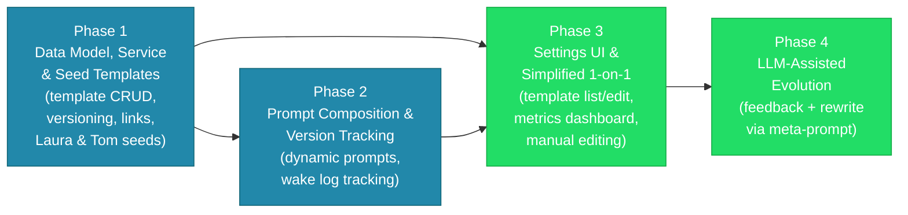

### Phase 1: Data Model, Service & Seed Templates (PR ~1)

**Files to create/modify**:
- `lib/features/agents/model/agent_domain_entity.dart` — add 3 variants
- `lib/features/agents/model/agent_link.dart` — add 1 variant
- `lib/features/agents/model/agent_enums.dart` — add 2 enums
- `lib/features/agents/database/agent_db_conversions.dart` — add type mappings
- `lib/features/agents/database/agent_repository.dart` — add template queries
- `lib/features/agents/database/agent_database.drift` — add `template_id` and `template_version_id` columns to `wake_run_log`
- `lib/features/agents/service/agent_template_service.dart` — new file (CRUD + versioning + seeding)
- Seed data: Laura and Tom directives documents
- Tests for all of the above

**Deliverable**: Template CRUD, versioning, and default seeds work at the service layer, fully tested. Laura and Tom templates are seeded on first launch. No UI yet.

### Phase 2: Prompt Composition & Version Tracking (PR ~2)

**Files to modify**:
- `lib/features/agents/workflow/task_agent_workflow.dart` — dynamic prompt composition, version tracking
- `lib/features/agents/service/task_agent_service.dart` — require `templateId` in creation, create `templateAssignment` link
- `lib/features/agents/state/agent_providers.dart` — add template providers
- Tests for prompt composition and version tracking

**Deliverable**: Agents use template directives in their system prompts. Template and version are tracked per wake. The hardcoded `taskAgentSystemPrompt` is decomposed into scaffold + directives.

### Phase 3: Settings UI & Simplified 1-on-1 (PR ~3)

**Files to create/modify**:
- `lib/features/agents/ui/agent_template_list_page.dart` — new file
- `lib/features/agents/ui/agent_template_detail_page.dart` — new file
- `lib/features/agents/ui/agent_one_on_one_page.dart` — new file (simplified: metrics dashboard + manual directives editing, no LLM rewrite yet)
- `lib/features/settings/ui/pages/settings_page.dart` — add Agents card
- `lib/features/tasks/ui/header/task_header_meta_card.dart` — template selection on agent creation
- Agent detail page — add assigned template display (§5.5)
- Localization (all arb files)
- Widget tests

**Deliverable**: Users can create, edit, and manage templates from Settings. Creating a task agent offers template selection. Agent detail page shows the assigned template. Simplified 1-on-1 page shows performance metrics and allows manual directives editing (creating new versions directly).

### Phase 4: LLM-Assisted Evolution (PR ~4)

**Files to create**:
- `lib/features/agents/workflow/template_evolution_workflow.dart` — new file
- `lib/features/agents/model/template_performance_metrics.dart` — new file (freezed)
- Extend `agent_one_on_one_page.dart` with feedback input fields and "Evolve Template" button
- Tests for evolution workflow, widget tests for feedback/evolution UI

**Deliverable**: The 1-on-1 page gains LLM-assisted evolution: users provide structured feedback, the LLM rewrites the directives, and the user previews/approves the proposed changes.

---

## 10. Future Considerations (V2, not in scope)

1. **Cover art / avatar**: The `coverArtId` field is already in the model but UI is deferred.
2. **Voice input for 1-on-1**: Leverage existing speech infrastructure (`lib/features/speech/`) for voice-first feedback sessions.
3. **Cross-template analytics**: Compare performance metrics across templates to recommend the best one for a task category.
4. **Template sharing**: Export/import templates as JSON for community sharing.
5. **A/B testing**: Randomly assign template versions to agent instances and compare outcomes.
6. **Scheduled 1-on-1s**: A dedicated feedback-gathering agent schedules periodic 1-on-1 sessions and prompts the user, rather than relying on manual initiation.
7. **Multi-agent template composition**: Allow a template to inherit from or compose with other templates (e.g., "Tom's directness + Laura's encouragement").
8. **Report/plan rating**: Let users rate individual agent reports or plans, providing fine-grained quality signals beyond the aggregate metrics in the 1-on-1 dashboard.

---

## 11. Clean-Slate Deployment

The agent feature is **unreleased** — it exists only behind the `enableAgentsFlag` config flag for internal testing. There are no production users and no agent data to preserve.

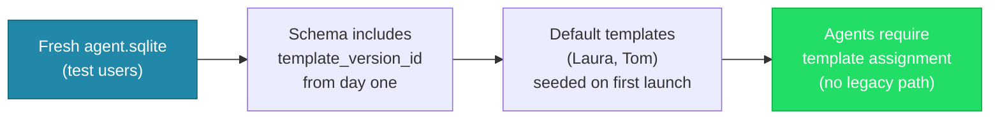

- **No migration needed**: The `wake_run_log.template_id` and `wake_run_log.template_version_id` columns are part of the initial schema, not an ALTER TABLE migration.
- **No backward-compatibility shims**: Every agent must have a template. The hardcoded `taskAgentSystemPrompt` constant is removed and replaced by the scaffold + directives composition.
- **No fallback paths**: The `_buildSystemPrompt` method does not need a "no template assigned" branch. The creation flow enforces template assignment.
- **Test users start fresh**: When test users need to pick up schema changes, they delete the existing `agent.sqlite` file. Default templates (Laura, Tom) are seeded automatically on first launch, ensuring agents can always be created with a template.
- The feature remains gated behind `enableAgentsFlag`.

---

## 12. Resolved Design Decisions

1. **No draft status**: Template versions are either `active` or `archived`. The evolution flow uses a transient preview (side-by-side view) before committing. No persistent drafts.
2. **Side-by-side version comparison**: When previewing evolution proposals or comparing versions, show old version on top and new version below. This is the most intuitive format for non-technical users — no diff syntax to parse.
3. **Category-scoped templates**: Templates declare which categories they are available for (via `categoryIds`). When creating an agent for a task, the UI filters templates by the task's category. A template can serve multiple categories.
4. **User-initiated 1-on-1**: For now, the 1-on-1 is purely user-initiated from the template detail page. Scheduled prompting by a feedback-gathering agent is a future consideration (§10.6).
5. **Version counter conflicts across devices**: The version number is monotonically increasing per template, but two devices could independently create version N+1. The version number is cosmetic (for display); the `TemplateHead` pointer with its vector clock is the authoritative source of which version is active. Conflicting version numbers are acceptable and don't affect correctness.
