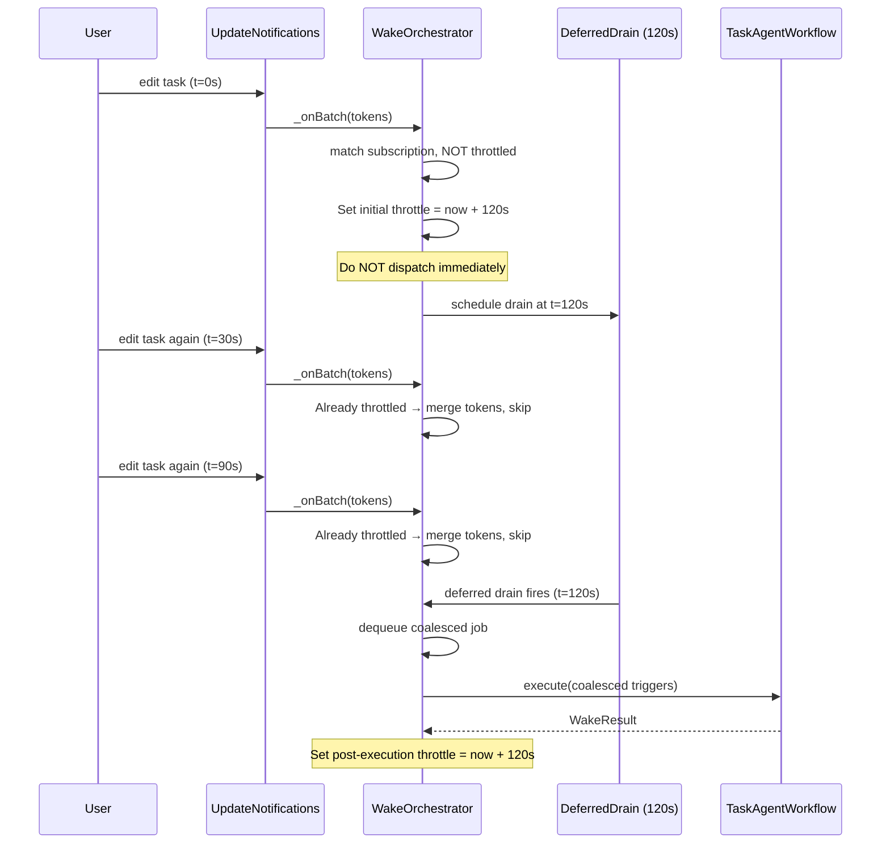
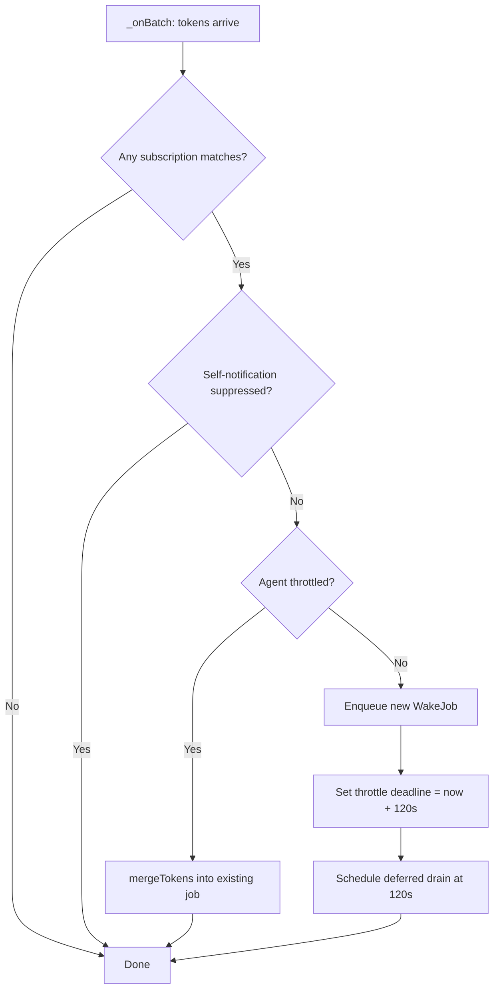

# Agent Refinement: Throttle Timing, New Tools, and Reporting

**Date**: 2026-02-26
**Status**: Implemented (PR #2705)
**Related PRs**: #2703 (throttle), #2702/#2700 (template evolution), #2677 (agentic foundations)

## Overview

This plan addresses four areas of improvement for the Task Agent system discovered
during real-world testing of the throttling/manual-trigger work from PR #2703:

1. **Throttle timing adjustment** — switch from "run immediately + 5-minute cooldown" to
   "defer first run by 2 minutes" to coalesce bursty edits.
2. **New tools** — add `set_task_language` and `set_task_status` to the agent's
   tool registry.
3. **Reporting & observations** — stop leaking internal notes into reports; increase
   observation verbosity.
4. **Data integration** — pass correction examples into the agent's context window.

---

## 1. Throttle / Timing Adjustment

### Current Behavior

```text
User edits task → notification → _onBatch → enqueue → processNext → _drain → execute immediately
                                                       ↓
                                      Set 300s throttle deadline → deferred drain fires at 300s
```

The agent runs **immediately** on the first notification, then enforces a 5-minute
cooldown. This creates two problems:
- The first run fires before the user finishes making changes (bursty edits).
- 300 seconds is long for a second pass once changes settle.
- "5-minute cooldown" is too aggressive for iterative editing workflows.

### Proposed Behavior



### Implementation Details

**File**: `lib/features/agents/wake/wake_orchestrator.dart`

#### A. Change throttle window constant

```dart
// Before:
static const throttleWindow = Duration(seconds: 300);

// After:
static const throttleWindow = Duration(seconds: 120);
```

#### B. Defer-first-run logic in `_onBatch`

Currently `_onBatch` enqueues a job and calls `processNext()` immediately when the
agent is not throttled. The new behavior:

1. On the **first** notification for a non-throttled agent:
   - Enqueue the job (so tokens accumulate via `mergeTokens`).
   - Set the throttle deadline to `now + 120s` (this prevents immediate dispatch).
   - Schedule a deferred drain timer at 120s.
   - Do **not** call `processNext()` — the deferred timer will do it.

2. On **subsequent** notifications while throttled:
   - Merge tokens into the existing queued job (already implemented).
   - Skip (already implemented via `_isThrottled` check).

3. When the deferred timer fires:
   - Clear the throttle (already implemented in `_scheduleDeferredDrain`).
   - Call `processNext()` which runs `_drain()` → picks up the coalesced job.

4. After execution completes in `_executeJob`:
   - Set a new 120s throttle deadline (already implemented via `_setThrottleDeadline`).

The key change is in `_onBatch`: instead of the current pattern of
"enqueue + processNext()", we "enqueue + setThrottle + scheduleDeferredDrain"
for subscription-driven wakes.

**Manual wakes** (`enqueueManualWake`) remain unchanged — they bypass throttle
and execute immediately. This preserves the "Run Now" button behavior.

#### C. Merge-aware enqueue

The existing `queue.mergeTokens(agentId, matched)` already handles token coalescing.
The deferred job accumulates all trigger tokens from the burst window. No change needed.

#### D. Post-execution drain delay

Change `postExecutionDrainDelay` from 30s to match `throttleWindow` (120s) so
post-execution pickup is consistent with the initial deferral:

```dart
// Before:
static const postExecutionDrainDelay = Duration(seconds: 30);

// After — or simply reuse throttleWindow's deferred drain:
// The _setThrottleDeadline already schedules a deferred drain at throttleWindow.
// We may remove postExecutionDrainDelay entirely and rely on the throttle timer.
```

### Flow Diagram: Updated `_onBatch`



---

## 2. New Tools: `set_task_language` and `set_task_status`

### 2a. `set_task_language`

**Rationale**: The agent already receives `languageCode` in the task context JSON.
When it's `null`, the agent should detect and set it. The tool already exists in
`TaskFunctions` (for the AI chat flow) — we need to mirror it in the agent tool
registry and add a handler in `TaskAgentWorkflow`.

#### Tool Definition (agent_tool_registry.dart)

```dart
AgentToolDefinition(
  name: 'set_task_language',
  description: 'Set the detected language for the task. '
      'Only set when the task has no language yet (languageCode is null). '
      'Detect based on the task content (title, transcripts, notes).',
  parameters: {
    'type': 'object',
    'properties': {
      'languageCode': {
        'type': 'string',
        'description': 'ISO 639-1 language code (e.g., "en", "de", "fr").',
      },
      'confidence': {
        'type': 'string',
        'enum': ['high', 'medium', 'low'],
        'description': 'Confidence level of language detection.',
      },
    },
    'required': ['languageCode', 'confidence'],
    'additionalProperties': false,
  },
),
```

#### Handler (task_language_handler.dart)

Add a new `TaskLanguageHandler` class and a new case in `_executeToolHandler`:

```dart
case 'set_task_language':
  return _handleSetLanguage(taskEntity, args, taskId);
```

The handler:
1. Checks if `task.data.languageCode` is already set → skip if so.
2. Validates `languageCode` against `SupportedLanguage.values`.
3. Calls `journalRepository.updateTask(...)` with the new language code.
4. Returns `ToolExecutionResult` with `mutatedEntityId: taskId`.

### 2b. `set_task_status`

**Rationale**: The agent cannot currently change task status. Status transitions
like "Open → In Progress" or "Open → Blocked" are useful when the agent detects
relevant signals (e.g., checklist progress, blocking notes).

#### Tool Definition (agent_tool_registry.dart)

```dart
AgentToolDefinition(
  name: 'set_task_status',
  description: 'Transition the task to a new status. '
      'Valid statuses: OPEN, IN PROGRESS, GROOMED, BLOCKED, ON HOLD. '
      'BLOCKED and ON HOLD require a reason. '
      'DONE and REJECTED are user-only and cannot be set by the agent. '
      'Only change status when there is clear evidence in the task context.',
  parameters: {
    'type': 'object',
    'properties': {
      'status': {
        'type': 'string',
        'enum': ['OPEN', 'IN PROGRESS', 'GROOMED', 'BLOCKED', 'ON HOLD'],
        'description': 'The target task status.',
      },
      'reason': {
        'type': 'string',
        'description': 'Required for BLOCKED and ON HOLD. '
            'Explanation of why the task is blocked or on hold.',
      },
    },
    'required': ['status'],
    'additionalProperties': false,
  },
),
```

#### Handler (task_status_handler.dart)

New `TaskStatusHandler` class (new file:
`lib/features/agents/tools/task_status_handler.dart`):

1. Parse and validate the `status` string.
2. For `BLOCKED` and `ON HOLD`, require the `reason` parameter.
3. Guard against no-op transitions (current status == target status).
4. Build the new `TaskStatus` using `taskStatusFromString` (or a clock-aware
   variant to avoid `DateTime.now()` in the handler — use `clock.now()` instead).
5. Update via `journalRepository.updateTask(...)` with the new status appended
   to `statusHistory`.
6. Return `ToolExecutionResult` with `mutatedEntityId: taskId`.

**Important**: The existing `taskStatusFromString` in `lib/classes/task.dart`
uses `DateTime.now()`. For testability, the handler should construct `TaskStatus`
directly using `clock.now()` from the `clock` package rather than calling
`taskStatusFromString`.

#### Prompt Updates (taskAgentScaffold)

Add to the "Tool Usage Guidelines" section:

```text
- **Status**: Only transition status when there is clear evidence. For example:
  - Set "IN PROGRESS" when time is being logged on the task (especially
    combined with checklist items being checked off).
  - Set "BLOCKED" when the user mentions a blocker (always provide a reason).
  - Do NOT set "DONE" or "REJECTED" — these are user-only. If the task
    appears complete, note it in the report and let the user confirm.
  - Do NOT set status speculatively or based on assumptions.
- **Language**: If the task has no language set (languageCode is null), detect
  the language from the task content and set it. Always do this on the first wake.
```

### Tool Flow Diagram

```mermaid
flowchart LR
    subgraph Agent Wake
        A[LLM Response] --> B{Tool Calls}
        B --> C[set_task_title]
        B --> D[update_task_estimate]
        B --> E[update_task_due_date]
        B --> F[update_task_priority]
        B --> G[add_multiple_checklist_items]
        B --> H[update_checklist_items]
        B --> I[set_task_language]
        B --> J[set_task_status]
        B --> K[update_report]
        B --> L[record_observations]
    end

    subgraph Handled Locally by Strategy
        K
        L
    end

    subgraph Handled by AgentToolExecutor → TaskAgentWorkflow
        C
        D
        E
        F
        G
        H
        I
        J
    end
```

---

## 3. Reporting & Observations

### 3a. Stop Leaking Internal Notes into Reports

**Problem**: The agent sometimes embeds observation-type content directly in the
report markdown, making internal notes visible to the user.

**Solution**: Strengthen the system prompt to clearly separate concerns:

Update `taskAgentScaffold` to add:

```text
## Report vs Observations — Separation of Concerns

The report (`update_report`) is the PUBLIC, user-facing summary. It should contain:
- Task status, progress, and key metrics
- What was achieved and what remains
- Any deadlines or priorities

The report MUST NOT contain:
- Internal reasoning or decision logs
- "I noticed..." or "I decided to..." commentary
- Debugging notes, failure analysis, or retry logs
- Agent self-reflection or meta-commentary

Use `record_observations` for ALL internal notes. Observations are private and
never shown to the user. They persist as your memory across wakes.
```

### 3b. Improved Observation Guidance

Tool calls are already fully audited by `AgentToolExecutor` (action + toolResult
messages with tool name, args, operation ID, errors), so per-tool-call
observations would be redundant. But the current prompt guidance is too vague
("only noteworthy highlights: blockers, scope changes, missed estimates, key
decisions"). We need to replace it with concrete, actionable examples of what
constitutes a noteworthy observation.

Observations remain valuable for **interpretive insights** that require
reasoning across data — things the raw audit trail can't capture:

- **Status transitions**: why the agent moved a task to BLOCKED or IN PROGRESS
- **Metadata changes**: rationale behind priority shifts, estimate adjustments,
  or due date moves
- **Time-vs-progress analysis**: when significant time is logged but checklist
  completion or scope reduction hasn't kept pace — e.g., "12h logged over 3 days
  but only 2 of 8 checklist items completed; may need scope review or breakdown
  into subtasks"
- **Decisions between alternatives**: when the agent considered multiple actions
  and chose one
- **Blockers or scope changes** not obvious from individual tool calls

Update the prompt's observation guidance to include these examples explicitly,
replacing the current generic "blockers, scope changes, missed estimates" list.

### 3c. Label Assignment (matching existing checklist prompt behavior)

The old checklist prompt already has `assign_task_labels` with confidence-ranked
label suggestions, available/suppressed label lists, and a cap of 3. The agent
needs the same capability.

#### Tool Definition (agent_tool_registry.dart)

```dart
AgentToolDefinition(
  name: 'assign_task_labels',
  description: 'Add one or more labels to the task. Only use labels from the '
      'available labels list provided in the context. Do not propose labels '
      'listed as suppressed. Cap to 3 labels per call. If the task already '
      'has 3 or more labels, do not call this tool.',
  parameters: {
    'type': 'object',
    'properties': {
      'labels': {
        'type': 'array',
        'items': {
          'type': 'object',
          'properties': {
            'id': {
              'type': 'string',
              'description': 'The label ID (from available labels list).',
            },
            'confidence': {
              'type': 'string',
              'enum': ['very_high', 'high', 'medium', 'low'],
              'description': 'Confidence level. Omit low confidence labels.',
            },
          },
          'required': ['id', 'confidence'],
          'additionalProperties': false,
        },
        'maxItems': 3,
        'description': 'Labels to assign, highest confidence first.',
      },
    },
    'required': ['labels'],
    'additionalProperties': false,
  },
),
```

#### Context Injection (in `_buildUserMessage`)

The agent needs the same label context the old prompt provides:

```dart
// Inject available, assigned, and suppressed labels
final assignedLabels = await _resolveAssignedLabels(taskId);
final suppressedLabels = await _resolveSuppressedLabels(taskEntity);
final availableLabels = await _resolveAvailableLabels(taskEntity);

buffer
  ..writeln('## Assigned Labels')
  ..writeln('```json')
  ..writeln(jsonEncode(assignedLabels))
  ..writeln('```')
  ..writeln()
  ..writeln('## Suppressed Labels (do NOT propose these)')
  ..writeln('```json')
  ..writeln(jsonEncode(suppressedLabels))
  ..writeln('```')
  ..writeln()
  ..writeln('## Available Labels (id and name)')
  ..writeln('```json')
  ..writeln(jsonEncode(availableLabels))
  ..writeln('```')
  ..writeln();
```

#### Prompt Guidance (in taskAgentScaffold)

```text
- **Labels**: If the task has fewer than 3 labels, assign relevant labels from
  the available list. Order by confidence (highest first), omit low confidence,
  cap at 3 per call. Never propose suppressed labels.
```

#### Handler

Reuse the existing label assignment logic from `LottiConversationProcessor` /
`UnifiedAiInferenceRepository` — the handler resolves label IDs, validates
against the available set, filters out suppressed IDs, and persists via
`JournalRepository`.

---

## 4. Data Integration: Correction Examples

### Problem

The agent needs access to per-category correction examples (past
spelling/transcription corrections) — the same data already passed to the
checklist prompt via `{{correction_examples}}` in `PromptBuilderHelper`.

### Approach: Proactive Context Injection

Inject correction examples into the user message at wake time, matching how
`PromptBuilderHelper._buildCorrectionExamplesPromptText` works for the
checklist prompt. The examples come from `category.correctionExamples`
(already stored per category).

#### Implementation

Extend `_buildUserMessage` in `TaskAgentWorkflow`:

```dart
// After linked tasks section:
final correctionExamples = await _resolveCorrectionExamples(taskId);
if (correctionExamples.isNotEmpty) {
  buffer
    ..writeln('## Correction Examples (for this category)')
    ..writeln('Use these as reference for fixing transcription errors in '
        'checklist items:')
    ..writeln('```json')
    ..writeln(jsonEncode(correctionExamples))
    ..writeln('```')
    ..writeln();
}
```

The `_resolveCorrectionExamples` method:
1. Look up the task's category ID.
2. Fetch the category from cache/DB.
3. Read `category.correctionExamples`.
4. Sort by `capturedAt` descending, cap at 50 entries.
5. Return as a JSON-serializable list.

This reuses the same data source as `PromptBuilderHelper` — no new storage
needed.

### Context Size Consideration

Cap at 50 correction examples.

---

## Implementation Order

### Phase 1: Throttle Timing (Low Risk)
1. Change `throttleWindow` from 300s to 120s.
2. Modify `_onBatch` to defer-first instead of dispatch-immediately.
3. Update tests in `test/features/agents/wake/` to verify:
   - First notification schedules deferred drain (not immediate dispatch).
   - Burst of notifications within 120s coalesce into one job.
   - Manual wakes still execute immediately.
   - Post-execution throttle sets new 120s window.

### Phase 2: New Tools (Medium Risk)
1. Add `set_task_language` tool definition + handler.
2. Add `set_task_status` tool definition + handler (new file).
3. Add cases in `_executeToolHandler` switch.
4. Update system prompt with tool usage guidelines.
5. Tests for both handlers (unit tests + integration with workflow).

### Phase 3: Reporting & Observations (Low Risk, Prompt-Only)
1. Update `taskAgentScaffold` with report/observation separation rules.
2. Update observation guidance in scaffold with concrete examples.
3. Add `assign_task_labels` tool definition + handler + label context injection.
4. Validate via manual testing.

### Phase 4: Data Integration (Lower Priority)
1. Create `CorrectionExamplesBuilder` class for testable context injection.
2. Inject correction examples into `_buildUserMessage` from category data.
3. Cap at 50 examples, sorted by recency.
4. Add exception-safe `buildContext` with try/catch.

---

## Files to Modify

| File | Changes |
|------|---------|
| `lib/features/agents/wake/wake_orchestrator.dart` | Throttle window, `_onBatch` defer-first logic |
| `lib/features/agents/tools/agent_tool_registry.dart` | Add `set_task_language`, `set_task_status`, `assign_task_labels` definitions (11 tools) |
| `lib/features/agents/workflow/task_agent_workflow.dart` | New handlers, prompt updates, context injection, report structure |
| `lib/features/agents/tools/task_status_handler.dart` | **New file** — `TaskStatusHandler` |
| `lib/features/agents/tools/task_language_handler.dart` | **New file** — `TaskLanguageHandler` |
| `lib/features/agents/tools/task_label_handler.dart` | **New file** — label assignment handler + context builder |
| `lib/features/agents/tools/correction_examples_builder.dart` | **New file** — correction examples context builder |
| `lib/features/speech/state/recorder_controller.dart` | ASR parent task notification fix |
| `test/features/agents/wake/wake_orchestrator_test.dart` | Updated throttle tests |
| `test/features/agents/tools/task_status_handler_test.dart` | **New file** — 22 tests |
| `test/features/agents/tools/task_language_handler_test.dart` | **New file** |
| `test/features/agents/tools/task_label_handler_test.dart` | **New file** — 24 tests |
| `test/features/agents/tools/correction_examples_builder_test.dart` | **New file** — 14 tests |
| `test/features/agents/tools/agent_tool_registry_test.dart` | Updated tool count + `assign_task_labels` tests |
| `test/features/tasks/ui/header/task_header_meta_card_test.dart` | Updated countdown test for 120s throttle |

---

## Resolved Decisions

1. **Label assignment**: Pre-created only. The agent receives a list of existing
   label IDs (like the checklist prompt does today) and can only assign from that
   list. No auto-creation of new labels.
2. **Status transitions**: Non-terminal only. The agent can set OPEN, IN PROGRESS,
   GROOMED, BLOCKED, ON HOLD — but DONE and REJECTED are user-only.
3. **Correction examples**: Use existing `category.correctionExamples` storage.
   Same data source the checklist prompt reads from — no duplication.
4. **Post-execution drain**: Remove `postExecutionDrainDelay` entirely. The 120s
   throttle timer already schedules a deferred drain — one timer instead of two.
