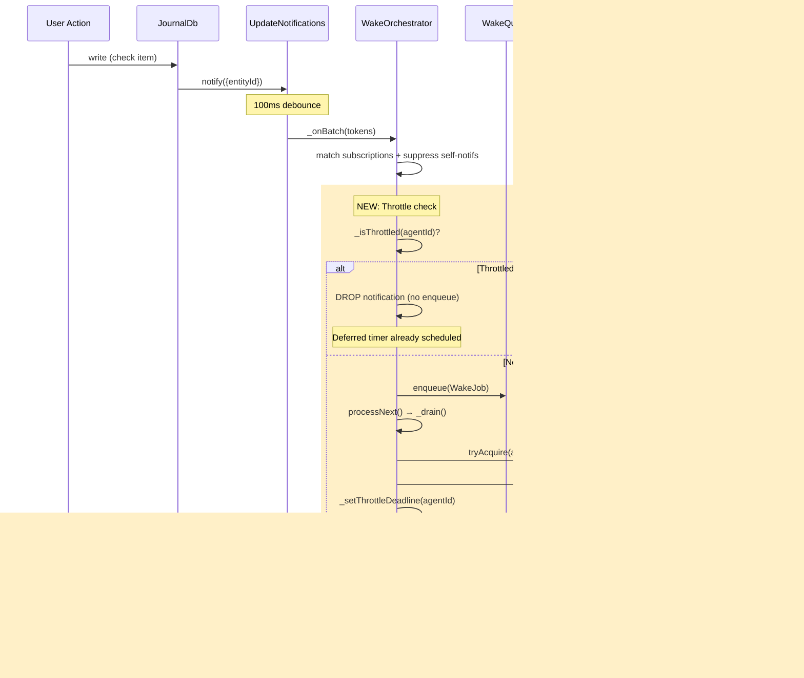

# Agent Throttling and Manual Trigger Controls

## Context

Currently, any mutation in a task's world state (checking off checklist items, adding audio recordings, etc.) triggers an immediate agent wake via `WakeOrchestrator._onBatch()`. Users often perform multiple mutations in a short window, causing:

1. **High token consumption** — multiple LLM calls in rapid succession
2. **Poor UX** — reports refresh too frequently, system overload

This plan introduces a 300-second (5-minute) throttle gate that ensures at most one agent execution per 300s window, plus a "Run Now" button for manual bypass.

---

## Architecture Overview

### Current Flow (What Exists)


### New Flow (With Throttle Gate)



### Manual "Run Now" Bypass


### Throttle State Machine


### UI Component Interaction


### App Backgrounding Resilience


---

## Implementation Plan

### Step 1: Add Throttle Logic to WakeOrchestrator

**File:** `lib/features/agents/wake/wake_orchestrator.dart`

Add these new fields and methods to `WakeOrchestrator`:

```dart
// New fields:
final _throttleDeadlines = <String, DateTime>{};
final _deferredDrainTimers = <String, Timer>{};
static const throttleWindow = Duration(seconds: 300);
```

**New methods:**

- `bool _isThrottled(String agentId)` — checks `_throttleDeadlines[agentId]` against `clock.now()`
- `Future<void> _setThrottleDeadline(String agentId)` — sets deadline in cache + persists to `AgentStateEntity.nextWakeAt` via repository
- `void setThrottleDeadline(String agentId, DateTime deadline)` — public, for startup hydration
- `void clearThrottle(String agentId)` — removes deadline + cancels deferred timer

**Insertion points:**

1. **`_onBatch()`:** After subscription match + suppression check, before run key derivation:
   ```dart
   if (_isThrottled(sub.agentId)) continue;
   ```

2. **`_drain()`:** After suppression re-check, before `_executeJob`:
   ```dart
   if (job.reason == WakeReason.subscription.name && _isThrottled(job.agentId)) {
     runner.release(job.agentId);
     continue;
   }
   ```

3. **`_executeJob()`:** After successful status update, only for subscription wakes:
   ```dart
   if (job.reason == WakeReason.subscription.name) {
     await _setThrottleDeadline(job.agentId);
     _scheduleDeferredDrain(job.agentId);
   }
   ```

4. **`enqueueManualWake()`:** Clear throttle before enqueue:
   ```dart
   clearThrottle(agentId);
   ```

5. **`removeSubscriptions()`:** Add cleanup:
   ```dart
   _throttleDeadlines.remove(agentId);
   _deferredDrainTimers[agentId]?.cancel();
   _deferredDrainTimers.remove(agentId);
   ```

6. **`stop()`:** Cancel all deferred timers:
   ```dart
   for (final timer in _deferredDrainTimers.values) { timer.cancel(); }
   _deferredDrainTimers.clear();
   ```

**New method `_scheduleDeferredDrain`:**
Schedules a `Timer` at the throttle deadline to call `processNext()`, ensuring notifications that arrived during the cooldown are eventually processed.

### Step 2: Hydrate Throttle State on Startup

**File:** `lib/features/agents/state/agent_providers.dart`

In `agentInitialization` provider (where `reconstructSubscriptions` and subscription restoration happens), after restoring each agent's subscriptions, read `AgentStateEntity.nextWakeAt` and call `orchestrator.setThrottleDeadline(agentId, deadline)` if still in the future.

### Step 3: Persist Throttle Deadline

**Key insight:** The `AgentStateEntity` already has a `nextWakeAt` field (line 38 of `agent_domain_entity.dart`) that is currently unused in gating logic. We reuse it — no schema migration needed.

**File:** `lib/features/agents/workflow/task_agent_workflow.dart`

The workflow already persists state after execution (line ~399-405). The `_setThrottleDeadline` method in the orchestrator will handle persisting `nextWakeAt` separately, keeping the throttle concern in the orchestrator layer.

### Step 4: Update Task Header Widget

**File:** `lib/features/tasks/ui/header/task_header_meta_card.dart`

Convert `_TaskAgentChip` from `ConsumerWidget` to `ConsumerStatefulWidget` to host a `Timer.periodic` for countdown ticking.

**New widget states:**

| State | Avatar | Label | Action |
|---|---|---|---|
| No agent | — | "Create Agent" | Create |
| Running | Spinner | "Agent" | Navigate |
| Throttled (countdown > 0) | Robot icon | "Agent 4:32" | Navigate + "Run Now" |
| Idle (no countdown) | Robot icon | "Agent" | Navigate + "Run Now" |

**Changes:**
- Add `ref.watch(agentStateProvider(agentId))` to extract `lastWakeAt`
- Compute countdown: `(lastWakeAt + throttleWindow) - now`
- `Timer.periodic(1s)` drives countdown text (`setState`)
- `ref.listen(agentStateProvider)` restarts timer when `lastWakeAt` changes
- Cancel timer when running or on dispose
- Add `IconButton(Icons.play_arrow_rounded)` for "Run Now" → calls `triggerReanalysis`
- Format countdown as `"m:ss"` using tabular figures for stable width

**Helper:**
```dart
String _formatCountdown(int totalSeconds) {
  final m = totalSeconds ~/ 60;
  final s = totalSeconds % 60;
  return '$m:${s.toString().padLeft(2, '0')}';
}
```

### Step 5: Localization

**Files:** All ARB files in `lib/l10n/`

Add labels:
- `taskAgentRunNowTooltip` — "Run now" / "Jetzt ausführen" / "Ejecutar ahora" / "Exécuter maintenant" / "Rulează acum"
- `taskAgentCountdownTooltip` — "Next auto-run in {countdown}" (with informal tone per locale)

Run `make l10n` and `make sort_arb_files`.

### Step 6: Tests

**File:** `test/features/agents/wake/wake_orchestrator_test.dart`

Add test group for throttle scenarios using `fakeAsync` and `clock`:
- Subscription wake sets throttle deadline 300s in future
- Second subscription notification within 300s is dropped (not enqueued)
- Manual wake clears throttle and executes immediately
- After 300s, deferred timer fires and next subscription proceeds
- Creation wake does NOT set throttle
- `removeSubscriptions` clears throttle
- Throttle survives stop/start via persisted `nextWakeAt`

**File:** `test/features/tasks/ui/header/task_header_meta_card_test.dart`

Add/update tests:
- Countdown displays when `lastWakeAt` is recent (within 300s)
- Countdown ticks down (use `fakeAsync`)
- "Run Now" button calls `triggerReanalysis`
- "Run Now" hidden when agent is running
- Countdown hidden when agent is running
- Use `DateTime(2024, 3, 15, 12, 0, 0)` for deterministic dates

---

## Files to Modify

| File | Change |
|---|---|
| `lib/features/agents/wake/wake_orchestrator.dart` | Throttle gate, deadline management, deferred timers, bypass for manual wakes |
| `lib/features/agents/state/agent_providers.dart` | Hydrate throttle on startup in `agentInitialization` |
| `lib/features/tasks/ui/header/task_header_meta_card.dart` | Countdown display, "Run Now" button, convert to StatefulWidget |
| `lib/l10n/app_en.arb` (+ de, es, fr, ro) | New tooltip labels |
| `test/features/agents/wake/wake_orchestrator_test.dart` | Throttle scenario tests |
| `test/features/tasks/ui/header/task_header_meta_card_test.dart` | Countdown + "Run Now" UI tests |

## Key Design Decisions

1. **Wall-clock DateTime, not duration-based timer** — `nextWakeAt` (absolute timestamp) survives app backgrounding, restarts, and widget re-renders naturally. Just compare `clock.now()` against persisted value.

2. **Reuse existing `AgentStateEntity.nextWakeAt` field** — no schema migration, no new model fields. Currently unused in gating logic.

3. **Throttle only subscription-triggered wakes** — manual wakes (reanalysis, creation) bypass the throttle and don't set a new deadline. This ensures user-initiated actions always work instantly.

4. **In-memory cache + DB persistence** — `_throttleDeadlines` map provides fast `_isThrottled()` checks without DB reads on every notification. Hydrated from DB on startup.

5. **Drop-not-defer for notifications** — during throttle window, new subscription notifications are dropped in `_onBatch()`, not queued. A deferred timer at the deadline fires `processNext()` to pick up any subsequent changes naturally.

6. **Countdown from `lastWakeAt` in UI** — the widget computes countdown client-side from `lastWakeAt + 300s`, avoiding a separate countdown provider. The existing `agentStateProvider` already auto-refreshes via `agentUpdateStream`.

## Verification

1. Run `make analyze` — zero warnings
2. Run `dart format .` — clean
3. Run targeted tests: `fvm flutter test test/features/agents/wake/wake_orchestrator_test.dart`
4. Run targeted tests: `fvm flutter test test/features/tasks/ui/header/task_header_meta_card_test.dart`
5. Manual verification: create a task agent, trigger mutations, observe 300s throttle + countdown in UI, tap "Run Now" to verify bypass
