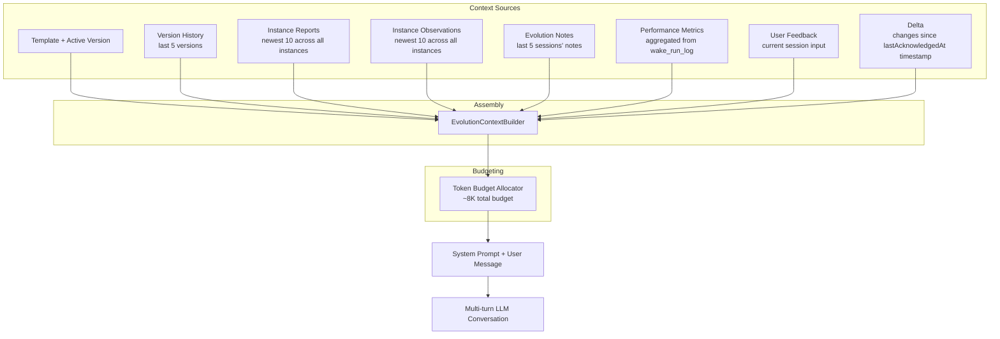
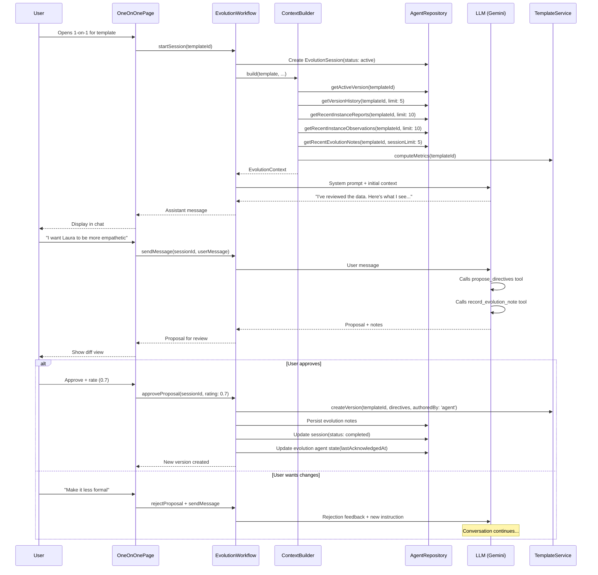
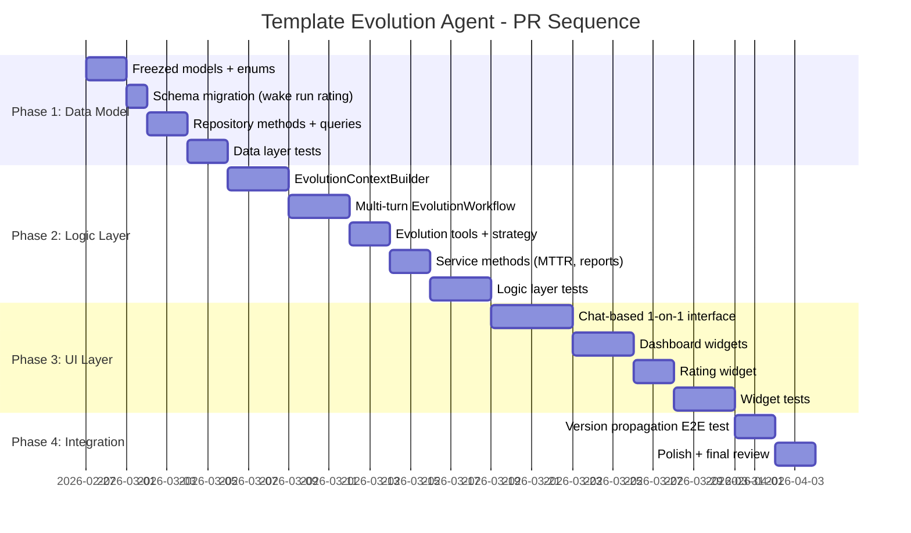

# Template Evolution Agent Lifecycle

**Date:** 2026-02-26
**Status:** Draft
**Scope:** Multi-phase implementation plan for transitioning template improvement from one-shot actions to a full lifecycle managed by a dedicated Template Evolution Agent.

---

## Table of Contents

1. [Current State Analysis](#current-state-analysis)
2. [Phase 1: Data Model & Database Changes](#phase-1-data-model--database-changes)
3. [Phase 2: Architecture & Logic Layer](#phase-2-architecture--logic-layer)
4. [Phase 3: Generative UI & Dashboard Widgets](#phase-3-generative-ui--dashboard-widgets)
5. [Phase 4: Testing Strategy](#phase-4-testing-strategy)
6. [Appendix: Implementation Sequence](#appendix-implementation-sequence)

---

## Current State Analysis

### What exists

| Component | Status | Location |
|-----------|--------|----------|
| `AgentTemplateEntity` | Complete | `agent_domain_entity.dart` |
| `AgentTemplateVersionEntity` | Complete | `agent_domain_entity.dart` (version int, directives, authoredBy, status) |
| `AgentTemplateHeadEntity` | Complete | Mutable head pointer to active version |
| `TemplatePerformanceMetrics` | Complete | Aggregated from `wake_run_log` (totalWakes, successRate, avgDuration, etc.) |
| `TemplateEvolutionWorkflow` | One-shot | Single-turn LLM call, no history, no observations, no session tracking |
| `AgentOneOnOnePage` | Basic | Metrics dashboard + 3-field feedback form + propose/approve flow |
| `AgentTemplateService` | Complete | createTemplate, createVersion, rollback, computeMetrics, seedDefaults |
| Template provenance | Complete | `wake_run_log.template_id` + `wake_run_log.template_version_id` |

### What's missing

- **No evolution history:** The evolution workflow is stateless — no record of past sessions, feedback given, or proposals rejected.
- **No delta tracking:** No monotonic counter to efficiently identify "what changed since last check."
- **No cross-instance observation aggregation:** The evolution workflow sees only `TemplatePerformanceMetrics` (aggregate numbers), not the actual reports/observations from individual agent instances.
- **No internal notes for the evolution agent:** The evolution agent has no persistent memory across sessions.
- **No rich UI:** The one-on-one page is a simple form, not a chat-based session interface.
- **No dashboard widgets:** No growth chart, activity widget, rating widget, or MTTR display.

---

## Phase 1: Data Model & Database Changes

**PR scope:** New/modified freezed models, drift schema additions, repository methods. No UI or workflow changes.

### 1.0 Architecture: Long-Running Evolution Agent

Each template has a **single long-running evolution agent** identity (Phase 2). In Phase 1, evolution sessions and notes are **template-owned** — their `agentId` field stores the template's ID directly, enabling simple `WHERE agent_id = :templateId` queries without `agent_links` joins. This agent:

- Lives as long as the template exists — it is **not** short-lived per session.
- Carries `lastAcknowledgedAt: DateTime?` on its **`AgentStateEntity`** (Phase 2), tracking the delta cutoff for "what changed since last check."
- Owns all conversation messages (`AgentMessageEntity`) for the 1-on-1 chat, threaded by session ID.
- Persists `EvolutionNoteEntity` records as its long-term reasoning journal.

**`EvolutionSessionEntity`** is a **lightweight metadata record** — it tracks each 1-on-1 conversation's status, user rating, and proposed version, but it is not an agent itself.

#### Cross-Device Sync & Continuation

The 1-on-1 conversation is fully syncable across devices:

1. **Messages** are `AgentMessageEntity` records (in `agent_entities`, synced via vector clocks). The `threadId` field links them to a session.
2. **Session metadata** (`EvolutionSessionEntity`) syncs the same way — another device sees `status: active` and knows there's an open session.
3. **LLM context reconstruction**: When continuing on another device, the workflow loads stored messages from the DB and replays them into a fresh LLM context. This works because evolution conversations are short (a few turns) and the context builder assembles the system prompt from DB queries.

**Tradeoff:** The LLM doesn't "remember" — it reconstructs from stored messages. This is the standard pattern for stateless LLM APIs and is fine for evolution conversations that are typically 3–10 turns.

### 1.1 Evolution Session Entity

A lightweight metadata record for each one-on-one session between user and evolution agent. The `agentId` field stores the owning **template's ID**, enabling direct SQL lookups via `getEvolutionSessionsByTemplate`. The conversation messages live as `AgentMessageEntity` records threaded by session ID.

```dart
/// A tracked evolution session — lightweight metadata for a 1-on-1
/// conversation between the user and the evolution agent.
///
/// The [agentId] field stores the owning template's ID. The actual
/// conversation messages are stored as [AgentMessageEntity] records
/// with [threadId] set to this session's [id].
const factory AgentDomainEntity.evolutionSession({
  required String id,
  required String agentId,       // template ID
  required String templateId,
  required int sessionNumber,    // monotonic per template
  required EvolutionSessionStatus status, // active, completed, abandoned
  required DateTime createdAt,
  required DateTime updatedAt,
  required VectorClock? vectorClock,
  String? proposedVersionId,     // links to version if approved
  String? feedbackSummary,       // structured JSON of user feedback
  double? userRating,            // 0.0–1.0 normalized score
  DateTime? completedAt,
  DateTime? deletedAt,
}) = EvolutionSessionEntity;
```

New enum in `agent_enums.dart`:

```dart
enum EvolutionSessionStatus { active, completed, abandoned }
```

**Storage:** Serialized into `agent_entities` table with `type = 'evolutionSession'`.

### 1.2 Evolution Note Entity

Internal notes ("shrink notes") — the evolution agent's private reasoning journal across sessions.

```dart
/// The evolution agent's private reasoning note.
const factory AgentDomainEntity.evolutionNote({
  required String id,
  required String agentId,       // template ID
  required String sessionId,     // links to evolution session
  required EvolutionNoteKind kind, // reflection, hypothesis, decision, pattern
  required DateTime createdAt,
  required VectorClock? vectorClock,
  required String content,       // markdown text
  DateTime? deletedAt,
}) = EvolutionNoteEntity;
```

New enum:

```dart
enum EvolutionNoteKind { reflection, hypothesis, decision, pattern }
```

**Storage:** `type = 'evolutionNote'`, `subtype` = kind name.

### 1.3 Timestamp-Based Delta Tracking

The `change_counter` approach was rejected (device-local, not sync-safe). Vector clocks were considered but can't be used for SQL-level lookup and sorting (partial order, stored as JSON).

Instead, the **evolution agent's `AgentStateEntity`** (Phase 2) will carry a `lastAcknowledgedAt: DateTime?` field. The evolution agent queries for entities updated after this timestamp using the existing `updated_at` column (already indexed). This is sync-safe because timestamps are set by the originating device and synced along with the entity.

**No schema change needed** — the `updated_at` column already exists and is indexed.

**Tradeoff:** Minor clock skew between devices could cause an entity to be re-processed or missed. This is acceptable because:
- Evolution sessions run infrequently (user-initiated)
- Sync typically completes before the user opens a 1-on-1 session
- Re-processing an entity is idempotent

### 1.4 Acknowledgement Tracking on Evolution Agent State

The `lastAcknowledgedAt` timestamp lives on the evolution agent's **`AgentStateEntity`** (not on the session entity). This allows the long-running agent to track its delta cursor across sessions.

This field will be added in Phase 2 when the evolution agent identity and state are created. Phase 1 only provides the session and note entities — the evolution agent itself is a Phase 2 concern.

### 1.5 Instance Report Snapshot Entity

To feed the evolution agent with actual agent output (not just aggregate metrics), we need a way to collect the N most recent reports from instances assigned to a template.

This requires **no new entity** — we already have `AgentReportEntity` with `agentId` and `scope = 'current'`. We add a **new query** that joins through links:

```sql
getRecentReportsByTemplate:
  SELECT ae.* FROM agent_entities ae
  INNER JOIN agent_links al ON al.to_id = ae.agent_id AND al.type = 'template_assignment'
  WHERE al.from_id = :templateId
  AND ae.type = 'agentReport'
  AND ae.subtype = 'current'
  AND ae.deleted_at IS NULL
  AND al.deleted_at IS NULL
  ORDER BY ae.created_at DESC
  LIMIT :limit;
```

### 1.6 User Rating on wake_run_log

Extend `wake_run_log` with an optional user satisfaction score:

```sql
ALTER TABLE wake_run_log ADD COLUMN user_rating REAL;
ALTER TABLE wake_run_log ADD COLUMN rated_at DATETIME;
```

This allows per-wake rating that feeds into MTTR and satisfaction calculations.

### 1.7 Entity Relationship Diagram

```mermaid
erDiagram
    AgentTemplateEntity ||--o{ AgentTemplateVersionEntity : "has versions"
    AgentTemplateEntity ||--|| AgentTemplateHeadEntity : "active version pointer"
    AgentTemplateEntity ||--o{ EvolutionSessionEntity : "sessions (agentId = template ID)"
    AgentTemplateEntity ||--o{ EvolutionNoteEntity : "notes (agentId = template ID)"
    AgentTemplateEntity ||--o{ TaskAgentIdentity : "template_assignment link"

    AgentTemplateEntity ..o| EvolutionAgentIdentity : "Phase 2: evolution agent"
    EvolutionAgentIdentity ||--|| AgentStateEntity : "Phase 2: durable state (lastAcknowledgedAt)"
    EvolutionAgentIdentity ||--o{ AgentMessageEntity : "conversation messages"

    EvolutionSessionEntity ||--o{ EvolutionNoteEntity : "session notes"
    EvolutionSessionEntity ||--o{ AgentMessageEntity : "threaded by session ID"
    EvolutionSessionEntity ||--o| AgentTemplateVersionEntity : "proposed version"

    TaskAgentIdentity ||--|| AgentStateEntity : "durable state"
    TaskAgentIdentity ||--o{ AgentReportEntity : "wake reports"
    TaskAgentIdentity ||--o{ AgentMessageEntity : "observations"

    AgentTemplateVersionEntity {
        string id PK
        string agentId FK "template ID"
        int version
        string status "active|archived"
        string directives
        string authoredBy "system|user|agent"
    }

    EvolutionSessionEntity {
        string id PK
        string agentId FK "template ID"
        string templateId FK
        int sessionNumber
        string status "active|completed|abandoned"
        double userRating "0.0-1.0"
        string feedbackSummary
    }

    EvolutionNoteEntity {
        string id PK
        string sessionId FK
        string kind "reflection|hypothesis|decision|pattern"
        string content
    }

    AgentReportEntity {
        string id PK
        string agentId FK "instance agent ID"
        string scope "current"
        string content "markdown"
    }
```

### 1.8 Summary of Schema Changes

| Change | Type | Version bump? |
|--------|------|---------------|
| `EvolutionSessionEntity` variant | Freezed model + serialization | No (stored in existing table) |
| `EvolutionNoteEntity` variant | Freezed model + serialization | No (stored in existing table) |
| `EvolutionSessionStatus` enum | New enum | No |
| `EvolutionNoteKind` enum | New enum | No |
| `user_rating` + `rated_at` on `wake_run_log` | Schema migration | **Yes** |
| New named queries | `.drift` file | No |
| `AgentDbConversions` updates | Deserialization cases | No |
| `AgentRepository` new methods | Service layer | No |

---

## Phase 2: Architecture & Logic Layer

**PR scope:** `TemplateEvolutionAgent` lifecycle, context assembly, multi-turn session management. No UI changes.

### 2.1 Template Evolution Agent Lifecycle


### 2.2 Context Assembly Pipeline

The evolution agent needs rich context to make informed proposals. This pipeline assembles it from multiple sources while respecting the N=10 limit for LLM context.



### 2.3 EvolutionContextBuilder

New class in `lib/features/agents/workflow/evolution_context_builder.dart`:

```dart
class EvolutionContextBuilder {
  /// Assembles evolution context from all sources.
  ///
  /// Token budget allocation (approximate):
  /// - System prompt scaffold: ~500 tokens (fixed)
  /// - Current directives: ~500 tokens
  /// - Version history summaries (5): ~300 tokens
  /// - Instance reports (10): ~3000 tokens
  /// - Instance observations (10): ~1000 tokens
  /// - Evolution notes (last 5 sessions): ~1000 tokens
  /// - Performance metrics: ~200 tokens
  /// - User feedback: ~500 tokens
  /// - Delta summary: ~500 tokens
  /// - Headroom for response: ~500 tokens
  Future<EvolutionContext> build({
    required AgentTemplateEntity template,
    required AgentTemplateVersionEntity currentVersion,
    required List<AgentTemplateVersionEntity> recentVersions,
    required List<AgentReportEntity> instanceReports,
    required List<String> instanceObservations,
    required List<EvolutionNoteEntity> pastNotes,
    required TemplatePerformanceMetrics metrics,
    required EvolutionFeedback feedback,
    required int changesSinceLastSession,
  });
}
```

### 2.4 Data Fetching Service

New methods on `AgentTemplateService`:

```dart
/// Fetch the N most recent reports from all instances of this template.
/// Returns reports sorted newest-first, capped to [limit].
Future<List<AgentReportEntity>> getRecentInstanceReports(
  String templateId, {
  int limit = 10,
});

/// Fetch the N most recent observations from all instances of this template.
/// Returns observation text strings sorted newest-first, capped to [limit].
Future<List<String>> getRecentInstanceObservations(
  String templateId, {
  int limit = 10,
});

/// Fetch evolution notes from recent sessions.
/// Returns notes from the last [sessionLimit] sessions, sorted newest-first.
Future<List<EvolutionNoteEntity>> getRecentEvolutionNotes(
  String templateId, {
  int sessionLimit = 5,
});

/// Get the count of changes since a given timestamp for a template's instances.
Future<int> countChangesSince(String templateId, DateTime? since);
```

### 2.5 Multi-Turn Evolution Workflow

Replace the single-turn `proposeEvolution` with a session-aware multi-turn workflow:

```dart
class TemplateEvolutionWorkflow {
  // ... existing dependencies ...

  /// Start a new evolution session.
  /// Creates an EvolutionSession entity and returns its ID.
  Future<String> startSession(String templateId);

  /// Send a message in an active evolution session.
  /// The workflow maintains conversation state across calls within a session.
  /// Returns the assistant's response text.
  Future<String?> sendMessage({
    required String sessionId,
    required String userMessage,
  });

  /// Extract the current proposal from the conversation, if any.
  /// The agent uses a tool call (propose_directives) to formally propose.
  EvolutionProposal? getCurrentProposal(String sessionId);

  /// Approve the current proposal, creating a new template version.
  /// Records evolution notes and marks the session complete.
  Future<AgentTemplateVersionEntity> approveProposal({
    required String sessionId,
    required double? userRating,
  });

  /// Reject the current proposal, returning to conversation.
  void rejectProposal(String sessionId);

  /// Abandon the session without creating a version.
  Future<void> abandonSession(String sessionId);
}
```

### 2.6 Evolution Agent Tools

The evolution agent gets its own tool registry (separate from task agent tools):

```dart
class EvolutionToolRegistry {
  static final tools = [
    // Formally propose new directives (structured output)
    ToolDefinition(
      name: 'propose_directives',
      description: 'Propose a new version of the template directives.',
      parameters: {
        'directives': 'The complete proposed directives text',
        'rationale': 'Brief explanation of what changed and why',
      },
    ),

    // Record an evolution note (agent's private journal)
    ToolDefinition(
      name: 'record_evolution_note',
      description: 'Record a private evolution note for future sessions.',
      parameters: {
        'kind': 'reflection | hypothesis | decision | pattern',
        'content': 'The note content (markdown)',
      },
    ),

    // Request specific instance data (agent-driven exploration)
    ToolDefinition(
      name: 'fetch_instance_detail',
      description: 'Fetch detailed report and observations for a specific agent instance.',
      parameters: {
        'agentId': 'The agent instance ID to inspect',
      },
    ),
  ];
}
```

### 2.7 Data Flow: User ↔ Evolution Agent ↔ Template



### 2.8 Version Propagation to New Instances


**Key insight:** Existing agent instances automatically pick up the new version on their next wake because `TaskAgentWorkflow._resolveTemplate` always reads through the head pointer. No migration or restart needed.

### 2.9 Scalability: The N=10 Strategy

The context window budget is managed by the `EvolutionContextBuilder` with hard caps:

| Data source | Cap | Rationale |
|-------------|-----|-----------|
| Current directives | 1 (full) | Always included, it's what we're evolving |
| Version history | 5 versions | Show trajectory, not full history |
| Instance reports | 10 newest | Representative sample across instances |
| Instance observations | 10 newest | Cross-instance patterns |
| Evolution notes | 5 sessions | Recent reasoning continuity |
| Performance metrics | 1 aggregate | Single metrics object |
| Delta count | 1 number | "47 changes since your last session" |

For templates with hundreds of instances, the `getRecentInstanceReports` query already orders by `created_at DESC LIMIT 10`, so the DB does the heavy lifting. The evolution agent sees a representative window, not the full history.

The `lastAcknowledgedAt` timestamp on the evolution agent's state means the agent can say "I last looked at time T, show me what's new" — and the query filters by `updated_at > T`, regardless of total instance count.

---

## Phase 3: Generative UI & Dashboard Widgets

**PR scope:** Chat-based 1-on-1 interface, dashboard widgets. No model or service changes.

### 3.1 Chat-Based One-on-One Interface

Replace the current form-based `AgentOneOnOnePage` with a chat interface that supports dynamic components.


**Chat message types** (rendered differently based on content):

| Type | Rendering |
|------|-----------|
| `system` | Gray card with icon, non-interactive |
| `assistant` | Left-aligned bubble with markdown rendering |
| `user` | Right-aligned bubble |
| `proposal` | Full-width diff card with approve/reject buttons |
| `metrics` | Inline metrics dashboard card |
| `rating` | Full-width rating slider widget |

### 3.2 Growth Chart Widget

A compact card showing agent creation velocity — agents created this week vs. last week.

```dart
class AgentGrowthChart extends ConsumerWidget {
  // Queries wake_run_log for distinct agent_ids grouped by week.
  // Renders a simple bar comparison or spark line.
  //
  // Data source: New provider
  //   agentGrowthData(templateId) → { thisWeek: int, lastWeek: int, trend: double }
}
```

**Visual spec:**
- Two horizontal bars (this week / last week) with labels
- Color-coded: green if growth, amber if flat, red if decline
- Compact: fits in a 140px-tall card

### 3.3 Activity Widget

List of currently active, non-resolved agent instances for a template.

```dart
class ActiveInstancesWidget extends ConsumerWidget {
  // Queries agent_links (template_assignment) joined with agent_entities
  // where lifecycle != destroyed.
  //
  // Shows: agent displayName, task title, last wake time, status chip
  // Tappable: navigates to AgentDetailPage
}
```

**New provider:**

```dart
@riverpod
Future<List<ActiveInstanceInfo>> activeTemplateInstances(
  Ref ref,
  String templateId,
);
```

Where `ActiveInstanceInfo` is a lightweight data class:

```dart
class ActiveInstanceInfo {
  final String agentId;
  final String displayName;
  final String? taskTitle;
  final DateTime? lastWakeAt;
  final AgentLifecycle lifecycle;
  final int wakeCount;
}
```

### 3.4 Rating Widget

A full-width horizontal scale (0.0 to 1.0) for user feedback on template performance.

```dart
class TemplateRatingWidget extends StatefulWidget {
  // Full-width horizontal slider with labeled anchors:
  //   0.0 = "Needs work"
  //   0.5 = "Adequate"
  //   1.0 = "Excellent"
  //
  // Styled with gradient track (red → yellow → green)
  // Haptic feedback on discrete stops (0.1 increments)
  // Current value displayed as percentage above thumb
  //
  // onChanged callback propagates to EvolutionSession.userRating
}
```

### 3.5 Performance Metrics / MTTR Widget

Extends the existing `_MetricsDashboard` with MTTR calculation.

**MTTR calculation:**

```dart
/// Mean Time to Resolution for tasks managed by instances of this template.
///
/// Computed from journal-domain tasks linked to agent instances:
///   MTTR = average(task.completedAt - task.createdAt)
///          for resolved tasks where an agent instance is assigned.
Future<Duration?> computeMTTR(String templateId);
```

**Implementation in `AgentTemplateService`:**

1. Get all agent IDs linked to template via `template_assignment`
2. Get task IDs linked to those agents via `agent_task`
3. Query journal DB for those tasks where `status = done`
4. Calculate `average(updatedAt - createdAt)` for resolved tasks

**Widget enhancement:**

```dart
// Add to existing _MetricsDashboard:
_MetricCard(
  label: 'MTTR',
  value: mttr != null
    ? formatDuration(mttr) // e.g., "2d 4h" or "45m"
    : 'N/A',
),
```

### 3.6 Dashboard Layout


---

## Phase 4: Testing Strategy

### 4.1 Unit Tests: Data Layer

| Test file | Coverage target |
|-----------|----------------|
| `test/features/agents/model/evolution_session_entity_test.dart` | Serialization roundtrip, status transitions |
| `test/features/agents/model/evolution_note_entity_test.dart` | Serialization roundtrip, kind enum |
| `test/features/agents/database/agent_repository_evolution_test.dart` | CRUD, soft-delete exclusion, cross-instance queries, wake run rating |
| `test/features/agents/database/agent_database_test.dart` | Schema migration v1→v2 (user_rating, rated_at columns) |

### 4.2 Unit Tests: Service Layer

| Test file | Coverage target |
|-----------|----------------|
| `test/features/agents/workflow/evolution_context_builder_test.dart` | Budget allocation, cap enforcement, empty data handling |
| `test/features/agents/workflow/template_evolution_workflow_test.dart` | Session lifecycle (start → message → propose → approve), multi-turn state, abandon flow |
| `test/features/agents/service/agent_template_service_evolution_test.dart` | `getRecentInstanceReports`, `getRecentInstanceObservations`, `computeMTTR`, `countChangesSince` |

### 4.3 Integration Test: Version Propagation (Success Criterion)

This is the critical end-to-end test. Success = **creating a new version and verifying the next instance uses it**.

```dart
/// test/features/agents/integration/version_propagation_test.dart
///
/// Scenario:
/// 1. Create template "TestBot" with version 1 directives "Be helpful"
/// 2. Create task agent instance A assigned to TestBot
/// 3. Verify A resolves to version 1
/// 4. Start evolution session for TestBot
/// 5. Approve proposal → creates version 2 "Be helpful and concise"
/// 6. Create task agent instance B assigned to TestBot
/// 7. Verify B resolves to version 2 (NOT version 1)
/// 8. Trigger wake on instance A
/// 9. Verify A's wake_run_log records template_version_id = version 2
```

```dart
test('new instances pick up evolved template version', () async {
  // 1. Seed template with v1
  final template = await templateService.createTemplate(
    displayName: 'TestBot',
    kind: AgentTemplateKind.taskAgent,
    modelId: 'test-model',
    directives: 'Be helpful',
    authoredBy: 'test',
  );

  // 2. Create instance A
  final agentA = await taskAgentService.createTaskAgent(
    taskIdA,
    allowedCategoryIds: {},
    templateId: template.id,
  );

  // 3. Verify A sees v1
  final v1 = await templateService.getActiveVersion(template.id);
  expect(v1!.directives, 'Be helpful');

  // 4-5. Evolve: create v2
  final v2 = await templateService.createVersion(
    templateId: template.id,
    directives: 'Be helpful and concise',
    authoredBy: 'agent',
  );

  // 6. Create instance B
  final agentB = await taskAgentService.createTaskAgent(
    taskIdB,
    allowedCategoryIds: {},
    templateId: template.id,
  );

  // 7. Verify head points to v2
  final activeVersion = await templateService.getActiveVersion(template.id);
  expect(activeVersion!.directives, 'Be helpful and concise');
  expect(activeVersion.version, 2);

  // 8-9. Verify wake provenance would record v2
  // (This is already tested by existing wake_run_log provenance tests,
  //  but we verify the resolution path here)
  final resolvedVersion = await templateService.getActiveVersion(template.id);
  expect(resolvedVersion!.id, v2.id);
});
```

### 4.4 Widget Tests

| Test file | Coverage target |
|-----------|----------------|
| `test/features/agents/ui/agent_one_on_one_page_test.dart` | Chat rendering, message types, proposal diff display, rating widget interaction |
| `test/features/agents/ui/widgets/agent_growth_chart_test.dart` | Bar rendering with various data states (growth, decline, zero) |
| `test/features/agents/ui/widgets/active_instances_widget_test.dart` | List rendering, empty state, navigation on tap |
| `test/features/agents/ui/widgets/template_rating_widget_test.dart` | Slider interaction, value display, callback invocation |
| `test/features/agents/ui/widgets/mttr_widget_test.dart` | Duration formatting, N/A state |

### 4.5 Test Infrastructure Additions

Add to `test/features/agents/test_utils.dart`:

```dart
EvolutionSessionEntity makeTestEvolutionSession({
  String? id,
  String? templateId,
  int sessionNumber = 1,
  EvolutionSessionStatus status = EvolutionSessionStatus.active,
  double? userRating,
});

EvolutionNoteEntity makeTestEvolutionNote({
  String? id,
  String? sessionId,
  EvolutionNoteKind kind = EvolutionNoteKind.reflection,
  String content = 'Test note',
});
```

---

## Appendix: Implementation Sequence



### PR Breakdown

| PR | Title | Dependencies |
|----|-------|-------------|
| **PR 1** | `feat: evolution session & note entities + wake run rating` | None |
| **PR 2** | `feat: evolution context builder & data fetching` | PR 1 |
| **PR 3** | `feat: multi-turn evolution workflow & tools` | PR 2 |
| **PR 4** | `feat: chat-based 1-on-1 interface` | PR 3 |
| **PR 5** | `feat: dashboard widgets (growth, activity, rating, MTTR)` | PR 4 |
| **PR 6** | `test: version propagation integration test` | PR 3+ |

### Localization Keys Needed

New arb keys (all 5 languages):
- `agentEvolutionSessionStarted` — "Starting evolution session..."
- `agentEvolutionChatPlaceholder` — "Share feedback or ask about performance..."
- `agentEvolutionProposalTitle` — "Proposed Changes"
- `agentEvolutionRatingPrompt` — "How well is this template performing?"
- `agentEvolutionRatingExcellent` / `Adequate` / `NeedsWork`
- `agentEvolutionMTTR` — "Mean Time to Resolution"
- `agentEvolutionGrowthTitle` — "Agent Growth"
- `agentEvolutionActiveTitle` — "Active Instances"
- `agentEvolutionNoteKindReflection` / `Hypothesis` / `Decision` / `Pattern`
- `agentEvolutionSessionCompleted` — "Session completed — version {version} created"
- `agentEvolutionSessionAbandoned` — "Session ended without changes"
