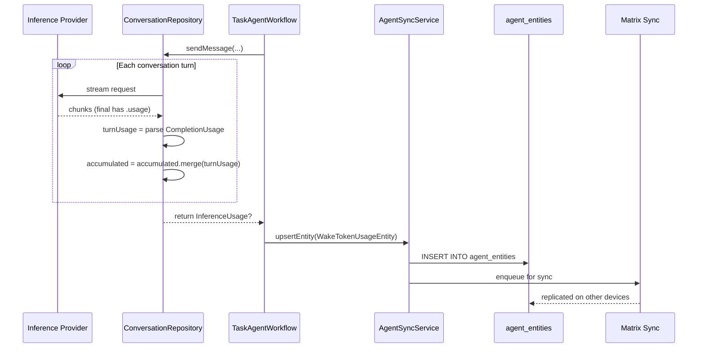
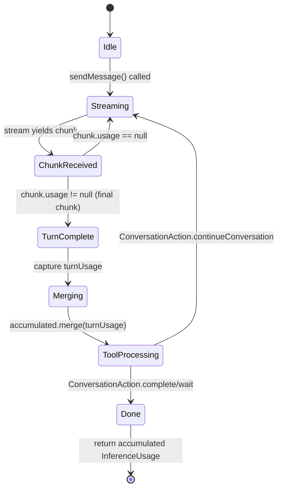
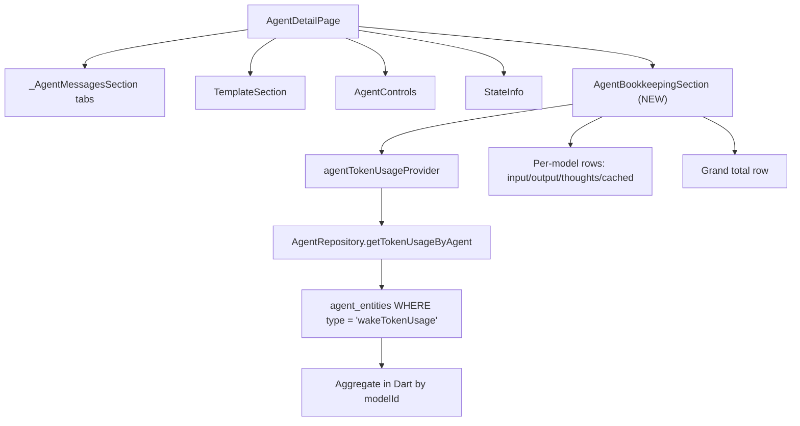

# Agent Token Usage Tracking

**Date**: 2026-02-27
**Branch**: `fest/track_token_costs`
**ADR**: [0007-token-usage-wake-run-log-storage](../adr/0007-token-usage-wake-run-log-storage.md)

## Context

The core agent infrastructure is live. Agents execute wake cycles that invoke LLM inference via `ConversationRepository.sendMessage()`, but token usage from these calls is currently discarded. We need to capture, persist, and display token usage data synced across all devices — so that each template's weekly cost is visible in the 1-on-1 evolution chat regardless of which device ran inference.

## Architecture

Token usage is stored as `AgentDomainEntity.wakeTokenUsage` — a new freezed variant that flows through the existing Matrix sync pipeline. Each wake cycle produces exactly one immutable entity. The `templateId` and `templateVersionId` fields enable per-template aggregation.

## Data Flow



## Usage Accumulation State Machine



## UI Integration



---

## Phase 1: Data Structures & Entity Variant

### 1.1 Add JSON serialization to `InferenceUsage`

**File**: `lib/features/ai/model/inference_usage.dart`

Add `toJson()`, `fromJson()`, `==`, `hashCode` to the existing plain class.

### 1.2 New freezed variant: `wakeTokenUsage`

**File**: `lib/features/agents/model/agent_domain_entity.dart`

```dart
const factory AgentDomainEntity.wakeTokenUsage({
  required String id,
  required String agentId,
  required String runKey,
  required String threadId,
  required String modelId,
  required DateTime createdAt,
  required VectorClock? vectorClock,
  String? templateId,
  String? templateVersionId,
  int? inputTokens,
  int? outputTokens,
  int? thoughtsTokens,
  int? cachedInputTokens,
  DateTime? deletedAt,
}) = WakeTokenUsageEntity;
```

### 1.3 Update `AgentDbConversions`

**File**: `lib/features/agents/database/agent_db_conversions.dart`

Add `wakeTokenUsage` cases to all `map()` and `mapOrNull()` calls:
- `entityType`: return `'wakeTokenUsage'`
- `entitySubtype`: return `null` (no sub-classification needed)
- `entityCreatedAt`: return `e.createdAt`
- `entityUpdatedAt`: return `e.createdAt` (immutable)
- `toEntityCompanion.deletedAt`: return `e.deletedAt`
- `toEntityCompanion.threadId`: return `e.threadId`

### 1.4 Update `AgentEntityTypes`

**File**: `lib/features/agents/model/agent_constants.dart`

Add `static const wakeTokenUsage = 'wakeTokenUsage';`

### 1.5 Regenerate code

Run `make build_runner`.

### 1.6 Add named query for fetching token usage entities

**File**: `lib/features/agents/database/agent_database.drift`

```sql
getTokenUsageByAgentId: SELECT * FROM agent_entities
  WHERE agent_id = :agentId AND type = 'wakeTokenUsage' AND deleted_at IS NULL
  ORDER BY created_at DESC LIMIT :limit;
```

### Phase 1 Tests
- `InferenceUsage` JSON round-trip, equality, merge
- `WakeTokenUsageEntity` round-trip through `AgentDbConversions`
- Repository: upsert and query `wakeTokenUsage` entities

---

## Phase 2: Capture & Persist Logic

### 2.1 `ConversationRepository.sendMessage()` returns `InferenceUsage?`

**File**: `lib/features/ai/conversation/conversation_repository.dart`

Change return type from `Future<void>` to `Future<InferenceUsage?>`. Inside the while loop, after each stream completes, extract `CompletionUsage` from the final chunk's `usage` field and merge into accumulated `InferenceUsage`. Return the accumulated result.

### 2.2 Persist usage entity in `TaskAgentWorkflow.execute()`

**File**: `lib/features/agents/workflow/task_agent_workflow.dart`

After `sendMessage()` returns, create and persist a `WakeTokenUsageEntity`:
```dart
final usage = await conversationRepository.sendMessage(...);

if (usage != null && usage.hasData) {
  try {
    await syncService.upsertEntity(
      AgentDomainEntity.wakeTokenUsage(
        id: _uuid.v4(),
        agentId: agentId,
        runKey: runKey,
        threadId: threadId,
        modelId: modelId,
        templateId: templateCtx.template.id,
        templateVersionId: templateCtx.version.id,
        createdAt: now,
        vectorClock: null,
        inputTokens: usage.inputTokens,
        outputTokens: usage.outputTokens,
        thoughtsTokens: usage.thoughtsTokens,
        cachedInputTokens: usage.cachedInputTokens,
      ),
    );
  } catch (e) {
    developer.log('Failed to persist token usage: $e', name: 'TaskAgentWorkflow');
  }
}
```

### Phase 2 Tests
- `ConversationRepository`: returns accumulated usage from multi-turn conversation
- `ConversationRepository`: returns null when no usage data
- `TaskAgentWorkflow`: update existing mock to handle new return type; verify entity persisted

---

## Phase 3: UI — Bookkeeping Section

### 3.1 Data model for aggregated usage

**New file**: `lib/features/agents/model/agent_token_usage.dart`

Plain class `AgentTokenUsageSummary` with `modelId`, `inputTokens`, `outputTokens`, `thoughtsTokens`, `cachedInputTokens`, `wakeCount`, computed `totalTokens`.

### 3.2 Repository query method

**File**: `lib/features/agents/database/agent_repository.dart`

Add `getTokenUsageByAgent(agentId)` that fetches `wakeTokenUsage` entities and aggregates in Dart by `modelId`.

### 3.3 Riverpod provider

**New file**: `lib/features/agents/state/agent_token_usage_providers.dart`

```dart
@riverpod
Future<List<AgentTokenUsageSummary>> agentTokenUsage(Ref ref, String agentId)
```

### 3.4 Bookkeeping widget

**New file**: `lib/features/agents/ui/agent_bookkeeping_section.dart`

`AgentBookkeepingSection` — a `ConsumerWidget` matching the existing State info pattern:
- Section heading "Token Usage"
- Per-model rows showing input/output/thoughts/cached token counts
- Grand total row
- "No data yet" message when empty
- Number formatting with thousand separators

### 3.5 Integrate into agent detail page

**File**: `lib/features/agents/ui/agent_detail_page.dart`

Add `AgentBookkeepingSection` as a new section after State info.

### 3.6 Localization

**Files**: `lib/l10n/app_en.arb`, `app_de.arb`, `app_es.arb`, `app_fr.arb`, `app_ro.arb`

Add labels for token usage section.

### Phase 3 Tests
- Provider test: returns correct aggregated data from mocked repository
- Widget test: renders model rows with correct token counts
- Widget test: shows "no data" message when empty

---

## Critical Files

| File | Change |
|------|--------|
| `lib/features/ai/model/inference_usage.dart` | Add toJson/fromJson/equality |
| `lib/features/agents/model/agent_domain_entity.dart` | New `wakeTokenUsage` variant |
| `lib/features/agents/database/agent_db_conversions.dart` | Add cases for new variant |
| `lib/features/agents/model/agent_constants.dart` | Add entity type string |
| `lib/features/agents/database/agent_database.drift` | Add named query |
| `lib/features/ai/conversation/conversation_repository.dart` | sendMessage returns InferenceUsage? |
| `lib/features/agents/workflow/task_agent_workflow.dart` | Create + persist usage entity |
| `lib/features/agents/database/agent_repository.dart` | Query + aggregate method |
| `lib/features/agents/model/agent_token_usage.dart` | New: aggregation data model |
| `lib/features/agents/state/agent_token_usage_providers.dart` | New: Riverpod provider |
| `lib/features/agents/ui/agent_bookkeeping_section.dart` | New: UI widget |
| `lib/features/agents/ui/agent_detail_page.dart` | Add bookkeeping section |
| `lib/l10n/app_*.arb` | Localization strings |

## Verification

1. Run `make build_runner` after freezed/drift changes
2. Run `make l10n` after arb changes
3. `dart-mcp.analyze_files` — must be zero warnings
4. `dart-mcp.dart_format` — must be clean
5. Run targeted tests for each phase before moving to next
