# Implementation Plan: Agentic Work Finalization

## Context

Follow-up to the daily sync to prepare agent features for demo and TestFlight release on iOS/macOS. Four areas need work: (1) model selection defaults, (2) report formatting alignment with task summaries, (3) settings UI restructuring for agents, and (4) agent evolution monitoring visibility.

**Decisions**:
- Routing: Clean replace — remove old `/settings/templates` routes, use `/settings/agents` exclusively.
- Report display: Agent report appears as a **separate section** on the task detail page (AI Task Summary stays independent).

---

## Architecture Overview


---

## Step 1: Fix Model Selection — Default to Gemini Flash & Fix Selector

**Problem**: Multiple issues with model selection:
1. `AgentConfig.modelId` (on agent identity) defaults to `'models/gemini-3.1-pro-preview'` but is a **dead field** — the workflow uses `template.modelId`, not `config.modelId`.
2. `TaskAgentService.createTaskAgent()` (line 93) passes `const AgentConfig()` ignoring the template's model entirely.
3. Seeded defaults (Laura, Tom) hardcode `'models/gemini-3.1-pro-preview'`.
4. The model selector value in the UI is stored on the template correctly, but the duplicate `AgentConfig.modelId` creates confusion about which field is authoritative.


**Changes**:

1. **`lib/features/agents/model/agent_config.dart:14`** — Change default `modelId` from `'models/gemini-3.1-pro-preview'` to `'models/gemini-3-flash-preview'`.

2. **`lib/features/agents/service/task_agent_service.dart:93`** — Pass the template's `modelId` into the `AgentConfig` instead of using `const AgentConfig()`:
   ```dart
   config: AgentConfig(modelId: templateEntity.modelId),
   ```
   This requires reading the `templateEntity` before `createAgent`, which is already done on line 69-75.

3. **`lib/features/agents/service/agent_template_service.dart:518,528`** — Change seeded defaults (Laura, Tom) from `'models/gemini-3.1-pro-preview'` to `'models/gemini-3-flash-preview'`.

4. **`lib/features/agents/ui/agent_template_detail_page.dart`** — In create mode, pre-populate `_selectedModelId` with `'models/gemini-3-flash-preview'` so the selector shows Flash by default.

5. **Verified**: `gemini-3-flash-preview` already has `isReasoningModel: true` and `supportsFunctionCalling: true` in `known_models.dart:101-106`, so it appears in the `AgentModelSelector` filter.

6. Run `make build_runner` after changing the freezed class default.

---

## Step 2: Align Agent Report Format with Task Summary

**Problem**: The agent's `update_report` tool produces freeform markdown. Task summaries use a well-defined structure. Agent reports should match so they're a "swap-in" replacement.

```mermaid
flowchart TD
    subgraph "Report Structure (Aligned)"
        TLDR["**TLDR:** 3-4 lines, bold, emojis<br/>(always visible, expandable)"]
        GOAL["**Goal:** 1-3 sentences"]
        ACHIEVED["**Achieved results:** ✅ items"]
        REMAINING["**Remaining steps:** numbered list"]
        LEARNINGS["**Learnings:** 💡 items"]
        ANNOYANCES["**Annoyances:** 🤯 items"]
        LINKS["**Links:** markdown URLs"]

        TLDR --> GOAL --> ACHIEVED --> REMAINING --> LEARNINGS --> ANNOYANCES --> LINKS
    end

    subgraph "Generation Flow"
        TD1["Template Directives<br/>(personality/voice)"] --> SP["System Prompt"]
        FMT["Hardcoded Format Spec"] --> SP
        SP --> LLM["Gemini Flash"]
        LLM -->|"update_report tool"| RPT["AgentReportEntity"]
    end
```



**Changes**:

1. **`lib/features/agents/tools/agent_tool_registry.dart:168-184`** — Expand the `update_report` tool description with the exact format spec from the task summary prompt: TLDR (bold, 3-4 lines with emojis), Goal, Achieved results (checkmark), Remaining steps (numbered), Learnings (bulb), Annoyances (exploding head), Links. Reference the agent's personality from template directives.

2. **`lib/features/agents/workflow/task_agent_workflow.dart`** — In system prompt assembly, add explicit formatting instructions for the report, incorporating the template's directives as the agent's voice/personality.

3. **`lib/features/agents/ui/agent_report_section.dart`** — Replace basic `GptMarkdown` card with `ExpandableAiResponseSummary`-style layout (expandable TLDR + details).

4. **`lib/features/agents/ui/agent_activity_log.dart`** — Update Reports tab to use the new expandable format.

5. **`lib/features/tasks/ui/task_form.dart`** — Add a new `AgentReportSection` widget **below** `LatestAiResponseSummary` (separate section). Only shown when the task has an associated agent with a report. Use `taskAgentForTaskProvider` to check for agent, then `agentReportProvider` for the report.

```mermaid
graph TD
    subgraph "Task Detail Layout"
        direction TB
        H["TaskHeaderMetaCard"]
        L["TaskLabelsWrapper"]
        E["Editor"]
        AI["LatestAiResponseSummary<br/>(existing, unchanged)"]
        AR["AgentReportSection ← NEW<br/>(expandable TLDR + details)<br/>shown only if agent exists"]
        LT["LinkedTasksWidget"]
        CL["ChecklistsWidget"]

        H --> L --> E --> AI --> AR --> LT --> CL
    end
```



---

## Step 3: Restructure Settings — "Settings Agents"


### 3a. Localization

Add new l10n keys to all 5 arb files (`app_en.arb`, `app_de.arb`, `app_es.arb`, `app_fr.arb`, `app_ro.arb`):
- `agentSettingsTitle` — "Agents"
- `agentSettingsSubtitle` — "Templates, instances, and monitoring"
- `agentInstancesTitle` — "Instances"
- `agentInstancesFilterAll` — "All"
- `agentInstancesFilterActive` — "Active"
- `agentInstancesFilterDormant` — "Dormant"
- `agentInstancesFilterDestroyed` — "Destroyed"
- `agentInstancesKindAll` — "All"
- `agentInstancesKindTaskAgent` — "Task Agent"
- `agentInstancesKindEvolution` — "Evolution"

### 3b. Settings Card Update

**`lib/features/settings/ui/pages/settings_page.dart:78-84`** — Change:
- Title from `agentTemplatesTitle` to `agentSettingsTitle`
- Subtitle from `agentTemplateSettingsSubtitle` to `agentSettingsSubtitle`
- Route from `/settings/templates` to `/settings/agents`

### 3c. New Agents Landing Page

**`lib/features/agents/ui/agent_settings_page.dart`** (new) — `AgentSettingsPage` with `DefaultTabController` + `TabBar` (Templates, Instances). Templates tab inlines existing `AgentTemplateListPage` content. Instances tab shows `AgentInstancesList`.

### 3d. Agent Instances List

**`lib/features/agents/ui/agent_instances_list.dart`** (new):


**Two filter rows**:
1. **Kind filter** — `SegmentedButton<String?>`: All | Task Agent | Evolution
   - Task Agents: `AgentIdentityEntity` with `kind == 'task_agent'` from `AgentService.listAgents()`
   - Evolution agents: `EvolutionSessionEntity` from `AgentTemplateService.getEvolutionSessions()` — these are sessions against templates, not identity entities. Display them with a distinct badge ("Evolution") and show the template name instead of task name.
2. **Lifecycle filter** — `SegmentedButton<AgentLifecycle?>`: All | Active | Dormant | Destroyed (only applies to Task Agents; evolution sessions have their own status)

- List of `ModernBaseCard` items showing: name (from template), kind badge, lifecycle/status badge, associated task/template name, last activity time
- Tap Task Agent → navigates to `AgentDetailPage`
- Tap Evolution session → navigates to `EvolutionChatPage`
- Running indicator from `agentIsRunningProvider` (Task Agents only)

### 3e. New Providers

**`lib/features/agents/state/agent_providers.dart`** — Add:
- `allAgentInstancesProvider` — calls `agentService.listAgents()`
- Optionally a family variant with lifecycle filter

### 3f. Routing Update

**`lib/beamer/locations/settings_location.dart`**:


- Remove old `/settings/templates/*` patterns
- Add `/settings/agents`
- Template create/edit routes become `/settings/agents/templates/create` and `/settings/agents/templates/:templateId`
- Agent instance detail: `/settings/agents/instances/:agentId`

---

## Step 4: Agent Evolution Monitoring Visibility

```mermaid
flowchart LR
    TEW["TemplateEvolutionWorkflow"] -->|creates| AIE["AgentIdentityEntity"]
    AIE -->|listed by| AS["AgentService.listAgents()"]
    AS -->|displayed in| AIL["AgentInstancesList"]
    AIL -->|"running? 🔄"| ARP["agentIsRunningProvider"]
    AIL -->|tap| ADP["AgentDetailPage"]
    ADP -->|Reports tab| ARS["AgentReportSection<br/>(expandable TLDR)"]
```



1. Verify evolution agents created by `TemplateEvolutionWorkflow` appear in `AgentService.listAgents()`. They should already be `AgentIdentityEntity` instances.

2. In `AgentInstancesList`, show running indicator when `agentIsRunningProvider(agentId)` emits true.

3. In `AgentDetailPage`, update the Reports tab to use the new expandable report format from Step 2.

---

## Step 5: Tests, Cleanup, Release Prep

1. Write tests:
   - `test/features/agents/ui/agent_settings_page_test.dart` — tab switching
   - `test/features/agents/ui/agent_instances_list_test.dart` — lifecycle filtering
   - `test/features/agents/ui/agent_report_section_test.dart` — expandable TLDR
   - Verify default model ID in existing agent config tests

2. Run `make l10n` + `make sort_arb_files` after arb changes.
3. Run `dart_fix`, `dart_format`, `analyze_files` until zero issues.
4. Update `lib/features/agents/README.md` with new UI structure.
5. Add CHANGELOG entry under current version from `pubspec.yaml`.
6. Update `flatpak/com.matthiasn.lotti.metainfo.xml`.

---

## Verification

1. **Analyzer**: Zero warnings/infos for entire project.
2. **Tests**: All existing + new tests pass.
3. **Manual**: Settings → Agents shows tabs, instance filtering works, agent detail shows expandable report.
4. **Model default**: New template pre-selects Gemini Flash.
5. **Report format**: Task agent wake produces structured report with TLDR.
6. **Task view**: Agent report appears as separate section below AI Task Summary.

---

## Execution Order


1. Step 1 (model default) — small, self-contained, run build_runner
2. Step 2 (report formatting) — prompt changes + UI updates
3. Step 3 (settings restructure) — new pages, routing, l10n
4. Step 4 (evolution visibility) — depends on Step 3
5. Step 5 (tests, cleanup) — done incrementally after each step
