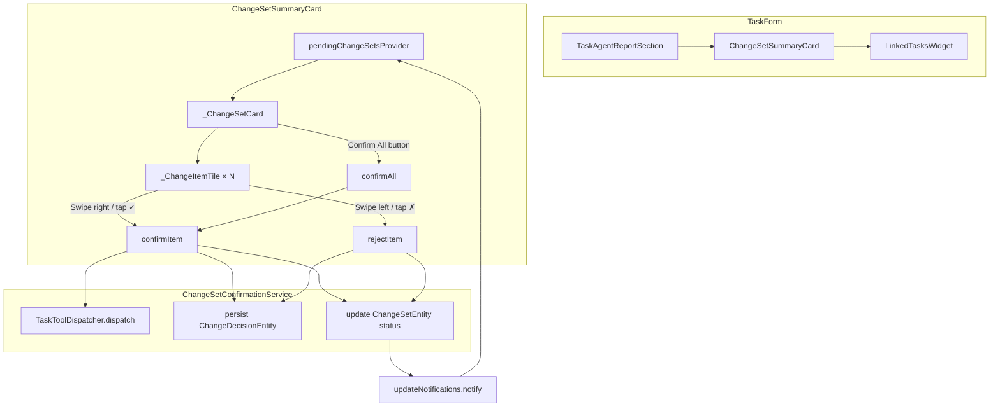
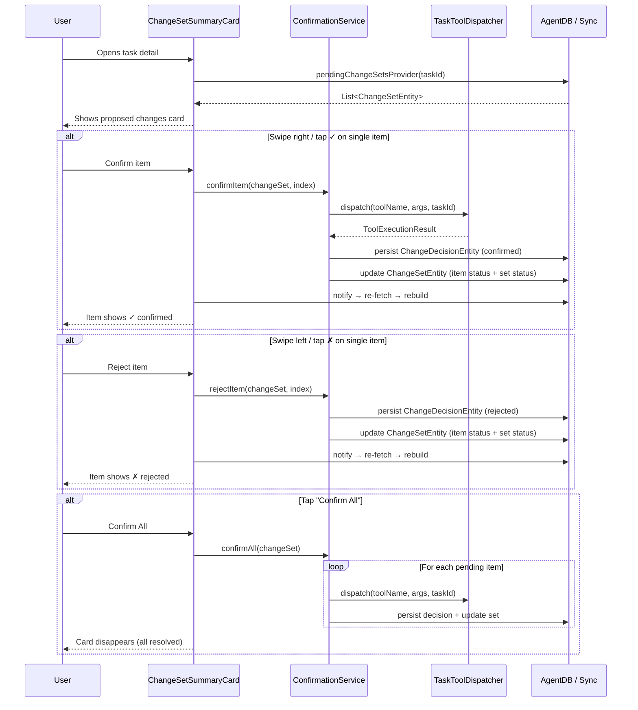
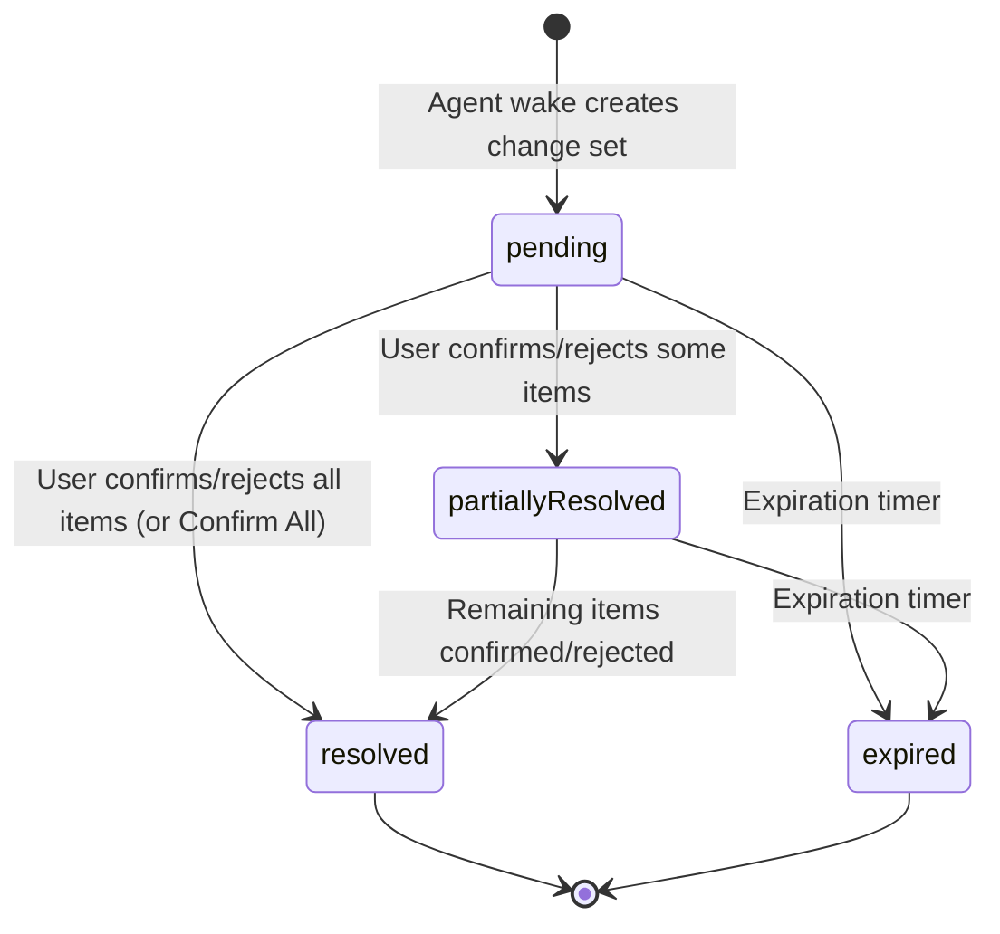
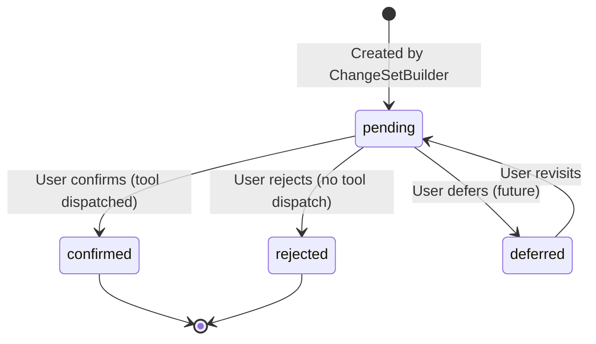

# Phase 3: UI — Change Set Summary Card & Swipe Interactions

## Context

Phases 1-2 implemented the data layer (`ChangeSetEntity`, `ChangeItem`, `ChangeDecisionEntity`) and agent strategy (deferred tool routing via `ChangeSetBuilder`). When an agent wakes, deferred tool calls are accumulated into a `ChangeSetEntity` and persisted. The user currently has no way to review or act on these proposals. Phase 3 adds the UI confirmation flow.

## Architecture



### User Flow



### Change Set Status State Machine



### Change Item Status State Machine



## Implementation Steps

### Step 1: Add singular tool handlers to `TaskToolDispatcher`

**File:** `lib/features/agents/workflow/task_tool_dispatcher.dart`

Add two new `case` entries in the `dispatch()` switch:
- `add_checklist_item` — wraps args as `{'items': [args]}` and delegates to `_handleBatchChecklist` with tool name `add_multiple_checklist_items`
- `update_checklist_item` — wraps args as `{'items': [args]}` and delegates to `_handleChecklistUpdate` with tool name `update_checklist_items`

This avoids duplicating handler logic — singular items reuse the batch path with a single-element array.

**Test:** Add cases to existing `test/features/agents/workflow/task_tool_dispatcher_test.dart` (or create if absent).

---

### Step 2: Create `ChangeSetConfirmationService`

**New file:** `lib/features/agents/service/change_set_confirmation_service.dart`

```dart
class ChangeSetConfirmationService {
  ChangeSetConfirmationService({
    required AgentSyncService syncService,
    required TaskToolDispatcher toolDispatcher,
  });

  Future<ToolExecutionResult> confirmItem(ChangeSetEntity changeSet, int itemIndex);
  Future<bool> rejectItem(ChangeSetEntity changeSet, int itemIndex, {String? reason});
  Future<List<ToolExecutionResult>> confirmAll(ChangeSetEntity changeSet);
}
```

**Confirm flow:**
1. Call `toolDispatcher.dispatch(item.toolName, item.args, changeSet.taskId)`
2. Create `ChangeDecisionEntity` with `verdict: confirmed`, persist via `syncService.upsertEntity`
3. Update `ChangeSetEntity` — copy with `items[itemIndex].status = confirmed`
4. If all items resolved → `status = resolved`, set `resolvedAt = clock.now()`; else `partiallyResolved`
5. Persist updated change set

**Reject flow:** Same as confirm but no tool dispatch, verdict = rejected.

**Test:** `test/features/agents/service/change_set_confirmation_service_test.dart`
- Confirm dispatches tool + persists decision + updates status
- Reject persists decision without tool dispatch
- Last item triggers `resolved` status
- `confirmAll` iterates all pending items

---

### Step 3: Create Riverpod providers

**New file:** `lib/features/agents/state/change_set_providers.dart`

```dart
@riverpod
Future<List<ChangeSetEntity>> pendingChangeSets(Ref ref, String taskId) async {
  final agent = ref.watch(taskAgentProvider(taskId)).value?.mapOrNull(agent: (a) => a);
  if (agent == null) return [];
  ref.watch(agentUpdateStreamProvider(agent.agentId));
  final repo = ref.watch(agentRepositoryProvider);
  return repo.getPendingChangeSets(agent.agentId, taskId: taskId);
}

@riverpod
ChangeSetConfirmationService changeSetConfirmationService(Ref ref) {
  return ChangeSetConfirmationService(
    syncService: ref.watch(agentSyncServiceProvider),
    toolDispatcher: TaskToolDispatcher(
      journalDb: ref.watch(journalDbProvider),
      journalRepository: ref.watch(journalRepositoryProvider),
      checklistRepository: ref.watch(checklistRepositoryProvider),
      labelsRepository: ref.watch(labelsRepositoryProvider),
    ),
  );
}
```

Follows the existing pattern: `taskAgentProvider` → agent ID → `agentUpdateStreamProvider` for reactive invalidation → repository fetch.

**Test:** `test/features/agents/state/change_set_providers_test.dart`

---

### Step 4: Add localization strings

**Files:** All 5 arb files (`app_en.arb`, `app_de.arb`, `app_es.arb`, `app_fr.arb`, `app_ro.arb`)

Keys to add:
- `changeSetCardTitle` — "Proposed changes" / "Vorgeschlagene Änderungen" / ...
- `changeSetPendingCount` — "{count} pending" (with `count` param)
- `changeSetConfirmAll` — "Confirm all"
- `changeSetItemConfirmed` — "Change applied"
- `changeSetItemRejected` — "Change rejected"
- `changeSetSwipeConfirm` — "Confirm"
- `changeSetSwipeReject` — "Reject"
- `changeSetConfirmError` — "Failed to apply change"

Run `make l10n` + `make sort_arb_files` after.

---

### Step 5: Create `ChangeSetSummaryCard` widget

**New file:** `lib/features/agents/ui/change_set_summary_card.dart`

**Structure:**
- `ChangeSetSummaryCard(taskId:)` — top-level `ConsumerWidget`, watches `pendingChangeSetsProvider(taskId)`, returns `SizedBox.shrink()` when empty
- `_ChangeSetCard(changeSet:)` — `ModernBaseCard` with header (title + pending count badge), body (list of item tiles), footer ("Confirm All" button)
- `_ChangeItemTile` — each item row, wrapped in `Dismissible`:
  - Right swipe → confirm (green background + check icon)
  - Left swipe → reject (red background + X icon)
  - `confirmDismiss` returns `false` (state update handles visual change, following `ChecklistItemWrapper` pattern)
  - Trailing: confirm/reject icon buttons for non-swipe interaction
  - Body: `humanSummary` text + status indicator

**Interaction:** On confirm/reject, call `ref.read(changeSetConfirmationServiceProvider)`, then `ref.read(updateNotificationsProvider).notify({agentId})` to trigger provider invalidation + UI rebuild.

**Test:** `test/features/agents/ui/change_set_summary_card_test.dart`
- Renders nothing when no pending change sets
- Renders card with title and item summaries
- Confirm button calls service.confirmItem
- Reject button calls service.rejectItem
- Swipe right triggers confirm
- Swipe left triggers reject
- "Confirm All" button confirms all pending items
- Resolved items show status icon

---

### Step 6: Wire into `TaskForm`

**File:** `lib/features/tasks/ui/task_form.dart`

Add `ChangeSetSummaryCard(taskId: taskId)` right after `TaskAgentReportSection(taskId: taskId)`:

```dart
TaskAgentReportSection(taskId: taskId),
ChangeSetSummaryCard(taskId: taskId),  // NEW
LinkedTasksWidget(taskId: taskId),
```

No conditional needed — the card handles its own empty state.

---

### Step 7: Run `make build_runner` for code generation

Generate `.g.dart` files for the new `change_set_providers.dart` Riverpod providers.

---

## Execution Order

```text
Step 1 (dispatcher) ─┐
                      ├─→ Step 2 (service) ─→ Step 3 (providers) ─→ Step 5 (widget) ─→ Step 6 (integration)
Step 4 (l10n) ────────┘                                              ↑
                                                          Step 7 (build_runner) ─┘
```

## Key Files

| Role | Path |
|------|------|
| Tool dispatcher | `lib/features/agents/workflow/task_tool_dispatcher.dart` |
| Confirmation service | `lib/features/agents/service/change_set_confirmation_service.dart` (NEW) |
| Providers | `lib/features/agents/state/change_set_providers.dart` (NEW) |
| Card widget | `lib/features/agents/ui/change_set_summary_card.dart` (NEW) |
| TaskForm integration | `lib/features/tasks/ui/task_form.dart` |
| Swipe reference | `lib/features/tasks/ui/checklists/checklist_item_wrapper.dart` |
| Card reference | `lib/widgets/cards/modern_base_card.dart` |
| Provider reference | `lib/features/agents/state/agent_providers.dart` |
| Test factories | `test/features/agents/test_utils.dart` (makeTestChangeSet, makeTestChangeDecision) |

## Reuse

- `ModernBaseCard` for card styling
- `Dismissible` + colored background pattern from `ChecklistItemWrapper`
- `agentUpdateStreamProvider` for reactive invalidation
- `TaskToolDispatcher.dispatch()` for executing confirmed tools
- `AgentSyncService.upsertEntity()` for persisting decisions (sync-aware)
- `makeTestChangeSet` / `makeTestChangeDecision` for test data
- `makeTestableWidget` / `setUpTestGetIt` / `tearDownTestGetIt` for widget tests

## Verification

1. After each step: `dart-mcp.analyze_files` + `dart-mcp.dart_format`
2. After step 1: run dispatcher tests
3. After step 2: run confirmation service tests
4. After step 5: run widget tests
5. After step 6: run analyzer on full project, verify no regressions
6. Manual smoke test: trigger agent wake on a task → verify card appears → confirm/reject items
