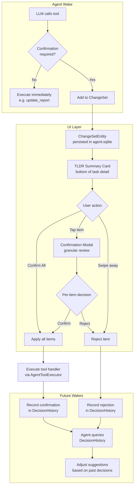
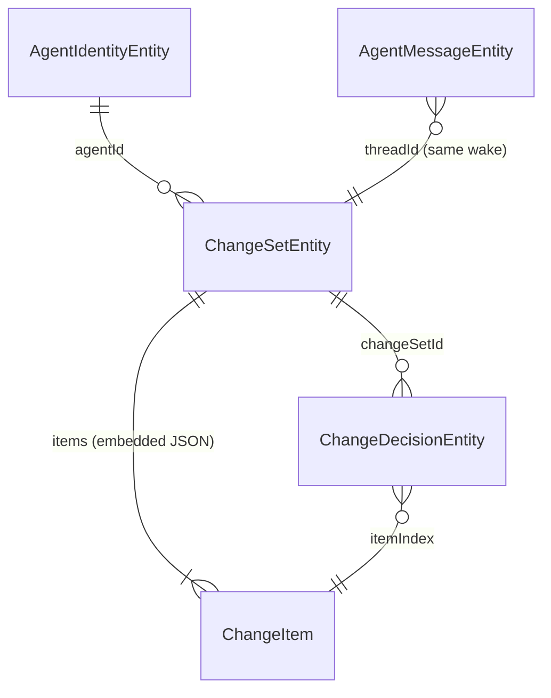
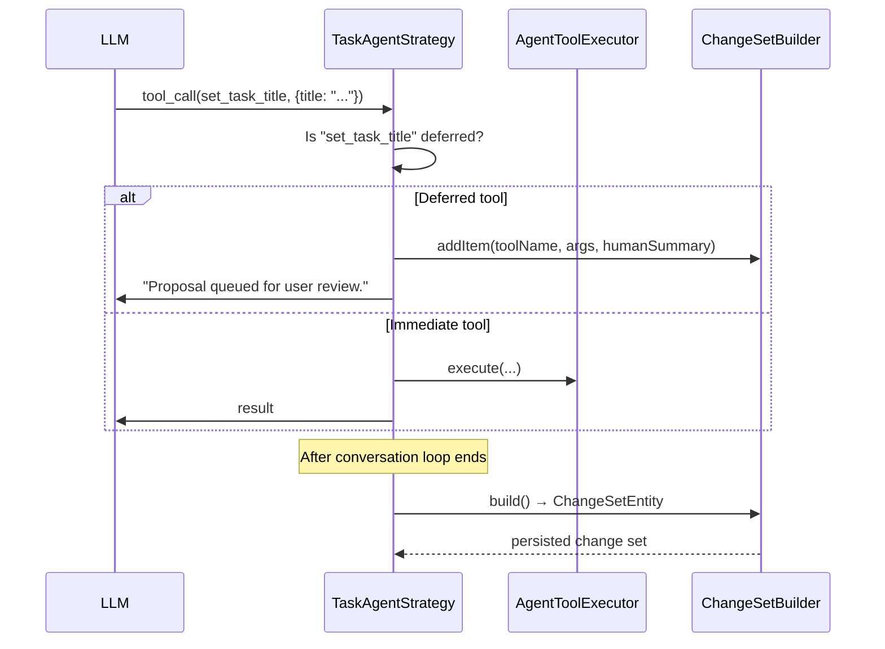
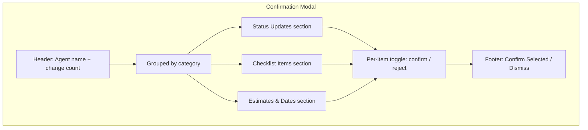
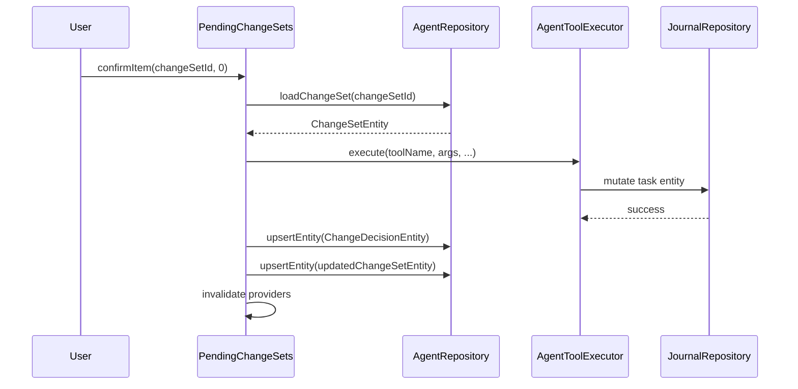

# User Confirmation Workflow for Agent-Proposed Change Sets

## Overview

Close the loop between agent **suggestions** and **actions** by introducing a
human-in-the-loop confirmation step. Instead of agents applying tool calls
immediately, mutations are gathered into a **change set** that the user reviews
before any writes hit the journal database.

This plan covers data modeling, UI/UX, state management, agent integration, and
a phased implementation roadmap.

---

## 1. Terminology

| Term | Definition |
|---|---|
| **Change Set** | An ordered list of proposed mutations produced by a single agent wake. |
| **Change Item** | A single proposed mutation (e.g., "set estimate to 2 h"). |
| **Decision** | The user's verdict on a change item: `confirmed`, `rejected`, or `deferred`. |
| **Decision History** | Persisted log of all decisions, keyed by agent, tool, and context — used to inform future agent behavior. |

---

## 2. Architecture Overview



---

## 3. Data Modeling

### 3.1 New Entity Types

Two new variants are added to `AgentDomainEntity`:

#### `changeSet`

Represents a batch of proposed changes from a single agent wake.

```dart
const factory AgentDomainEntity.changeSet({
  required String id,
  required String agentId,
  required String taskId,       // journal entity being modified
  required String threadId,     // links to the wake's conversation thread
  required String runKey,       // links to the specific wake run
  required ChangeSetStatus status, // pending | partiallyResolved | resolved | expired
  required List<ChangeItem> items,
  required DateTime createdAt,
  required VectorClock? vectorClock,
  DateTime? resolvedAt,
  DateTime? deletedAt,
}) = ChangeSetEntity;
```

#### `changeDecision`

Records a user's verdict on a single change item — used for decision history
and future agent learning.

```dart
const factory AgentDomainEntity.changeDecision({
  required String id,
  required String agentId,
  required String changeSetId,
  required int itemIndex,       // index within the change set's items list
  required String toolName,     // e.g. 'update_task_estimate'
  required ChangeDecisionVerdict verdict, // confirmed | rejected | deferred
  required DateTime createdAt,
  required VectorClock? vectorClock,
  String? taskId,               // denormalized for efficient queries
  String? rejectionReason,      // optional user-supplied reason
  DateTime? deletedAt,
}) = ChangeDecisionEntity;
```

### 3.2 Supporting Value Types

```dart
/// A single proposed mutation within a change set.
@freezed
class ChangeItem with _$ChangeItem {
  const factory ChangeItem({
    required String toolName,
    required Map<String, dynamic> args,
    required String humanSummary, // LLM-generated plain-text description
    @Default(ChangeItemStatus.pending) ChangeItemStatus status,
  }) = _ChangeItem;
}

enum ChangeSetStatus { pending, partiallyResolved, resolved, expired }
enum ChangeItemStatus { pending, confirmed, rejected, deferred }
enum ChangeDecisionVerdict { confirmed, rejected, deferred }
```

### 3.3 Persistence

All entities are stored in the existing `agent_entities` table using the
established `type`/`subtype` column pattern. No schema migration is needed —
the discriminator values (`changeSet`, `changeDecision`) are new union variants
handled by Freezed's JSON serialization.

### 3.4 Entity Relationship Diagram



---

## 4. Tool Classification: Immediate vs. Deferred

Not every tool call requires confirmation. The classification:

| Tool | Mode | Rationale |
|---|---|---|
| `update_report` | Immediate | Agent's own output, no task mutation |
| `record_observations` | Immediate | Agent's private notes |
| `set_task_language` | Immediate | Low-risk, high-confidence detection |
| `assign_task_labels` | **Deferred** | User may disagree with label choices |
| `set_task_title` | **Deferred** | User may prefer their own wording |
| `update_task_estimate` | **Deferred** | Subjective; user may have more info |
| `update_task_due_date` | **Deferred** | High-impact; user must agree |
| `update_task_priority` | **Deferred** | Subjective priority assessment |
| `set_task_status` | **Deferred** | Status transitions affect workflow |
| `add_multiple_checklist_items` | **Deferred + Exploded** | Each checklist item confirmed independently |
| `update_checklist_items` | **Deferred + Exploded** | Each item update confirmed independently |

This classification is encoded in a static `Set<String>` constant
(`deferredTools`) in the tool registry, making it easy to adjust per-tool
behavior. Batch tools that need per-element granularity are additionally listed
in `explodedBatchTools` with a corresponding splitter function.

---

## 5. Agent-Side Flow

### 5.1 Modified `TaskAgentStrategy`

The strategy's `processToolCalls` method is updated to check
`AgentToolRegistry.deferredTools`:



### 5.2 `ChangeSetBuilder`

A new helper class accumulates deferred items during a wake and produces a
`ChangeSetEntity` at the end:

```dart
class ChangeSetBuilder {
  final String agentId;
  final String taskId;
  final String threadId;
  final String runKey;
  final List<ChangeItem> _items = [];

  void addItem({
    required String toolName,
    required Map<String, dynamic> args,
    required String humanSummary,
  });

  /// Explodes a batch tool call into individual change items.
  /// Used for `add_multiple_checklist_items` and `update_checklist_items`.
  void addBatchItems({
    required String toolName,
    required List<Map<String, dynamic>> itemArgs,
    required List<String> humanSummaries,
  });

  bool get hasItems => _items.isNotEmpty;

  /// Builds and persists the change set. Returns null if empty.
  Future<ChangeSetEntity?> build(AgentSyncService syncService);
}
```

### 5.3 Batch Tool Explosion

Batch tools like `add_multiple_checklist_items` and `update_checklist_items`
are **exploded** into individual `ChangeItem` entries — one per checklist item.
This ensures each checklist item can be independently confirmed or rejected.

For example, if the agent calls:

```json
{
  "name": "add_multiple_checklist_items",
  "arguments": {
    "items": [
      {"title": "Design mockup"},
      {"title": "Implement API"},
      {"title": "Write tests"},
      {"title": "Deploy to staging"},
      {"title": "Run smoke tests"}
    ]
  }
}
```

The builder produces **5 separate `ChangeItem` entries**, each with:

- `toolName`: `"add_checklist_item"` (singular — the execution reassembles
  confirmed items into a single `add_multiple_checklist_items` call, or
  executes them individually)
- `args`: `{"title": "Design mockup"}` (just that one item)
- `humanSummary`: `"Add checklist item: Design mockup"`

The user can then confirm 4 out of 5, reject 1, and only the confirmed items
get created. Each rejection is recorded individually in decision history so the
agent learns which kinds of checklist suggestions the user tends to reject.

Similarly, `update_checklist_items` (which takes a list of `{id, isChecked?,
title?}` objects) is exploded so the user can approve checking off item A while
rejecting the title correction on item B.

#### Execution of confirmed batch items

Confirmed items are executed individually using the singular tool handler (e.g.,
`add_checklist_item`). This keeps the execution path simple — each `ChangeItem`
maps directly to one tool invocation. Re-aggregation into a single batch call
is a possible future optimization but is not implemented initially.

### 5.4 Human-Summary Generation

The LLM is instructed (via system prompt amendment) to include a
`humanSummary` field in every deferred tool call. This is a plain-text,
user-facing description of what the change does, e.g.:

> "Set time estimate to 2 hours"
> "Add checklist item: Design mockup"

For batch tools, the strategy generates per-item summaries automatically from
the item's fields (e.g., title for checklist items), so the LLM does not need
to provide individual summaries for each array element.

If the LLM omits the summary for non-batch tools, the strategy falls back to a
generated default from tool name + args.

---

## 6. UI/UX Design

### 6.1 TLDR Summary Card (Bottom of Task Detail)

The change set surfaces as a compact card in the TLDR area at the bottom of the
task detail view. This reuses the existing `ModernBaseCard` + Gamey theme.

```
┌──────────────────────────────────────────────┐
│  ✨ Laura suggests 7 changes                 │
│                                              │
│  • Set estimate to 2h              [✓] [✗]  │
│  • Set priority to P2              [✓] [✗]  │
│  ┄┄ Checklist items (5) ┄┄┄┄┄┄┄┄┄┄┄┄┄┄┄┄┄  │
│  • Add: "Design mockup"            [✓] [✗]  │
│  • Add: "Implement API"            [✓] [✗]  │
│  • Add: "Write tests"              [✓] [✗]  │
│  • Add: "Deploy to staging"        [✓] [✗]  │
│  • Add: "Run smoke tests"          [✓] [✗]  │
│                                              │
│  [Confirm All]            [Review Details]   │
└──────────────────────────────────────────────┘
```

Each checklist item appears as its own line — the user can confirm 4 out of 5,
reject 1, etc. Batch tool calls are always exploded so every individual
mutation is independently actionable.

**Interactions:**
- **Per-item [✓]**: Confirms and applies that single item immediately.
- **Per-item [✗]**: Rejects that item (with optional reason via long-press).
- **Swipe left on an item**: Same as [✗] — rejects with animation.
- **[Confirm All]**: Applies all pending items in order.
- **[Review Details]**: Opens the confirmation modal.

### 6.2 Confirmation Modal

A bottom sheet presenting the full change set with expandable detail sections:



Each section is collapsible and shows a diff-like preview:
- **Status**: `OPEN → GROOMED` with color-coded badges
- **Checklist**: List of items with checkboxes
- **Estimate**: `None → 2h` with before/after
- **Priority**: `— → P2` with badge

### 6.3 Swipe-to-Dismiss

Uses Flutter's `Dismissible` widget with:
- **Left swipe**: Reject (red background with ✗ icon)
- **Right swipe**: Confirm (green background with ✓ icon)
- Smooth animation with `AnimatedList` for item removal

### 6.4 State Management

A new Riverpod provider family manages change set UI state:

```dart
@riverpod
class PendingChangeSets extends _$PendingChangeSets {
  @override
  Future<List<ChangeSetEntity>> build(String taskId) async {
    // Query all pending/partiallyResolved change sets for this task
  }

  Future<void> confirmItem(String changeSetId, int itemIndex);
  Future<void> rejectItem(String changeSetId, int itemIndex, {String? reason});
  Future<void> confirmAll(String changeSetId);
  Future<void> dismissChangeSet(String changeSetId);
}
```

---

## 7. Applying Confirmed Changes

When the user confirms an item, the system:

1. Retrieves the `ChangeItem`'s `toolName` and `args`.
2. Delegates to the existing tool handler infrastructure via
   `AgentToolExecutor.execute()`.
3. Records a `ChangeDecisionEntity` with verdict `confirmed`.
4. Updates the `ChangeSetEntity` item status and overall status.
5. Triggers `UpdateNotifications.notify({taskId})` to refresh the task UI.

This reuses the full enforcement and audit pipeline — the confirmation step
simply delays when `execute()` is called, it does not bypass any safety checks.

### Execution Sequence



---

## 8. Agent Integration: Decision History

### 8.1 Querying Past Decisions

A new repository method surfaces decision history for the context builder:

```dart
/// Returns recent decisions for a given agent and task.
Future<List<ChangeDecisionEntity>> getRecentDecisions({
  required String agentId,
  String? taskId,
  int limit = 20,
});
```

### 8.2 Context Builder Amendment

The agent's system prompt context (assembled by the prompt builder) is extended
with a new section:

```
## Recent User Decisions

The following shows how the user responded to your recent suggestions.
Learn from rejections — avoid repeating rejected patterns.

- ✓ set_task_title("Fix login bug") — confirmed
- ✗ update_task_estimate(120 min) — rejected (reason: "I know better")
- ✓ assign_task_labels(["bug", "auth"]) — confirmed
- ✗ set_task_status("GROOMED") — rejected
- ✓ add_checklist_item("Design mockup") — confirmed
- ✓ add_checklist_item("Implement API") — confirmed
- ✗ add_checklist_item("Run smoke tests") — rejected
- ✓ update_checklist_item(id: "abc", isChecked: true) — confirmed
- ✗ update_checklist_item(id: "def", title: "...") — rejected (reason: "title was fine")
```

Note: Batch tools appear as individual items in decision history, giving the
agent fine-grained signal about which specific suggestions are accepted.

### 8.3 Token Budget

Decision history is capped at 20 entries / 500 tokens, consistent with the
existing context budget pattern in `EvolutionContextBuilder`.

---

## 9. Expiration & Cleanup

Change sets that remain `pending` for longer than **7 days** are automatically
marked `expired` during the agent's next wake. Expired sets:

- Are hidden from the UI.
- Are NOT re-proposed (the agent sees them as "no decision" in history).
- Can be cleaned up by a periodic background task.

---

## 10. Implementation Phases

### Phase 1: Data Layer (estimated: 1 PR)

1. Add `ChangeItem`, `ChangeSetStatus`, `ChangeItemStatus`,
   `ChangeDecisionVerdict` value types to `agent_domain_entity.dart`.
2. Add `changeSet` and `changeDecision` union variants to
   `AgentDomainEntity`.
3. Run `make build_runner` to regenerate Freezed/JSON code.
4. Add repository query methods:
   - `getPendingChangeSets(taskId)`
   - `getRecentDecisions(agentId, taskId?)`
5. Write unit tests for serialization round-trips and queries.

### Phase 2: Agent Strategy Changes (estimated: 1 PR)

1. Add `deferredTools` constant to `AgentToolRegistry`.
2. Create `ChangeSetBuilder` class.
3. Modify `TaskAgentStrategy.processToolCalls()`:
   - Check `deferredTools.contains(toolName)`.
   - If deferred: add to builder, respond with "queued for review".
   - If immediate: execute as before.
4. Amend the task agent system prompt to include `humanSummary` instructions.
5. Persist the change set at end of wake via `ChangeSetBuilder.build()`.
6. Unit tests for strategy branching and builder logic.

### Phase 3: UI — TLDR Card & Swipe (estimated: 1 PR)

1. Create `PendingChangeSetsProvider` (Riverpod).
2. Create `ChangeSetSummaryCard` widget for the TLDR area.
3. Implement `Dismissible`-based swipe interactions.
4. Wire confirm/reject actions to repository writes + tool execution.
5. Widget tests for card rendering, swipe gestures, and state transitions.

### Phase 4: UI — Confirmation Modal (estimated: 1 PR)

1. Create `ChangeSetDetailSheet` bottom sheet widget.
2. Implement grouped sections (status, checklist, estimates).
3. Per-item confirm/reject toggles with diff preview.
4. "Confirm Selected" bulk action.
5. Widget tests for modal interactions.

### Phase 5: Decision History Integration (estimated: 1 PR)

1. Extend the task agent context builder with decision history section.
2. Add `getRecentDecisions` query to repository.
3. Wire into prompt assembly with token budget cap.
4. Add expiration logic for stale change sets.
5. Integration tests for end-to-end flow: wake → change set → confirm →
   next wake sees decision.

### Phase 6: Polish & Localization (estimated: 1 PR)

1. Add all user-facing strings to ARB files (en, de, es, fr, ro).
2. Add animations and haptic feedback for swipe interactions.
3. Handle edge cases: empty change sets, all-rejected sets, concurrent wakes.
4. Update feature README.
5. Add CHANGELOG entry.

---

## 11. GenUI Consideration

The change set card could optionally be rendered as a GenUI surface (similar to
`EvolutionProposal`). However, since change sets are produced at the end of a
wake — not during an interactive chat — the standard widget approach is
preferred for Phase 3–4. A GenUI catalog item can be added later if the agent
needs to render change sets inline during evolution sessions.

---

## 12. Risks & Mitigations

| Risk | Mitigation |
|---|---|
| LLM omits `humanSummary` | Fallback generator from tool name + args |
| Change set grows too large | Cap at 10 items per set; overflow items execute immediately with warning |
| User never reviews change set | 7-day expiration + badge/notification |
| Concurrent wakes produce competing sets | Each wake creates its own set; UI shows all pending sets |
| Tool args become stale (task changed since wake) | Re-validate args at confirmation time; fail gracefully with user message |

---

## 13. Testing Strategy

- **Unit tests**: Freezed serialization, `ChangeSetBuilder`, strategy branching,
  repository queries, decision history assembly.
- **Widget tests**: Card rendering, swipe gestures, modal interactions, state
  provider behavior.
- **Integration tests**: Full wake → change set → user confirm → task mutation
  → next wake sees decision history.

Each phase includes its own test suite before merging. Target: full coverage of
every new code path.
