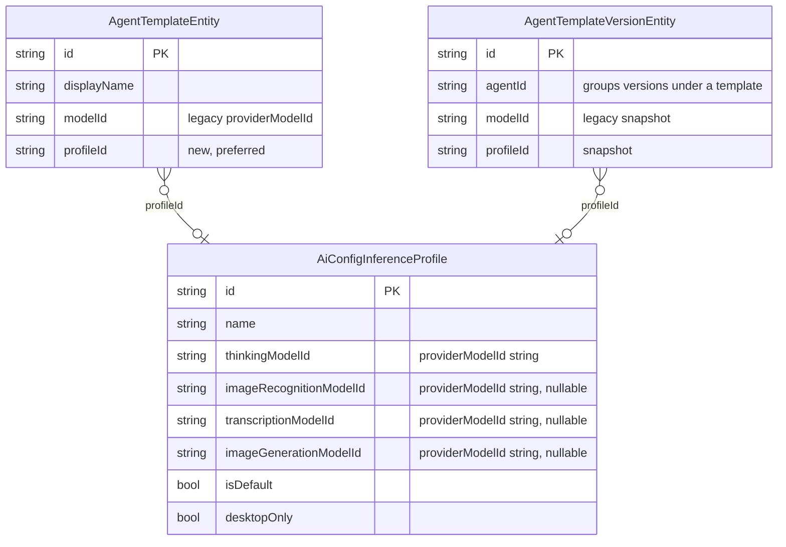
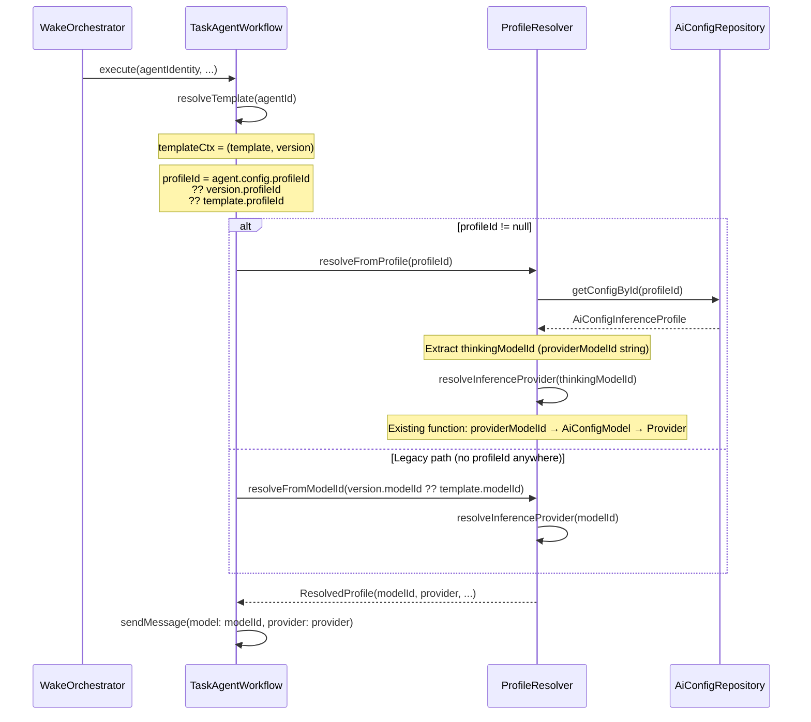
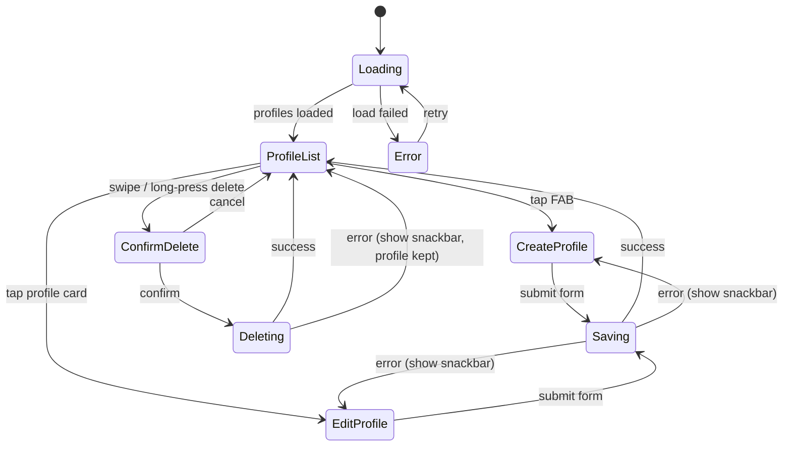
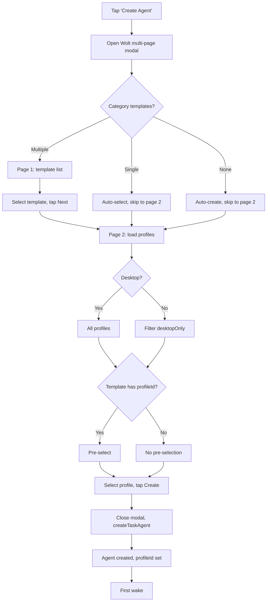
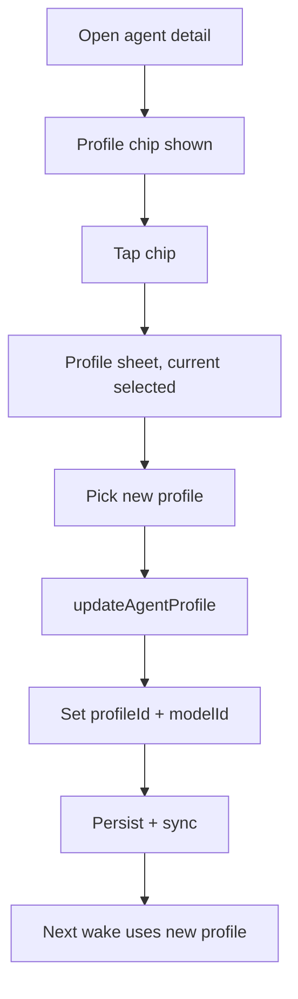
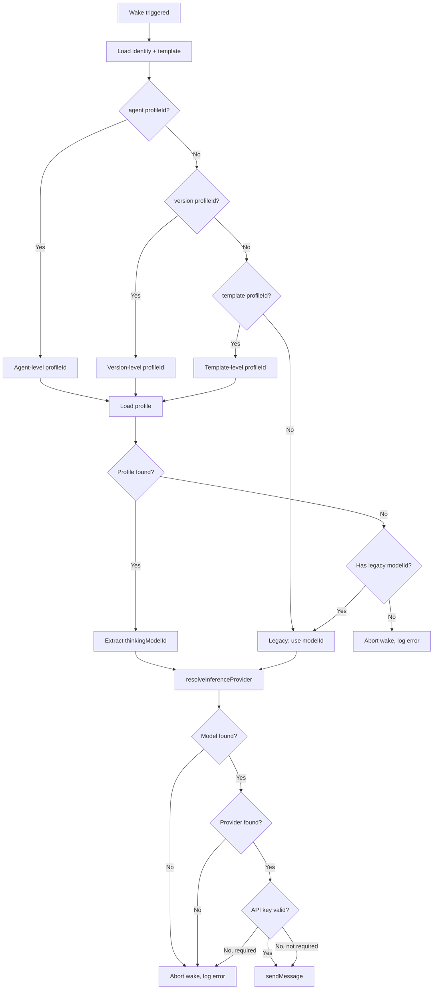
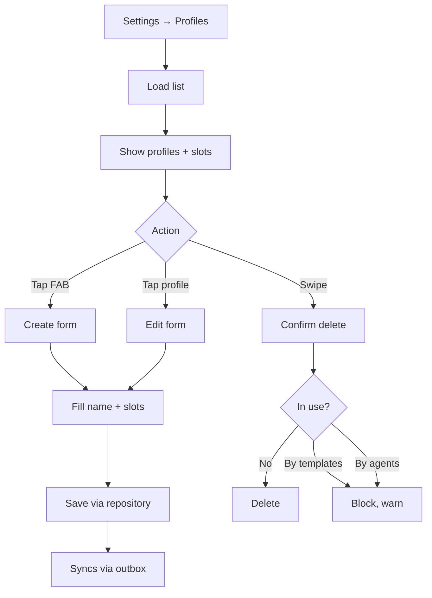

# Agent Privacy Profiles — Implementation Plan

**Date**: 2026-02-28
**Priority**: P1
**Status**: Planning

## 1. Problem Statement

Currently, agents are assigned a single `modelId` (a `providerModelId` string like
`'models/gemini-3-flash-preview'`) directly on their template. This is unintuitive
because:

- Users must understand provider-specific model identifiers.
- Different capabilities (thinking, vision, transcription) all share the same
  model, even when specialized models would be more appropriate.
- Switching an agent between cloud providers requires editing each template
  individually.
- There is no way to express intent like "keep my data local" or "use European
  infrastructure" — the user has to know which models map to which providers.

## 2. Solution Overview

Introduce **Inference Profiles** — named configurations that bundle model
assignments for each capability slot:

| Slot | Purpose | Model Constraint |
|---|---|---|
| **Thinking** | Agentic reasoning, tool calling | `supportsFunctionCalling == true` |
| **Image Recognition** | Vision analysis of attached images | `inputModalities` contains `image` |
| **Transcription** | Audio-to-text processing | `inputModalities` contains `audio` |
| **Image Generation** | Cover art, visual mnemonics | `outputModalities` contains `image` |

A profile is a first-class entity stored in the existing `ai_config.sqlite`
database alongside providers, models, and prompts.

### Key Concepts

- **Profile** = named bundle of (thinkingModelId, imageRecognitionModelId, transcriptionModelId, imageGenerationModelId)
- **Template.profileId** replaces **Template.modelId** as the primary model reference
- **Runtime resolution** goes: template → profile → per-slot model → provider
- **Backward compatibility**: templates with a `modelId` but no `profileId` continue
  to work exactly as today (the `modelId` is used for the thinking slot; the
  remaining three slots — image recognition, transcription, and image generation
  — are null in the legacy path)

## 3. Data Architecture

### 3.1 New Freezed Variant: `AiConfig.inferenceProfile`

Add a new variant to the existing `AiConfig` sealed union in
`lib/features/ai/model/ai_config.dart`:

```dart
const factory AiConfig.inferenceProfile({
  required String id,
  required String name,
  required DateTime createdAt,

  /// providerModelId string for agentic thinking (tool calling, reasoning).
  /// e.g. 'models/gemini-3-flash-preview'. Resolved at runtime via
  /// resolveInferenceProvider() which finds the matching AiConfigModel
  /// and its AiConfigInferenceProvider.
  required String thinkingModelId,

  /// providerModelId string for image recognition / vision tasks.
  /// e.g. 'models/gemini-3-flash-preview' or 'qwen3-vl-flash'.
  String? imageRecognitionModelId,

  /// providerModelId string for audio transcription.
  /// e.g. 'voxtral-mini-latest' or 'models/gemini-3-flash-preview'.
  String? transcriptionModelId,

  /// providerModelId string for image generation (cover art, visual mnemonics).
  /// e.g. 'models/gemini-3-pro-image-preview' or 'gpt-image-1.5'.
  String? imageGenerationModelId,

  /// Whether this is a system-seeded default (non-deletable).
  @Default(false) bool isDefault,

  /// Whether this profile requires a desktop environment (e.g. Ollama).
  @Default(false) bool desktopOnly,

  DateTime? updatedAt,
  String? description,
}) = AiConfigInferenceProfile;
```

Privacy intent is encoded in the profile **name** (e.g. "Local (Ollama)",
"Mistral EU", "Gemini Flash"). There is no `privacy` enum — the app cannot
enforce data residency guarantees, so it is the user's responsibility to
configure profiles appropriately. A profile named "Local" that references
cloud models is a user error, not something we police.

The `AiConfigType` enum gains a new value:

```dart
enum AiConfigType {
  inferenceProvider,
  prompt,
  model,
  inferenceProfile, // NEW
}
```

### 3.2 Template Model Reference Changes

In `AgentTemplateEntity`, **add** `profileId` alongside the existing `modelId`:

```dart
const factory AgentDomainEntity.agentTemplate({
  // ... existing fields ...
  required String modelId,        // KEPT for backward compatibility
  String? profileId,              // NEW — takes precedence when set
  // ...
}) = AgentTemplateEntity;
```

Similarly for `AgentTemplateVersionEntity`:

```dart
const factory AgentDomainEntity.agentTemplateVersion({
  // ... existing fields ...
  String? modelId,                // KEPT for backward compatibility
  String? profileId,              // NEW — takes precedence when set
  // ...
}) = AgentTemplateVersionEntity;
```

And in `AgentConfig`:

```dart
@freezed
abstract class AgentConfig with _$AgentConfig {
  const factory AgentConfig({
    @Default(5) int maxTurnsPerWake,
    @Default('models/gemini-3-flash-preview') String modelId,
    String? profileId,            // NEW
  }) = _AgentConfig;
}
```

### 3.3 Entity-Relationship Diagram

The profile stores `providerModelId` strings (e.g. `'models/gemini-3-flash-preview'`)
for each slot — the same kind of string currently stored on `AgentTemplateEntity.modelId`.
The existing `resolveInferenceProvider()` function already handles the full
`providerModelId → AiConfigModel → AiConfigInferenceProvider` lookup chain, so
profiles do **not** reference models or providers directly.



At runtime, each `providerModelId` from a profile slot is resolved via the
existing `resolveInferenceProvider()` which queries the `AiConfigModel` table
to find the matching model, then looks up its `AiConfigInferenceProvider`.
This chain is unchanged from today — profiles are purely a grouping layer.

### 3.4 Storage

Profiles are stored in the existing `ai_configs` table in `ai_config.sqlite`
(same table as providers, models, and prompts). The `type` column will contain
`'inferenceProfile'`. No schema migration is needed — the table already uses a
generic `serialized TEXT` column for JSON payloads.

## 4. Data Flow

### 4.1 Runtime Model Resolution



### 4.2 Resolution Logic (Pseudocode)

```text
resolveModelsForWake(agentIdentity, templateCtx):
  // Agent-level override (set during creation) takes priority,
  // then version snapshot, then template default.
  profileId = agentIdentity.config.profileId
               ?? templateCtx.version.profileId
               ?? templateCtx.template.profileId

  if profileId != null:
    profile = aiConfigRepo.getConfigById(profileId)
    if profile is AiConfigInferenceProfile:
      // Each slot stores a providerModelId string.
      // resolveInferenceProvider() is the existing function that does:
      //   providerModelId → find AiConfigModel → find AiConfigInferenceProvider
      return ResolvedProfile(
        thinking: resolveInferenceProvider(profile.thinkingModelId),
        imageRecognition: profile.imageRecognitionModelId != null
          ? resolveInferenceProvider(profile.imageRecognitionModelId!)
          : null,
        transcription: profile.transcriptionModelId != null
          ? resolveInferenceProvider(profile.transcriptionModelId!)
          : null,
        imageGeneration: profile.imageGenerationModelId != null
          ? resolveInferenceProvider(profile.imageGenerationModelId!)
          : null,
      )

  // Legacy fallback: use modelId for thinking slot only
  modelId = templateCtx.version.modelId ?? templateCtx.template.modelId
  return ResolvedProfile(
    thinking: resolveInferenceProvider(modelId),
    imageRecognition: null,
    transcription: null,
    imageGeneration: null,
  )
```

### 4.3 Per-Capability Dispatch

Currently `TaskAgentWorkflow.execute()` only uses the thinking model. The
profile resolution refactor returns a `ResolvedProfile` struct with all four
slots (thinking, imageRecognition, transcription, imageGeneration). Today, only
the `thinking` slot is used by the workflow's `sendMessage` call. The remaining
three slots are plumbed through but only activated when the corresponding
capabilities are added in future iterations (vision tool, transcription tool,
image generation tool). This plan focuses on the thinking slot as the primary
path.

## 5. Pre-defined Default Profiles

Seeded idempotently on first launch via a new `seedDefaultProfiles()` method in
`AiConfigRepository` (similar pattern to `AgentTemplateService.seedDefaults()`).

All `providerModelId` values below are taken from `known_models.dart` to
ensure they match what `ModelPrepopulationService` creates. The profile name
communicates privacy intent to the user (e.g. "Local" = on-device, "EU" =
GDPR-compliant infrastructure).

| Profile Name | Thinking | Image Recognition | Transcription | Image Generation | Desktop Only |
|---|---|---|---|---|---|
| Gemini Flash | `models/gemini-3-flash-preview` | `models/gemini-3-flash-preview` | `models/gemini-3-flash-preview` | `models/gemini-3-pro-image-preview` | No |
| Gemini Pro | `models/gemini-3.1-pro-preview` | `models/gemini-3.1-pro-preview` | `models/gemini-3.1-pro-preview` | `models/gemini-3-pro-image-preview` | No |
| OpenAI | `gpt-5.2` | `gpt-5-nano` | `gpt-4o-transcribe` | `gpt-image-1.5` | No |
| Mistral (EU) | `magistral-medium-2509` | `mistral-small-2501` | `voxtral-mini-latest` | — | No |
| Alibaba | `qwen3-max` | `qwen3-vl-flash` | `qwen3-omni-flash` | `wan2.6-image` | No |
| Local (Ollama) | `qwen3:8b` | `gemma3:4b` | — | — | **Yes** |

**Important**: Profile seeding only creates the profile entity. The referenced
`providerModelId` values must already exist as `AiConfigModel` entries (created
via the existing `ModelPrepopulationService` when a user configures a provider).
Profiles referencing models that don't exist yet are valid — the runtime will
gracefully fail with a log message, same as today.

### Profile IDs

Default profiles use well-known IDs for idempotent seeding:

```dart
const profileGeminiFlashId = 'profile-gemini-flash-001';
const profileGeminiProId   = 'profile-gemini-pro-001';
const profileOpenAiId      = 'profile-openai-001';
const profileMistralEuId   = 'profile-mistral-eu-001';
const profileAlibabaId     = 'profile-alibaba-001';
const profileLocalId       = 'profile-local-001';
```

## 6. Backward Compatibility Strategy

### 6.1 Zero-Migration Approach

No data migration is performed on existing templates or agents. Instead:

1. **`profileId` is nullable** on `AgentTemplateEntity`, `AgentTemplateVersionEntity`,
   and `AgentConfig`. When `null`, the existing `modelId` field is used as-is.

2. **Resolution order** (agent-level override takes highest precedence):
   ```text
   agent.config.profileId → version.profileId → template.profileId → version.modelId → template.modelId
   ```

3. **First non-null wins**. Existing templates that have `modelId` set but no
   `profileId` continue to work without any changes.

4. **UI migration path**: When a user edits an existing template and selects a
   profile, the `profileId` is set and the template-level `modelId` is kept
   unchanged (for rollback safety). From that point forward, `profileId` takes
   precedence.

### 6.2 Template Version Snapshots

When a new template version is created while a profile is assigned:
- Both `profileId` and `modelId` are captured on the version.
- `modelId` is set to `profile.thinkingModelId` for backward-compatible tooling
  that reads `modelId` (e.g., wake run logs, token usage records).

### 6.3 Sync Compatibility

Profiles are stored in `ai_config.sqlite` as an `AiConfig.inferenceProfile`
variant. AI configs already sync between devices via the outbox pattern:
`AiConfigRepository.saveConfig()` enqueues `SyncMessage.aiConfig` messages,
and incoming sync applies them via `SyncEventProcessor` with `fromSync: true`.
Since profiles are just another `AiConfig` variant, they get this sync behavior
for free — no additional sync plumbing needed.

The `profileId` on templates also syncs (via the agent DB's `AgentSyncService`).
A receiving device will have both the profile and the template reference after
sync completes. In the unlikely event a template arrives before its referenced
profile, the legacy `modelId` fallback ensures the agent can still wake.

## 7. UI Design

### 7.1 Profile Management Page

**Route**: `/settings/ai/profiles`
**Access**: New tab in the existing AI Settings page, or a new section under
Agent Settings.

#### State Machine



#### Profile Form Fields

| Field | Type | Required | Notes |
|---|---|---|---|
| Name | text | yes | Free-form display name (encodes privacy intent, e.g. "Local (Ollama)") |
| Description | text | no | Optional description |
| Thinking Model | model picker | yes | Filtered: `supportsFunctionCalling == true` |
| Image Recognition Model | model picker | no | Filtered: `inputModalities` contains `image` |
| Transcription Model | model picker | no | Filtered: `inputModalities` contains `audio` |
| Image Generation Model | model picker | no | Filtered: `outputModalities` contains `image` |
| Desktop Only | toggle | no | When true, profile hidden on mobile |

The model picker reuses the existing `AgentModelSelector` pattern (provider
filter → model list) but with per-slot filtering based on capability
requirements.

### 7.2 Profile Selection in Template Creation/Editing

Replace the current `AgentModelSelector` in `agent_template_detail_page.dart`
with a new `ProfileSelector` widget. The selector shows:

1. A list of available profiles.
2. Each profile card shows: name and the model names for each slot.
3. Desktop-only profiles are hidden when `!isDesktop`.
4. Tapping a profile sets `profileId` on the template.
5. A "Custom" option at the bottom falls back to the current model selector for
   power users who want direct model selection.

### 7.3 Profile Selection During Task Agent Creation

Profile selection is **mandatory when creating an agent** (not on subsequent
wakes — once created, the agent uses its stored profile for all future wakes).

The creation flow uses a **Wolt multi-page modal** (via
`ModalUtils.showMultiPageModal` from `lib/widgets/modal/modal_utils.dart`) with
a `pageIndexNotifier` controlling the page transition. This replaces the current
`showModalBottomSheet` approach with a structured two-page wizard.

**Flow in `task_agent_report_section.dart`**:

1. User taps "Create Agent" on a task.
2. A Wolt multi-page modal opens.
3. **Page 1 — Template selection**: If templates exist for the task's category
   and there is a single match, auto-select it and skip to page 2. If multiple
   match, show a template list. If none match, auto-create a template with
   default directives and skip to page 2. The page's sticky action bar has a
   "Next" button (disabled until a template is selected).
4. **Page 2 — Profile selection**: Shows all available profiles (filtered by
   `desktopOnly` on mobile). If the template selected in page 1 has a
   `profileId` set, that profile is pre-selected; otherwise no profile is
   highlighted. A back button in the nav bar returns to page 1. The sticky
   action bar has a "Create" button (disabled until a profile is selected).
5. User taps "Create". The modal closes and the agent is created with the
   selected `profileId` stored on `AgentConfig.profileId`.

This ensures the user is always conscious of which models their agent will use.

**Persistence**: The selected profile is written to `AgentConfig.profileId` at
creation time via `TaskAgentService.createTaskAgent()`. Currently the
`AgentConfig(...)` constructor call inside `createTaskAgent` is:
```dart
config: AgentConfig(modelId: templateEntity.modelId),
```
This becomes:
```dart
config: AgentConfig(
  modelId: profile.thinkingModelId,  // for backward-compat logs/tooling
  profileId: profileId,              // from the user's selection
),
```
The `profileId` on `AgentConfig` takes precedence over the template's
`profileId` at runtime (see Section 4.2 resolution order). Subsequent wakes
read the stored `AgentConfig.profileId` — no re-selection needed.

### 7.4 Reassigning a Profile on an Existing Agent

After creation, the user can change the agent's profile from the agent detail
page (`agent_detail_page.dart`). This updates `AgentConfig.profileId` on the
existing `AgentIdentityEntity` — subsequent wakes use the new profile.

**UI**: A tappable profile chip/row in the agent detail page header area,
showing the current profile name. Tapping opens the same profile selection
sheet used during creation (Section 7.3), pre-selecting the current profile.

**Service**: Add `TaskAgentService.updateAgentProfile(agentId, profileId)`:
1. Load the `AgentIdentityEntity`.
2. Update `config` with the new `profileId` via `copyWith`.
3. Also update `config.modelId` to `profile.thinkingModelId` for backward
   compatibility (wake run logs, token usage records).
4. Persist via `syncService.upsertEntity()`.

This is a lightweight update — no new template version is created, no agent
state reset. The next wake simply resolves the new profile.

### 7.5 User Flow Diagrams

#### Creating an Agent on a Task



#### Reassigning a Profile on an Existing Agent



#### Agent Wake Cycle (Model Resolution)



#### Managing Profiles in Settings



## 8. Platform & Provider Logic

### 8.1 Platform Gating

Local profiles (where `desktopOnly == true`) are filtered out on mobile:

```dart
final visibleProfiles = profiles.where((p) {
  if (p.desktopOnly && !isDesktop) return false;
  return true;
}).toList();
```

Uses existing `isDesktop` from `lib/utils/platform.dart`.

### 8.2 Ollama / Local Provider API Key Handling

The existing `resolveInferenceProvider()` in
`lib/features/agents/util/inference_provider_resolver.dart` rejects providers
with empty API keys (the `provider.apiKey.isEmpty` guard). However, local
providers (Ollama, Voxtral, Whisper) don't require API keys — see
`ProviderConfig.noApiKeyRequired` in
`lib/features/ai/constants/provider_config.dart`.

**Fix**: Patch `resolveInferenceProvider()` directly to respect
`ProviderConfig.noApiKeyRequired`. This is the smallest change and benefits all
callers (not just profile-based resolution):

```dart
if (provider.apiKey.isEmpty &&
    ProviderConfig.requiresApiKey(provider.inferenceProviderType)) {
  // Only reject if the provider type actually needs a key.
  return null;
}
```

### 8.3 No Enforced Data Flow Isolation

The app does not enforce that a profile named "Local" only contains local
models. This is the user's responsibility — the profile name communicates
intent, and the user configures the model slots accordingly. Mixing local and
cloud models in a single profile is allowed (it may even be desirable, e.g.
local transcription + cloud thinking).

## 9. File Inventory

### New Files

| File | Purpose |
|---|---|
| `lib/features/ai/model/resolved_profile.dart` | `ResolvedProfile` data class for runtime |
| `lib/features/ai/util/profile_resolver.dart` | Resolution logic: profile → models → providers |
| `lib/features/ai/util/profile_seeding_service.dart` | Seeds default profiles on first launch |
| `lib/features/ai/state/inference_profile_controller.dart` | Riverpod controller for profile CRUD |
| `lib/features/ai/ui/inference_profile_page.dart` | Profile management list page |
| `lib/features/ai/ui/inference_profile_form.dart` | Create/edit profile form |
| `lib/features/agents/ui/profile_selector.dart` | Profile picker for template editing |
| `lib/features/agents/ui/agent_creation_modal.dart` | Wolt two-page modal: template → profile selection |
| `test/features/ai/model/inference_profile_test.dart` | Unit tests for profile model |
| `test/features/ai/util/profile_resolver_test.dart` | Unit tests for resolution logic |
| `test/features/ai/util/profile_seeding_service_test.dart` | Seeding tests |
| `test/features/ai/state/inference_profile_controller_test.dart` | Controller tests |
| `test/features/ai/ui/inference_profile_page_test.dart` | Widget tests |
| `test/features/ai/ui/inference_profile_form_test.dart` | Widget tests |
| `test/features/agents/ui/profile_selector_test.dart` | Widget tests |
| `test/features/agents/ui/agent_creation_modal_test.dart` | Widget tests for two-page modal flow |

### Modified Files

| File | Changes |
|---|---|
| `lib/features/ai/model/ai_config.dart` | Add `inferenceProfile` variant, `AiConfigType.inferenceProfile` |
| `lib/features/agents/model/agent_domain_entity.dart` | Add `profileId` to `agentTemplate` and `agentTemplateVersion` |
| `lib/features/agents/model/agent_config.dart` | Add `profileId` to `AgentConfig` |
| `lib/features/agents/workflow/task_agent_workflow.dart` | Use `ProfileResolver` instead of direct `resolveInferenceProvider` |
| `lib/features/agents/util/inference_provider_resolver.dart` | Keep for legacy fallback, call from `ProfileResolver` |
| `lib/features/agents/service/agent_template_service.dart` | Accept `profileId` in `createTemplate`/`updateTemplate` |
| `lib/features/agents/service/task_agent_service.dart` | Accept `profileId` in `createTaskAgent`, add `updateAgentProfile` method, write to `AgentConfig` |
| `lib/features/agents/ui/agent_template_detail_page.dart` | Replace `AgentModelSelector` with `ProfileSelector` |
| `lib/features/agents/ui/agent_detail_page.dart` | Add tappable profile chip for reassignment (Section 7.4) |
| `lib/features/agents/ui/task_agent_report_section.dart` | Show profile selection sheet during agent creation |
| `lib/features/agents/ui/agent_model_selector.dart` | Keep for "Custom" fallback, add profile-aware mode |
| `lib/features/ai/repository/ai_config_repository.dart` | Add profile query helpers |
| `lib/l10n/app_en.arb` | Profile-related labels |
| `lib/l10n/app_de.arb` | Profile-related labels (German) |
| `lib/l10n/app_es.arb` | Profile-related labels (Spanish) |
| `lib/l10n/app_fr.arb` | Profile-related labels (French) |
| `lib/l10n/app_ro.arb` | Profile-related labels (Romanian) |

## 10. Implementation Phases

### Phase 1: Data Model & Resolution (Core)
1. Add `AiConfig.inferenceProfile` variant to the sealed union.
2. Add `AiConfigType.inferenceProfile` enum value.
3. Run `make build_runner` to regenerate freezed/json code.
4. Add `profileId` to `AgentTemplateEntity`, `AgentTemplateVersionEntity`, `AgentConfig`.
5. Run `make build_runner` again.
6. Fix `resolveInferenceProvider()` to respect `ProviderConfig.noApiKeyRequired`
   for local providers (Ollama, Voxtral, Whisper) — see Section 8.2.
7. Create `ResolvedProfile` data class.
8. Create `ProfileResolver` with the resolution logic from Section 4.2.
9. Write unit tests for `ProfileResolver` (legacy fallback, profile resolution,
   missing profile, missing model, local provider with no API key).
10. Refactor `TaskAgentWorkflow.execute()` to use `ProfileResolver`.
11. Verify existing agent wake cycles still work (backward compatibility).

### Phase 2: Seeding & Repository
1. Create `ProfileSeedingService` with default profile definitions.
2. Add profile query helpers to `AiConfigRepository`.
3. Wire seeding into app startup (alongside existing template seeding).
4. Write seeding tests (idempotent, handles partial seeds).

### Phase 3: Profile Management UI
1. Create `InferenceProfileController` (Riverpod, CRUD operations).
2. Build `InferenceProfilePage` (list with FAB).
3. Build `InferenceProfileForm` (create/edit form).
4. Implement deletion guard: before deleting a profile, query templates,
   template versions, and agent configs referencing its ID. If any exist,
   show a warning and block deletion. Add a `profileInUse(profileId)` helper
   to `AgentTemplateService` (keeps it on the agent side, avoiding cross-DB
   coupling from AI config into agent DB reads). The helper queries template,
   template-version, and agent-identity tables within the agent DB — versions
   must be checked because they can be rolled back to, and a dangling
   `profileId` would break that path. Keep this as a thin orchestration
   method — delegate the actual queries to the existing repository/DAO layer
   rather than accumulating direct DB access in the service.
5. Add routing and navigation entry point.
6. Add localization strings.
7. Write widget tests, including deletion guard (profile in use → blocked,
   profile not in use → deleted).

### Phase 4: Template & Agent Creation Integration
1. Create `ProfileSelector` widget (reusable for both template editing and
   agent creation flows).
2. Replace `AgentModelSelector` in template detail page with `ProfileSelector`.
3. Update `AgentTemplateService.createTemplate` to accept `profileId`, storing
   it on both the template and the initial version.
4. Update `AgentTemplateService.updateTemplate` to accept `profileId`. When
   `profileId` changes (mirroring the existing `modelId`-change branch in
   `updateTemplate`'s version-creation logic), create a new template version capturing
   the new `profileId`. Set `modelId` on the version to
   `profile.thinkingModelId` for backward-compatible wake run logs.
5. Update `AgentTemplateService.createVersion` to snapshot `profileId` from the
   template onto the new version entity (alongside the existing `modelId`
   snapshot).
6. Update `TaskAgentService.createTaskAgent` to accept a **required** `profileId`
   parameter (`String profileId`, not nullable). This enforces the mandatory
   profile selection rule (Section 7.3) at the API boundary — callers cannot
   create agents without choosing a profile. Update the `AgentConfig(...)`
   constructor call inside `createTaskAgent` to:
   `config: AgentConfig(modelId: profile.thinkingModelId, profileId: profileId)`.
   Resolve the profile first to extract `thinkingModelId` for the backward-compat
   `modelId` field (consistent with `updateAgentProfile` and version snapshots).
7. Rewrite agent creation in `task_agent_report_section.dart` to use a Wolt
   multi-page modal (`ModalUtils.showMultiPageModal` with `pageIndexNotifier`).
   Create a new `AgentCreationModal` widget with two pages:
   - Page 1: template selection (auto-skip when single/none match).
   - Page 2: profile selection (pre-selects template's `profileId` if set).
   On "Create", close the modal and pass both `templateId` and `profileId`
   to `TaskAgentService.createTaskAgent`. This replaces the current
   `showModalBottomSheet` approach in `_showTemplateSelectionSheet`.
8. Add `TaskAgentService.updateAgentProfile(agentId, profileId)` method that
   updates `AgentConfig.profileId` and `AgentConfig.modelId` on the existing
   `AgentIdentityEntity` and persists via `syncService.upsertEntity()`.
9. Add a tappable profile chip to `agent_detail_page.dart` that shows the
   current profile name and opens the profile selection sheet for reassignment
   (Section 7.4). On selection, calls `updateAgentProfile`.
10. Write widget tests for agent creation flow, profile reassignment flow,
    and versioning unit tests.

### Phase 5: Polish & Cleanup
1. Add CHANGELOG entry.
2. Update feature README for agents.
3. Full analyzer pass (`dart-mcp.analyze_files`).
4. Full formatter pass (`dart-mcp.dart_format`).
5. Run targeted test suites.

## 11. Risks & Mitigations

| Risk | Likelihood | Impact | Mitigation |
|---|---|---|---|
| Profile references dangling model IDs | Medium | Low | Runtime already handles missing models gracefully (returns null, logs) |
| Template arrives before profile during sync race | Low | Low | Fallback to `modelId` resolution until profile syncs; AI configs sync via same outbox pipeline |
| Breaking existing agent wakes during refactor | Low | High | `profileId` is nullable; all existing code paths preserved as fallback |
| Build runner failures from sealed union changes | Low | Medium | Add variant to `AiConfig` first, stabilize, then add template fields |

## 12. Testing Strategy

- **Unit tests**: `ProfileResolver` with all resolution paths (profile-first,
  legacy-fallback, missing entities, mixed scenarios).
- **Unit tests**: `ProfileSeedingService` idempotency.
- **Unit tests**: `TaskAgentService.createTaskAgent` — requires `profileId`,
  persists it into `AgentConfig.profileId`, sets `AgentConfig.modelId` from
  `profile.thinkingModelId` for backward compatibility.
- **Unit tests**: `TaskAgentService.updateAgentProfile` — updates config,
  persists, syncs.
- **Widget tests**: `InferenceProfilePage`, `InferenceProfileForm`,
  `ProfileSelector` — test CRUD flows, desktop-only gating, deletion guard
  (profile in use by template/agent → blocked with warning, unused → deleted).
- **Widget tests**: `AgentDetailPage` — profile chip renders current profile
  name, tapping opens selection sheet, selecting a new profile calls
  `updateAgentProfile`.
- **Widget tests**: `TaskAgentReportSection` — agent creation shows profile
  selection sheet first, selected profile passed to `createTaskAgent`.
- **Integration**: Existing `task_agent_workflow_test.dart` should continue
  passing without changes (backward compatibility proof).
- **Manual**: Create a profile, assign to template, trigger agent wake, verify
  correct model is used in wake run log. Reassign profile on existing agent,
  trigger next wake, verify new model is used.

## 13. Out of Scope

- **Per-slot runtime dispatch** (using image recognition model for vision tool
  calls, transcription model for audio, image generation model for cover art):
  The profile stores all four slots, but the runtime only uses the thinking
  model today. Multi-slot dispatch is a follow-up.
- **API key sync**: Profiles sync between devices, but API keys on inference
  providers are already synced separately. No additional key management needed.
- **Privacy enforcement**: The system does not enforce data residency. The
  profile name communicates intent; actual model configuration is the user's
  responsibility.
- **Cost estimation**: No cost tracking per profile. Token usage tracking already
  exists per wake and can be aggregated by profile in a future iteration.
