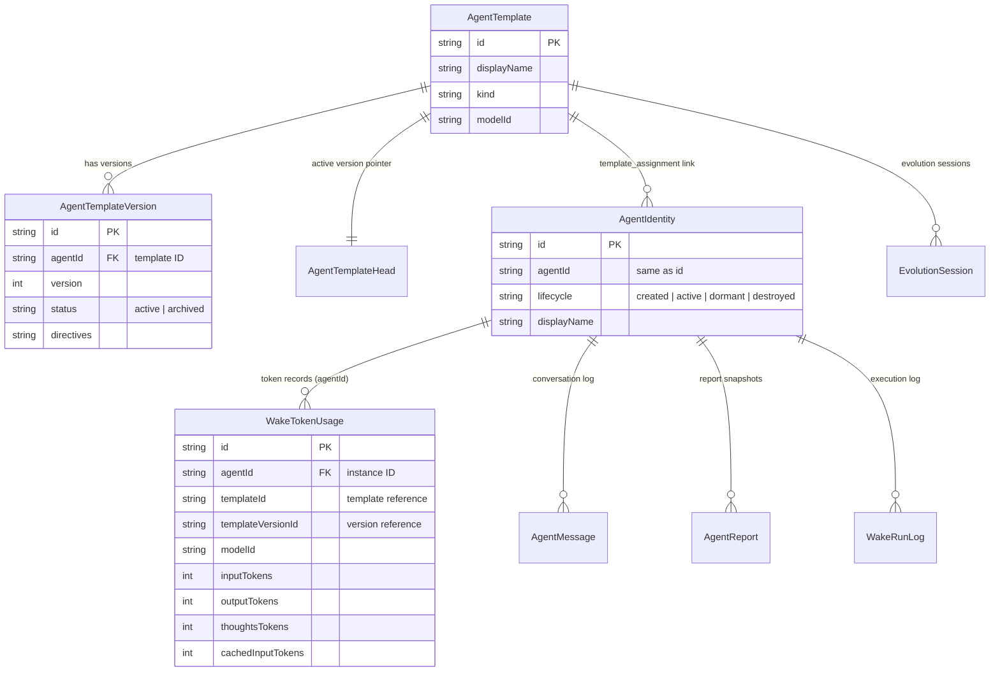
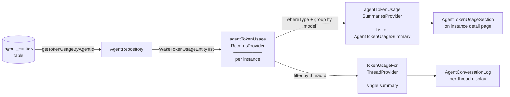
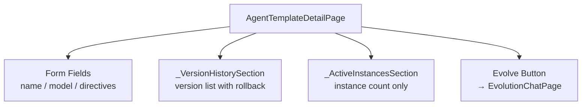
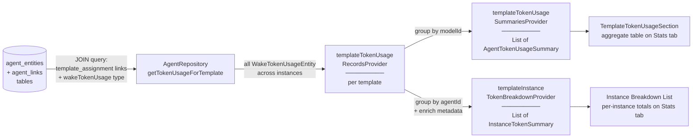
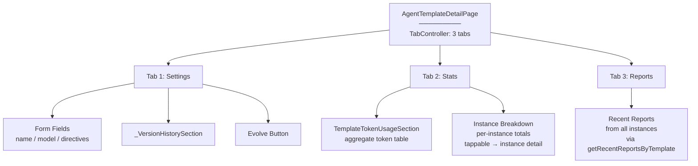
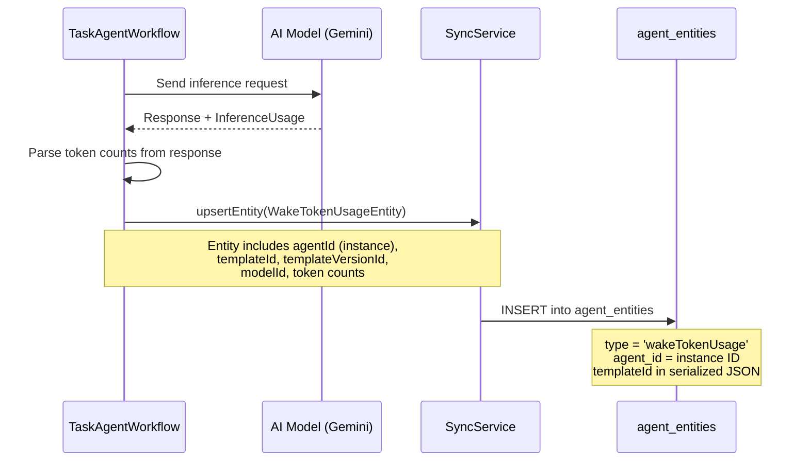
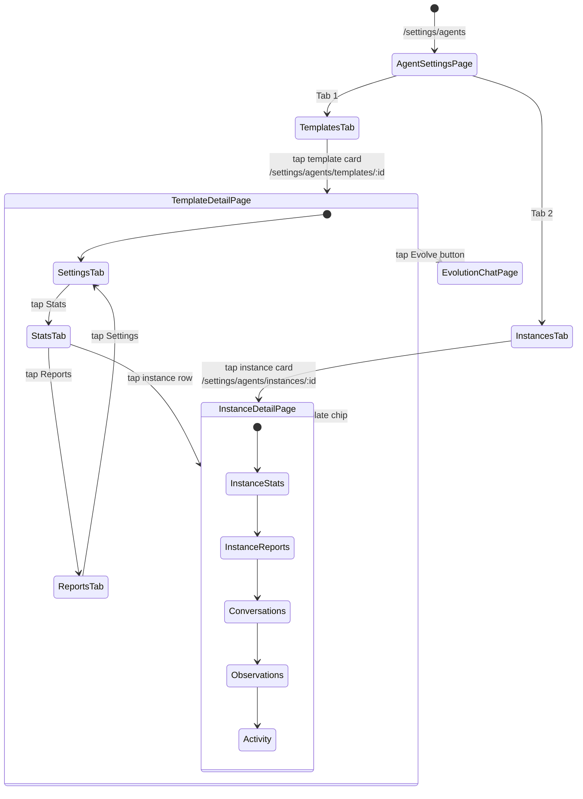
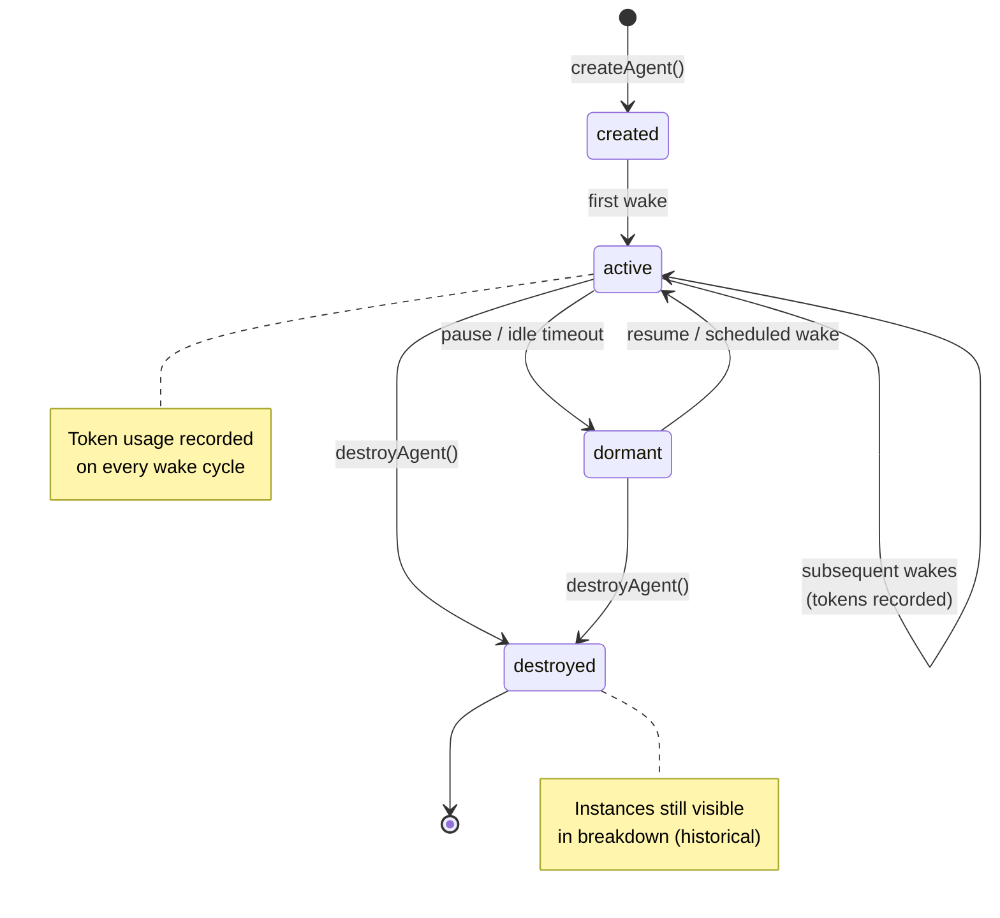

# Implementation Plan: Aggregate Token Usage Tracking per Template

**Date:** 2026-02-28
**Feature:** Template-level aggregate token usage statistics and introspection view
**Status:** Implemented (v0.9.882)

## Problem Statement

Individual agent instances already track token usage and costs (implemented in PRs #2713/#2715). However, there is no way to see the **total** token expenditure across all instances of a given template. Users need visibility into how much a prototype like "Laura" or "Tom" costs across its entire lifecycle — all instances ever created from that template.

Additionally, the template detail page currently only shows a form for editing directives, version history, and an instance count. There is no "inside view" for the template as a whole — no aggregate stats, no cross-instance reports, and no link to quickly navigate to instance details.

## Current Architecture

### Entity Relationship Model



### Current Provider Data Flow (Per-Instance)



### Current Template Detail Page (No Stats)



### Token Usage Data Model
- `WakeTokenUsageEntity` stores per-wake token counts with `agentId`, `templateId`, and `templateVersionId` fields
- `AgentTokenUsageSummary` aggregates per-model: input/output/thoughts/cached tokens + wake count
- Provider chain: `agentTokenUsageRecordsProvider` → `agentTokenUsageSummariesProvider` (per instance)

### Template ↔ Instance Linkage
- `agent_links` table with `type = 'template_assignment'`, `from_id = templateId`, `to_id = agentInstanceId`
- `AgentTemplateService.getAgentsForTemplate(templateId)` returns all linked instances
- `WakeTokenUsageEntity` already stores `templateId` — this is the key enabler

## Solution Overview

**Approach: Query by `templateId` on `WakeTokenUsageEntity` records**

Since every `WakeTokenUsageEntity` already stores `templateId`, we can aggregate directly without joining through `agent_links`. This is the most efficient path — a single indexed query on the `agent_entities` table.

The template detail page will be enhanced with a tabbed layout (similar to the instance detail page) to show aggregate stats alongside the existing form.

### Target Provider Data Flow (Per-Template Aggregate)



### Target Template Detail Page (Tabbed)



### Wake Token Recording Flow



### Navigation State Machine



## Implementation Steps

### Step 1: Database Query

Add a named query to `agent_database.drift` using the same JOIN pattern as `getRecentReportsByTemplate` and `getRecentObservationsByTemplate`:

```sql
getTokenUsageByTemplateId:
  SELECT ae.* FROM agent_entities ae
  INNER JOIN agent_links al
    ON al.to_id = ae.agent_id AND al.type = 'template_assignment'
  WHERE al.from_id = :templateId
    AND ae.type = 'wakeTokenUsage'
    AND ae.deleted_at IS NULL
    AND al.deleted_at IS NULL
  ORDER BY ae.created_at DESC
  LIMIT :limit;
```

This is a single query that resolves all instances of a template via `agent_links` and fetches their token usage records in one pass. No N+1 problem, no schema migration, and consistent with existing cross-instance queries in the codebase.

### Step 2: Repository Method

Add to `AgentRepository`:

```dart
/// Fetches token usage records for all instances of a template.
///
/// Single SQL JOIN via template_assignment links — same pattern as
/// [getRecentReportsByTemplate].
Future<List<WakeTokenUsageEntity>> getTokenUsageForTemplate(
  String templateId, {
  int limit = 10000,
}) async {
  final rows = await _db.getTokenUsageByTemplateId(
    templateId: templateId,
    limit: limit,
  );
  return rows
      .map(_deserializeEntity)
      .whereType<WakeTokenUsageEntity>()
      .toList();
}
```

### Step 3: Riverpod Providers

Add to `agent_providers.dart`:

```dart
/// Raw token usage records for all instances of a template.
@riverpod
Future<List<AgentDomainEntity>> templateTokenUsageRecords(
  Ref ref,
  String templateId,
) async {
  // Invalidate when any agent under this template updates
  ref.watch(agentTemplatesStreamProvider);
  final repository = ref.watch(agentRepositoryProvider);
  final records = await repository.getTokenUsageForTemplate(
    templateId,
    limit: 10000,
  );
  return records.cast<AgentDomainEntity>();
}

/// Aggregated token usage summaries for a template, grouped by model ID.
@riverpod
Future<List<AgentTokenUsageSummary>> templateTokenUsageSummaries(
  Ref ref,
  String templateId,
) async {
  final entities =
      await ref.watch(templateTokenUsageRecordsProvider(templateId).future);
  final records = entities.whereType<WakeTokenUsageEntity>();

  final map = <String, AgentTokenUsageSummary>{};
  for (final r in records) {
    final existing = map[r.modelId];
    map[r.modelId] = AgentTokenUsageSummary(
      modelId: r.modelId,
      inputTokens: (existing?.inputTokens ?? 0) + (r.inputTokens ?? 0),
      outputTokens: (existing?.outputTokens ?? 0) + (r.outputTokens ?? 0),
      thoughtsTokens:
          (existing?.thoughtsTokens ?? 0) + (r.thoughtsTokens ?? 0),
      cachedInputTokens:
          (existing?.cachedInputTokens ?? 0) + (r.cachedInputTokens ?? 0),
      wakeCount: (existing?.wakeCount ?? 0) + 1,
    );
  }

  return map.values.toList()
    ..sort((a, b) => b.totalTokens.compareTo(a.totalTokens));
}
```

### Step 4: Generalize the Token Usage Table Widget

The existing `AgentTokenUsageSection` is hardcoded to `agentTokenUsageSummariesProvider(agentId)`. Generalize it to accept summaries from any provider:

**Option A (minimal change):** Create a `TemplateTokenUsageSection` that watches `templateTokenUsageSummariesProvider` and delegates to the existing `_TokenUsageTable`.

**Option B (DRY):** Extract `_TokenUsageTable` into a public `TokenUsageTable` widget, then both `AgentTokenUsageSection` and a new `TemplateTokenUsageSection` use it.

**Decision: Option B** — extract the table widget. The `_TokenUsageTable` is already stateless and takes a `List<AgentTokenUsageSummary>`. Making it public is trivial.

Files to change:
- `agent_token_usage_section.dart` — extract `_TokenUsageTable` → `TokenUsageTable` (public)
- Create `template_token_usage_section.dart` — watches `templateTokenUsageSummariesProvider`

### Step 5: Enhanced Template Detail Page

Transform the template detail page from a flat form into a tabbed layout:

**Tab 1: "Settings"** (default) — existing form fields (name, model, directives), version history, evolve button
**Tab 2: "Stats"** — aggregate token usage table, instance count with links, per-instance breakdown
**Tab 3: "Reports"** — recent reports across all instances (already queryable via `getRecentReportsByTemplate`)

The stats tab contents:

```
┌──────────────────────────────────────────────┐
│ Aggregate Token Usage                        │
│ ┌──────────────────────────────────────────┐ │
│ │ Model      In    Out   Think  Cache Wakes│ │
│ │ gemini-pro 12k   8k    3k     2k    14   │ │
│ │ flash      5k    2k    1k     500   8    │ │
│ │ Total      17k   10k   4k     2.5k  22   │ │
│ └──────────────────────────────────────────┘ │
│                                              │
│ Per-Instance Breakdown                       │
│                                              │
│ ▾ Laura-1 (active)                           │
│ ┌──────────────────────────────────────────┐ │
│ │ Model      In    Out   Think  Cache Wakes│ │
│ │ gemini-pro 8k    5k    2k     1k    10   │ │
│ │ flash      2k    1k    500    200   3    │ │
│ │ Total      10k   6k    2.5k   1.2k  13   │ │
│ └──────────────────────────────────────────┘ │
│                                              │
│ ▸ Laura-2 (dormant)                          │
│ ▸ Laura-3 (destroyed)                        │
└──────────────────────────────────────────────┘
```

Each instance header is an expansion tile showing the full per-model token usage table (reusing the same `TokenUsageTable` widget). The header is also tappable → navigates to `/settings/agents/instances/{agentId}`.

### Step 6: Per-Instance Breakdown Provider

Add a provider that returns full per-model summaries for each instance of a template. This gives every instance the same level of detail as the aggregate table — different models have different pricing, so a single total number is not useful.

```dart
/// Per-instance token usage breakdown for a template.
///
/// Groups token records by instance, then by model within each instance.
/// Returns full per-model summaries so each instance can render a
/// [TokenUsageTable] identical in structure to the aggregate view.
@riverpod
Future<List<InstanceTokenBreakdown>> templateInstanceTokenBreakdown(
  Ref ref,
  String templateId,
) async {
  final entities =
      await ref.watch(templateTokenUsageRecordsProvider(templateId).future);
  final records = entities.whereType<WakeTokenUsageEntity>();

  // Group by agentId → modelId → AgentTokenUsageSummary
  final byAgent = <String, Map<String, AgentTokenUsageSummary>>{};
  for (final r in records) {
    final modelMap = byAgent.putIfAbsent(r.agentId, () => {});
    final existing = modelMap[r.modelId];
    modelMap[r.modelId] = AgentTokenUsageSummary(
      modelId: r.modelId,
      inputTokens: (existing?.inputTokens ?? 0) + (r.inputTokens ?? 0),
      outputTokens: (existing?.outputTokens ?? 0) + (r.outputTokens ?? 0),
      thoughtsTokens:
          (existing?.thoughtsTokens ?? 0) + (r.thoughtsTokens ?? 0),
      cachedInputTokens:
          (existing?.cachedInputTokens ?? 0) + (r.cachedInputTokens ?? 0),
      wakeCount: (existing?.wakeCount ?? 0) + 1,
    );
  }

  // Enrich with instance metadata
  final templateService = ref.watch(agentTemplateServiceProvider);
  final agents = await templateService.getAgentsForTemplate(templateId);

  return agents.map((agent) {
    final summaries = (byAgent[agent.agentId]?.values.toList() ?? [])
      ..sort((a, b) => b.totalTokens.compareTo(a.totalTokens));
    return InstanceTokenBreakdown(
      agentId: agent.id,
      displayName: agent.displayName,
      lifecycle: agent.lifecycle,
      summaries: summaries,
    );
  }).toList()
    // Sort by total tokens across all models, descending
    ..sort((a, b) {
      final aTotal = a.summaries.fold<int>(0, (s, e) => s + e.totalTokens);
      final bTotal = b.summaries.fold<int>(0, (s, e) => s + e.totalTokens);
      return bTotal.compareTo(aTotal);
    });
}
```

Add `InstanceTokenBreakdown` data class in `agent_token_usage.dart`:

```dart
/// Per-instance token usage with full per-model breakdown.
@immutable
class InstanceTokenBreakdown {
  const InstanceTokenBreakdown({
    required this.agentId,
    required this.displayName,
    required this.lifecycle,
    required this.summaries,
  });

  final String agentId;
  final String displayName;
  final AgentLifecycle lifecycle;
  final List<AgentTokenUsageSummary> summaries;
}
```

### Step 7: Localization

Add to all `.arb` files:

```
"agentTemplateStatsTab": "Stats",
"agentTemplateSettingsTab": "Settings",
"agentTemplateReportsTab": "Reports",
"agentTemplateTokenUsageHeading": "Aggregate Token Usage",
"agentTemplateInstanceBreakdownHeading": "Per-Instance Breakdown",
"agentTemplateInstanceTokens": "{count} tokens",
```

### Step 8: Tests

1. **Provider tests** (`test/features/agents/state/agent_providers_test.dart`):
   - `templateTokenUsageSummariesProvider` correctly aggregates across multiple instances
   - `templateInstanceTokenBreakdownProvider` groups by instance and enriches with metadata
   - Empty template (no instances) returns empty lists

2. **Widget tests** (`test/features/agents/ui/template_token_usage_section_test.dart`):
   - Renders loading state
   - Renders empty state
   - Renders table with data
   - Grand total row appears for multiple models

3. **Widget tests** (`test/features/agents/ui/agent_template_detail_page_test.dart`):
   - Stats tab is accessible and renders token usage section
   - Instance rows navigate to instance detail

## Schema Changes

**No schema migration required.** The SQL JOIN query uses existing tables and indexes (`idx_agent_links_from`, `idx_agent_entities_type`). The `templateId` field is already present on `WakeTokenUsageEntity`.

One new named query is added to `agent_database.drift` (named queries don't require schema bumps).

## File Change Summary

| File | Change |
|------|--------|
| `agent_database.drift` | Add `getTokenUsageByTemplateId` named query |
| `agent_repository.dart` | Add `getTokenUsageForTemplate()` method |
| `agent_providers.dart` | Add `templateTokenUsageRecords`, `templateTokenUsageSummaries`, `templateInstanceTokenBreakdown` providers |
| `agent_token_usage.dart` | Add `InstanceTokenBreakdown` data class |
| `agent_token_usage_section.dart` | Extract `_TokenUsageTable` → public `TokenUsageTable` |
| `template_token_usage_section.dart` | **New** — `TemplateTokenUsageSection` widget |
| `agent_template_detail_page.dart` | Add tabbed layout with Settings/Stats/Reports tabs |
| `app_*.arb` (6 files) | Add localization keys for new sections/tabs |
| Provider tests | Test aggregate providers |
| Widget tests | Test new/modified widgets |

## Agent Instance Lifecycle (Context for Breakdown Display)



## Implementation Outcome

**Completed:** 2026-02-28 | **Version:** 0.9.882

### What Was Built

All planned steps were implemented as designed, with minor deviations noted below.

### Files Changed

| File | Change |
|------|--------|
| `agent_database.drift` | Added `getTokenUsageByTemplateId` named query (SQL JOIN) |
| `agent_repository.dart` | Added `getTokenUsageForTemplate()` method |
| `agent_providers.dart` | Added 4 providers: `templateTokenUsageRecords`, `templateTokenUsageSummaries`, `templateInstanceTokenBreakdown`, `templateRecentReports` |
| `agent_token_usage.dart` | Added `InstanceTokenBreakdown` data class with equality, hashCode, toString |
| `agent_token_usage_section.dart` | Extracted `_TokenUsageTable` → public `TokenUsageTable` |
| `template_token_usage_section.dart` | **New** — `TemplateTokenUsageSection` with aggregate table + expansion tiles |
| `agent_template_detail_page.dart` | Refactored to `NestedScrollView` + `TabBar` (Settings/Stats/Reports) |
| `app_en.arb` + 5 locale files | Added 5 l10n keys |
| `agent_providers_test.dart` | Added 10 provider tests (summaries, breakdown, reports) |
| `agent_token_usage_test.dart` | Added 4 tests for `InstanceTokenBreakdown` |
| `template_token_usage_section_test.dart` | **New** — 13 widget tests |
| `agent_template_detail_page_test.dart` | Updated for tabbed layout, removed obsolete active instances test |

### Deviations from Plan

1. **`_ActiveInstancesSection` removed** — The per-instance breakdown in the Stats tab fully supersedes the old instance count display. Instance metadata (name, lifecycle badge) is shown directly in the breakdown expansion tiles, making a separate section redundant.

2. **`templateRecentReportsProvider` added** — Not in the original plan steps but needed for the Reports tab. Uses the existing `getRecentReportsByTemplate` repository method.

3. **`NestedScrollView` for edit mode only** — Create mode retains a flat `CustomScrollView` since tabs are irrelevant for a new template. The `TabController` is only instantiated in edit mode.

4. **Localization key naming** — Used `agentTemplateAggregateTokenUsageHeading` (more descriptive) instead of the planned `agentTemplateTokenUsageHeading`.

### Test Coverage

- **1359 agent tests passing** (full test suite)
- **Provider tests:** Empty state, multi-instance aggregation, sort order, null token fields, instance grouping, instances with no records, reports
- **Widget tests:** Loading/empty/error states, formatted token counts, grand total row, expansion tile rendering, lifecycle badges, expand-to-show-table, error propagation
- **Detail page tests:** All 21 existing tests updated and passing with new provider overrides

### Architectural Decisions

| Decision | Rationale |
|----------|-----------|
| SQL JOIN over N+1 queries | Consistent with existing `getRecentReportsByTemplate` pattern; single query for all instances |
| No schema migration | Named queries in `.drift` don't require version bumps |
| Shared `TokenUsageTable` widget | DRY — same table renders per-instance, per-template aggregate, and inside expansion tiles |
| `NestedScrollView` + `TabBar` | Standard Flutter pattern for pinned app bar with tabs; `TabBarView` children are lazy |
| `InstanceTokenBreakdown` as plain class (not Freezed) | Follows existing `AgentTokenUsageSummary` pattern; simple enough to not warrant codegen |

## Future Work (Out of Scope)

- **Cost estimation:** Multiply token counts by model pricing to show dollar amounts (requires a pricing table)
- **Time-series charts:** Token usage over time, burn rate visualization
- **Budget/alerting:** Set spending limits per template and alert when approaching
- **Version-level breakdown:** Show token usage grouped by template version (the data is already there via `templateVersionId`)
- **Global dashboard:** Cross-template cost overview showing all templates ranked by expenditure
