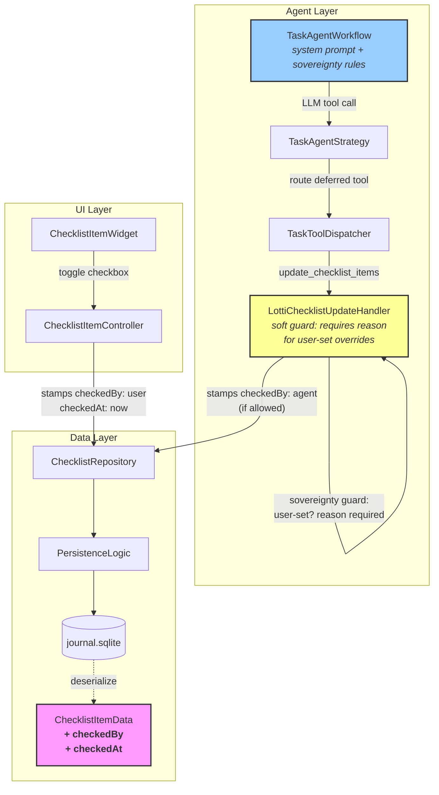
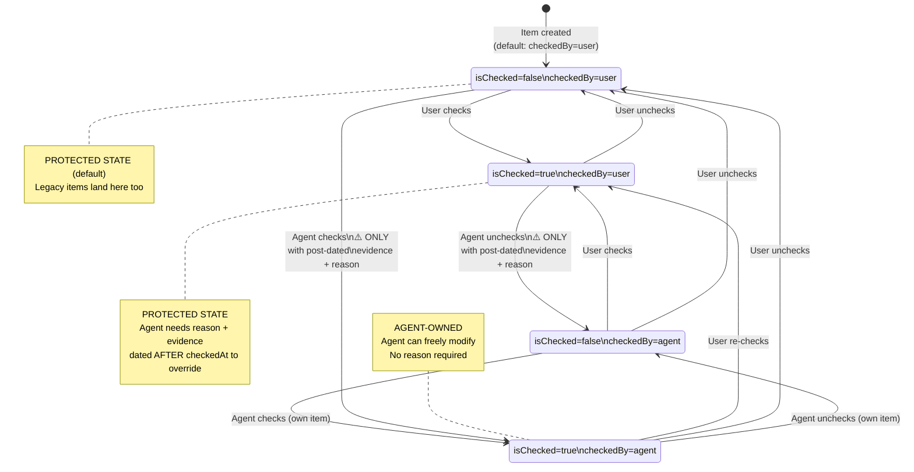
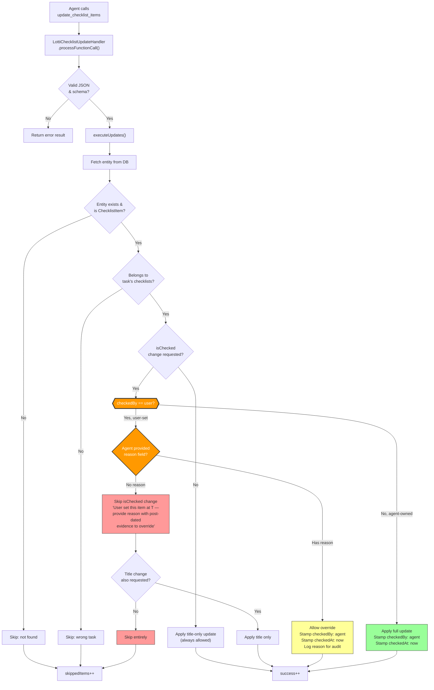
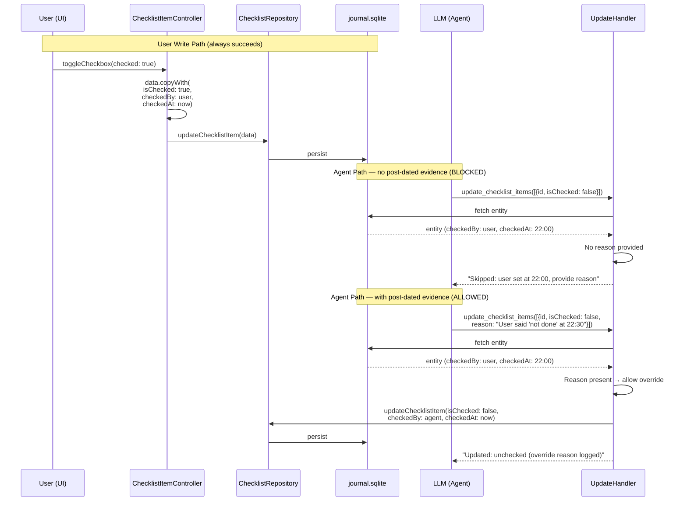
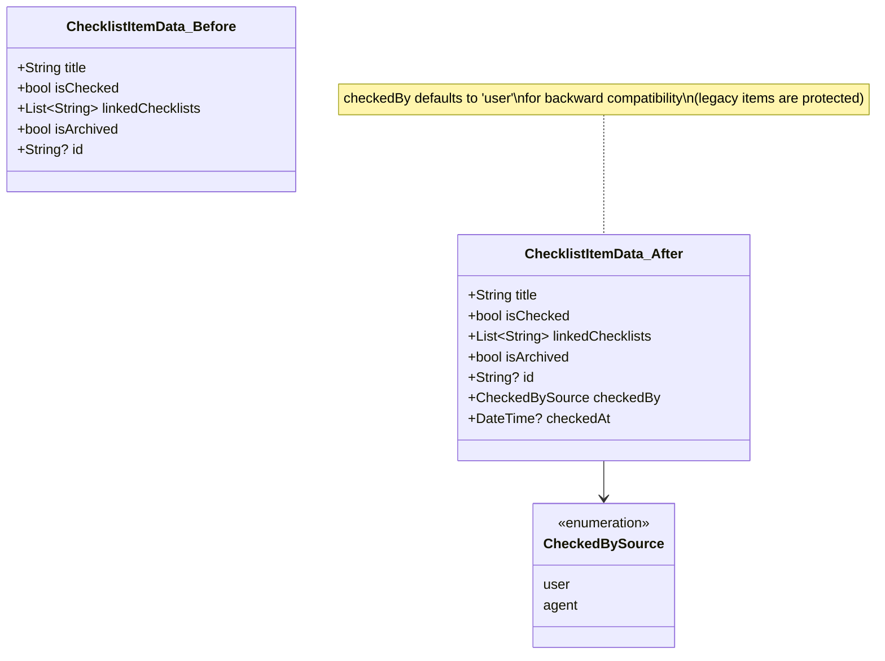
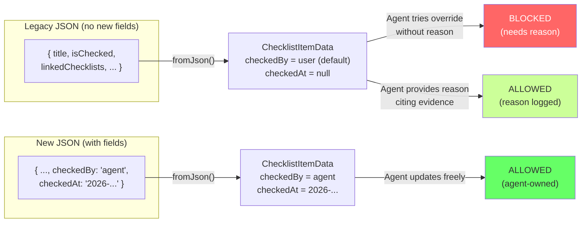
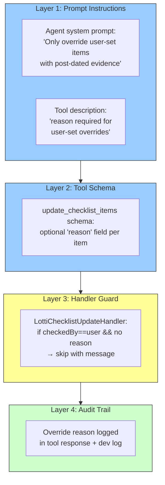

# Checklist User Sovereignty: Prevent Agent from Reverting User-Checked Items

**Date:** 2026-02-28
**Status:** Implemented
**Priority:** P1
**Estimated effort:** ~2 hours

## Problem

The task agent reverses user-manual checklist completions when it cannot find
supporting evidence in the logs. If a user checks an item "done" at 10 PM,
and the agent wakes at 10:05 PM seeing no textual evidence, it unchecks the
item. This undermines trust and takes away user agency.

## Root Cause

`ChecklistItemData` has no provenance metadata — there is no way to
distinguish a user toggle from an agent toggle. The agent's
`update_checklist_items` tool and the `LottiChecklistUpdateHandler` treat
every `isChecked` value identically, regardless of who set it.

## Design Principles

1. **User actions carry weight.** A user-set state should not be overridden
   by the agent unless there is explicit evidence **from after** the user's
   action that justifies the change (e.g., a recording where the user says
   "actually, that's not done yet").
2. **Absence of evidence is not evidence of absence.** If the agent cannot
   find logs supporting a user-checked item, the item stays checked. The
   user may have completed the task outside of the app.
3. **Post-dated evidence unlocks override.** If the user checks an item at
   10 PM and then records at 10:30 PM "I realized X isn't actually done",
   the agent MAY uncheck it — the evidence postdates the user's action.
4. **Backward compatible.** Existing items (with no metadata) default to
   `user` provenance and are treated as user-set for safety.
5. **Minimal surface.** Only the `ChecklistItemData` model, the two write
   paths, the agent prompt, and the tool guard need to change.

---

## Architecture & Flow Diagrams

### System Architecture — Components Involved



### Evidence-Based Override Model

```mermaid
timeline
    title When can the agent override a user-checked item?
    section 10:00 PM : User checks item "Done"
        : checkedBy = user
        : checkedAt = 22:00
    section 10:05 PM : Agent wakes, sees no evidence
        : ❌ CANNOT uncheck
        : Absence of evidence ≠ evidence of absence
    section 10:30 PM : User records "X isn't done yet"
        : New evidence timestamped AFTER 22:00
    section 10:35 PM : Agent wakes, sees post-dated evidence
        : ✅ CAN uncheck (with reason citing the recording)
```

### Checklist Item State Machine — `isChecked` with Provenance



### Agent Update Flow — Decision Logic



### Write Path Comparison — User vs Agent



### Data Model Change — Before & After



### Legacy Deserialization — Backward Compatibility



### Enforcement Layers — Defense in Depth



---

## Implementation Plan

### Phase 1 — Data Model (`ChecklistItemData`)

**File:** `lib/classes/checklist_item_data.dart`

Add two optional fields with safe defaults:

```dart
@freezed
abstract class ChecklistItemData with _$ChecklistItemData {
  const factory ChecklistItemData({
    required String title,
    required bool isChecked,
    required List<String> linkedChecklists,
    @Default(false) bool isArchived,
    String? id,
    // --- new fields ---
    @Default(CheckedBySource.user) CheckedBySource checkedBy,
    DateTime? checkedAt,
  }) = _ChecklistItemData;

  factory ChecklistItemData.fromJson(Map<String, dynamic> json) =>
      _$ChecklistItemDataFromJson(json);
}

/// Who last changed the `isChecked` field.
enum CheckedBySource {
  /// Set by the user via the UI.
  user,
  /// Set by an AI agent tool call.
  agent,
}
```

**Why `@Default(CheckedBySource.user)`?** Legacy items have no metadata.
Defaulting to `user` is the safe choice — it means the agent needs to
provide a reason to override, which is the correct conservative behavior.

**Why `checkedAt` instead of a generic `lastUpdatedAt`?** The `meta.updatedAt`
already tracks the last write time for the whole entity. We specifically need
to know when the *checked state* last changed and by whom, so we scope the
timestamp narrowly. The agent uses `checkedAt` to determine whether its
evidence postdates the user's action.

**Migration:** No schema migration needed. `ChecklistItemData` is serialized
as JSON inside the journal `serialized` column. Freezed + `json_serializable`
handle missing keys via the `@Default` annotation — old records deserialize
cleanly.

**After editing:** Run `make build_runner` to regenerate `.freezed.dart` and
`.g.dart` files.

---

### Phase 2 — User Write Path

When the user toggles a checkbox in the UI, stamp `checkedBy: user` and
`checkedAt`.

**File:** `lib/features/tasks/state/checklist_item_controller.dart`

In `updateChecked()`:

```dart
void updateChecked({required bool checked}) {
  final current = state.value;
  final data = current?.data;
  if (current != null && data != null) {
    final updated = current.copyWith(
      data: data.copyWith(
        isChecked: checked,
        checkedBy: CheckedBySource.user,   // <-- new
        checkedAt: DateTime.now(),          // <-- new
      ),
    );
    ref.read(checklistRepositoryProvider).updateChecklistItem(
          checklistItemId: id,
          data: updated.data,
          taskId: taskId,
        );
    state = AsyncData(updated);
  }
}
```

Similarly, any other UI path that creates items (e.g.,
`ChecklistRepository.createChecklistItem`, `addItemToChecklist`) should
default to `CheckedBySource.user` (which the `@Default` already provides).

---

### Phase 3 — Tool Schema Update (add `reason` field)

**File:** `lib/features/ai/functions/checklist_completion_functions.dart`

Add an optional `reason` field to each item in the `update_checklist_items`
tool schema:

```dart
'reason': {
  'type': 'string',
  'description':
      'Required when changing isChecked on a user-set item. '
      'Must cite specific evidence (e.g., a recording or note) '
      'that postdates the user\'s last toggle. The system will '
      'reject isChecked changes on user-set items without a reason.',
},
```

Update the tool `description` to mention the policy:

```
'Update one or more existing checklist items. You can mark items as '
'done/undone or correct titles. When an item was last toggled by the '
'user, you must provide a reason citing evidence from AFTER the '
'user\'s action to change its checked state. Title updates are '
'always allowed.'
```

Update the `isChecked` field description:

```
'New checked status. For items last set by the user, you must also '
'provide a reason citing post-dated evidence. Without a reason, the '
'isChecked change will be rejected for user-set items.'
```

---

### Phase 4 — Agent Write Path (Soft Guard Logic)

**File:** `lib/features/ai/functions/lotti_checklist_update_handler.dart`

**Validation change in `processFunctionCall()`:** Accept the new optional
`reason` field per item:

```dart
validatedItems.add({
  'id': id.trim(),
  if (isChecked != null) 'isChecked': isChecked,
  if (normalizedTitle != null) 'title': normalizedTitle,
  if (reason != null) 'reason': reason,   // <-- new
});
```

**Guard logic in `executeUpdates()`:** After fetching the entity, before
applying `isChecked` changes:

```dart
// --- User sovereignty soft guard ---
if (newIsChecked != null && newIsChecked != currentIsChecked) {
  final isUserSet = entity.data.checkedBy == CheckedBySource.user;
  final reason = item['reason'] as String?;

  if (isUserSet && (reason == null || reason.trim().isEmpty)) {
    // Agent has no justification for overriding a user action.
    final checkedAtStr = entity.data.checkedAt?.toIso8601String() ?? 'unknown';
    _skip(
      id,
      'User set this item at $checkedAtStr. Provide a reason '
      'citing evidence from after that time to override.',
    );

    // Still allow a title update if requested
    if (titleChanged) {
      final titleOnlyData = entity.data.copyWith(title: newTitle!);
      await checklistRepository.updateChecklistItem(
        checklistItemId: id,
        data: titleOnlyData,
        taskId: task.id,
      );
      _updatedItems.add(UpdatedItemDetail(
        id: id,
        title: newTitle,
        isChecked: currentIsChecked,
        changes: ['title'],
      ));
      successCount++;
    }
    continue;
  }

  // Log override reason for audit
  if (isUserSet && reason != null) {
    developer.log(
      'Overriding user-set item $id. Reason: $reason',
      name: 'LottiChecklistUpdateHandler',
    );
  }
}
```

When the agent *is* allowed to update `isChecked` (agent-owned, or user-set
with valid reason), stamp the provenance:

```dart
final updatedData = entity.data.copyWith(
  isChecked: newIsChecked ?? currentIsChecked,
  title: newTitle ?? currentTitle,
  checkedBy: (newIsChecked != null)
      ? CheckedBySource.agent
      : entity.data.checkedBy,
  checkedAt: (newIsChecked != null)
      ? DateTime.now()
      : entity.data.checkedAt,
);
```

---

### Phase 5 — Agent Prompt Update

**File:** `lib/features/agents/workflow/task_agent_workflow.dart`

Add a new section to `taskAgentScaffold` under "Tool Usage Guidelines":

```
- **Checklist sovereignty**: Checklist items track who last toggled them
  (user or agent) and when (`checkedAt`). Rules:
  - If YOU (the agent) last set the item, you can freely change it.
  - If the USER last set the item, you must NOT change its checked state
    UNLESS you have clear evidence from journal entries, recordings, or
    notes that are timestamped AFTER the user's `checkedAt` time.
  - Absence of evidence is NOT grounds for unchecking. The user may have
    completed the task outside the app.
  - When overriding a user-set item, you MUST provide a `reason` field in
    the tool call explaining what post-dated evidence justifies the change.
    Without a reason, the system will reject the isChecked change.
  - Title updates (fixing typos, transcription errors) are always allowed
    regardless of who last toggled the item.
```

---

### Phase 6 — Expose Provenance in Agent Context

**File:** `lib/features/agents/workflow/task_agent_workflow.dart` (or
wherever checklist items are serialized into the agent's context)

When building the task context that the agent sees, include `checkedBy` and
`checkedAt` for each checklist item so the agent can make informed decisions:

```json
{
  "id": "abc-123",
  "title": "Write integration tests",
  "isChecked": true,
  "checkedBy": "user",
  "checkedAt": "2026-02-28T22:00:00Z"
}
```

This is critical — without visibility into provenance, the agent cannot
follow the prompt rules.

---

### Phase 7 — Agent Tool Registry Description

**File:** `lib/features/agents/tools/agent_tool_registry.dart`

If the `update_checklist_items` tool has its own description in the registry
(separate from `checklist_completion_functions.dart`), update it consistently
with the same sovereignty language. Also add the `reason` field to the
registry's schema if it defines one independently.

---

### Phase 8 — Tests

#### 8a. Unit test: `LottiChecklistUpdateHandler` sovereignty guard

**File:** `test/features/ai/functions/lotti_checklist_update_handler_test.dart`

Test cases:
1. **Agent blocked: user-set, no reason** — item has `checkedBy: user`,
   agent tries to uncheck without reason → skipped with descriptive message.
2. **Agent allowed: user-set, with reason** — item has `checkedBy: user`,
   agent provides reason → override succeeds, `checkedBy` flips to `agent`.
3. **Agent freely updates agent-set item** — item has `checkedBy: agent`,
   agent toggles without reason → success.
4. **Title-only passthrough on blocked override** — item has
   `checkedBy: user`, agent sends title + isChecked without reason →
   title updated, isChecked skipped.
5. **Legacy item (default)** — item has `checkedBy: user` (default
   from missing JSON field) → treated as user-set, requires reason.
6. **Empty reason treated as missing** — reason: `"  "` → still blocked.

#### 8b. Unit test: `ChecklistItemController.updateChecked` stamps provenance

**File:** `test/features/tasks/state/checklist_item_controller_test.dart`

Test that calling `updateChecked(checked: true)` produces data with
`checkedBy == CheckedBySource.user` and a non-null `checkedAt`.

#### 8c. Serialization round-trip

Verify that `ChecklistItemData.fromJson` / `.toJson` correctly handles:
- New fields present → deserialized correctly.
- New fields missing (legacy JSON) → defaults applied (`user`, `null`).

---

## Files Changed (Summary)

| File | Change |
|------|--------|
| `lib/classes/checklist_item_data.dart` | Add `checkedBy`, `checkedAt` fields + `CheckedBySource` enum |
| `lib/features/tasks/state/checklist_item_controller.dart` | Stamp `checkedBy: user` on toggle |
| `lib/features/ai/functions/checklist_completion_functions.dart` | Add `reason` to schema, update descriptions |
| `lib/features/ai/functions/lotti_checklist_update_handler.dart` | Soft sovereignty guard + stamp `checkedBy: agent` |
| `lib/features/agents/workflow/task_agent_workflow.dart` | Prompt addition + provenance in context |
| `lib/features/agents/tools/agent_tool_registry.dart` | Tool description + schema update |
| Tests (3 files) | New/updated test cases |

---

## Risks & Mitigations

| Risk | Mitigation |
|------|-----------|
| Agent fabricates reasons to bypass the guard | The reason is logged for audit. The prompt instructs it to cite specific timestamped evidence. If this becomes a pattern, we can add a harder block in a follow-up. |
| Legacy items default to `user` → agent always needs reason for old items | Correct conservative behavior. Once the agent or user toggles an old item, provenance is stamped going forward. |
| Agent doesn't see `checkedAt` in context | Phase 6 ensures provenance is included in the task context JSON. |
| `DateTime.now()` in production code | Acceptable — this is a real timestamp, not a test. Tests will use deterministic dates per project policy. |
| JSON size increase | Negligible — two small fields + occasional reason string per item. |

---

## Out of Scope

- UI indicator showing who last toggled an item (could be a follow-up).
- Audit log / history of checklist state changes.
- Hard-blocking the agent entirely (we chose the softer evidence-based approach).
- Changes to the `suggest_checklist_completion` flow (it only suggests,
  doesn't directly modify state).

---

## Post-Implementation Hardening (2026-02-28)

After the initial implementation, the following hardening measures were added:

### 1. Minimum reason length enforcement
The sovereignty guard now requires reasons to be at least 20 characters
(`minReasonLength`). This prevents trivial/hallucinated justifications like
"ok" or "done" from bypassing the guard. The agent must provide a
substantive reason citing specific evidence.

### 2. Safe enum deserialization
`CheckedBySource` now uses `@JsonKey(unknownEnumValue: CheckedBySource.user)`
so that unknown persisted values (from future versions or data corruption)
safely default to `user` instead of throwing an `ArgumentError` during
deserialization. This is the correct conservative fallback — unknown
provenance is treated as user-owned.

### 3. Injectable clocks
Both `UnifiedAiInferenceRepository` and `ChecklistItemController` now use
injectable clock functions instead of `DateTime.now()`, enabling deterministic
timestamp assertions in tests.

### 4. Auto-check sovereignty guard
The auto-check path in `UnifiedAiInferenceRepository` now respects the
sovereignty guard: items with `checkedBy: user` are never auto-checked,
since auto-check has no reason to provide.
