# Agent Schema Evolution: Template & Report Split

**Date**: 2026-03-01
**Status**: Draft
**Related PRs**: #2728 (plan & ADRs), #2732–#2735 (evolution agent implementation)

---

## Problem Statement

The current agent template data model conflates two distinct concerns in a single `directives` field:

1. **General behavioral instructions** — persona, tools, objectives ("be this assistant, do these things")
2. **Report formatting instructions** — how to structure output ("use these sections, these emojis")

This conflation causes the evolution agent to propose mixed changes where behavioral tweaks inadvertently alter report formatting, and vice versa. Additionally, reports are stored as a single markdown blob, limiting UI flexibility (e.g., always-visible TLDR vs. expandable detail).

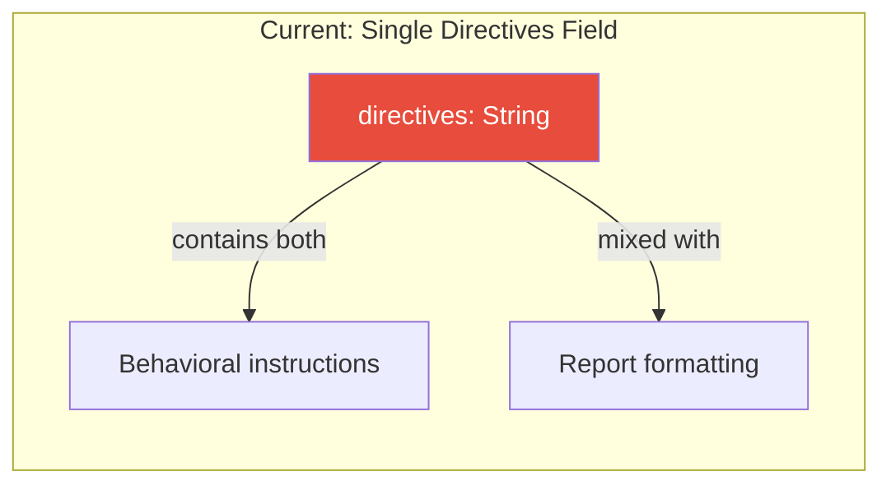

### Target Architecture

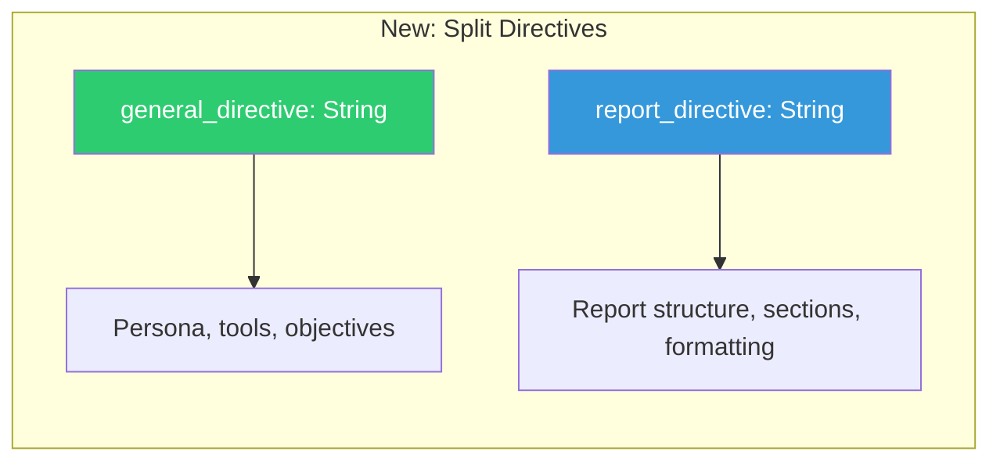

---

## Scope

### In Scope
1. **Data model refactoring** — split `directives` into `generalDirective` + `reportDirective`
2. **Report structure enhancement** — split report `content` into `tldr` + `report`
3. **UI improvements** — dual-field report rendering, backwards compatibility
4. **Evolution workflow updates** — evolve both directive fields independently

### Out of Scope (Future)
- Real-time voice transcription in chat (tracked separately)
- Chat entry point UX overhaul for observations

---

## 1. Data Model Changes

### 1.1 AgentTemplateVersionEntity

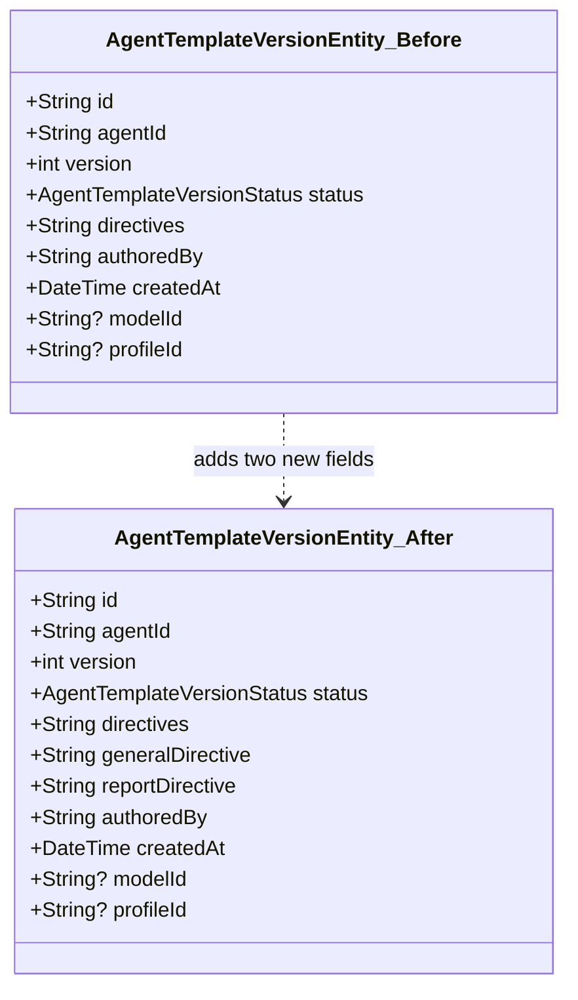

**Changes to `agent_domain_entity.dart`:**

```dart
// Keep existing field:
required String directives,

// Add new fields alongside:
@Default('') String generalDirective,
@Default('') String reportDirective,
```

The `directives` field is **kept** for backwards compatibility — existing serialized entities and sync from older devices continue to work. The two new fields default to `''` and are populated by a seeding pass for existing templates. Going forward, new versions write to `generalDirective` + `reportDirective`; the old `directives` field is still written (as the concatenation of both, or kept for legacy consumers) but the system prompt is built from the new fields.

### 1.2 AgentReportEntity

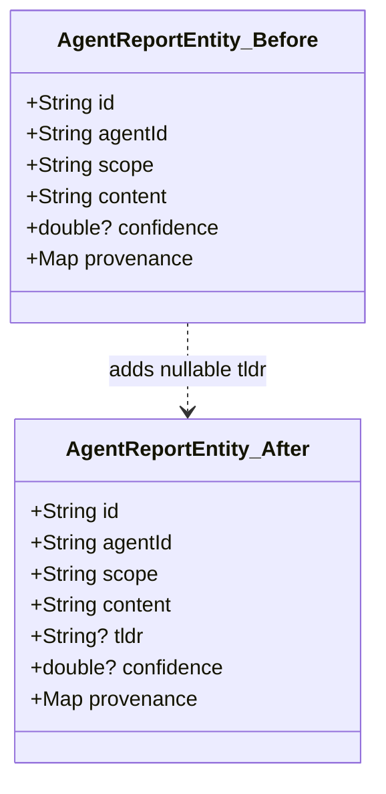

**Changes:**

```dart
// Before:
@Default('') String content,

// After:
@Default('') String content,
String? tldr,
```

**No migration needed**: The `content` field stays as-is. The new `tldr` field is nullable — old reports have `tldr: null`. Going forward, `update_report` populates both `tldr` and `content`. The UI shows the structured `tldr` when present, otherwise falls back to extracting the first paragraph of `content` as a synthetic TLDR.

### 1.3 PendingProposal (evolution_strategy.dart)

```dart
// Before:
class PendingProposal {
  final String directives;
  final String rationale;
}

// After:
class PendingProposal {
  final String generalDirective;
  final String reportDirective;
  final String rationale;
}
```

---

## 2. Data Flow Changes

### 2.1 Task Agent Wake — System Prompt Construction

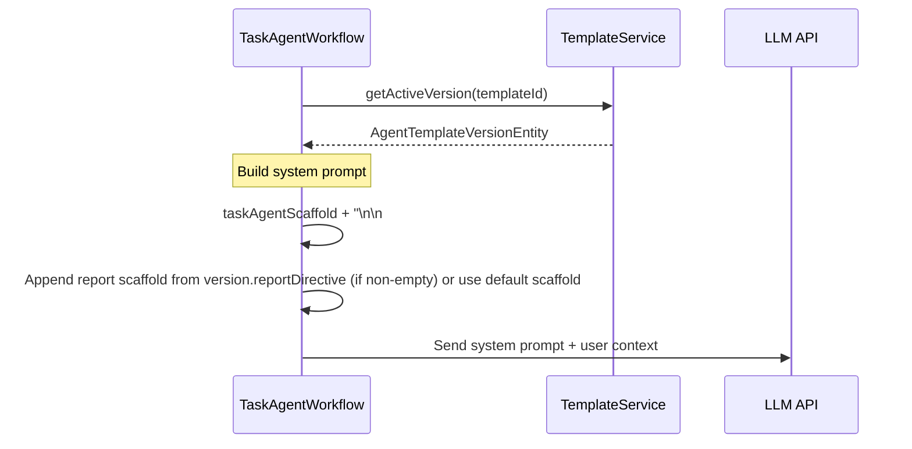

**Key change in `task_agent_workflow.dart`:**

```dart
// Before:
String _buildSystemPrompt(_TemplateContext ctx) {
  return '$taskAgentScaffold\n\n'
      '## Your Personality & Directives\n\n'
      '${ctx.version.directives}';
}

// After:
String _buildSystemPrompt(_TemplateContext ctx) {
  final version = ctx.version;

  // New fields populated → use them
  if (version.generalDirective.isNotEmpty) {
    final reportSection = version.reportDirective.isNotEmpty
        ? version.reportDirective
        : _defaultReportDirective;
    return '$taskAgentScaffold\n\n'
        '## Your Personality & Directives\n\n'
        '${version.generalDirective}\n\n'
        '## Report Format\n\n'
        '$reportSection';
  }

  // Fallback to legacy directives field (unseeded versions)
  return '$taskAgentScaffold\n\n'
      '## Your Personality & Directives\n\n'
      '${version.directives}';
}
```

The `taskAgentScaffold` constant currently embeds report formatting instructions. These will be extracted into `_defaultReportDirective` and used as the fallback when `reportDirective` is empty. When `generalDirective` is also empty (pre-seeding), the old `directives` field is used as-is — ensuring zero behavior change for unseeded templates.

### 2.2 Report Creation — update_report Tool

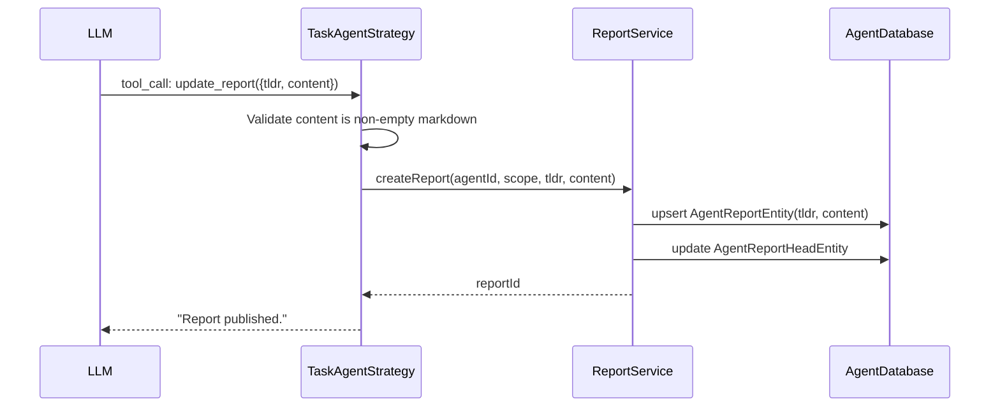

**Tool signature change:**

```
// Before:
update_report(content: string)

// After:
update_report(tldr: string, content: string)
```

The `tldr` parameter is required going forward. The `content` parameter keeps its name and purpose — the full markdown report body.

### 2.3 Evolution Session — Directive Proposal Flow

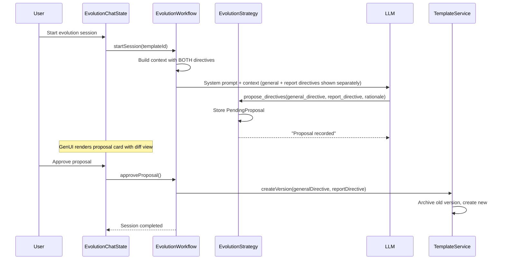

---

## 3. UI Changes

### 3.1 Report Display — TLDR + Content Rendering

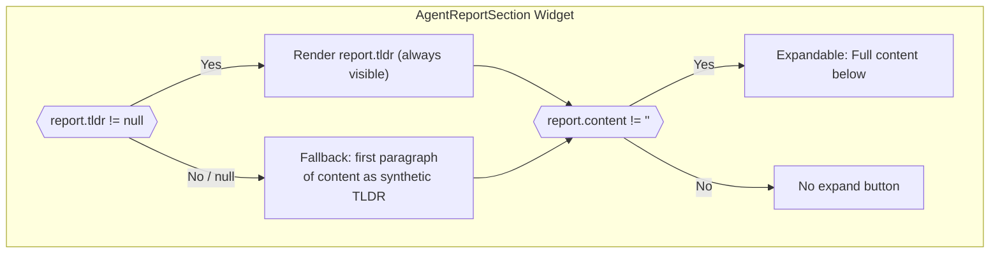

**Backwards compatibility**: Old reports have `tldr: null`. The widget falls back to extracting the first paragraph of `content` as a synthetic TLDR. New reports populate `tldr` directly from the structured tool call.

### 3.2 Template Edit Page — Split Directive Fields

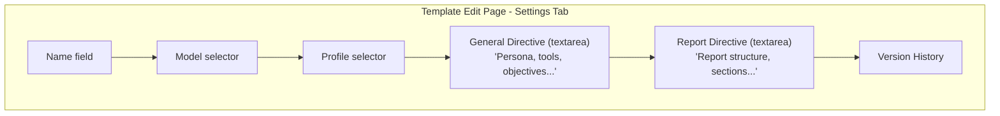

The edit page gets two separate text areas:
- **General Directive** — with hint text like "Define the agent's persona, available tools, and overall objective..."
- **Report Directive** — with hint text like "Define how the agent should structure its output report..."

### 3.3 Evolution Chat — Proposal Card

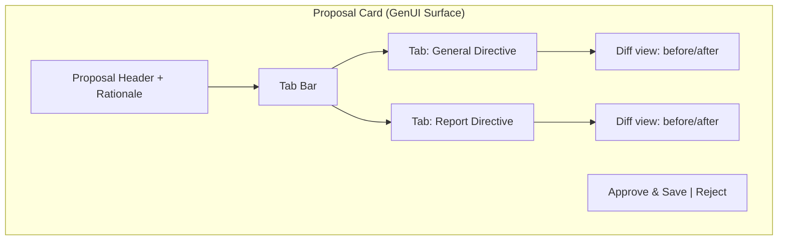

---

## 4. Evolution Context Builder Changes

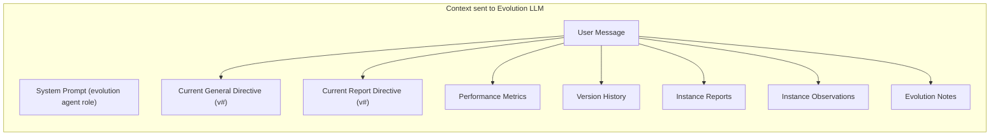

The evolution context builder must present both directives separately so the LLM understands which field to evolve:

```
## Current General Directive (v14)
[general directive content]

## Current Report Directive (v14)
[report directive content]
```

The `propose_directives` tool schema changes to accept both fields:

```json
{
  "name": "propose_directives",
  "parameters": {
    "general_directive": { "type": "string", "description": "Complete rewritten general directive" },
    "report_directive": { "type": "string", "description": "Complete rewritten report directive" },
    "rationale": { "type": "string", "description": "Explanation for changes" }
  },
  "required": ["general_directive", "report_directive", "rationale"]
}
```

---

## 5. Migration Strategy — Fresh Seeding

Both `generalDirective` and `reportDirective` default to `@Default('')` in the freezed model, so old entities deserialize cleanly. The old `directives` field is **not** copied wholesale — instead, a **seeding pass** writes fresh, purpose-built content into each field for every existing template version where the new fields are empty.

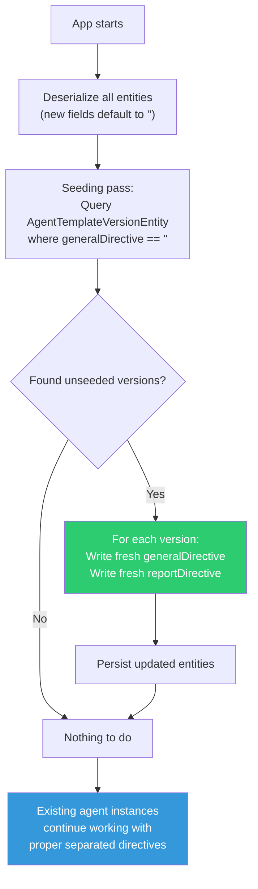

### Why fresh directives, not copy-paste

The old `directives` field was a grab-bag of persona, tool hints, and report formatting — all tangled together. Simply copying it to both fields perpetuates the confusion. Instead, we seed each template kind with well-crafted defaults that match the app's actual needs.

### Seeded `reportDirective` — the key improvement

The current `taskAgentScaffold` has report instructions baked into the scaffold constant (lines 632–684 of `task_agent_workflow.dart`). These work, but they miss what the task summary prompt does well: **extracting links from log entries and linked tasks**.

The seeded `reportDirective` for task agents should match the quality of the preconfigured task summary prompt's link handling:

```markdown
## Report Structure

You MUST call `update_report` with two fields: `tldr` and `report`.

### TLDR field
A concise 1-3 sentence overview of the task's current state. This is what
the user sees in the collapsed view. Be punchy and motivational. Include 1-2
relevant emojis matching the task state.

### Report field
Full markdown report with these sections:

1. **✅ Achieved** — Bulleted list of completed items. Omit if nothing achieved.
2. **📌 What is left to do** — Remaining work items as strict Markdown checkboxes
   (`- [ ] pending`, `- [x] completed`). Omit if task is complete.
3. **💡 Learnings** — Key insights or decisions worth surfacing. Omit if none.
4. **🔗 Links** — Extract ALL URLs found across:
   - Log entries in the task context (GitHub PRs, issues, Stack Overflow, docs, etc.)
   - Linked task summaries (parent/child tasks may reference relevant PRs or issues)
   Format each as Markdown: `[Succinct 2-5 word title](URL)`.
   Omit section if no links found.

You MAY add extra sections (e.g., ⚠️ Blockers, 📊 Metrics) when they add value.

### What NOT to include
- No internal reasoning, "I noticed...", debugging notes, or agent self-reflection
- Use `record_observations` for all private notes

### Writing style
- Write in the task's detected language
- Express personality from your general directive
- User-facing only — no meta-commentary about being an agent
- Present tense for current state, past tense for completed work
```

### Seeded `generalDirective` — per template kind

For **Task Agent** templates, the `generalDirective` keeps the behavioral/persona content that was previously in `directives`, cleaned up:

```markdown
You are a persistent, detail-oriented assistant. Your personality is
[template-specific: warm/professional/casual — preserved from old directives].

Handle imperfect user inputs (rough audio transcripts, typos) gracefully,
inferring intent without frustration. When in doubt, ask rather than assume.

**Verification over Inference**: Do not mark checklist items as complete
based on proxy events (e.g., a TestFlight release). Only check items off
when completion is explicitly confirmed by the user or directly observed.

**Tool discipline**: Review "Recent User Decisions" before proposing changes.
If the user rejected a similar proposal before, do not repeat it unless
circumstances have clearly changed.
```

For **Template Improver** templates, the `generalDirective` describes the meta-improvement role.

### Seeding implementation

The seeding happens in `AgentTemplateService` (or a dedicated migration helper) on startup:

```dart
Future<void> seedDirectiveFields() async {
  final versions = await repository.getAllVersionsWithEmptyDirectiveFields();
  for (final version in versions) {
    // Read the old 'directives' from the raw JSON (still in serialized column)
    final oldDirectives = version.directives; // legacy field, kept for reading

    // Generate fresh directives based on template kind
    final template = await repository.getTemplate(version.agentId);
    final generalDirective = _buildFreshGeneralDirective(template, oldDirectives);
    final reportDirective = _buildFreshReportDirective(template);

    await repository.updateVersion(
      version.copyWith(
        generalDirective: generalDirective,
        reportDirective: reportDirective,
      ),
    );
  }
}
```

### Scaffold extraction

The report-related section currently in `taskAgentScaffold` (lines 632–700) is **extracted out** of the scaffold and becomes the default `reportDirective`. The scaffold retains only the behavioral/tool-usage instructions. When building the system prompt:

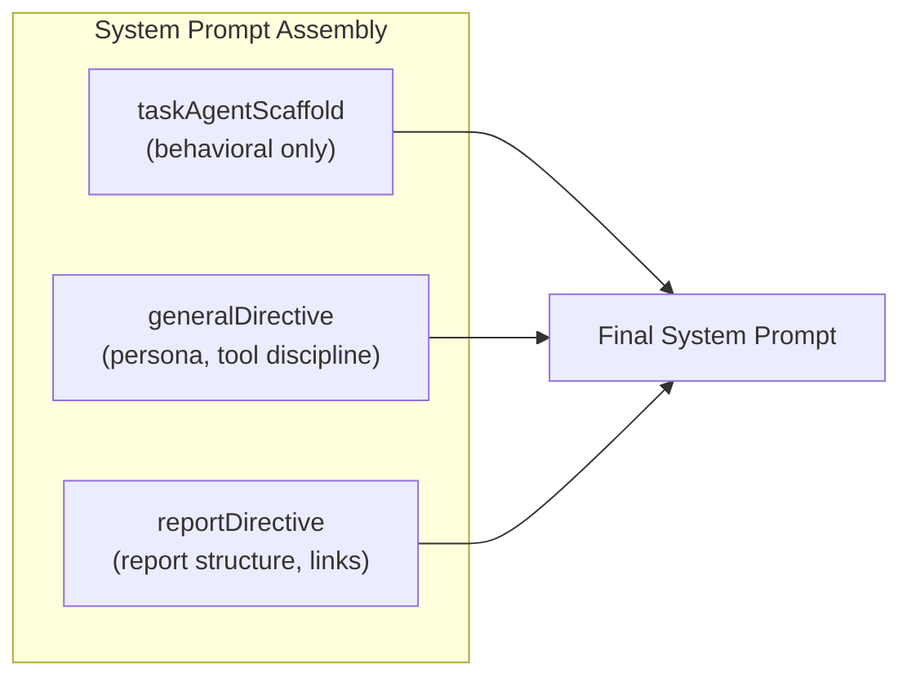

```dart
String _buildSystemPrompt(_TemplateContext ctx) {
  return '$taskAgentScaffold\n\n'
      '## Your Personality & Directives\n\n'
      '${ctx.version.generalDirective}\n\n'
      '## Report Format\n\n'
      '${ctx.version.reportDirective}';
}
```

### Reports migration

Old reports keep their `content` field as-is, with `tldr: null`. The UI extracts the first paragraph of `content` as a synthetic TLDR when `tldr` is null/empty. The next agent wake will populate the `tldr` field properly since `update_report` now accepts both `tldr` and `content`.

---

## 6. Implementation Phases

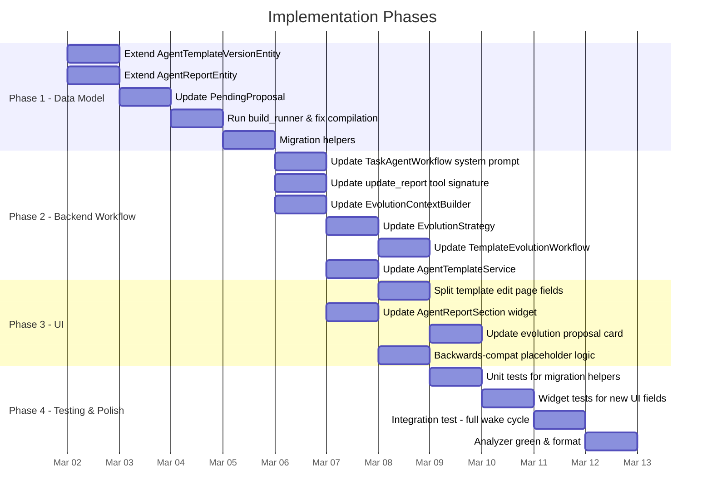

---

## 7. Files to Modify

### Data Model Layer
| File | Change |
|------|--------|
| `lib/features/agents/model/agent_domain_entity.dart` | Add `generalDirective` + `reportDirective` (keep `directives`); add nullable `tldr` to `AgentReportEntity` |
| `lib/features/agents/model/agent_domain_entity.freezed.dart` | Regenerated |
| `lib/features/agents/model/agent_domain_entity.g.dart` | Regenerated |

### Workflow Layer
| File | Change |
|------|--------|
| `lib/features/agents/workflow/task_agent_workflow.dart` | Extract report scaffold from `taskAgentScaffold`; use `generalDirective` + `reportDirective` |
| `lib/features/agents/workflow/task_agent_strategy.dart` | Update `update_report` handler to accept `tldr` + `content` |
| `lib/features/agents/workflow/evolution_strategy.dart` | Update `PendingProposal` and `propose_directives` handler |
| `lib/features/agents/workflow/evolution_context_builder.dart` | Present both directives separately in context |
| `lib/features/agents/workflow/template_evolution_workflow.dart` | Pass both directives to `createVersion` |
| `lib/features/agents/tools/agent_tool_registry.dart` | Update tool schemas for `propose_directives` and `update_report` |

### Service Layer
| File | Change |
|------|--------|
| `lib/features/agents/service/agent_template_service.dart` | Accept `generalDirective` + `reportDirective` in `createVersion` |

### UI Layer
| File | Change |
|------|--------|
| `lib/features/agents/ui/agent_template_detail_page.dart` | Two textarea fields instead of one |
| `lib/features/agents/ui/agent_report_section.dart` | Use `tldr`/`report` fields directly, fallback for old data |
| `lib/features/agents/ui/report_content_parser.dart` | Keep for backwards compat, but primary path uses structured fields |
| `lib/features/agents/ui/evolution/evolution_chat_page.dart` | Update proposal rendering for dual fields |

### Tests
| File | Change |
|------|--------|
| `test/features/agents/ui/report_content_parser_test.dart` | Verify backwards-compat parsing |
| `test/features/agents/workflow/evolution_context_builder_test.dart` | Update for split fields |
| `test/features/agents/workflow/evolution_strategy_test.dart` | Update proposal handling |
| New test files as needed for migration helpers | |

---

## 8. Risk Assessment

| Risk | Impact | Mitigation |
|------|--------|------------|
| Existing serialized entities missing new fields | Low | Both new fields `@Default('')`; old `directives` kept as-is |
| Sync: old devices don't send new fields | Low | `directives` still present; new fields default to `''` on older payloads |
| Evolution agent confused by new tool schema | Medium | Update system prompt clearly; test with sample sessions |
| Report parsing regression for old reports | Low | `content` field unchanged; `tldr: null` falls back to existing `parseReportContent()` |
| Large diff: many files touched simultaneously | Medium | Phase implementation; run analyzer after each phase |

---

## 9. Success Criteria

- [ ] `AgentTemplateVersionEntity` has `generalDirective` and `reportDirective` fields (alongside existing `directives`)
- [ ] `AgentReportEntity` has nullable `tldr` field alongside existing `content`
- [ ] Task agent wake constructs system prompt from both directive fields
- [ ] `update_report` tool accepts `tldr` and `report` separately
- [ ] Evolution agent proposes both directives independently
- [ ] Template edit page shows two distinct text areas
- [ ] Report UI shows TLDR always visible, full report expandable
- [ ] Old data deserializes correctly (backwards compatibility)
- [ ] Analyzer is green, all related tests pass
- [ ] CHANGELOG updated
