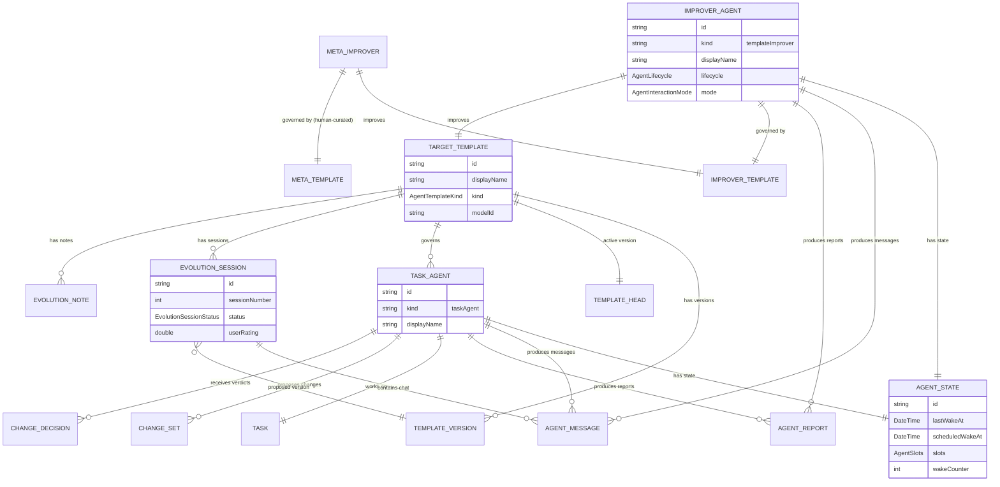

# Weekly One-on-One: Self-Learning Cycle for Improver Agents

**Date:** 2026-03-01
**Status:** Draft for review
**Priority:** P1
**Parent initiative:** Defining the Vision and Roadmap for Autonomous Agentic Workflows
**Depends on:**
- Foundation layer (merged)
- Template evolution lifecycle (`2026-02-26_template_evolution_agent_lifecycle.md`, implemented)
- Agentic product direction (`2026-02-19_agentic_product_direction.md`, §5.2 Long-Running Coach Agents)
- Agent prototypes & learning feedback (`2026-02-22_agent_prototypes_learning_feedback.md`)

---

## Table of Contents

1. [Executive Summary](#1-executive-summary)
2. [Current State vs. Target State](#2-current-state-vs-target-state)
3. [System Architecture](#3-system-architecture)
4. [Runtime State Model for Improver Agents](#4-runtime-state-model-for-improver-agents)
5. [Feedback Extraction Pipeline](#5-feedback-extraction-pipeline)
6. [Weekly One-on-One Ritual Workflow](#6-weekly-one-on-one-ritual-workflow)
7. [Recursive Self-Improvement Loop](#7-recursive-self-improvement-loop)
8. [Data Model Extensions](#8-data-model-extensions)
9. [Implementation Phases](#9-implementation-phases)
10. [ADR Candidates](#10-adr-candidates)
11. [Testing Strategy](#11-testing-strategy)
12. [Open Questions](#12-open-questions)

---

## 1. Executive Summary

This plan moves the "Weekly One-on-One" from concept to grounded technical implementation.
The core idea: an **improver agent** inspects the runtime state and observations of assistant
agents, extracts positive and negative feedback signals, and uses them in a weekly ritual to
evolve the underlying agent template. The system is recursive — the improver agent is itself
governed by a template that can be improved by a meta-improver.

### Key outcomes

1. Improver agents are **full-on members** with persistent runtime state, not ephemeral
   workflow steps.
2. Observations (venting, praise, corrections) are classified and **searchable** across
   the agent domain.
3. A **scheduled weekly wake** triggers the one-on-one ritual automatically.
4. The ritual produces a **versioned template evolution** with full provenance.
5. The system supports **recursive depth** — improver-of-improver — bounded by policy.

---

## 2. Current State vs. Target State

### 2.1 What exists today

| Component | Status | Location |
|-----------|--------|----------|
| `EvolutionSessionEntity` | Complete | `agent_domain_entity.dart` — lightweight 1-on-1 session metadata |
| `EvolutionNoteEntity` | Complete | Agent's private reasoning notes (reflection, hypothesis, decision, pattern) |
| `TemplateEvolutionWorkflow` | Complete | Multi-turn chat: startSession → sendMessage → approve/reject |
| `EvolutionContextBuilder` | Complete | Assembles ~7k-token prompt from metrics, reports, observations, notes |
| `EvolutionStrategy` | Complete | ConversationStrategy with `propose_directives` + `record_evolution_note` tools |
| `TemplatePerformanceMetrics` | Complete | Aggregated from `wake_run_log` (totalWakes, successRate, avgDuration). Note: "success" only means the LLM call completed — it is not a quality signal. |
| `WakeRunTimeSeries` | Complete | Daily + per-version performance buckets |
| `AgentMessageKind.observation` | Complete | Agent's private working notes stored as message log entries |
| `ChangeDecisionEntity` | Complete | User verdict history (confirmed/rejected/deferred) per proposal item |
| Wake orchestration | Complete | Subscription-based wakes with throttling, single-flight, token coalescing |
| GenUI evolution surfaces | Complete | Proposal cards, metrics summaries, version comparisons |

### 2.2 What's missing (gap analysis)

| Gap | Impact | Difficulty |
|-----|--------|------------|
| **No scheduled wakes** — only subscription-based + manual | Cannot trigger weekly ritual automatically | Medium |
| **No improver agent identity** — evolution is a workflow, not a persistent agent | No durable state, no agent-level reports, no sleep/wake cycle | Medium |
| **No feedback classification** — observations are untyped free text | Cannot distinguish praise from complaints from corrections | Medium |
| **No cross-agent observation aggregation** — evolution sees metrics + capped reports | Cannot systematically extract patterns across all instances | Low |
| **No ritual protocol** — evolution session is ad-hoc, not a structured ceremony | No pre-ritual data gathering, no post-ritual follow-up tracking | Medium |
| **No recursive depth control** — no meta-improver concept | Cannot improve the improver's own template | Low |
| **No notification/reminder** — user isn't prompted when ritual is due | Weekly cadence not enforced | Low |

### 2.3 Architecture gap visualization


---

## 3. System Architecture

### 3.1 Component relationship diagram


### 3.2 Interaction sequence — complete one-on-one cycle


---

## 4. Runtime State Model for Improver Agents

### 4.1 Design principle: improver as a first-class agent

The improver agent is not a special case — it is a standard `AgentIdentityEntity` with
`kind: 'templateImprover'` that follows the same wake/sleep lifecycle as task agents.
The key differences are:

1. **Wake trigger**: scheduled (cron-like) instead of subscription-based.
2. **Scope**: operates on a template and all its instances, not a single journal task.
3. **Tools**: evolution-focused (propose_directives, record_note, classify_feedback)
   instead of task-focused (set_title, set_status, etc.).

### 4.2 Improver state schema

The improver agent uses the existing `AgentStateEntity` with these semantic conventions
for its slots and counters:


**Slots breakdown** (stored as `AgentSlots` JSON):

| Slot key | Type | Purpose |
|----------|------|---------|
| `activeTemplateId` | `String` | The template this improver is responsible for |
| `lastOneOnOneAt` | `DateTime?` | When the last completed one-on-one occurred |
| `lastFeedbackScanAt` | `DateTime?` | Delta cutoff for incremental feedback extraction |
| `feedbackWindowDays` | `int` | How far back to look for feedback (default: 7) |
| `totalSessionsCompleted` | `int` | Lifetime counter for institutional memory continuity |

### 4.3 Persistence & searchability

All improver observations are stored as `AgentMessageEntity` with
`kind: AgentMessageKind.observation`, threaded by evolution session ID.
To make observations **searchable**:

1. **Observation payloads** (`AgentMessagePayloadEntity`) store structured JSON:
   ```json
   {
     "text": "Agents are over-estimating task complexity...",
     "feedbackClassification": "negative",
     "feedbackCategory": "accuracy",
     "sourceAgentIds": ["agent-1", "agent-2"],
     "sourceEntryIds": ["entry-uuid-1"],
     "confidence": 0.85
   }
   ```

2. **Querying** uses existing `getMessagesByKind(observation)` + JSON extraction on
   `feedbackClassification` in the payload content map.

3. **Evolution notes** provide long-term searchable memory via `EvolutionNoteEntity`
   with `kind` filtering (reflection, hypothesis, decision, pattern).

### 4.4 State lifecycle diagram


---

## 5. Feedback Extraction Pipeline

### 5.1 Feedback sources

The improver agent gathers feedback from three primary sources (plus wake run
metrics). All sources live in the **agent domain** (`agent.sqlite`) — the
improver never reads human journal data from `db.sqlite`. See Open Question #2
for the rationale and future discussion on journal-based feedback.


### 5.2 Feedback classification model

Feedback is classified along two axes:

**Sentiment axis** (positive / negative / neutral):
- **Positive**: user confirmed proposals, high ratings, praise in observations
- **Negative**: user rejected proposals, low ratings, complaints, corrections
- **Neutral**: deferred decisions, informational observations

**Category axis** (what aspect of behavior):
- **Accuracy**: estimation quality, label correctness, status predictions
- **Communication**: tone, verbosity, formatting of reports
- **Prioritization**: which tasks get attention, checklist ordering
- **Tooling**: appropriate tool selection, redundant proposal frequency
- **Timeliness**: wake timing, response latency perception


### 5.3 Extraction algorithm

```
function extractFeedback(templateId, sinceDate):
    agents = getAgentsByTemplate(templateId)
    feedback = []

    for each agent in agents:
        // Source 1: Observations with payload text
        observations = getMessagesByKind(agent.id, observation, since: sinceDate)
        for each obs in observations:
            payload = getPayload(obs.contentEntryId)
            feedback.add(classifyObservation(payload.text, agent.id))

        // Source 2: Decision history
        decisions = getRecentDecisions(agent.id, since: sinceDate)
        for each decision in decisions:
            if decision.verdict == rejected:
                feedback.add(Feedback(
                    sentiment: negative,
                    category: inferCategory(decision.toolName),
                    source: 'decision_history',
                    detail: decision.rejectionReason ?? 'Rejected ${decision.toolName}',
                    agentId: agent.id
                ))
            else if decision.verdict == confirmed:
                feedback.add(Feedback(
                    sentiment: positive,
                    category: inferCategory(decision.toolName),
                    source: 'decision_history',
                    detail: 'Confirmed ${decision.toolName}',
                    agentId: agent.id
                ))

        // Source 3: Report confidence trends
        reports = getRecentReports(agent.id, since: sinceDate)
        feedback.addAll(analyzeConfidenceTrend(reports))

    // Source 4: Wake run log (user_rating only — status merely reflects
    // whether the LLM call succeeded, not output quality).
    // Note: all sources above are agent-domain only (agent.sqlite).
    // Journal-domain data (db.sqlite) is not accessed — see Open Question #2.
    wakeRuns = getWakeRunsByTemplate(templateId, since: sinceDate)
    for each run in wakeRuns:
        if run.userRating != null:
            feedback.add(classifyUserRating(run.userRating, run.agentId))

    return ClassifiedFeedback.aggregate(feedback)
```

### 5.4 Two classification strategies

**Strategy A — LLM-based classification (recommended for Phase 1)**:
- Feed raw observation text + decision history to a fast model (e.g., Gemini Flash)
- Prompt: "Classify each item as positive/negative/neutral and assign a category"
- Advantage: handles nuance, sarcasm, implicit feedback
- Cost: one extra LLM call per ritual (no strict token budget — weekly frequency keeps cost negligible)

**Strategy B — Rule-based classification (future optimization)**:
- Rejection → negative, confirmation → positive
- Keyword matching on observation text
- Rating thresholds (< 0.3 = negative, > 0.7 = positive)
- Advantage: zero cost, deterministic
- Limitation: misses nuance

---

## 6. Weekly One-on-One Ritual Workflow

### 6.1 Scheduled wake mechanism

The current `WakeOrchestrator` only supports subscription-based wakes (entity change →
token match → agent wake). We need to add **scheduled wakes** — a cron-like mechanism
that fires at a configured interval.

**Design**:


**Key decisions**:
- Hourly check interval (not per-minute — agents aren't that time-sensitive)
- A new `scheduledWakeAt` field on `AgentStateEntity` stores the next scheduled wake
  time. This is **separate from** the existing `nextWakeAt` which is used by the
  subscription throttle system (see ADR 0010 for rationale).
- After each ritual, compute next: `lastOneOnOneAt + 7 days`
- `WakeReason` enum extended with `scheduled` value
- Platform-specific: on mobile, use WorkManager/BGTaskScheduler for background execution

### 6.2 Ritual protocol

The one-on-one ritual follows a structured 4-phase protocol:


### 6.3 Ritual context assembly

The ritual context extends `EvolutionContextBuilder` with classified feedback:

```
Ritual context window (~10k tokens):

Note: This budget governs the *ritual prompt* sent to the evolution model,
NOT the classification step. Classification (section 5.4) has no strict
token limit — it runs separately via a fast model and can consume full
observation text. The classified *output* is then summarized into the
~2000-token slot below for the ritual prompt.

├── System prompt scaffold:          ~600 tokens (fixed)
├── Current directives:              ~500 tokens
├── Classified feedback summary:     ~2000 tokens (NEW — condensed from
│   │                                 full classification output)
│   ├── Negative feedback (grouped): ~800
│   ├── Positive feedback (grouped): ~600
│   └── Pattern observations:        ~600
├── Performance metrics delta:       ~300 tokens (delta vs. last session)
├── Decision history analysis:       ~500 tokens
│   ├── Rejection rate by tool:      ~200
│   └── Most rejected patterns:      ~300
├── Instance reports (top 5):        ~1500 tokens
├── Evolution notes (last 20):       ~800 tokens
├── Version history (last 3):        ~200 tokens
└── Delta summary:                   ~100 tokens
```

### 6.4 Ritual system prompt

The improver agent receives a specialized system prompt during the ritual:

```
You are the Template Evolution Agent — a continuous improvement specialist
responsible for the "{templateName}" agent template.

## Your Role
You conduct weekly one-on-one reviews of this template's performance.
Your goal is to identify patterns in how the template's agents are performing
and propose incremental directive improvements that address observed issues.

## Ritual Structure
1. **Acknowledge feedback**: Start by summarizing what went well and what didn't.
   Be specific — reference actual feedback items, not generic observations.
2. **Identify patterns**: Look for recurring themes across agents and time.
   A single complaint is anecdotal; three similar complaints are a pattern.
3. **Record notes**: Use `record_evolution_note` to persist your key observations
   for next week's session.
4. **Propose changes**: Use `propose_directives` with surgical, targeted
   improvements. Avoid rewriting directives that are working well.

## Rules
- Be concise and actionable. No filler analysis.
- Preserve the agent's core identity and personality.
- Prioritize fixes for negative feedback over polishing what works.
- Record at least one `hypothesis` note for testing in the next cycle.
- When uncertain, propose a small conservative change over a large risky one.
- Never remove capabilities that are confirmed working.
```

---

## 7. Recursive Self-Improvement Loop

### 7.1 The recursion model

The system is inherently recursive: the improver agent is governed by a template, and that
template can itself be improved. This creates a chain:


### 7.2 Recursion depth policy

| Level | Agent | Template improved by | Frequency |
|-------|-------|---------------------|-----------|
| 0 | Task Agent instances | Level 1 Improver | Weekly |
| 1 | Template Improver | Level 2 Meta-Improver | Monthly |
| 2 | Meta-Improver | Human only (manual evolution) | Ad-hoc |

**Hard rule**: recursion depth is capped at 2. Level 2 templates are human-curated.
This prevents runaway self-modification and maintains human oversight.

### 7.3 Meta-improver feedback sources

The meta-improver's feedback comes from observing the improver:

- **Evolution session quality**: Did the user approve or reject proposals?
- **Directive churn**: Are directives changing too frequently (instability)?
- **Performance delta after evolution**: Did the template actually improve after changes?
- **User ratings on evolution sessions**: Explicit quality signal.
- **Evolution note patterns**: Is the improver identifying real issues or chasing noise?


---

## 8. Data Model Extensions

### 8.1 New enum values

```dart
// In agent_enums.dart:

/// Extended wake reason for scheduled triggers.
enum WakeReason {
  subscription,
  creation,
  reanalysis,
  scheduled,  // NEW
}

/// Extended template kind for improver agents.
enum AgentTemplateKind {
  taskAgent,
  templateImprover,  // NEW
}

/// Feedback sentiment classification.
enum FeedbackSentiment {  // NEW
  positive,
  negative,
  neutral,
}

/// Feedback category classification.
enum FeedbackCategory {  // NEW
  accuracy,
  communication,
  prioritization,
  tooling,
  timeliness,
  general,
}
```

### 8.2 New entity: `ClassifiedFeedbackItem`

Not a new `AgentDomainEntity` variant — instead, a lightweight value object used
during ritual context assembly:

```dart
@freezed
class ClassifiedFeedbackItem with _$ClassifiedFeedbackItem {
  const factory ClassifiedFeedbackItem({
    required FeedbackSentiment sentiment,
    required FeedbackCategory category,
    required String source,     // 'observation' | 'decision' | 'metric' | 'rating'
    required String detail,     // Human-readable description
    required String agentId,    // Source agent
    String? entryId,            // Source journal entry if applicable
    double? confidence,         // Classification confidence (0-1)
  }) = _ClassifiedFeedbackItem;
}

@freezed
class ClassifiedFeedback with _$ClassifiedFeedback {
  const factory ClassifiedFeedback({
    required List<ClassifiedFeedbackItem> items,
    required DateTime windowStart,
    required DateTime windowEnd,
    required int totalObservationsScanned,
    required int totalDecisionsScanned,
  }) = _ClassifiedFeedback;

  // Convenience getters
  List<ClassifiedFeedbackItem> get positive =>
      items.where((i) => i.sentiment == FeedbackSentiment.positive).toList();
  List<ClassifiedFeedbackItem> get negative =>
      items.where((i) => i.sentiment == FeedbackSentiment.negative).toList();
  Map<FeedbackCategory, List<ClassifiedFeedbackItem>> get byCategory =>
      groupBy(items, (i) => i.category);
}
```

### 8.3 `AgentSlots` extension

The existing `AgentSlots` uses a `Map<String, Object?>` for flexible slot storage.
The improver agent stores its state using these well-known keys:

```dart
/// Well-known slot keys for improver agents.
abstract class ImproverSlotKeys {
  static const activeTemplateId = 'activeTemplateId';
  static const lastOneOnOneAt = 'lastOneOnOneAt';
  static const lastFeedbackScanAt = 'lastFeedbackScanAt';
  static const feedbackWindowDays = 'feedbackWindowDays';
  static const totalSessionsCompleted = 'totalSessionsCompleted';
  static const recursionDepth = 'recursionDepth';
}
```

### 8.4 New service: `FeedbackExtractionService`

```dart
/// Extracts and classifies feedback from agent observations and
/// decision history for a given template over a time window.
class FeedbackExtractionService {
  FeedbackExtractionService({
    required this.agentRepository,
    required this.journalDb,
  });

  final AgentRepository agentRepository;
  final JournalDb journalDb;

  /// Extract classified feedback for all agents assigned to [templateId]
  /// within the time window [since] to [until].
  Future<ClassifiedFeedback> extract({
    required String templateId,
    required DateTime since,
    DateTime? until,
  }) async { ... }
}
```

### 8.5 New workflow: `ImproverAgentWorkflow`

```dart
/// Executes the weekly one-on-one ritual for an improver agent.
///
/// Follows the 4-phase protocol:
/// 1. Preparation — gather feedback and compute deltas
/// 2. Analysis — LLM-driven pattern recognition
/// 3. Proposal — generate improved directives
/// 4. Resolution — user review (deferred, async)
class ImproverAgentWorkflow {
  ImproverAgentWorkflow({
    required this.feedbackService,
    required this.evolutionWorkflow,
    required this.syncService,
    required this.agentRepository,
    required this.templateService,
  });

  /// Execute the one-on-one ritual for the given improver agent.
  Future<void> execute({
    required AgentIdentityEntity improverAgent,
    required AgentStateEntity currentState,
  }) async { ... }
}
```

### 8.6 New component: `ScheduledWakeManager`

```dart
/// Manages scheduled wakes for agents that have a `scheduledWakeAt` set.
///
/// Runs a periodic check (default: every hour) and enqueues wake jobs
/// for any agents whose scheduled wake time has passed.
class ScheduledWakeManager {
  ScheduledWakeManager({
    required this.agentRepository,
    required this.wakeOrchestrator,
    this.checkInterval = const Duration(hours: 1),
  });

  /// Start the periodic check loop.
  void start() { ... }

  /// Stop the periodic check loop.
  void stop() { ... }
}
```

---

## 9. Implementation Phases

### 9.1 Phase overview


### 9.2 Phase 1: Scheduled Wakes

**Scope**: Enable agents to wake on a time-based schedule, not just entity changes.

**Deliverables**:
1. Add `WakeReason.scheduled` to `agent_enums.dart`
2. Create `ScheduledWakeManager` — periodic timer that queries `AgentStateEntity.scheduledWakeAt`
3. Integrate into `WakeOrchestrator` — scheduled wakes bypass throttle gate
4. Add `scheduledWakeAt` computation after ritual completion
5. Unit tests for scheduled wake detection and enqueue

**Files touched**:
- `lib/features/agents/model/agent_enums.dart` (enum extension)
- `lib/features/agents/wake/scheduled_wake_manager.dart` (new)
- `lib/features/agents/wake/wake_orchestrator.dart` (integration)
- `lib/features/agents/state/agent_providers.dart` (provider wiring)
- `test/features/agents/wake/scheduled_wake_manager_test.dart` (new)

### 9.3 Phase 2: Feedback Extraction Pipeline

**Scope**: Extract, classify, and aggregate feedback from all agent data sources.

**Deliverables**:
1. `FeedbackSentiment` and `FeedbackCategory` enums
2. `ClassifiedFeedbackItem` and `ClassifiedFeedback` freezed models
3. `FeedbackExtractionService` — queries across agents, classifies observations
4. LLM-based classification prompt for nuanced observation text
5. Rule-based fast path for decision history (rejected = negative, confirmed = positive)
6. Unit tests with mock agent data

**Files touched**:
- `lib/features/agents/model/agent_enums.dart` (new enums)
- `lib/features/agents/model/classified_feedback.dart` (new)
- `lib/features/agents/service/feedback_extraction_service.dart` (new)
- `test/features/agents/service/feedback_extraction_service_test.dart` (new)

### 9.4 Phase 3: Improver Agent Identity

**Scope**: Create the improver agent as a first-class agent entity.

**Deliverables**:
1. `AgentTemplateKind.templateImprover` enum value
2. `ImproverSlotKeys` with well-known slot key constants
3. `ImproverAgentService` — create, configure, and manage improver agents
4. Seed default improver template with initial directives
5. Link improver agent to its target template via `AgentLink`
6. Unit tests for CRUD and slot management

**Files touched**:
- `lib/features/agents/model/agent_enums.dart` (enum extension)
- `lib/features/agents/model/improver_slot_keys.dart` (new)
- `lib/features/agents/service/improver_agent_service.dart` (new)
- `lib/features/agents/model/agent_constants.dart` (new link type if needed)
- `test/features/agents/service/improver_agent_service_test.dart` (new)

### 9.5 Phase 4: Ritual Workflow

**Scope**: Implement the 4-phase one-on-one ritual execution.

**Deliverables**:
1. `RitualContextBuilder` extending `EvolutionContextBuilder` with classified feedback
2. `ImproverAgentWorkflow` — orchestrates the full ritual protocol
3. Feedback threshold gate (skip ritual if insufficient new data)
4. Integration with existing `TemplateEvolutionWorkflow` for proposal creation
5. Post-ritual state update (scheduledWakeAt, lastOneOnOneAt, report)
6. Comprehensive tests for each ritual phase

**Files touched**:
- `lib/features/agents/workflow/ritual_context_builder.dart` (new)
- `lib/features/agents/workflow/improver_agent_workflow.dart` (new)
- `lib/features/agents/workflow/improver_agent_strategy.dart` (new)
- `test/features/agents/workflow/improver_agent_workflow_test.dart` (new)
- `test/features/agents/workflow/ritual_context_builder_test.dart` (new)

### 9.6 Phase 5: UI & Notifications

**Scope**: User-facing surfaces for the one-on-one ritual.

**Deliverables**:
1. Dedicated one-on-one review page showing classified feedback + proposal
2. Notification mechanism when a ritual is pending review
3. Dashboard widget showing evolution history and performance trends
4. GenUI surfaces for feedback classification visualization

### 9.7 Phase 6: Meta-Improver (Recursive)

**Scope**: Enable the improver's own template to be improved.

**Deliverables**:
1. Recursion depth policy enforcement (max depth = 2)
2. Seed meta-improver template with meta-level directives
3. Meta-feedback extraction from evolution session quality signals
4. Integration test for the full recursive cycle

---

## 10. ADR Candidates

Based on the architectural decisions required, the following ADRs should be drafted:

### ADR 0010: Scheduled Wake Infrastructure

**Decision needed**: How to implement time-based agent wakes.

**Options**:
- A) Platform timer (Timer.periodic) with hourly check — simple, works on desktop
- B) WorkManager / BGTaskScheduler — works in background on mobile
- C) Hybrid — Timer on desktop, WorkManager on mobile

**Recommendation**: Option C — hybrid approach. Desktop users have the app open;
mobile users need background execution. The `ScheduledWakeManager` abstracts the
platform difference.

**Key constraints**:
- Scheduled wakes bypass the 120-second throttle gate
- `scheduledWakeAt` is the source of truth (no separate cron table)
- Missed wakes (app was closed) execute on next app launch

### ADR 0011: Feedback Classification Strategy

**Decision needed**: How to classify agent observations into sentiment/category.

**Options**:
- A) LLM-based classification (accurate, costs tokens)
- B) Rule-based classification (free, less nuanced)
- C) Hybrid — rules for structured data (decisions), LLM for free text (observations)

**Recommendation**: Option C — hybrid. Decision history is inherently structured
(rejected = negative). Observation text requires LLM understanding. This minimizes
token cost while preserving classification quality.

### ADR 0012: Recursive Self-Improvement Depth Policy

**Decision needed**: How deep the improver-of-improver chain can go.

**Options**:
- A) Unlimited recursion with convergence detection
- B) Fixed depth cap (recommended: 2)
- C) User-configurable depth

**Recommendation**: Option B — fixed cap at depth 2. Level 0 = task agents,
Level 1 = template improver (weekly), Level 2 = meta-improver (monthly),
Level 3+ = human only. This prevents runaway self-modification while enabling
meaningful recursive improvement.

---

## 11. Testing Strategy

### 11.1 Unit tests

| Component | Key test scenarios |
|-----------|--------------------|
| `ScheduledWakeManager` | Timer fires, due agents detected, enqueue called, missed wakes handled |
| `FeedbackExtractionService` | Empty data, mixed sentiments, threshold filtering, date windowing |
| `ClassifiedFeedback` | Aggregation, grouping by category, sentiment filtering |
| `ImproverAgentService` | Create/destroy lifecycle, slot persistence, template linking |
| `ImproverAgentWorkflow` | Full ritual execution, skip on no feedback, proposal creation |
| `RitualContextBuilder` | Token budget, feedback inclusion, delta computation |

### 11.2 Integration tests

1. **End-to-end ritual**: Create task agents → generate observations → scheduled wake
   fires → ritual executes → proposal created → user approves → version promoted
2. **Skip scenario**: No new feedback → ritual skips → next wake scheduled
3. **Rejection loop**: Proposal rejected → refinement → re-proposal → approval
4. **Cross-device sync**: Ritual on device A, approval on device B

### 11.3 Test infrastructure

- Use `fakeAsync` for all timer-based tests
- Mock `AgentRepository` for data access
- Use existing `test/mocks/mocks.dart` for shared mocks
- Create `test/features/agents/test_utils/feedback_factory.dart` for test data

---

## 12. Open Questions

1. **Notification mechanism**: Should the "ritual ready for review" notification be
   an in-app badge, a system notification, or both? This depends on platform capabilities
   and user preferences.

2. **Feedback from journal entries**: The current design intentionally restricts all
   feedback sources to the **agent domain** (`agent.sqlite`). The improver never reads
   human journal data from `db.sqlite`. If journal-based feedback is desired in the
   future (e.g., user journal entries tagged with agent feedback), it would cross the
   journal/agent domain boundary and require an explicit opt-in gate per Core Principle 1
   ("Human data is sacred"). This is deferred, not forgotten — it should be revisited
   once the agent-domain-only pipeline proves its value.

3. **Multi-template improver**: Should one improver agent handle multiple templates,
   or is it strictly 1:1 (one improver per template)? 1:1 is simpler and avoids
   cross-template contamination, but 1:N enables cross-template pattern recognition.

4. **Ritual frequency**: Is weekly the right cadence for all templates? Low-activity
   templates might benefit from bi-weekly or monthly rituals. Consider making the
   `feedbackWindowDays` slot configurable per improver.

5. **Autonomous vs. interactive ritual**: Should the first ritual be fully autonomous
   (agent proposes, user reviews async) or should it require the user to initiate?
   The product direction doc (§3.8) favors "bounded autonomy" — autonomous with
   approval gates.

---

## Appendix A: Entity Relationship Diagram (Complete)



## Appendix B: Feedback Flow Data Pipeline


## Appendix C: Weekly Rhythm Visualization


