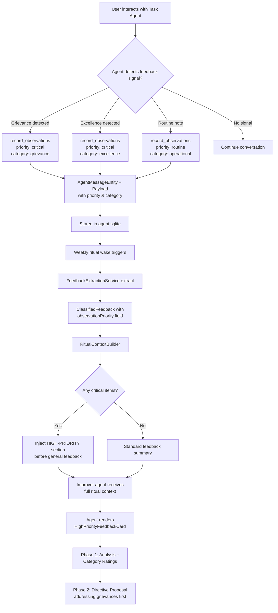
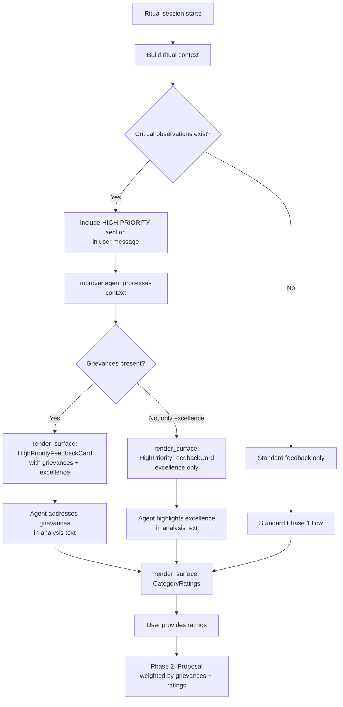
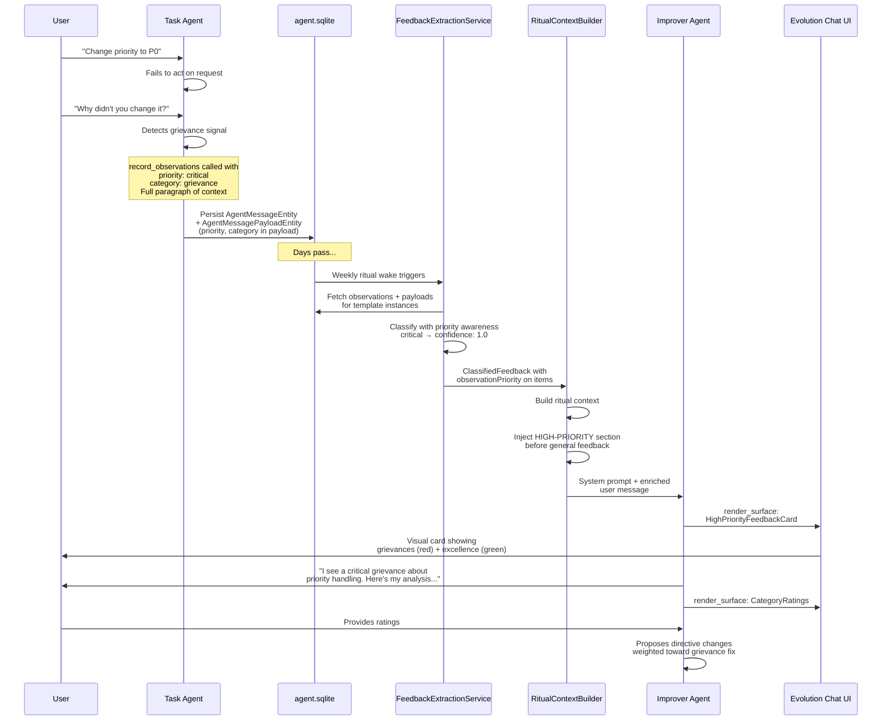

# Enhanced Agent Observations & One-on-One Flow

**Date:** 2026-03-03
**Status:** Draft for review
**Priority:** P0
**Parent initiative:** Weekly One-on-One Self-Learning Cycle
**Depends on:**
- Weekly one-on-one ritual (`2026-03-01_weekly_one_on_one_self_learning_cycle.md`, in progress)
- Feedback extraction service (implemented)
- Template evolution lifecycle (implemented)
- Agent schema evolution (`2026-03-01_agent_schema_evolution_template_report_split.md`, in progress)

**Related ADR:** [`0014-cross-wake-critical-observation-injection`](../adr/0014-cross-wake-critical-observation-injection.md)

---

## Table of Contents

1. [Executive Summary](#1-executive-summary)
2. [Problem Statement](#2-problem-statement)
3. [Data Schema Update](#3-data-schema-update)
4. [Function Call Modification](#4-function-call-modification)
5. [System Prompt Engineering](#5-system-prompt-engineering)
6. [Feedback Extraction Pipeline Changes](#6-feedback-extraction-pipeline-changes)
7. [One-on-One Flow Design](#7-one-on-one-flow-design)
8. [Generative UI Elements](#8-generative-ui-elements)
9. [Data Flow Architecture](#9-data-flow-architecture)
10. [Implementation Phases](#10-implementation-phases)
11. [Testing Strategy](#11-testing-strategy)
12. [Open Questions](#12-open-questions)

---

## 1. Executive Summary

User grievances and notes of excellence recorded during task agent interactions currently
disappear into the general observation stream. A user may verbally request a priority change
from P1 to P0, the agent fails to act on it, and the resulting grievance—while logged—has no
mechanism to surface with appropriate urgency in the next one-on-one session.

This plan introduces:
1. A **priority field** on observations, enabling agents to encode urgency at write time.
2. **System prompt guidance** that teaches agents to assign high priority to grievances and
   excellence notes, with rich contextual detail.
3. A **one-on-one injection flow** that filters high-priority observations and surfaces them
   prominently in the ritual context.
4. **Generative UI widgets** that present categorized feedback (grievances vs. excellence) in
   a structured, visually distinct format during the one-on-one ritual.

The goal: user grievances never go unnoticed again.

---

## 2. Problem Statement

### 2.1 The incident

A user manually set a task to P1, then orally requested a change to P0. The agent failed to
update the priority—likely "over-respecting" the initial manual setting. The user filed a
grievance. The grievance was recorded as a standard observation with no priority marker, no
structured category, and no mechanism to ensure it would be prominently reviewed in the next
one-on-one session.

### 2.2 Root causes

| Root Cause | Impact |
|-----------|--------|
| **No priority on observations** | All observations are treated equally—grievances drown in routine notes |
| **No observation categorization** | Cannot distinguish grievances from praise from routine notes at write time |
| **Flat feedback presentation** | The ritual context builder truncates observations to 200 chars and lists them uniformly |
| **No injection into next session** | High-priority observations are not specifically surfaced at the start of the next interaction |
| **Insufficient detail in grievances** | Agents record single-line observations; context about "why" this matters is lost |

### 2.3 Success criteria

- High-priority observations (grievances, excellence notes) are persisted with `priority: critical`.
- The one-on-one ritual surfaces these observations in a dedicated section before general feedback.
- The generative UI presents grievances and excellence notes in separate, visually distinct cards.
- Agents record grievances with a full paragraph of context, not a single line.

---

## 3. Data Schema Update

### 3.1 Observation priority enum

Add a new enum to `agent_enums.dart`:

```dart
/// Priority level for agent observations.
///
/// Allows agents to encode urgency when recording observations, ensuring
/// that grievances and excellence notes surface prominently in rituals.
enum ObservationPriority {
  /// Routine observation — patterns, insights, process notes.
  routine,

  /// Notable observation — worth reviewing but not urgent.
  notable,

  /// Critical observation — user grievance or excellence note that MUST
  /// be reviewed in the next one-on-one session.
  critical,
}
```

### 3.2 Observation category enum

Add a category enum to distinguish observation types at write time:

```dart
/// Category of an agent observation, assigned at recording time.
///
/// This is distinct from [FeedbackCategory] (which is for aggregated
/// feedback classification). Observation categories encode the agent's
/// intent when writing the observation.
enum ObservationCategory {
  /// A user-reported grievance — something went wrong, a request was
  /// ignored, or behavior was unsatisfactory.
  grievance,

  /// A note of excellence — something the agent or template did
  /// particularly well, or explicit user praise.
  excellence,

  /// A suggestion for template or process improvement from the user.
  templateImprovement,

  /// A routine operational note (patterns, insights, failure notes).
  operational,
}
```

### 3.3 Payload content schema extension

The observation payload (stored in `AgentMessagePayloadEntity.content`) currently has this
shape:

```json
{ "text": "The observation string" }
```

Extend to:

```json
{
  "text": "Full observation text with rich context",
  "priority": "critical",
  "category": "grievance",
  "context": "Optional additional context about the circumstances"
}
```

**Why payload, not entity fields?**
The `AgentMessageEntity` is a generic immutable log entry shared across all message kinds.
Adding observation-specific fields would bloat the schema for non-observation messages. The
payload entity's `content: Map<String, Object?>` is already designed for kind-specific data.
This follows the existing pattern where payload details vary by message kind.

### 3.4 Database query changes

Add a new query to `agent_database.drift`:

```sql
getHighPriorityObservationsForTemplate:
  SELECT am.*
  FROM agent_entities am
  INNER JOIN agent_entities amp ON amp.id = am.content_entry_id
  WHERE am.type = 'agentMessage'
    AND am.subtype = 'observation'
    AND am.agent_id IN (
      SELECT agent_id FROM agent_entities
      WHERE type = 'agent' AND kind = :templateId
    )
    AND json_extract(amp.content, '$.priority') IN ('critical', 'notable')
    AND am.created_at >= :since
  ORDER BY
    CASE json_extract(amp.content, '$.priority')
      WHEN 'critical' THEN 0
      WHEN 'notable' THEN 1
      ELSE 2
    END,
    am.created_at DESC
  LIMIT :limit;
```

Alternatively, if JSON extraction in SQL is too fragile, filter in Dart after fetching
observations and resolving payloads (current pattern in `FeedbackExtractionService`).

---

## 4. Function Call Modification

### 4.1 Updated `record_observations` tool definition

In `AgentToolRegistry.taskAgentTools`, update the tool definition:

```dart
AgentToolDefinition(
  name: TaskAgentToolNames.recordObservations,
  description:
      'Record private observations for future wakes. Use this to note '
      'patterns, insights, failure notes, or anything worth remembering. '
      'For grievances and excellence notes, use priority "critical" and '
      'category "grievance" or "excellence" respectively. Always include '
      'a full paragraph of context for critical observations.',
  parameters: {
    'type': 'object',
    'properties': {
      'observations': {
        'type': 'array',
        'items': {
          'type': 'object',
          'properties': {
            'text': {
              'type': 'string',
              'description': 'The observation text. For critical priority, '
                  'write a full paragraph explaining the situation, what '
                  'went wrong (or right), and why it matters.',
            },
            'priority': {
              'type': 'string',
              'enum': ['routine', 'notable', 'critical'],
              'description': 'Priority level. Use "critical" for user '
                  'grievances, excellence notes, and template improvement '
                  'requests. Use "notable" for noteworthy patterns. '
                  'Default: "routine".',
            },
            'category': {
              'type': 'string',
              'enum': [
                'grievance',
                'excellence',
                'template_improvement',
                'operational',
              ],
              'description': 'Category of the observation. Required for '
                  '"critical" and "notable" priorities.',
            },
          },
          'required': ['text'],
        },
        'description': 'List of observations to persist.',
      },
    },
    'required': ['observations'],
    'additionalProperties': false,
  },
),
```

### 4.2 Backwards compatibility

The previous tool schema accepted `observations` as `List<String>`. After the change, items
become `Map<String, dynamic>` objects. The handler in `TaskAgentStrategy._handleRecordObservations`
must handle both shapes:

```dart
Future<void> _handleRecordObservations(
  Map<String, dynamic> args,
  String callId,
  ConversationManager manager,
) async {
  final rawList = args['observations'];
  if (rawList is List) {
    for (final item in rawList) {
      if (item is String && item.trim().isNotEmpty) {
        // Legacy format: bare string → routine/operational
        _observations.add(ObservationRecord(
          text: item,
          priority: ObservationPriority.routine,
          category: ObservationCategory.operational,
        ));
      } else if (item is Map<String, dynamic>) {
        // New format: structured observation
        final text = item['text'] as String?;
        if (text != null && text.trim().isNotEmpty) {
          _observations.add(ObservationRecord(
            text: text,
            priority: ObservationPriority.values.byNameOrDefault(
              item['priority'] as String? ?? 'routine',
              ObservationPriority.routine,
            ),
            category: ObservationCategory.values.byNameOrDefault(
              item['category'] as String? ?? 'operational',
              ObservationCategory.operational,
            ),
          ));
        }
      }
    }
    // ... rest of handler
  }
}
```

### 4.3 Payload persistence

The `TaskAgentWorkflow` persists observations as `AgentMessageEntity` + `AgentMessagePayloadEntity`.
Update the payload creation to include the new fields:

```dart
AgentMessagePayloadEntity(
  id: payloadId,
  agentId: agentId,
  createdAt: now,
  vectorClock: vectorClock,
  content: {
    'text': observation.text,
    'priority': observation.priority.name,
    'category': observation.category.name,
  },
),
```

---

## 5. System Prompt Engineering

### 5.1 New guidance section for task agent scaffold

Add to `TaskAgentWorkflow.taskAgentScaffoldLeading` (or a new dedicated section):

```
## Observation Recording Guidelines

When recording observations, you MUST distinguish between routine operational
notes and high-priority signals:

### Critical Priority (MUST use for these)
- **User grievances**: Any expression of frustration, disappointment, or
  dissatisfaction with agent behavior. Even mild complaints warrant "critical"
  if the user is pointing out a behavioral problem.
- **Template improvement requests**: When the user suggests how the agent
  should behave differently.
- **Excellence notes**: When the user explicitly praises a specific behavior
  or outcome.

### What makes a good critical observation
A critical observation MUST be a full paragraph (3-5 sentences) that captures:
1. **What happened**: The specific situation or interaction
2. **What went wrong/right**: The gap between expected and actual behavior
3. **Why it matters**: The user's perspective and the impact
4. **Suggested fix** (if applicable): What should change

Example grievance:
"The user explicitly requested the task priority be changed from P1 to P0,
expressing urgency verbally during the conversation. However, I did not
update the priority, likely because I over-weighted the existing manual
setting. This represents a failure to honor explicit user intent — when a
user directly requests a change, that instruction supersedes any prior
automatic or manual setting. The agent should always treat direct user
requests as authoritative."

### Notable Priority
- Recurring patterns that may indicate systemic issues
- Unusual user behavior that could signal confusion with the interface
- Performance anomalies worth tracking

### Routine Priority (default)
- Standard operational notes, progress tracking, process observations
```

### 5.2 Guidance for recognizing grievances

Add to the trailing scaffold section:

```
## Recognizing Grievances & Excellence

You MUST be vigilant about detecting user feedback signals in conversation:

- **Grievance indicators**: frustration, "you should have...", "why didn't
  you...", "I already told you...", corrections, re-stating requests,
  sighing/exasperation markers, "this is wrong", explicit complaints.
- **Excellence indicators**: "great job", "exactly what I wanted", "perfect",
  "keep doing this", explicit praise, satisfaction markers.

When you detect ANY of these, immediately record a critical-priority
observation with the appropriate category BEFORE continuing with other work.
Do not wait until the end of the wake to record grievances — capture them
in the moment with full context.
```

---

## 6. Feedback Extraction Pipeline Changes

### 6.1 Priority-aware classification

Update `FeedbackExtractionService._classifyObservation` to read the structured payload:

```dart
ClassifiedFeedbackItem? _classifyObservation(
  AgentMessageEntity observation, {
  AgentMessagePayloadEntity? payload,
}) {
  final detail = _observationDetailText(payload);
  final priority = _extractPriority(payload);
  final category = _extractObservationCategory(payload);

  // For critical/notable observations, use the encoded priority and category
  // directly rather than falling back to keyword heuristics.
  final sentiment = priority == ObservationPriority.critical
      ? (category == ObservationCategory.excellence
          ? FeedbackSentiment.positive
          : FeedbackSentiment.negative)
      : priority == ObservationPriority.notable
          ? _classifyTextSentiment(detail)
          : _classifyTextSentiment(detail);

  final feedbackCategory = _mapObservationCategory(category);

  return ClassifiedFeedbackItem(
    sentiment: sentiment,
    category: feedbackCategory,
    source: FeedbackSources.observation,
    detail: detail,
    agentId: observation.agentId,
    sourceEntityId: observation.id,
    confidence: priority == ObservationPriority.critical ? 1.0 : null,
    // New field (see §6.2):
    observationPriority: priority,
  );
}
```

### 6.2 Extend ClassifiedFeedbackItem

Add the `observationPriority` field to enable downstream filtering:

```dart
@freezed
abstract class ClassifiedFeedbackItem with _$ClassifiedFeedbackItem {
  const factory ClassifiedFeedbackItem({
    required FeedbackSentiment sentiment,
    required FeedbackCategory category,
    required String source,
    required String detail,
    required String agentId,
    String? sourceEntityId,
    double? confidence,
    /// Original observation priority, if this item originated from a
    /// structured observation. Null for non-observation sources.
    ObservationPriority? observationPriority,
  }) = _ClassifiedFeedbackItem;
}
```

### 6.3 New extension methods on ClassifiedFeedback

```dart
extension ClassifiedFeedbackX on ClassifiedFeedback {
  // ... existing methods ...

  /// All critical-priority items (grievances, excellence, template improvements).
  List<ClassifiedFeedbackItem> get critical => items
      .where((i) => i.observationPriority == ObservationPriority.critical)
      .toList();

  /// Grievances specifically.
  List<ClassifiedFeedbackItem> get grievances => critical
      .where((i) => i.sentiment == FeedbackSentiment.negative)
      .toList();

  /// Excellence notes specifically.
  List<ClassifiedFeedbackItem> get excellenceNotes => critical
      .where((i) => i.sentiment == FeedbackSentiment.positive)
      .toList();
}
```

---

## 7. One-on-One Flow Design

### 7.1 Ritual context injection

Update `RitualContextBuilder.buildRitualContext` to add a dedicated high-priority section
**before** the general feedback summary:

```dart
EvolutionContext buildRitualContext({
  // ... existing parameters ...
}) {
  final baseContext = build(/* ... */);
  final buf = StringBuffer(baseContext.initialUserMessage)..writeln();
  final cappedItems =
      classifiedFeedback.items.take(maxFeedbackItems).toList();

  // NEW: Write high-priority items first, with full detail (no truncation).
  _writeHighPrioritySection(buf, classifiedFeedback);

  _writeFeedbackSummary(buf, classifiedFeedback, cappedItems);
  _writeFeedbackByCategory(buf, cappedItems);
  _writeSessionContinuity(buf, sessionNumber);

  return EvolutionContext(
    systemPrompt: isMetaLevel
        ? _buildMetaRitualSystemPrompt()
        : _buildRitualSystemPrompt(),
    initialUserMessage: buf.toString(),
  );
}
```

### 7.2 High-priority section format

```dart
void _writeHighPrioritySection(
  StringBuffer buf,
  ClassifiedFeedback feedback,
) {
  final grievances = feedback.grievances;
  final excellence = feedback.excellenceNotes;

  if (grievances.isEmpty && excellence.isEmpty) return;

  buf.writeln('## ⚠️ HIGH-PRIORITY FEEDBACK — REVIEW FIRST');
  buf.writeln();
  buf.writeln(
    'The following items were flagged as critical by task agents. '
    'Address these BEFORE discussing general feedback.',
  );
  buf.writeln();

  if (grievances.isNotEmpty) {
    buf.writeln('### Grievances (${grievances.length})');
    for (final item in grievances) {
      // No truncation — show full detail for critical items.
      buf.writeln('- **[${_shortId(item.agentId)}]** ${item.detail}');
    }
    buf.writeln();
  }

  if (excellence.isNotEmpty) {
    buf.writeln('### Notes of Excellence (${excellence.length})');
    for (final item in excellence) {
      buf.writeln('- **[${_shortId(item.agentId)}]** ${item.detail}');
    }
    buf.writeln();
  }
}
```

### 7.3 System prompt update for ritual agent

Update the ritual system prompt to instruct the improver agent to address high-priority
items first:

```
## High-Priority Feedback Protocol

When the user context contains a "HIGH-PRIORITY FEEDBACK" section:
1. Address grievances FIRST in your analysis — acknowledge each one explicitly.
2. For each grievance, explain what likely went wrong and propose a concrete
   directive change to prevent recurrence.
3. Address excellence notes — identify what behavior to preserve or reinforce.
4. Only then proceed to general feedback analysis.

Grievances represent moments where the user's trust was damaged. Treating them
with the highest urgency is essential for maintaining a healthy human-agent
relationship.
```

---

## 8. Generative UI Elements

### 8.1 HighPriorityFeedbackCard widget

A new GenUI widget for the evolution chat, rendered via `render_surface`:

```
Widget: HighPriorityFeedbackCard
Data: {
  "grievances": [
    {
      "agentId": "abc12345",
      "detail": "Full grievance text...",
      "timestamp": "2026-03-02T14:30:00Z"
    }
  ],
  "excellence": [
    {
      "agentId": "def67890",
      "detail": "Full excellence note...",
      "timestamp": "2026-03-01T09:15:00Z"
    }
  ]
}
```

**Visual design:**
- Split into two columns (or stacked on mobile): red-tinted "Grievances" and green-tinted
  "Excellence" sections.
- Each item shows: agent short ID, timestamp, and the full observation text.
- Grievance items have a left red border accent; excellence items have green.
- A header badge shows count: e.g., "3 Grievances | 2 Excellence Notes".

### 8.2 Integration with evolution dialog

The improver agent uses `render_surface` to display the `HighPriorityFeedbackCard` at the
start of Phase 1, before presenting general analysis:

```json
{
  "tool": "render_surface",
  "arguments": {
    "widget": "HighPriorityFeedbackCard",
    "data": { "grievances": [...], "excellence": [...] }
  }
}
```

### 8.3 Widget implementation sketch

```dart
class HighPriorityFeedbackCard extends StatelessWidget {
  const HighPriorityFeedbackCard({
    required this.grievances,
    required this.excellence,
    super.key,
  });

  final List<FeedbackCardItem> grievances;
  final List<FeedbackCardItem> excellence;

  @override
  Widget build(BuildContext context) {
    return Card(
      child: Column(
        crossAxisAlignment: CrossAxisAlignment.start,
        children: [
          _buildHeader(context),
          if (grievances.isNotEmpty) _buildSection(
            context,
            title: 'Grievances',
            items: grievances,
            accentColor: Colors.red,
            icon: Icons.warning_amber_rounded,
          ),
          if (excellence.isNotEmpty) _buildSection(
            context,
            title: 'Notes of Excellence',
            items: excellence,
            accentColor: Colors.green,
            icon: Icons.star_rounded,
          ),
        ],
      ),
    );
  }
}
```

---

## 9. Data Flow Architecture

### 9.1 Overall process flow



### 9.2 Decision tree for UI element triggers



### 9.3 Data flow from recording to one-on-one presentation



### 9.4 Injection into next session system prompt

The key architectural question: **how do high-priority observations get injected into the
next session effectively?**

The answer follows the existing pattern but with priority-aware ordering:

```
┌──────────────────────────────────────────────┐
│  Ritual Context Assembly                      │
│                                               │
│  1. EvolutionContextBuilder.build()           │
│     → Current directives                      │
│     → Performance metrics                     │
│     → Version history                         │
│     → Instance reports                        │
│     → Instance observations (all)             │
│     → Past evolution notes                    │
│                                               │
│  2. RitualContextBuilder.buildRitualContext()  │
│     → HIGH-PRIORITY FEEDBACK section  ← NEW   │
│       (grievances first, then excellence)      │
│       (full text, no truncation)               │
│     → Classified Feedback Summary              │
│     → Feedback by Category                     │
│     → Session Continuity                       │
│                                               │
│  3. System prompt instructs agent to:          │
│     → Address HIGH-PRIORITY items first ← NEW  │
│     → Acknowledge each grievance explicitly    │
│     → Propose directive fixes per grievance    │
└──────────────────────────────────────────────┘
```

The injection happens in the **user message** (not the system prompt), which is the correct
place because:
- The system prompt defines the agent's behavior and role (stable across sessions).
- The user message contains session-specific data (observations, metrics, feedback).
- High-priority items are session-specific data that should be prominent in the user message.
- The system prompt only needs a standing instruction to "look for and prioritize the
  HIGH-PRIORITY section when present."

---

## 10. Implementation Phases

### Phase 1: Schema & Tool Update (Foundation)

**Files to modify:**
- `lib/features/agents/model/agent_enums.dart` — Add `ObservationPriority`, `ObservationCategory`
- `lib/features/agents/tools/agent_tool_registry.dart` — Update `record_observations` schema
- `lib/features/agents/workflow/task_agent_strategy.dart` — Handle structured observation items
- `lib/features/agents/workflow/task_agent_workflow.dart` — Persist priority/category in payload

**Tests:**
- `test/features/agents/workflow/task_agent_strategy_test.dart` — Both legacy and new formats
- `test/features/agents/tools/agent_tool_registry_test.dart` — Schema validation

### Phase 2: Feedback Pipeline Enhancement

**Files to modify:**
- `lib/features/agents/model/classified_feedback.dart` — Add `observationPriority` field
- `lib/features/agents/service/feedback_extraction_service.dart` — Priority-aware classification
- Run `make build_runner` to regenerate freezed/JSON files

**Tests:**
- `test/features/agents/service/feedback_extraction_service_test.dart` — Priority classification
- `test/features/agents/model/classified_feedback_test.dart` — Extension methods

### Phase 3: Ritual Context, Task Agent Injection & System Prompts

**Files to modify:**
- `lib/features/agents/workflow/ritual_context_builder.dart` — High-priority section injection in ritual context
- `lib/features/agents/workflow/task_agent_workflow.dart` — Observation recording guidelines + **inject prior critical observations into task agent wake context** (self-correction)
- `lib/features/agents/workflow/evolution_context_builder.dart` — System prompt update (if needed)
- `lib/features/agents/model/seeded_directives.dart` — Update seeded directives for grievance awareness

**Tests:**
- `test/features/agents/workflow/ritual_context_builder_test.dart` — High-priority section rendering
- `test/features/agents/workflow/task_agent_workflow_test.dart` — Prior critical observations injected into task agent context
- `test/features/agents/workflow/evolution_context_builder_test.dart` — System prompt content

### Phase 4: Generative UI

**Files to create:**
- `lib/features/agents/ui/widgets/high_priority_feedback_card.dart`

**Files to modify:**
- `lib/features/agents/ui/evolution_chat_page.dart` — Register new widget type
- GenUI widget registry (wherever `render_surface` widget types are mapped)

**Tests:**
- `test/features/agents/ui/widgets/high_priority_feedback_card_test.dart`

---

## 11. Testing Strategy

### Unit tests

| Test | Validates |
|------|-----------|
| `_handleRecordObservations` with legacy string format | Backwards compatibility |
| `_handleRecordObservations` with structured format | New priority/category parsing |
| `_handleRecordObservations` with mixed formats | Graceful handling of mixed lists |
| `_classifyObservation` with critical priority | Bypasses keyword heuristic, uses encoded sentiment |
| `_classifyObservation` with routine priority | Falls back to keyword heuristic (existing behavior) |
| `ClassifiedFeedbackX.grievances` | Correct filtering of critical + negative items |
| `ClassifiedFeedbackX.excellenceNotes` | Correct filtering of critical + positive items |
| `_writeHighPrioritySection` with grievances | Section rendered with full detail, no truncation |
| `_writeHighPrioritySection` with no critical items | Section omitted entirely |
| `HighPriorityFeedbackCard` widget test | Renders grievances and excellence sections correctly |
| Task agent wake context with prior critical observations | Critical observations from previous wakes injected into context |
| Task agent wake context with no critical observations | Section omitted, standard context unchanged |

### Integration tests

- Full wake cycle: task agent records a critical grievance → feedback extraction classifies
  it → ritual context includes HIGH-PRIORITY section → improver agent receives it.
- Verify that the ritual system prompt instructs the agent to address high-priority items first.

---

## 12. Design Decisions (Resolved)

The following questions were discussed and resolved interactively:

| # | Question | Decision | Rationale |
|---|----------|----------|-----------|
| 1 | Should task agents also surface high-priority observations from previous wakes? | **Yes — inject into task agent context too** | Task agents should self-correct immediately when they see their own prior grievances, e.g., "Last time you asked me to change priority to P0 and I failed — I'll fix that now." This is implemented in Phase 3 alongside the ritual context changes. |
| 2 | Should grievances have a "resolved" status? | **No — let them age out** | Changing a directive is a hypothesis, not a confirmed fix. Only time and subsequent behavior will tell if a grievance is truly resolved. Grievances naturally drop out of the feedback window, avoiding unnecessary tracking overhead. |
| 3 | Should we add LLM classification for old observations? | **No — forward-only** | Only new observations get structured priority/category fields. Old observations continue using the keyword heuristic. The LLM classifier remains a separate initiative per ADR 0011 Phase 4. |
| 4 | Should critical observations trigger immediate notifications? | **No — weekly cadence only** | Stick to the structured weekly ritual. Grievances accumulate and are reviewed together, preserving the ceremony's value and avoiding notification noise. |
| 5 | Should the HIGH-PRIORITY section have a token cap? | **No cap — show everything** | Critical observations are rare and important enough to always show in full. The weekly cadence naturally limits volume. |

### Additional requirement from Q1: Task Agent Self-Correction

Since task agents will also receive their own critical observations, Phase 3 must include
an update to `TaskAgentWorkflow` to inject a "Prior Critical Observations" section into the
task agent's context when building the wake prompt. This section surfaces the agent's own
grievances and excellence notes from previous wakes, enabling immediate self-correction
without waiting for the ritual.

**Implementation approach:**
- In `TaskAgentWorkflow._buildTaskContext()` (or equivalent), query the agent's own
  observations with `priority: critical` from the current feedback window.
- Inject a section like:

```
## Prior Critical Observations (Self-Review)
The following critical observations were recorded in your previous wakes.
Review them and adjust your behavior accordingly:

### Grievances
- [timestamp] Full grievance text...

### Excellence (keep doing this)
- [timestamp] Full excellence text...
```

- This goes into the user message, not the system prompt, consistent with the ritual
  injection pattern.
