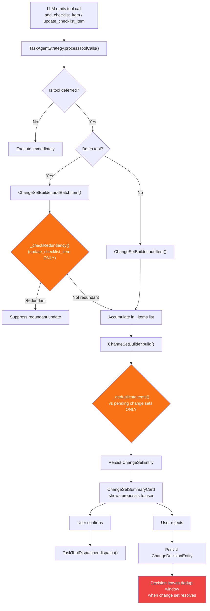
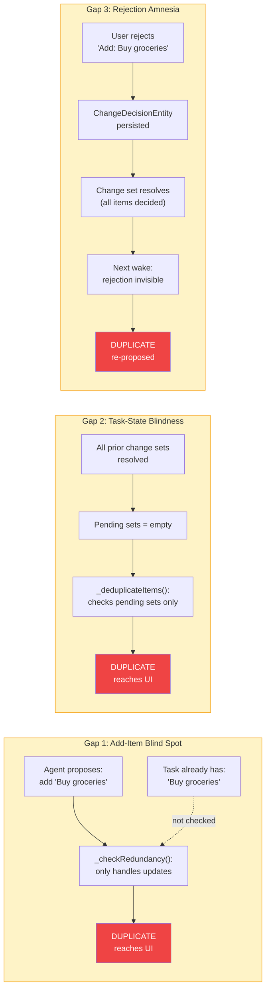
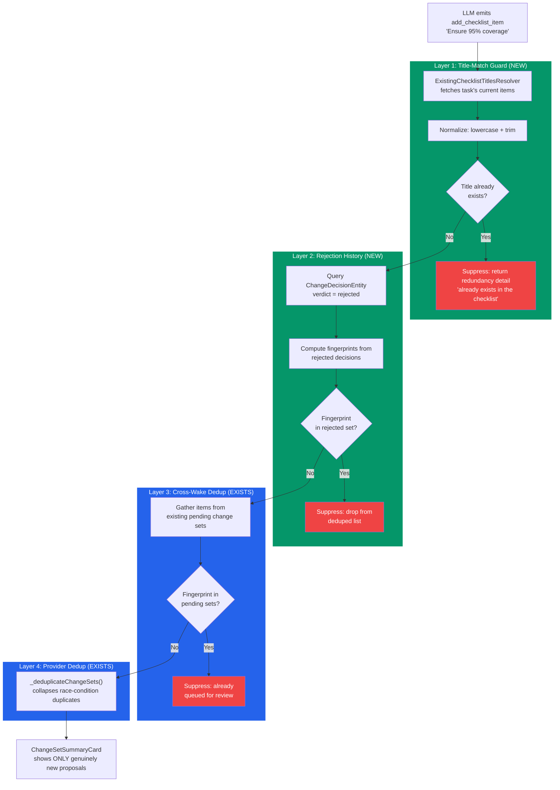
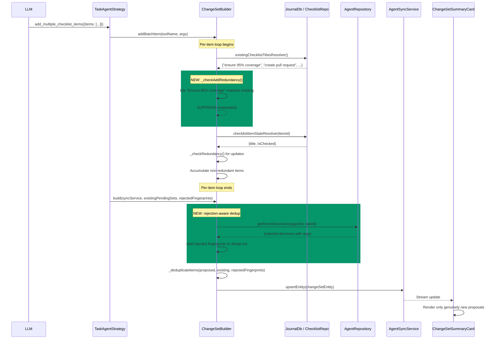
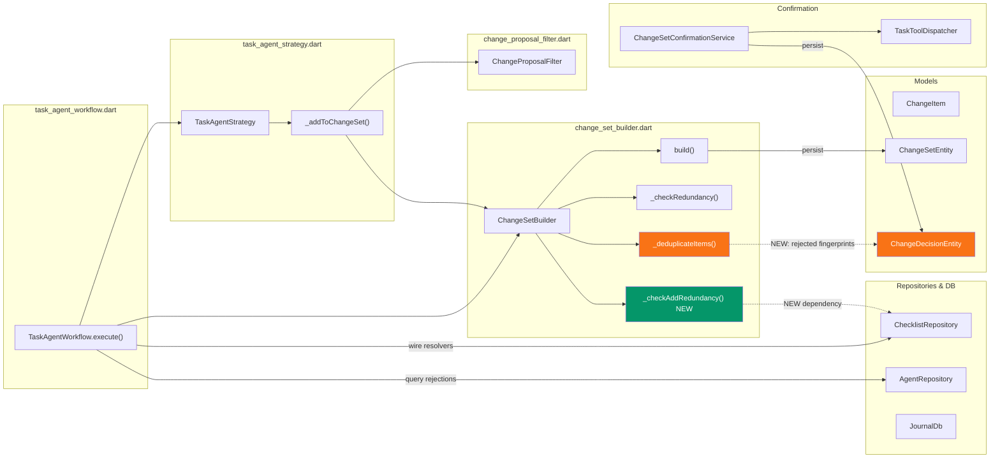

# Fix Duplicate Checklist Item Suggestions

**Date:** 2026-03-06
**Priority:** P0
**Status:** Plan

## Problem Statement

The AI task agent repeatedly proposes `add_checklist_item` changes for items that
already exist in the task's checklist, have been previously confirmed, or were
explicitly rejected. This creates a "nagging" experience that breaks user trust.

**Example from screenshots:** The task "Fix Agent Entity Sync Regression" already
has 12 checklist items (e.g., "Ensure 95% or higher patch coverage", "Create pull
request"). Despite this, the agent proposes adding all 8 of those same items again
as "Proposed changes."

## Current Pipeline (Before Fix)



**Orange = incomplete guards. Red = data loss.** The three gaps are:
- `_checkRedundancy` ignores `add_checklist_item` entirely
- `_deduplicateItems` never checks the task's actual checklist
- Rejected decisions vanish from the dedup window after resolution

## Root Cause Analysis

The deduplication pipeline has **three structural gaps**:

### Gap 1: No title-based dedup for `add_checklist_item` against existing items

`ChangeSetBuilder._checkRedundancy()` (line 394 of `change_set_builder.dart`) only
handles `update_checklist_item`. When the agent calls `add_checklist_item` with a
title that already exists on the task, **nothing catches it**. The method explicitly
returns `null` for non-update tools.

### Gap 2: `_deduplicateItems()` only checks against other pending change sets

`ChangeSetBuilder._deduplicateItems()` (line 288) compares proposed items against
items in existing *pending change sets* — not against the actual checklist items on
the task. So if all previous change sets are resolved, a new wake can re-propose the
exact same additions.

### Gap 3: Rejected decisions evaporate after change set resolution

`ChangeDecisionEntity` records ARE persisted when items are rejected (in
`ChangeSetConfirmationService.rejectItem()`), and `AgentRepository.getRecentDecisions()`
CAN query them. However, the `ChangeSetBuilder.build()` method only receives
`existingPendingSets` — once a change set is fully resolved, its rejected items are
no longer visible to the dedup pipeline. A subsequent agent wake can immediately
re-propose a rejected item.

### Visualizing the Three Gaps



### Why prompt engineering alone cannot fix this

The agent's "One-Strike Rule" observation shows awareness but no enforcement.
The LLM receives the full checklist in its context, yet still proposes duplicates
because:
- It generates tool calls based on patterns, not exact string matching
- The deferred-tool architecture intercepts calls *after* the LLM emits them
- There is no code-level guard between the LLM's output and the UI

## Solution Architecture

Add three layers of defense that make duplicate proposals structurally impossible:



**Green = new guards. Blue = existing guards. Red = suppression points.**

## Data Flow: Fixed Pipeline



## Component Dependency Map



**Green = new component. Orange = modified component.**

## Implementation Plan

### Step 1: Add existing-checklist-items resolver to `ChangeSetBuilder`

**Files:** `change_set_builder.dart`, `task_agent_workflow.dart`

Add a new callback type and field to `ChangeSetBuilder`:

```dart
/// Resolves all existing checklist item titles for the target task.
/// Returns a set of normalized (lowercased, trimmed) titles.
typedef ExistingChecklistTitlesResolver = Future<Set<String>> Function();
```

In `task_agent_workflow.dart`, wire it up using `ChecklistRepository.getChecklistItemsForTask()`:

```dart
final changeSetBuilder = ChangeSetBuilder(
  // ... existing params ...
  existingChecklistTitlesResolver: () async {
    final task = await journalDb.journalEntityById(taskId);
    if (task is! Task) return {};
    final items = await checklistRepository.getChecklistItemsForTask(task);
    return items
        .map((item) => item.data.title.toLowerCase().trim())
        .toSet();
  },
);
```

**Caching note:** The resolver result should be cached for the duration of a single
`addBatchItem()` call to avoid repeated DB queries for each item in a batch.

### Step 2: Implement `_checkAddRedundancy()` in `ChangeSetBuilder`

**File:** `change_set_builder.dart`

Add a new static method alongside `_checkRedundancy()`:

```dart
/// Check whether an `add_checklist_item` proposal is redundant because
/// an item with the same title already exists on the task.
///
/// Returns a human-readable detail string if redundant, or `null` if
/// the item should be kept.
static String? _checkAddRedundancy(
  String singularToolName,
  Map<String, dynamic> args,
  Set<String> existingTitles,
) {
  if (singularToolName != TaskAgentToolNames.addChecklistItem) {
    return null;
  }
  final title = args['title'];
  if (title is! String || title.isEmpty) return null;
  if (existingTitles.contains(title.toLowerCase().trim())) {
    return '"$title" already exists in the checklist';
  }
  return null;
}
```

Call this from `addBatchItem()` right before the existing `_checkRedundancy()` call,
and from `addItem()` when the tool name is `add_checklist_item`.

### Step 3: Add rejection-history dedup to `build()`

**Files:** `change_set_builder.dart`, `task_agent_workflow.dart`

Extend `build()` to accept recent rejected decisions:

```dart
Future<ChangeSetEntity?> build(
  AgentSyncService syncService, {
  List<ChangeSetEntity> existingPendingSets = const [],
  Set<String> rejectedFingerprints = const {},  // NEW
}) async {
```

In `_deduplicateItems()`, merge rejection fingerprints into the existing-hashes set:

```dart
static List<ChangeItem> _deduplicateItems(
  List<ChangeItem> proposed,
  List<ChangeItem> existing, {
  Set<String> rejectedFingerprints = const {},  // NEW
}) {
  if (existing.isEmpty && rejectedFingerprints.isEmpty) return proposed;
  final existingHashes = {
    ...existing.map(ChangeItem.fingerprint),
    ...rejectedFingerprints,
  };
  return proposed
      .where((item) => !existingHashes.contains(ChangeItem.fingerprint(item)))
      .toList();
}
```

In `task_agent_workflow.dart`, query recent rejections before building:

```dart
final recentRejections = await agentRepository.getRecentDecisions(
  agentId,
  taskId: taskId,
);
final rejectedOnly = recentRejections
    .where((d) => d.verdict == ChangeDecisionVerdict.rejected)
    .toList();

// Reconstruct fingerprints from rejected decisions
final rejectedFingerprints = rejectedOnly
    .where((d) => d.args != null)
    .map((d) => ChangeItem.fingerprintFromParts(d.toolName, d.args!))
    .toSet();

await changeSetBuilder.build(
  syncService,
  existingPendingSets: pendingSets,
  rejectedFingerprints: rejectedFingerprints,  // NEW
);
```

**Note:** `ChangeDecisionEntity` currently stores `toolName` and `humanSummary` but
may not store `args`. If `args` are not persisted on the decision entity, we need to
either:
- (a) Add `args` to `ChangeDecisionEntity` (preferred — enables fingerprint matching), or
- (b) Use title-based fuzzy matching on the `humanSummary` field (fragile fallback)

**Check needed:** Read `ChangeDecisionEntity` fields to confirm whether `args` is stored.
If not, Step 3a below covers adding it.

### Step 3a (if needed): Persist tool args on `ChangeDecisionEntity`

**Files:** `agent_domain_entity.dart`, `change_set_confirmation_service.dart`

Add an `args` field to `ChangeDecisionEntity`:

```dart
/// The tool arguments, preserved for fingerprint-based dedup of future
/// proposals.
Map<String, dynamic>? args,
```

In `ChangeSetConfirmationService.rejectItem()` and `confirmItem()`, populate:

```dart
AgentDomainEntity.changeDecision(
  // ... existing fields ...
  args: item.args,  // NEW
)
```

Run `make build_runner` to regenerate freezed/json files.

### Step 4: Add title tracking to prevent re-proposal within the same wake

**File:** `change_set_builder.dart`

The `existingChecklistTitlesResolver` cache should also include titles from items
already added during the current wake (in `_items`). This prevents the LLM from
proposing the same item twice in one batch:

```dart
// In addBatchItem(), after resolving existing titles:
final addedTitles = _items
    .where((i) => i.toolName == TaskAgentToolNames.addChecklistItem)
    .map((i) => (i.args['title'] as String?)?.toLowerCase().trim())
    .whereType<String>()
    .toSet();
final allExistingTitles = {...existingTitles, ...addedTitles};
```

### Step 5: Write tests

**Files:** New test file `test/features/agents/workflow/change_set_builder_test.dart`
(or extend existing tests)

Test cases:

1. **`add_checklist_item` suppressed when title exists on task** — provide a
   resolver that returns `{"buy groceries"}`, propose adding "Buy Groceries",
   verify it's suppressed with case-insensitive matching.

2. **`add_checklist_item` allowed when title is novel** — same resolver, propose
   "New unique item", verify it passes through.

3. **Rejected fingerprint blocks re-proposal** — build with a rejected fingerprint
   set containing the proposed item's fingerprint, verify it's dropped.

4. **Same-wake dedup** — call `addBatchItem` with two items having the same title,
   verify only one is added.

5. **Update redundancy still works** — existing `_checkRedundancy` tests remain
   green.

6. **Integration: full pipeline** — create a ChangeSetBuilder with all resolvers,
   add items that overlap with existing checklist + rejected history, verify the
   built ChangeSetEntity contains only genuinely new items.

### Step 6: Verify and clean up

1. Run `dart-mcp.analyze_files` — ensure zero warnings.
2. Run `dart-mcp.dart_format` — normalize formatting.
3. Run targeted tests for the changed files.
4. Run the full agent workflow test suite.

## File Change Summary

| File | Change |
|------|--------|
| `lib/features/agents/workflow/change_set_builder.dart` | Add `ExistingChecklistTitlesResolver`, `_checkAddRedundancy()`, extend `build()` for rejection history, same-wake title tracking |
| `lib/features/agents/workflow/task_agent_workflow.dart` | Wire up the new resolver, query recent rejections, pass to `build()` |
| `lib/features/agents/workflow/change_proposal_filter.dart` | No changes needed (metadata redundancy is separate) |
| `lib/features/agents/model/agent_domain_entity.dart` | Add `args` field to `ChangeDecisionEntity` (if not present) |
| `lib/features/agents/service/change_set_confirmation_service.dart` | Persist `args` on decision creation |
| `test/features/agents/workflow/change_set_builder_test.dart` | New/extended tests for all dedup layers |

## Risk Assessment

- **Low risk:** All changes are additive guards — they only suppress proposals,
  never alter confirmation/execution logic.
- **Backwards compatible:** Existing `ChangeDecisionEntity` records without `args`
  simply won't match fingerprints (conservative — keeps items rather than falsely
  suppressing).
- **Performance:** One additional DB query per wake (`getChecklistItemsForTask` +
  `getRecentDecisions`). Both are indexed and bounded. Negligible impact.
- **Edge case:** If the user manually renames a checklist item after the agent
  proposed adding it, the title-based check uses the current title, so a stale
  proposal for the old title would correctly not match. The fingerprint-based
  rejection history handles the inverse case.

## Success Criteria

1. An `add_checklist_item` proposal for a title that already exists on the task is
   silently suppressed (never reaches the UI).
2. A rejected `add_checklist_item` is not re-proposed in subsequent agent wakes
   (within the recent-decisions window).
3. Existing update-redundancy and cross-wake dedup continue to work unchanged.
4. All new and existing tests pass with zero analyzer warnings.
