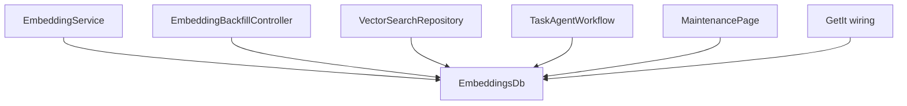
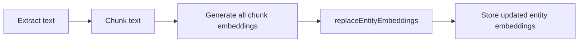
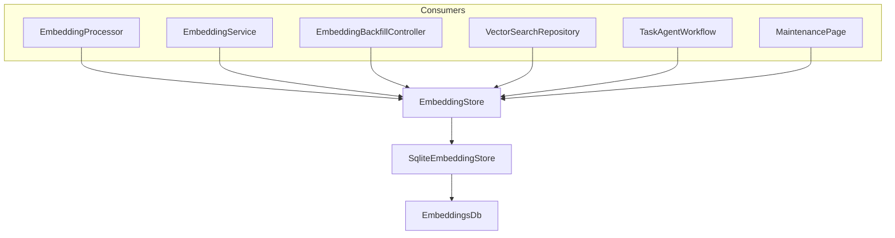
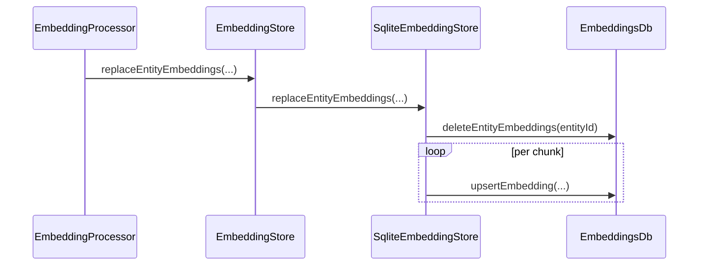
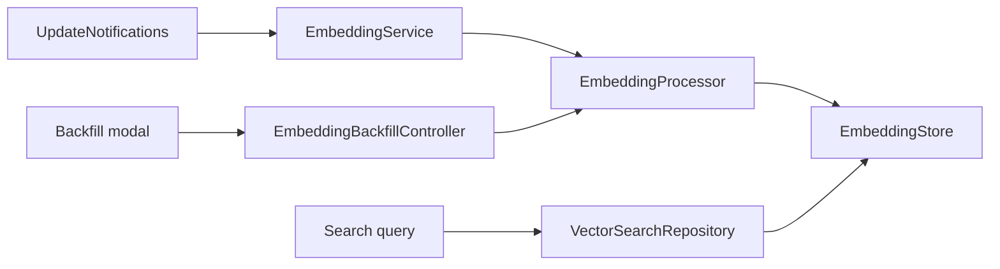
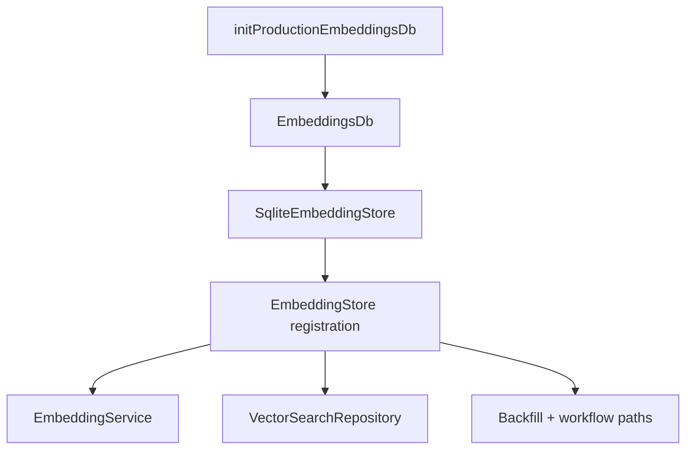
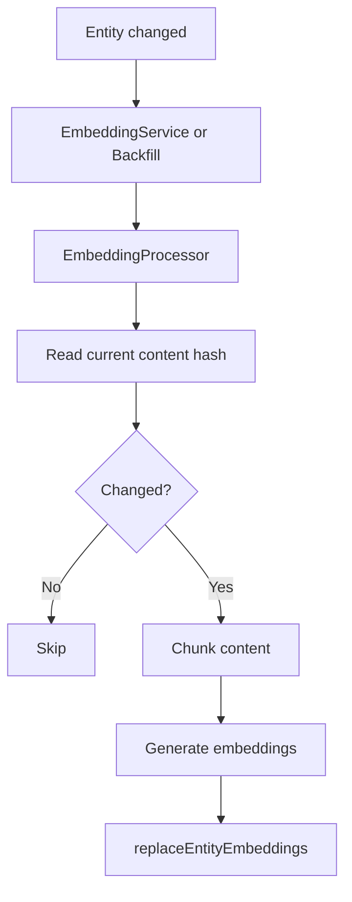
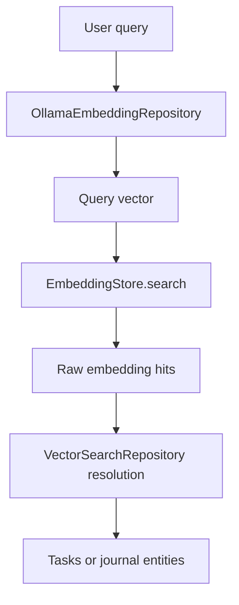

# Implementation Plan: Embedding Store Abstraction Refactor

**Date:** 2026-03-07
**Status:** Implemented on branch
**Priority:** High

## Summary

This document captures the narrow refactor that introduces a feature-local
`EmbeddingStore` contract for embedding reads and writes.

The goal is to remove direct storage coupling from higher-level AI and agent
code while preserving all current behavior:

- embedding generation stays the same,
- vector search stays the same,
- the maintenance flow stays the same,
- the current SQLite-backed embedding store remains the active implementation.

This is intentionally a seam-only change.

## Scope

### In scope

- Add `EmbeddingStore` as the contract used by embedding-producing and
  embedding-consuming code.
- Move `EmbeddingSearchResult` and `kEmbeddingDimensions` to the abstraction
  layer.
- Add a `SqliteEmbeddingStore` adapter around `EmbeddingsDb`.
- Update DI to register and inject the abstraction.
- Update tests to target the abstraction at the integration points.

### Out of scope

- No storage engine change.
- No migrations.
- No query semantics changes.
- No ranking or retrieval behavior changes.
- No user-facing feature changes.

## Problem Statement

Several higher-level code paths depended directly on `EmbeddingsDb`.
That made storage details leak into:

- real-time embedding generation,
- backfill generation,
- semantic search,
- agent report embedding,
- maintenance UI visibility,
- provider wiring and DI.

The coupling was small enough to fix cleanly, but broad enough that it should
be centralized before further embedding work continues.



## Design

### New contract

The new contract is feature-local and intentionally small:

```dart
abstract class EmbeddingStore {
  String? getContentHash(String entityId);
  bool hasEmbedding(String entityId);
  int get count;

  void replaceEntityEmbeddings({
    required String entityId,
    required String entityType,
    required String modelId,
    required String contentHash,
    required List<Float32List> embeddings,
    String categoryId = '',
    String taskId = '',
    String subtype = '',
  });

  void deleteEntityEmbeddings(String entityId);

  List<EmbeddingSearchResult> search({
    required Float32List queryVector,
    int k = 10,
    String? entityTypeFilter,
    Set<String>? categoryIds,
  });

  void deleteAll();
  void close();
}
```

### Why `replaceEntityEmbeddings(...)`

The previous call sites expressed write intent as:

1. delete old rows,
2. upsert one chunk at a time.

That leaked chunk-level storage mechanics upward into orchestration code.
The new method expresses the actual business operation:

- generate all chunk embeddings,
- swap the entity’s stored embeddings as one logical operation.



## Target Architecture

Higher-level code should depend only on `EmbeddingStore`.
Only the adapter layer should know about `EmbeddingsDb`.



## Files in Scope

- `lib/features/ai/database/embedding_store.dart`
- `lib/features/ai/database/sqlite_embedding_store.dart`
- `lib/features/ai/database/embeddings_db.dart`
- `lib/features/ai/service/embedding_processor.dart`
- `lib/features/ai/service/embedding_service.dart`
- `lib/features/ai/repository/vector_search_repository.dart`
- `lib/features/ai/state/embedding_backfill_controller.dart`
- `lib/features/agents/workflow/task_agent_workflow.dart`
- `lib/features/agents/state/agent_providers.dart`
- `lib/features/settings/ui/pages/advanced/maintenance_page.dart`
- `lib/get_it.dart`

Tests:

- `test/mocks/mocks.dart`
- `test/widget_test_utils.dart`
- `test/features/ai/database/sqlite_embedding_store_test.dart`
- `test/features/ai/service/embedding_processor_test.dart`
- `test/features/ai/service/embedding_service_test.dart`
- `test/features/ai/repository/vector_search_repository_test.dart`
- `test/features/ai/state/embedding_backfill_controller_test.dart`
- `test/features/settings/ui/pages/advanced/maintenance_page_test.dart`

## Step-by-Step Plan

### 1. Introduce the abstraction

- Create `embedding_store.dart`.
- Move `EmbeddingSearchResult` there.
- Move `kEmbeddingDimensions` there.
- Keep the contract minimal and aligned with actual call-site needs.

### 2. Add the SQLite adapter

- Create `sqlite_embedding_store.dart`.
- Wrap `EmbeddingsDb`.
- Implement `replaceEntityEmbeddings(...)` by delegating to the existing
  delete-plus-upsert behavior.



### 3. Rewire embedding generation

- Change `EmbeddingProcessor` to depend on `EmbeddingStore`.
- Replace chunk-level writes with `replaceEntityEmbeddings(...)`.
- Keep content-hash checks and chunk generation unchanged.

### 4. Rewire runtime services and repositories

- Change `EmbeddingService` to depend on `EmbeddingStore`.
- Change `VectorSearchRepository` to depend on `EmbeddingStore`.
- Change `EmbeddingBackfillController` to resolve `EmbeddingStore` from GetIt.
- Change `TaskAgentWorkflow` optional embedding dependency to
  `EmbeddingStore?`.
- Change provider wiring in `agent_providers.dart`.
- Change maintenance-card visibility checks to `EmbeddingStore`.



### 5. Rewire DI

- Keep `EmbeddingsDb` registration because lower-level code and tests still use
  it directly.
- Register `EmbeddingStore` beside it, backed by `SqliteEmbeddingStore`.
- Inject the abstraction into the higher-level services.



### 6. Update tests

- Extend the central embeddings mock so it satisfies both `EmbeddingsDb` and
  `EmbeddingStore`.
- Update existing tests to assert `replaceEntityEmbeddings(...)` where
  appropriate.
- Add a direct adapter test for `SqliteEmbeddingStore`.

## Data Flows

### Write flow



### Search flow



## Validation

### Required checks

- Targeted analyzer run on all touched production and test files.
- Targeted tests for:
  - embedding processor,
  - embedding service,
  - vector search repository,
  - embedding backfill controller,
  - maintenance page,
  - task agent workflow / provider wiring,
  - `SqliteEmbeddingStore`.

### Success criteria

- No analyzer warnings or errors on touched files.
- No behavior regressions in existing embedding flows.
- Higher-level code no longer depends directly on `EmbeddingsDb`.
- The only storage-specific code outside tests is in the SQLite adapter and
  low-level database layer.

## Risks

- Missed GetIt registration sites can hide the maintenance card or break agent
  embedding paths.
- Tests may still stub old chunk-level writes and need to be updated to the new
  logical write operation.
- Keeping both `EmbeddingsDb` and `EmbeddingStore` registered is intentional,
  but that split must remain clear: lower-level code uses the DB directly,
  higher-level orchestration uses the abstraction.

## Result

This refactor creates a clear storage seam around embeddings without changing
feature behavior.

That gives the codebase:

- cleaner orchestration code,
- a single logical write operation,
- narrower storage coupling.
