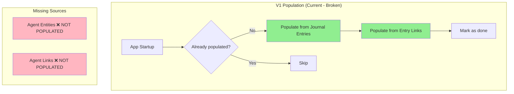
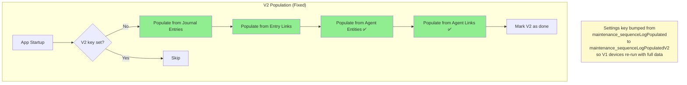
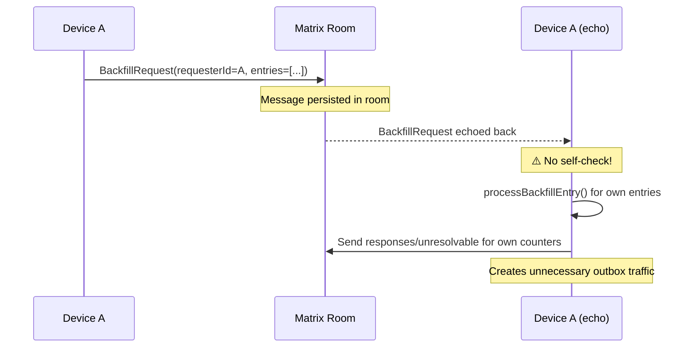
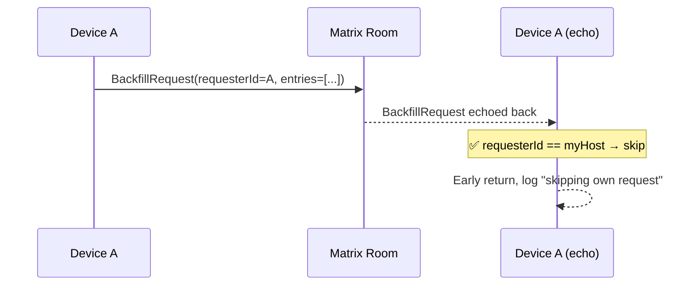
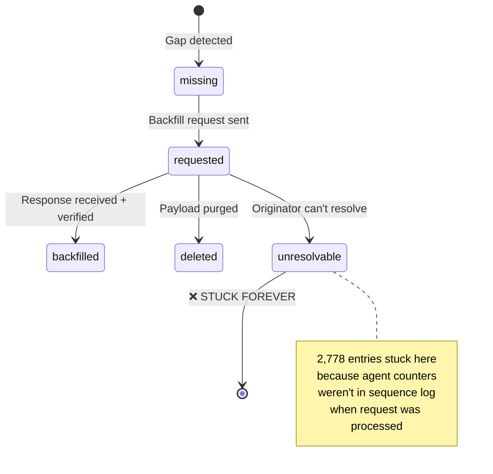
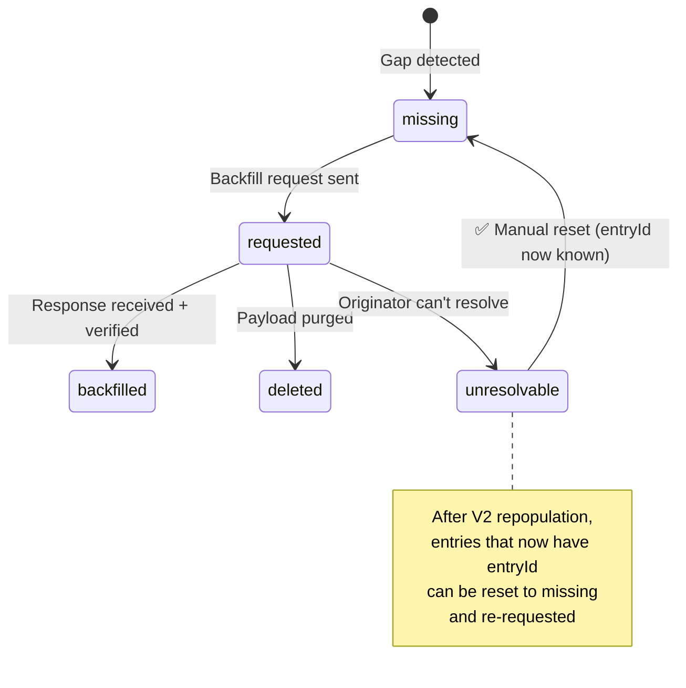
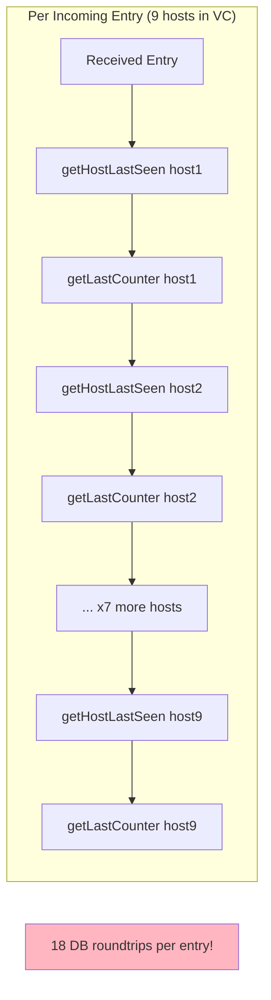
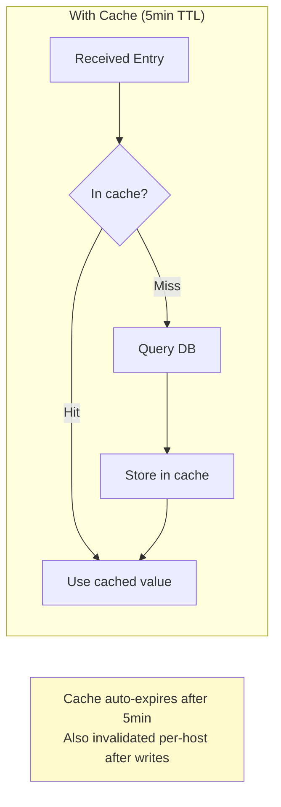
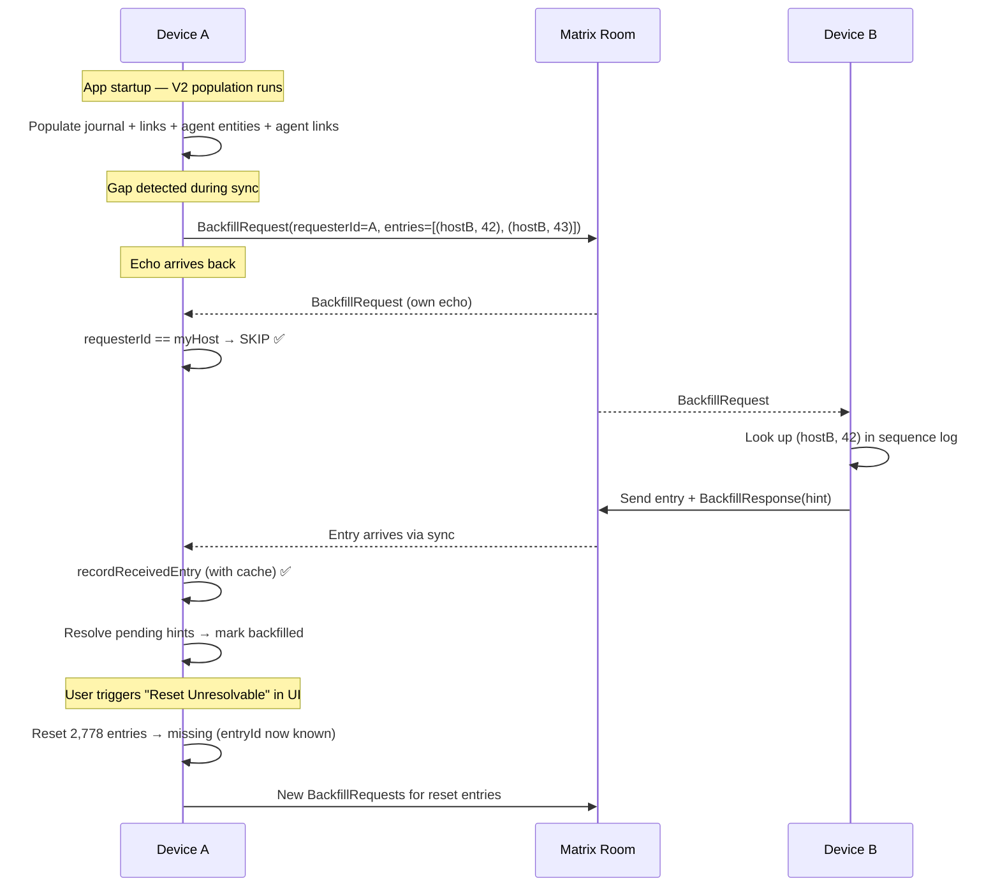

# Fix Sync Backfill & Optimize Inbox Filtering

**Date**: 2026-03-07
**Branch**: `feat/improve_agent_sync`
**Status**: Implementation in progress

## Problem Overview

Sync backfill is failing due to three bugs introduced when agent entities/links were added to vector clock tracking. The sequence log auto-population at startup only covers journal entries and entry links, leaving agent counters unrecorded. When backfill requests arrive for these counters, the originating device marks them as permanently "unresolvable" (2,778 entries). Additionally, there is no self-request guard in the backfill handler, creating a hot-loop risk. 50 requested entries remain stuck because no device can resolve them.

## Bug 1: Missing Agent Data in Sequence Log Population

### What's Wrong

The startup population function (`_checkAndPopulateSequenceLog` in `get_it.dart`) only populates from two sources: journal entries and entry links. When agent entities and agent links were added to the sync system with their own vector clock counters, the population function was never updated to include them.

### The Fix

## Bug 2: Self-Request Hot Loop

### What's Wrong

When a device sends a backfill request via the Matrix room, the message echoes back to the sender after the `SentEventRegistry` TTL expires. Without a self-request guard, the device processes its own request, potentially generating more outbox traffic.

### The Fix

## Bug 3: Unresolvable Entries Stuck Permanently

### What's Wrong

Due to Bug 1 (missing agent population), when a device receives a backfill request for its own agent-related counters that aren't in the sequence log, it marks them as "unresolvable" (permanent). After repopulation fixes the sequence log, these entries remain stuck in unresolvable status.

### The Fix

Add a manual "Reset Unresolvable" action (in sync diagnostics UI) that resets entries back to `missing` when they now have a known `entryId` (meaning repopulation found them).

## Optimization: Host Activity Cache

### What's Wrong

`recordReceivedEntry` performs O(hosts_in_VC) DB queries for `getHostLastSeen()` and `getLastCounterForHost()`. With 9 devices, that's ~18 DB roundtrips per incoming entry.

### The Fix

## Complete Backfill Flow (After All Fixes)

## Files Modified

| File | Change |
|------|--------|
| `lib/get_it.dart` | Add agent entity/link population, bump settings key to V2 |
| `lib/features/sync/backfill/backfill_response_handler.dart` | Add self-request guard |
| `lib/database/sync_db.dart` | Add `resetUnresolvableWithKnownPayload()` |
| `lib/features/sync/sequence/sync_sequence_log_service.dart` | Add reset method + host activity cache |
| `lib/features/sync/ui/backfill_settings_page.dart` | Add "Reset Unresolvable" UI section |
| `lib/features/sync/state/backfill_stats_controller.dart` | Add reset action + isResetting state |
| `lib/l10n/app_*.arb` | Add labels for reset button |

## Verification

1. `make analyze` — zero warnings
2. `make test` — all sync tests pass
3. New tests for: self-request guard, unresolvable reset, host activity cache
4. Post-deploy: trigger "Reset Unresolvable" manually in sync diagnostics, then verify the unresolvable count drops
