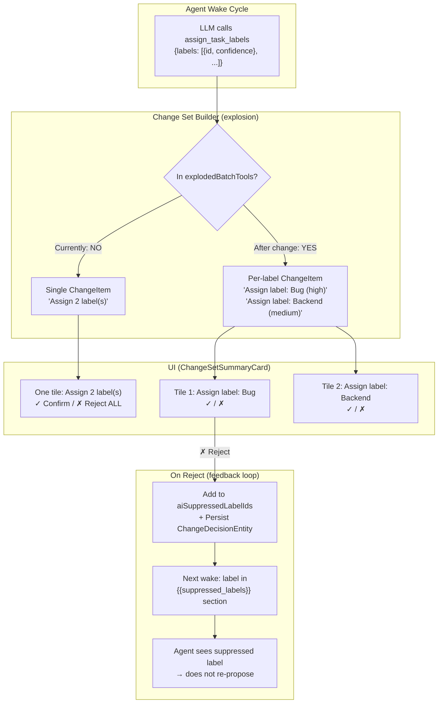
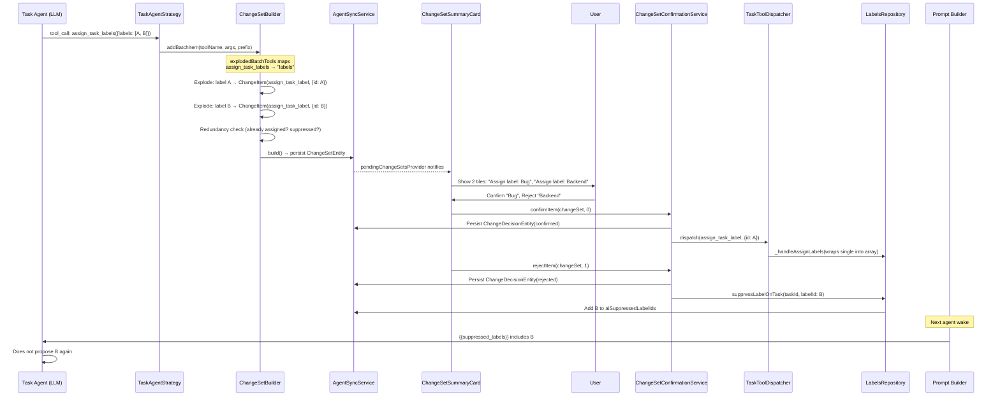
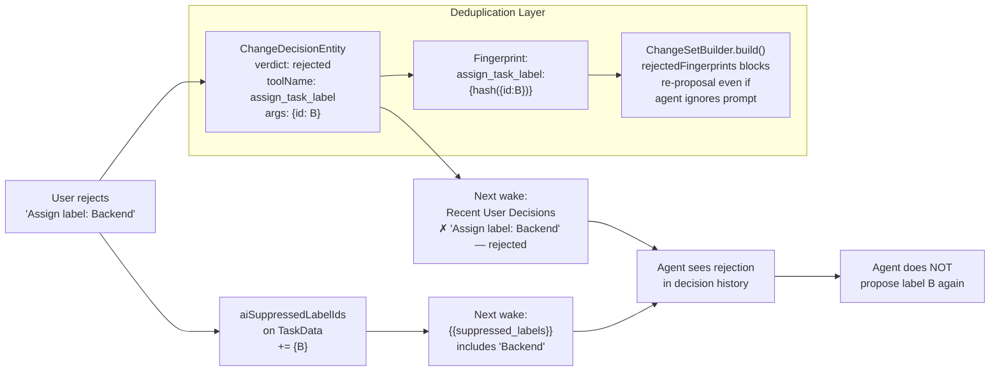

# Individually Rejectable Label Changes in Agent Change Set

**Date:** 2026-03-07
**Priority:** P1
**Status:** Plan

## Context

The task agent proposes label changes via `assign_task_labels`, which sends an array of labels. Currently this entire array becomes **one** `ChangeItem` in the change set — the user must accept or reject all proposed labels as a unit. Checklist items already support per-item granularity via the "batch explosion" pattern. Labels should follow the same pattern.

Additionally, when a user rejects a specific label, it should be automatically suppressed (`aiSuppressedLabelIds`) so the agent learns not to re-propose it. The existing suppression infrastructure and prompt injection (`{{suppressed_labels}}`) already support this — we just need to wire rejection into suppression.

## Architecture Overview



## Sequence Diagram: Full Flow



## Data Flow: Rejected Label Feedback Loop



## Implementation Steps

### Step 1: Add Singular Tool Name + Batch Explosion Entry

**File:** `lib/features/agents/tools/agent_tool_registry.dart`

- Add `static const assignTaskLabel = 'assign_task_label';` to `TaskAgentToolNames`
- Add `TaskAgentToolNames.assignTaskLabels: 'labels'` to `explodedBatchTools`

### Step 2: Extend `_singularize` in ChangeSetBuilder

**File:** `lib/features/agents/workflow/change_set_builder.dart`

Add case:
```dart
TaskAgentToolNames.assignTaskLabels => TaskAgentToolNames.assignTaskLabel,
```

### Step 3: Add Label Name Resolution + Summary Generation

**File:** `lib/features/agents/workflow/change_set_builder.dart`

- Add `LabelNameResolver` typedef: `Future<String?> Function(String labelId)`
- Add optional `labelNameResolver` constructor parameter
- In `addBatchItem`, when processing `assign_task_label` items, resolve label names for human-readable summaries: `'Assign label: "Bug" (high)'`
- Update `_generateItemSummary` with a case for `assign_task_label`

### Step 4: Add Label Redundancy Check

**File:** `lib/features/agents/workflow/change_set_builder.dart`

- Add `ExistingLabelIdsResolver` typedef (or reuse pattern from checklist titles)
- Skip labels already assigned to the task (similar to `_checkAddRedundancy` for checklist items)

### Step 5: Update Strategy Human Summary

**File:** `lib/features/agents/workflow/task_agent_strategy.dart`

- The `assignTaskLabels` case in `_generateHumanSummary` (~line 497) now goes through the batch path instead of single-item path — remove or update it
- Ensure `_addToChangeSet` routes to `addBatchItem` since the tool is now in `explodedBatchTools`

### Step 6: Wire Label Name Resolver in Workflow

**File:** `lib/features/agents/workflow/task_agent_workflow.dart`

When constructing `ChangeSetBuilder`, inject a `labelNameResolver` that queries `JournalDb.getLabelDefinitionById()`.

### Step 7: Add Singular Label Dispatch

**File:** `lib/features/agents/workflow/task_tool_dispatcher.dart`

Add case for `assignTaskLabel` that wraps the single-label args into the array format `TaskLabelHandler` expects:
```dart
case TaskAgentToolNames.assignTaskLabel:
  return _handleAssignLabels(taskEntity, {'labels': [args]}, taskId);
```

### Step 8: Add `suppressLabelOnTask` to LabelsRepository

**File:** `lib/features/labels/repository/labels_repository.dart`

Add a public method that programmatically adds a label ID to `aiSuppressedLabelIds` on a task. Reuses existing `_mergeSuppressed` logic.

### Step 9: Wire Suppression-on-Rejection in Confirmation Service

**File:** `lib/features/agents/service/change_set_confirmation_service.dart`

- Add `LabelsRepository` constructor dependency
- After `rejectItem` persists the decision, if `item.toolName == assignTaskLabel`, call `labelsRepository.suppressLabelOnTask(taskId, labelId)`

### Step 10: Update Provider Wiring

**File:** `lib/features/agents/state/change_set_providers.dart`

Pass `LabelsRepository` to `ChangeSetConfirmationService`. Run `make build_runner` to regenerate.

### Step 11: Tests

| Test file | What to test |
|-----------|-------------|
| `test/features/agents/tools/agent_tool_registry_test.dart` | `assignTaskLabel` constant exists; `explodedBatchTools` includes labels |
| `test/features/agents/workflow/change_set_builder_test.dart` | Label batch explodes into individual items; redundancy filtering; human summaries |
| `test/features/agents/workflow/task_tool_dispatcher_test.dart` | Singular `assign_task_label` dispatches correctly |
| `test/features/agents/service/change_set_confirmation_service_test.dart` | Rejection of label item triggers suppression; non-label rejection doesn't |
| `test/features/labels/repository/labels_repository_test.dart` | `suppressLabelOnTask` adds to `aiSuppressedLabelIds` |

## Key Design Decisions

1. **Reuse existing batch explosion pattern** — no new infrastructure needed, labels join checklist items in `explodedBatchTools`
2. **Singular tool name convention** — `assign_task_labels` → `assign_task_label` (matches `add_multiple_checklist_items` → `add_checklist_item`)
3. **Automatic suppression on rejection** — rejected labels immediately enter `aiSuppressedLabelIds`, leveraging the existing prompt injection and validator infrastructure
4. **Three-layer defense against re-proposal**: (a) `aiSuppressedLabelIds` in prompt, (b) `LabelValidator` blocks at dispatch, (c) `rejectedFingerprints` blocks at builder dedup
5. **No LLM tool schema changes** — the LLM still calls `assign_task_labels` with an array; explosion is purely a builder concern

## Verification

1. Run `make analyze` — zero warnings
2. Run targeted tests for changed files via `dart-mcp.run_tests`
3. Manual verification: trigger agent wake → confirm labels appear as individual tiles → confirm one, reject another → verify suppression in next wake's prompt
