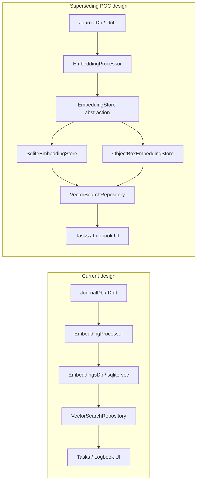
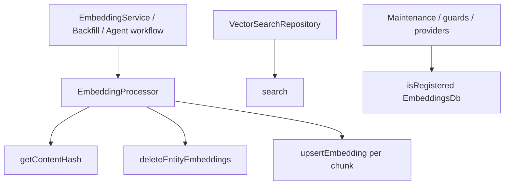
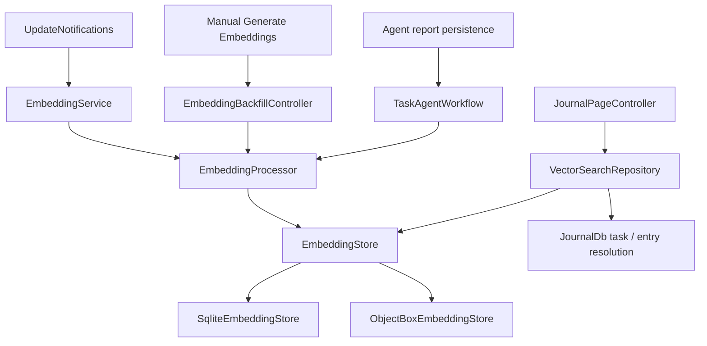
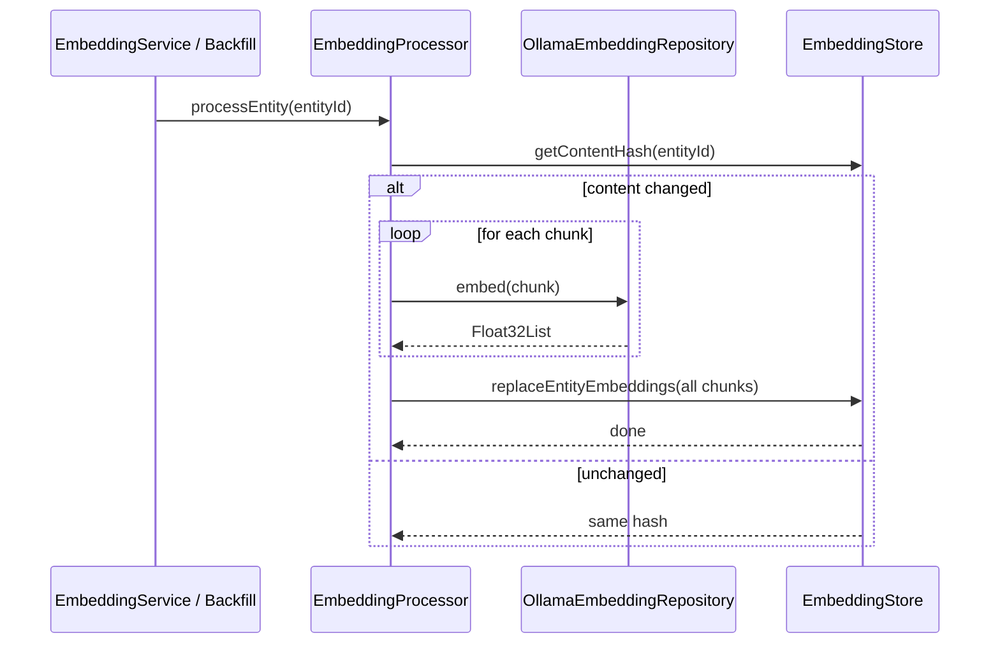
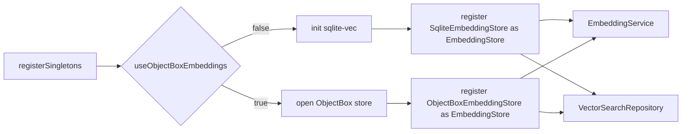
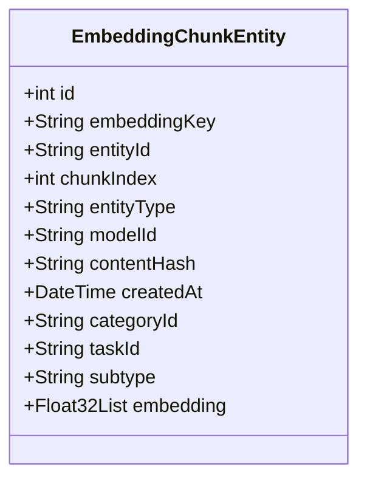
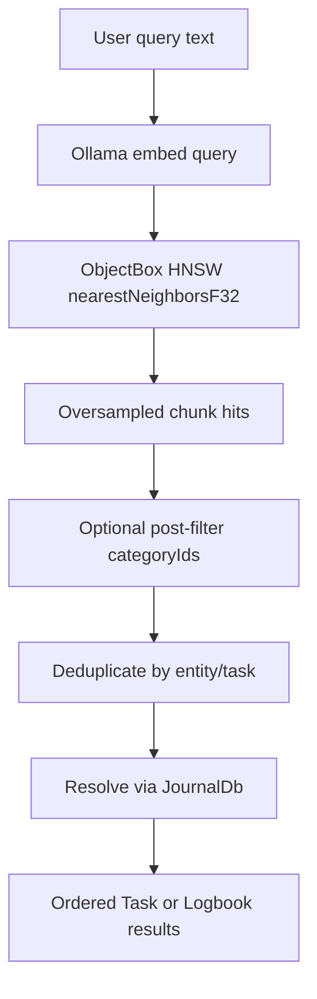
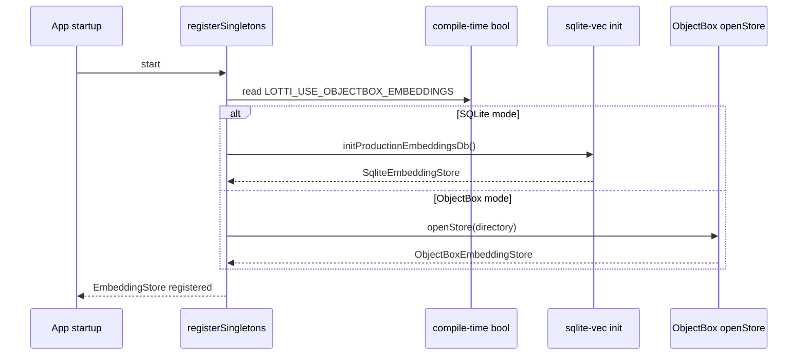
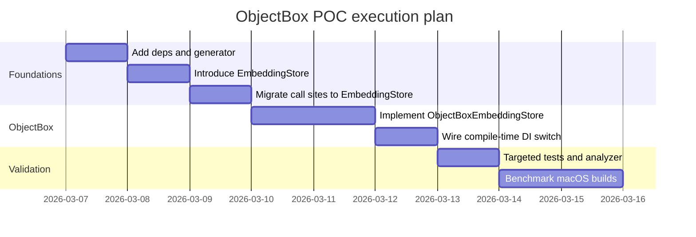
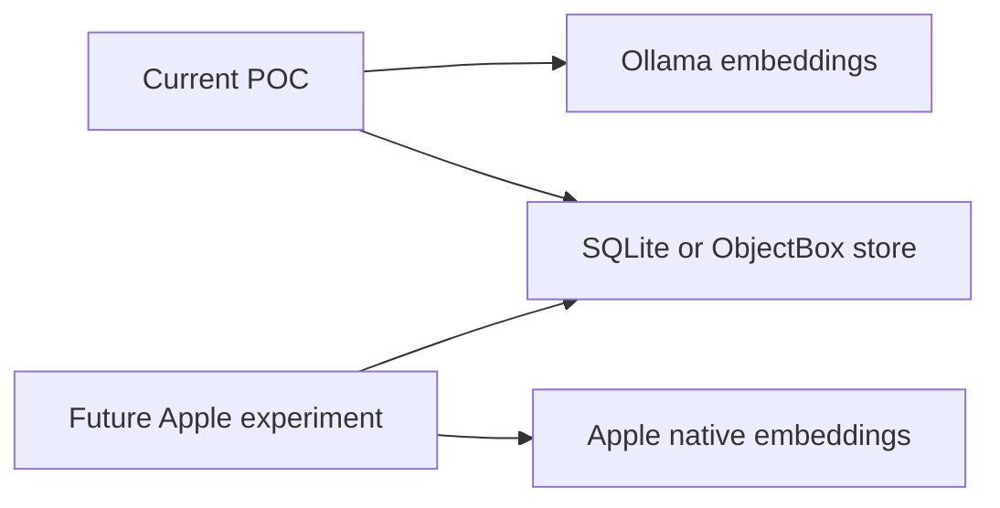

# Superseding Plan: ObjectBox Embedding Store POC for Vector Search

**Date:** 2026-03-07
**Status:** Proposed
**Priority:** P0

## Superseding Scope

This document supersedes the **vector storage backend direction** in earlier plans without
modifying those files:

- `docs/implementation_plans/2026-02-19_sqlite_vec_integration.md`
- `docs/implementation_plans/2026-03-03_task_search_agent_reports_metadata_embeddings.md`
- `docs/implementation_plans/2026-03-06_unified_generate_embeddings_and_logbook_vector_search.md`

It does **not** supersede the product behavior in those plans:

- generating embeddings remains the same feature,
- Task and Logbook vector search remain the same user-facing feature,
- agent report embeddings and metadata enrichment remain desired behavior.

What changes is the proposed storage engine for embeddings and ANN search:

- keep core Lotti persistence untouched,
- keep SQLite path intact for fallback,
- add ObjectBox as a sidecar vector store behind a compile-time backend switch.

## Summary

We have a release-only performance regression with sqlite-vec / VSS on macOS TestFlight builds.
For this P0 investigation, we should add a side-by-side ObjectBox proof of concept that stores
only embeddings and serves only vector similarity search.

The POC should:

- introduce a storage abstraction at the embedding layer,
- keep the existing SQLite implementation available,
- add an ObjectBox implementation using HNSW-based vector search,
- select the backend via a compile-time bool,
- preserve existing search behavior in Tasks and Logbook,
- keep Ollama as the embedding generator for the first experiment,
- avoid any dependency from new code to legacy storage details.

## Why This Is Now Acceptable

The earlier sqlite-vec plan rejected ObjectBox because it was framed as a database replacement.
That is no longer the proposal.

The new proposal is narrowly scoped:

- Drift stays the system of record.
- Journal, settings, sync, and agent persistence stay exactly where they are.
- ObjectBox becomes a derived-data sidecar for embeddings only.
- Rebuildability remains intact because embeddings are derived from existing data.



## Constraints and Decisions

### Hard decisions

- Backend selection is **compile-time only**.
- No user-facing config flag for backend selection in this POC.
- Keep both backends buildable from the same branch.
- Keep Ollama as the embedding generator in the first benchmark pass.
- Do not touch existing implementation plan files.

### Compile-time toggle

```dart
const useObjectBoxEmbeddings = bool.fromEnvironment(
  'LOTTI_USE_OBJECTBOX_EMBEDDINGS',
  defaultValue: false,
);
```

Recommended runtime commands:

- SQLite baseline:
  `fvm flutter run -d macos --dart-define=LOTTI_USE_OBJECTBOX_EMBEDDINGS=false`
- ObjectBox POC:
  `fvm flutter run -d macos --dart-define=LOTTI_USE_OBJECTBOX_EMBEDDINGS=true`

### Non-goals for the first POC

- No migration of existing SQLite embedding rows into ObjectBox.
- No hybrid backend reads.
- No Apple-native embedding generation in the same change.
- No full-database ObjectBox migration.
- No UI for choosing the backend.

## Grounded Findings in the Current Codebase

Current storage coupling is narrower than it first appears. The main direct `EmbeddingsDb`
dependencies are:

- `lib/features/ai/service/embedding_processor.dart`
- `lib/features/ai/service/embedding_service.dart`
- `lib/features/ai/repository/vector_search_repository.dart`
- `lib/features/ai/state/embedding_backfill_controller.dart`
- `lib/features/agents/workflow/task_agent_workflow.dart`
- `lib/features/agents/state/agent_providers.dart`
- `lib/features/settings/ui/pages/advanced/maintenance_page.dart`
- `lib/get_it.dart`

This is small enough to replace with one abstraction cleanly.

The current SQLite API is also a good guide for the abstraction:

- `getContentHash(entityId)`
- `deleteEntityEmbeddings(entityId)`
- `upsertEmbedding(...)`
- `search(...)`
- `hasEmbedding(entityId)`
- `count`
- `close()`

The biggest structural improvement for the new abstraction is to replace repeated per-chunk
`upsertEmbedding(...)` calls with one atomic `replaceEntityEmbeddings(...)` write.



## Target Architecture

### Core idea

Introduce a feature-local abstraction named `EmbeddingStore`.

All write and read paths depend on `EmbeddingStore`.

- SQLite becomes one implementation.
- ObjectBox becomes another implementation.
- Task and Logbook search logic stays in `VectorSearchRepository`.
- Entity extraction and embedding generation stay in `EmbeddingProcessor`.



### Proposed interface

```dart
abstract class EmbeddingStore {
  String? getContentHash(String entityId);
  bool hasEmbedding(String entityId);
  int get count;

  void replaceEntityEmbeddings({
    required String entityId,
    required String entityType,
    required String modelId,
    required String contentHash,
    required List<Float32List> embeddings,
    String categoryId = '',
    String taskId = '',
    String subtype = '',
  });

  void deleteEntityEmbeddings(String entityId);

  List<EmbeddingSearchResult> search({
    required Float32List queryVector,
    int k = 10,
    String? entityTypeFilter,
    Set<String>? categoryIds,
  });

  void deleteAll();
  void close();
}
```

### Why `replaceEntityEmbeddings(...)`

This matches the real write pattern better:

- embeddings are generated for all chunks first,
- existing rows for the entity are then swapped out atomically,
- both stores can optimize batch insertion internally.



## Backend Selection and DI

The backend switch belongs in DI, not in repositories.

`registerSingletons()` in `lib/get_it.dart` is already `async`, which is useful because
ObjectBox store opening is async.

### Registration strategy

1. Create `EmbeddingStore`.
2. Adapt the existing SQLite backend into `SqliteEmbeddingStore`.
3. Add `ObjectBoxEmbeddingStore`.
4. Register exactly one `EmbeddingStore` based on the compile-time bool.
5. Update all embedding-related consumers to ask for `EmbeddingStore`.



### Important migration detail

Do not leave UI and providers checking `getIt.isRegistered<EmbeddingsDb>()`.

Those checks must move to `EmbeddingStore`, or the POC will work in the service layer but still
appear unavailable in UI and provider wiring.

## ObjectBox Data Model

### Entity shape

The ObjectBox entity should store one row per embedding chunk, preserving the same metadata
already used by SQLite search resolution.

Recommended fields:

- `id`
- `embeddingKey`
- `entityId`
- `chunkIndex`
- `entityType`
- `modelId`
- `contentHash`
- `createdAt`
- `categoryId`
- `taskId`
- `subtype`
- `embedding`

`embeddingKey` should be a synthetic unique key such as `"$entityId:$chunkIndex"` because
ObjectBox does not offer composite primary keys in the same way SQLite does.



### Suggested annotations

```dart
@Entity()
class EmbeddingChunkEntity {
  @Id()
  int id = 0;

  @Unique()
  String embeddingKey;

  @Index()
  String entityId;

  int chunkIndex;

  @Index()
  String entityType;

  String modelId;
  String contentHash;
  DateTime createdAt;

  @Index()
  String categoryId;

  @Index()
  String taskId;

  @Index()
  String subtype;

  @Property(type: PropertyType.floatVector)
  @HnswIndex(
    dimensions: kEmbeddingDimensions,
    distanceType: VectorDistanceType.cosine,
    neighborsPerNode: 30,
    indexingSearchCount: 200,
  )
  late Float32List embedding;
}
```

### Search behavior

Use ObjectBox HNSW nearest-neighbor search for the vector field, then preserve the same higher-level
logic already in `VectorSearchRepository`:

- oversample,
- post-filter by category if needed,
- dedupe by entity or task,
- resolve back to `JournalEntity` via `JournalDb`.

This is important because current feature semantics live above the store layer.



### Important note on filtering

For the POC, assume category filtering is applied after ANN retrieval unless the current
ObjectBox Dart query API proves otherwise in practice.

That means:

- request more than `k`,
- filter by metadata,
- then trim to `k`.

This matches the current sqlite-vec behavior and keeps the benchmark comparable.

## Step-by-Step Implementation Plan

### Phase 0: Dependency and build setup

### Changes

- Update `pubspec.yaml`
  - add `objectbox`
  - add `objectbox_flutter_libs`
  - add `objectbox_generator` to `dev_dependencies`
  - raise Dart lower bound to a version compatible with ObjectBox 5.2.x
- Run code generation and commit generated ObjectBox artifacts

### Notes

- Do not hand-edit generated ObjectBox files.
- Keep sqlite dependencies in place.
- Keep `sqlite_vec` path dependency in place for the fallback backend.

### Phase 1: Introduce the abstraction

### New files

- `lib/features/ai/database/embedding_store.dart`
- `lib/features/ai/database/sqlite_embedding_store.dart`

### Changes

- Move `EmbeddingSearchResult` out of `EmbeddingsDb` ownership if needed so both implementations
  can use it cleanly.
- Wrap current `EmbeddingsDb` behind `SqliteEmbeddingStore`.
- Keep `EmbeddingsDb` implementation itself unchanged in this phase.

### Outcome

- Zero behavior change.
- The SQLite path becomes the default implementation through the abstraction.

### Phase 2: Update consumers to use `EmbeddingStore`

### Files to update

- `lib/features/ai/service/embedding_processor.dart`
- `lib/features/ai/service/embedding_service.dart`
- `lib/features/ai/repository/vector_search_repository.dart`
- `lib/features/ai/state/embedding_backfill_controller.dart`
- `lib/features/agents/workflow/task_agent_workflow.dart`
- `lib/features/agents/state/agent_providers.dart`
- `lib/features/settings/ui/pages/advanced/maintenance_page.dart`
- `lib/get_it.dart`

### Required behavior changes

- Replace `EmbeddingsDb` constructor parameters and fields with `EmbeddingStore`.
- Replace `deleteEntityEmbeddings + repeated upsertEmbedding` with one
  `replaceEntityEmbeddings(...)` call.
- Replace all `getIt.isRegistered<EmbeddingsDb>()` checks with `EmbeddingStore`.

### Test updates

- Add `MockEmbeddingStore` to `test/mocks/mocks.dart`
- Update tests that currently mock `EmbeddingsDb`

### Phase 3: Add ObjectBox implementation

### New files

- `lib/features/ai/database/objectbox_embedding_store.dart`
- generated ObjectBox files

### Changes

- Define `EmbeddingChunkEntity`.
- Open an ObjectBox store in a sidecar directory such as:
  `"$documentsPath/objectbox_embeddings"`
- Implement:
  - `replaceEntityEmbeddings(...)`
  - `search(...)`
  - `getContentHash(...)`
  - `hasEmbedding(...)`
  - `deleteEntityEmbeddings(...)`
  - `deleteAll()`
  - `close()`

### Write path guidance

- query all existing rows by `entityId`,
- remove them inside one write transaction,
- `putMany(...)` the new chunk rows in the same transaction.

### Read path guidance

- use nearest-neighbor search on `embedding`,
- oversample,
- post-filter,
- map ObjectBox scores back into `EmbeddingSearchResult.distance`.

### Phase 4: Wire the compile-time switch

### `lib/get_it.dart`

- if `useObjectBoxEmbeddings` is `false`
  - initialize sqlite-vec as today
  - register `SqliteEmbeddingStore`
- if `true`
  - skip sqlite-vec initialization for the embedding store path
  - open ObjectBox store
  - register `ObjectBoxEmbeddingStore`

Keep the rest of the app unchanged.



### Phase 5: Benchmark and compare

### Benchmark dimensions

- insertion throughput
- query latency
- CPU usage
- memory usage
- on-disk size
- debug vs profile vs release variance
- macOS local run vs TestFlight build behavior

### Dataset targets

- realistic corpus: roughly 20k documents, about 5k active embeddings
- task-heavy queries
- logbook-style queries
- agent-report-heavy queries

### Suggested benchmark outputs

- p50 / p95 query latency
- average CPU during repeated search
- peak CPU during batch insertion
- time to rebuild embeddings from scratch
- database size on disk

### Success criteria

- release-mode query performance no longer collapses relative to development builds
- materially lower CPU than sqlite-vec in the failing production scenario
- no regressions in result quality or search semantics for Tasks and Logbook



## Test Strategy

### Unit tests

- `sqlite_embedding_store_test.dart`
- `objectbox_embedding_store_test.dart`
- `vector_search_repository_test.dart`
- `embedding_processor_test.dart`
- `embedding_service_test.dart`
- `embedding_backfill_controller_test.dart`

### Integration expectations

- Search semantics must remain unchanged:
  - Tasks page returns resolved tasks
  - Logbook returns matched entries
  - agent reports still resolve via `taskId`
- Guard behavior must still work when no embedding store is registered.

### Important mocking update

Central test infrastructure should stop mocking `EmbeddingsDb` directly for most feature tests.
Instead:

- add `MockEmbeddingStore`,
- register that in `test/widget_test_utils.dart`,
- keep dedicated backend tests for real SQLite/ObjectBox stores.

## Risks and Mitigations

| Risk | Impact | Mitigation |
|------|--------|------------|
| ObjectBox API semantics differ from assumed query filtering behavior | Medium | Oversample and post-filter in the repository, same as today |
| Generated ObjectBox files create churn | Low | Keep entity definitions small and localized |
| Existing UI checks still reference `EmbeddingsDb` | High | Migrate all availability checks to `EmbeddingStore` in the same change |
| Search score scale differs slightly from sqlite-vec distance | Medium | Treat store score as opaque ranking distance inside `EmbeddingSearchResult` |
| Rebuild cost for side-by-side POC | Low | Embeddings are derived; rebuild from source content |
| Mixing storage and embedding-model changes obscures results | High | Keep Ollama for the first benchmark pass |

## Apple / iOS Follow-up

ObjectBox’s Apple support is good enough for the storage side of the problem.
That does **not** mean ObjectBox generates embeddings.

The clean separation for future Apple-native work is:

- `EmbeddingStore` decides where vectors are stored and queried.
- `EmbeddingRepository` decides how vectors are generated.

Future Apple-native experiment:

- keep `EmbeddingStore` as ObjectBox,
- add a second generator path backed by Apple frameworks,
- compare retrieval quality separately from storage performance.



This keeps the current P0 focused. If we change both storage and embedding model at the same time,
we will not know which variable caused the result.

## Concrete File Plan

### Create

- `lib/features/ai/database/embedding_store.dart`
- `lib/features/ai/database/sqlite_embedding_store.dart`
- `lib/features/ai/database/objectbox_embedding_store.dart`
- `test/features/ai/database/sqlite_embedding_store_test.dart`
- `test/features/ai/database/objectbox_embedding_store_test.dart`
- this implementation plan file

### Modify

- `pubspec.yaml`
- `lib/get_it.dart`
- `lib/features/ai/service/embedding_processor.dart`
- `lib/features/ai/service/embedding_service.dart`
- `lib/features/ai/repository/vector_search_repository.dart`
- `lib/features/ai/state/embedding_backfill_controller.dart`
- `lib/features/agents/workflow/task_agent_workflow.dart`
- `lib/features/agents/state/agent_providers.dart`
- `lib/features/settings/ui/pages/advanced/maintenance_page.dart`
- `test/mocks/mocks.dart`
- `test/widget_test_utils.dart`

## Recommended Order of Execution

1. Add dependencies and generator support.
2. Introduce `EmbeddingStore` and adapt SQLite to it.
3. Migrate all consumers and tests to the abstraction.
4. Add ObjectBox store implementation.
5. Add DI switch in `get_it.dart`.
6. Run targeted tests for the embedding/search surface.
7. Benchmark macOS debug/profile/release builds.
8. If ObjectBox wins clearly, proceed to production hardening.

## Exit Criteria

The POC is complete when:

- the app builds with either backend from the same branch,
- Task and Logbook vector search work with either backend,
- embedding generation/backfill works with either backend,
- analyzer is clean,
- targeted tests are green,
- macOS release/profile benchmarks show whether ObjectBox fixes the P0 regression.
