# Sharded Vector Search with Relevance Cutoff

**Date:** 2026-03-07
**Status:** Draft — awaiting review before implementation
**Priority:** P1

## Problem Statement

The current single-database vector search architecture has two critical issues:

1. **Drowning problem**: When categories have vastly different sizes (e.g., "Documents" has 10,000
   entries, "Profiles" has 50), a query for entries across both categories returns results dominated
   by the larger category. The `k * 3` oversampling heuristic is insufficient — rare-category results
   are simply absent from the top-N HNSW neighbors.

2. **Trash results**: ObjectBox HNSW always returns the top N results regardless of actual relevance.
   A query about "Kubernetes deployment" against a "Recipes" category still returns 20 recipe entries
   with high cosine distances. There is no relevance cutoff.

## Current Architecture

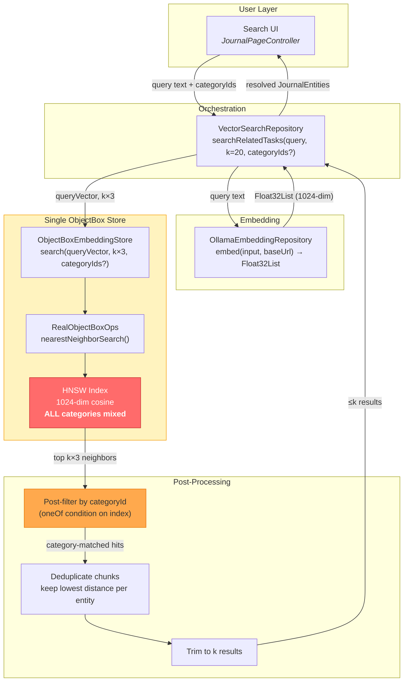

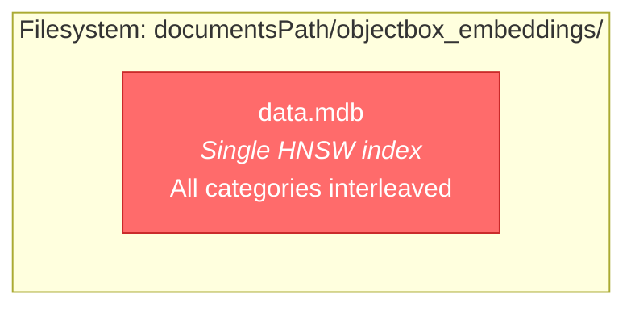

### The Drowning Problem (Visualized)

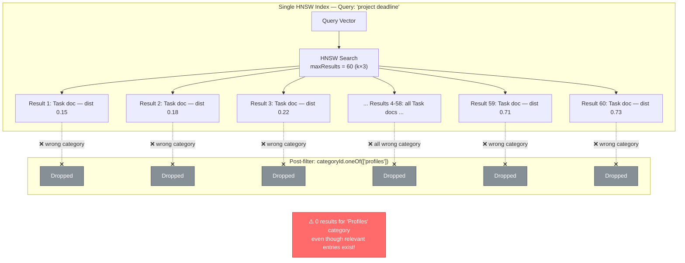

**Key files:**
- `lib/features/ai/database/embedding_store.dart` — abstract interface
- `lib/features/ai/database/objectbox_embedding_store.dart` — single-store implementation
- `lib/features/ai/database/objectbox_ops.dart` — ObjectBox operations abstraction
- `lib/features/ai/database/real_objectbox_ops.dart` — production ObjectBox ops
- `lib/features/ai/database/objectbox_embedding_entity.dart` — entity model
- `lib/features/ai/repository/vector_search_repository.dart` — search orchestration
- `lib/features/ai/service/embedding_service.dart` — background embedding pipeline
- `lib/features/ai/service/embedding_processor.dart` — per-entity processing
- `lib/get_it.dart` — DI registration (~line 399)

## Target Architecture


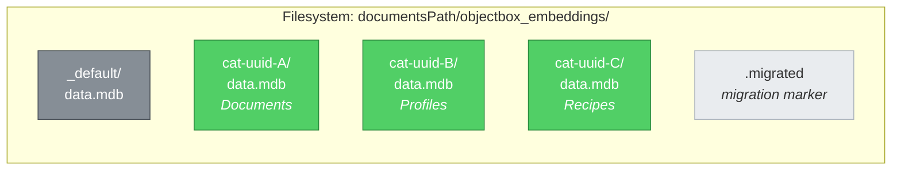

### Fan-Out Solves the Drowning Problem

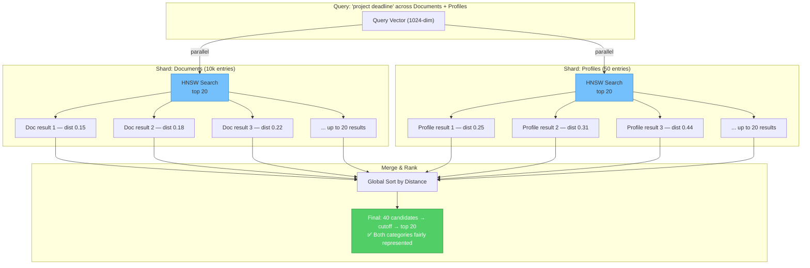

Each category gets its own ObjectBox store with its own HNSW index. This guarantees that searching
category B always returns the best matches *within* category B, regardless of how many entries exist
in category A.

## Technical Analysis

### ObjectBox Multi-Store Feasibility

ObjectBox supports multiple `Store` instances in the same process, each with its own directory. The
`openStore()` function accepts a `directory` parameter. On macOS sandboxed apps, each store needs the
same `macosApplicationGroup` identifier for POSIX semaphore coordination.

**Constraints:**
- Each store holds its own HNSW index — no cross-store queries possible (by design, this is what we want)
- File handles: each store uses ~3-5 file descriptors. With typical category counts (5-20), this is
  well within OS limits
- Memory: HNSW indexes are memory-mapped. Smaller per-shard indexes are more cache-friendly than one
  large index
- Store open/close: stores can be opened lazily and closed when idle. ObjectBox stores are
  thread-safe and designed for long-lived use

### Cosine Distance Score Ranges

ObjectBox HNSW with `VectorDistanceType.cosine` returns scores in range `[0.0, 2.0]`:
- **0.0**: identical vectors
- **1.0**: orthogonal (unrelated)
- **2.0**: diametrically opposite

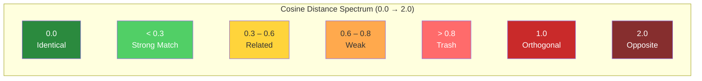

Empirical ranges for `mxbai-embed-large` (1024-dim):
- **< 0.3**: Strong semantic match (same topic, paraphrased)
- **0.3 - 0.6**: Related content (same domain, tangential)
- **0.6 - 0.8**: Weak relation (broad category overlap)
- **> 0.8**: Essentially unrelated ("trash results")

**Action required**: We need to validate these ranges empirically with real data from the app. See
Phase 1 below.

## Implementation Plan

### Phase Dependency Graph

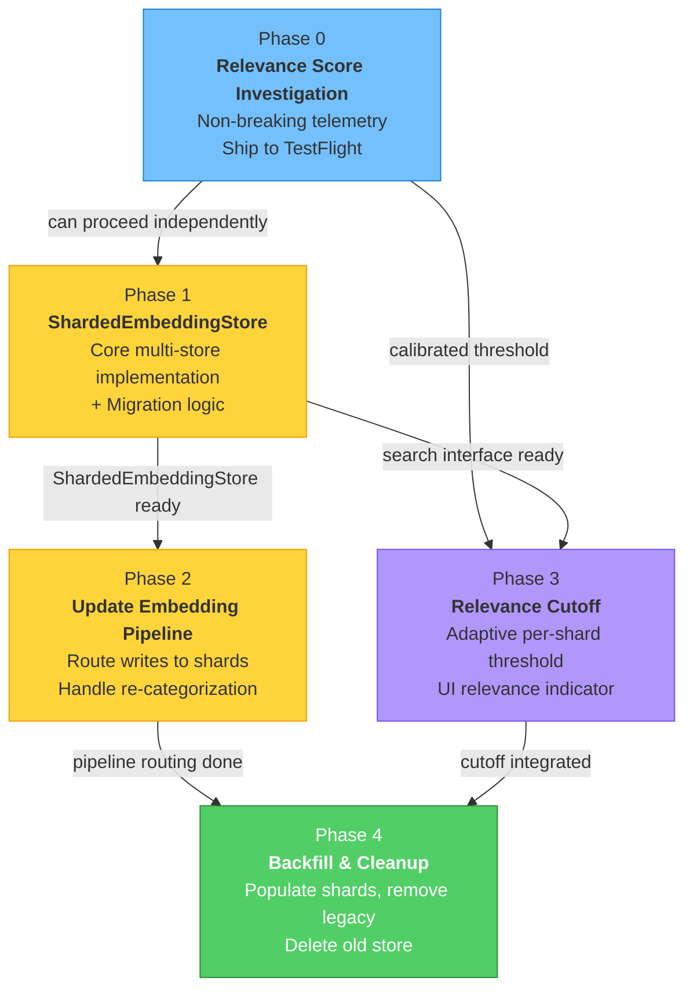

### Phase 0: Relevance Score Investigation (non-breaking)

**Goal:** Establish empirical distance thresholds before any architectural changes.

1. **Add distance logging to search results**
   - In `VectorSearchRepository._prepareSearch()`, log the distance distribution of returned results
     (min, max, median, count) using `DevLogger.info`
   - This runs on existing single-store architecture — zero risk

2. **Add distance field to VectorSearchResult**
   - Extend `VectorSearchResult` to carry `List<(JournalEntity, double distance)>` instead of
     just `List<JournalEntity>`
   - Display distance scores in the search results UI (debug overlay or dev mode only)

3. **Collect data from TestFlight**
   - Ship Phase 0 to TestFlight
   - Perform representative queries across different categories
   - Record distance distributions to calibrate the cutoff threshold

**Deliverable:** A validated distance threshold (expected: ~0.7-0.8 for cosine distance) and
a decision on whether to use a fixed cutoff or a relative one (e.g., "drop results > 2× the
best result's distance").

### Phase 1: ShardedEmbeddingStore (core implementation)

**Goal:** Implement the multi-store fan-out architecture behind the existing `EmbeddingStore`
interface.

#### 1a. New class: `ShardedEmbeddingStore`

```dart
/// Manages per-category ObjectBox stores and fans out queries.
class ShardedEmbeddingStore implements EmbeddingStore {
  ShardedEmbeddingStore({
    required String basePath,
    required String? macosApplicationGroup,
    this.distanceCutoff = 0.8,  // tunable, from Phase 0 findings
  });

  /// Category ID → open store. Lazily populated.
  final Map<String, ObjectBoxEmbeddingStore> _shards = {};

  /// The "default" shard for uncategorized entries (categoryId == '').
  static const _defaultShardKey = '_default';

  // --- EmbeddingStore interface ---

  @override
  Future<List<EmbeddingSearchResult>> search({
    required Float32List queryVector,
    int k = 10,
    String? entityTypeFilter,
    Set<String>? categoryIds,
  }) async {
    final shardsToQuery = _resolveShardsToQuery(categoryIds);

    // Fan-out: query each shard for top k results
    final allResults = <EmbeddingSearchResult>[];
    for (final shard in shardsToQuery) {
      final results = shard.search(
        queryVector: queryVector,
        k: k,  // full k per shard, not k*3
        entityTypeFilter: entityTypeFilter,
        // No category filter needed — shard IS the category
      );
      allResults.addAll(results);
    }

    // Apply distance cutoff
    allResults.removeWhere((r) => r.distance > distanceCutoff);

    // Global ranking by distance
    allResults.sort((a, b) => a.distance.compareTo(b.distance));

    return allResults;  // caller trims to k after deduplication
  }

  @override
  Future<void> replaceEntityEmbeddings({...}) async {
    final shard = await _getOrCreateShard(categoryId);
    shard.replaceEntityEmbeddings(...);
  }
}
```

#### Fan-Out Search Sequence

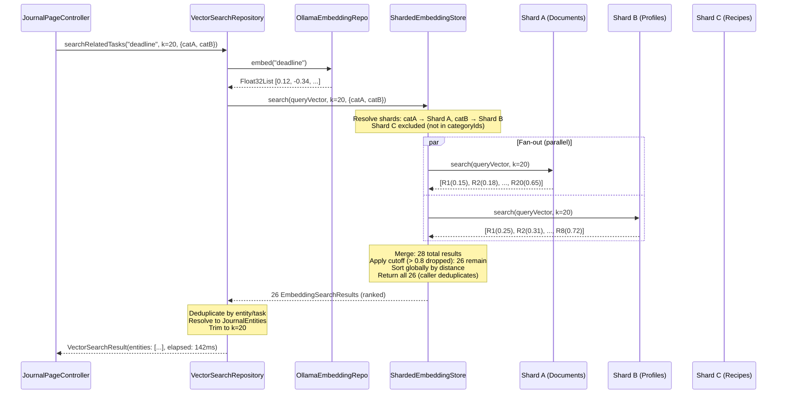

#### Embedding Write Routing

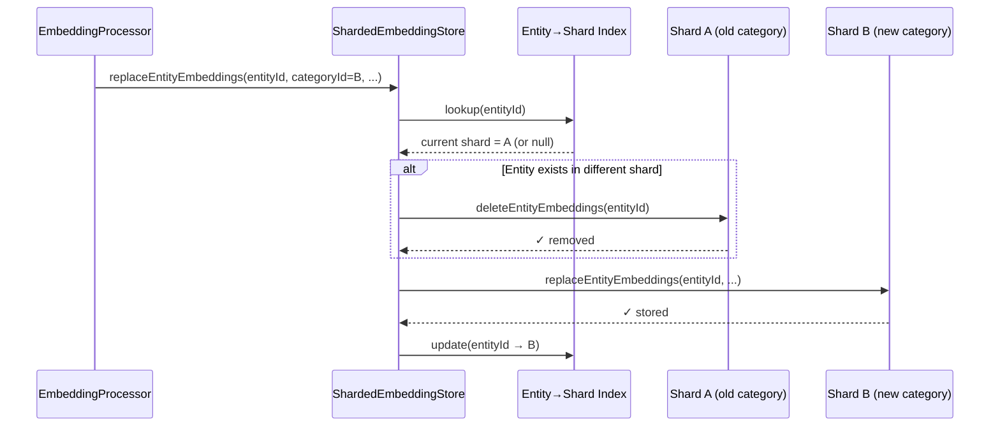

**Key design decisions:**
- `ShardedEmbeddingStore` implements `EmbeddingStore` — no changes needed upstream
- Each shard is a full `ObjectBoxEmbeddingStore` with its own `RealObjectBoxOps`
- Shards are created lazily on first write (dynamic sharding)
- The `search()` method no longer needs `k * 3` oversampling since each shard is homogeneous
- Distance cutoff is applied *before* returning to `VectorSearchRepository`
- No category filter is passed to individual shards (the shard *is* the filter)

#### 1b. Shard lifecycle management

```dart
/// Opens or creates the shard for [categoryId].
Future<ObjectBoxEmbeddingStore> _getOrCreateShard(String categoryId) async {
  final key = categoryId.isEmpty ? _defaultShardKey : categoryId;
  if (_shards.containsKey(key)) return _shards[key]!;

  final dir = p.join(_basePath, key);
  await Directory(dir).create(recursive: true);
  final store = await openStore(
    directory: dir,
    macosApplicationGroup: _macosApplicationGroup,
  );
  final shard = ObjectBoxEmbeddingStore(RealObjectBoxOps(store));
  _shards[key] = shard;
  return shard;
}

/// Determines which shards to query.
List<ObjectBoxEmbeddingStore> _resolveShardsToQuery(Set<String>? categoryIds) {
  if (categoryIds == null || categoryIds.isEmpty) {
    // Query ALL open shards
    return _shards.values.toList();
  }
  return [
    for (final id in categoryIds)
      if (_shards.containsKey(id)) _shards[id]!,
  ];
}
```

#### 1c. Migration from single store

A one-time migration reads all entities from the old single store and distributes them to
per-category shards:

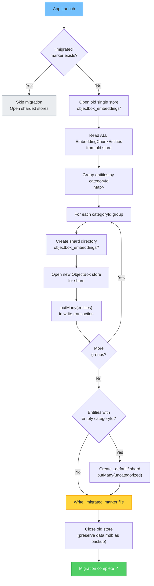

```dart
static Future<void> migrateFromSingleStore({
  required String documentsPath,
  required String? macosApplicationGroup,
}) async {
  final oldDir = p.join(documentsPath, 'objectbox_embeddings');
  final markerFile = File(p.join(oldDir, '.migrated'));
  if (markerFile.existsSync()) return;  // already migrated

  // 1. Open old store, read all entities
  // 2. Group by categoryId
  // 3. For each group, open/create shard, putMany
  // 4. Write marker file
  // 5. Close old store (optionally delete old data.mdb)
}
```

### Phase 2: Update Embedding Pipeline

**Goal:** Route new embeddings to the correct shard.

#### 2a. EmbeddingProcessor changes

The `EmbeddingProcessor.processEntity()` method already receives `categoryId` from the entity's
metadata. Currently it passes this as a field on `EmbeddingChunkEntity`. With sharding, the
`categoryId` determines *which shard* receives the embedding.

**Change:** `EmbeddingStore.replaceEntityEmbeddings()` already accepts `categoryId` — the
`ShardedEmbeddingStore` will use it to route to the correct shard. No changes needed in
`EmbeddingProcessor`.

#### 2b. Category changes (re-categorization)

When a user moves an entry from category A to category B:
1. Delete embeddings from shard A: `shardA.deleteEntityEmbeddings(entityId)`
2. Re-insert into shard B: `shardB.replaceEntityEmbeddings(...)`

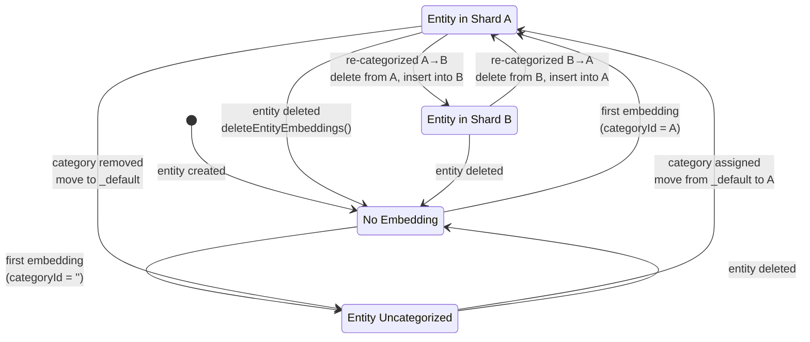

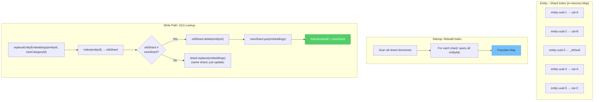

This can be handled transparently in `ShardedEmbeddingStore.replaceEntityEmbeddings()`:
- Before inserting into the target shard, scan all other shards for the entity and remove it
- Or maintain a lightweight `entityId → shardKey` index (in-memory map or small SQLite table)

**Recommended approach:** Maintain an in-memory `Map<String, String>` (`entityId → shardKey`)
rebuilt on startup from a scan of all shards. This avoids cross-shard queries on every write.

#### 2c. Category creation/deletion

- **New category:** No immediate action — shard created lazily on first embedding write
- **Category deletion:** Close and optionally delete the shard directory. Embeddings for entries
  in deleted categories can be moved to the `_default` shard or simply discarded (entries will be
  re-embedded if the category is restored)

### Phase 3: Relevance Cutoff Integration

**Goal:** Filter out "trash results" using the threshold from Phase 0.

#### 3a. Cutoff strategy options

| Strategy | Description | Pros | Cons |
|----------|-------------|------|------|
| **Fixed threshold** | Drop results with distance > T | Simple, predictable | Doesn't adapt to query quality |
| **Relative threshold** | Drop results > N× best distance | Adapts to query | Can be too aggressive for weak queries |
| **Adaptive** | Use fixed T, but if no results pass, relax to 2× best | Best of both | More complex |
| **Per-shard** | Apply cutoff independently per shard | Fair across categories | May drop entire categories |

**Recommended:** **Adaptive per-shard cutoff.**

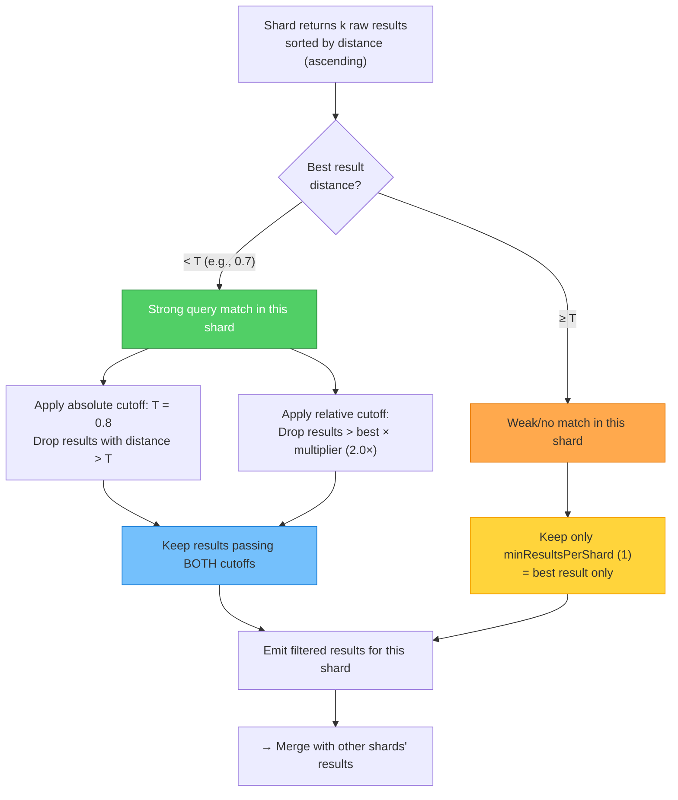

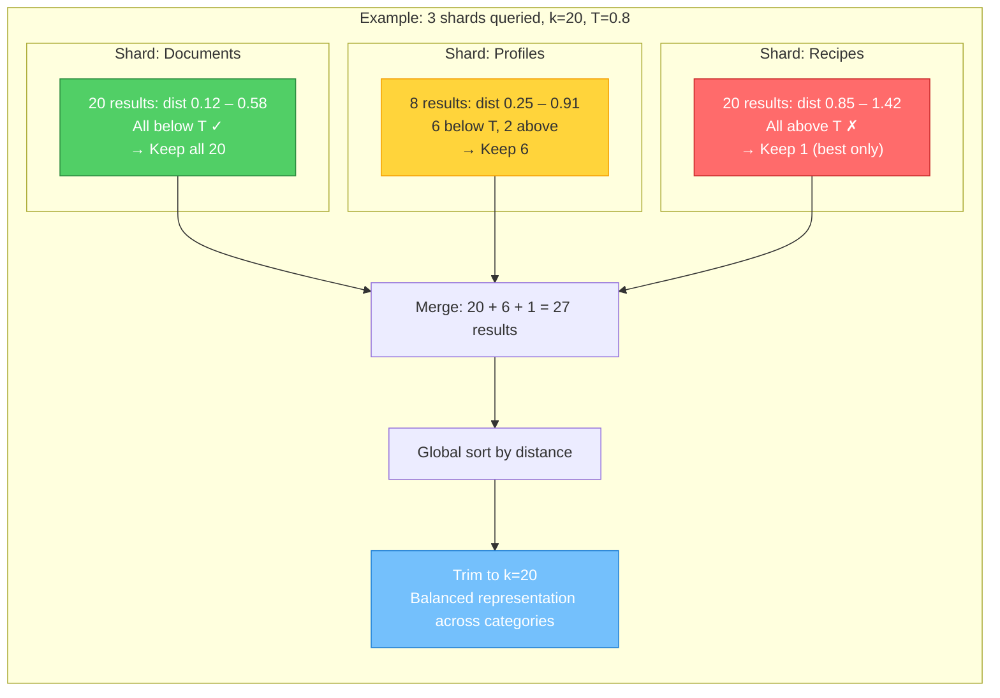

For each shard:
1. Fetch top k results
2. If best result distance < T (e.g., 0.7): keep results up to T
3. If best result distance >= T: keep only the best result (user likely has a weak query,
   but showing the single best match per category is still useful)

This prevents both trash flooding and empty-result scenarios.

#### 3b. Configuration

```dart
/// Distance cutoff configuration.
class DistanceCutoffConfig {
  const DistanceCutoffConfig({
    this.absoluteThreshold = 0.8,
    this.relativeMultiplier = 2.0,
    this.minResultsPerShard = 1,
  });

  /// Maximum cosine distance to accept.
  final double absoluteThreshold;

  /// Drop results > best_distance * relativeMultiplier.
  final double relativeMultiplier;

  /// Always keep at least this many results per shard
  /// (even if above threshold), to avoid empty shards.
  final int minResultsPerShard;
}
```

#### 3c. UI indicator

Add a visual relevance indicator to search results:
- Green dot: distance < 0.3 (strong match)
- Yellow dot: 0.3 ≤ distance < 0.6 (related)
- Orange dot: 0.6 ≤ distance < 0.8 (weak)
- Results above cutoff are not shown

### Phase 4: Backfill & Cleanup

**Goal:** Populate shards from existing data and remove legacy code.

1. **Backfill controller update**: `EmbeddingBackfillController.backfillCategories()` already
   iterates by category. With sharding, each category's embeddings naturally go to its own shard.
   No logic change needed — `ShardedEmbeddingStore` routes internally.

2. **Remove oversampling**: In `VectorSearchRepository._prepareSearch()`, change `k: k * 3` to
   just `k: k`. The fan-out architecture handles per-category coverage without oversampling.

3. **Remove category filter passthrough**: The `categoryIds` parameter in `EmbeddingStore.search()`
   is still used by `ShardedEmbeddingStore` to select *which shards to query*, but individual
   shards no longer need the `categoryIds` filter in their `nearestNeighborSearch()` call.

4. **Deprecate old store**: After successful migration on all devices, the old single-store
   directory can be cleaned up.

## Class Hierarchy & Dependency Graph

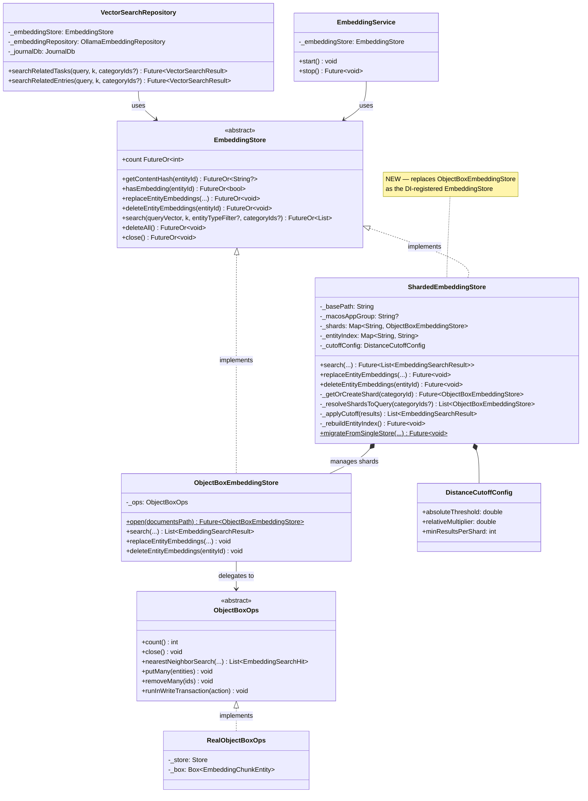

## Shard Lifecycle State Machine

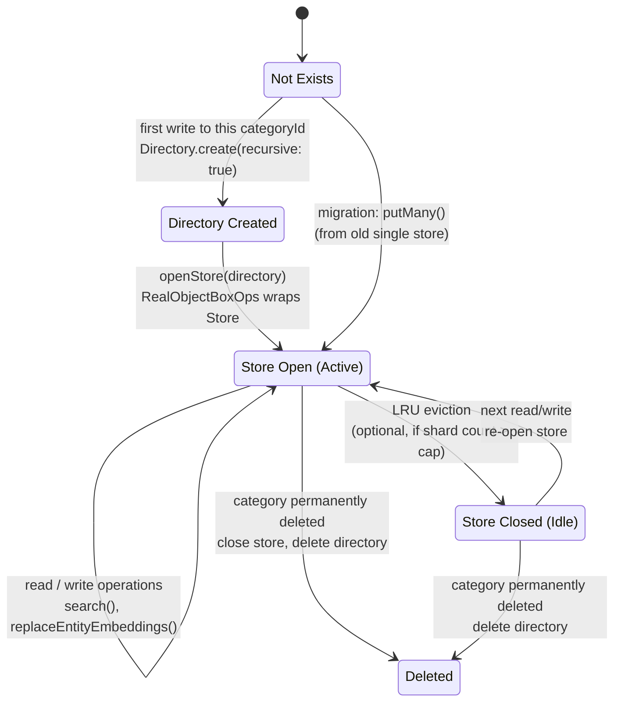

## File Change Summary

| File | Change |
|------|--------|
| `lib/features/ai/database/sharded_embedding_store.dart` | **New** — core sharding logic |
| `lib/features/ai/database/sharded_embedding_store_loader.dart` | **New** — production store opener with migration |
| `lib/features/ai/database/objectbox_embedding_store.dart` | Minor — remove category filter from search (shard is the filter) |
| `lib/features/ai/database/embedding_store.dart` | Add `distanceCutoff` config, add distance to results |
| `lib/features/ai/repository/vector_search_repository.dart` | Remove `k * 3` oversampling, leverage cutoff |
| `lib/get_it.dart` | Register `ShardedEmbeddingStore` instead of `ObjectBoxEmbeddingStore` |
| `lib/features/ai/service/embedding_service.dart` | No changes (routes through `EmbeddingStore` interface) |
| `lib/features/ai/service/embedding_processor.dart` | No changes (already passes `categoryId`) |
| `test/features/ai/database/sharded_embedding_store_test.dart` | **New** — comprehensive tests |
| `test/features/ai/repository/vector_search_repository_test.dart` | Update for new search behavior |

## Testing Strategy

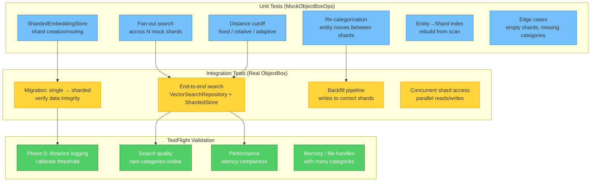

1. **Unit tests for `ShardedEmbeddingStore`:**
   - Create/open/close shards dynamically
   - Route writes to correct shard by `categoryId`
   - Fan-out search across multiple shards
   - Distance cutoff filtering (fixed, relative, adaptive)
   - Entity re-categorization (move between shards)
   - Empty shard handling
   - Default shard for uncategorized entries

2. **Integration tests:**
   - Migration from single store to sharded
   - End-to-end search through `VectorSearchRepository`
   - Backfill with sharded store

3. **Manual TestFlight validation:**
   - Phase 0: distance distribution logging
   - Verify search quality improvement with real data
   - Performance comparison (should be faster due to smaller indexes)

## Risks & Mitigations

| Risk | Mitigation |
|------|------------|
| Many open stores = file handle exhaustion | Cap at ~50 open shards; LRU eviction for idle shards |
| Migration data loss | Marker file prevents re-migration; old data preserved until explicit cleanup |
| macOS sandbox semaphore limits | All shards share same `macosApplicationGroup`; ObjectBox handles internally |
| Re-categorization race conditions | Shard write operations are transactional per-store; entity-level locking via embeddingKey uniqueness |
| ObjectBox model must match across all shards | All shards use same `EmbeddingChunkEntity` model — generated code is shared |

## Open Questions

1. **Shard granularity:** Should we shard by category only, or also by entity type? (Recommendation:
   category-only for now; entity type filtering within a shard is cheap with an indexed column.)

2. **Concurrent shard queries:** Should fan-out queries run in parallel (via `Future.wait`) or
   sequentially? Parallel is faster but uses more memory. (Recommendation: parallel — each HNSW
   query is fast and memory-mapped.)

3. **Shard cleanup policy:** When a category is deleted, should we immediately delete the shard
   directory or defer to a maintenance task? (Recommendation: defer — soft-delete categories can
   be restored.)

4. **Distance threshold tuning:** Should the cutoff be user-configurable (settings UI) or fixed
   in code? (Recommendation: start fixed in code, add settings UI later if needed.)
