# Sharded Vector Search with Relevance Cutoff

**Date:** 2026-03-07
**Status:** Draft — awaiting review before implementation
**Priority:** P1

## Problem Statement

The current single-database vector search architecture has two critical issues:

1. **Drowning problem**: When categories have vastly different sizes (e.g., "Documents" has 10,000
   entries, "Profiles" has 50), a query for entries across both categories returns results dominated
   by the larger category. The `k * 3` oversampling heuristic is insufficient — rare-category results
   are simply absent from the top-N HNSW neighbors.

2. **Trash results**: ObjectBox HNSW always returns the top N results regardless of actual relevance.
   A query about "Kubernetes deployment" against a "Recipes" category still returns 20 recipe entries
   with high cosine distances. There is no relevance cutoff.

## Current Architecture

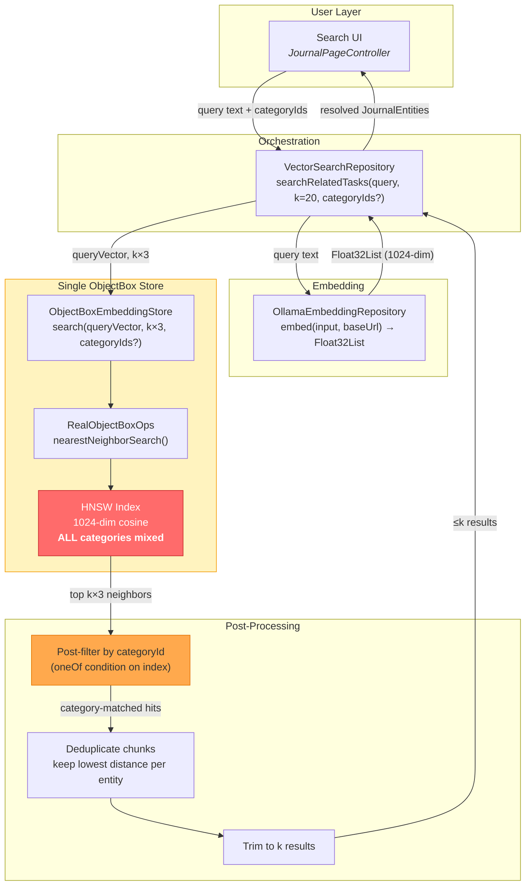

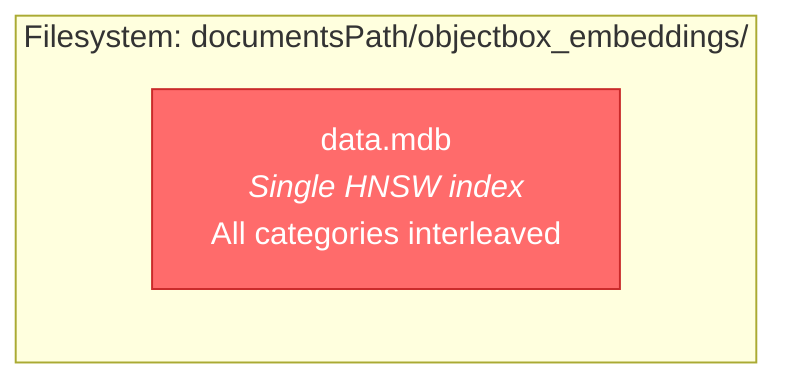

### The Drowning Problem (Visualized)

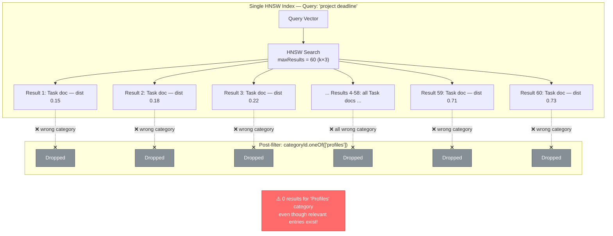

**Key files:**
- `lib/features/ai/database/embedding_store.dart` — abstract interface
- `lib/features/ai/database/objectbox_embedding_store.dart` — single-store implementation
- `lib/features/ai/database/objectbox_ops.dart` — ObjectBox operations abstraction
- `lib/features/ai/database/real_objectbox_ops.dart` — production ObjectBox ops
- `lib/features/ai/database/objectbox_embedding_entity.dart` — entity model
- `lib/features/ai/repository/vector_search_repository.dart` — search orchestration
- `lib/features/ai/service/embedding_service.dart` — background embedding pipeline
- `lib/features/ai/service/embedding_processor.dart` — per-entity processing
- `lib/get_it.dart` — DI registration (~line 399)

## Target Architecture

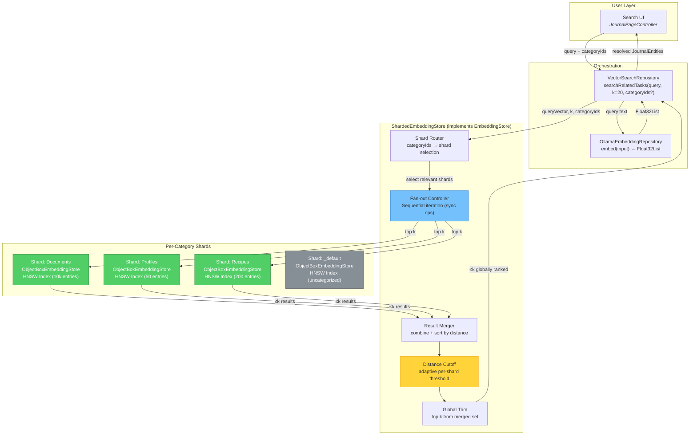

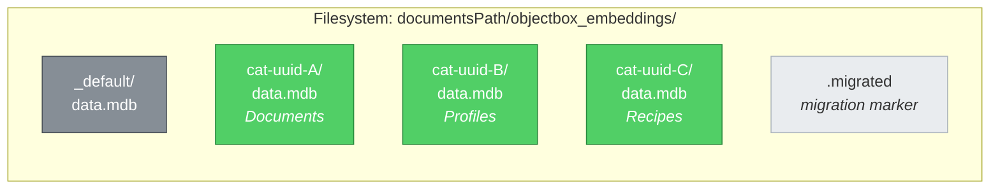

### Fan-Out Solves the Drowning Problem

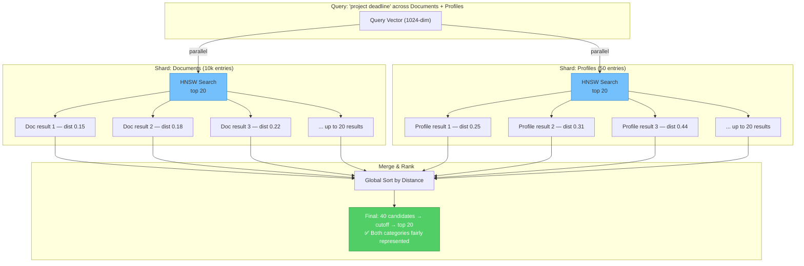

Each category gets its own ObjectBox store with its own HNSW index. This guarantees that searching
category B always returns the best matches *within* category B, regardless of how many entries exist
in category A.

## Technical Analysis

### ObjectBox Multi-Store Feasibility

ObjectBox supports multiple `Store` instances in the same process, each with its own directory. The
`openStore()` function accepts a `directory` parameter. On macOS sandboxed apps, each store needs the
same `macosApplicationGroup` identifier for POSIX semaphore coordination.

**Constraints:**
- Each store holds its own HNSW index — no cross-store queries possible (by design, this is what we want)
- File handles: each store uses ~3-5 file descriptors. With typical category counts (5-20), this is
  well within OS limits
- Memory: HNSW indexes are memory-mapped. Smaller per-shard indexes are more cache-friendly than one
  large index
- Store open/close: stores can be opened lazily and closed when idle. ObjectBox stores are
  thread-safe and designed for long-lived use

### Cosine Distance Score Ranges

ObjectBox HNSW with `VectorDistanceType.cosine` returns scores in range `[0.0, 2.0]`:
- **0.0**: identical vectors
- **1.0**: orthogonal (unrelated)
- **2.0**: diametrically opposite

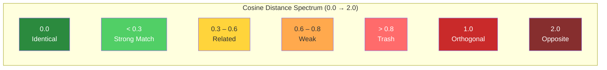

Empirical ranges for `mxbai-embed-large` (1024-dim):
- **< 0.3**: Strong semantic match (same topic, paraphrased)
- **0.3 - 0.6**: Related content (same domain, tangential)
- **0.6 - 0.8**: Weak relation (broad category overlap)
- **> 0.8**: Essentially unrelated ("trash results")

**Action required**: We need to validate these ranges empirically with real data from the app. See
Phase 1 below.

## Implementation Plan

### Phase Dependency Graph

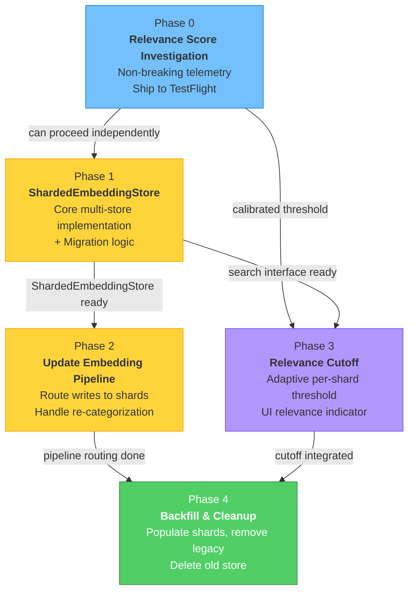

### Phase 0: Relevance Score Investigation (non-breaking)

**Goal:** Establish empirical distance thresholds before any architectural changes.

1. **Add distance logging to search results**
   - In `VectorSearchRepository._prepareSearch()`, log the distance distribution of returned results
     (min, max, median, count) using `DevLogger.info`
   - This runs on existing single-store architecture — zero risk

2. **Add distance field to VectorSearchResult**
   - Extend `VectorSearchResult` to carry `List<(JournalEntity, double distance)>` instead of
     just `List<JournalEntity>`
   - Display distance scores in the search results UI (debug overlay or dev mode only)

3. **Collect data from TestFlight**
   - Ship Phase 0 to TestFlight
   - Perform representative queries across different categories
   - Record distance distributions to calibrate the cutoff threshold

**Deliverable:** A validated distance threshold (expected: ~0.7-0.8 for cosine distance) and
a decision on whether to use a fixed cutoff or a relative one (e.g., "drop results > 2× the
best result's distance").

### Phase 1: ShardedEmbeddingStore (core implementation)

**Goal:** Implement the multi-store fan-out architecture behind the existing `EmbeddingStore`
interface.

#### 1a. New class: `ShardedEmbeddingStore`

```dart
/// Manages per-category ObjectBox stores and fans out queries.
class ShardedEmbeddingStore implements EmbeddingStore {
  ShardedEmbeddingStore({
    required String basePath,
    required String? macosApplicationGroup,
    this.distanceCutoff = 0.8,  // tunable, from Phase 0 findings
  });

  /// Category ID → open store. Lazily populated.
  final Map<String, ObjectBoxEmbeddingStore> _shards = {};

  /// The "default" shard for uncategorized entries (categoryId == '').
  static const _defaultShardKey = '_default';

  // --- EmbeddingStore interface ---

  @override
  Future<List<EmbeddingSearchResult>> search({
    required Float32List queryVector,
    int k = 10,
    String? entityTypeFilter,
    Set<String>? categoryIds,
  }) async {
    final shardsToQuery = await _resolveShardsToQuery(categoryIds);

    // Fan-out: query each shard for top k×N results.
    // Oversampling is still required WITHIN each shard because HNSW returns
    // chunks, not unique entities. A single long entity can produce multiple
    // chunks that dominate the top-k. VectorSearchRepository deduplicates
    // chunks → entities after this call, so we need headroom.
    //
    // When entityTypeFilter is set, the leaf store applies the filter AFTER
    // the HNSW query, which can discard a large fraction of results. We
    // increase the multiplier to k×3 to compensate for the post-HNSW
    // filtering. Without entityTypeFilter, k×2 suffices since category
    // filtering is no longer needed (the shard IS the category).
    final perShardLimit = entityTypeFilter != null ? k * 3 : k * 2;
    final allResults = <EmbeddingSearchResult>[];
    for (final shard in shardsToQuery) {
      final results = shard.search(
        queryVector: queryVector,
        k: perShardLimit,
        entityTypeFilter: entityTypeFilter,
        // No category filter needed — shard IS the category
      );
      allResults.addAll(results);
    }

    // Phase 1: simple global distance cutoff.
    // Phase 3 replaces this with adaptive per-shard cutoff (see §Phase 3).
    allResults.removeWhere((r) => r.distance > distanceCutoff);

    // Global ranking by distance
    allResults.sort((a, b) => a.distance.compareTo(b.distance));

    return allResults;  // caller trims to k after deduplication
  }

  @override
  Future<void> replaceEntityEmbeddings({...}) async {
    final shard = await _getOrCreateShard(categoryId);
    shard.replaceEntityEmbeddings(...);
  }
}
```

#### Fan-Out Search Sequence

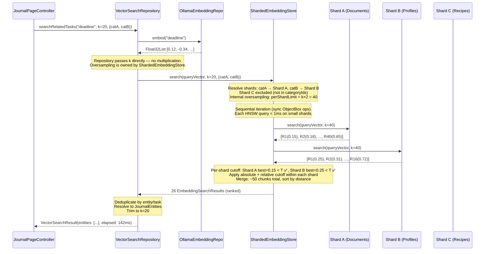

#### Embedding Write Routing

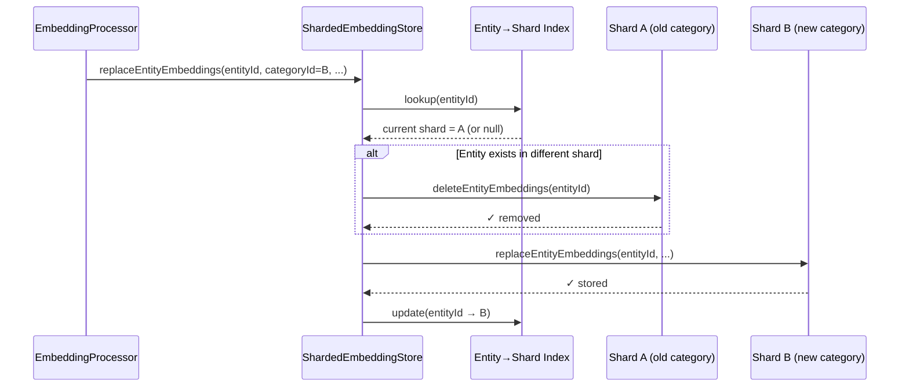

**Key design decisions:**
- `ShardedEmbeddingStore` implements `EmbeddingStore` — no changes needed upstream
- Each shard is a full `ObjectBoxEmbeddingStore` with its own `RealObjectBoxOps`
- Shards are created lazily on first write (dynamic sharding)
- Per-shard oversampling is still needed (see "Chunk deduplication" note below)
- Distance cutoff is applied *before* returning to `VectorSearchRepository`
- No category filter is passed to individual shards (the shard *is* the filter)

#### 1b. Shard lifecycle management

```dart
/// Opens or creates the shard for [categoryId].
///
/// PRECONDITION: [categoryId] must be a filesystem-safe string.
/// Category IDs in Lotti are v4 UUIDs (e.g., `a1b2c3d4-e5f6-...`),
/// which are safe for use as directory names on all platforms.
/// Empty IDs are mapped to [_defaultShardKey] (`_default`).
///
/// Used on the WRITE path only. Creates the directory if it doesn't exist.
Future<ObjectBoxEmbeddingStore> _getOrCreateShard(String categoryId) async {
  // categoryIds are UUIDs generated by the app (e.g., "a1b2c3d4-..."),
  // which are inherently filesystem-safe. The assert below is a safety net.
  final key = categoryId.isEmpty ? _defaultShardKey : categoryId;
  assert(
    !key.contains('/') && !key.contains('\\') && !key.contains('..'),
    'categoryId must be filesystem-safe: $key',
  );
  if (_shards.containsKey(key)) return _shards[key]!;

  final dir = p.join(_basePath, key);
  await Directory(dir).create(recursive: true);
  final store = await openStore(
    directory: dir,
    macosApplicationGroup: _macosApplicationGroup,
  );
  final shard = ObjectBoxEmbeddingStore(RealObjectBoxOps(store));
  _shards[key] = shard;
  return shard;
}

/// Opens an existing shard directory. Returns null if the directory doesn't
/// exist on disk (no embeddings for this category yet).
///
/// Used on the READ path to avoid creating empty shard directories for
/// categories that have no embeddings, deleted categories, or stale IDs.
Future<ObjectBoxEmbeddingStore?> _openExistingShard(String categoryId) async {
  final key = categoryId.isEmpty ? _defaultShardKey : categoryId;
  if (_shards.containsKey(key)) return _shards[key]!;

  final dir = Directory(p.join(_basePath, key));
  if (!dir.existsSync()) return null;  // No shard on disk → skip

  final store = await openStore(
    directory: dir.path,
    macosApplicationGroup: _macosApplicationGroup,
  );
  final shard = ObjectBoxEmbeddingStore(RealObjectBoxOps(store));
  _shards[key] = shard;
  return shard;
}

/// Determines which shards to query.
///
/// IMPORTANT: Uses _openExistingShard (not _getOrCreateShard) on the read
/// path to avoid creating empty shard directories for categories with no
/// embeddings, deleted categories, or stale IDs.
Future<List<ObjectBoxEmbeddingStore>> _resolveShardsToQuery(
  Set<String>? categoryIds,
) async {
  if (categoryIds == null || categoryIds.isEmpty) {
    // Query ALL known shards — discover from filesystem, not just _shards map
    await _ensureAllShardsOpen();
    return _shards.values.toList();
  }
  final shards = <ObjectBoxEmbeddingStore>[];
  for (final id in categoryIds) {
    final shard = await _openExistingShard(id);
    if (shard != null) shards.add(shard);
    // null means no shard directory on disk → category has no embeddings → skip
  }
  return shards;
}
```

**Cold shard resolution:** The original `_resolveShardsToQuery` only searched `_shards` (the
in-memory map of currently open stores). After an app restart, persisted shard directories would
be invisible to queries until some later write re-opened them.

The fix uses `_openExistingShard()` (not `_getOrCreateShard()`) on the **read path**. This
distinction is critical: `_getOrCreateShard()` creates directories that don't exist yet, which
would pollute the filesystem with empty shard stores for deleted categories, stale IDs, or
categories that simply have no embeddings. `_openExistingShard()` only opens directories that
already exist on disk.

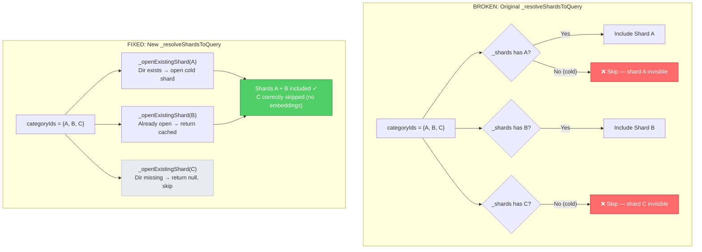

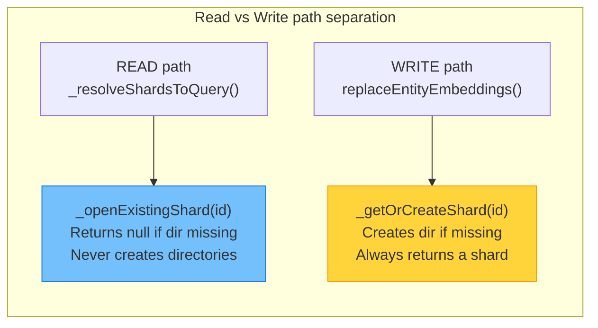

For the "query all shards" case (no category filter), `_ensureAllShardsOpen()` scans the
filesystem for shard directories and opens any that aren't already in `_shards`:

```dart
/// Discovers and opens all persisted shard directories.
///
/// Only opens directories that already exist — never creates new ones.
/// Directories are opened in **sorted order** (by basename) to ensure
/// deterministic index rebuild and conflict resolution behaviour.
Future<void> _ensureAllShardsOpen() async {
  final baseDir = Directory(_basePath);
  if (!baseDir.existsSync()) return;

  // Sort by directory name for deterministic scan order.
  final entries = await baseDir.list().toList();
  entries.sort((a, b) => p.basename(a.path).compareTo(p.basename(b.path)));

  for (final entry in entries) {
    if (entry is Directory) {
      final key = p.basename(entry.path);
      if (!_shards.containsKey(key)) {
        await _openExistingShard(key);
      }
    }
  }
}
```

#### 1c. Migration from single store

A one-time migration reads all entities from the old single store and distributes them to
per-category shards:

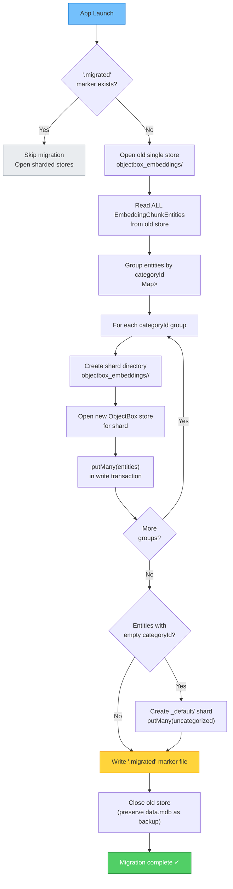

```dart
/// Migrates the monolithic ObjectBox store to per-category shards.
///
/// **Concurrency:** The caller must ensure [EmbeddingService] is stopped
/// before invoking this method. Migration reads all entities from the old
/// store and distributes them into shard directories. Concurrent writes
/// from the embedding service would race with this process (writes to the
/// old store after scanning would be missed; writes to the new sharded
/// store before migration completes could conflict).
///
/// The typical call site is app startup, before the embedding service is
/// started:
///   1. Call `migrateFromSingleStore(...)` — no-op if `.migrated` exists
///   2. Start `EmbeddingService`
///
/// The migration is **idempotent**: the `.migrated` marker is written only
/// after all shards have been populated. A crash mid-migration leaves no
/// marker, so the next startup re-runs the full migration safely (shard
/// writes use `putMany` which is insert-or-update).
static Future<void> migrateFromSingleStore({
  required String documentsPath,
  required String? macosApplicationGroup,
}) async {
  final oldDir = p.join(documentsPath, 'objectbox_embeddings');
  final markerFile = File(p.join(oldDir, '.migrated'));
  if (markerFile.existsSync()) return;  // already migrated

  // Concurrency: This runs at startup BEFORE EmbeddingService is registered
  // in GetIt, so no concurrent embedding writes can occur during migration.
  // The ShardedEmbeddingStore is only made available after migration completes.
  //
  // 1. Open old store, read all entities
  // 2. Group by categoryId
  // 3. For each group, open/create shard, putMany
  // 4. Write marker file (only after ALL shards are written)
  // 5. Close old store (optionally delete old data.mdb)
}
```

#### Startup Sequence (Critical Ordering)

The following steps must execute in order at app startup. Step 3 **must** complete
before step 5 — `replaceEntityEmbeddings()` depends on the in-memory indexes
populated by `_rebuildIndexes()`.

```
Step 1: migrateFromSingleStore()
        ├─ Checks .migrated marker — no-op if already migrated
        ├─ Opens old single store, reads all entities
        ├─ Groups by categoryId, writes to per-category shards via putMany
        └─ Writes .migrated marker after ALL shards are written

Step 2: Instantiate ShardedEmbeddingStore (constructor)
        └─ Calls _rebuildIndexes():
            ├─ _ensureAllShardsOpen() — scans shard directories (sorted
            │   by basename for determinism), opens each ObjectBox store
            └─ For each shard: _rebuildIndexForShard()
                ├─ queryAllEntityMetadata() per shard
                ├─ Populates _primaryIndex (entityId → shardKey)
                └─ Populates _reverseTaskIndex (taskId → {entityIds})
            └─ _cleanupInterruptedMoves() — resolves any duplicates
               left by crashes during cross-shard moves

Step 3: Register ShardedEmbeddingStore in GetIt as EmbeddingStore
        ├─ Now available for injection into VectorSearchRepository,
        │   EmbeddingProcessor, etc.

Step 4: Register EmbeddingService in GetIt and start background processing
        ├─ CRITICAL: Must happen AFTER step 3 — EmbeddingService calls
        │   replaceEntityEmbeddings() which needs the indexes from step 2
        └─ Background embedding pipeline can now safely write to shards
```

### Phase 2: Update Embedding Pipeline

**Goal:** Route new embeddings to the correct shard.

#### 2a. EmbeddingProcessor changes — content-hash vs. category-move conflict

**Problem:** `EmbeddingProcessor.processEntity()` (line 58-61) compares the SHA-256 content hash
and returns `false` early when the hash is unchanged. A pure category change (user moves entry from
category A to B without editing text) does NOT change the content hash. The processor returns early
before `replaceEntityEmbeddings()` is ever called, so the embedding stays in the old shard forever.
The same issue applies to `processAgentReport()` (line 138-140) for agent reports whose parent task
changes category.

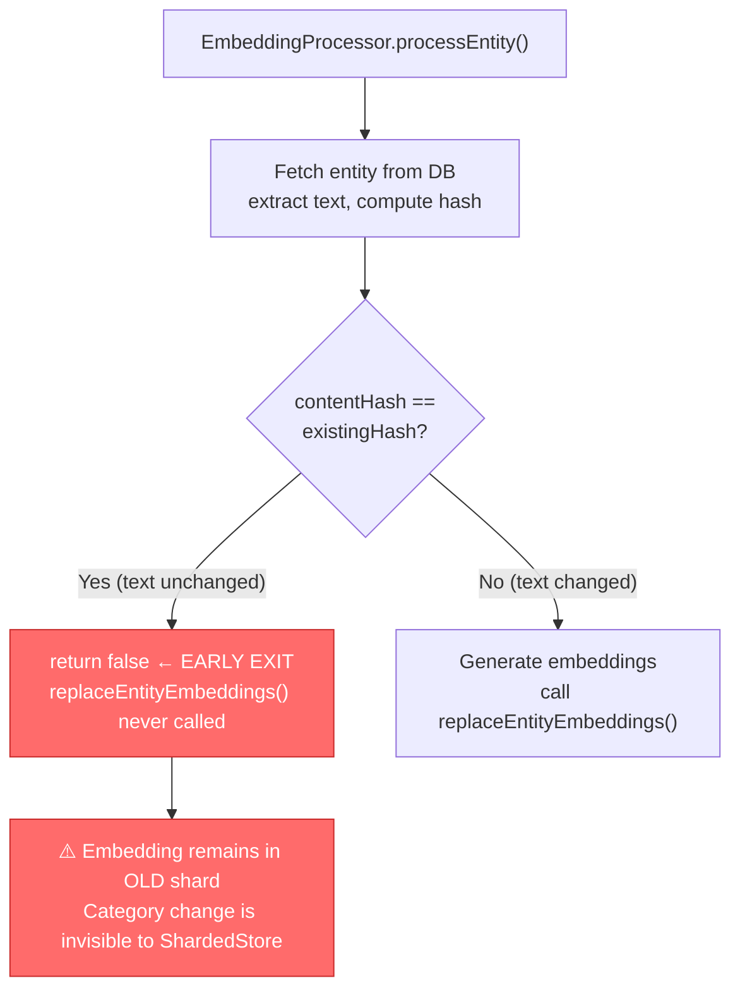

**Solution:** `EmbeddingProcessor` must also check whether the entity's current `categoryId`
matches the shard where the embedding is stored. This requires a new `EmbeddingStore` method.

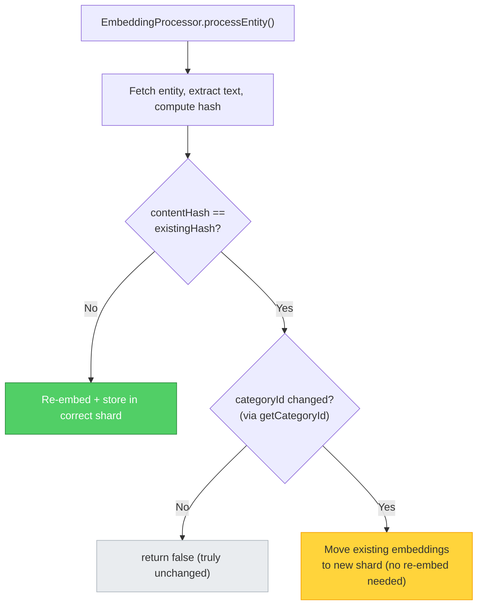

**Required changes:**
1. Add `FutureOr<String?> getCategoryId(String entityId)` to `EmbeddingStore` interface
2. Add `FutureOr<void> moveEntityToShard(String entityId, String newCategoryId)` to
   `EmbeddingStore` — copies embeddings from old shard to new without re-generating them
3. In `EmbeddingProcessor.processEntity()`, after the content-hash early return, check
   `embeddingStore.getCategoryId(entityId)` against `entity.meta.categoryId`. If different,
   call `embeddingStore.moveEntityToShard(entityId, newCategoryId)` and return `true`

#### 2a-extra. Agent-report embeddings and task re-categorization

**Problem:** `processAgentReport()` has the same content-hash early return, but the deeper issue is
that agent report embeddings have **no runtime trigger** for re-homing when a parent task changes
category. The live `EmbeddingService` (line 45-50) only listens for journal entity update tokens
(`textEntryNotification`, `taskNotification`, `audioNotification`, `aiResponseNotification`).
`processAgentReport()` is only called during:
- Report generation (`task_agent_workflow.dart:695`) — the report is new, so it writes to the
  correct shard at creation time
- Explicit backfill (`embedding_backfill_controller.dart:318`) — batch job, not real-time

A task re-categorization fires a `taskNotification`, which triggers `processEntity()` for the
**task itself**, but there is no corresponding notification for the task's agent reports. Those
report embeddings remain in the old shard indefinitely.

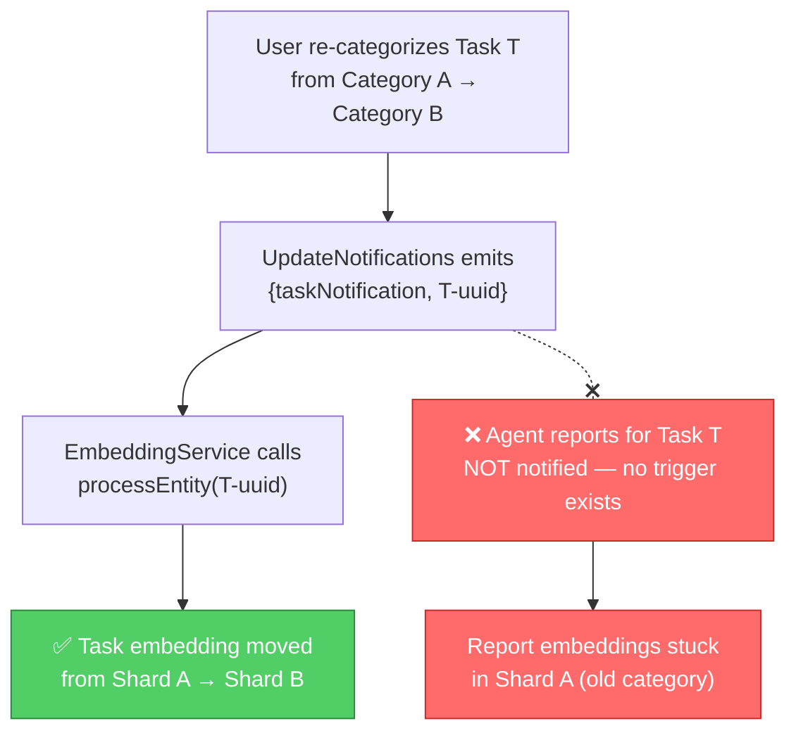

**Solution:** When `EmbeddingProcessor.processEntity()` detects a task's category changed, call
`moveEntityToShard()` for the task itself and `moveRelatedReportEmbeddings()` to cascade the
move to all agent reports linked to that task.

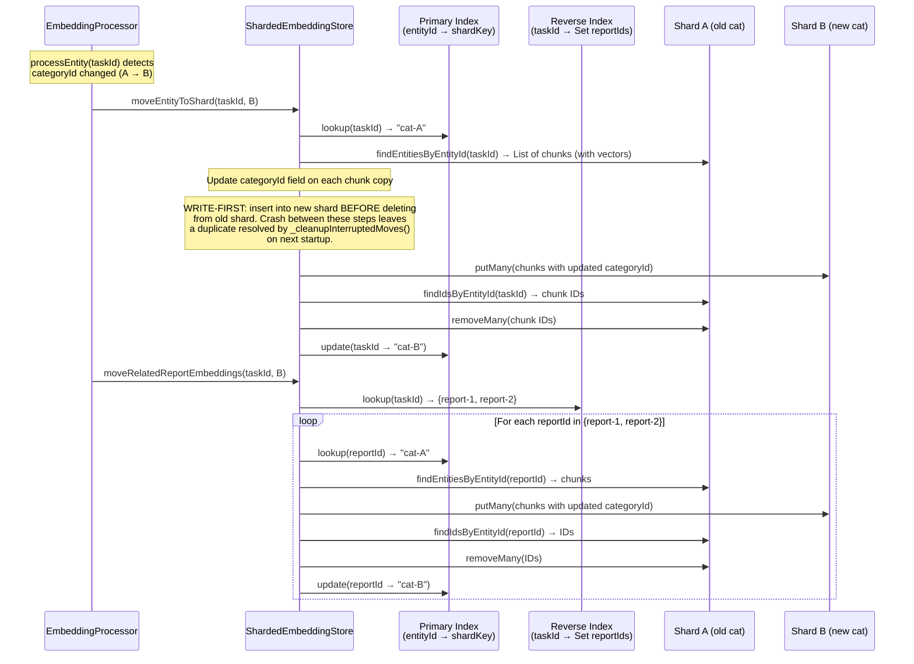

**Required changes (additional to the 3 above):**
4. Add `FutureOr<void> moveRelatedReportEmbeddings(String taskId, String newCategoryId)` to
   `EmbeddingStore` — uses the reverse task index to find all report entity IDs linked to the
   task, then calls `moveEntityToShard()` for each
5. In `EmbeddingProcessor.processEntity()`, when a task's category has changed, also call
   `embeddingStore.moveRelatedReportEmbeddings(entityId, newCategoryId)` to cascade the move
   to all agent reports linked to that task
6. Add new `ObjectBoxOps` methods (see "New ObjectBoxOps APIs" below)
7. `ShardedEmbeddingStore` maintains a `Map<String, Set<String>>` reverse index (`taskId →
   reportEntityIds`), rebuilt on startup alongside the primary index. Updated incrementally on
   every write/delete. `moveRelatedReportEmbeddings()` is a simple lookup + loop, no scanning

#### New ObjectBoxOps APIs

The shard-move flow requires loading all chunks for a given entity to copy them between shards.
The current `ObjectBoxOps` only exposes `findIdsByEntityId()` (returns ObjectBox IDs, not full
objects) and `findFirstByEntityId()` (returns one chunk, not all). Neither is sufficient for a
lossless move.

The startup index rebuild needs entityId/taskId metadata from every row, but must NOT load the
1024-dim float vectors into memory. `_box.getAll()` would deserialize the full `Float32List`
embedding for every row — on a corpus of 10k entries with 3 chunks each, that's 30k × 4KB =
~120MB loaded just to read a few string fields.

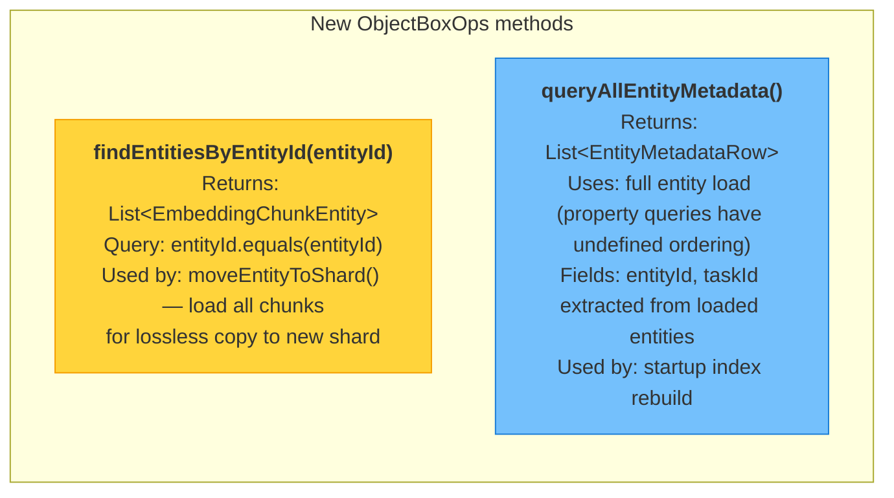

```dart
/// In ObjectBoxOps (abstract):

/// Returns all chunks for a given entity, including embedding vectors.
/// Used for lossless shard-to-shard moves.
List<EmbeddingChunkEntity> findEntitiesByEntityId(String entityId);

/// Returns lightweight metadata (entityId + taskId) for every row,
/// WITHOUT loading the 1024-dim embedding vectors.
/// Used for startup index rebuild.
List<EntityMetadataRow> queryAllEntityMetadata();


/// In RealObjectBoxOps:

@override
List<EmbeddingChunkEntity> findEntitiesByEntityId(String entityId) {
  final query = _box
      .query(EmbeddingChunkEntity_.entityId.equals(entityId))
      .build();
  try {
    return query.find();
  } finally {
    query.close();
  }
}

@override
List<EntityMetadataRow> queryAllEntityMetadata() {
  // We need entityId and taskId paired per row. ObjectBox property queries
  // return arrays in undefined order, so two separate property queries
  // cannot be zipped by index. Instead, load full entities and extract
  // only the fields we need, letting the entity list get GC'd promptly.
  final query = _box.query().build();
  try {
    final entities = query.find();
    return [
      for (final e in entities)
        EntityMetadataRow(entityId: e.entityId, taskId: e.taskId),
    ];
  } finally {
    query.close();
  }
}

/// Lightweight row for index rebuild — no embedding vector.
class EntityMetadataRow {
  const EntityMetadataRow({required this.entityId, required this.taskId});
  final String entityId;
  final String taskId;
}
```

**Why full-entity load?** ObjectBox property queries (`query.property(field).find()`)
return result arrays in **undefined order**
([ObjectBox docs](https://docs.objectbox.io/queries#query-a-single-property)), so two
independent property queries cannot be zipped by index to reconstruct rows. We therefore
use `query.find()` which loads full entities including the 4KB embedding vectors. This
causes a transient memory spike at startup (~120MB for 30k rows), but:

- It runs **once** at startup, per shard (shards are smaller than the monolithic store)
- The entity list is immediately discarded after extracting the two string fields
- Dart's GC reclaims the memory promptly

If profiling shows this spike is problematic, a future optimisation could batch the load
(e.g., paginated queries using `query.offset` / `query.limit`) to cap peak memory.

#### 2b. Category changes (re-categorization)

When a user moves an entry from category A to category B:
1. Delete embeddings from shard A: `shardA.deleteEntityEmbeddings(entityId)`
2. Re-insert into shard B: `shardB.replaceEntityEmbeddings(...)`

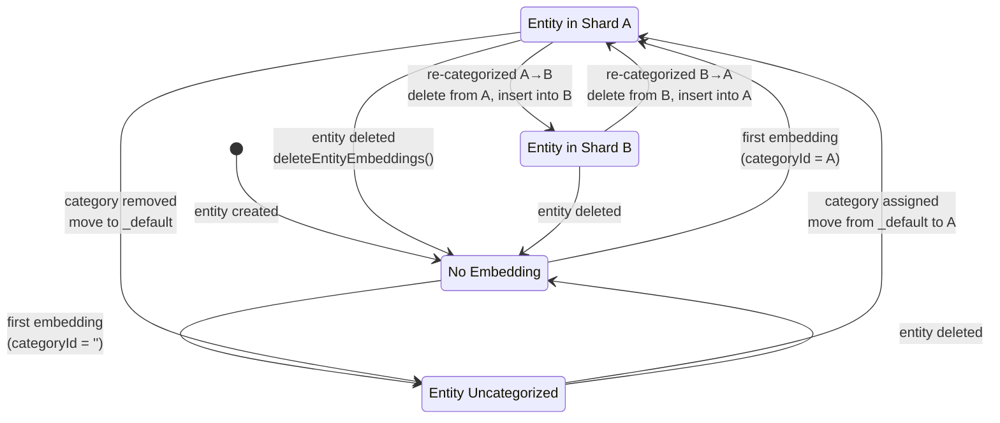

```mermaid
graph TD
    subgraph "In-Memory Indexes (rebuilt on startup)"
        direction TB

        subgraph "Primary: entityId → shardKey"
            E1["entity-uuid-1 → cat-A"]
            E2["entity-uuid-2 → cat-B"]
            E3["report-uuid-1 → cat-A"]
            E4["report-uuid-2 → cat-A"]
            E5["entity-uuid-5 → cat-C"]
        end

        subgraph "Reverse: taskId → Set of reportIds"
            T1["task-uuid-1 → {report-uuid-1, report-uuid-2}"]
            T2["task-uuid-3 → {report-uuid-5}"]
        end
    end

    subgraph "Startup: Rebuild Both Indexes (metadata-only)"
        SCAN["Scan all shard directories"]
        SCAN --> ITER["For each shard:<br/>queryAllEntityMetadata()<br/>(full entity load — extracts metadata only)"]
        ITER --> BUILD1["Populate Map entityId → shardKey"]
        ITER --> BUILD2["For rows with non-empty taskId:<br/>Populate Map taskId → Set of entityIds"]
        ITER --> NOTE["Transient memory spike per shard<br/>(entities GC'd after metadata extraction)"]
    end

    subgraph "Write Path: O(1) Lookup"
        WRITE["replaceEntityEmbeddings(entityId, newCategoryId)"]
        WRITE --> LOOKUP["primaryIndex[entityId] → oldShard"]
        LOOKUP --> DIFF{"oldShard ≠<br/>newShard?"}
        DIFF -->|"Yes"| DELETE["oldShard.delete(entityId)"]
        DELETE --> INSERT["newShard.put(embeddings)"]
        INSERT --> UPDATE["primaryIndex[entityId] = newShard"]
        DIFF -->|"No"| REPLACE["shard.replace(embeddings)<br/>(same shard, just update)"]
    end

    subgraph "Report Cascade: moveRelatedReportEmbeddings(taskId, newCat)"
        CASCADE["reverseIndex[taskId] → {reportId1, reportId2}"]
        CASCADE --> MOVE1["For each reportId:<br/>moveEntityToShard(reportId, newCat)"]
        MOVE1 --> UPD1["Update primaryIndex entries"]
    end

    style BUILD1 fill:#74c0fc,stroke:#1c7ed6
    style BUILD2 fill:#74c0fc,stroke:#1c7ed6
    style UPDATE fill:#51cf66,stroke:#2b8a3e,color:#fff
    style CASCADE fill:#b197fc,stroke:#7950f2
```

This can be handled transparently in `ShardedEmbeddingStore.replaceEntityEmbeddings()`:
- Before inserting into the target shard, look up the entity in the primary index to find its
  current shard, delete from old shard if different, insert into new shard

**Recommended approach:** Maintain **two** in-memory indexes, both rebuilt on startup from a scan
of all shards:

1. **Primary index:** `Map<String, String>` (`entityId → shardKey`) — used for O(1) shard
   lookup on every write and for `moveEntityToShard()`
2. **Reverse task index:** `Map<String, Set<String>>` (`taskId → Set<reportEntityId>`) — built
   from entities where `taskId` is non-empty (i.e., agent report embeddings). Used exclusively
   by `moveRelatedReportEmbeddings()` to find all report embeddings linked to a given task

Both indexes are maintained incrementally on writes (insert/update/delete update both maps) and
fully rebuilt only on startup using `queryAllEntityMetadata()` (see "New ObjectBoxOps APIs"
above). This loads full entities to extract `entityId` and `taskId` fields, since ObjectBox
property queries return arrays in undefined order and cannot be zipped across columns. The
entity list is discarded immediately after extraction. Per-shard loading limits the transient
memory spike (each shard is a fraction of the monolithic store).

```dart
/// Startup index rebuild — called once per shard.
///
/// Populates _primaryIndex and _reverseTaskIndex from on-disk metadata.
/// Also detects entities present in multiple shards (interrupted moves)
/// by recording conflicts for later cleanup.
Future<void> _rebuildIndexForShard(
  String shardKey,
  ObjectBoxOps ops,
  Map<String, List<String>> conflicts,
) async {
  final rows = ops.queryAllEntityMetadata();
  for (final row in rows) {
    final existing = _primaryIndex[row.entityId];
    if (existing != null && existing != shardKey) {
      // Entity exists in two shards — record for cleanup
      (conflicts[row.entityId] ??= [existing]).add(shardKey);
    }
    _primaryIndex[row.entityId] = shardKey;
    if (row.taskId.isNotEmpty) {
      (_reverseTaskIndex[row.taskId] ??= <String>{}).add(row.entityId);
    }
  }
}
```

#### Interrupted-move cleanup

A crash between "write to new shard" and "delete from old shard" leaves an entity in two shards.
On startup, `_rebuildIndexes()` detects these conflicts and `_cleanupInterruptedMoves()` resolves
them deterministically:

```dart
/// Called after all shards have been scanned during _rebuildIndexes().
///
/// For each entity found in multiple shards, keeps only the copy in the
/// shard that matches the entity's stored categoryId (the *destination*
/// of the interrupted move). Removes the stale copy from the other shard.
///
/// IMPORTANT: Shard scanning order must be deterministic (sorted by key)
/// to ensure consistent fallback behaviour across restarts. See
/// `_ensureAllShardsOpen()`.
Future<void> _cleanupInterruptedMoves(
  Map<String, List<String>> conflicts,
) async {
  for (final entry in conflicts.entries) {
    final entityId = entry.key;
    final shardKeys = entry.value;

    // Determine the correct shard: the entity's categoryId field is updated
    // *before* putMany on the destination, so the copy with the correct
    // categoryId is the authoritative one.
    String? correctShard;
    for (final key in shardKeys) {
      final shard = _shards[key];
      if (shard == null) continue;
      final catId = await shard.getCategoryId(entityId);
      if (catId != null && _shardKeyForCategory(catId) == key) {
        correctShard = key;
        break;
      }
    }

    if (correctShard == null) {
      // Neither copy has a matching categoryId — should not happen in
      // practice. Log a warning and keep the copy in the alphabetically
      // first shard key for deterministic resolution.
      final sorted = shardKeys.toList()..sort();
      correctShard = sorted.first;
      // TODO: Add logging — this case indicates unexpected state.
    }

    // Remove stale copies from all other shards
    for (final key in shardKeys) {
      if (key == correctShard) continue;
      final staleShard = _shards[key];
      if (staleShard != null) {
        await staleShard.deleteEntityEmbeddings(entityId);
      }
    }
    _primaryIndex[entityId] = correctShard;
  }
}
```

This cleanup is **idempotent** — running it multiple times converges to the same state. The cost
is proportional to the number of conflicts (typically zero under normal operation), not the total
number of embeddings.

#### 2c. Category creation/deletion

- **New category:** No immediate action — shard created lazily on first embedding write
- **Category deletion:** Close and optionally delete the shard directory. Embeddings for entries
  in deleted categories can be moved to the `_default` shard or simply discarded (entries will be
  re-embedded if the category is restored)

### Phase 3: Relevance Cutoff Integration

**Goal:** Filter out "trash results" using the threshold from Phase 0.

#### 3a. Cutoff strategy options

| Strategy | Description | Pros | Cons |
|----------|-------------|------|------|
| **Fixed threshold** | Drop results with distance > T | Simple, predictable | Doesn't adapt to query quality |
| **Relative threshold** | Drop results > N× best distance | Adapts to query | Can be too aggressive for weak queries |
| **Adaptive** | Use fixed T, but if no results pass, relax to 2× best | Best of both | More complex |
| **Per-shard** | Apply cutoff independently per shard | Fair across categories | May drop entire categories |

**Recommended:** **Adaptive per-shard cutoff.**

```mermaid
flowchart TD
    START["Shard returns k×2 raw results<br/>sorted by distance (ascending)"]

    START --> BEST{"Best result<br/>distance?"}

    BEST -->|"< T (e.g., 0.8)"| GOOD["Strong query match in this shard"]
    BEST -->|"≥ T"| WEAK["No relevant match in this shard"]

    GOOD --> APPLY_ABS["Apply absolute cutoff: T = 0.8<br/>Drop results with distance > T"]
    GOOD --> APPLY_REL["Apply relative cutoff:<br/>Drop results > best × multiplier (2.0×)"]
    APPLY_ABS --> INTERSECT["Keep results passing BOTH cutoffs"]
    APPLY_REL --> INTERSECT

    WEAK --> DROP_ALL["Drop entire shard<br/>0 results emitted"]

    INTERSECT --> EMIT["Emit filtered results for this shard"]

    EMIT --> MERGE["→ Merge with other shards' results"]
    DROP_ALL --> MERGE

    style GOOD fill:#51cf66,stroke:#2b8a3e,color:#fff
    style WEAK fill:#ff6b6b,stroke:#c92a2a,color:#fff
    style DROP_ALL fill:#ff6b6b,stroke:#c92a2a,color:#fff
    style INTERSECT fill:#74c0fc,stroke:#1c7ed6
```

```mermaid
graph TD
    subgraph "Example: 3 shards queried, k=20, T=0.8"
        direction TB

        subgraph "Shard: Documents"
            DA["40 raw chunks: dist 0.12 – 0.58<br/>All below T ✓<br/>→ Keep all 40 (dedupe later)"]
        end

        subgraph "Shard: Profiles"
            DB["16 raw chunks: dist 0.25 – 0.91<br/>12 below T, 4 above<br/>→ Keep 12"]
        end

        subgraph "Shard: Recipes"
            DC["40 raw chunks: dist 0.85 – 1.42<br/>Best (0.85) ≥ T ✗<br/>→ Drop entire shard (0 results)"]
        end

        DA --> MERGE["Merge: 40 + 12 + 0 = 52 chunks"]
        DB --> MERGE
        DC -.->|"dropped"| MERGE
        MERGE --> SORT["Global sort by distance"]
        SORT --> DEDUP["VectorSearchRepo deduplicates<br/>chunks → unique entities"]
        DEDUP --> FINAL["Trim to k=20 unique entities<br/>All relevant, no trash"]
    end

    style DA fill:#51cf66,stroke:#2b8a3e,color:#fff
    style DB fill:#ffd43b,stroke:#f59f00
    style DC fill:#ff6b6b,stroke:#c92a2a,color:#fff
    style FINAL fill:#74c0fc,stroke:#1c7ed6,color:#fff
```

For each shard:
1. Fetch top k×2 raw results (oversampling for chunk deduplication)
2. If best result distance ≥ T (e.g., 0.8): **drop the entire shard** (no results)
3. If best result distance < T (strong match): apply **both** cutoffs —
   - **Absolute cutoff:** drop results with distance > T
   - **Relative cutoff:** drop results with distance > best × multiplier (e.g., 2.0×)
   - Keep only results passing **both** filters (intersection)

**Why not "keep the best result per weak shard"?** The original plan proposed keeping
`minResultsPerShard = 1` even for shards where the best result exceeds the threshold. This
sounds reasonable for 2-3 shards, but breaks down for broad "all categories" queries across
many irrelevant shards. With 15 categories and a query relevant to only 2, the remaining 13
shards each contribute one trash result, potentially filling the final top-k with irrelevant
items.

```mermaid
graph TD
    subgraph "Problem: minResultsPerShard=1 with many shards"
        direction TB
        Q["Query: 'kubernetes deployment'<br/>15 categories queried"]

        Q --> S1["Shard: DevOps<br/>best dist = 0.12 ✅"]
        Q --> S2["Shard: Cloud<br/>best dist = 0.18 ✅"]
        Q --> S3["Shard: Recipes<br/>best dist = 0.92 → keep 1 🗑️"]
        Q --> S4["Shard: Fitness<br/>best dist = 0.88 → keep 1 🗑️"]
        Q --> SN["... 11 more irrelevant shards<br/>each keeps 1 trash result"]

        S1 --> MERGE["Top 20: 2 good + 13 trash<br/>= 65% irrelevant results ⚠️"]
        S2 --> MERGE
        S3 --> MERGE
        S4 --> MERGE
        SN --> MERGE
    end

    style MERGE fill:#ff6b6b,stroke:#c92a2a,color:#fff
    style S3 fill:#868e96,stroke:#495057,color:#fff
    style S4 fill:#868e96,stroke:#495057,color:#fff
    style SN fill:#868e96,stroke:#495057,color:#fff
```

```mermaid
graph TD
    subgraph "Solution: drop entire weak shard"
        direction TB
        Q2["Query: 'kubernetes deployment'<br/>15 categories queried"]

        Q2 --> T1["Shard: DevOps<br/>best dist = 0.12 ✅ → keep 18"]
        Q2 --> T2["Shard: Cloud<br/>best dist = 0.18 ✅ → keep 15"]
        Q2 --> T3["Shard: Recipes<br/>best dist = 0.92 → ❌ drop all"]
        Q2 --> TN["... 12 more irrelevant shards<br/>❌ all dropped"]

        T1 --> MERGE2["Top 20: all relevant ✅"]
        T2 --> MERGE2

        style MERGE2 fill:#51cf66,stroke:#2b8a3e,color:#fff
        style T3 fill:#868e96,stroke:#495057,color:#fff
        style TN fill:#868e96,stroke:#495057,color:#fff
    end
```

If the user's query has zero good matches in *any* shard (all best distances >= T),
the search correctly returns an empty result set. This is the right behavior — "no
semantic matches found" is more useful than showing irrelevant content.

#### 3b. Configuration

```dart
/// Distance cutoff configuration.
class DistanceCutoffConfig {
  const DistanceCutoffConfig({
    this.absoluteThreshold = 0.8,
    this.relativeMultiplier = 2.0,
  });

  /// Maximum cosine distance to accept. Results above this are dropped.
  /// Shards whose best result exceeds this are dropped entirely.
  final double absoluteThreshold;

  /// Within a passing shard, also drop results > best_distance × multiplier.
  /// This prevents a shard with one great match and many mediocre ones from
  /// flooding the merged result set.
  final double relativeMultiplier;
}
```

#### 3c. UI indicator

Add a visual relevance indicator to search results:
- Green dot: distance < 0.3 (strong match)
- Yellow dot: 0.3 ≤ distance < 0.6 (related)
- Orange dot: 0.6 ≤ distance < 0.8 (weak)
- Results above cutoff are not shown

### Phase 4: Backfill & Cleanup

**Goal:** Populate shards from existing data and remove legacy code.

1. **Backfill controller update**: `EmbeddingBackfillController.backfillCategories()` already
   iterates by category. With sharding, each category's embeddings naturally go to its own shard.
   No logic change needed — `ShardedEmbeddingStore` routes internally.

2. **Consolidate oversampling to a single layer**: Currently, oversampling happens in three
   places — this must be reduced to one. The single oversampling layer lives in
   `ShardedEmbeddingStore.search()` (expands `k` to `k × 2` per shard for chunk deduplication).

   **Changes required at each layer:**

   | Layer | Current | After |
   |-------|---------|-------|
   | `VectorSearchRepository._prepareSearch()` | `k: k * 3` | `k: k` (pass through, no multiplication) |
   | `ShardedEmbeddingStore.search()` | N/A (new) | `perShardLimit = k * 3` when `entityTypeFilter` set, `k * 2` otherwise (owns oversampling) |
   | `ObjectBoxEmbeddingStore.search()` | `hasFilter ? k * 3 : k` | Always use `k` as-is (no internal multiplication) |

   The existing `ObjectBoxEmbeddingStore.search()` (line 140-142) internally multiplies `k` by 3
   when `entityTypeFilter` or `categoryIds` are non-null. With sharding, category filtering is
   eliminated (the shard *is* the category), but `entityTypeFilter` may still be passed through.
   This internal multiplication must be removed — the leaf store must treat `k` as the literal
   limit. `ShardedEmbeddingStore` already passes the oversampled value (`k × 2`), and adding
   another `× 3` at the leaf would compound to `k × 6`.

   ```
   Oversampling ownership (single layer):
   ┌─────────────────────────┐
   │ VectorSearchRepository  │  passes k directly (no multiplication)
   │ _prepareSearch(k=20)    │──→ embeddingStore.search(k=20)
   └─────────────────────────┘
                                   │
                                   ▼
   ┌─────────────────────────┐
   │ ShardedEmbeddingStore   │  expands to k×2=40 (or k×3=60 with entityTypeFilter)
   │ search(k=20)            │──→ each shard.search(k=40 or 60)
   └─────────────────────────┘
                                   │
                                   ▼
   ┌─────────────────────────┐
   │ ObjectBoxEmbeddingStore │  uses k=40 literally (no multiplication)
   │ search(k=40)            │──→ nearestNeighborSearch(maxResults=40)
   └─────────────────────────┘
   ```

3. **Remove category filter passthrough**: The `categoryIds` parameter in `EmbeddingStore.search()`
   is still used by `ShardedEmbeddingStore` to select *which shards to query*, but individual
   shards no longer need the `categoryIds` filter in their `nearestNeighborSearch()` call.

4. **Deprecate old store**: After successful migration on all devices, the old single-store
   directory can be cleaned up.

## Class Hierarchy & Dependency Graph

```mermaid
classDiagram
    class EmbeddingStore {
        <<abstract>>
        +getContentHash(entityId) FutureOr~String?~
        +getCategoryId(entityId) FutureOr~String?~
        +hasEmbedding(entityId) FutureOr~bool~
        +count FutureOr~int~
        +replaceEntityEmbeddings(...) FutureOr~void~
        +deleteEntityEmbeddings(entityId) FutureOr~void~
        +moveEntityToShard(entityId, newCategoryId) FutureOr~void~
        +moveRelatedReportEmbeddings(taskId, newCategoryId) FutureOr~void~
        +search(queryVector, k, entityTypeFilter?, categoryIds?) FutureOr~List~
        +deleteAll() FutureOr~void~
        +close() FutureOr~void~
    }

    class ShardedEmbeddingStore {
        -_basePath: String
        -_macosAppGroup: String?
        -_shards: Map~String, ObjectBoxEmbeddingStore~
        -_primaryIndex: Map~String, String~
        -_reverseTaskIndex: Map~String, Set~String~~
        -_cutoffConfig: DistanceCutoffConfig
        +search(...) Future~List~EmbeddingSearchResult~~
        +replaceEntityEmbeddings(...) Future~void~
        +deleteEntityEmbeddings(entityId) Future~void~
        +getCategoryId(entityId) String?
        +moveEntityToShard(entityId, newCategoryId) void
        +moveRelatedReportEmbeddings(taskId, newCategoryId) void
        -_getOrCreateShard(categoryId) Future~ObjectBoxEmbeddingStore~
        -_openExistingShard(categoryId) Future~ObjectBoxEmbeddingStore?~
        -_resolveShardsToQuery(categoryIds?) Future~List~ObjectBoxEmbeddingStore~~
        -_ensureAllShardsOpen() Future~void~
        -_applyCutoff(results) List~EmbeddingSearchResult~
        -_rebuildIndexes() Future~void~
        -_cleanupInterruptedMoves() Future~void~
        +migrateFromSingleStore(...)$ Future~void~
    }

    class ObjectBoxEmbeddingStore {
        -_ops: ObjectBoxOps
        +open(documentsPath)$ Future~ObjectBoxEmbeddingStore~
        +search(...) List~EmbeddingSearchResult~
        +replaceEntityEmbeddings(...) void
        +deleteEntityEmbeddings(entityId) void
    }

    class ObjectBoxOps {
        <<abstract>>
        +count() int
        +close() void
        +nearestNeighborSearch(...) List~EmbeddingSearchHit~
        +findEntitiesByEntityId(entityId) List~EmbeddingChunkEntity~
        +queryAllEntityMetadata() List~EntityMetadataRow~
        +putMany(entities) void
        +removeMany(ids) void
        +runInWriteTransaction(action) void
    }

    class RealObjectBoxOps {
        -_store: Store
        -_box: Box~EmbeddingChunkEntity~
    }

    class DistanceCutoffConfig {
        +absoluteThreshold: double
        +relativeMultiplier: double
    }

    class VectorSearchRepository {
        -_embeddingStore: EmbeddingStore
        -_embeddingRepository: OllamaEmbeddingRepository
        -_journalDb: JournalDb
        +searchRelatedTasks(query, k, categoryIds?) Future~VectorSearchResult~
        +searchRelatedEntries(query, k, categoryIds?) Future~VectorSearchResult~
    }

    class EmbeddingService {
        -_embeddingStore: EmbeddingStore
        +start() void
        +stop() Future~void~
    }

    EmbeddingStore <|.. ShardedEmbeddingStore : implements
    EmbeddingStore <|.. ObjectBoxEmbeddingStore : implements
    ShardedEmbeddingStore *-- "0..*" ObjectBoxEmbeddingStore : manages shards
    ShardedEmbeddingStore *-- DistanceCutoffConfig
    ObjectBoxEmbeddingStore --> ObjectBoxOps : delegates to
    ObjectBoxOps <|.. RealObjectBoxOps : implements
    VectorSearchRepository --> EmbeddingStore : uses
    EmbeddingService --> EmbeddingStore : uses

    note for ShardedEmbeddingStore "NEW — replaces ObjectBoxEmbeddingStore<br/>as the DI-registered EmbeddingStore"
```

## Shard Lifecycle State Machine

```mermaid
stateDiagram-v2
    state "Not Exists" as NE
    state "Directory Created" as DC
    state "Store Open (Active)" as OPEN
    state "Persisted (Cold)" as COLD
    state "Deleted" as DEL

    [*] --> NE

    NE --> DC: first write to this categoryId<br/>Directory.create(recursive: true)
    DC --> OPEN: openStore(directory)<br/>RealObjectBoxOps wraps Store

    OPEN --> OPEN: read / write operations<br/>search(), replaceEntityEmbeddings()
    OPEN --> COLD: app restart<br/>(shard directory persists on disk)
    COLD --> OPEN: _openExistingShard() (read path) or<br/>_ensureAllShardsOpen() discovers directory

    OPEN --> DEL: category permanently deleted<br/>close store, delete directory
    COLD --> DEL: category permanently deleted<br/>delete directory

    NE --> OPEN: migration: putMany()<br/>(from old single store)

    note right of COLD
        Cold shards are discovered via
        filesystem scan in _ensureAllShardsOpen()
        or opened on-demand by _openExistingShard()
        (read path — never creates directories)
    end note
```

## File Change Summary

| File | Change |
|------|--------|
| `lib/features/ai/database/sharded_embedding_store.dart` | **New** — core sharding logic |
| `lib/features/ai/database/sharded_embedding_store_loader.dart` | **New** — production store opener with migration |
| `lib/features/ai/database/objectbox_embedding_store.dart` | Remove internal `k * 3` oversampling (line 140-142); remove category filter from search (shard is the filter) |
| `lib/features/ai/database/objectbox_ops.dart` | Add `findEntitiesByEntityId()` for lossless shard moves; add `queryAllEntityMetadata()` for startup index rebuild (metadata-only, no vectors); add `EntityMetadataRow` |
| `lib/features/ai/database/real_objectbox_ops.dart` | Implement `findEntitiesByEntityId()` via `query.find()`; implement `queryAllEntityMetadata()` via full entity load (property queries have undefined ordering — see §New ObjectBoxOps APIs) |
| `lib/features/ai/database/embedding_store.dart` | Add `getCategoryId()`, `moveEntityToShard()`, `moveRelatedReportEmbeddings()`, `distanceCutoff` config |
| `lib/features/ai/repository/vector_search_repository.dart` | Remove `k * 3` oversampling (store owns it now), pass `k` directly |
| `lib/get_it.dart` | Register `ShardedEmbeddingStore` instead of `ObjectBoxEmbeddingStore` |
| `lib/features/ai/service/embedding_service.dart` | No changes (routes through `EmbeddingStore` interface) |
| `lib/features/ai/service/embedding_processor.dart` | **Changed** — detect category-only changes after content-hash early return; call `moveEntityToShard()` |
| `test/features/ai/database/sharded_embedding_store_test.dart` | **New** — comprehensive tests |
| `test/features/ai/repository/vector_search_repository_test.dart` | Update for new search behavior |

## Testing Strategy

```mermaid
graph TD
    subgraph "Unit Tests (MockObjectBoxOps)"
        UT1["ShardedEmbeddingStore<br/>shard creation/routing"]
        UT2["Fan-out search<br/>across N mock shards"]
        UT3["Distance cutoff<br/>fixed / relative / adaptive"]
        UT4["Re-categorization<br/>entity moves between shards"]
        UT5["Entity→Shard index<br/>rebuild from scan"]
        UT6["Edge cases<br/>empty shards, missing categories"]
    end

    subgraph "Integration Tests (Real ObjectBox)"
        IT1["Migration: single → sharded<br/>verify data integrity"]
        IT2["End-to-end search<br/>VectorSearchRepository + ShardedStore"]
        IT3["Backfill pipeline<br/>writes to correct shards"]
        IT4["Concurrent shard access<br/>parallel reads/writes"]
    end

    subgraph "TestFlight Validation"
        TF1["Phase 0: distance logging<br/>calibrate threshold"]
        TF2["Search quality<br/>rare categories visible"]
        TF3["Performance<br/>latency comparison"]
        TF4["Memory / file handles<br/>with many categories"]
    end

    UT1 --> IT1
    UT2 --> IT2
    UT3 --> IT2
    UT4 --> IT3
    IT1 --> TF1
    IT2 --> TF2
    IT2 --> TF3

    style UT1 fill:#74c0fc,stroke:#1c7ed6
    style UT2 fill:#74c0fc,stroke:#1c7ed6
    style UT3 fill:#74c0fc,stroke:#1c7ed6
    style UT4 fill:#74c0fc,stroke:#1c7ed6
    style UT5 fill:#74c0fc,stroke:#1c7ed6
    style UT6 fill:#74c0fc,stroke:#1c7ed6
    style IT1 fill:#ffd43b,stroke:#f59f00
    style IT2 fill:#ffd43b,stroke:#f59f00
    style IT3 fill:#ffd43b,stroke:#f59f00
    style IT4 fill:#ffd43b,stroke:#f59f00
    style TF1 fill:#51cf66,stroke:#2b8a3e,color:#fff
    style TF2 fill:#51cf66,stroke:#2b8a3e,color:#fff
    style TF3 fill:#51cf66,stroke:#2b8a3e,color:#fff
    style TF4 fill:#51cf66,stroke:#2b8a3e,color:#fff
```

1. **Unit tests for `ShardedEmbeddingStore`:**
   - Create/open/close shards dynamically
   - Route writes to correct shard by `categoryId`
   - Fan-out search across multiple shards
   - Distance cutoff filtering (fixed, relative, adaptive)
   - Entity re-categorization (move between shards)
   - Empty shard handling
   - Default shard for uncategorized entries

2. **Integration tests:**
   - Migration from single store to sharded
   - End-to-end search through `VectorSearchRepository`
   - Backfill with sharded store

3. **Manual TestFlight validation:**
   - Phase 0: distance distribution logging
   - Verify search quality improvement with real data
   - Performance comparison (should be faster due to smaller indexes)

## Risks & Mitigations

| Risk | Mitigation |
|------|------------|
| Many open stores = file handle exhaustion | Cap at ~50 open shards; monitor via Phase 0 telemetry. Typical apps have 5-20 categories, well within limits |
| Migration data loss | Marker file prevents re-migration; old data preserved until explicit cleanup |
| macOS sandbox semaphore limits | All shards share same `macosApplicationGroup`; ObjectBox handles internally |
| Re-categorization race conditions | Shard write operations are transactional per-store; entity-level locking via embeddingKey uniqueness |
| ObjectBox model must match across all shards | All shards use same `EmbeddingChunkEntity` model — generated code is shared |
| Content-hash early return hides category moves | `EmbeddingProcessor` explicitly checks `getCategoryId()` after hash match and calls `moveEntityToShard()` |
| Agent report embeddings orphaned on task re-categorization | `moveRelatedReportEmbeddings(taskId, newCategoryId)` cascades shard moves to all reports linked to the task |
| Cold shards invisible after restart | `_resolveShardsToQuery()` opens cold shards via `_openExistingShard()` (read path); `_ensureAllShardsOpen()` for unfiltered queries |
| Read path creates empty shard directories | Read path uses `_openExistingShard()` which returns null if directory missing; only `_getOrCreateShard()` (write path) creates directories |
| Double-counted oversampling | Single oversampling layer in `ShardedEmbeddingStore.search()` (k×2 per shard); `VectorSearchRepository` passes k directly; `ObjectBoxEmbeddingStore` internal `k*3` removed |
| Startup index loads full vectors into memory | `queryAllEntityMetadata()` loads full entities but immediately extracts only `entityId` + `taskId`, discarding vector data. Per-shard loading limits peak memory. Paginated queries can be added if profiling shows issues |
| Shard move loses chunks | `findEntitiesByEntityId()` loads all chunks with vectors for lossless copy to target shard |
| Chunk deduplication needs oversampling | Per-shard `k × 2` oversampling retained (reduced from `k × 3` since category filter no longer needed) |
| Trash results from weak shards in broad queries | Entire shard dropped when best distance >= threshold; no `minResultsPerShard` guarantee |
| Shard corruption (unreadable ObjectBox store) | `_openExistingShard()` wraps `openStore()` in try-catch; logs error, skips shard, emits telemetry. Search proceeds with remaining shards. Deleting the corrupted shard directory triggers rebuild via backfill |
| Disk full during migration or write | Migration writes `.migrated` marker only after all shards succeed — crash/failure re-runs full migration. `_getOrCreateShard()` wraps `openStore()` in try-catch; partial shard directories are cleaned up on failure |
| Permission / store-open errors | `_openExistingShard()` and `_getOrCreateShard()` surface errors to the caller with actionable context (path, OS error). Startup proceeds with available shards rather than failing entirely |

## Open Questions

1. **Shard granularity:** Should we shard by category only, or also by entity type? (Recommendation:
   category-only for now; entity type filtering within a shard is cheap with an indexed column.)

2. **Concurrent shard queries — synchronous ops reality:** The current `ObjectBoxEmbeddingStore.search()`
   and `RealObjectBoxOps.nearestNeighborSearch()` are both **synchronous** (they return `List`, not
   `Future<List>`). `Future.wait()` would not provide true parallelism — all shard queries would still
   run sequentially on the main isolate's event loop since there are no `await` points between them.

   **Options for actual parallelism (if needed):**
   - **Option A: Isolate pool.** Run each shard query in a separate isolate via `Isolate.run()` or
     a `compute()` pool. ObjectBox stores are isolate-safe. This gives true CPU parallelism but adds
     isolate spawn overhead (~2-5ms per query).
   - **Option B: Sequential is fine.** Each HNSW query on a small shard (< 10k entries) completes in
     < 1ms. With 15 shards, total sequential time is ~15ms — well under perceptible latency. The
     Ollama embedding call (~50-100ms) dominates total search time regardless.
   - **Recommendation:** Start with sequential iteration (simplest, no isolate complexity). Measure
     end-to-end latency in Phase 0 telemetry. Only introduce isolate parallelism if shard query time
     exceeds ~50ms total, which would require very large shard sizes (> 100k entries per shard).

3. **Shard cleanup policy:** When a category is deleted, should we immediately delete the shard
   directory or defer to a maintenance task? (Recommendation: defer — soft-delete categories can
   be restored.)

4. **Distance threshold tuning:** Should the cutoff be user-configurable (settings UI) or fixed
   in code? (Recommendation: start fixed in code, add settings UI later if needed.)
