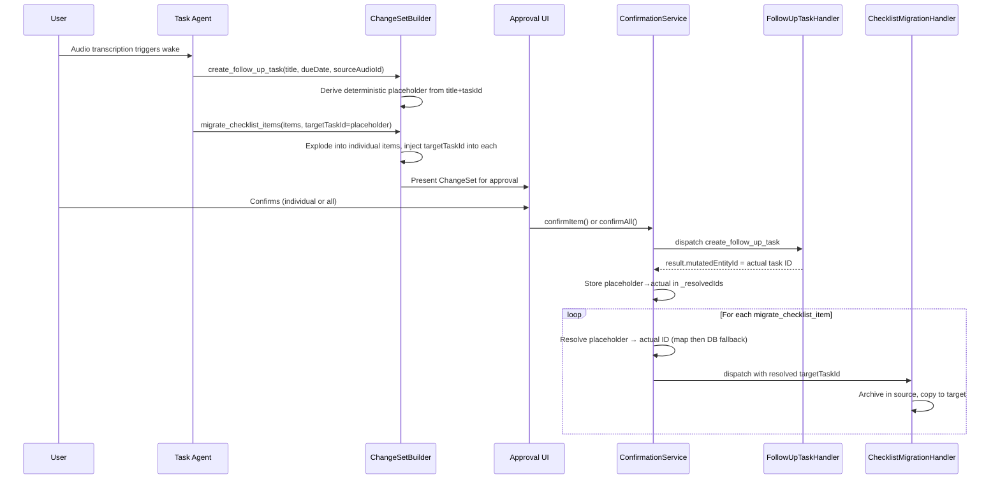
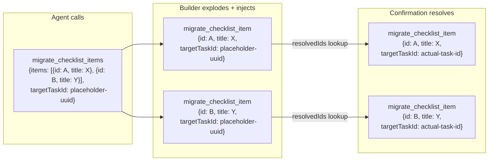
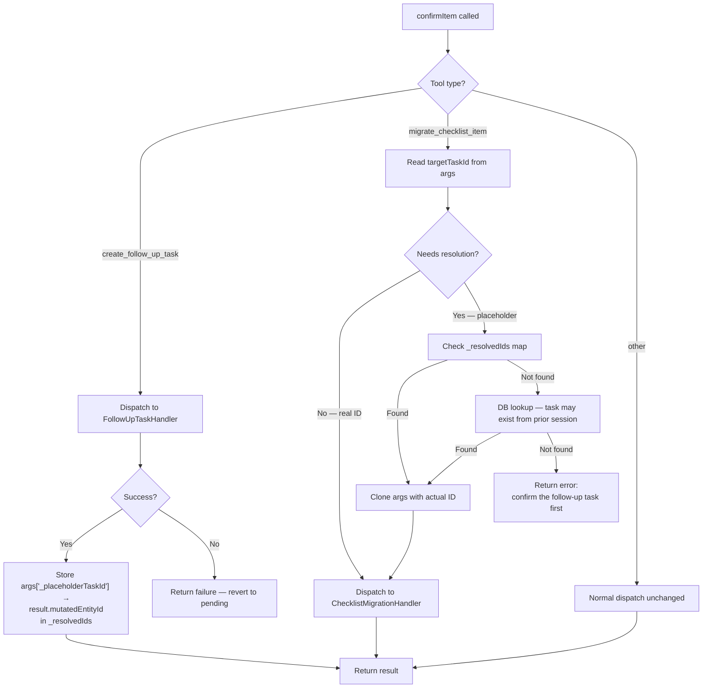

# Agent-Driven Task Splitting and Checklist Migration

**Date:** 2026-03-07
**Status:** Planned

## Problem

Users accumulate bloated tasks with 30+ checklist items. When recording audio within a task, they describe follow-up tasks and which items to move. The agent needs tools to: create follow-up tasks, migrate checklist items (archive in source, copy to target), and link everything together — all through the existing deferred approval workflow.

## Design Decisions

- **Fully deferred**: all operations go through ChangeSet approval
- **Archive + Copy**: archive items in source, create copies in target
- **Reuse BasicLink**: no new EntryLink variant needed
- **Deterministic placeholders**: placeholder task IDs derived from content, not random UUIDs (preserves dedup)
- **Dependency ordering**: migration items are blocked until their parent task-creation item is confirmed
- **Machine-readable ID surface**: use `mutatedEntityId` (not `output`) for cross-item ID resolution

## End-to-End Flow



## Batch Explosion and Argument Inheritance

This is the key complexity: `migrate_checklist_items` is a batch tool that gets
exploded into individual `migrate_checklist_item` entries. But the current explosion
logic (`addBatchItem`) only stores each array element as the child item's args —
top-level keys like `targetTaskId` would be lost.



The builder injects `targetTaskId` into each child element during explosion (not after).
The confirmation service resolves the placeholder to a real ID at dispatch time.

## Placeholder Resolution in confirmItem

Resolution lives in `confirmItem()` — not just `confirmAll()` — because the UI
allows confirming individual rows in arbitrary order via swipe gestures.



The DB fallback handles the case where the user confirmed `create_follow_up_task` in
a prior app session (or via a different `ConfirmationService` instance), then comes back
later to confirm the migration items.

## Deterministic Placeholder Strategy

**Problem:** Random placeholder UUIDs break cross-wake dedup because
`ChangeItem.fingerprint` is computed from `toolName + args`. Two identical split
proposals in consecutive wakes would produce different fingerprints.

**Solution:** Derive the placeholder deterministically from the tool's semantic content:

```dart
static String _deterministicPlaceholder(String sourceTaskId, String title) {
  // UUID v5 from source task ID + title ensures stability across wakes
  return Uuid().v5(Uuid.NAMESPACE_URL, 'follow-up:$sourceTaskId:$title');
}
```

Same `(sourceTaskId, title)` pair → same placeholder → same fingerprint → dedup works.

## Implementation Phases

### Phase 1: Tool Registry — Add New Tool Names and Definitions

**File:** `lib/features/agents/tools/agent_tool_registry.dart`

1. Add constants to `TaskAgentToolNames`:
   - `createFollowUpTask = 'create_follow_up_task'`
   - `migrateChecklistItems = 'migrate_checklist_items'`
   - `migrateChecklistItem = 'migrate_checklist_item'` (singular, for batch explosion)

2. Add `AgentToolDefinition` entries to `taskAgentTools`:
   - **`create_follow_up_task`**: params — `title` (string, required), `dueDate` (string YYYY-MM-DD, optional), `priority` (string P0-P3, optional), `description` (string, optional), `sourceAudioId` (string, optional — audio entry to link as source)
   - **`migrate_checklist_items`**: params — `items` (array of `{id: string, title: string}`, required), `targetTaskId` (string, required — placeholder ID from create_follow_up_task)

3. Add both tools to `deferredTools` set

4. Add `migrateChecklistItems: 'items'` to `explodedBatchTools`

### Phase 2: ChangeItem `groupId` Support

**File:** `lib/features/agents/model/change_set.dart`

Add optional `String? groupId` to `ChangeItem` so related items (create + migrate) can be grouped in the UI. Run `make build_runner` after.

**Note:** The `groupId` is included in the model now for future UI grouping. The current
flat list rendering in `change_set_summary_card.dart` will continue to work — grouped
rendering is a follow-up UI task (see "Deferred: UI Grouping" below).

### Phase 3: ChangeSetBuilder Updates

**File:** `lib/features/agents/workflow/change_set_builder.dart`

1. Add singularization mapping: `migrateChecklistItems` → `migrateChecklistItem`
2. When processing `create_follow_up_task`:
   - Derive a **deterministic** placeholder UUID v5 from `(taskId, title)` — not random
   - Store it in args as `_placeholderTaskId`
3. When exploding `migrate_checklist_items`:
   - **Inject `targetTaskId` into each child element's args** before creating the
     `ChangeItem` — ensures each singular item is self-contained
4. Assign a shared `groupId` (the placeholder ID) to all items from the same split

### Phase 4: Follow-Up Task Handler

**New file:** `lib/features/agents/tools/follow_up_task_handler.dart`

- Read source task to inherit `categoryId`
- Build `TaskData` (title, dueDate, priority defaults to P2)
- Build `EntryText` from description (or empty)
- Call `PersistenceLogic.createTaskEntry(data, entryText, categoryId: sourceCategory)`
- Create `BasicLink`: source task → new task via `PersistenceLogic.createLink`
- If `sourceAudioId` provided: create `BasicLink`: audio → new task
- Return `ToolExecutionResult` with `mutatedEntityId = newTask.meta.id`

Dependencies: `PersistenceLogic`, `JournalDb`

### Phase 5: Checklist Migration Handler

**New file:** `lib/features/agents/tools/checklist_migration_handler.dart`

- Look up checklist item by `itemId`, verify it belongs to source task's checklist
- Archive it: `updateChecklistItem(data.copyWith(isArchived: true))`
- Ensure target task has a checklist (via `AutoChecklistService`)
- Create copy in target: `addItemToChecklist(title, isChecked from original)`
- Return success

Dependencies: `ChecklistRepository`, `JournalDb`, `AutoChecklistService`

### Phase 6: Dispatcher Integration

**File:** `lib/features/agents/workflow/task_tool_dispatcher.dart`

Add two cases to `dispatch()` switch:
- `TaskAgentToolNames.createFollowUpTask` → `FollowUpTaskHandler`
- `TaskAgentToolNames.migrateChecklistItem` → `ChecklistMigrationHandler`

The dispatcher needs `PersistenceLogic` added to its constructor.

**File:** `lib/features/agents/state/change_set_providers.dart`

Update the `changeSetConfirmationServiceProvider` to pass `PersistenceLogic` to the
dispatcher.

### Phase 7: Confirmation Service — Cross-Item ID Resolution

**File:** `lib/features/agents/service/change_set_confirmation_service.dart`

**Key design: resolution happens in `confirmItem()`, not just `confirmAll()`.**

Changes to `confirmItem()`:
1. After successful `create_follow_up_task` dispatch, read `result.mutatedEntityId`
   and store the mapping `_placeholderTaskId → mutatedEntityId` in a class-level
   `Map<String, String> _resolvedIds`
2. Before dispatching `migrate_checklist_item`, check if `targetTaskId` in args
   needs resolution:
   - Check `_resolvedIds` map first (in-memory, same session)
   - If not found, attempt DB lookup (cross-session recovery)
   - If still not found, return a descriptive error without dispatching

Changes to `confirmAll()`:
- No special logic needed — it already calls `confirmItem()` sequentially, which
  handles resolution. The `_resolvedIds` map persists across calls within the same
  service instance.

### Phase 8: Agent Prompt Engineering

**File:** `lib/features/agents/workflow/task_agent_workflow.dart`

Add a new section to `taskAgentScaffoldTrailing` (after the checklist sovereignty block,
before the `## Important` section) with tool usage guidelines for the new tools:

```text
- **Task splitting**: When a user describes follow-up tasks in audio or notes —
  especially when referencing specific checklist items to move — use the split
  workflow:
  1. Call `create_follow_up_task` with the identified title, due date (if
     mentioned), and `sourceAudioId` (the audio entry that triggered the split).
     The system returns a placeholder `targetTaskId`.
  2. Call `migrate_checklist_items` with the checklist item IDs and titles to
     move, plus the `targetTaskId` from step 1.
  3. Record an observation about the split rationale.
  - Only split when the user clearly describes a separate task. Do not
    proactively suggest splits based on task size alone.
  - When unsure which items to move, err on the side of moving fewer items.
    The user can always move more later.
  - Priority defaults to P2 if not mentioned. Inherit the source task's
    category automatically.
```

**File:** `lib/features/agents/model/seeded_directives.dart`

Add task splitting to the `taskAgentGeneralDirective` under Tool Discipline:

```text
- Use `create_follow_up_task` + `migrate_checklist_items` when the user
  describes a distinct follow-up task and identifies checklist items to move.
  Both tools go through user approval before executing.
```

### Phase 9: Tests

| Test file | What to test |
|-----------|-------------|
| `test/features/agents/tools/follow_up_task_handler_test.dart` | Task creation, link creation, audio link, missing source task, category inheritance, mutatedEntityId in result |
| `test/features/agents/tools/checklist_migration_handler_test.dart` | Item archival + copy, item not found, wrong task, target task missing, checklist auto-creation |
| `test/features/agents/workflow/task_tool_dispatcher_test.dart` | Add cases for new tool dispatch routing |
| `test/features/agents/service/change_set_confirmation_service_test.dart` | Placeholder resolution in confirmItem (not just confirmAll), DB fallback lookup, rejection cascade (migration items skipped when target rejected), cross-session recovery |
| `test/features/agents/workflow/change_set_builder_test.dart` | Singularization, deterministic placeholder stability across wakes, targetTaskId injection into exploded items, groupId assignment |

### Phase 10: Analysis, Format, Verify

1. Run `dart_fix` and `dart_format`
2. Run `analyze_files` — must be zero warnings
3. Run targeted tests for all new/modified files
4. Run broader agent test suite

## Deferred: UI Grouping

The `groupId` field on `ChangeItem` is added in Phase 2 but the UI in
`change_set_summary_card.dart` continues to render a flat list. A follow-up task will:

1. Group items by `groupId` when present (collapsible section with header like
   "Split: {task title}")
2. Show dependency status (migration items greyed out until parent task is confirmed)
3. Add a "Confirm Group" action to confirm all items in a group at once

This is deliberately deferred to keep the current PR focused on backend mechanics.
The flat list rendering works correctly — it just doesn't visually group related items.

## Critical Files

| File | Action |
|------|--------|
| `lib/features/agents/tools/agent_tool_registry.dart` | Modify — add tool names + definitions |
| `lib/features/agents/model/change_set.dart` | Modify — add `groupId` field |
| `lib/features/agents/workflow/change_set_builder.dart` | Modify — singularization, deterministic placeholder, targetTaskId injection, groupId |
| `lib/features/agents/tools/follow_up_task_handler.dart` | **New** — task creation handler |
| `lib/features/agents/tools/checklist_migration_handler.dart` | **New** — item migration handler |
| `lib/features/agents/workflow/task_tool_dispatcher.dart` | Modify — add dispatch cases, add PersistenceLogic dep |
| `lib/features/agents/state/change_set_providers.dart` | Modify — pass PersistenceLogic to dispatcher |
| `lib/features/agents/service/change_set_confirmation_service.dart` | Modify — placeholder resolution in confirmItem, _resolvedIds map, DB fallback |
| `lib/features/agents/workflow/task_agent_workflow.dart` | Modify — add split tool usage guidelines to scaffold trailing |
| `lib/features/agents/model/seeded_directives.dart` | Modify — add split mention to general directive |
| `lib/logic/persistence_logic.dart` | **Read only** — reuse createTaskEntry, createLink |

## Dependencies Reused (No New Code)

- `PersistenceLogic.createTaskEntry()` — creates Task with metadata, optional linkedId
- `PersistenceLogic.createLink()` — creates BasicLink between two entries
- `AutoChecklistService.autoCreateChecklist()` — ensures a task has a checklist
- `ChecklistRepository.addItemToChecklist()` — adds item to existing checklist
- `ChecklistRepository.updateChecklistItem()` — archives item (set deletedAt)

## Review Findings Addressed

| # | Finding | Resolution |
|---|---------|------------|
| 1 | Random placeholder UUIDs break dedup fingerprints | Use deterministic UUID v5 from `(sourceTaskId, title)` — stable across wakes |
| 2 | `targetTaskId` lost when exploding batch into singular items | Inject `targetTaskId` into each child element's args during explosion |
| 3 | Individual confirm can dispatch migration before task exists | Move resolution to `confirmItem()` with DB fallback, not just `confirmAll()` |
| 4 | Parsing task ID from `output` (free-form text) is fragile | Use `mutatedEntityId` — the established machine-readable field |
| 5 | `groupId` UI work undefined | Explicitly deferred as follow-up; flat list continues to work |
