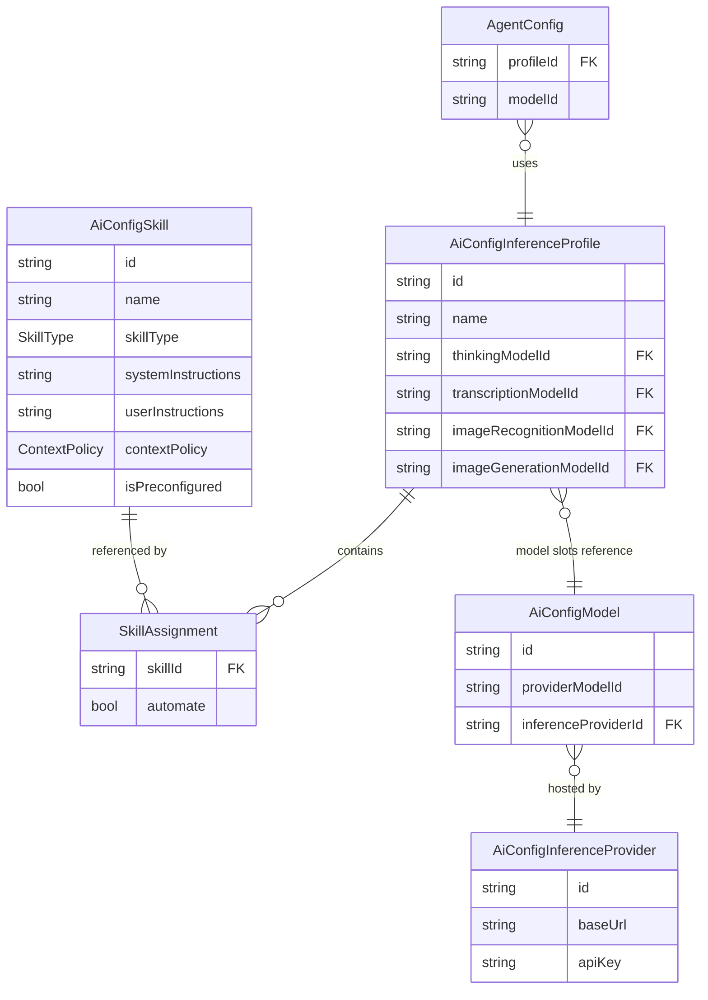
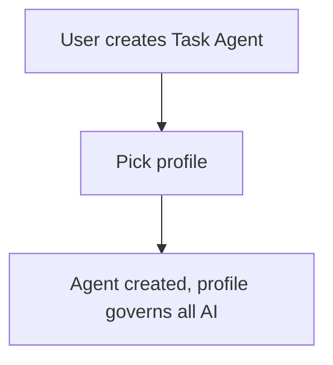
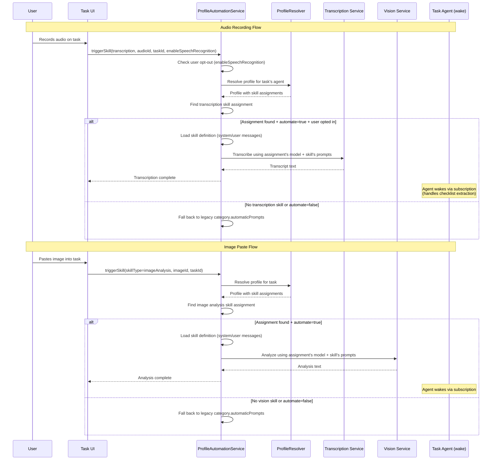
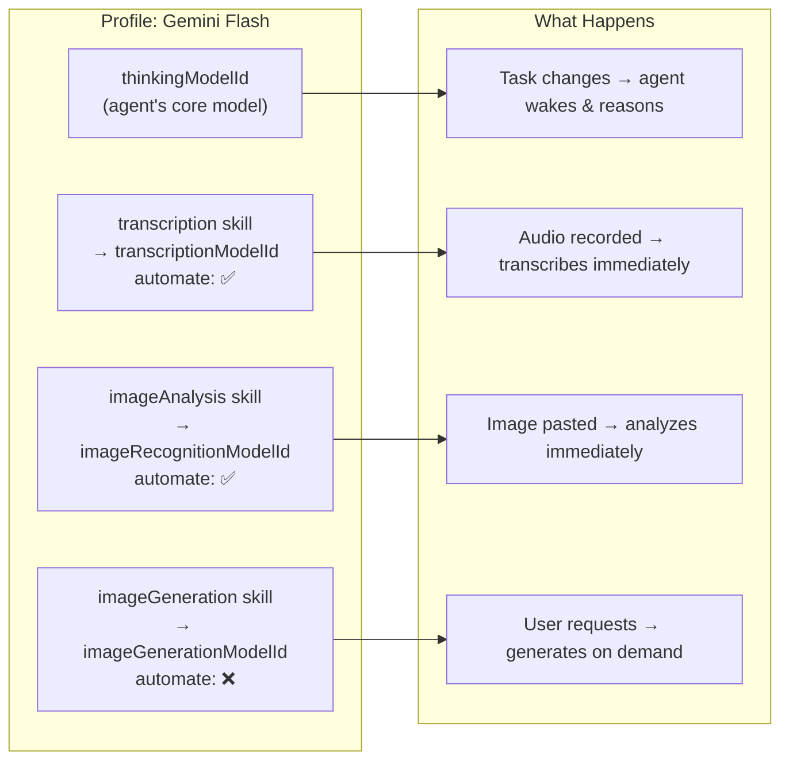

# Simplify Prompting with Task Agent Profiles & Skills

**Date:** 2026-03-09
**Status:** Proposed

## Problem

The current system for managing AI interactions per category is overly complex:

1. **`allowedPromptIds`** on `CategoryDefinition` — whitelist of prompts available in a category
2. **`automaticPrompts`** on `CategoryDefinition` — `Map<AiResponseType, List<String>>` mapping response types to prompt IDs for auto-triggers
3. **Agent profile selection** — per-agent at creation time, disconnected from categories
4. **Prompts bundle model + instructions** — changing a model means duplicating the entire prompt

Users must separately configure transcription prompts, image analysis prompts, checklist update prompts, AND agent profiles. Speech/image processing depends on looking up a specific **prompt** (which itself points to a model), rather than simply using the **profile's** capability directly.

### Goal

Introduce **Skills** (standalone, model-agnostic capability definitions) and **Profiles** (bundles that assign models to skills). A profile governs all AI interactions for a task. When an asset is added to a task whose profile has the relevant skill with automation enabled, processing happens immediately — no prompt lookup indirection needed.

---

## Core Concepts

### Skill

A **Skill** defines **how** to perform a specific AI task — the instructions, context rules, and input requirements — but not **which model** to use. The model is assigned by the profile.

This concept aligns with the [Agent Skills standard](https://agentskills.io/specification) (Anthropic, adopted by GitHub Copilot, VS Code, Kiro): a skill is a self-documenting, portable unit of instructions decoupled from the execution environment. We adapt the pattern for our domain (task management AI rather than coding agents) and store skills as database entities rather than markdown files, since they need to sync across devices and be editable in-app.

| Agent Skills standard | Our adaptation |
|----------------------|---------------|
| `name` + `description` (frontmatter) | `name` + `description` (entity fields) |
| Markdown body (instructions) | `systemInstructions` + `userInstructions` |
| Progressive disclosure (discover → load → execute) | Same: skill type visible in profile UI → full instructions loaded at execution time |
| Portable files | Portable via Matrix sync |
| Scripts/references/assets | `contextPolicy` + `skillType` (runtime injects context, not bundled files) |

```
Skill: "Transcribe Audio"
  id: "skill-transcribe-001"
  name: "Transcribe Audio"
  description: "Transcribe audio recordings into text with proper formatting"
  skillType: transcription
  requiredInputModalities: [audio]
  systemInstructions: "Transcribe in the original spoken language. Remove filler words."
  userInstructions: "Format with proper punctuation. Start new paragraphs on topic changes."
  contextPolicy: dictionaryOnly
  isPreconfigured: true
```

Key properties:
- **Model-agnostic** — no `modelId` or `providerId` on the skill itself
- **Reusable** — the same skill works in multiple profiles with different models
- **Declarative requirements** — `requiredInputModalities` (audio, image, text) express what the skill needs
- **Context policy** — controls how much task context is sent (addresses Mistral's limitation)
- **Preconfigured only (this phase)** — app ships with sensible defaults. Custom/cloned skills are future work.
- **Placeholder-free** — the runtime prompt builder injects placeholders (`{{speech_dictionary}}`, `{{task}}`, etc.) automatically based on `skillType` and `contextPolicy`; skill instructions contain only prose
- **Self-documenting** — name + description readable in profile UI without loading full instructions

### Profile

A **Profile** assigns models to skills and controls which skills auto-trigger.

```
Profile: "Gemini Flash"
  id: "profile-gemini-flash-001"
  thinkingModelId: "models/gemini-3-flash-preview"
  transcriptionModelId: "models/gemini-3-flash-preview"
  imageRecognitionModelId: "models/gemini-3-flash-preview"
  imageGenerationModelId: "models/gemini-3-pro-image-preview"
  skillAssignments: [
    { skillId: "skill-transcribe-001",               automate: true  },
    { skillId: "skill-image-analysis-context-001",   automate: true  },
    { skillId: "skill-image-gen-001",                automate: false },
  ]
```

Key properties:
- **Model slots** on the profile select which model each capability uses (unchanged from today)
- **Skill assignments** control which skills are active and whether they auto-trigger
- **Per-skill automation toggle** — user controls which skills fire automatically
- The same skill in different profiles uses the profile's own model slots

### Relationship Diagram



---

## User Flows

### Task Agent Creation & Profile Assignment



### Automated Asset Processing (Skill-Driven)



### Skill Type Usage Map



---

## Data Model

### New Entity: `AiConfigSkill`

```dart
const factory AiConfig.skill({
  required String id,
  required String name,
  required SkillType skillType,
  required List<Modality> requiredInputModalities,
  required DateTime createdAt,

  /// User-editable prose instructions for the system role.
  /// Does NOT contain placeholders — the prompt builder wraps these
  /// with the appropriate context (task JSON, speech dictionary, etc.)
  /// based on [skillType] and [contextPolicy] at runtime.
  required String systemInstructions,

  /// User-editable prose instructions for the user message.
  /// Same rule: no placeholders, prompt builder handles injection.
  required String userInstructions,

  /// How much task context the prompt builder should inject:
  /// - none: no task context
  /// - dictionaryOnly: only speechDictionary terms
  ///   (for providers like Mistral that don't support full context)
  /// - taskSummary: task summary + latest agent report
  /// - fullTask: complete task JSON context
  @Default(ContextPolicy.none) ContextPolicy contextPolicy,

  /// Whether this is a system-seeded skill (non-deletable).
  /// In this phase all skills are preconfigured. Clone/edit is future work.
  @Default(false) bool isPreconfigured,

  /// Whether the skill uses reasoning/extended thinking.
  @Default(false) bool useReasoning,

  DateTime? updatedAt,
  String? description,
}) = AiConfigSkill;
```

#### Prompt Assembly (Runtime)

The `SkillPromptBuilder` assembles the final system/user messages at runtime:

```
Final systemMessage = skillType template header
                    + skill.systemInstructions
                    + (contextPolicy == fullTask ? taskContextBlock : "")

Final userMessage   = skill.userInstructions
                    + (contextPolicy == dictionaryOnly ? speechDictionaryBlock : "")
                    + (contextPolicy == fullTask ? "{{task}}" expanded : "")
                    + (skillType == transcription ? speakerIdentificationRules : "")
                    + (skillType == imageAnalysis ? urlFormattingRules : "")
```

The builder handles all placeholder injection, context blocks, and boilerplate rules based on `skillType` + `contextPolicy`. In this phase all skills are preconfigured (read-only). When custom skills are added in a follow-up, users will edit only the `systemInstructions` and `userInstructions` prose — the builder handles the rest.

### New Enum: `SkillType`

```dart
enum SkillType {
  /// Audio transcription (speech-to-text).
  transcription,

  /// Image analysis / vision.
  imageAnalysis,

  /// Image generation.
  imageGeneration,

  /// Prompt generation from audio + task context.
  promptGeneration,

  /// Image prompt generation from audio + task context.
  imagePromptGeneration,
}
```

### New Enum: `ContextPolicy`

```dart
enum ContextPolicy {
  /// No task context sent.
  none,

  /// Only speech dictionary terms.
  /// Use for providers that don't support full context (e.g., Mistral transcription).
  dictionaryOnly,

  /// Task summary + latest agent report. Lighter than fullTask but gives
  /// the model enough context to understand what the task is about.
  taskSummary,

  /// Full task JSON context included.
  fullTask,
}
```

### New Value Class: `SkillAssignment`

```dart
@freezed
abstract class SkillAssignment with _$SkillAssignment {
  const factory SkillAssignment({
    /// References an AiConfigSkill by ID.
    required String skillId,

    /// Whether this skill auto-triggers when matching assets are added.
    @Default(false) bool automate,
  }) = _SkillAssignment;

  factory SkillAssignment.fromJson(Map<String, dynamic> json) =>
      _$SkillAssignmentFromJson(json);
}
```

Note: no `modelId` on the assignment. The model is determined by the profile's model slot matching the skill's type (see skill-to-model-slot mapping table above).

### Modified Entity: `AiConfigInferenceProfile`

The existing model slots remain the source of truth for model selection. Skill assignments are added alongside them — they control **which skills** are active and **whether they auto-trigger**, while the model slots control **which model** each capability uses.

```dart
const factory AiConfig.inferenceProfile({
  required String id,
  required String name,
  required DateTime createdAt,

  // ── Model slots (unchanged, still the source of truth for models) ──
  /// Model for agentic thinking (tool calling, reasoning).
  required String thinkingModelId,
  /// Model for image recognition / vision tasks.
  String? imageRecognitionModelId,
  /// Model for audio transcription.
  String? transcriptionModelId,
  /// Model for image generation.
  String? imageGenerationModelId,

  // ── New: skill configuration ──
  /// Maps skills to model slots and controls automation.
  /// Each assignment references a skill by ID and specifies whether
  /// it should auto-trigger. The model is determined by the profile's
  /// model slot matching the skill's type (e.g., transcription skill
  /// uses transcriptionModelId).
  @Default([]) List<SkillAssignment> skillAssignments,

  /// Whether this is a system-seeded default (non-deletable).
  @Default(false) bool isDefault,

  /// Whether this profile requires a desktop environment.
  @Default(false) bool desktopOnly,

  DateTime? updatedAt,
  String? description,
}) = AiConfigInferenceProfile;
```

**Skill-to-model-slot mapping:** The `ProfileResolver` maps each skill assignment to the appropriate model slot by `SkillType`:

| SkillType | Model slot |
|-----------|-----------|
| `transcription` | `transcriptionModelId` |
| `imageAnalysis` | `imageRecognitionModelId` |
| `imageGeneration` | `imageGenerationModelId` |
| `promptGeneration` | `thinkingModelId` (uses reasoning) |
| `imagePromptGeneration` | `thinkingModelId` (uses reasoning) |

**Existing profiles:** Profiles with no `skillAssignments` continue to work exactly as today for agent wakes. For automation, the `ProfileResolver` checks: does this profile have a model slot populated for the requested skill type? If yes and a matching skill assignment with `automate: true` exists, automation fires. If no skill assignments exist yet, automation doesn't fire — the profile works exactly as before until the seeder or user adds assignments.

**Seeder update:** `ProfileSeedingService.upgradeExisting()` adds default `skillAssignments` to existing default profiles (`isDefault: true`) that have empty assignments. This is a one-time backfill on app upgrade that enables automation for default profiles.

---

## Preconfigured Skills

Ship these built-in skills, derived from existing `preconfigured_prompts.dart`:

| Skill ID | Name | SkillType | Input | Context | Source Template |
|----------|------|-----------|-------|---------|----------------|
| `skill-transcribe-001` | Transcribe Audio | transcription | [audio] | dictionaryOnly | `audio_transcription` |
| `skill-transcribe-context-001` | Transcribe (Task Context) | transcription | [audio] | fullTask | `audio_transcription_task_context` |
| `skill-image-analysis-001` | Analyze Image | imageAnalysis | [image] | none | `image_analysis` |
| `skill-image-analysis-context-001` | Analyze Image (Task Context) | imageAnalysis | [image] | fullTask | `image_analysis_task_context` |
| `skill-image-gen-001` | Generate Cover Art | imageGeneration | [text] | fullTask | `cover_art_generation` |
| `skill-prompt-gen-001` | Generate Coding Prompt | promptGeneration | [audio] | fullTask | `prompt_generation` |
| `skill-image-prompt-gen-001` | Generate Image Prompt | imagePromptGeneration | [audio] | fullTask | `image_prompt_generation` |

The `systemInstructions` and `userInstructions` are extracted from the existing `PreconfiguredPrompt` definitions (prose portions only, placeholders stripped). The `SkillPromptBuilder` re-injects the appropriate placeholders at runtime based on `skillType` + `contextPolicy`.

**Note:** There is no "thinking" skill. The agent's reasoning/tool-calling is not a skill — it's the agent's core function, governed by `thinkingModelId` on the profile and the template/workflow system. Skills are strictly the automatable capabilities that the profile triggers on asset detection (transcription, image analysis, etc.).

**Deferred runtime consumers:** The `imageGeneration`, `promptGeneration`, and `imagePromptGeneration` skills are seeded as data entities, but their runtime consumers (image generation controller, unified AI controller popup actions) continue to use the existing prompt system in this phase. These skill types are **hidden from the profile skill assignment UI** — the profile skill picker filters to only `transcription` and `imageAnalysis` types. There is no skill browsing/editing UI in this phase. Migrating the remaining consumers and adding a skill management page are follow-ups.

### Seeded Profile Updates

Update `ProfileSeedingService` to add skill assignments on default profiles. Example for Gemini Flash:

```dart
AiConfigInferenceProfile(
  id: profileGeminiFlashId,
  name: 'Gemini Flash',
  thinkingModelId: 'models/gemini-3-flash-preview',
  transcriptionModelId: 'models/gemini-3-flash-preview',
  imageRecognitionModelId: 'models/gemini-3-flash-preview',
  imageGenerationModelId: 'models/gemini-3-pro-image-preview',
  skillAssignments: [
    SkillAssignment(skillId: 'skill-transcribe-001', automate: true),
    SkillAssignment(skillId: 'skill-image-analysis-context-001', automate: true),
    // imageGeneration/promptGeneration/imagePromptGeneration skills are seeded
    // but NOT assigned to profiles until their runtime consumers are migrated
  ],
  ...
)
```

For Mistral (EU) — same structure, the dictionary-only context policy lives on the skill:
```dart
SkillAssignment(skillId: 'skill-transcribe-001', automate: true),
// skill-transcribe-001 has contextPolicy: dictionaryOnly
// model comes from profile.transcriptionModelId = 'voxtral-mini-latest'
```

---

## Implementation Phases

### Phase 1: Data Model & Skill Entity

1. **Add `SkillType` and `ContextPolicy` enums** to `lib/features/ai/state/consts.dart`
2. **Add `SkillAssignment` freezed class** to new file `lib/features/ai/model/skill_assignment.dart`
3. **Add `AiConfig.skill` variant** to `lib/features/ai/model/ai_config.dart`
4. **Add `skillAssignments` to `AiConfigInferenceProfile`** (keep legacy fields)
5. **Add `AiConfigType.skill`** to the enum
6. **Update all exhaustive switch/map sites** that handle `AiConfig` cases. Adding a new sealed-class variant breaks compilation at every exhaustive pattern match. Known sites:
   - `lib/features/ai/database/ai_config_db.dart` — persistence `config.map(...)` for type string + deserialization
   - `lib/features/ai/ui/settings/ai_settings_page.dart` — navigation/routing for config types
   - `lib/features/ai/ui/settings/widgets/dismissible_config_card.dart` — delete handling
   - `lib/features/ai/ui/settings/ai_config_card.dart` — card rendering
   - `lib/features/ai/repository/ai_config_repository.dart` — query filtering
   - `lib/features/ai/ui/settings/services/ai_setup_prompt_service.dart` — setup flows
   - `lib/features/ai/ui/settings/services/ai_config_delete_service.dart` — 4 exhaustive switch expressions for delete/undo/UI text/icon
   - `lib/features/ai/ui/settings/ai_settings_navigation_service.dart` — exhaustive switch in `_createEditRouteWithTransition` (line ~127)
   - `lib/features/ai/state/unified_ai_controller.dart` — inference dispatch
   - `lib/features/ai/state/image_generation_controller.dart` — image gen dispatch
   - `lib/features/sync/matrix/sync_event_processor.dart` — sync deserialization (see Phase 1 sync note)
   - `lib/features/sync/outbox/outbox_service.dart` — sync serialization
7. Run `make build_runner` to regenerate freezed/json code
8. Run `make analyze` — iterate until zero warnings/errors across all sites above

### Phase 2: Skill Seeding & Prompt Builder

1. **Create `SkillSeedingService`** in `lib/features/ai/util/skill_seeding_service.dart`
   - Seeds preconfigured skills from existing `PreconfiguredPrompt` definitions
   - Idempotent (checks by ID before inserting)
   - Extracts prose instructions from `PreconfiguredPrompt` (strips placeholder syntax)
   - Maps each template → `AiConfigSkill` with appropriate `SkillType` and `ContextPolicy`
2. **Create `SkillPromptBuilder`** in `lib/features/ai/helpers/skill_prompt_builder.dart`
   - Assembles final system/user messages from skill instructions + runtime context
   - Injects placeholders based on `skillType` + `contextPolicy`:
     - `transcription` + `dictionaryOnly` → appends speech dictionary block
     - `transcription` + `fullTask` → appends task context + speech dictionary
     - `imageAnalysis` + `fullTask` → wraps with task context + URL formatting rules
     - `imageGeneration` / `promptGeneration` / `imagePromptGeneration` → wraps with task context (runtime consumers for these types are NOT changed in this phase — they continue to use the prompt system; the builder code handles them for completeness so it's ready when those consumers migrate)
   - Users never see or edit placeholders; this is the only place they exist
3. **Update `ProfileSeedingService`** to include `skillAssignments` on default profiles
4. **Wire seeding into app startup** (alongside existing profile/template seeding in `agent_providers.dart`)
5. Write tests for seeding service and prompt builder

### Phase 3: Profile Resolver Update

1. **Update `ProfileResolver`** to carry skill activation metadata alongside existing model-slot resolution:
   - Model resolution is **unchanged**: profile model slots (`thinkingModelId`, `transcriptionModelId`, etc.) → `AiConfigModel` → `AiConfigInferenceProvider`, exactly as today
   - **New**: after resolving model slots, attach the profile's `skillAssignments` list to the resolved result so downstream consumers know which skills are active and which have `automate: true`
   - No change to the resolution chain (`agentConfig.profileId ?? version.profileId ?? template.profileId`)
2. **Update `ResolvedProfile`** to include a `List<SkillAssignment> skillAssignments` field (from the profile entity) so automation services can look up skill activation without re-fetching the profile
3. Write tests verifying skill metadata is carried through, and that model resolution is unaffected

### Phase 4: Profile Automation Service

1. **Create `ProfileAutomationResolver`** in `lib/features/ai/helpers/profile_automation_resolver.dart`
   - **Must delegate to `ProfileResolver.resolve()`** to use the same resolution chain as agent wakes: `agentConfig.profileId ?? version.profileId ?? template.profileId` → legacy `modelId` fallback. This ensures the same profile governs both agent reasoning and asset automation. Do NOT implement a separate, weaker resolution path.
   - Wraps `ProfileResolver` with the extra step of looking up the task's agent identity/template/version, then calling `resolve()`.
   - Returns resolved profile + skill assignments with automation flags, or null if no agent/profile.
2. **Create `ProfileAutomationService`** in `lib/features/ai/services/profile_automation_service.dart`
   - `tryTranscribe(audioEntryId, taskId, categoryId, {bool? enableSpeechRecognition})` → respects the user's per-recording opt-out (`enableSpeechRecognition` from `AudioRecorderState`). If `false`, returns immediately without transcribing. If `null`, defaults to `true` when a profile-driven transcription skill is available with `automate: true`.
   - `tryAnalyzeImage(imageEntryId, taskId, categoryId)` → finds image analysis skill assignment with `automate: true`, loads skill's prompts, invokes analysis
   - Returns `bool` indicating whether profile-driven path was used
   - Applies `contextPolicy` from skill: `dictionaryOnly` sends only speech dictionary terms, `fullTask` sends complete task JSON
3. Write tests with mock providers, including tests for opt-out behavior

### Phase 5: Wire into Existing Triggers + Checkbox Visibility

1. **Modify `AutomaticPromptTrigger`** (`lib/features/speech/helpers/automatic_prompt_trigger.dart`)
   - Add profile-driven path at top: call `profileAutomationService.tryTranscribe()`
   - If returns `true`, skip legacy path
   - If returns `false`, fall through to existing `category.automaticPrompts` logic
2. **Modify `AutomaticImageAnalysisTrigger`** (`lib/features/ai/helpers/automatic_image_analysis_trigger.dart`)
   - Same pattern: profile-first, legacy fallback
3. **Update `checkboxVisibilityProvider`** (`lib/features/speech/state/checkbox_visibility_provider.dart`)
   - Currently derives visibility solely from `category.automaticPrompts` (accepts only `categoryId`) — when there are no legacy automatic prompts, the speech-recognition checkbox is hidden, making the opt-out invisible.
   - Add profile-aware path: accept an additional `linkedId` (task ID) parameter. Use it to look up whether the task has an agent with a profile that has a transcription skill assignment with `automate: true`. If so, show the checkbox regardless of legacy `automaticPrompts`.
   - This requires the provider to resolve: `linkedId` → task's agent → agent's profile → profile's skill assignments. The `ProfileAutomationResolver` from Phase 4 provides exactly this lookup.
   - Update `deriveAutomaticPromptVisibility()` in `lib/features/speech/helpers/automatic_prompt_visibility.dart` to accept a `hasProfileTranscription` parameter.
4. **Update `audio_recording_modal.dart`** (`lib/features/speech/ui/widgets/recording/audio_recording_modal.dart`)
   - Currently passes only `categoryId` to `checkboxVisibilityProvider`. Must also pass the `linkedId` (task ID, already available as a constructor parameter) so the provider can perform the profile lookup.
   - This is a mandatory change — the profile-aware checkbox path cannot work without the task context.
5. Update existing trigger tests, add new tests for profile-first path and checkbox visibility

### Phase 6: UI — Profile Skill Assignments

No skill editing/management page in this phase — only preconfigured (baked-in) skills are used.

1. **Profile editing page update**
   - Keep existing model slot editors (these are the source of truth for which model each capability uses)
   - Add a **skill assignments section** below the model slots:
     - Show preconfigured skills available for the profile, filtered to types with active runtime consumers: `transcription` and `imageAnalysis`
     - Per-skill: automation toggle (no model picker — the model comes from the profile's slot matching the skill's type)
     - Show which model slot each skill maps to (e.g., "Transcribe Audio → uses Transcription Model")
   - **Suitability validation** when enabling a skill:
     - The profile's corresponding model slot must be populated (e.g., enabling a transcription skill requires `transcriptionModelId` to be set)
     - Show warning/disable toggle if the required model slot is empty
2. Write widget tests

### Phase 7: Localization

Add new labels to all ARB files (`app_en.arb`, `app_de.arb`, `app_cs.arb`, `app_es.arb`, `app_fr.arb`, `app_ro.arb`):

- Profile skill assignment labels (skill names, automation toggle, model slot mapping hints)
- Validation messages (e.g., "Set a transcription model to enable this skill")

Run `make l10n` and `make sort_arb_files`.

### Phase 8: CHANGELOG & Documentation

1. Add entry under current version in `CHANGELOG.md`
2. Update `flatpak/com.matthiasn.lotti.metainfo.xml`
3. Update feature READMEs for AI, agents, categories

---

## Migration & Backward Compatibility

### Existing profiles (Finding #1)

Existing profiles have model slots populated but no `skillAssignments`. The model slots remain unchanged and authoritative.

- **Seeder backfill:** `ProfileSeedingService.upgradeExisting()` adds default `skillAssignments` to existing default profiles (`isDefault: true`) that have empty assignments. This is a one-time write on app upgrade that enables automation for default profiles.
- **User-created profiles:** No automatic backfill. Automation doesn't fire until the user adds skill assignments via the profile editing UI. The profile continues to work for agent wakes exactly as before — only the new automation feature requires skill assignments.

### Sync compatibility (Finding #2)

Adding `AiConfig.skill` introduces a **new Freezed union case**. This is NOT just a nullable field — older clients will throw when they encounter `{"runtimeType": "skill", ...}` in a synced message.

**Where the failure happens:** The crash occurs at the `SyncMessage.fromJson()` boundary in `sync_event_processor.dart:560`, which decodes the entire message including nested `AiConfig` payloads. This happens **before** the processor has a typed `SyncAiConfig` to handle. The existing catch block at `sync_event_processor.dart:564` only tolerates `ArgumentError` and `FormatException`.

**Mitigation strategy — widen the existing guard:**
- In `sync_event_processor.dart`, expand the existing `SyncMessage.fromJson()` catch block to also tolerate `CheckedFromJsonException` (the specific error `json_serializable`'s checked-mode factories throw for unknown union discriminators). This is the exact exception type produced when `_$AiConfigFromJson` encounters an unrecognized `runtimeType` value.
- Do NOT catch `TypeError` — it's too broad and would mask real bugs. `CheckedFromJsonException` is precise and only fires for JSON deserialization mismatches.
- The existing log-and-skip pattern is preserved — no new try-catch sites needed, just one additional exception type at the existing boundary.
- **Skill entities (preconfigured):** Safe. Each client seeds them locally on upgrade, so dropping skill-create sync events is harmless. Since this phase only uses preconfigured skills, no user data is lost.

**Profile `skillAssignments` field — forward-compatibility loss:**

Adding `skillAssignments` to `AiConfigInferenceProfile` introduces a subtler sync issue than the skill entity case above. An older client deserializes profile sync events successfully (the field defaults to `[]`, unknown JSON keys are silently ignored by `json_serializable`). This means:

1. Newer client configures `skillAssignments` on a profile and syncs it
2. Older client receives and deserializes the profile — succeeds, but `skillAssignments` is `[]`
3. If the user edits the profile on the older client (e.g., changes a model slot) and syncs back, the profile is written with `skillAssignments: []` — overwriting the newer client's automation settings via last-write-wins

This is the standard risk for any new defaulted field in a last-write-wins sync system. It is NOT unique to skills — the same pattern applies to any nullable/defaulted field added to a synced entity.

**Impact in this phase:** Negligible. This is a single-user app syncing across the user's own devices (macOS, iOS, etc.). The user updates all devices together, so there is effectively no mixed-version window. Once all devices are on the new version, `skillAssignments` round-trips correctly through sync.

**Future consideration (user-created skills):** When custom skills are added, the sync story needs revisiting. An older client that drops a skill-create sync event treats it as handled (stream processor advances the processed marker). The event is consumed and will NOT be replayed on upgrade. Options: version gating, re-sync, or accepting the limitation since skills are lightweight text definitions.

### Other compatibility notes

- **Existing profiles** continue to work for agent wakes — model slots are unchanged. Automation requires skill assignments (added by seeder for defaults, by user for custom profiles).
- **Existing categories** (with `automaticPrompts`) continue to work via trigger fallback paths
- **Prompts coexist** — manual AI interactions (popup menu on entries) still use the prompt system
- **No schema migration required** — `skillAssignments` defaults to `[]`, legacy fields remain nullable. However, `ProfileSeedingService.upgradeExisting()` performs a one-time seeded backfill on upgrade, adding default `skillAssignments` to existing default profiles.
- **Incremental adoption** — users can start using profiles+skills while other categories remain prompt-based

## Follow-Up (Out of Scope)

- **Category default profile** (`defaultProfileId` on `CategoryDefinition`) — pre-select a profile when creating agents in a category, with "set as default?" prompt. Deferred to a separate PR.
- **Skill management UI** — dedicated Skills tab in AI settings with list/edit/clone/delete of custom skills. For now only preconfigured (baked-in) skills are used; user-created/cloned skills come later.
- **Deferred skill type consumers** — migrate `imageGeneration`, `promptGeneration`, `imagePromptGeneration` runtime consumers from prompts to skill-driven execution, and expose those types in the profile skill picker.
- **Prompt deprecation** — once skills are proven, migrate manual AI interactions away from prompts

## What Stays the Same

- Agent wake workflow, tool execution, and thinking model — `thinkingModelId` is the agent's core, not a skill
- Checklist extraction — remains the agent's job (reasoning + tools), not a skill
- Prompt system for manual AI interactions (coexists, eventual deprecation)
- Provider-specific transcription/analysis implementations
- Speech dictionary and correction examples on categories
- All sync mechanisms

## Files to Create

| File | Purpose |
|------|---------|
| `lib/features/ai/model/skill_assignment.dart` | `SkillAssignment` freezed class |
| `lib/features/ai/util/skill_seeding_service.dart` | Preconfigured skill seeding |
| `lib/features/ai/helpers/skill_prompt_builder.dart` | Assembles final prompts from skill instructions + runtime context |
| `lib/features/ai/helpers/profile_automation_resolver.dart` | Resolve profile for task's agent |
| `lib/features/ai/services/profile_automation_service.dart` | Skill-driven transcription/image analysis |

## Files to Modify

| File | Change |
|------|--------|
| `lib/features/ai/model/ai_config.dart` | Add `AiConfig.skill`, add `skillAssignments` to profile |
| `lib/features/ai/state/consts.dart` | Add `SkillType`, `ContextPolicy` enums |
| `lib/features/ai/database/ai_config_db.dart` | Handle `skill` case in exhaustive `config.map(...)` for persistence |
| `lib/features/ai/repository/ai_config_repository.dart` | Query filtering for skill type |
| `lib/features/ai/util/profile_seeding_service.dart` | Add `skillAssignments` to seeded profiles + `upgradeExisting()` backfill |
| `lib/features/ai/util/profile_resolver.dart` | Carry `skillAssignments` through to `ResolvedProfile` (model resolution unchanged) |
| `lib/features/ai/model/resolved_profile.dart` | Add `skillAssignments` field for downstream automation lookup |
| `lib/features/ai/ui/settings/ai_settings_page.dart` | Handle `skill` in navigation/routing |
| `lib/features/ai/ui/settings/ai_config_card.dart` | Handle `skill` in card rendering |
| `lib/features/ai/ui/settings/widgets/dismissible_config_card.dart` | Handle `skill` in delete |
| `lib/features/ai/state/unified_ai_controller.dart` | Handle `skill` case in dispatch |
| `lib/features/ai/state/image_generation_controller.dart` | Handle `skill` case |
| `lib/features/ai/ui/settings/services/ai_setup_prompt_service.dart` | Handle `skill` in setup |
| `lib/features/ai/ui/settings/services/ai_config_delete_service.dart` | Handle `skill` in 4 exhaustive switch expressions (delete, undo, UI text, icon) |
| `lib/features/ai/ui/settings/ai_settings_navigation_service.dart` | Handle `skill` in exhaustive switch for edit route creation |
| `lib/features/sync/matrix/sync_event_processor.dart` | Widen `SyncMessage.fromJson()` catch to tolerate `CheckedFromJsonException` |
| `lib/features/sync/outbox/outbox_service.dart` | Serialize `skill` configs for sync |
| `lib/features/speech/helpers/automatic_prompt_trigger.dart` | Profile-first automation path, pass `enableSpeechRecognition` |
| `lib/features/speech/state/checkbox_visibility_provider.dart` | Show opt-out checkbox when profile has transcription skill |
| `lib/features/speech/helpers/automatic_prompt_visibility.dart` | Accept `hasProfileTranscription` parameter |
| `lib/features/speech/ui/widgets/recording/audio_recording_modal.dart` | Pass `linkedId` to checkbox visibility provider for profile-aware lookup |
| `lib/features/ai/helpers/automatic_image_analysis_trigger.dart` | Profile-first automation path |
| `lib/features/agents/state/agent_providers.dart` | Wire skill seeding into startup |

## Summary: Before vs. After

| Area | Before (Prompt-Driven) | After (Skill + Profile) |
|------|------------------------|------------------------|
| Capability definition | Prompt = instructions + model + response type | Skill = instructions + requirements (no model) |
| Model assignment | Per-prompt `defaultModelId` | Profile model slots (unchanged), skills activate capabilities |
| Auto transcription | `category.automaticPrompts[audioTranscription]` → prompt → model | Profile's transcription skill assignment (automate: true) |
| Auto image analysis | `category.automaticPrompts[imageAnalysis]` → prompt → model | Profile's image analysis skill assignment (automate: true) |
| Automation toggle | `enableSpeechRecognition` pref + per-prompt config | Per-skill `automate` flag on assignment + `enableSpeechRecognition` still respected |
| Category defaults | Per-response-type prompt assignments | Profile selected on agent (category default is a follow-up) |
| Reusability | Prompts tied to specific models | Skills reused across profiles with different models |
| Provider context | Implicit in prompt messages | Explicit `contextPolicy` on skill |
| User configuration | Configure 4+ prompts per category per response type | Pick profile, skills come with sensible defaults |
