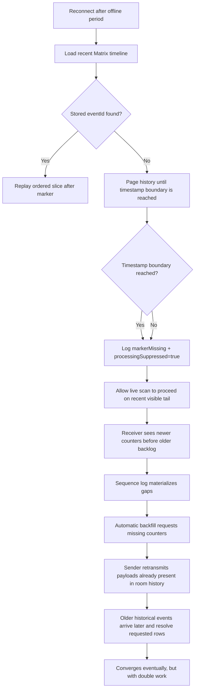
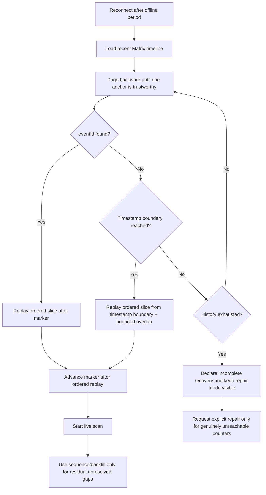

# Ensure Convergence When Sender Offline

**Date**: 2026-03-13  
**Status**: Implemented on `fix/sync_catchup`

## Short Version

The reconnect storm was not caused by vector clocks being incapable of dealing
with out-of-order delivery.

The actual failure was simpler:

1. the receiver lost the exact Matrix `eventId` anchor
2. catch-up paged back far enough to cross the stored timestamp boundary
3. but the code still treated that state as `markerMissing + incomplete`
4. live scan then processed a recent tail
5. sequence logging interpreted that recent tail as true gaps
6. automatic backfill requested payloads that were already still present in the
   room history

That is why an offline batch of roughly `1500` entries turned into a
retransmission storm instead of behaving like an email inbox catching up.

## How We Got Here

The sync stack evolved in two separate directions:

- Matrix catch-up used a single read marker `eventId` as its re-anchor point
- convergence tracking used per-host monotonic counters and vector clocks

That split is workable only while the Matrix marker remains reachable.

Once the exact `eventId` falls out of the SDK-visible history window, the code
needs a second trustworthy anchor. We already had one: the stored last-processed
timestamp.

The code even detected when pagination had reached that older timestamp window,
but it treated that fact as diagnostics only. In other words:

> the system knew it had walked back far enough in time, but it still refused
> to use that slice as the reconnect backlog.

That created a bad handoff:

- catch-up stopped
- live scan started
- live scan saw only newer events first
- gap detection fired before the older historical slice was replayed

Vector clocks can resolve out-of-order state, but only if the receiver actually
walks the historical window instead of converting "not walked yet" into
"missing forever, please backfill."

## What The Logs Show

### Desktop storm begins from live replay, not a clean historical walk

From `logs/sync-2026-03-13_desktop.log`:

- `20:19:51.473` first processed payload already detects `286 gaps`
- `20:19:51.611` that gap detection immediately nudges backfill
- `20:19:52.667` the receiver already sends `100` backfill requests
- older payloads then arrive and repeatedly resolve `requested` counters while
  creating more gaps

This is the signature of "recent tail first, historical replay second."

### Mobile proves the timestamp boundary was already reachable

From `logs/sync-2026-03-13_mobile.log`:

- `21:09:32.851` catch-up logs:
  - `markerMissing`
  - `snapshot=4969`
  - `reachedTimestampBoundary=true`
  - `processingSuppressed=true`

That is the core design bug. Once the receiver had already paged back to a time
older than the stored sync boundary, it should have replayed that ordered slice.
Instead it suppressed processing and left recovery to the gap/backfill path.

## What Backfill Proved

Backfill did save the run.

It likely prevented permanent divergence by re-requesting payloads that the
receiver had failed to ingest through normal catch-up. That is valuable, and it
is good evidence that the repair path itself works.

But it was still the wrong primary mechanism for this case. These entries were
not necessarily absent from Matrix history. They were absent from the first
recent tail the receiver processed. Once pagination had already crossed the
stored timestamp boundary, ordinary catch-up should have replayed that backlog
directly. Using backfill for that workload turned a normal offline reconnect
into redundant retransmission and double work.

## Current Flawed Flow

## Proposed Reliable Flow

## Implementation Plan

### 1. Treat timestamp reachability as a real recovery mode

If the exact Matrix marker is gone, but pagination reaches the stored last-sync
timestamp, catch-up should return a replayable ordered slice instead of an
incomplete result.

### 2. Remove the fixed pagination page cap from reconnect recovery

The old fixed `20` page cap was arbitrary. Catch-up now pages until one of
these conditions becomes true:

- stored `eventId` is found
- stored timestamp boundary is reached
- the SDK reports no more history
- pagination stops growing the visible timeline

### 3. Only use gap/backfill after historical replay had a fair chance

Gap detection is still correct for genuinely missing data. It is not correct as
the primary mechanism for ordinary reconnect backlog.

The system must first complete a trustworthy historical walk, then treat any
remaining holes as repair work.

### 4. Preserve overlap at the timestamp boundary

Timestamp anchoring replays a small bounded overlap before the stored timestamp.
This absorbs marker debounce skew and same-timestamp collisions without
reprocessing an unbounded tail.

## Code Changes In This Pass

Files changed:

- `lib/features/sync/matrix/pipeline/catch_up_strategy.dart`
- `lib/features/sync/matrix/sdk_pagination_compat.dart`
- `lib/features/sync/matrix/pipeline/matrix_stream_catch_up.dart`

Behavioral changes:

- catch-up now has a `timestampAnchored` recovery outcome
- reconnect paging no longer hard-stops after a fixed page count
- reaching the stored timestamp boundary now replays the ordered slice instead
  of suppressing processing
- startup convergence now treats timestamp-anchored replay as a trustworthy
  recovery path, not as a failure

## Why This Should Fix The 1500-Entry Offline Batch

In the failure case, the receiver already had enough room history to replay the
offline backlog from a time older than its last processed state. The only thing
missing was permission to trust that timestamp boundary.

With this change:

- the receiver pages back
- crosses the stored timestamp boundary
- replays the ordered historical slice
- updates counters in order
- does not convert the backlog into `missing/requested` rows first

That is the email-like behavior we wanted.
