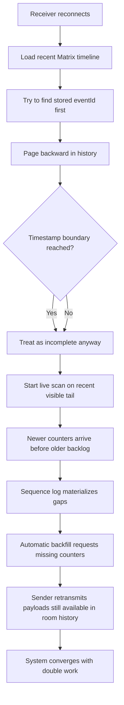
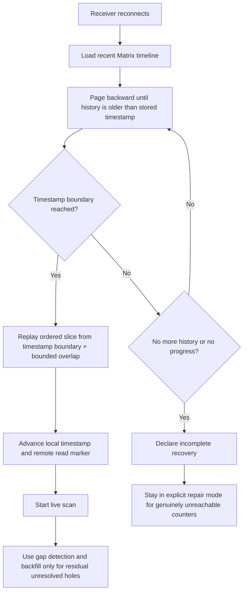

# Ensure Convergence When Sender Offline

**Date**: 2026-03-13  
**Status**: Implemented on `fix/sync_catchup`

## Summary

This incident was a catch-up failure, not a repair failure.

When a receiver reconnects after being offline, it should page backward through
Matrix history until it is older than the last processed timestamp, then
replay the ordered backlog once and continue with live sync.

In the failing flow, the stored restart marker was often not a durable server
Matrix event id at all, but a local `lotti-...` placeholder. Catch-up paged
back far enough to cross the stored last-processed timestamp, but still
treated that time boundary as informational instead of authoritative. Live scan
then processed a recent tail first, sequence logging materialized gaps, and
automatic backfill took over for data that should have arrived through ordinary
catch-up.

That is why an offline batch of roughly `1500` entries turned into a
retransmission storm instead of behaving like an email inbox catching up.

## Incident Narrative

The sender created a large batch of entries while the receiver was offline.
When the receiver came back:

1. catch-up could not re-anchor on the stored restart marker
2. catch-up still paged back to a point older than the stored sync timestamp
3. the code treated that timestamp boundary as incomplete instead of replayable
4. live scan processed newer visible events before the older backlog
5. sequence logging interpreted the ordering hole as missing counters
6. backfill requested payloads that were still available in room history

The system eventually converged, but it did so with redundant work and a large
synthetic missing/requested backlog.

## What The Logs Prove

### Desktop

From [sync-2026-03-13_desktop.log](/Users/mn/github/lotti/logs/sync-2026-03-13_desktop.log):

- `20:19:51.473` the first processed payload already detects `286 gaps`
- `20:19:51.611` gap detection immediately nudges backfill
- `20:19:52.667` the receiver already sends `100` backfill requests
- older payloads then arrive later and resolve `requested` counters

That is the signature of a recent tail being processed before the historical
backlog was replayed.

### Mobile

From [sync-2026-03-13_mobile.log](/Users/mn/github/lotti/logs/sync-2026-03-13_mobile.log):

- `21:09:32.851` catch-up logs:
  - `markerMissing`
  - `snapshot=4969`
  - `reachedTimestampBoundary=true`
  - `processingSuppressed=true`

This is the key design bug. The receiver had already paged back past the stored
time boundary, which should have been enough to replay the backlog. Instead the
code suppressed replay and left recovery to the gap/backfill path.

The logs also show why the exact marker was often impossible to find:

- `marker.local id=lotti-...`
- `marker.remote.skip(nonServerId) id=lotti-...`
- later `catchup.markerMissing lastEventId=lotti-...`

That means the persisted restart anchor was sometimes a local echo id, not a
durable Matrix server event id. Matrix history can never re-anchor on that kind
of marker after restart, which is exactly why reconnect recovery must not
depend on exact event-id lookup.

## What Backfill Proved

Backfill saved the run.

It likely prevented permanent divergence by re-requesting payloads that the
receiver failed to ingest through normal catch-up. That is good evidence that
the repair path works.

But it was still the wrong primary mechanism for this case. These entries were
not necessarily absent from Matrix history. They were absent from the first
recent tail the receiver processed. Once pagination had already crossed the
stored timestamp boundary, catch-up should have replayed that reachable backlog
directly.

## Root Cause

The stored last-processed timestamp was already enough to drive reliable
recovery. The implementation still treated exact event-id lookup as the primary
decision point, even though that identifier could be a local `lotti-...` echo
id that would never exist in persistent Matrix history.

Once pagination had already crossed the stored timestamp boundary, recovery
should have replayed from that point. Instead the code treated the timestamp as
diagnostic information rather than the recovery contract.

That decision created the bad handoff:

- catch-up stopped
- live scan started on a recent tail
- newer counters arrived before the older backlog
- gap detection created repair work that should not have existed

## Current Flawed Flow

## Reliable Flow

## Fix Implemented

### 1. Treat the timestamp boundary as the recovery contract

Reconnect catch-up now succeeds when pagination reaches the stored last-sync
timestamp. Exact Matrix event ids no longer decide whether backlog replay is
allowed.

### 2. Remove the fixed reconnect page cap

Reconnect recovery no longer hard-stops after a fixed number of pages. It now
continues until one of these becomes true:

- the stored timestamp boundary is reached
- the SDK reports no more history
- pagination stops growing the visible timeline

### 3. Replay before repair

Gap detection and automatic backfill remain correct for genuinely missing data.
They are no longer the primary mechanism for a normal offline backlog that is
still reachable in Matrix history.

### 4. Keep a bounded overlap at the timestamp boundary

Timestamp-anchored replay includes a small overlap before the stored timestamp.
This absorbs same-timestamp collisions and marker debounce skew without
reprocessing an unbounded tail.

### 5. Persist only durable remote marker ids

Local `lotti-...` echo ids are no longer written into the stored read marker.
Server-assigned Matrix event ids are still kept for remote read-marker state,
but reconnect recovery itself is timestamp-first.

## Code Changes

Changed files:

- [catch_up_strategy.dart](/Users/mn/github/lotti/lib/features/sync/matrix/pipeline/catch_up_strategy.dart)
- [sdk_pagination_compat.dart](/Users/mn/github/lotti/lib/features/sync/matrix/sdk_pagination_compat.dart)
- [matrix_stream_catch_up.dart](/Users/mn/github/lotti/lib/features/sync/matrix/pipeline/matrix_stream_catch_up.dart)

Behavioral changes:

- catch-up now has a `timestampAnchored` recovery outcome
- reconnect paging no longer hard-stops after a fixed page count
- reaching the stored timestamp boundary now replays the ordered slice instead
  of suppressing processing
- exact event-id lookup is no longer part of the catch-up success contract
- startup convergence treats timestamp-anchored replay as a trustworthy recovery
  path
- non-server `lotti-...` ids are no longer persisted as durable remote marker
  ids

## Expected Outcome

For a receiver that was offline while the sender created a large batch:

1. catch-up pages backward until it reaches the stored timestamp boundary
2. catch-up replays the ordered backlog once
3. counters and vector-clock state advance through normal ingest
4. gap detection and backfill only handle true residual holes

That is the intended email-like reconnect behavior.
