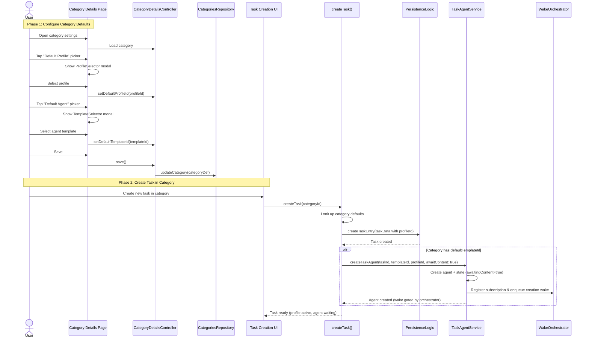
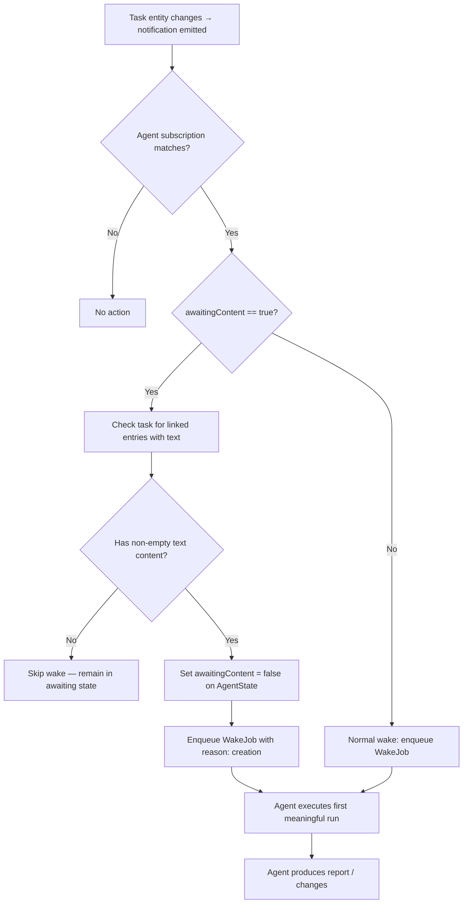
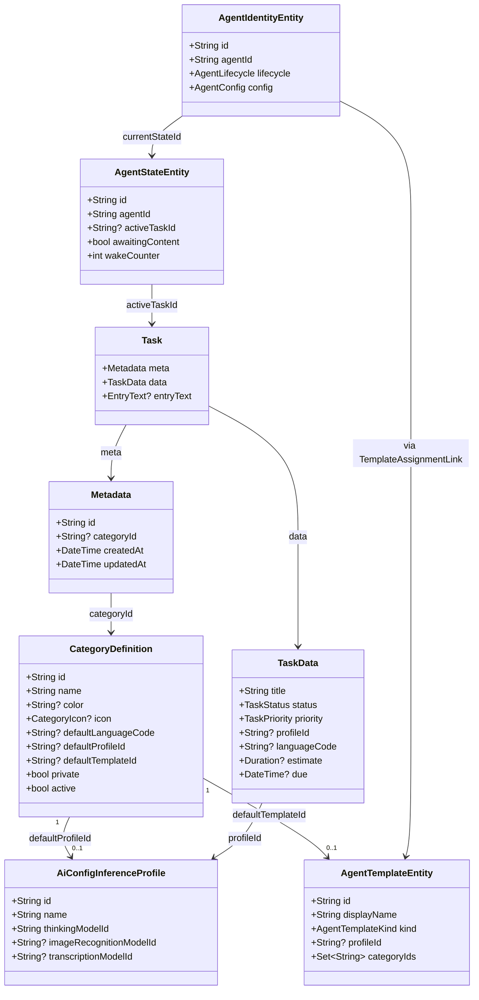

# Category Default Profiles & Agents

**Status: COMPLETE** — All 7 steps implemented and verified.

## 1. Executive Summary

This feature adds two optional fields to `CategoryDefinition` — `defaultProfileId` and `defaultTemplateId` — enabling categories to act as templates for new tasks. When a task is created in a category with defaults, it automatically inherits the profile (for immediate speech/image capabilities) and gets an agent created from the template (in a content-gated "awaiting" state).

---

## 2. Data Model Changes

### 2.1 CategoryDefinition — New Fields

**File**: `lib/classes/entity_definitions.dart`

Added to `EntityDefinition.categoryDefinition`:
```dart
String? defaultProfileId,    // → AiConfigInferenceProfile.id
String? defaultTemplateId,   // → AgentTemplateEntity.id
```

These are optional, nullable fields. No database migration is needed because categories are stored as serialized JSON in the `serialized` column — freezed handles new nullable fields gracefully (defaults to `null` on deserialization of old records).

### 2.2 TaskData — New Field

**File**: `lib/classes/task.dart`

Added to `TaskData`:
```dart
String? profileId,   // → AiConfigInferenceProfile.id (inherited from category)
```

This enables the task to carry a profile reference independently of any agent, making speech-to-text and image analysis available immediately.

### 2.3 AgentStateEntity — New Field

**File**: `lib/features/agents/model/agent_domain_entity.dart`

Added to `AgentStateEntity`:
```dart
@Default(false) bool awaitingContent,
```

When `true`, the agent's creation wake is suppressed and subscription wakes check for task content before executing.

### 2.4 Regenerate Code

Ran `make build_runner` to regenerate `*.freezed.dart` and `*.g.dart` files for the changed models.

---

## 3. Mermaid Diagrams

### 3.1 Sequence Diagram — Setting Defaults & Creating a Task



### 3.2 Flowchart — Agent Content-Gated Execution



### 3.3 Class/Data Diagram — Entity Relationships



---

## 4. Implementation Steps (Ordered)

### Step 1: Data Model Changes ✅

| File | Change | Status |
|------|--------|--------|
| `lib/classes/entity_definitions.dart` | Added `defaultProfileId`, `defaultTemplateId` to `CategoryDefinition` | Done |
| `lib/classes/task.dart` | Added `profileId` to `TaskData` | Done |
| `lib/features/agents/model/agent_domain_entity.dart` | Added `awaitingContent` to `AgentStateEntity` | Done |
| `make build_runner` | Regenerated freezed/json code | Done |

### Step 2: Category UI — Profile & Template Pickers ✅

| File | Change | Status |
|------|--------|--------|
| `lib/features/categories/ui/pages/category_details_page.dart` | Added "AI Defaults" section with Profile picker and Template picker | Done |
| `lib/features/categories/state/category_details_controller.dart` | Added `setDefaultProfileId()` and `setDefaultTemplateId()` methods, wired into `_hasChanges()` | Done |
| `lib/features/agents/ui/template_selector.dart` | New file: template selection modal (modeled after `ProfileSelector`) | Done |
| `lib/features/agents/ui/profile_selector.dart` | Added optional `hintText` parameter for context-specific hint text | Done |
| `lib/l10n/app_*.arb` | Added `categoryAiDefaultsTitle`, `categoryAiDefaultsDescription`, `categoryDefaultTemplateLabel`, `categoryDefaultTemplateHint`, `categoryDefaultProfileHint`, `categoryDefaultProfileLabel` across all 6 locales | Done |

### Step 3: Task Creation — Inherit Category Defaults ✅

| File | Change | Status |
|------|--------|--------|
| `lib/logic/create/create_entry.dart` | `createTask()`: looks up category via `EntitiesCacheService`, passes `defaultProfileId` to `TaskData.profileId` | Done |
| `lib/logic/create/create_entry.dart` | New `autoAssignCategoryAgent()`: looks up `defaultTemplateId`, creates agent via `TaskAgentService` with `awaitContent: true` | Done |
| Call sites (4 files) | Added `unawaited(autoAssignCategoryAgent(ref, task))` to all widget-context task creation sites | Done |

**Call sites updated:**
- `lib/features/journal/ui/widgets/create/create_entry_items.dart`
- `lib/features/journal/ui/pages/infinite_journal_page.dart`
- `lib/features/tasks/ui/linked_tasks/linked_tasks_header.dart`
- `lib/features/daily_os/ui/widgets/time_budget_card.dart`

**Design decision:** `createTask()` uses `EntitiesCacheService` (synchronous, via GetIt) for profile inheritance. Agent auto-creation uses `autoAssignCategoryAgent()` called from widget contexts that have `WidgetRef`, keeping Riverpod access out of the non-Riverpod `createTask()` function. `desktop_menu.dart` was intentionally left unchanged (creates tasks without `categoryId`, is a `StatelessWidget` without `ref`).

### Step 4: Agent Content-Gating Logic ✅

| File | Change | Status |
|------|--------|--------|
| `lib/features/agents/service/task_agent_service.dart` | Added `awaitContent` parameter to `createTaskAgent()`. When true: sets `awaitingContent=true`. The creation wake is always enqueued, but its execution is gated by `WakeOrchestrator` | Done |
| `lib/features/agents/wake/wake_orchestrator.dart` | Added `TaskContentChecker` callback, `_shouldSkipForAwaitingContent()` method with try-catch for resilience. Checks task content before executing wake for awaiting agents. Clears flag when content found | Done |
| `lib/features/agents/state/agent_providers.dart` | Wired `taskContentChecker` in `wakeOrchestratorProvider` using lazy `ref.read(journalDbProvider)` inside closure (avoids eager dependency) | Done |

**Key implementation detail:** The `taskContentChecker` callback resolves `journalDbProvider` lazily inside the closure (using `ref.read` instead of `ref.watch`), so the orchestrator provider doesn't eagerly depend on `journalDbProvider`. This avoids forcing all existing orchestrator tests to add a `journalDbProvider` override.

### Step 5: Profile Resolution for Tasks ✅

| File | Change | Status |
|------|--------|--------|
| `lib/features/ai/util/profile_resolver.dart` | Added `resolveByProfileId()` public method for direct profile-by-ID resolution. Refactored `_resolveFromProfile` to use shared `_buildResolvedProfile()` (DRY) | Done |
| `lib/features/ai/helpers/profile_automation_resolver.dart` | Added `TaskProfileLookup` callback. `resolveForTask()` now tries agent path first, then falls back to task-level `profileId` via callback | Done |
| `lib/features/ai/state/profile_automation_providers.dart` | Wired `taskProfileLookup` using `journalDbProvider` to look up `Task.data.profileId` | Done |

**Resolution chain:**
1. Agent path: `agentConfig.profileId → version.profileId → template.profileId → legacy modelId`
2. Task fallback: `task.data.profileId` (inherited from category at creation time)

### Step 6: Tests ✅

| Scope | Status |
|-------|--------|
| `ProfileResolver.resolveByProfileId` — 4 new tests (valid profile, not found, wrong type, skill assignments) | Done |
| `ProfileAutomationResolver` task-profile fallback — 4 new tests (falls back to task profile, prefers agent path, null profileId, unresolvable profile) | Done |
| Fixed `WakeOrchestrator` test — `_shouldSkipForAwaitingContent` wrapped in try-catch so DB errors don't block wakes | Done |
| Fixed `create_entry_test.dart` — added `EntitiesCacheService` mock registration | Done |
| Fixed `modern_create_entry_items_test.dart` — added `EntitiesCacheService` mock registration in 2 setUp blocks | Done |
| Fixed `time_budget_card_test.dart` — added `EntitiesCacheService` mock registration | Done |
| Fixed `inference_profile_form_test.dart` — no change needed (l10n string kept as-is) | Done |
| All 6,911 tests across agents/AI/categories/daily_os/journal/create pass | Verified |

### Step 7: Localization, CHANGELOG, README ✅

| Item | Status |
|------|--------|
| L10n strings added across all 6 locales (en, de, fr, es, cs, ro) | Done |
| `make l10n` and `make sort_arb_files` run | Done |
| CHANGELOG entry added under `[0.9.926]` | Done |
| `flatpak/com.matthiasn.lotti.metainfo.xml` updated | Done |
| `lib/features/categories/README.md` updated with AI Defaults section | Done |
| Implementation plan updated with final status | Done |

---

## 5. Key Design Decisions

| Decision | Rationale |
|----------|-----------|
| **Store `profileId` on `TaskData`**, not just on the agent | Enables speech-to-text and image analysis even before the agent's first run. Decouples "capability" from "agent lifecycle." |
| **Use `defaultTemplateId`** (not `defaultAgentId`) on category | Agents are per-task instances. Templates are reusable blueprints. The category stores the blueprint; each task gets its own agent instance. |
| **`awaitingContent` flag on `AgentStateEntity`** | Minimal change to existing wake infrastructure. Avoids new lifecycle states or wake reasons. Content check happens at drain time — cheap and non-invasive. |
| **No database migration needed** | Both `CategoryDefinition` and `TaskData` are stored as serialized JSON. Freezed handles new nullable fields gracefully on deserialization of existing data. |
| **Content check = "non-empty title, non-empty body text, or at least one linked entry with non-empty text"** | Covers all ways a task can gain meaningful content. The wake orchestrator already has access to journal queries. A simple existence check avoids over-engineering. |
| **Lazy `journalDbProvider` resolution** | `ref.read()` inside closures instead of `ref.watch()` at construction time. Avoids tight coupling and test override requirements for unrelated tests. |
| **Try-catch in `_shouldSkipForAwaitingContent`** | DB errors during content check shouldn't block agent wakes. Fail-open is safer than fail-closed here. |
| **`ProfileSelector.hintText` parameter** | Allows different hint text in different contexts (agent settings vs. category defaults) without changing shared l10n strings. |
| **`autoAssignCategoryAgent` as separate function** | Keeps `createTask()` Riverpod-free (uses only GetIt). Widget contexts call the agent creation separately with their `WidgetRef`. |

---

## 6. Risk Considerations

- **Orphaned agents**: If a category's default template is deleted after tasks were created, existing agents are unaffected (they reference the template by ID and have their own version snapshot). New tasks would simply skip agent creation if the template is gone.
- **Profile deletion**: If a profile referenced by `defaultProfileId` is deleted, the category picker should show "deleted" state and new tasks should gracefully handle the missing profile (skip, don't crash).
- **Backward compatibility**: All new fields are nullable with sensible defaults. Existing categories and tasks continue working unchanged.

---

## 7. Files Changed

### New Files
- `lib/features/agents/ui/template_selector.dart`

### Modified Production Files
- `lib/classes/entity_definitions.dart`
- `lib/classes/task.dart`
- `lib/features/agents/model/agent_domain_entity.dart`
- `lib/features/agents/service/task_agent_service.dart`
- `lib/features/agents/state/agent_providers.dart`
- `lib/features/agents/ui/profile_selector.dart`
- `lib/features/agents/wake/wake_orchestrator.dart`
- `lib/features/ai/helpers/profile_automation_resolver.dart`
- `lib/features/ai/state/profile_automation_providers.dart`
- `lib/features/ai/util/profile_resolver.dart`
- `lib/features/categories/state/category_details_controller.dart`
- `lib/features/categories/ui/pages/category_details_page.dart`
- `lib/features/daily_os/ui/widgets/time_budget_card.dart`
- `lib/features/journal/ui/pages/infinite_journal_page.dart`
- `lib/features/journal/ui/widgets/create/create_entry_items.dart`
- `lib/features/tasks/ui/linked_tasks/linked_tasks_header.dart`
- `lib/logic/create/create_entry.dart`

### Modified Test Files
- `test/features/ai/helpers/profile_automation_resolver_test.dart`
- `test/features/ai/util/profile_resolver_test.dart`
- `test/features/daily_os/ui/widgets/time_budget_card_test.dart`
- `test/features/journal/ui/widgets/create/modern_create_entry_items_test.dart`
- `test/logic/create/create_entry_test.dart`

### Modified L10n Files
- `lib/l10n/app_en.arb`, `app_de.arb`, `app_fr.arb`, `app_es.arb`, `app_cs.arb`, `app_ro.arb`

### Modified Documentation
- `lib/features/categories/README.md`
- `CHANGELOG.md`
- `flatpak/com.matthiasn.lotti.metainfo.xml`
