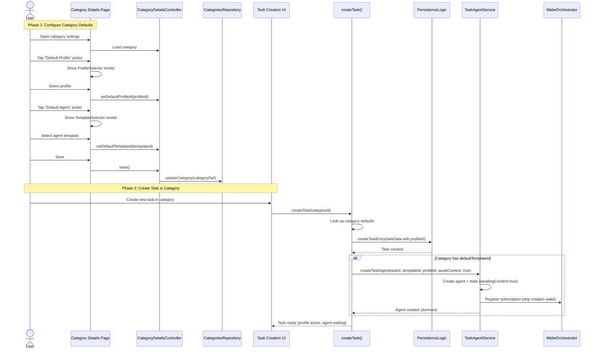
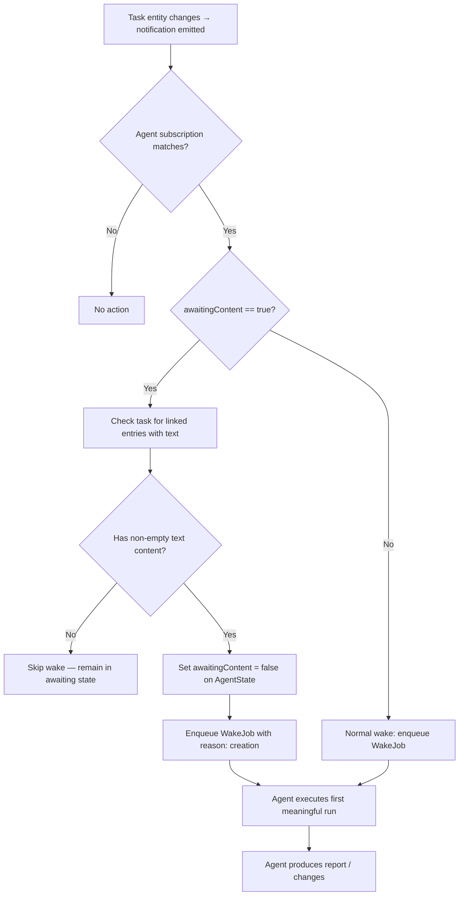
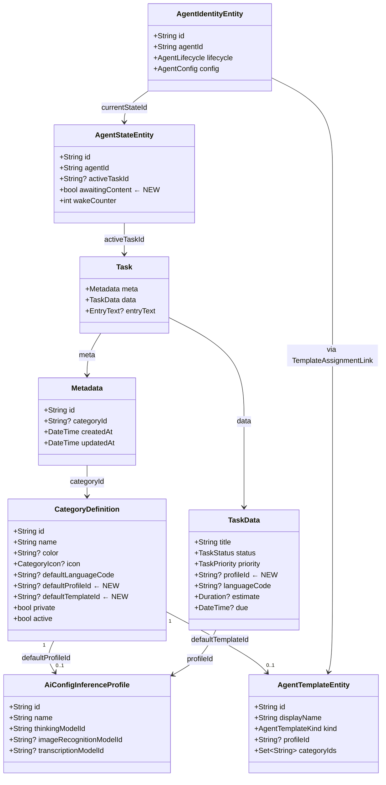

# Category Default Profiles & Agents

## 1. Executive Summary

This feature adds two optional fields to `CategoryDefinition` — `defaultProfileId` and `defaultTemplateId` — enabling categories to act as templates for new tasks. When a task is created in a category with defaults, it automatically inherits the profile (for immediate speech/image capabilities) and gets an agent created from the template (in a content-gated "awaiting" state).

---

## 2. Data Model Changes

### 2.1 CategoryDefinition — New Fields

**File**: `lib/classes/entity_definitions.dart`

Add to `EntityDefinition.categoryDefinition`:
```dart
String? defaultProfileId,    // → AiConfigInferenceProfile.id
String? defaultTemplateId,   // → AgentTemplateEntity.id
```

These are optional, nullable fields. No database migration is needed because categories are stored as serialized JSON in the `serialized` column — freezed handles new nullable fields gracefully (defaults to `null` on deserialization of old records).

### 2.2 TaskData — New Field

**File**: `lib/classes/task.dart`

Add to `TaskData`:
```dart
String? profileId,   // → AiConfigInferenceProfile.id (inherited from category)
```

This enables the task to carry a profile reference independently of any agent, making speech-to-text and image analysis available immediately.

### 2.3 AgentStateEntity — New Field

**File**: `lib/features/agents/model/agent_domain_entity.dart`

Add to `AgentStateEntity`:
```dart
@Default(false) bool awaitingContent,
```

When `true`, the agent's creation wake is suppressed and subscription wakes check for task content before executing.

### 2.4 Regenerate Code

Run `make build_runner` to regenerate `*.freezed.dart` and `*.g.dart` files for the changed models.

---

## 3. Mermaid Diagrams

### 3.1 Sequence Diagram — Setting Defaults & Creating a Task



### 3.2 Flowchart — Agent Content-Gated Execution



### 3.3 Class/Data Diagram — Entity Relationships



---

## 4. Implementation Steps (Ordered)

### Step 1: Data Model Changes
| File | Change |
|------|--------|
| `lib/classes/entity_definitions.dart` | Add `defaultProfileId`, `defaultTemplateId` to `CategoryDefinition` |
| `lib/classes/task.dart` | Add `profileId` to `TaskData` |
| `lib/features/agents/model/agent_domain_entity.dart` | Add `awaitingContent` to `AgentStateEntity` |
| Run `make build_runner` | Regenerate freezed/json code |

### Step 2: Category UI — Profile & Template Pickers
| File | Change |
|------|--------|
| `lib/features/categories/ui/pages/category_details_page.dart` | Add Profile picker and Template picker sections (reuse existing `ProfileSelector` pattern and create a new `TemplateSelector`) |
| `lib/features/categories/state/category_details_controller.dart` | Add `setDefaultProfileId()` and `setDefaultTemplateId()` methods, wire into save |
| New: `lib/features/agents/ui/template_selector.dart` | Template selection modal (modeled after `ProfileSelector`) |
| `lib/l10n/app_*.arb` | Add localized labels for the new pickers |

### Step 3: Task Creation — Inherit Category Defaults
| File | Change |
|------|--------|
| `lib/logic/create/create_entry.dart` | In `createTask()`: look up category, pass `defaultProfileId` to `TaskData`, trigger agent creation if `defaultTemplateId` set |
| `lib/logic/persistence_logic.dart` | Pass `profileId` through to `TaskData` construction |

### Step 4: Agent Content-Gating Logic
| File | Change |
|------|--------|
| `lib/features/agents/service/task_agent_service.dart` | Add `awaitContent` parameter to `createTaskAgent()`. When true: set `awaitingContent=true` on state, skip `creation` wake, still register subscription |
| `lib/features/agents/wake/wake_orchestrator.dart` | Before enqueueing a subscription wake for an agent with `awaitingContent=true`, check task content. If content found, clear flag and enqueue with `creation` reason. If not, skip |
| `lib/features/agents/repository/agent_state_repository.dart` | Add method to update `awaitingContent` flag |

### Step 5: Profile Resolution for Tasks
| File | Change |
|------|--------|
| Profile resolution chain (wherever speech-to-text / image analysis looks up the active profile) | Fall back to `task.data.profileId` when no agent profile is present. This ensures transcription/image analysis work immediately |

### Step 6: Tests
| Scope | Tests |
|-------|-------|
| Unit: `CategoryDefinition` serialization | Verify new fields serialize/deserialize, old JSON without fields deserializes to null |
| Unit: `TaskData` serialization | Same round-trip test for `profileId` |
| Unit: `createTask()` | Verify profile and agent inheritance from category defaults |
| Unit: `TaskAgentService` | Verify `awaitContent=true` skips creation wake |
| Unit: `WakeOrchestrator` | Verify content-gating: skip wake when no content, activate when content exists |
| Widget: Category details page | Verify profile/template pickers render, select, and save |
| Integration: End-to-end | Create category with defaults → create task → verify profile set, agent created in awaiting state → add content → verify agent wakes |

### Step 7: Localization & Polish
- Add all new ARB strings across all 6 locale files
- Run `make l10n` and `make sort_arb_files`
- Update `lib/features/categories/README.md`
- Add CHANGELOG entry

---

## 5. Key Design Decisions

| Decision | Rationale |
|----------|-----------|
| **Store `profileId` on `TaskData`**, not just on the agent | Enables speech-to-text and image analysis even before the agent's first run. Decouples "capability" from "agent lifecycle." |
| **Use `defaultTemplateId`** (not `defaultAgentId`) on category | Agents are per-task instances. Templates are reusable blueprints. The category stores the blueprint; each task gets its own agent instance. |
| **`awaitingContent` flag on `AgentStateEntity`** | Minimal change to existing wake infrastructure. Avoids new lifecycle states or wake reasons. Content check happens at subscription match time — cheap and non-invasive. |
| **No database migration needed** | Both `CategoryDefinition` and `TaskData` are stored as serialized JSON. Freezed handles new nullable fields gracefully on deserialization of existing data. |
| **Content check = "at least one linked entry with non-empty text"** | Aligns with the stated requirement. The wake orchestrator already has access to journal queries. A simple existence check avoids over-engineering. |

---

## 6. Risk Considerations

- **Orphaned agents**: If a category's default template is deleted after tasks were created, existing agents are unaffected (they reference the template by ID and have their own version snapshot). New tasks would simply skip agent creation if the template is gone.
- **Profile deletion**: If a profile referenced by `defaultProfileId` is deleted, the category picker should show "deleted" state and new tasks should gracefully handle the missing profile (skip, don't crash).
- **Backward compatibility**: All new fields are nullable with sensible defaults. Existing categories and tasks continue working unchanged.
