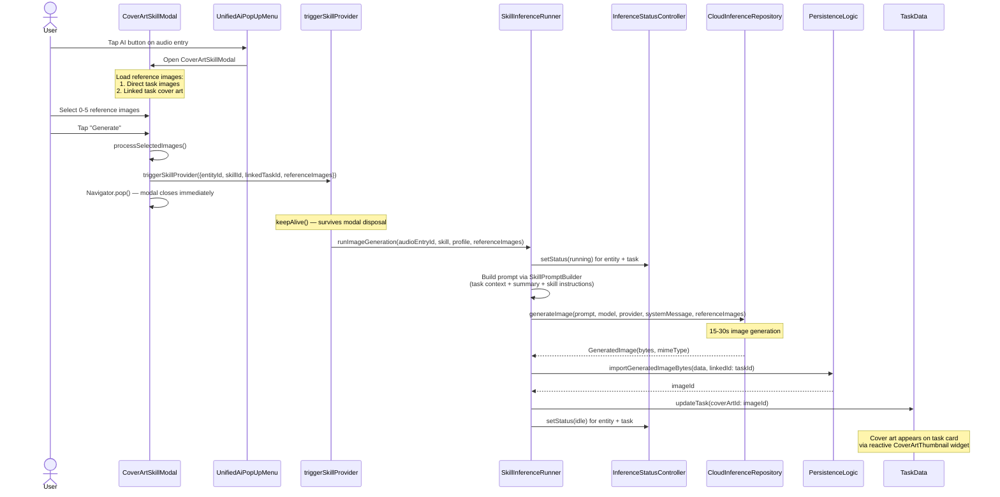
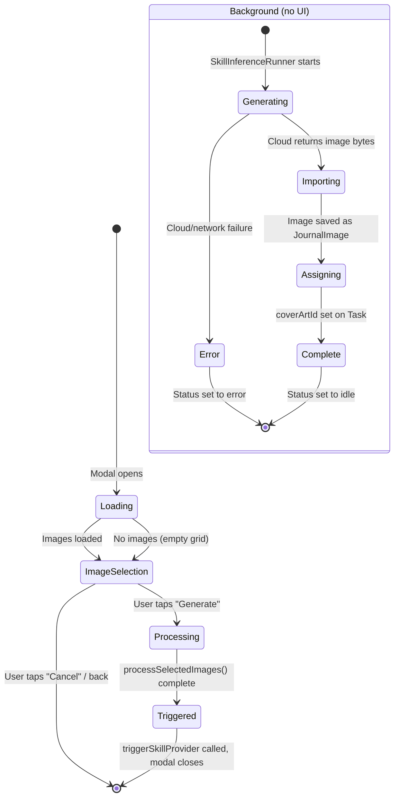
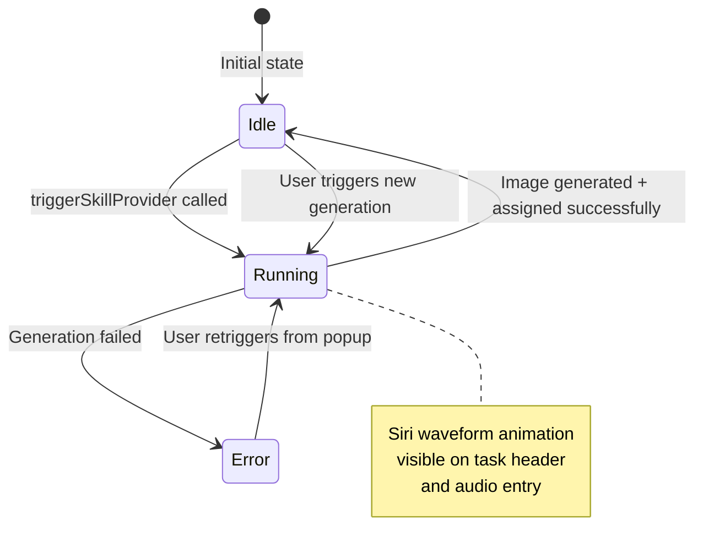
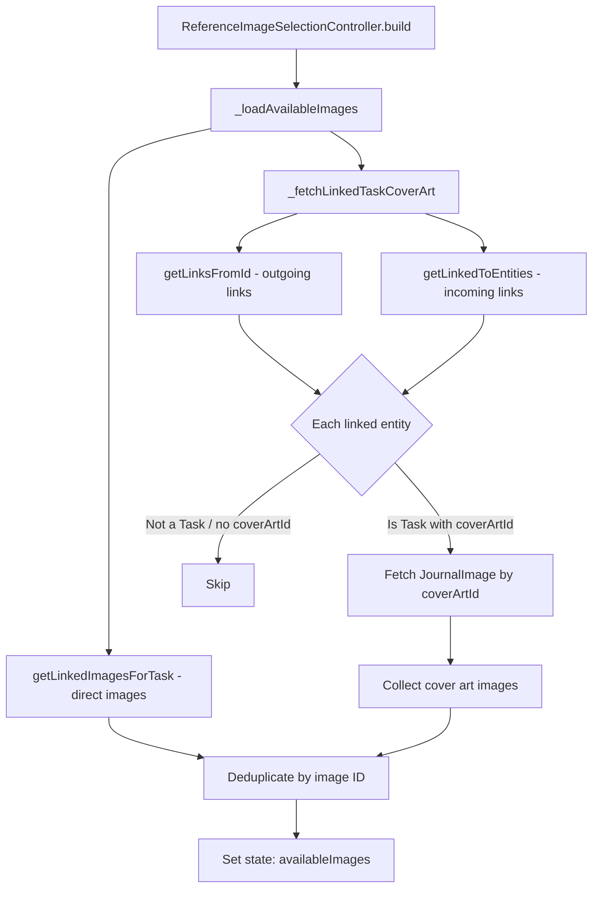

# Cover Art as a Manual Skill with Background Processing

**Date:** 2026-03-15
**Status:** Proposed
**Branch:** `feat/cover_art_skill`
**Related:** PR #2799 (coding prompt skill), PR #2797 (inference profiles), PR #2798 (legacy prompt removal)

## Problem

The current cover art generation workflow forces users to keep a modal open while the image
generates. The `ImageGenerationReviewModal` blocks interaction until the AI returns an image,
then requires an explicit "Accept" click. This creates unnecessary friction:

1. **Synchronous wait**: Users stare at a spinner for 15-30 seconds.
2. **Manual accept step**: After generation, users must click "Accept" before the image becomes
   cover art. This extra confirmation adds no real value — users can always delete or change
   cover art later.
3. **Not a skill**: Image generation is still routed through the legacy `PreconfiguredPrompt` path
   (`coverArtGenerationPrompt`) rather than the new skill system. The seeded skill
   `skillImageGenId` exists in `SkillSeedingService` but is not wired into `triggerSkillProvider`.
4. **Reference images limited to direct children**: The reference image picker only queries images
   directly linked to the current task, missing cover art from related tasks in the task graph.

## Goals

1. **Fire-and-forget**: Trigger generation, close the modal immediately, image auto-assigns on
   completion.
2. **Skill-based**: Route through `triggerSkillProvider` → `SkillInferenceRunner` like transcription
   and prompt generation.
3. **Linked-task cover art as references**: Auto-discover cover art from linked tasks and present
   them alongside directly-linked images.
4. **Increase reference limit**: From 3 to 5 images.
5. **Themed default prompt**: Default visual theme of a "default visual being summoned from a bottle
   to paint."

### Out of scope (follow-up tasks)

- **In-app notification** when background generation completes. Currently the cover art will simply
  appear on the task card; a toast/snackbar notification is a natural follow-up.
- **Retry/regenerate from task header**: If the generated image is unsatisfactory, the user deletes
  it via the existing "Set Cover Art" action item and triggers generation again.

---

## Architectural Overview

### How the skill system works today

```text
┌─────────────────────────────────────────────────────────────────┐
│                       UnifiedAiPopUpMenu                        │
│  Shows skills + legacy prompts for a given JournalEntity        │
├──────────────────┬──────────────────────────────────────────────┤
│  Skills section  │  Legacy Prompts section                      │
│  (onSkillSelected│  (onPromptSelected → triggerNewInference)    │
│   → triggerSkill)│                                              │
└────────┬─────────┴──────────────────────────────────────────────┘
         │
         ▼
   triggerSkillProvider (fire-and-forget, keepAlive)
         │
         ├── Resolve skill config by ID
         ├── Resolve profile via ProfileAutomationResolver
         └── Route to SkillInferenceRunner by skillType:
              ├── transcription  → runTranscription()
              ├── imageAnalysis  → runImageAnalysis()
              └── promptGeneration → runPromptGeneration()
              (imageGeneration is NOT handled yet — this is what we add)
```

### Key files involved

| Area | File | Role |
|------|------|------|
| Skill definition | `lib/features/ai/util/skill_seeding_service.dart` | `skillImageGenId` already seeded |
| Skill types | `lib/features/ai/state/consts.dart` | `SkillType.imageGeneration` exists |
| Skill filter | `lib/features/ai/state/unified_ai_controller.dart` | `availableSkillsForEntityProvider` — currently excludes `imageGeneration` |
| Trigger routing | `lib/features/ai/state/unified_ai_controller.dart` | `triggerSkillProvider` — no `imageGeneration` case |
| Inference runner | `lib/features/ai/services/skill_inference_runner.dart` | Needs new `runImageGeneration()` method |
| Image gen state | `lib/features/ai/state/image_generation_controller.dart` | Current controller — will be consumed by the runner |
| Reference images | `lib/features/ai/state/reference_image_selection_controller.dart` | Needs linked-task cover art discovery |
| Image processing | `lib/features/ai/util/image_processing_utils.dart` | `kMaxReferenceImages` = 3 → 5 |
| Review modal | `lib/features/ai/ui/image_generation/image_generation_review_modal.dart` | Rework into selection-only modal |
| Popup menu | `lib/features/ai/ui/unified_ai_popup_menu.dart` | Route image gen skill through new flow |
| Cover art assignment | `lib/features/ai/ui/image_generation/image_generation_review_modal.dart` | `_setCoverArtForTask` — move to runner |
| Preconfigured prompt | `lib/features/ai/util/preconfigured_prompts.dart` | `coverArtGenerationPrompt` — keep as reference, skill instructions take over |
| Action items | `lib/features/journal/ui/widgets/entry_details/header/modern_action_items.dart` | `ModernGenerateCoverArtItem` — update to use skill path |

---

## Detailed Workflow

### Phase 1: Wire `imageGeneration` into the skill trigger pipeline

**1a. Add `imageGeneration` to supported skill types in `availableSkillsForEntityProvider`**

In `unified_ai_controller.dart`, the `supportedTypes` set currently excludes `imageGeneration`.
Add it:

```dart
const supportedTypes = {
  SkillType.transcription,
  SkillType.imageAnalysis,
  SkillType.promptGeneration,
  SkillType.imageGeneration,  // NEW
};
```

The `imageGeneration` skill has `requiredInputModalities: [Modality.text]`, so it will match any
entity type with text content. In practice it appears on audio entries that are linked to tasks
(same as today), because the popup menu is shown on those entries.

**1b. Add routing in `triggerSkillProvider`**

Add a new `case SkillType.imageGeneration` that calls the new runner method (see 1c).

The trigger needs additional data that other skills don't: **reference images**. We handle this by
passing reference images as an optional parameter in `TriggerSkillParams`:

```dart
typedef TriggerSkillParams = ({
  String entityId,
  String skillId,
  String? linkedTaskId,
  List<ProcessedReferenceImage>? referenceImages,  // NEW — only for imageGeneration
});
```

**1c. Add `runImageGeneration()` to `SkillInferenceRunner`**

New method following the same pattern as `runTranscription` / `runImageAnalysis`:

1. Set inference status to `running` for both entity and linked task.
2. Fetch audio entity (for transcript / voice description context).
3. Build prompt via `SkillPromptBuilder` (skill instructions + task context + summary).
4. Resolve image generation provider and model from the `ResolvedProfile`.
5. Call `CloudInferenceRepository.generateImage()` with prompt, system message, and reference images.
6. On success:
   a. Import image bytes as `JournalImage` linked to the task.
   b. Set as cover art on the task (`TaskData.copyWith(coverArtId: imageId)`).
   c. Set inference status to `idle`.
7. On error: set inference status to `error`, log via `LoggingService`.

This is the critical change that enables background processing — the method runs inside a
`keepAlive` provider and doesn't require any UI to remain open.

### Phase 2: Reference image selection with linked-task cover art

**2a. Increase `kMaxReferenceImages` from 3 to 5**

In `image_processing_utils.dart`:
```dart
const kMaxReferenceImages = 5;  // was 3
```

**2b. Add linked-task cover art discovery**

In `ReferenceImageSelectionController._loadAvailableImages()`, after fetching directly-linked
images, also traverse linked tasks:

```dart
Future<void> _loadAvailableImages() async {
  final journalRepository = ref.read(journalRepositoryProvider);

  // 1. Directly linked images (existing behavior)
  final directImages = await journalRepository.getLinkedImagesForTask(taskId);

  // 2. Cover art from linked tasks (NEW)
  final linkedTaskCoverArt = await _fetchLinkedTaskCoverArt(journalRepository);

  // Deduplicate (a directly linked image might also be a linked task's cover art)
  final seen = <String>{};
  final combined = <JournalImage>[];
  for (final img in [...directImages, ...linkedTaskCoverArt]) {
    if (seen.add(img.meta.id)) combined.add(img);
  }

  state = state.copyWith(availableImages: combined, isLoading: false);
}
```

The `_fetchLinkedTaskCoverArt` method:
1. Get outgoing links from the task via `journalRepository.getLinksFromId(taskId)`.
2. Get incoming links via `journalRepository.getLinkedToEntities(toId: taskId)`.
3. For each linked entity that is a `Task` with a non-null `coverArtId`, fetch the `JournalImage`.
4. Return the list of cover art images.

**2c. UI indication for cover art images**

In `ReferenceImageSelectionWidget`, mark images that come from linked tasks with a small
link icon overlay, so users understand why those images appear.

### Phase 3: Convert the modal to selection-only + fire-and-forget

**3a. Rework `ImageGenerationReviewModal` → `CoverArtSkillModal`**

The new modal has a single step: reference image selection.

Flow:
1. Open modal → show reference image grid (linked images + linked-task cover art).
2. User selects 0-5 reference images.
3. User taps "Generate" → modal processes selected images, fires `triggerSkillProvider`, and
   **closes immediately**.
4. No generating/success/error states in the modal — those are handled by the background runner
   and `InferenceStatusController` (which drives the existing Siri waveform animation on the
   task header).

**3b. Update `UnifiedAiPopUpMenu` routing**

Currently, image generation skills are routed to `ImageGenerationReviewModal`. Change to:
- When `onSkillSelected` is called with an `imageGeneration` skill, open the new
  `CoverArtSkillModal` instead of firing `triggerSkillProvider` immediately (because we need the
  reference image selection step first).
- The modal itself calls `triggerSkillProvider` with the selected reference images.

**3c. Update `ModernGenerateCoverArtItem`**

The action item in `modern_action_items.dart` currently opens `ImageGenerationReviewModal`.
Update to open `CoverArtSkillModal` instead.

### Phase 4: Default prompt theme

Update the skill's `userInstructions` in `skill_seeding_service.dart` to include the visual theme:

```text
Default visual theme (use when the user provides no specific direction):
A whimsical default visual character being summoned from an ornate bottle,
floating above a canvas and painting the task's visual story. The genie
should reflect the emotional tone of the task.
```

This only affects new installs (seeding is idempotent). Existing users keep their current skill
instructions, which they can edit in the skill settings UI.

Also update `coverArtGenerationPrompt` in `preconfigured_prompts.dart` for consistency, though
this path will become unused once the migration is complete.

---

## Sequence Diagram: Background Cover Art Generation



## State Diagram: Modal Lifecycle



## State Diagram: Inference Status Feedback



---

## Linked-Task Cover Art Discovery: Flow



---

## Implementation Checklist

### Phase 1: Skill pipeline wiring
- [x] Add `SkillType.imageGeneration` to `supportedTypes` in `availableSkillsForEntityProvider`
- [x] Extend `TriggerSkillParams` with optional `referenceImages` field
- [x] Add `case SkillType.imageGeneration` in `triggerSkillProvider` switch
- [x] Implement `SkillInferenceRunner.runImageGeneration()`:
  - Prompt building via `SkillPromptBuilder`
  - Image generation via `CloudInferenceRepository`
  - Auto-import via `importGeneratedImageBytes`
  - Auto-assign cover art via `PersistenceLogic.updateTask`
  - Status tracking via `InferenceStatusController`
- [x] Add `SkillPromptBuilder` support for `SkillType.imageGeneration` context injection
- [x] Resolve image generation provider/model from `ResolvedProfile` (already present)

### Phase 2: Reference image enhancements
- [x] Change `kMaxReferenceImages` from 3 to 5
- [x] Implement `_fetchLinkedTaskCoverArt()` in `ReferenceImageSelectionController`
- [x] Deduplicate direct images and linked-task cover art
- [x] Add link icon overlay for linked-task cover art in `ReferenceImageSelectionWidget`
- [x] Update `ReferenceImageSelectionState` with `linkedTaskImageIds` to track image source

### Phase 3: UI conversion
- [x] Create `CoverArtSkillModal` (selection-only, fire-and-forget with progress view)
- [x] Update `UnifiedAiPopUpMenu.onSkillSelected` to open `CoverArtSkillModal` for image gen skills
- [x] Update `ModernGenerateCoverArtItem` to use the new modal
- [x] Remove legacy `ImageGenerationReviewModal` and `ImageGenerationController`
- [x] Mark `AiResponseType.imageGeneration` as `isLegacyType` to filter from prompt list

### Phase 4: Prompt theme
- [x] Update `skillImageGenId` user instructions in `skill_seeding_service.dart`

### Phase 5: Testing
- [x] Unit test `SkillInferenceRunner.runImageGeneration()` (success, error, unmount safety)
- [x] Unit test linked-task cover art discovery in `ReferenceImageSelectionController`
- [x] Unit test `kMaxReferenceImages` = 5 enforcement
- [x] Widget test `CoverArtSkillModal` (selection, fire-and-forget trigger, progress view)
- [x] Widget test `UnifiedAiPopUpMenu` image generation skill routing
- [x] Unit test `triggerSkillProvider` image generation routing
- [ ] Integration test: end-to-end skill trigger → cover art assignment *(deferred — requires device)*

### Localization
- [x] Added `coverArtGenerationComplete` and `coverArtGenerationDismissHint` keys in all locale ARB files
- [x] Added `linkedTaskImageBadge` key for accessibility on linked-task cover art badge
- [x] Updated `referenceImageSelectionSubtitle` from "3" to "5" in all locales
- [x] Existing labels (`referenceImageContinue`, `referenceImageSkip`, etc.) cover the modal

### Documentation
- [x] Update `lib/features/ai/README.md` — updated with cover art skill details
- [x] Add CHANGELOG entry under 0.9.924
- [x] Update `flatpak/com.matthiasn.lotti.metainfo.xml`

---

## Risk Assessment

| Risk | Mitigation |
|------|-----------|
| Provider disposed mid-generation after modal closes | `keepAlive()` pattern already used by `triggerSkillProvider`; `ref.mounted` checks in runner |
| No visual feedback during background generation | Existing `InferenceStatusController` drives waveform animation on task header |
| Linked-task cover art query adds latency to modal open | Query is async in `_loadAvailableImages`; modal shows loading state while fetching |
| Seeding update doesn't affect existing users | Idempotent seeding skips existing skills; note in release notes that users can manually update instructions |
| Reference image limit increase could increase API payload | 5 images at 2000px max / JPEG 85 is still well within Gemini's limits |

## Follow-up Tasks

- **In-app notification**: Add a toast/snackbar when background generation completes ("Cover art
  ready for [Task Name]"). This requires a notification infrastructure that doesn't exist yet.
- **Retry from task header**: Consider a small "regenerate" action directly on the cover art
  display, without needing to navigate to an audio entry.
- **Remove legacy `coverArtGenerationPrompt`**: Once all image generation goes through the skill
  path, the preconfigured prompt can be removed along with the legacy prompt infrastructure.
