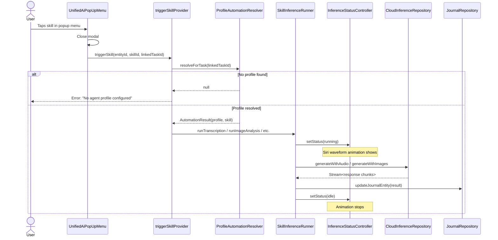
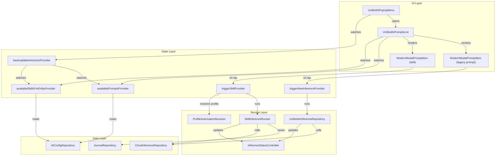

# Plan: Legacy Prompt Removal & Skill-Based AI Popup Menu

## Context

PR #2797 merged the inference provider profiles infrastructure (`AiConfigInferenceProfile`, `AiConfigSkill`, `SkillAssignment`). The goal now is to perform a "surgical incision" to:
1. Remove legacy automatic prompt triggering
2. Surface skills in the AI popup menu for manual triggering
3. Add running feedback for skill-based inference
4. Keep legacy prompts accessible but labeled as such

## Decision Log
- **No profile → show error**: When a skill is tapped but no agent/profile is found, show an error message
- **Remove category Automatic Prompts section**: Remove from UI entirely (data stays in DB)
- **Remove legacy fallback**: Only profile-driven automation runs automatically
- **Don't delete existing prompts from DB**: Just stop seeding ASR prompts for new installs
- **Skill inference feedback**: Have SkillInferenceRunner update existing InferenceStatusController

---

## Architecture Diagrams

### Automatic Prompt Trigger: Before & After Legacy Removal

```mermaid
flowchart TD
    subgraph "BEFORE (current)"
        A1[Recording completed] --> B1{linkedTaskId?}
        B1 -->|yes| C1[ProfileAutomationService.tryTranscribe]
        C1 -->|handled| D1[SkillInferenceRunner.runTranscription]
        C1 -->|not handled / error| E1[Legacy path: category auto-prompts]
        B1 -->|no| E1
        E1 --> F1{category has auto-prompts?}
        F1 -->|yes| G1[PromptCapabilityFilter.getFirstAvailablePrompt]
        G1 -->|found| H1[triggerNewInferenceProvider]
        G1 -->|not found| I1[Log: no available prompts]
        F1 -->|no| I1
    end

    subgraph "AFTER (this PR)"
        A2[Recording completed] --> B2{linkedTaskId?}
        B2 -->|yes| C2[ProfileAutomationService.tryTranscribe]
        C2 -->|handled| D2[SkillInferenceRunner.runTranscription]
        C2 -->|not handled / error| E2[Log and return — no fallback]
        B2 -->|no| E2
    end
```



### Image Analysis Trigger: Before & After

```mermaid
flowchart TD
    subgraph "BEFORE (current)"
        IA1[Image imported] --> IB1{linkedTaskId?}
        IB1 -->|yes| IC1[ProfileAutomationService.tryAnalyzeImage]
        IC1 -->|handled| ID1[SkillInferenceRunner.runImageAnalysis]
        IC1 -->|not handled / error| IE1[Legacy path: category auto-prompts]
        IB1 -->|no| IE1
        IE1 --> IF1{category has image analysis prompts?}
        IF1 -->|yes| IG1[PromptCapabilityFilter.getFirstAvailablePrompt]
        IG1 -->|found| IH1[triggerNewInferenceProvider]
        IG1 -->|not found| II1[Log: no available prompts]
        IF1 -->|no| II1
    end

    subgraph "AFTER (this PR)"
        IA2[Image imported] --> IB2{linkedTaskId?}
        IB2 -->|yes| IC2[ProfileAutomationService.tryAnalyzeImage]
        IC2 -->|handled| ID2[SkillInferenceRunner.runImageAnalysis]
        IC2 -->|not handled / error| IE2[Log and return — no fallback]
        IB2 -->|no| IE2
    end
```



### Skill Triggering Sequence (Popup Menu → Inference)



### Component Relationships: Popup Menu Providers



---

## Step 1: Remove Legacy Automatic Prompt Fallback

**Files to modify:**
- `lib/features/speech/helpers/automatic_prompt_trigger.dart`
- `lib/features/ai/helpers/automatic_image_analysis_trigger.dart`

**Changes:**
- Remove the entire "Legacy path" code block (lines 78-143 in automatic_prompt_trigger.dart, lines 83-129 in automatic_image_analysis_trigger.dart)
- Keep only the profile-driven path
- When no profile handles it, log and return (no fallback)
- Remove imports for `PromptCapabilityFilter`, `triggerNewInferenceProvider`, `AiResponseType` if now unused

---

## Step 2: Remove Automatic Prompts Section from Category Details

**Files to modify:**
- `lib/features/categories/ui/pages/category_details_page.dart` — Remove the "Automatic Prompts" `LottiFormSection` block and `_buildAutomaticPromptSettings()` / `_buildAutomaticPromptConfig()` methods, and the `_dummyAutomaticPromptChanged` callback
- `lib/features/categories/ui/widgets/category_automatic_prompts.dart` — Delete file (unused after removal)
- Remove import of `category_automatic_prompts.dart` from category_details_page

**Keep intact:**
- `CategoryDetailsController.updateAutomaticPrompts()` — data model field stays
- `CategoryDefinition.automaticPrompts` field — backward compatibility
- `_hasMapChanges()` in controller — still needed for the field

---

## Step 3: Add Skill Inference Status Feedback

**Files to modify:**
- `lib/features/ai/services/skill_inference_runner.dart`
- `lib/features/ai/state/consts.dart` (add SkillType → AiResponseType mapping)

**Changes:**
- Add a `SkillType` → `AiResponseType` mapping extension on `SkillType`:
  ```dart
  extension SkillTypeToResponseType on SkillType {
    AiResponseType get toResponseType => switch (this) {
      SkillType.transcription => AiResponseType.audioTranscription,
      SkillType.imageAnalysis => AiResponseType.imageAnalysis,
      SkillType.imageGeneration => AiResponseType.imageGeneration,
      SkillType.promptGeneration => AiResponseType.promptGeneration,
      SkillType.imagePromptGeneration => AiResponseType.imagePromptGeneration,
    };
  }
  ```
- Make `SkillInferenceRunner` accept a `Ref` (or pass `InferenceStatusController` callbacks) so it can update status to `running`/`idle`/`error`
- In `runTranscription()` and `runImageAnalysis()`: set `InferenceStatus.running` at start, `idle` on success, `error` on failure
- This enables the existing `AiRunningAnimationWrapper` (Siri waveform) to show on entries during skill inference

---

## Step 4: Add Skills to AI Popup Menu

### 4a: Create `availableSkillsForEntityProvider`

**New provider in:** `lib/features/ai/state/unified_ai_controller.dart`

Logic:
1. Get entity type (JournalAudio, JournalImage, Task)
2. Fetch all skills via `aiConfigRepositoryProvider.getConfigsByType(AiConfigType.skill)`
3. Filter skills by `requiredInputModalities` matching entity type:
   - `Modality.audio` → entity must be `JournalAudio`
   - `Modality.image` → entity must be `JournalImage`
   - `Modality.text` → entity can be `Task` or any type with a linked task
4. For skills with `contextPolicy != none`, check if entity has a linked task
5. Return filtered `List<AiConfigSkill>`

### 4b: Create `triggerSkillProvider`

**New provider in:** `lib/features/ai/state/unified_ai_controller.dart` (or new file)

Logic:
1. Accept `(entityId, skillId, linkedTaskId)` params
2. Resolve profile via `ProfileAutomationResolver.resolveForTask(linkedTaskId)`
3. If no profile found → throw with user-friendly error message ("No agent profile configured for this task")
4. Build `AutomationResult` with the resolved profile and skill
5. Route to appropriate `SkillInferenceRunner` method based on `skill.skillType`:
   - `transcription` → `runTranscription()`
   - `imageAnalysis` → `runImageAnalysis()`
   - `promptGeneration` → new `runPromptGeneration()` method
   - `imageGeneration` → route to existing `ImageGenerationReviewModal`
   - `imagePromptGeneration` → new `runImagePromptGeneration()` method

### 4c: Extend `SkillInferenceRunner` with new methods

**File:** `lib/features/ai/services/skill_inference_runner.dart`

Add:
- `runPromptGeneration()` — builds prompt from audio transcript + task context, saves result as generated prompt
- `runImagePromptGeneration()` — similar but for image prompt generation

These mirror the existing prompt-based flow but use skill instructions instead.

### 4d: Refactor `UnifiedAiPromptsList` for two sections

**File:** `lib/features/ai/ui/unified_ai_popup_menu.dart`

Changes:
- Watch both `availableSkillsForEntityProvider` and `availablePromptsProvider`
- Build two sections:
  1. **"Skills" section** (top): List of `AiConfigSkill` items using `ModernModalPromptItem`
     - Icon based on `skillType` (mic for transcription, image for imageAnalysis, etc.)
     - No `isDefault` styling (skills are always manually triggered from popup)
     - On tap: call `triggerSkillProvider`
  2. **"Legacy Prompts" section** (bottom): Existing prompt list with a "Legacy" header/divider
     - Keep existing behavior
     - Add a subtle section label like "Legacy Prompts" in small text

- Update `hasAvailablePromptsProvider` to also check for available skills (show popup icon when either skills or prompts are available)

### 4e: Handle special skill types in popup

- **Image Generation (Cover Art)**: On tap, open `ImageGenerationReviewModal` (existing flow) but resolved via skill/profile instead of legacy prompt
- **Prompt Generation (Coding Prompt)**: On tap, trigger inference and show progress (similar to legacy prompt flow but via skill runner)

---

## Step 5: Stop Seeding ASR Legacy Prompts

**File:** `lib/features/ai/util/preconfigured_prompts.dart`

**Changes:**
- Remove `audio_transcription` and `audio_transcription_task_context` entries from the `preconfiguredPrompts` map
- Keep the `PreconfiguredPrompt` class and remaining entries
- Existing user prompts in the DB remain untouched

---

## Step 6: Localization

**Files:** `lib/l10n/app_*.arb`

New keys needed:
- `skillsSectionTitle` → "Skills" (section header in popup)
- `legacyPromptsSectionTitle` → "Legacy Prompts" (section header in popup)
- `noAgentProfileError` → "No agent profile configured for this task. Assign an agent with a profile first."
- `skillRunningLabel` → "Running..." (if needed for progress)

---

## Step 7: Update `hasAvailablePromptsProvider`

**File:** `lib/features/ai/state/unified_ai_controller.dart`

Rename to `hasAvailableAiActionsProvider` (or keep name but update logic):
- Return `true` if either skills or prompts are available for the entity
- This ensures the AI assistant icon shows in the toolbar when skills are available even if no legacy prompts exist

---

## Files Summary

| File | Action |
|------|--------|
| `lib/features/speech/helpers/automatic_prompt_trigger.dart` | Remove legacy fallback path |
| `lib/features/ai/helpers/automatic_image_analysis_trigger.dart` | Remove legacy fallback path |
| `lib/features/categories/ui/pages/category_details_page.dart` | Remove Automatic Prompts section |
| `lib/features/categories/ui/widgets/category_automatic_prompts.dart` | Delete file |
| `lib/features/ai/services/skill_inference_runner.dart` | Add status updates, new skill methods |
| `lib/features/ai/state/consts.dart` | Add SkillType → AiResponseType mapping |
| `lib/features/ai/state/unified_ai_controller.dart` | Add skill providers, update visibility |
| `lib/features/ai/ui/unified_ai_popup_menu.dart` | Split into Skills + Legacy sections |
| `lib/features/ai/util/preconfigured_prompts.dart` | Remove ASR prompt templates |
| `lib/l10n/app_*.arb` | Add new localization keys |

---

## Verification

1. **Analyzer**: Run `dart-mcp.analyze_files` — must be zero warnings
2. **Formatter**: Run `dart-mcp.dart_format`
3. **Existing tests**: Run tests for modified files:
   - `test/features/speech/helpers/automatic_prompt_trigger_test.dart`
   - `test/features/ai/helpers/automatic_image_analysis_trigger_test.dart`
   - `test/features/ai/ui/unified_ai_popup_menu_test.dart`
   - `test/features/ai/services/skill_inference_runner_test.dart`
   - `test/features/categories/ui/pages/category_details_page_test.dart`
   - `test/features/categories/ui/widgets/category_automatic_prompts_test.dart`
4. **New tests**: Add tests for:
   - `availableSkillsForEntityProvider` filtering logic
   - `triggerSkillProvider` profile resolution and error handling
   - Popup menu rendering with both sections
5. **Manual verification**: Build and run the app, verify:
   - AI popup shows Skills section (top) and Legacy section (bottom)
   - Tapping a skill triggers inference with Siri waveform feedback
   - Automatic transcription/analysis still works via profile-driven path
   - Legacy prompts are still accessible manually
   - Category details page no longer shows Automatic Prompts section

## Implementation Order

1. Step 3 (inference status feedback) — foundational, no breaking changes
2. Step 1 (remove legacy fallback) — clean break from old system
3. Step 2 (remove category auto-prompts UI) — UI cleanup
4. Step 5 (stop seeding ASR prompts) — simple removal
5. Step 4 (popup menu refactor) — the main UI feature, builds on steps 1-3
6. Step 6 (localization) — needed for step 5
7. Step 7 (visibility provider update) — final polish
