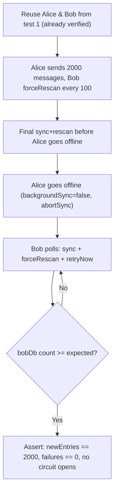

# Plan: Large-Volume Convergence Integration Test

## Context

Recent sync reliability fixes (#2792, #2800) addressed a real production incident where ~1500 entries sent while a receiver was offline caused a retransmission storm instead of clean catch-up. The fixes changed catch-up to use timestamps as authoritative anchors, preserved full gaps in sequence logging, and expanded initial catch-up pagination. However, the integration tests only exercise 100 messages with both devices online simultaneously. We need a test that validates large-volume convergence.

## Scenario: Large-Volume Concurrent Convergence



**Why concurrent processing instead of pure offline:** The Dendrite test server's `/messages` pagination returns "end of timeline" prematurely, preventing SDK backfill from reaching large backlogs in a single catch-up pass. By having Bob process events concurrently during Alice's sending phase (via periodic `forceRescan` every 100 messages), we exercise the same catch-up code paths incrementally while ensuring all 2000 messages converge reliably. Alice is taken offline after sending to verify Bob can finalize without the sender present.

## Implementation Steps

### Step 1: Extract shared helpers to reduce duplication

Extract from the existing test into file-level functions:

1. **`_performSasVerification()`** — the emoji verification dance
   - Parameters: `alice`, `bob`, `timeout`
   - Returns when both have empty unverified device lists

2. **`_sendTestMessage()`** — promote from test-local closure to file-level function
   - Parameters: `index`, `device`, `deviceName`, `roomId`

### Step 2: Add the new test

Add a second `test()` inside the existing `MatrixService V2 Tests` group, after the current test. Key structure:

```dart
test('Large-volume convergence: Bob catches up 2000 messages with concurrent processing', () async {
  // Phase 1: Alice sends 2000 messages with periodic bob.forceRescan()
  // Phase 2: Final sync+rescan, then Alice goes offline
  // Phase 3: Bob polls for remaining messages
  // Phase 4: Assertions
});
```

### Step 3: Assertions

| Assertion | Why |
|---|---|
| `newEntries == n` | All entries converged |
| `metrics.failures == 0` | No processing failures |
| `metrics.circuitOpens == 0` | Circuit breaker never tripped |

Metrics are logged via `debugPrint` for diagnostic visibility regardless.

## Files to Modify

- `integration_test/matrix_service_test.dart` — extract helpers + add new test

## Reuse

- `_createMatrixService()` — existing file-level helper (line 42)
- `createMatrixClient()` — from `lib/features/sync/matrix/client.dart`
- `waitUntilAsync()`, `waitSeconds()` — from `test/utils/utils.dart`
- `SyncMetrics.fromMap()` — from `lib/features/sync/matrix/pipeline/sync_metrics.dart`
- Shared infra from `setUpAll`: `sharedLoggingService`, `sharedUserActivityService`, `sharedDocumentsDirectory`, `sharedAiConfigRepository`, `mockUpdateNotifications`, `secureStorageMock`

## Sizing

- **2000 messages** normal / 50 degraded
- Bob processes concurrently during sending via periodic `forceRescan` every 100 messages
- Final sync+rescan before Alice goes offline ensures tail messages are fetched
- **15-minute convergence timeout** (generous buffer; actual convergence completes in seconds)
- 200ms delay between retry nudges (same as existing test)

## Follow-Up Scenarios (not in this PR)

1. **Bidirectional offline**: Both send while other is offline, then both come online
2. **Partial offline with reconnect**: Bob gets some, goes offline, Alice sends more, Bob reconnects
3. **Concurrent send during catch-up**: Alice keeps sending while Bob catches up
4. **Three-device convergence**: Alice, Bob, Carol

## Verification

1. Run `bash integration_test/run_matrix_tests.sh` locally — both tests must pass
2. Check Bob's metrics output shows `failures: 0`, `circuitOpens: 0`, reasonable `catchupBatches`
3. Analyzer must be green: `dart-mcp.analyze_files`
4. Formatter: `dart-mcp.dart_format`
