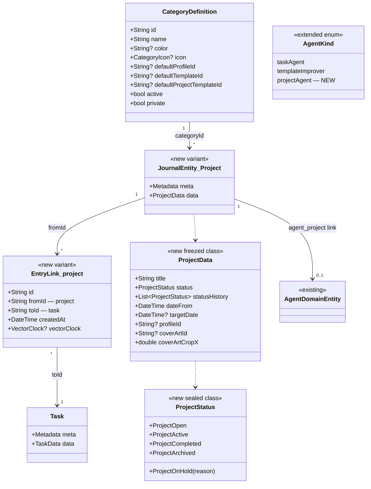
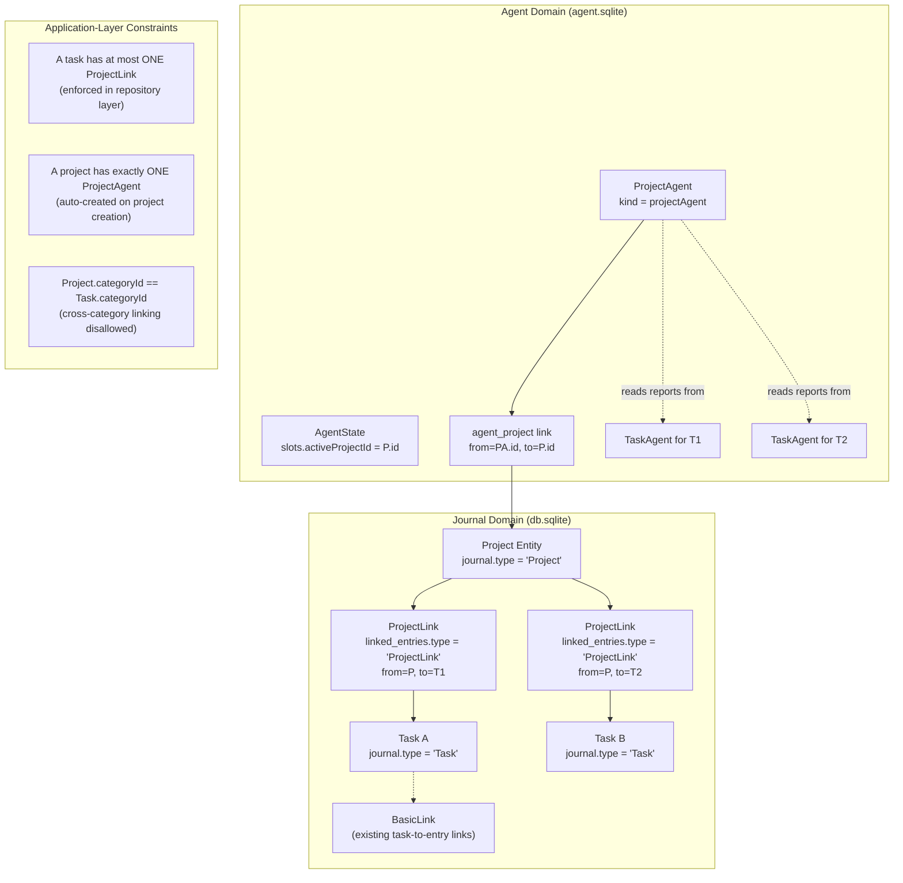
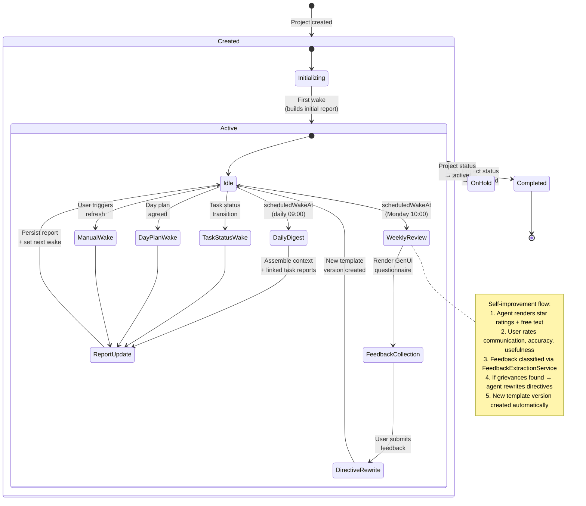
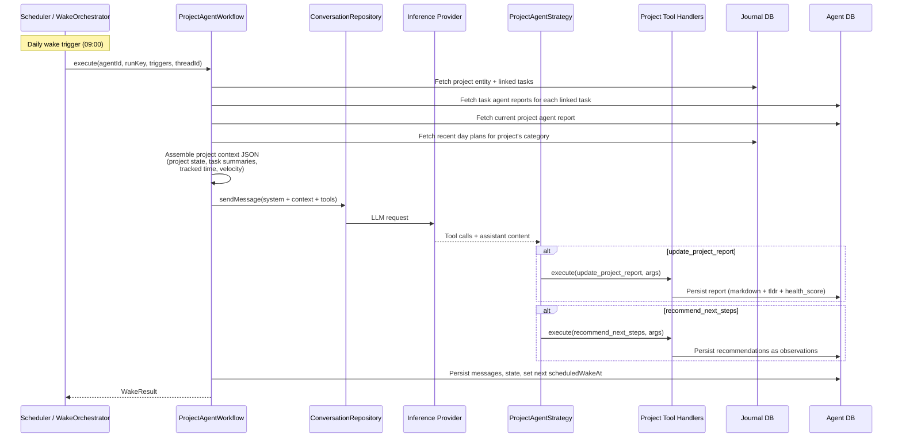
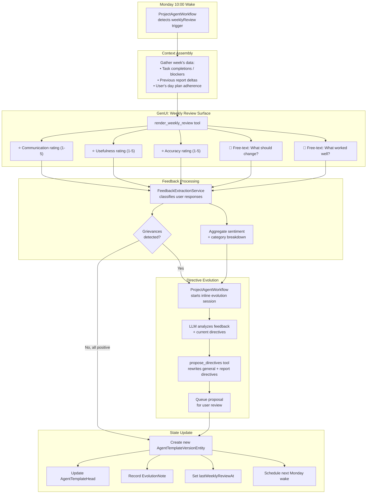
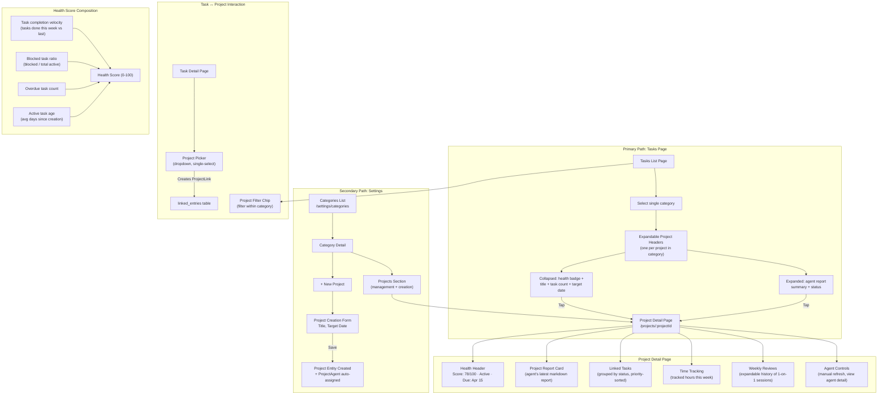

# Implementation Plan: Introduce Projects Layer

**Date:** 2026-03-16
**Status:** Draft — Pending Review

---

## 1. Motivation

Lotti currently organizes work into **Categories** (broad life areas) and **Tasks** (short-term items
completed in one session or a few days). There is no concept for *long-running initiatives* — a
multi-week or multi-month effort like "device synchronization", "marketing launch", or "kitchen
renovation". Users resort to labels or category-scoped mental models, but neither provides:

- A **single-owner relationship** (a task belongs to exactly one project)
- A **dedicated agent** that maintains project-wide context, history, and health
- **Resource negotiation** with the day-planning system for weekly time allocation
- A **self-improvement feedback loop** where the project agent's directives evolve based on user
  satisfaction

Projects fill the structural gap between Categories and Tasks, giving the user a navigable hierarchy
(Category → Project → Task) with agent-driven intelligence at the project level.

---

## 2. Current vs. Proposed Data Model

### 2.1 Current Hierarchy

```
Category
  └── Task (via metadata.categoryId)
        └── ChecklistItem (via ChecklistData.linkedChecklistItems)
        └── Agent (via agent_task link in agent.sqlite)
```

### 2.2 Proposed Hierarchy

```
Category
  └── Project (via metadata.categoryId on JournalEntity.project)
        └── Task (via EntryLink.project from project → task)
        └── ProjectAgent (via agent_project link in agent.sqlite)
```

A task retains its `metadata.categoryId` (denormalized for query performance) but gains a project
association through a dedicated `EntryLink.project` link entity. A task can belong to **at most one**
project (enforced at the application layer).

### 2.3 Mermaid: Data Model Comparison



---

## 3. Data Model Details

### 3.1 `ProjectData` (new freezed class in `lib/classes/project_data.dart`)

```dart
@freezed
abstract class ProjectData with _$ProjectData {
  const factory ProjectData({
    required String title,
    required ProjectStatus status,
    @Default([]) List<ProjectStatus> statusHistory,
    required DateTime dateFrom,
    DateTime? targetDate,
    String? profileId,             // inference profile for project agent
    String? coverArtId,
    @Default(0.5) double coverArtCropX,
  }) = _ProjectData;
}
```

### 3.2 `ProjectStatus` (new sealed class)

```dart
@freezed
sealed class ProjectStatus with _$ProjectStatus {
  const factory ProjectStatus.open({
    required String id,
    required DateTime createdAt,
  }) = ProjectOpen;

  const factory ProjectStatus.active({
    required String id,
    required DateTime createdAt,
  }) = ProjectActive;

  const factory ProjectStatus.onHold({
    required String id,
    required DateTime createdAt,
    required String reason,
  }) = ProjectOnHold;

  const factory ProjectStatus.completed({
    required String id,
    required DateTime createdAt,
  }) = ProjectCompleted;

  const factory ProjectStatus.archived({
    required String id,
    required DateTime createdAt,
  }) = ProjectArchived;
}
```

### 3.3 New `JournalEntity` Variant

Add `JournalEntity.project` to the existing sealed union in `journal_entities.dart`:

```dart
const factory JournalEntity.project({
  required Metadata meta,
  required ProjectData data,
}) = Project;
```

### 3.4 New `EntryLink` Variant

Add `EntryLink.project` to the existing sealed union in `entry_link.dart`:

```dart
const factory EntryLink.project({
  required String id,
  required String fromId,  // project entity ID
  required String toId,    // task entity ID
  required DateTime createdAt,
  required DateTime updatedAt,
  required VectorClock? vectorClock,
  bool? hidden,
  bool? collapsed,
  DateTime? deletedAt,
}) = ProjectLink;
```

### 3.5 Database Schema Changes

No schema migration needed. The existing `type` column on the `journal` table stores `'Project'`
for project entities — no additional boolean column required. Similarly, the `linked_entries`
table's `type` column stores `'ProjectLink'` for project links.

Add new named queries:

```sql
projectsForCategory:
  SELECT * FROM journal
  WHERE type = 'Project'
    AND category = :categoryId
    AND deleted = 0
  ORDER BY date_from DESC;

tasksForProject:
  SELECT j.* FROM journal j
  INNER JOIN linked_entries le ON le.to_id = j.id
  WHERE le.from_id = :projectId
    AND le.type = 'ProjectLink'
    AND j.deleted = 0
  ORDER BY j.task_priority_rank ASC, j.date_from DESC;
```

### 3.6 Conversions

Update `conversions.dart`:
- `toDbEntity`: handle `JournalEntity.project` → set `type = 'Project'`
- `fromSerialized`: deserialize `'Project'` type
- `linkedDbEntity`: handle `EntryLink.project` → set `type = 'ProjectLink'`
- `entryLinkFromLinkedDbEntry`: handle `'ProjectLink'` type

---

## 4. Linking System

### 4.1 Mermaid: Link Data Flow



### 4.2 Constraint Enforcement

The **single-project-per-task** constraint is enforced in the repository layer (`ProjectRepository`):

1. Before creating a `ProjectLink`, query `linked_entries` for any existing `ProjectLink` where
   `to_id = taskId`.
2. If one exists, either reject the operation (error) or atomically delete the old link and create
   the new one (move semantics).

The **same-category** constraint ensures tasks linked to a project share the project's `categoryId`.
This is validated at link-creation time.

### 4.3 Sync Considerations

`ProjectLink` entities use the same `VectorClock`-based sync as `BasicLink` and `RatingLink`. The
existing outbox pipeline handles them without changes — the new link type just needs to be registered
in the serialization/deserialization path.

---

## 5. Project Agent Runtime

### 5.1 Agent Kind Extension

Add `projectAgent` to the `AgentKind` enum (or equivalent discriminator). This distinguishes project
agents from task agents in:
- Template assignment (`template_assignment` link with project agent kind filter)
- Wake orchestrator subscription matching
- Workflow selection (route to `ProjectAgentWorkflow` instead of `TaskAgentWorkflow`)

### 5.2 Agent State Slots

Extend `AgentStateSlots` with project-specific fields:

```dart
String? activeProjectId       // The project entity this agent manages
DateTime? lastDailyWakeAt     // Last periodic wake timestamp
DateTime? lastWeeklyReviewAt  // Last weekly 1-on-1 feedback session
int weeklyReviewCount         // Total weekly reviews completed
```

### 5.3 Wake Triggers

Project agents use a **fundamentally different wake cadence** than task agents:

| Trigger | Mechanism | Throttle |
|---------|-----------|----------|
| **Daily digest** | `scheduledWakeAt` set to next day 09:00 local | 24 hours |
| **Manual** | User taps "Refresh" in project detail UI | None (bypass) |
| **Weekly 1-on-1** | `scheduledWakeAt` set to next Monday 10:00 local | 7 days |
| **Task status change** | Subscription on project's linked task IDs, but only for status transitions (open→done, →blocked) | 4 hours |
| **Day plan agreed** | Subscription on day plan entity for the project's category | 4 hours |

The key difference from task agents: project agents do **not** wake on every task edit (text
changes, checklist toggles). They only wake on *status transitions* and *scheduled cadences*.

### 5.4 Mermaid: Project Agent Lifecycle



### 5.5 Mermaid: Project Agent Wake Execution



---

## 6. Project Agent Tools

### 6.1 Immediate Tools (no user confirmation needed)

| Tool | Description |
|------|-------------|
| `update_project_report` | Publish project report (tldr + markdown + health_score 0–100) |
| `record_observations` | Record private notes (reuse existing observation model) |

### 6.2 Deferred Tools (require user confirmation)

| Tool | Description |
|------|-------------|
| `recommend_next_steps` | Suggest actionable next tasks or status changes |
| `update_project_status` | Propose project status transition |
| `create_task` | Create a new task linked to this project |
| `render_surface` | Render GenUI elements (questionnaires, ratings) |

### 6.3 Weekly 1-on-1 Tools

| Tool | Description |
|------|-------------|
| `render_weekly_review` | Render star-rating + free-text GenUI for user feedback |
| `propose_directives` | Rewrite agent directives based on feedback (reuse evolution tool) |

---

## 7. Self-Improvement Flow

### 7.1 Mermaid: Weekly 1-on-1 Feedback Loop



### 7.2 Self-Improvement Rules

1. **Minimum feedback threshold**: Skip directive rewrite if fewer than 2 ratings are below 3 stars.
2. **User approval required**: All directive rewrite proposals are surfaced to the user via the
   existing `EvolutionProposal` GenUI widget. No auto-approval — the user always has final say.
3. **Churn protection**: Maximum 2 directive rewrites per month per project agent (aligned with
   `maxDirectiveChurnVersions` constant).
4. **Improver integration**: Project agents participate in the existing improver agent hierarchy.
   A `templateImprover` agent is auto-created for each project agent template, running on the
   standard 7-day cycle.

---

## 8. UI Design

### 8.1 Navigation Flow

The **primary** interaction with projects happens on the Tasks page — not in Settings.

```
Bottom Nav: Tasks tab
  └── Tasks List (existing, with category filter)
        └── When single category selected:
              └── Expandable Project Health Header (per project)
                    ├── Health badge, status, target date (collapsed)
                    ├── Agent report summary (expanded)
                    └── Tap → Project Detail Page
                          ├── Health Header (score badge, status, target date)
                          ├── Agent Report Card (latest project report)
                          ├── Linked Tasks List (filterable, sortable)
                          ├── Time Tracking (tracked hours this week)
                          └── Weekly Review History

Bottom Nav: Categories tab (via Settings)
  └── Category Detail
        └── Projects Section (secondary access, management & creation)
              └── Project Detail Page (same destination)
```

### 8.2 Mermaid: UI Navigation & Interaction Flow



### 8.3 Routes

Add to Beamer:

| Route | Page | Purpose |
|-------|------|---------|
| `/projects/:projectId` | `ProjectDetailPage` | Project detail with report, tasks, budget |
| `/projects/create?categoryId=X` | `ProjectCreatePage` | New project form |

Add `ProjectsLocation` to the Beamer location registry, or nest under the existing
`SettingsLocation` if projects are accessed primarily through category detail.

### 8.4 Key Widgets

| Widget | Location | Purpose |
|--------|----------|---------|
| `ProjectHealthHeader` | Tasks list (category-filtered) | Expandable header per project: health badge, title, task count, report summary. Primary entry point. |
| `ProjectCard` | Category detail page (settings) | Compact card for management/creation flow |
| `ProjectDetailPage` | Standalone route | Full project view |
| `ProjectHealthBadge` | Health header / detail header | Color-coded score (green/yellow/red) |
| `ProjectTasksList` | Project detail | Linked tasks with status grouping |
| `ProjectTimeTracker` | Project detail | Tracked hours this week (derived from day plan blocks) |
| `ProjectPicker` | Task detail page | Single-select dropdown to assign task to project |
| `ProjectFilterChip` | Tasks list app bar | Filter tasks by project within category |
| `WeeklyReviewHistory` | Project detail | Expandable list of past 1-on-1 sessions |

---

## 9. Implementation Phases

### Phase 1: Data Foundation (est. 3–5 PRs)

1. **Create `ProjectData` and `ProjectStatus`** freezed classes
2. **Add `JournalEntity.project` variant** to the sealed union
3. **Add `EntryLink.project` variant** to the link sealed union
4. **Update `conversions.dart`** for new types
5. **Run `make build_runner`** to regenerate freezed/JSON code
6. **Add named queries** for project retrieval (no schema migration needed — `type` column suffices)
8. **Update all `JournalEntity` switch statements** (journal_card, file_utils, gamey_journal_card,
   etc.) to handle the new `project` variant
9. **Create `ProjectRepository`** with CRUD + link management + constraint enforcement
10. **Write unit tests** for repository, conversions, and constraint enforcement

### Phase 2: Agent Runtime (est. 3–4 PRs)

1. **Extend `AgentKind`** with `projectAgent`
2. **Add `agent_project` link type** to agent domain
3. **Extend `AgentStateSlots`** with project-specific fields
4. **Create `ProjectAgentWorkflow`** extending the existing workflow pattern
5. **Create `ProjectAgentStrategy`** for conversation handling
6. **Register project agent tools** in the tool registry
7. **Implement scheduled wake** (daily + weekly) via `scheduledWakeAt`
8. **Implement status-transition subscription** (filtered wake on task status changes only)
9. **Create project agent auto-assignment** on project creation (similar to category→task agent
   auto-assignment)
10. **Write unit tests** for workflow, strategy, wake triggers

### Phase 3: Basic UI (est. 3–4 PRs)

1. **Add `ProjectsLocation`** to Beamer routes
2. **Create `ProjectHealthHeader`** — expandable header shown on Tasks page when a single category is selected, one per project in that category
3. **Create `ProjectDetailPage`** with health header, report card, linked tasks, time tracking
4. **Create `ProjectPicker`** widget for Task Detail page
5. **Add Projects section** to Category Detail page (secondary management path)
6. **Create `ProjectCreatePage`** form (accessed from Category Detail)
7. **Add Project filter chip** to Tasks list (filter within category)
8. **Write widget tests** for all new widgets

### Phase 4: Self-Improvement & GenUI (est. 2–3 PRs)

1. **Add weekly review GenUI widgets** to the evolution catalog (star ratings, free text)
2. **Implement inline evolution session** within `ProjectAgentWorkflow`
3. **Create `WeeklyReviewHistory`** widget
5. **Register project agent templates** as seeded defaults
6. **Wire improver agent** auto-creation for project agent templates
7. **Write integration tests** for the full feedback → evolution cycle

### Phase 5: Advanced Features (est. 2–3 PRs)

1. **Time tracking visualization** (tracked hours per week derived from day plan blocks)
2. **Health score computation** (composite metric from velocity, blockers, overdue tasks, task age)
3. **Resource negotiation hooks** (project agent ↔ day plan integration for future planning agent)
4. **Task completion velocity** tracking and visualization

---

## 10. Migration & Backward Compatibility

- **No schema version bump**: The `type` column already discriminates entity types; no new columns needed.
- **Sync compatibility**: Older app versions will encounter `Project` entities and `ProjectLink`
  links they don't recognize. The existing `@Freezed(fallbackUnion: 'basic')` on `EntryLink`
  ensures unknown link types deserialize as `BasicLink`. For `JournalEntity`, we need to ensure
  the deserialization gracefully handles unknown types (the existing `fromSerialized` should log
  and skip unknown types).
- **No data migration**: Projects are additive. Existing tasks continue to work without a project
  association. The project picker in task detail is optional.

---

## 11. Testing Strategy

| Layer | Approach | Coverage Target |
|-------|----------|-----------------|
| Data model | Unit tests for serialization, copyWith, status transitions | Full coverage |
| Conversions | Unit tests for round-trip DB ↔ entity conversion | Full coverage |
| Repository | Unit tests with real Drift DB for CRUD + constraints | Full coverage |
| Agent workflow | Unit tests with mocked repositories and inference | Key paths |
| Wake triggers | Unit tests with fake clock and mock orchestrator | Full coverage |
| UI widgets | Widget tests with makeTestableWidget + mock providers | All new widgets |
| Integration | End-to-end project creation → agent wake → report update | Happy path |

---

## 12. Open Questions

1. **Should projects be visible in the Journal tab?** Currently, all `JournalEntity` variants
   appear in the infinite journal. Projects might be noise there — consider filtering them out by
   default and only showing them in the Category detail and dedicated project routes.

2. **Cross-category projects?** The current design restricts a project to one category. Some
   initiatives span multiple categories (e.g., "launch product" touches engineering, marketing,
   sales). Should we support multi-category projects in v1, or defer to v2?

3. **Project templates vs. task templates?** Should project agents use entirely separate templates,
   or should they share the template system with task agents (differentiated by `kind`)?
   Recommendation: Share the system, differentiate by `kind`.

4. **Health score algorithm?** The composite health score (0–100) needs a well-defined formula.
   Should it be configurable per project, or fixed globally? Recommendation: Fixed formula in v1,
   with weights tunable in v2.

5. **Resource negotiation protocol?** The day plan system currently has no agent-facing API for
   requesting time blocks. This needs a separate design document for the negotiation protocol
   between project agents and a future resource-planning agent.

---

## 13. Dependencies & Risks

| Risk | Mitigation |
|------|------------|
| Large blast radius on `JournalEntity` sealed union | Add variant early, handle in all switches immediately, keep data payload minimal |
| Agent runtime complexity | Reuse `TaskAgentWorkflow` patterns, extract shared base class if warranted |
| Sync conflicts on `ProjectLink` uniqueness | Application-layer enforcement (not DB constraint) allows graceful conflict resolution |
| UI scope creep | Phase 3 delivers minimal viable UI; charts and velocity tracking are Phase 5 |
| Template evolution churn | Reuse existing churn protection (`maxDirectiveChurnVersions = 3`) |

---

## 14. Files to Create or Modify

### New Files
- `lib/classes/project_data.dart` — ProjectData + ProjectStatus freezed classes
- `lib/features/projects/` — Feature module (repository, state, UI, service)
- `lib/features/agents/workflow/project_agent_workflow.dart`
- `lib/features/agents/workflow/project_agent_strategy.dart`
- `lib/features/agents/tools/project_tool_definitions.dart`
- `lib/beamer/locations/projects_location.dart`
- `test/classes/project_data_test.dart`
- `test/features/projects/` — Mirror of lib structure

### Modified Files
- `lib/classes/journal_entities.dart` — Add `project` variant
- `lib/classes/entry_link.dart` — Add `project` variant
- `lib/database/database.drift` — Schema migration + queries
- `lib/database/conversions.dart` — Type mappings
- `lib/classes/entity_definitions.dart` — Add `defaultProjectTemplateId` to CategoryDefinition
- `lib/features/agents/model/agent_enums.dart` — Add `projectAgent` kind
- `lib/features/agents/model/agent_domain_entity.dart` — Add `agent_project` link type
- `lib/features/agents/tools/agent_tool_registry.dart` — Register project tools
- `lib/features/agents/genui/evolution_catalog.dart` — Add weekly review widgets
- `lib/features/agents/wake/wake_orchestrator.dart` — Route project agent wakes
- `lib/features/categories/ui/pages/category_details_page.dart` — Add Projects section
- `lib/features/tasks/ui/pages/task_details_page.dart` — Add Project picker
- `lib/beamer/beamer_app.dart` — Register new location
- All files with exhaustive `JournalEntity` switches (search for `.map(` or `switch` on entity)
- All files with exhaustive `EntryLink` switches
