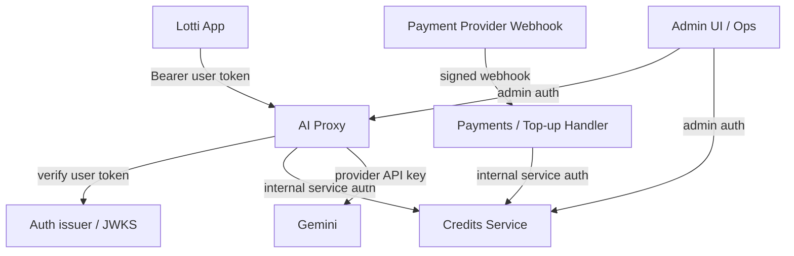
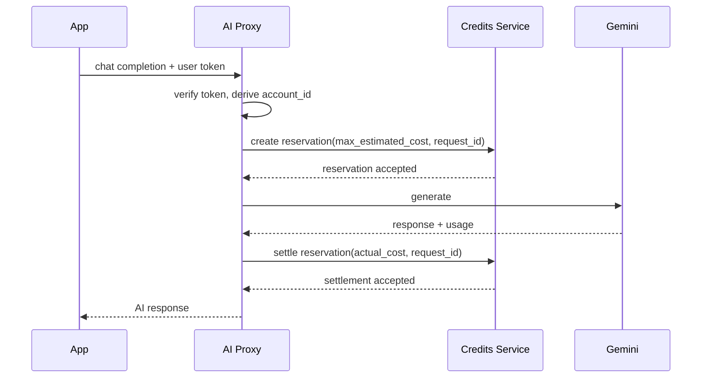

# Implementation Plan: AI Proxy & Credits Service Hardening

**Date:** 2026-03-24
**Status:** Proposed

---

## 0. Problem Statement

The current `services/ai-proxy-service` and `services/credits-service` implementation is
functionally close to a usable proof of concept, but it is not yet safe enough for
production billing.

The main issues are architectural, not cosmetic:

- The AI proxy accepts caller-supplied `user_id` values in public requests.
- The credits service trusts caller-supplied `user_id` values for account creation,
  balance queries, top-ups, and charges.
- A coarse shared API key model is used at the service boundary. This is acceptable
  only for trusted service-to-service calls, never for end users.
- AI usage is charged in floating-point USD and then truncated to integer cents in the
  credits service, which makes many low-cost requests free.
- Billing happens after the AI provider call, so the system can pay Gemini even when a
  user cannot be charged.
- Logging and metadata persistence currently include raw `user_id` values and
  free-text descriptions, which conflicts with the requirement to never log prompts or
  personally identifiable information.

This plan hardens identity, authorization, privacy, money handling, and charging flow
without requiring an immediate rewrite to Go.

---

## 1. Goals

- End users never receive service API keys.
- End users never provide `user_id` in request bodies.
- The AI proxy derives the acting user from verified auth, server-side.
- The credits service is internal-only and does not trust public user identity claims.
- Billing uses integer units end-to-end and is correct for sub-cent AI charges.
- Charging is idempotent and safe under retries, timeouts, and duplicate delivery.
- Logs contain only operational metadata and billing metadata, never prompts,
  completions, emails, IPs, or arbitrary user-supplied text.
- Top-ups are driven by payment-provider events, not a public “mint credits” endpoint.
- Admin and observability surfaces are separated from public request handling.

## 2. Non-Goals

- No immediate migration to Go.
- No immediate redesign of payment-provider selection.
- No attempt to keep the current public credits-service API shape.
- No preservation of public `user_id`-based request compatibility beyond a short,
  explicit migration window.

---

## 3. Decision Log

- **Shared API keys remain internal-only.**
  They are valid for trusted service-to-service calls, not for the client app.
- **Caller-supplied `user_id` is removed from public flows.**
  Public clients authenticate as a user; they do not assert which user they are.
- **Credits service does not accept end-user tokens.**
  It trusts only internal services and verified payment-provider webhooks.
- **Opaque user identity wins over human-readable identity.**
  The canonical subject must be a stable opaque identifier such as auth `sub`, not an
  email address.
- **Billing uses integer micros of USD.**
  All monetary values inside the services and ledger are stored as integer millionths
  of a USD (`usd_micros`), not floats and not cents.
- **AI charging moves to reserve-then-settle.**
  The system must reserve funds before provider calls and settle exact usage after the
  provider responds.
- **TigerBeetle remains the balance source of truth.**
  SQLite-backed metadata stores may remain temporarily for logs/admin metadata, but not
  for authoritative balance state.
- **No Go rewrite now.**
  Fix the architecture first; revisit language choice only if performance remains a
  measurable bottleneck.

---

## 4. Target Architecture



### Key boundary rules

- The app may talk to the AI proxy.
- The app must not talk directly to the credits service.
- The credits service accepts only:
  - internal service auth from trusted services such as the AI proxy
  - verified payment-provider webhook traffic
  - separate admin auth for admin-only surfaces
- Gemini API keys exist only on the AI proxy.

---

## 5. Identity & Auth Model

### 5.1 Public AI Proxy Auth

The public AI proxy request must use a user-scoped token:

- `Authorization: Bearer <user_jwt_or_session_token>`

The AI proxy validates:

- signature
- issuer
- audience
- expiry / not-before
- token type
- optional feature entitlement claim for AI access

The AI proxy then derives the acting user from a verified claim, typically:

- `sub`

This value becomes the canonical identity for billing and usage tracking.

### 5.2 How the Server Derives Identity Server-Side

This replaces the current public body field:

```json
{
  "model": "gemini-2.5-flash",
  "messages": [...],
  "user_id": "alice@example.com"
}
```

with:

```json
{
  "model": "gemini-2.5-flash",
  "messages": [...]
}
```

The AI proxy derives identity as follows:

1. Read the bearer token from the request header.
2. Verify the token against the trusted auth issuer.
3. Extract the canonical user subject, for example `sub = usr_12345`.
4. Store that subject in request auth context.
5. Use the derived subject for usage lookup, reservations, billing, and audit metadata.

Important constraint:

- The canonical subject must be opaque and stable.
- If the current auth system uses email as the subject, introduce a stable opaque ID
  and stop using email as the billing/account key.

### 5.3 Internal Service Auth

Calls from AI proxy to credits service use a separate internal credential:

- internal bearer token, or
- short-lived signed service JWT, or
- mTLS plus service identity

Required claims / properties:

- caller service identity
- allowed audience
- allowed role such as `billing:write`

### 5.4 Admin Auth

Admin surfaces such as pricing changes, usage summaries, user ledgers, and metrics must
use explicit admin auth and not share the same credential as public or internal billing
traffic.

---

## 6. API Surface Changes

### 6.1 AI Proxy

#### Public routes

- Keep:
  - `POST /v1/chat/completions`
- Remove from public contract:
  - `user_id` in request body

#### Admin-only or internal-only routes

- `GET /metrics`
- `GET /v1/usage/user/{user_id}`
- `GET /v1/usage/user/{user_id}/summary`
- `GET /v1/usage/summary`
- `GET /v1/pricing`
- `PUT /v1/pricing/{model_id}`
- `POST /v1/pricing`

Target shape:

- Public “my usage” should be identity-derived, e.g. `/v1/me/usage`
- System usage and pricing mutation must move behind admin auth
- Metrics should be internal-only or admin-only

### 6.2 Credits Service

#### Remove public access to these routes

- `POST /api/v1/accounts`
- `POST /api/v1/balance`
- `POST /api/v1/topup`
- `POST /api/v1/bill`
- `GET /api/v1/users`
- `GET /api/v1/users/{user_id}`
- `GET /api/v1/users/{user_id}/transactions`

#### Replace with internal/admin/payment route groups

- Internal billing routes:
  - `POST /internal/v1/reservations`
  - `POST /internal/v1/reservations/{reservation_id}/settle`
  - `POST /internal/v1/reservations/{reservation_id}/release`
- Payment routes:
  - `POST /payments/webhooks/<provider>`
- Admin routes:
  - `GET /admin/v1/accounts/{account_id}`
  - `GET /admin/v1/accounts/{account_id}/transactions`
  - optional search/list endpoints

#### User-facing balance access

If the app needs to show balance directly:

- preferred: expose it from the AI proxy or main backend as `/v1/me/balance`
- avoid exposing credits-service directly to end users

---

## 7. Money & Ledger Model

### 7.1 Internal Monetary Unit

Adopt integer `usd_micros`:

- `1 usd_micro = $0.000001`
- `$10.00 = 10_000_000 usd_micros`
- `$0.000625 = 625 usd_micros`

This fixes the current bug where AI charges are converted to cents and truncated to
zero.

### 7.2 Rules

- Never use floats for inter-service billing.
- Never convert to integer cents inside AI request billing.
- Convert user-facing payment amounts to `usd_micros` at the service boundary.
- Convert back to display decimals only in response DTOs or UI formatting layers.

### 7.3 TigerBeetle

Keep TigerBeetle as the ledger backend, but change the effective unit from cents to
`usd_micros`.

This is a unit-definition change, not a database technology change.

---

## 8. Charging Flow: Reserve Then Settle

### 8.1 Why

Current behavior bills after the Gemini call completes. That is backwards for a paid
resource and creates avoidable loss exposure.

### 8.2 Target flow



### 8.3 Reservation design

- Estimate a maximum possible charge before calling Gemini.
- Reservation key must be stable and unique per logical request.
- If the reservation fails for insufficient funds, reject before the provider call.

### 8.4 Settlement design

- Settle exact usage after the provider response arrives.
- Release or void the unused reserved amount.
- Retries on settlement must be idempotent.

### 8.5 Streaming

Streaming is allowed only if one of the following is true:

- the pre-reservation covers the full worst-case cost, or
- streaming is limited to users with sufficient pre-funded balance and a successful hold

The current “bill after `[DONE]`” path is not acceptable for production billing.

### 8.6 TigerBeetle implementation note

Use TigerBeetle pending transfers for holds and finalization instead of inventing a
separate balance shadow system.

---

## 9. Idempotency Model

### 9.1 AI Billing

Every AI request must carry a stable billing key:

- `billing_request_id`

This key is used for:

- reservation creation
- settlement
- release / void
- dedupe in retries and timeout recovery

### 9.2 Payment Top-Ups

Credits must only be created from verified payment events.

Top-up idempotency key examples:

- Stripe event ID
- Stripe payment intent ID
- App Store / Play Store transaction ID

One external payment event must map to one ledger credit grant.

### 9.3 Metadata store

Introduce an idempotency store with:

- unique key
- operation type
- current state
- canonical result payload

The caller must be able to safely retry without double effects.

---

## 10. Privacy & Logging Policy

### 10.1 Forbidden in Logs

- prompts
- completions
- raw `messages`
- raw `content`
- raw `user_id`
- email addresses
- IP addresses
- payment instrument details
- arbitrary free-text descriptions from callers
- provider exception bodies unless explicitly redacted

### 10.2 Allowed in Logs

- request ID
- reservation ID
- opaque account ID or HMACed subject
- model
- token counts
- billed amount in `usd_micros`
- latency
- status code / error class
- retry counts

### 10.3 Metadata persistence

Usage and transaction metadata may be stored, but only in minimized form:

- opaque account ID
- model
- token counts
- amount
- request / reservation IDs
- timestamps
- system-generated reason enum

Do not store free-text prompt summaries, request content, or user-supplied billing
descriptions.

### 10.4 Opaque identifiers

If cross-system correlation is needed in logs:

- log an HMAC of the canonical subject
- do not log the raw subject itself

---

## 11. Admin & Observability Separation

Create three explicit planes:

- **Public plane**
  - user-facing AI requests
- **Internal plane**
  - AI proxy ↔ credits service
  - payment webhook handling
- **Admin plane**
  - pricing updates
  - usage queries
  - transaction inspection
  - metrics

The same bearer token must not work across all three planes.

---

## 12. Data Migration Notes

### 12.1 User/account identity

- Migrate from raw `user_id` strings to opaque `account_id` / canonical `subject`
- If current data uses emails, add a mapping layer and stop writing emails in new rows

### 12.2 Money unit

- Migrate balance, transaction, and pricing calculations to `usd_micros`
- Backfill existing metadata stores if needed, or start fresh if the current services are
  still pre-production

### 12.3 Metadata stores

- Remove or redact raw `user_id` columns in SQLite metadata stores
- Replace free-text descriptions with enum or structured fields

---

## 13. Phased Implementation Plan

### Phase 1: Privacy Lockdown

Scope:

- Remove raw `user_id` logging from both services
- Remove request IP logging from the AI proxy
- Stop storing arbitrary billing descriptions
- Make `/metrics` admin-only or internal-only
- Move usage and pricing routes out of the public plane

Files likely touched:

- `services/shared/auth/middleware.py`
- `services/ai-proxy-service/src/api/routes.py`
- `services/ai-proxy-service/src/services/billing_service.py`
- `services/ai-proxy-service/src/middleware/request_id.py`
- `services/credits-service/src/api/routes.py`
- `services/credits-service/src/services/billing_service.py`
- `services/credits-service/src/services/transaction_log_service.py`

### Phase 2: Identity Derivation & Auth Split

Scope:

- Introduce user-token validation for the AI proxy
- Remove `user_id` from public request DTOs
- Add auth context to request state
- Introduce internal service auth for credits-service calls
- Mark credits-service as internal-only

Files likely touched:

- `services/shared/auth/*`
- `services/ai-proxy-service/src/main.py`
- `services/ai-proxy-service/src/api/routes.py`
- `services/ai-proxy-service/src/core/models.py`
- `services/credits-service/src/main.py`
- `services/credits-service/src/api/routes.py`

### Phase 3: Money Unit & Idempotency

Scope:

- Replace float billing with integer `usd_micros`
- Add idempotency keys and persistence
- Remove direct public top-up semantics

Files likely touched:

- `services/ai-proxy-service/src/services/billing_service.py`
- `services/ai-proxy-service/src/core/models.py`
- `services/credits-service/src/core/constants.py`
- `services/credits-service/src/core/models.py`
- `services/credits-service/src/services/billing_service.py`
- `services/credits-service/src/services/tigerbeetle_client.py`
- new idempotency service/store files

### Phase 4: Reservation / Settlement Flow

Scope:

- Add reservation endpoints to credits-service
- Reserve before Gemini calls
- Settle actual usage after completion
- Release unused holds
- Support streaming safely

Files likely touched:

- `services/ai-proxy-service/src/api/routes.py`
- `services/ai-proxy-service/src/services/billing_service.py`
- `services/credits-service/src/api/routes.py`
- `services/credits-service/src/services/billing_service.py`
- `services/credits-service/src/services/tigerbeetle_client.py`

### Phase 5: Payment-Driven Top-Ups

Scope:

- Remove public top-up route from the end-user surface
- Add verified payment webhook ingestion
- Credit the ledger only after successful verified payment events

### Phase 6: Shared-State Observability

Scope:

- Replace in-memory rate limit state with shared backing store if multiple replicas are used
- Replace local SQLite-only admin metadata with shared storage where needed
- Keep TigerBeetle authoritative for balances

---

## 14. Testing Strategy

### AI Proxy Tests

- request without `user_id` succeeds when auth token is valid
- request with caller-supplied `user_id` is rejected or ignored during migration
- unauthenticated request fails
- wrong audience / issuer / expired token fails
- reservation is created before provider call
- insufficient funds fails before provider call
- settlement retries are idempotent
- logs do not contain prompts, raw subject, or IP addresses

### Credits Service Tests

- internal service auth is required for billing routes
- public end-user auth cannot call internal billing routes
- duplicate reservation creation is idempotent
- duplicate settlement is idempotent
- duplicate webhook delivery does not mint duplicate credits
- sub-cent AI charges remain non-zero in `usd_micros`
- pending transfer / settlement / release behavior is correct

### Integration Tests

- end-to-end funded request
- end-to-end insufficient-funds rejection before Gemini call
- streaming request with pre-reservation and exact settlement
- payment event credits balance once under retries
- admin routes require admin auth

---

## 15. Rollout Plan

1. Land privacy/logging cleanup first.
2. Add new auth model in parallel with legacy internal API keys.
3. Add new integer money unit and idempotency.
4. Deploy reservation/settlement flow behind a feature flag.
5. Migrate the app to send only user auth, never `user_id`.
6. Remove public credits-service exposure.
7. Remove legacy body `user_id` handling.
8. Remove legacy post-hoc billing path.

---

## 16. Acceptance Criteria

- No public request body contains `user_id`.
- No client binary contains credits-service credentials.
- AI proxy can derive the acting user entirely from verified auth.
- Credits-service accepts only trusted internal billing calls, payment webhooks, and
  admin requests.
- AI requests reserve funds before provider spend.
- Settlement is exact and idempotent.
- Sub-cent AI usage is billed correctly.
- Logs and persisted metadata contain no prompts and no personally identifiable
  information.
- Admin and public surfaces are clearly separated by auth and route grouping.

---

## 17. Go / Golang Assessment

At this stage, a Go rewrite is not the highest-value change.

Why not now:

- The current risks are auth, trust boundaries, privacy, idempotency, and money units.
- Rewriting Python code in Go would not fix those design flaws by itself.
- TigerBeetle and Gemini integration volume is currently small enough that the main
  production risk is correctness, not raw CPU usage.

When Go may become justified later:

- if the AI proxy needs significantly higher concurrent streaming throughput
- if the Python Gemini SDK remains a blocking bottleneck after auth/billing hardening
- if the credits-service becomes part of a larger payment/ledger platform where
  operational simplicity and strict low-latency behavior justify it

Recommendation:

- Harden the current services first.
- Reassess Go only after the system has correct auth, exact billing, idempotency, and
  production telemetry.
