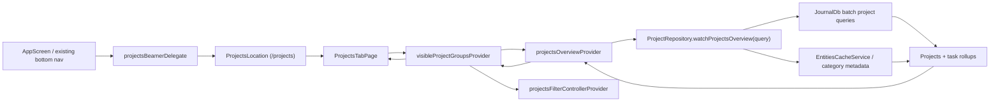
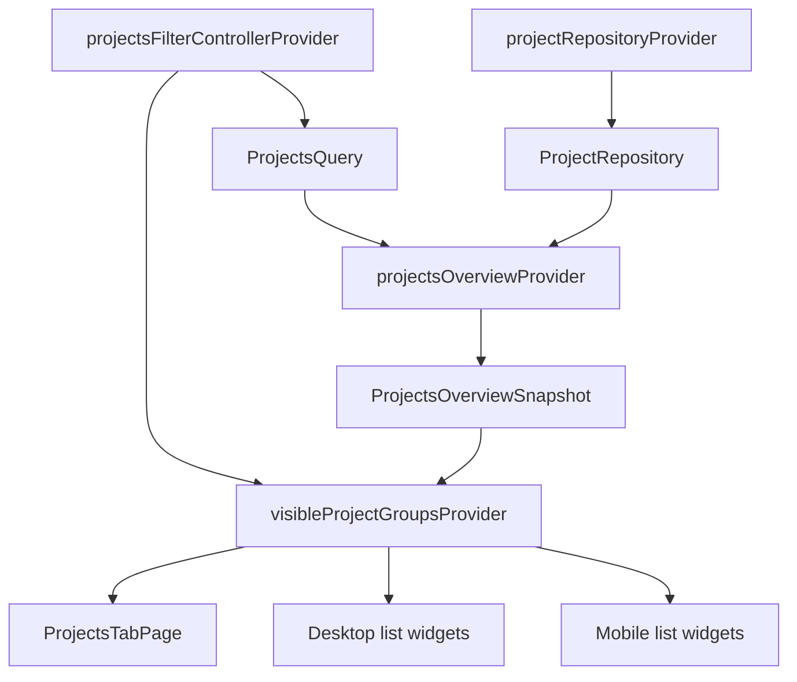
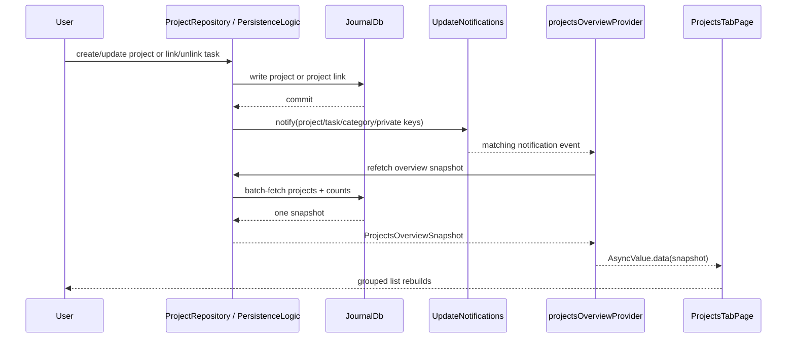

# Projects Tab Implementation Plan

**Date:** 2026-03-26  
**Status:** Proposed  
**Scope:** Integrate a new top-level `Projects` tab into the main app shell using the existing bottom navigation, gated by the existing `enableProjectsFlag`.

## 1. Goal

Add a real `Projects` tab to the main application, directly to the right of `Tasks`, while keeping the implementation aligned with the current codebase:

- Reuse the existing app shell in `lib/beamer/beamer_app.dart`
- Reuse the existing config-flag mechanism in `lib/utils/consts.dart`, `lib/database/journal_db/config_flags.dart`, and `lib/features/settings/ui/pages/flags_page.dart`
- Reuse the existing `features/projects` module, but add a batch-oriented list data path suitable for a full tab page
- Avoid N+1 fetching from the start
- Keep vector search out of this task; it remains a separate follow-up

This plan covers the missing top-level tab integration work that sits on top of the already-landed projects foundation described in `docs/implementation_plans/2026-03-16_introduce_projects.md`.

## 2. Current Starting Point

The codebase already contains several pieces we should build on:

- `enableProjectsFlag` already exists and is initialized in the DB.
- Project CRUD, linking, and detail editing already exist in `lib/features/projects/repository/project_repository.dart` and `lib/features/projects/state/project_detail_controller.dart`.
- Settings routes already exist for project create/detail under `lib/beamer/locations/settings_location.dart`.
- Widgetbook already contains project list/detail UI components under `lib/features/projects/ui/widgets/` and `lib/features/projects/widgetbook/`.
- The app shell currently gates major tabs in `lib/beamer/beamer_app.dart` and `lib/services/nav_service.dart` by listening directly to config-flag streams from `JournalDb`.

The main gap is that the existing project providers are detail-oriented:

- `projectsForCategoryProvider`
- `projectTaskCountProvider`
- `projectHealthMetricsProvider`
- `projectForTaskProvider`

Those are fine for small local surfaces such as `ProjectHealthHeader`, but they are the wrong shape for a full tab list because they encourage per-category or per-project fetching.

## 3. Recommended Scope by Step

### Step 1: Base UI and Data

Deliver a live projects list tab with:

- A new `Projects` tab in the main bottom navigation, placed immediately after `Tasks`
- The tab hidden when `enableProjectsFlag` is `false`
- A disabled, non-responsive `Search projects` bar
- A scrollable project list grouped by category
- A project count shown per category group
- Project status shown per row
- No filtering yet

Recommended step-1 interaction model:

- Tapping a project row should open the existing project detail flow at `/settings/projects/:projectId?categoryId=...`
- Do not block step 1 on a new in-tab detail pane

This keeps step 1 aligned with the stated requirement: integrate the list page first.

### Step 2: Filtering Model

Add the filtering architecture without coupling it to vector search:

- A dedicated filter state model for projects
- Provider composition that separates raw data from filtered data
- Category filtering support
- Text-query support at the state/provider layer
- A search-mode abstraction so the UI contract does not need to change when vector search arrives later

Recommended step-2 behavior:

- Keep the filter model and providers live
- Only enable the actual search interaction when product is ready
- Reuse the existing local substring-filter logic from `ui/model/project_list_detail_state.dart` as the first non-vector implementation if an interim text filter is desired

### Step 3: Vector Search

This remains a separate follow-up task: `Integrate Projects search bar with vector search`.

The follow-up should wire the search bar to vector search only after the data model and provider boundaries from step 2 exist.

## 4. Architecture Overview

## 4.1 Navigation and Feature Flag Integration

### Existing extension points

- App shell: `lib/beamer/beamer_app.dart`
- Navigation state/indexing: `lib/services/nav_service.dart`
- Beamer delegates: `lib/beamer/beamer_delegates.dart`
- Settings routes: `lib/beamer/locations/settings_location.dart`

### Required changes

1. Add a new top-level Beamer location:
   - New file: `lib/beamer/locations/projects_location.dart`
   - Initial route: `/projects`
   - Step-1 route surface can stay minimal:
     - `/projects`
   - Optional future route:
     - `/projects/:projectId`

2. Add a new Beamer delegate:
   - Update `lib/beamer/beamer_delegates.dart`
   - Add `projectsBeamerDelegate`

3. Update `NavService`:
   - Add `projectsDelegate`
   - Expand the config-flag subscription so navigation state includes `enableProjectsFlag`
   - Update `beamerDelegates`
   - Update `setPath()`
   - Update `setTabRoot()`
   - Add `projectsIndex`

4. Update `AppScreen`:
   - Expand the flag subscription to include `enableProjectsFlag`
   - Insert the Projects delegate directly after Tasks in the `IndexedStack`
   - Insert the Projects nav item directly after Tasks in the bottom nav items list
   - Update index clamping logic automatically by keeping the nav order consistent

5. Add the missing nav label localization:
   - New key: `navTabTitleProjects`
   - Add to:
     - `lib/l10n/app_en.arb`
     - `lib/l10n/app_cs.arb`
     - `lib/l10n/app_de.arb`
     - `lib/l10n/app_es.arb`
     - `lib/l10n/app_fr.arb`
     - `lib/l10n/app_ro.arb`
   - Add to `app_en_GB.arb` only if spelling differs

### Important constraint

Do not reuse the Widgetbook navigation chrome in production:

- Do not mount `Sidebar` from `lib/features/projects/ui/widgets/sidebar.dart`
- Do not mount the Widgetbook bottom tab bar from `project_mobile_list_detail_showcase.dart`
- The real app already has its shell; the production page should only render the projects content area

## 4.2 UI Integration Strategy

### Desktop

Use the existing list widgets, not the showcase wrapper:

- Reuse:
  - `lib/features/projects/ui/widgets/project_list_pane.dart`
- Do not reuse:
  - `lib/features/projects/ui/widgets/project_list_detail_showcase.dart`
  - `lib/features/projects/ui/widgets/sidebar.dart`

Recommended step-1 desktop page:

- New page: `lib/features/projects/ui/pages/projects_tab_page.dart`
- Layout:
  - app-owned scaffold area only
  - page title
  - project list content
- Search bar:
  - render with `DesignSystemSearch(enabled: false)`
  - keep the filter icon decorative/non-interactive

### Mobile

Extract the real list screen from the showcase implementation instead of shipping the demo shell:

- Source reference: `lib/features/projects/ui/widgets/project_mobile_list_detail_showcase.dart`

Recommended extraction:

- New widget/page:
  - `lib/features/projects/ui/pages/projects_tab_page.dart`
  - or `lib/features/projects/ui/widgets/project_mobile_list_page.dart`
- Reuse only:
  - grouped list section
  - project rows
  - disabled search bar
- Do not reuse:
  - demo bottom tab bar
  - avatar accessory
  - demo phone chrome

### Search bar in step 1

Use the existing `enabled` parameter already supported by:

- `lib/features/design_system/components/search/design_system_search.dart`

That is the cleanest way to satisfy the step-1 requirement:

- visible
- present in the final layout
- non-responsive
- not secretly mutating filter state

## 4.3 Data Model for the Tab

The main tab should not fetch directly into the current Widgetbook-shaped models.

### Why

`ProjectRecord` and `ProjectListDetailState` currently assume fields that are showcase-specific or detail-heavy:

- `healthScore`
- `aiSummary`
- `recommendations`
- `reviewSessions`
- highlighted task summaries

Step 1 does not need those fields. Forcing the repository to supply them would either:

- bloat the initial implementation, or
- encourage placeholder data, which is the wrong long-term architecture

### Recommendation

Introduce a dedicated live tab data shape, for example:

```dart
class ProjectsOverviewSnapshot {
  final List<ProjectCategoryGroup> groups;
}

class ProjectCategoryGroup {
  final CategoryDefinition category;
  final List<ProjectListItemData> projects;
  final int projectCount;
}

class ProjectListItemData {
  final ProjectEntry project;
  final int taskCount;
  final int completedTaskCount;
  final int blockedTaskCount;
}
```

Notes:

- `projectCount` can be derived from `projects.length`
- `ProjectEntry.data.status` already supplies the project status
- `CategoryDefinition` already supplies label/color/icon
- `completedTaskCount` and `blockedTaskCount` are optional for step 1, but they are cheap to include in the same batch aggregate query and useful if the live tab later expands toward the existing mobile/desktop detail shell

## 4.4 Repository and Riverpod Provider Structure

### Repository

Extend `ProjectRepository` with a batch list method instead of reusing the existing per-project methods:

```dart
Future<ProjectsOverviewSnapshot> getProjectsOverview({
  required ProjectsQuery query,
});

Stream<ProjectsOverviewSnapshot> watchProjectsOverview({
  required ProjectsQuery query,
});
```

Recommended query object:

```dart
class ProjectsQuery {
  final Set<String> categoryIds;
  final String textQuery;
  final ProjectsSearchMode searchMode;
}

enum ProjectsSearchMode {
  disabled,
  localText,
  vector,
}
```

### Provider graph

Recommended new providers:

- `projectRepositoryProvider`
  - existing
  - keepAlive repository provider

- `projectsFilterControllerProvider`
  - new
  - `@Riverpod(keepAlive: true)` or `NotifierProvider`
  - owns:
    - selected category ids
    - text query
    - search mode

- `projectsOverviewProvider`
  - new
  - watches `ProjectRepository.watchProjectsOverview(query)`
  - raw unfiltered batch snapshot

- `visibleProjectGroupsProvider`
  - new computed provider
  - combines:
    - `projectsOverviewProvider`
    - `projectsFilterControllerProvider`
  - this is the provider the page consumes

- `selectedProjectIdProvider`
  - optional in step 1
  - recommended only if desktop selection/detail is introduced now

### Why this split matters

It gives us a stable contract:

- step 1: disabled search, no filters, raw groups render directly
- step 2: local text/category filters slot into the computed provider
- step 3: vector search swaps the raw candidate source without rewriting the page widget tree

## 5. Recommended Step-by-Step Build Order

### Phase A: Navigation and Flag Wiring

1. Add `navTabTitleProjects` localization.
2. Create `projects_location.dart`.
3. Add `projectsBeamerDelegate`.
4. Extend `NavService` flag subscriptions and delegate order.
5. Extend `AppScreen` flag subscriptions, `IndexedStack`, and bottom nav items.
6. Verify the tab only appears when `enableProjectsFlag` is enabled.

### Phase B: Live List Data Path

1. Add a batch query layer in `JournalDb`.
2. Extend `ProjectRepository` with `getProjectsOverview()` and `watchProjectsOverview()`.
3. Add a new overview DTO for the live tab.
4. Add Riverpod providers for:
   - filter state
   - raw overview snapshot
   - visible grouped rows

### Phase C: Real Projects Tab Page

1. Create `ProjectsTabPage`.
2. Wire it into `ProjectsLocation`.
3. Reuse the production list widgets, not the Widgetbook wrappers.
4. Render the search bar disabled.
5. Render category groups and row statuses from the overview provider.
6. Route row taps to existing settings detail pages for step 1.

### Phase D: Filter Model

1. Introduce `ProjectsQuery` and `ProjectsSearchMode`.
2. Add `projectsFilterControllerProvider`.
3. Move grouping/filter logic out of the Widgetbook-only controller path.
4. Support category selection and local text filtering at the provider level.
5. Keep the UI off until product chooses to expose it.

### Phase E: Vector Search Follow-Up

1. Extend embeddings to support `ProjectEntry`.
2. Extend the vector search repository to resolve projects, not only tasks and journal entries.
3. Flip the search mode from `localText`/`disabled` to `vector`.
4. Enable the search bar UI.

## 6. Mermaid Diagrams

## 6.1 UI Layer to Database



## 6.2 Data Access Flow and Provider Structure



## 6.3 State Updates and Notifications



## 7. N+1 Prevention Strategy

This is the most important technical constraint for the tab.

### 7.1 What we must not do

The following patterns are explicitly out of bounds for the top-level tab:

- Looping over projects and calling `getTasksForProject(projectId)` for each row
- Rendering a `ListView` where every row watches `projectTaskCountProvider(projectId)`
- Rendering a `ListView` where every row watches `projectHealthMetricsProvider(projectId)`
- Querying category metadata per row instead of resolving it once from cache
- Calling `projectsForCategoryProvider(categoryId)` once per category to assemble the whole page

Those patterns create hidden N+1 behavior and will become expensive as soon as the user has more projects/categories.

### 7.2 Recommended batch strategy

Use one batch fetch for projects plus one batch rollup for task counts.

#### Query A: visible projects

Add a new query in `lib/database/database.drift` that returns all visible projects in one fetch:

- filters:
  - `type = 'Project'`
  - `deleted = false`
  - private filtering consistent with existing `JournalDb` patterns
  - optional category filter
- output:
  - all project journal rows needed to hydrate `ProjectEntry`

#### Query B: task rollups by project

Add a second batch query in `lib/database/database.drift` keyed by `project_id`:

- source table:
  - `journal`
- filter:
  - `type = 'Task'`
  - `deleted = false`
  - `project_id IN (...)`
  - same private filtering rules
- aggregate:
  - `COUNT(*) AS task_count`
  - optional:
    - `SUM(CASE WHEN task_status = 'DONE' THEN 1 ELSE 0 END) AS completed_count`
    - `SUM(CASE WHEN task_status = 'BLOCKED' THEN 1 ELSE 0 END) AS blocked_count`

### 7.3 Why the `project_id` column matters

The app already maintains the denormalized `journal.project_id` column and indexes it with `idx_journal_project_id`.

That means the tab should prefer:

- `journal.project_id`

over:

- repeated joins against `linked_entries`

Use `linked_entries` for write-side link management and one-off detail lookups; use `project_id` for list-scale task aggregation.

### 7.4 Category counts

Counts per category should be derived in memory from the already-materialized overview snapshot:

- `projectCount = group.projects.length`

No extra database query is required for category group counts in step 1.

### 7.5 Category metadata

Resolve category labels/colors/icons from:

- `EntitiesCacheService`

or from a single categories provider/stream, not from per-row DB lookups.

This gives us:

- zero category-query fan-out
- stable sort order via `sortedCategories`
- alignment with other parts of the app that already use the category cache

### 7.6 Health data

Step 1 should not depend on per-project health fetches.

Reason:

- the current live project health path exposes a `ProjectHealthBand` and rationale, not the numeric `healthScore` used by the Widgetbook mock rows
- the current `projectHealthMetricsProvider(projectId)` is a per-project provider and is not suitable for list-scale rendering

Recommendation:

- do not make numeric health a step-1 dependency
- if a future list design requires live health in each row, add a batch `projectIds -> health snapshot` provider

## 8. Search and Filtering Architecture

## 8.1 Step 1

- Render the search bar disabled
- Keep `textQuery = ''`
- Do not mutate filter state from the search control

## 8.2 Step 2

Add a filter model that can outlive the first implementation:

```dart
class ProjectsFilter {
  final Set<String> selectedCategoryIds;
  final String textQuery;
  final ProjectsSearchMode searchMode;
}
```

Recommended behavior:

- category filtering can be applied immediately in the computed provider
- local text filtering can initially be done in memory against:
  - `project.data.title`
  - `project.entryText?.plainText`
  - `category.name`

This lets us reuse the existing local search idea already present in `ProjectListDetailState`, but move it into the real state layer instead of the Widgetbook-only controller.

## 8.3 Step 3

Vector search follow-up requirements:

- `EmbeddingContentExtractor` currently does not embed `ProjectEntry`
- `VectorSearchRepository` is currently task/journal-oriented

Therefore the follow-up must include:

1. project embedding support
2. project backfill support
3. project result resolution in vector search
4. a project-specific search provider

That is why step 3 is correctly a separate task.

## 9. Testing Plan

### Step 1

- Navigation tests
  - projects tab hidden when `enableProjectsFlag = false`
  - projects tab visible when `enableProjectsFlag = true`
  - projects tab is directly to the right of `Tasks`

- Repository tests
  - overview query returns projects across multiple categories in one snapshot
  - task counts are correct for multiple projects
  - private filtering matches existing behavior

- Provider tests
  - `projectsOverviewProvider` refreshes on:
    - `projectNotification`
    - `taskNotification`
    - `categoriesNotification`
    - `privateToggleNotification`

- Widget tests
  - grouped project sections render correct category counts
  - search bar is visible and disabled
  - row tap opens the expected route
  - both mobile and desktop layouts render

### Step 2

- filter controller tests
- computed filtered-provider tests
- category-filter widget tests if UI is exposed

### Step 3

- vector search repository tests for projects
- project embeddings/backfill tests
- search UI debounce and result-state tests

## 10. Files Likely to Change

### Navigation

- `lib/beamer/beamer_app.dart`
- `lib/services/nav_service.dart`
- `lib/beamer/beamer_delegates.dart`
- `lib/beamer/locations/projects_location.dart` (new)

### Projects feature

- `lib/features/projects/repository/project_repository.dart`
- `lib/features/projects/state/project_providers.dart` or new state files
- `lib/features/projects/ui/pages/projects_tab_page.dart` (new)
- `lib/features/projects/ui/widgets/project_list_pane.dart`
- `lib/features/projects/ui/widgets/project_mobile_list_detail_showcase.dart` or extracted production widget(s)

### Database

- `lib/database/database.drift`
- `lib/database/database.dart`

### Localization

- `lib/l10n/app_en.arb`
- `lib/l10n/app_cs.arb`
- `lib/l10n/app_de.arb`
- `lib/l10n/app_es.arb`
- `lib/l10n/app_fr.arb`
- `lib/l10n/app_ro.arb`
- `lib/l10n/app_en_GB.arb` only if needed

### Tests

- `test/features/projects/repository/...`
- `test/features/projects/state/...`
- `test/features/projects/ui/...`
- navigation-related tests under the existing app shell test area

## 11. Recommended Implementation Decisions

### Decision 1: Step-1 detail behavior

Recommendation:

- use the new top-level tab for the list page
- keep row tap navigation pointed at the already-existing settings detail route

Reason:

- it satisfies the requested step-1 scope
- it avoids forcing the step-1 repository to fabricate showcase-only detail data

### Decision 2: Search behavior

Recommendation:

- use `DesignSystemSearch(enabled: false)` in step 1

Reason:

- the component already supports this
- it prevents accidental coupling between placeholder UI and future filter logic

### Decision 3: List data contract

Recommendation:

- create a live tab DTO separate from the Widgetbook mock models

Reason:

- the current `ProjectRecord` shape is too detail-heavy for step 1
- a smaller live DTO keeps the repository and provider layer honest

### Decision 4: Counts source

Recommendation:

- compute task counts from `journal.project_id`

Reason:

- the denormalized column and index already exist
- it is the cheapest correct path

## 12. Summary

The correct implementation path is:

1. add a gated top-level `/projects` tab right after `Tasks`
2. build a batch `ProjectsOverview` repository/provider path for the list
3. reuse the production list widgets, but not the Widgetbook wrappers
4. keep the search bar visible but disabled in step 1
5. introduce a filter model in step 2
6. integrate vector search only in the dedicated follow-up, because the current embeddings/search stack is not project-aware yet

The critical architectural rule is that the tab must consume one batch overview provider, not per-project providers.
