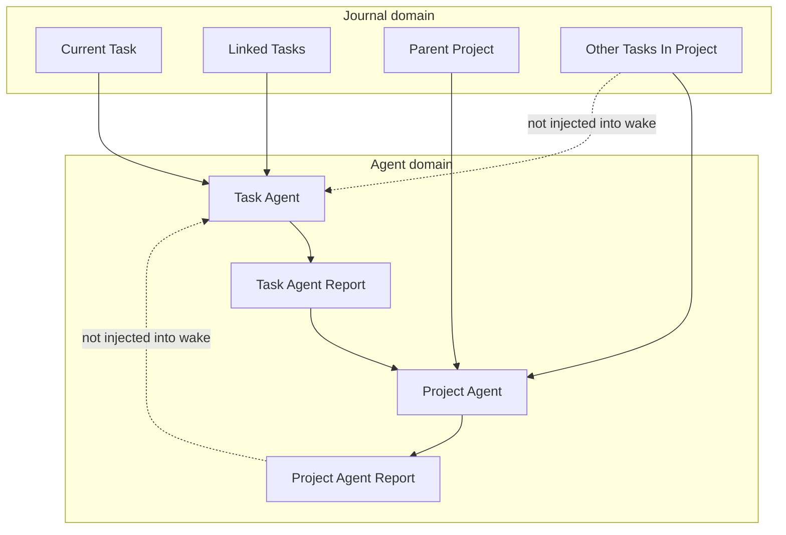
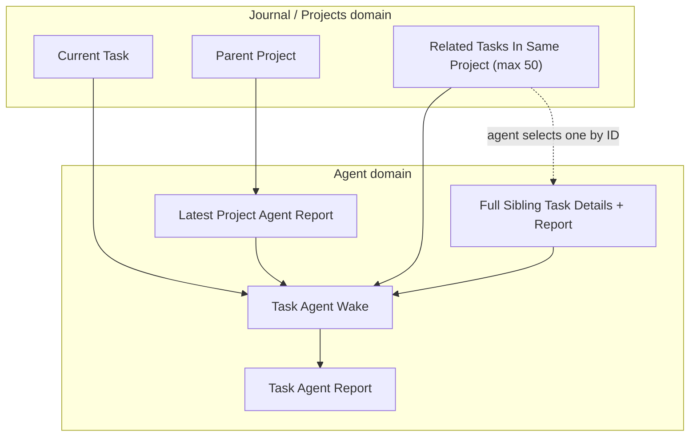
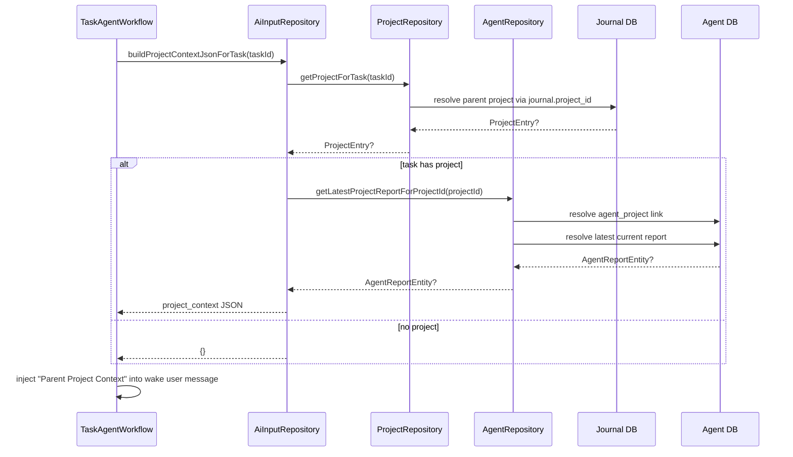
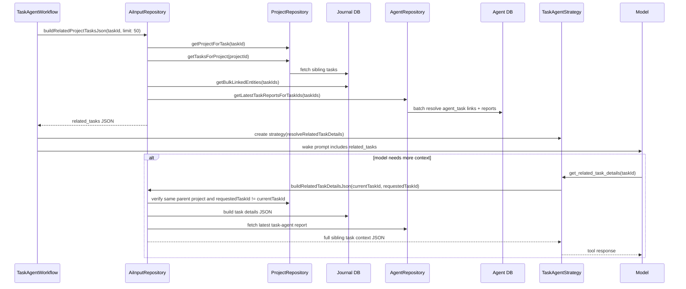

# Task Agent Project Awareness Implementation Plan

**Date:** 2026-03-28  
**Status:** Proposed  
**Scope:** Task-agent wake-cycle context only. No implementation code in this phase.  

## Summary

Task agents currently reason with:

- the current task JSON
- the task agent's prior report and observations
- linked-task context

Project agents already synthesize task-level information upward into a project report, but that information does not flow back down into the task agent. The result is a blind spot: a task agent can optimize for the local task while missing current project priorities, sequencing, blockers, and work already captured in sibling tasks.

This plan closes that gap in two phases:

1. **Phase 1: Inject the parent project's latest agent report into the task-agent wake context.**
2. **Phase 2: Inject a bounded sibling-task index and add a read-only drill-down tool so the task agent can inspect the full details of a relevant sibling task on demand.**

Both phases reuse the existing journal/project links and agent report infrastructure. No new database schema is required.

One explicit asymmetry is intentional:

- **Parent project context:** inject the latest project-agent report with both its `tldr` and full `content`.
- **Sibling task context:** inject only lightweight metadata plus a `tldr`, and fetch full sibling details only on demand.

## Goals

- Make task agents aware of the broader project they belong to.
- Reuse existing project-agent outputs instead of recomputing project summaries inside the task-agent wake.
- Keep prompt growth bounded.
- Keep the new task drill-down path read-only and explicitly scoped to the current project.
- Preserve the current failure-tolerant wake behavior: missing project links, missing project agents, or missing reports must not fail the wake.

## Non-Goals

- No new write-capable task-agent tools.
- No schema migration.
- No cross-project browsing from a task agent.
- No attempt to recursively inject full sibling-task reports into the initial wake prompt.
- No UI changes in this phase.

## Current State

The current architecture already has the information we need:

- `ProjectRepository.getProjectForTask(taskId)` resolves the parent project via the denormalized `journal.project_id` column.
- `ProjectRepository.getTasksForProject(projectId)` resolves sibling tasks.
- `AgentRepository` already resolves `agent_task` and `agent_project` links and can fetch current reports.
- `TaskAgentWorkflow` already assembles the task-agent wake user message.
- `TaskAgentStrategy` already supports local, read-only-in-effect tool handling for tools that should not go through the mutation executor (`update_report`, `record_observations`).

The gap is orchestration: task-agent wake assembly does not currently pull project-agent outputs or a bounded sibling-task index.

## Information Architecture

### Current Flow



### Target Flow



## Proposed Data Contracts

### Phase 1: Parent Project Context

Inject a new JSON block into the task-agent wake message:

```json
{
  "project": {
    "id": "project-123",
    "title": "Launch desktop sync",
    "status": "ACTIVE",
    "targetDate": "2026-04-15",
    "categoryId": "cat-456"
  },
  "latestProjectAgentReport": {
    "agentId": "agent-project-789",
    "createdAt": "2026-03-27T05:00:00.000Z",
    "tldr": "Desktop sync is on track, but backfill reliability is the main risk.",
    "content": "## 📊 Progress Overview\n..."
  }
}
```

If the task is not linked to a project, or the project has no project agent/report yet, omit the entire section.

This is the key requirement for Phase 1: when a project report exists, the task
agent should receive the **full current project report body**, not just the
project title or other shallow metadata. The project metadata is included only
to anchor that report.

### Phase 2: Related Tasks Context

Inject a second JSON block into the task-agent wake message:

```json
{
  "projectId": "project-123",
  "tasks": [
    {
      "id": "task-a",
      "title": "Stabilize replay queue",
      "status": "IN PROGRESS",
      "timeSpent": "05:20",
      "tldr": "Replay convergence failures reproduce only after offline bursts."
    }
  ]
}
```

Rules:

- Exclude the current task.
- Cap at **50** rows.
- Keep rows lightweight.
- Always include `id`, `title`, `status`, `timeSpent`, and `tldr`.
- `tldr` must come from the sibling task's stored task-agent report `tldr`.
- If no real stored `tldr` exists, do **not** synthesize one from report
  content, task metadata, or legacy summaries.
- Recommended policy: omit sibling tasks without a stored `tldr` from this
  lightweight related-task directory so every included row carries a real TLDR.

### Phase 2 Tool Response

The new read-only tool should return a fuller JSON object for one sibling task:

```json
{
  "task": {
    "...": "existing buildTaskDetailsJson payload"
  },
  "latestTaskAgentReport": {
    "agentId": "agent-task-001",
    "createdAt": "2026-03-26T19:30:00.000Z",
    "tldr": "Moved replay work behind a bounded queue.",
    "content": "## 📋 TLDR\n..."
  },
  "projectContext": {
    "projectId": "project-123",
    "projectTitle": "Launch desktop sync"
  }
}
```

The tool must reject:

- IDs that do not belong to the current task's parent project
- the current task's own ID

## Phase 1: Injecting Project Context

### Objective

Provide the task agent with the latest report from the agent assigned to the
task's parent project, including both the short `tldr` and the full report
`content`.

### Why Phase 1 Is Small

This phase is deliberately limited to prompt engineering and data wiring:

- no new tools
- no new persisted entities
- no new UI
- no schema changes

### Implementation Strategy

1. Resolve the parent project for the current task.
2. Resolve the primary `agent_project` link for that project.
3. Resolve the latest current-scope project report for that agent.
4. Serialize a `project_context` JSON block that includes:
   - project metadata for orientation
   - the report `tldr`
   - the full report `content`
5. Inject that block into the task-agent user message.
6. Add prompt guidance telling the task agent to treat the project report as top-down planning context, not as permission to blindly override task-local evidence.

### Recommended File Changes

#### 1. `lib/features/agents/database/agent_repository.dart`

Add a small, repository-level helper for project-agent report lookup.

Recommended shape:

- `Future<AgentReportEntity?> getLatestProjectReportForProjectId(String projectId)`

Implementation notes:

- Resolve `agent_project` links via `getLinksTo(projectId, type: AgentLinkTypes.agentProject)`.
- Use the same canonical tie-breaker already used elsewhere:
  - primary sort: `createdAt DESC`
  - secondary sort: `id DESC`
- Fetch the current report via `getLatestReport(agentId, AgentReportScopes.current)`.
- Skip empty report bodies.

Why here:

- The agent database already owns agent links and report heads.
- This keeps the "how do I find the right project agent report?" logic out of the workflow.

#### 2. `lib/features/ai/repository/ai_input_repository.dart`

Add a helper that turns "task ID -> parent project context JSON" into a pure data contract.

Recommended additions:

- inject `ProjectRepository` into `AiInputRepository`
- add `Future<String> buildProjectContextJsonForTask(String taskId)`

Implementation notes:

- Resolve project via `ProjectRepository.getProjectForTask(taskId)`.
- Resolve report via the new `AgentRepository` helper.
- Return `'{}'` when any step is absent.
- Serialize both project metadata and the latest project report.
- The latest project report serialization must include both:
  - `tldr`
  - full `content`
- Do not down-sample the project report to title-only or TLDR-only context.

Why here:

- `AiInputRepository` already exists as the task-context assembly boundary between journal/project data and prompt-building code.
- It avoids pushing JSON assembly into `TaskAgentWorkflow`.

#### 3. `lib/features/agents/workflow/task_agent_workflow.dart`

Update wake assembly to request and inject the new project context.

Changes:

- Fetch `projectContextJson` alongside `taskDetailsJson` and `linkedTasksJson`.
- Extend `_buildUserMessage(...)` to include:
  - `## Parent Project Context`
  - fenced JSON block
- Update the task-agent scaffold to explain what this section means:
  - it includes the parent project's latest full report and TLDR
  - it describes the broader project state
  - it should inform recommendations and prioritization
  - it does not override direct evidence in the current task unless the evidence is consistent

#### 4. Tests

Update:

- `test/features/agents/database/agent_repository_test.dart`
- `test/features/ai/repository/ai_input_repository_test.dart`
- `test/features/agents/workflow/task_agent_workflow_test.dart`

Core assertions:

- linked project with project agent report -> JSON block present
- linked project with project agent report -> both `tldr` and full `content` present
- linked project without project agent -> omitted / `'{}'`
- linked project with agent but no report -> omitted / `'{}'`
- unlinked task -> omitted / `'{}'`
- multiple `agent_project` links -> newest link wins deterministically
- wake still succeeds if project-context resolution throws

### Phase 1 Flow



## Phase 2: Related Tasks Context & Query Tool

### Objective

Provide the task agent with:

- awareness of the other tasks in the same project
- a bounded summary of those tasks
- a targeted, read-only tool to drill into one relevant sibling task when needed

### Design Principles

- **Bounded upfront context:** only lightweight metadata for up to 50 tasks.
- **On-demand detail:** full sibling-task details are fetched only when the agent explicitly asks.
- **Read-only by construction:** this tool is for context retrieval, not mutation.
- **Scoped visibility:** the tool may only access task IDs from the current project's related-task list.
- **Batch first:** do not resolve 50 task reports with N+1 queries.

### Recommended Ordering Rule

Use a deterministic "latest" order for the sibling-task list:

- primary: task `updatedAt DESC` if available from the entity metadata
- fallback: task `dateFrom` / `createdAt DESC`
- secondary tie-break: task ID descending

If product prefers "latest created" instead of "latest touched", that decision should be made before implementation. The plan assumes "latest touched" is the more useful ranking for agent context.

### Implementation Strategy

1. Resolve the parent project for the current task.
2. Resolve all tasks in that project.
3. Exclude the current task.
4. Sort deterministically and cap at 50.
5. Build lightweight rows containing:
   - `id`
   - `title`
   - `status`
   - `timeSpent`
   - `tldr`
6. Inject the list into the wake message.
7. Register a new read-only tool:
   - proposed name: `get_related_task_details`
8. Handle that tool locally in `TaskAgentStrategy`, using a repository callback passed from the workflow.
9. Validate the requested `taskId` against the related-task index from the current wake.
10. Return full task details plus the latest task-agent report for the requested sibling task.

### Recommended File Changes

#### 1. `lib/features/agents/database/agent_repository.dart`

Add a batch helper for task-agent report lookup by task IDs.

Recommended shape:

- `Future<Map<String, AgentReportEntity>> getLatestTaskReportsForTaskIds(List<String> taskIds)`

Implementation notes:

- use `getLinksToMultiple(taskIds, type: AgentLinkTypes.agentTask)`
- reuse `getLatestReportsByAgentIds(...)`
- select the primary link per task with the same canonical ordering
- return map keyed by task ID, not agent ID

Why:

- Phase 2 needs up to 50 sibling-task summaries.
- Calling `getLinksTo()` + `getLatestReport()` 50 times would create avoidable query fan-out.

#### 2. `lib/features/ai/repository/task_summary_resolver.dart`

Do not use summary synthesis for this Phase 2 sibling-task directory.

Recommended additions:

- either keep this file unchanged, or add a very small helper that only reads
  a stored task-agent report `tldr`

Suggested rules:

- prefer `report.tldr`
- else treat the task as having no usable TLDR for the Phase 2 directory

This plan explicitly rejects synthesizing TLDR-like text from full reports or
legacy summaries for sibling-task rows.

#### 3. `lib/features/ai/repository/ai_input_repository.dart`

Add two new builders:

- `Future<String> buildRelatedProjectTasksJson({required String taskId, int limit = 50})`
- `Future<String?> buildRelatedTaskDetailsJson({required String currentTaskId, required String requestedTaskId})`

Implementation notes for `buildRelatedProjectTasksJson(...)`:

- resolve parent project
- fetch tasks via `ProjectRepository.getTasksForProject(projectId)`
- exclude `currentTaskId`
- sort and cap
- use `JournalDb.getBulkLinkedEntities(taskIds)` to derive time spent without N+1
- use the new batch agent-report helper to read stored `tldr` values
- do not generate TLDRs from `content` or any legacy summary source
- recommended policy: drop rows that have no stored `tldr`
- return `'{}'` if the current task has no project or no siblings

Implementation notes for `buildRelatedTaskDetailsJson(...)`:

- resolve current task's project
- resolve requested task's project
- reject if the requested task is not in the same project
- reuse `buildTaskDetailsJson(id: requestedTaskId)` for the task payload
- attach the latest task-agent report for that sibling task
- do **not** recursively embed that sibling's own related-task index

Why this belongs in `AiInputRepository`:

- it already owns task-context JSON shaping
- it already understands task summaries and time-spent derivation
- it keeps prompt assembly inputs data-oriented

#### 4. `lib/features/agents/tools/agent_tool_registry.dart`

Add the new read-only tool definition.

Recommended tool:

- name: `get_related_task_details`
- parameters:
  - `taskId: string`

Description guidance:

- only use when a sibling task from `related_tasks` appears directly relevant
- use sparingly
- this tool returns full details for one related task in the same project

Important:

- do **not** add it to `deferredTools`
- do **not** add it to `explodedBatchTools`
- update test expectations for tool count and schema coverage

#### 5. `lib/features/agents/workflow/task_agent_strategy.dart`

Handle the tool locally, similar to `update_report` and `record_observations`.

Recommended additions:

- new constructor inputs:
  - `Future<String?> Function(String requestedTaskId) resolveRelatedTaskDetails`
- new constant:
  - `relatedTaskDetailsToolName = TaskAgentToolNames.getRelatedTaskDetails`
- new local handler:
  - call `resolveRelatedTaskDetails`
  - return JSON string on success
  - return an explicit error message when:
    - the requested ID is the current task
    - the requested task is not in the same parent project
    - the requested task cannot be resolved
  - audit with `_recordActionMessage(...)` and `_recordToolResultMessage(...)`

Why local handling is the right boundary:

- the tool is read-only
- the tool must be scoped to the current task's parent project, not generic
  category mutation rules
- it fits the existing pattern for special-case tools that do not go through `AgentToolExecutor`

#### 6. `lib/features/agents/workflow/task_agent_workflow.dart`

Wire Phase 2 into wake setup.

Changes:

- fetch `relatedProjectTasksJson`
- pass `resolveRelatedTaskDetails` into `TaskAgentStrategy`
- inject:
  - `## Related Tasks In This Project`
  - fenced JSON block
- update the system prompt to explain:
  - this list is a lightweight directory, not full context
  - the agent should query only when a sibling task is materially relevant
  - it should avoid unnecessary drill-down calls
  - the drill-down tool is limited to other tasks in the same parent project

#### 7. Tests

Update:

- `test/features/agents/database/agent_repository_test.dart`
- `test/features/ai/repository/ai_input_repository_test.dart`
- `test/features/agents/tools/agent_tool_registry_test.dart`
- `test/features/agents/workflow/task_agent_strategy_test.dart`
- `test/features/agents/workflow/task_agent_workflow_test.dart`

Core assertions:

- sibling-task list excludes the current task
- list is capped at 50
- ordering is deterministic
- time spent is correctly derived
- TLDR comes only from a stored report `tldr`
- tasks without a stored `tldr` are not synthesized into pseudo-TLDR rows
- tool rejects the current task's own ID
- tool rejects IDs that are outside the current task's parent project
- tool returns full task details + latest report for a valid sibling task
- wake still succeeds when sibling lookup partially fails

### Phase 2 Flow



## Step-by-Step Breakdown

### Phase 1

1. Add project-agent report lookup helper to `AgentRepository`.
2. Inject `ProjectRepository` into `AiInputRepository`.
3. Add `buildProjectContextJsonForTask(taskId)` to `AiInputRepository`.
4. Update `TaskAgentWorkflow.execute(...)` to fetch the new JSON block.
5. Update `_buildUserMessage(...)` to render the parent project context section.
6. Update the task-agent scaffold text so the model knows how to use this context.
7. Add repository and workflow tests.

### Phase 2

1. Add batch task-report lookup helper to `AgentRepository`.
2. Extend summary resolution so bounded TLDRs can be produced cheaply.
3. Add `buildRelatedProjectTasksJson(...)` to `AiInputRepository`.
4. Add `buildRelatedTaskDetailsJson(...)` to `AiInputRepository`.
5. Register `get_related_task_details` in `AgentToolRegistry`.
6. Handle the new tool locally in `TaskAgentStrategy`.
7. Pass related-task allowlist + resolver callback from `TaskAgentWorkflow` into the strategy.
8. Inject the related-task directory into the task-agent wake prompt.
9. Add tests for the repository, strategy, workflow, and registry.

## Failure Handling

The new context paths should follow the same failure-tolerant philosophy as the existing linked-task context path:

- if project lookup fails: omit the section
- if project agent/report lookup fails: omit the section
- if related-task list build fails: omit the section
- if one sibling task summary fails inside the batch: skip that sibling row entirely (do not include rows without a stored `tldr`)
- if the read-only tool is called with an invalid ID: return a tool error to the model, do not throw

No failure in these new context paths should abort the wake.

## Prompt Budget Controls

To keep wake prompts bounded:

- Phase 1 injects only one parent-project report, but it is the full latest
  report body plus TLDR. It does not inject project recommendations or any
  sibling-task full payloads.
- Phase 2 caps the sibling-task list at 50 rows.
- Phase 2 uses lightweight TLDRs, not full sibling-task reports.
- The read-only drill-down tool fetches full sibling details only on demand.

## Acceptance Criteria

### Phase 1

- A task linked to a project receives its parent project's latest project-agent
  report in the next wake.
- The injected project-agent report includes both the `tldr` and the full
  `content`.
- Unlinked tasks still run exactly as before.
- Missing project agents or project reports do not fail the wake.
- Repository and workflow tests cover deterministic project-agent report selection.

### Phase 2

- A task linked to a project receives a related-task directory capped at 50 entries.
- Each related-task row contains `id`, `title`, `status`, `timeSpent`, and `tldr`.
- Each sibling-task `tldr` is a real stored task-agent report `tldr`, not a
  synthesized excerpt or legacy-summary fallback.
- The current task is excluded from the directory.
- The new tool returns full details only for other tasks in the same parent
  project, and rejects the current task's own ID.
- The tool is read-only and cannot browse arbitrary tasks.
- Query volume remains batch-oriented rather than N+1.

## Recommended Implementation Order

1. Land the Phase 1 repository helper and prompt injection first.
2. Verify the resulting wake prompt is useful before expanding prompt surface further.
3. Land the Phase 2 batch summary path next.
4. Add the read-only drill-down tool last, once the bounded sibling-task index is in place.

That sequencing keeps the first release low risk and makes each phase independently reviewable.
