# Pluggable Soul Documents

Status: Architecture proposal
Date: 2026-04-05
Companion docs:
- `docs/implementation_plans/2026-02-19_agentic_product_direction.md` (§9.1 Persona/Soul Artifact Contract)
- `lib/features/agents/README.md` (Planned Improvements section)

## 1. Problem Statement

Agent personality and task-execution skills are tightly coupled inside
`AgentTemplateVersionEntity.generalDirective`. This field currently contains
persona, available tools, objectives, user-sovereignty rules, and tool
discipline — all fused into a single text blob.

Consequences:

- **No personality reuse.** Laura's warmth cannot be applied to a project agent
  without copy-pasting directive text.
- **Coupled evolution.** Refining the agent's tone forces a full template
  version bump, even when no skill changes were made.
- **No independent evolution cadence.** Personality and skills evolve at the
  same rate through the same ritual, despite being fundamentally different
  concerns — personality is cross-cutting and slow-moving; skills are
  template-specific and fast-moving.

## 2. Goal

Extract personality into a standalone, versioned, pluggable entity called a
**Soul Document**. This enables:

1. **Separation of concerns** — personality definitions are independent of
   task-execution skills.
2. **Pluggable assignment** — a soul can be dynamically assigned to and swapped
   between templates.
3. **Independent evolution** — personality has its own feedback-driven
   evolution cycle, aggregating signals from all templates that use the soul.

Inspired by the "Bicentennial Man" concept of swapping personality chips.

## 3. Current Architecture

### 3.1 Template Directive Structure (Today)

```text
AgentTemplateVersionEntity
├── generalDirective  →  persona + tools + objectives (MIXED)
├── reportDirective   →  report structure (clean, single concern)
└── directives        →  legacy single field (deprecated)
```

### 3.2 System Prompt Assembly (Today)

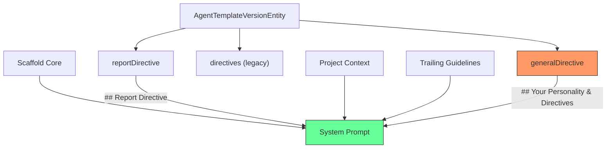

The `generalDirective` content lands under a single `## Your Personality &
Directives` heading, mixing identity with operational instructions.

### 3.3 Evolution Cycle (Today)

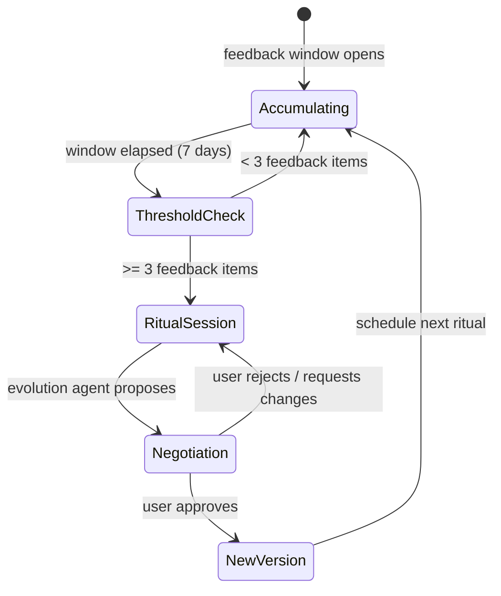

A single `ImproverAgentWorkflow` drives one cycle that proposes both
personality and skill changes as an atomic `generalDirective` +
`reportDirective` pair. There is no way to evolve personality independently.

## 4. Proposed Architecture

### 4.1 Entity Model

Three new variants join the `AgentDomainEntity` Freezed sealed union, following
the established template pattern (entity → version → head):

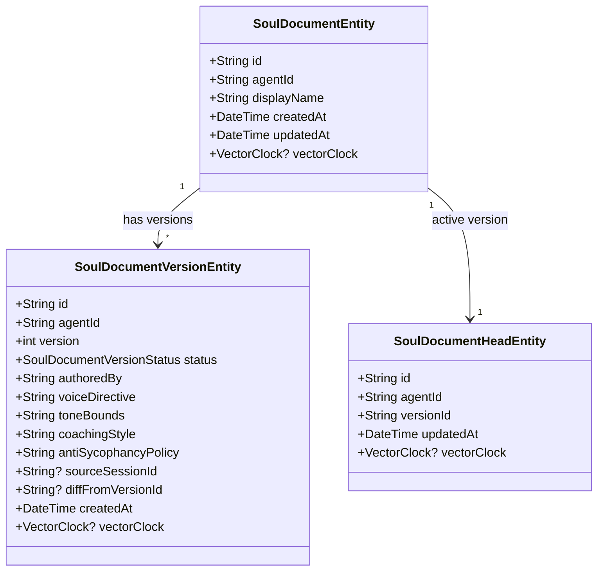

#### Why These Fields

The product direction doc (§9.1) specifies:

| Field | Purpose |
|-------|---------|
| `voiceDirective` | Core personality: tone, warmth, humor, style, communication patterns |
| `toneBounds` | Guardrails on voice — what the personality must never do |
| `coachingStyle` | How the personality coaches, mentors, and motivates the user |
| `antiSycophancyPolicy` | Directness contract — when to push back vs. comply |

These are individually addressable fields rather than a single text blob so the
evolution agent can propose targeted changes (e.g., adjust `toneBounds` without
rewriting `voiceDirective`).

### 4.2 Link-Based Assignment

A new `SoulAssignmentLink` variant in the `AgentLink` union connects templates
to their soul:

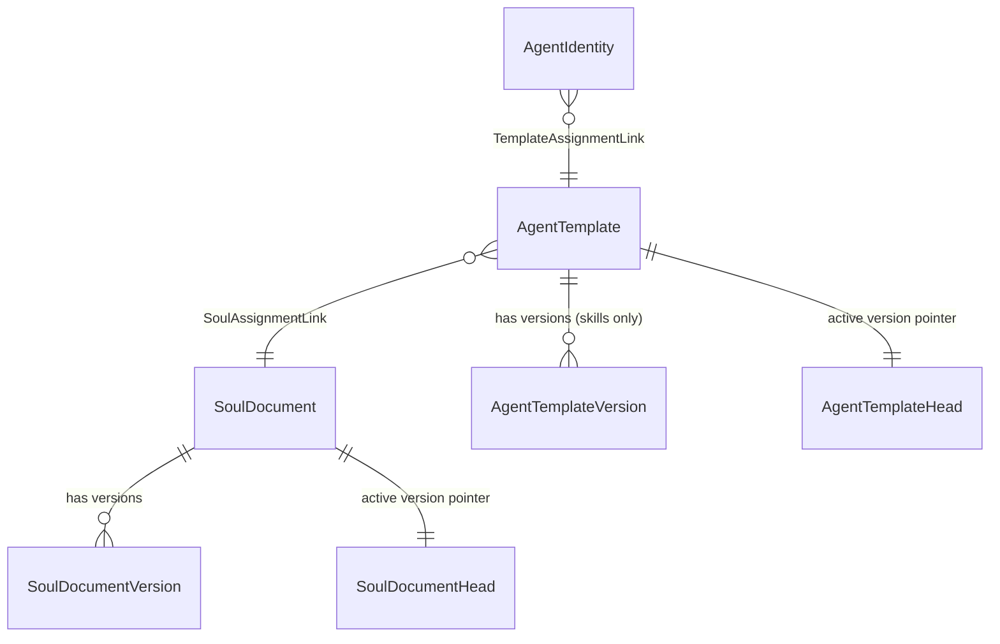

**Key invariant:** One active soul per template. Multiple templates can share
the same soul. An agent instance inherits its soul through its template
assignment.

### 4.3 Directive Scope After Refactoring

| Field | Before | After |
|-------|--------|-------|
| `generalDirective` | persona + tools + objectives | **Skills only**: tools, objectives, sovereignty rules, tool discipline |
| `reportDirective` | report structure | report structure (unchanged) |
| Soul `voiceDirective` | N/A | Core personality: tone, style, warmth |
| Soul `toneBounds` | N/A | Personality guardrails |
| Soul `coachingStyle` | N/A | Coaching and mentoring approach |
| Soul `antiSycophancyPolicy` | N/A | Directness contract |

### 4.4 System Prompt Assembly (After)

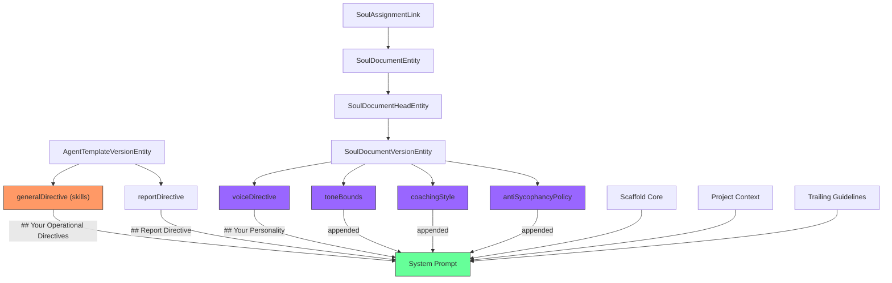

The prompt changes from:

```text
[scaffold core]
[report directive]
[project context]
[trailing]
## Your Personality & Directives
[generalDirective — persona + skills mixed]
```

To:

```text
[scaffold core]
[report directive]
[project context]
[trailing]
## Your Personality
[voiceDirective]
[toneBounds]
[coachingStyle]
[antiSycophancyPolicy]
## Your Operational Directives
[generalDirective — skills only]
```

**Fallback:** When no soul is assigned to a template, the existing
`generalDirective` is injected under `## Your Personality & Directives` as
today. Zero breaking changes for existing templates.

### 4.5 Soul Resolution at Wake Time

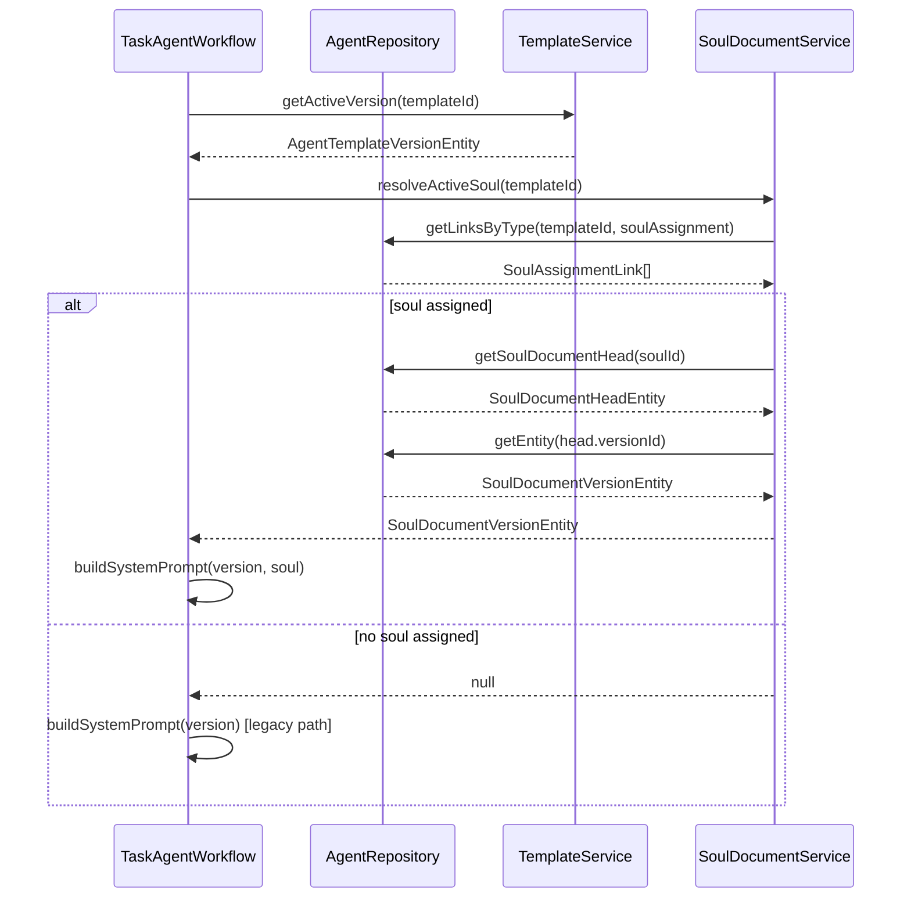

### 4.6 Wake Run Provenance

Every wake trace records which soul version was active, extending the existing
provenance pattern:

```text
wake_run_log (extended)
├── template_id            (existing)
├── template_version_id    (existing)
├── soul_document_id       (NEW)
├── soul_document_version_id (NEW)
```

`WakeTokenUsageEntity` gains matching optional fields. This enables:
- Auditing which personality was active for any historical wake
- Correlating personality changes with performance metric shifts

## 5. Evolution Cycle Design

### 5.1 One-Stop-Shop: Unified 1-on-1 Ritual

The 1-on-1 ritual is a **single conversation** that can evolve both skills and
personality. There is no separate soul evolution cycle — the existing
`templateImprover` gains the ability to propose soul changes alongside skill
changes.

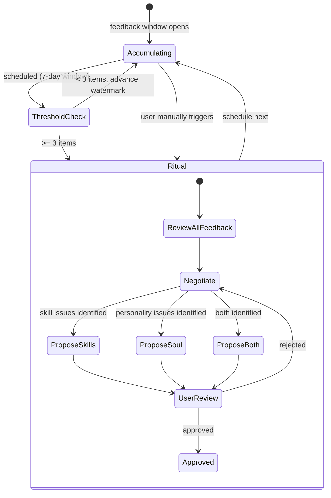

The evolution agent sees **all feedback** — skill-related, personality-related,
and general — in a single context. It decides what to propose based on what the
data shows. Some rituals produce only skill changes, some only personality
changes, some both, some neither.

### 5.2 Two Tools, One Conversation

The `templateImprover` agent gains a second proposal tool:

| Tool | What it changes | Scope of impact |
|------|----------------|-----------------|
| `propose_directives` | `generalDirective` + `reportDirective` | This template only |
| `propose_soul_directives` | `voiceDirective` + `toneBounds` + `coachingStyle` + `antiSycophancyPolicy` | **All templates using this soul** |

Both tools can be called in the same session. The evolution agent can propose
skill changes first, then personality changes, or vice versa, or both at once.

**Cross-template impact notice:** When the evolution agent calls
`propose_soul_directives`, it must include a notice listing all other templates
that share this soul and will be affected. The UI renders this prominently so
the user approves with full awareness.

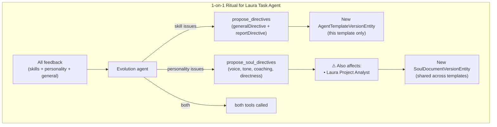

### 5.3 Observation Targeting

To help the evolution agent and feedback extraction service distinguish
personality feedback from skill feedback, add a **required**
`ObservationTarget` enum (`soul | template | both`) field on observations. The
recording agent must classify each observation at write time. The
`record_observations` tool schema enforces this — the agent always has enough
context to make the call, and a wrong classification is better than no
classification (the user can still correct it during the evolution ritual).

### 5.4 Enriched Ritual Context

The `EvolutionContextBuilder` is extended to include soul context alongside the
existing template context:

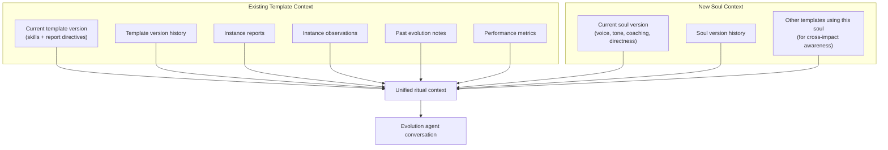

The evolution agent receives the full picture in one context window:
- What the skills say (and how they've changed)
- What the personality says (and how it's changed)
- All feedback, tagged with `ObservationTarget` for easy triage
- Which other templates share this soul (for impact awareness)

### 5.5 Propose Soul Directives Tool

New tool added to the evolution agent's toolset:

```text
propose_soul_directives
├── voice_directive: String        (complete rewritten text)
├── tone_bounds: String            (complete rewritten text)
├── coaching_style: String         (complete rewritten text)
├── anti_sycophancy_policy: String (complete rewritten text)
├── rationale: String              (what changed and why)
├── cross_template_notice: String  (impact statement for shared templates)
```

At least one directive field must be non-empty. The evolution agent outputs
COMPLETE new text for each field, not diffs. The `cross_template_notice` is
rendered in the approval UI so the user sees the blast radius.

### 5.6 Approval Flow

Skill and soul proposals are approved independently within the same session:

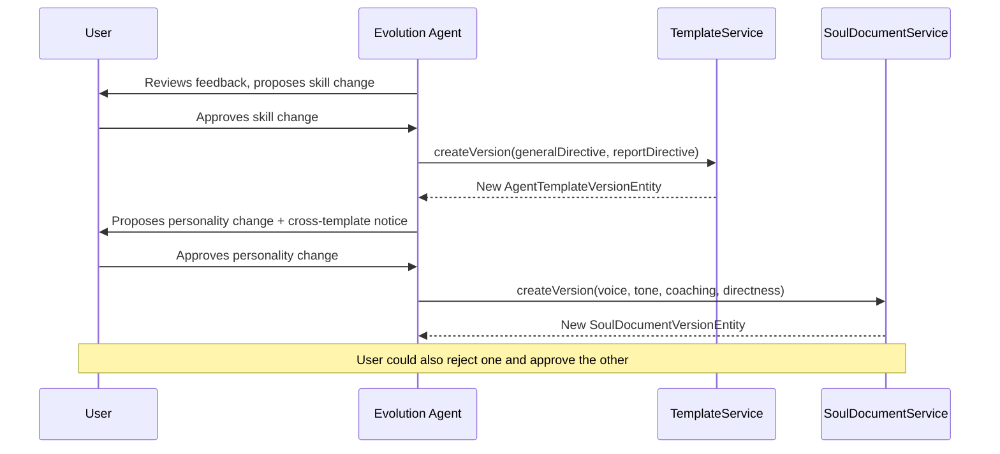

The user can approve skills but reject personality (or vice versa) in the same
session. Each proposal is independent.

## 6. Storage Design

### 6.1 No Schema Migration Required

All three new entities use the existing `agent_entities` table with new `type`
discriminator values:

| Entity | `type` value | `subtype` |
|--------|-------------|-----------|
| `SoulDocumentEntity` | `soulDocument` | — |
| `SoulDocumentVersionEntity` | `soulDocumentVersion` | — |
| `SoulDocumentHeadEntity` | `soulDocumentHead` | — |

The `SoulAssignmentLink` uses the existing `agent_links` table with
`type = 'soul_assignment'`.

This follows the established pattern — no DDL changes, no schema version bump.
The Freezed `@Freezed(fallbackUnion: 'unknown')` annotation on
`AgentDomainEntity` provides forward compatibility for older clients that
encounter these new type values during sync.

### 6.2 New Named Queries

Add to `agent_database.drift`:

```sql
-- Soul document queries
getSoulDocumentsByType:
  SELECT * FROM agent_entities
  WHERE type = 'soulDocument' AND deleted_at IS NULL
  ORDER BY updated_at DESC;

getSoulDocumentHead:
  SELECT * FROM agent_entities
  WHERE agent_id = :soulId AND type = 'soulDocumentHead'
    AND deleted_at IS NULL
  LIMIT 1;

getSoulDocumentVersions:
  SELECT * FROM agent_entities
  WHERE agent_id = :soulId AND type = 'soulDocumentVersion'
    AND deleted_at IS NULL
  ORDER BY created_at DESC;

-- Soul assignment link queries
getSoulAssignmentForTemplate:
  SELECT * FROM agent_links
  WHERE from_id = :templateId AND type = 'soul_assignment'
    AND deleted_at IS NULL
  ORDER BY created_at DESC
  LIMIT 1;

getTemplatesForSoul:
  SELECT * FROM agent_links
  WHERE to_id = :soulId AND type = 'soul_assignment'
    AND deleted_at IS NULL;
```

### 6.3 Sync Compatibility

Soul entities sync via the existing Matrix-based `AgentSyncService` pipeline
with no changes. Vector clocks, tombstone deletion, and conflict resolution
apply identically.

## 7. Implementation Plan

### Phase 1: Data Model & Storage (Foundation)

**Goal:** New entities exist, serialize correctly, and can be persisted.

1. Add `SoulDocumentVersionStatus` enum to `agent_enums.dart`.
2. Add `SoulDocumentEntity`, `SoulDocumentVersionEntity`,
   `SoulDocumentHeadEntity` variants to `agent_domain_entity.dart`.
3. Add `SoulAssignmentLink` variant to `agent_link.dart`.
4. Run `build_runner` to regenerate Freezed/JSON code.
5. Add named queries to `agent_database.drift`.
6. Add repository methods to `AgentRepository`:
   - `getSoulDocuments()`, `getSoulDocumentHead()`,
     `getSoulDocumentVersions()`, `getSoulAssignmentForTemplate()`,
     `getTemplatesForSoul()`
7. Write unit tests:
   - Serialization roundtrip for all three new entity types
   - Link serialization roundtrip
   - Repository CRUD operations
   - Head pointer update semantics

**Files touched:**
- `lib/features/agents/model/agent_enums.dart`
- `lib/features/agents/model/agent_domain_entity.dart`
- `lib/features/agents/model/agent_link.dart`
- `lib/features/agents/database/agent_database.drift`
- `lib/features/agents/database/agent_repository.dart`
- New test files mirroring the above

### Phase 2: Soul Document Service & Seeding

**Goal:** Souls can be created, versioned, assigned to templates, and seeded
from existing personality content.

1. Create `SoulDocumentService` (parallel to `AgentTemplateService`):
   - `createSoul(displayName)` → creates entity + initial version + head
   - `createVersion(soulId, fields)` → archives old, creates new active version
   - `getActiveSoulVersion(soulId)` → resolves head → version
   - `rollbackToVersion(soulId, versionId)` → moves head pointer
   - `assignSoulToTemplate(templateId, soulId)` → creates/replaces link
   - `unassignSoul(templateId)` → soft-deletes link
   - `resolveActiveSoulForTemplate(templateId)` → link → head → version
2. Extract personality content from existing seeded directives:
   - Parse opening personality paragraph from `taskAgentGeneralDirective` →
     `voiceDirective`
   - Create six seeded soul documents, each with a distinct personality:

     | Soul | Voice | Style |
     |------|-------|-------|
     | **Laura** | Warm, clear, action-oriented | Encouraging and focused; makes progress feel tangible |
     | **Tom** | Creative and analytical | Thinks through problems; finds innovative angles |
     | **Max** | Terse, efficiency-obsessed, dry wit | Mission-briefing style; says in 10 words what others say in 50 |
     | **Iris** | Investigative and pattern-hunting | Connects dots others miss; slightly provocative; flags when a task seems misguided |
     | **Sage** | Calm, methodical, coaching-oriented | Frames reports as learning moments; gently surfaces overcommitment and priority drift |
     | **Kit** | Energetic, momentum-focused | Celebrates progress, flags stalls early; slightly impatient with lingering tasks |

   - Laura and Tom souls are extracted from the personality content in their
     existing template `directives` fields
   - Max, Iris, Sage, and Kit are new souls with fresh personality directives
   - Souls are **independent of templates**. Six souls exist as a palette;
     the user assigns whichever soul they want to any template.
   - Templates remain unchanged: Laura and Tom (task agents), Project Analyst
     (project agent). No new templates are created — the new personalities
     are souls, not templates.
3. Seed default `SoulAssignmentLink` entries:
   - `lauraTemplateId` → Laura soul
   - `tomTemplateId` → Tom soul
   - `projectTemplateId` → Laura soul (default; user can swap to any soul)
   - Max, Iris, Sage, and Kit souls are available for assignment but not
     pre-assigned — the user picks them from the soul palette in settings
5. Strip personality from `taskAgentGeneralDirective` and
   `projectAgentGeneralDirective` in `seeded_directives.dart`, leaving only
   skills/tools/sovereignty
6. Write unit tests for the service

**Files touched:**
- New: `lib/features/agents/service/soul_document_service.dart`
- `lib/features/agents/model/seeded_directives.dart`
- Template seeding code (where `seedDefaultTemplates` is called)
- New test files

### Phase 3: Prompt Assembly Refactoring

**Goal:** Wake prompts cleanly separate personality from skills.

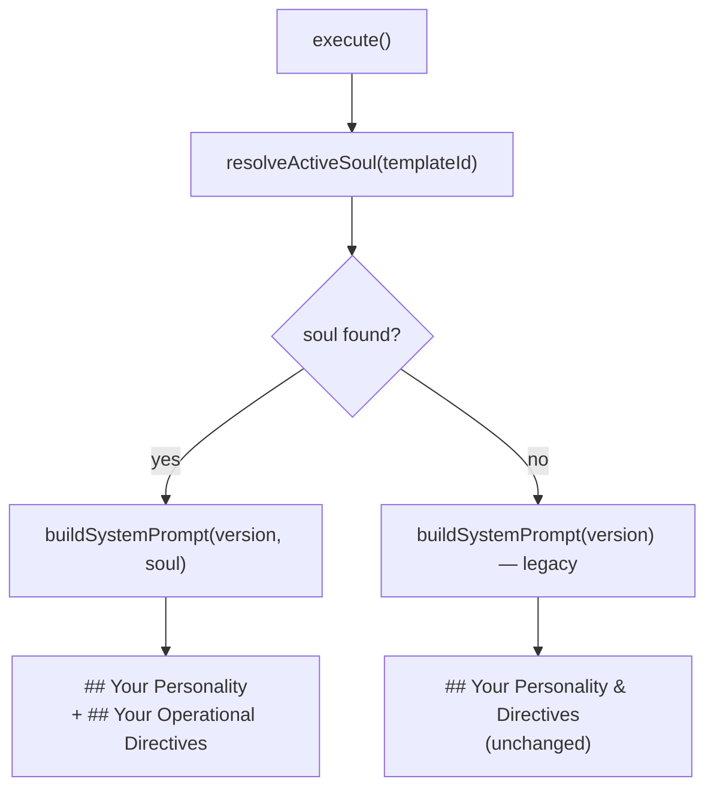

1. Modify `TaskAgentWorkflow`:
   - Inject `SoulDocumentService` dependency
   - In `execute()`, call `resolveActiveSoulForTemplate()` before prompt
     assembly
   - In `_buildSystemPrompt()`, accept optional `SoulDocumentVersionEntity`
   - When soul is present: emit `## Your Personality` from soul fields, then
     `## Your Operational Directives` from `generalDirective`
   - When soul is absent: preserve existing `## Your Personality & Directives`
     behavior
2. Mirror changes in `ProjectAgentWorkflow._buildSystemPrompt()`
3. Add `soulDocumentId` and `soulDocumentVersionId` to:
   - `WakeTokenUsageEntity`
   - `wake_run_log` table columns
4. Update wake run creation to record soul provenance
5. Update existing workflow tests

**Files touched:**
- `lib/features/agents/workflow/task_agent_workflow.dart`
- `lib/features/agents/workflow/project_agent_workflow.dart`
- `lib/features/agents/model/agent_domain_entity.dart` (token usage fields)
- `lib/features/agents/database/agent_database.drift` (wake run log columns)
- Existing test files for both workflows

### Phase 4: Unified Evolution — Soul Tool & Context

**Goal:** The existing 1-on-1 ritual becomes a one-stop shop that can evolve
both skills and personality in a single conversation.

1. Add `propose_soul_directives` tool to `AgentToolRegistry`:
   - Parameters: `voice_directive`, `tone_bounds`, `coaching_style`,
     `anti_sycophancy_policy`, `rationale`, `cross_template_notice`
   - At least one directive field must be non-empty
2. Update `EvolutionStrategy` to handle `propose_soul_directives`:
   - Capture as `PendingSoulProposal` (parallel to existing
     `PendingProposal`)
   - Render GenUI approval surface with cross-template impact notice
3. Update `EvolutionContextBuilder` to include soul context:
   - Current soul version (all 4 fields)
   - Soul version history (last 5)
   - List of other templates sharing this soul (for impact awareness)
4. Update `TemplateEvolutionWorkflow.approveProposal()`:
   - Handle soul proposals: create `SoulDocumentVersionEntity`, update
     `SoulDocumentHeadEntity`
   - Skill and soul proposals approved independently in the same session
5. Update `propose_directives` tool description to clarify it covers
   operational skills only
6. Update template improver seeded directive
   (`templateImproverGeneralDirective`) to explain the two tools and when
   to use each
7. Add `ObservationTarget` enum (`soul | template | both`) to
   `agent_enums.dart`
8. Add required `observationTarget` field to observation metadata
9. Update `record_observations` tool to require a `target` parameter

**Files touched:**
- `lib/features/agents/tools/agent_tool_registry.dart`
- `lib/features/agents/workflow/evolution_strategy.dart`
- `lib/features/agents/workflow/evolution_context_builder.dart`
- `lib/features/agents/workflow/template_evolution_workflow.dart`
- `lib/features/agents/model/seeded_directives.dart`
- `lib/features/agents/model/agent_enums.dart`
- Existing and new test files

### Phase 5: UI & Settings

**Goal:** Users can view, create, assign, and swap souls through the settings
UI.

1. Add "Souls" tab to `AgentSettingsPage` (alongside Templates, Instances,
   Pending Wakes)
2. Soul list view: display name, assigned template count, version count
3. Soul detail view:
   - Current personality fields (voice, tone, coaching, directness)
   - Version history with diff view
   - List of assigned templates
4. Soul assignment UI: dropdown on template detail page to select/swap soul
5. Evolution chat: existing `EvolutionChatPage` gains soul proposal rendering
   (cross-template impact notice, independent approve/reject for skill vs
   soul proposals)
6. Add Riverpod providers for soul state management

**Files touched:**
- `lib/features/agents/ui/agent_settings_page.dart`
- New: `lib/features/agents/ui/soul/` directory with list, detail, assignment
  widgets
- `lib/features/agents/ui/evolution/evolution_chat_page.dart`
- New: `lib/features/agents/state/soul_providers.dart`
- Widget test files

### Phase 6: Migration & Documentation

**Goal:** Existing templates seamlessly adopt the new architecture.

1. Write idempotent seeding migration:
   - Create soul documents from existing personality content in seeded
     directives
   - Create initial soul versions with extracted personality fields
   - Create soul assignment links for seeded templates
   - Strip personality from existing `generalDirective` in seeded versions
2. For user-evolved templates with custom directives:
   - Leave them on the legacy fallback path (no soul assigned)
   - The next evolution ritual can propose splitting the personality out
   - Or the user can manually create a soul and assign it
3. Update `lib/features/agents/README.md`:
   - Document the soul document architecture
   - Add Mermaid diagrams for soul resolution flow
   - Update "Planned Improvements" to reflect implementation
4. Update `docs/implementation_plans/2026-02-19_agentic_product_direction.md`:
   - Mark §9.1 Persona/Soul Artifact Contract as implemented
5. Add CHANGELOG entry

## 8. Design Decisions & Trade-offs

### Soul assignment lives on the template, not the instance

**Decision:** `SoulAssignmentLink` connects template → soul. Instances inherit
through their template.

**Rationale:** Personality is part of the agent's *design*, not its runtime
state. All instances of a template should share the same personality. If
instance-level personality overrides are needed in the future, add an optional
`soulOverrideId` field on `AgentIdentityEntity` — but this is not in scope.

### Structured fields vs. single text blob for personality

**Decision:** Four structured fields (`voiceDirective`, `toneBounds`,
`coachingStyle`, `antiSycophancyPolicy`).

**Rationale:**
- The evolution agent can propose targeted changes without rewriting everything
- The product direction doc (§9.1) explicitly requires these fields
- Individual fields enable future UI that lets users edit specific aspects
- Diff views become meaningful (which *aspect* of personality changed?)

**Trade-off:** More rigid than a free-form blob. If a personality dimension
doesn't fit any of the four fields, it would need to be shoe-horned in or the
schema extended.

### Same `agent_entities` table, no DDL migration

**Decision:** New entities use existing table with new `type` discriminator
values.

**Rationale:**
- Zero schema migration — no risk of data loss during upgrade
- Uses existing sync infrastructure without changes
- `@Freezed(fallbackUnion: 'unknown')` provides forward compatibility
- Follows the established pattern used by all other agent entities

### Unified 1-on-1 ritual, not separate evolution cycles

**Decision:** A single ritual per template can propose both skill and
personality changes. No separate `soulImprover` agent kind.

**Rationale:**
- One-stop shop for the user — no juggling separate rituals
- The evolution agent sees all feedback in context and decides what to propose
- Skill and personality changes often interact (e.g., a terse personality
  needs different report directives) — seeing both together produces more
  coherent proposals
- Soul proposals include a cross-template impact notice so the user approves
  personality changes with full awareness of blast radius

**Trade-off:** The evolution agent has more responsibility and a larger context
window. Mitigated by the structured observation targeting (`ObservationTarget`)
that helps it triage feedback.

### Backwards-compatible fallback path

**Decision:** Templates without a soul assignment fall back to existing
`generalDirective` behavior with no changes.

**Rationale:**
- Zero breaking changes for existing users
- Gradual adoption — users can migrate templates to souls at their own pace
- User-evolved templates with custom mixed directives continue to work
- The system never forces a personality extraction

## 9. Risks & Mitigations

| Risk | Likelihood | Impact | Mitigation |
|------|-----------|--------|------------|
| Personality/skill boundary is fuzzy in existing directives | Medium | Medium | Conservative migration: only extract from seeded defaults where the boundary is clear. User-evolved directives stay on legacy path. |
| Evolution agent proposes soul changes without understanding cross-template impact | Low | High | `cross_template_notice` is a required field on `propose_soul_directives`. UI renders it prominently. User sees full blast radius before approving. |
| Evolution agent context window grows too large with soul + skill context | Medium | Low | Soul context is compact (4 structured fields + version history). Observation targeting helps the agent focus on relevant feedback. |
| Existing tests break from prompt format change | High | Low | Fallback path preserves exact existing behavior. New path only activates when soul is assigned. Prompt tests updated in Phase 3. |

## 10. Success Criteria

1. A soul document can be created, versioned, and assigned to any template.
2. Swapping a template's soul immediately changes the personality on the next
   wake — no template version bump required.
3. Multiple templates can share the same soul document.
4. The 1-on-1 ritual can propose both skill and personality changes in a
   single conversation.
5. Soul proposals display a cross-template impact notice before approval.
6. Six seeded souls available as a personality palette (Laura, Tom, Max, Iris,
   Sage, Kit).
7. Existing templates without soul assignments continue to work identically.
8. All soul entity operations sync across devices via the existing Matrix
   pipeline.
9. Wake run provenance records the soul version used.
10. Rollback to any previous soul version is a single head-pointer move.
