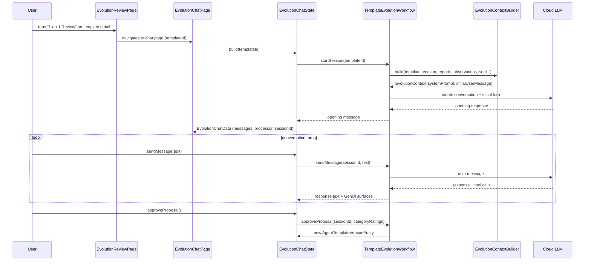
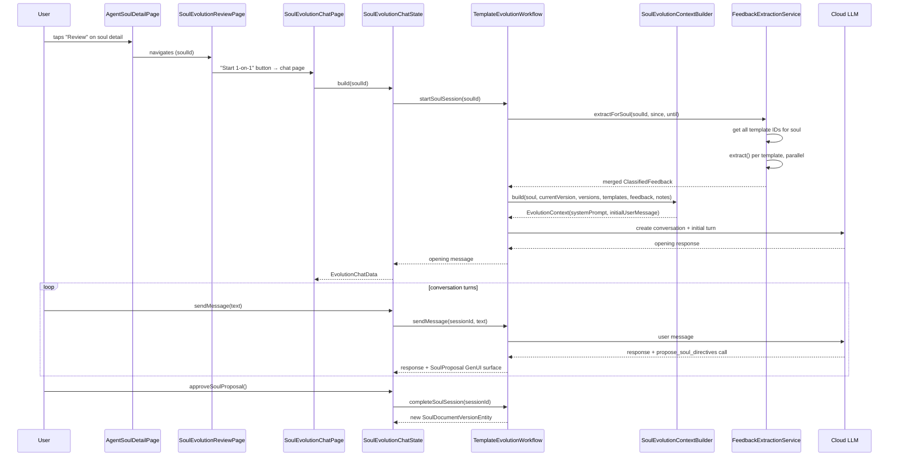
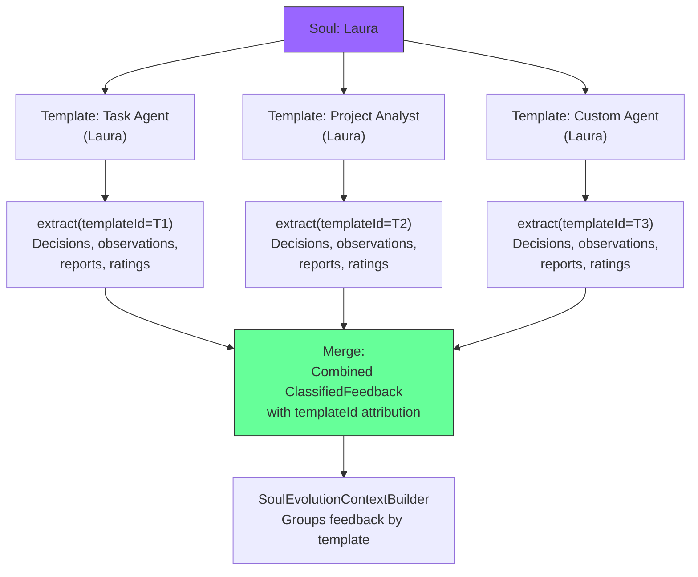
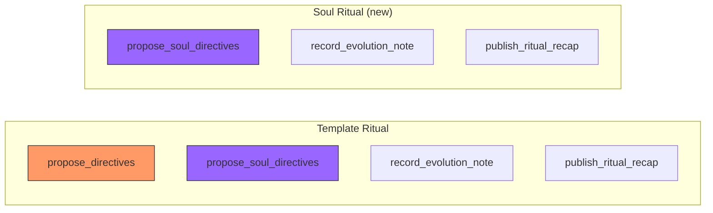
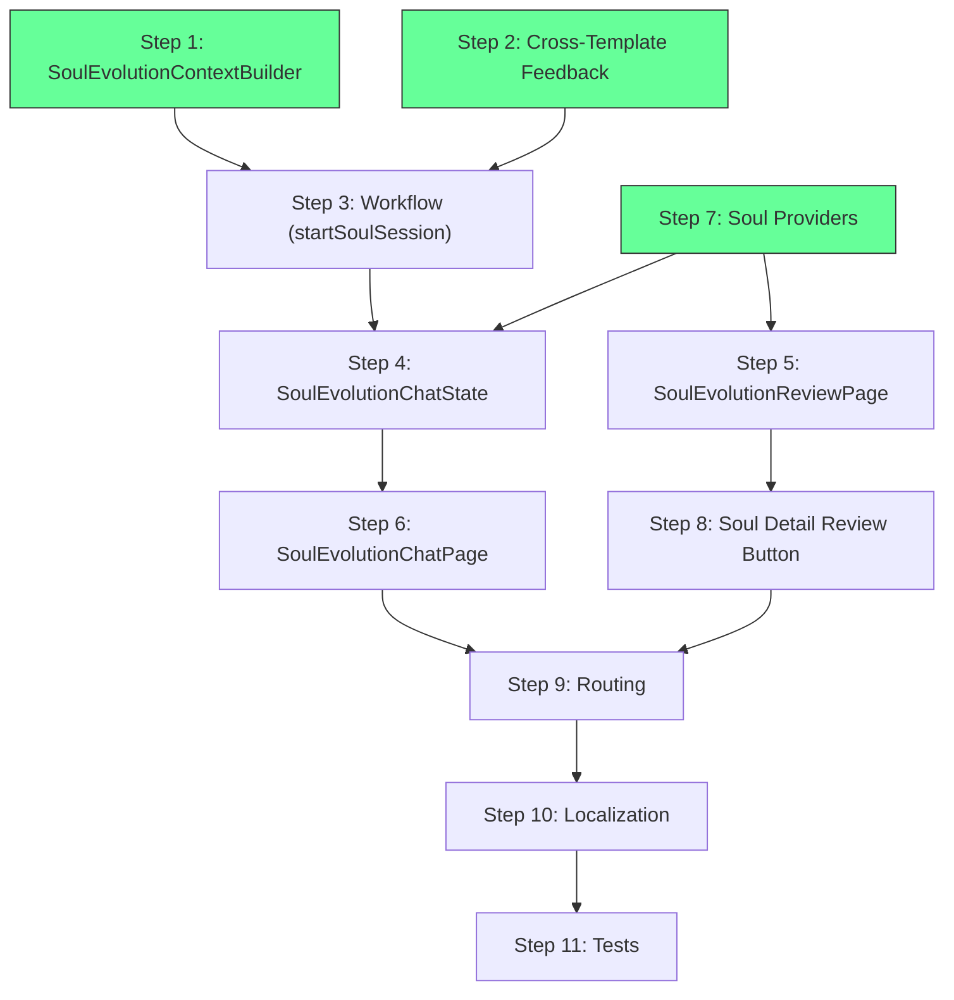

# Phase 6: Standalone Soul Evolution

Status: Complete
Date: 2026-04-07
Companion docs:
- `docs/implementation_plans/2026-04-05_pluggable_soul_documents.md` (parent plan, Phases 1–5)
- `lib/features/agents/README.md`

## 1. Problem Statement

Soul personality can already be evolved during **template** 1-on-1 rituals via
`propose_soul_directives`. This is convenient when a personality issue surfaces
during a skills review, but it has two limitations:

1. **Feedback scope is template-local.** The evolution agent only sees feedback
   from the single template whose ritual is running. If three templates share
   the Laura soul, personality feedback from the other two is invisible.
2. **No personality-focused workflow.** The ritual is skills-first — personality
   changes are opportunistic, not systematic. There is no way to focus an entire
   session on personality refinement.

## 2. Goal

Add a **standalone soul evolution flow** — a dedicated 1-on-1 session focused on
personality improvement that aggregates feedback from ALL templates sharing a
soul.

Both flows coexist:
- **Template ritual** — skill-focused, may opportunistically propose soul changes
- **Soul ritual** (new) — personality-focused, aggregates cross-template feedback

## 3. Current Architecture

### 3.1 Template Evolution Flow



### 3.2 Key Reusable Components

| Component | What it does | Soul reuse strategy |
|-----------|-------------|---------------------|
| `TemplateEvolutionWorkflow` | Multi-turn session lifecycle: start → message → approve/reject → cleanup | Add `startSoulSession()` / `approveSoulSession()` methods |
| `EvolutionStrategy` | Processes tool calls (`propose_directives`, `propose_soul_directives`, `record_evolution_note`, `publish_ritual_recap`) | Reuse as-is — already handles `propose_soul_directives` |
| `EvolutionChatData` | In-memory chat state (messages, processor, waiting, categoryRatings) | Reuse as-is |
| `EvolutionChatMessage` | Freezed union: user / assistant / system / surface | Reuse as-is |
| `EvolutionChatPage` + `_MessageList` | Chat UI with GenUI surfaces, scroll, input | Create parallel `SoulEvolutionChatPage` (minimal differences) |
| `EvolutionReviewPage` | History-first review home: hero panel, start card, session history, summary metrics | Create parallel `SoulEvolutionReviewPage` |
| `EvolutionDashboardHeader` | Collapsible ritual summary at top of chat | Skip for soul chat — no template-specific metrics to show initially |
| `EvolutionSessionEntity` | Tracks session state: active → completed / abandoned | Reuse with `agentId=soulId`, `templateId=soulId` |
| `EvolutionSessionRecapEntity` | Persists structured recap per session | Reuse with `agentId=soulId` |
| `EvolutionNoteEntity` | Persists evolution notes | Reuse with `agentId=soulId` |
| `FeedbackExtractionService` | Extracts classified feedback from decisions, observations, reports | Extend with `extractForSoul()` |
| `ActiveEvolutionSession` | In-memory session tracking (strategy, processor, genUiBridge) | Reuse as-is |
| `PendingSoulProposal` | Captures soul directive proposal | Reuse as-is |
| `GenUI catalog` | `EvolutionProposal`, `SoulProposal`, recap, notes, ratings surfaces | Reuse `SoulProposal` surface |
| `AgentToolRegistry` | Tool definitions for `propose_soul_directives`, `record_evolution_note`, `publish_ritual_recap` | Reuse — soul session registers subset of tools |

### 3.3 Soul-Specific Differences

| Aspect | Template ritual | Soul ritual (new) |
|--------|----------------|-------------------|
| Entry point | Template detail page → Review button | Soul detail page → Review button |
| Context builder | `EvolutionContextBuilder.build()` | New `SoulEvolutionContextBuilder.build()` |
| Feedback scope | Single template | All templates sharing this soul |
| Available tools | `propose_directives` + `propose_soul_directives` + notes + recap | `propose_soul_directives` + notes + recap only |
| System prompt | Skills + personality evolution agent | Personality-focused evolution agent |
| Approval target | Template version (primary) + soul version (secondary) | Soul version only |
| Session entity | `agentId=templateId`, `templateId=templateId` | `agentId=soulId`, `templateId=soulId` |
| Metrics / dashboard | Template wake counts, token usage, MTTR | No template metrics — soul version history + cross-template summary |
| Provider invalidation on approve | Template-related providers | Soul-related providers |

## 4. Proposed Architecture

### 4.1 Soul Evolution Flow



### 4.2 Cross-Template Feedback Aggregation



### 4.3 Tool Availability



Soul rituals do NOT have `propose_directives` — they cannot change template
skills. They focus exclusively on personality via `propose_soul_directives`.

### 4.4 Session Entity Reuse

```text
EvolutionSessionEntity (existing — no schema change)
├── id            → unique session ID
├── agentId       → soulId (for soul sessions) / templateId (for template sessions)
├── templateId    → soulId (for soul sessions) / templateId (for template sessions)
├── sessionNumber → sequential per soul (or per template)
├── status        → active / completed / abandoned
├── proposedVersionId     → null (soul sessions don't create template versions)
├── proposedSoulVersionId → soul version ID on approval
├── feedbackSummary       → optional summary text
├── userRating            → optional numeric rating
├── completedAt           → completion timestamp
```

Using `agentId=soulId` and `templateId=soulId` is consistent with how the
session, recap, and note entities scope themselves by `agentId`. The
`templateId` field is overloaded but this avoids adding a new entity type for
what is structurally an identical lifecycle.

## 5. Implementation Plan

### Step 1: Soul Evolution Context Builder

**New: `lib/features/agents/workflow/soul_evolution_context_builder.dart`**

Builds LLM context focused on personality evolution across templates.

```dart
class SoulEvolutionContextBuilder {
  EvolutionContext build({
    required SoulDocumentEntity soul,
    required SoulDocumentVersionEntity currentVersion,
    required List<SoulDocumentVersionEntity> recentVersions,
    required List<({String templateId, String displayName})> affectedTemplates,
    required ClassifiedFeedback aggregatedFeedback,
    required List<EvolutionNoteEntity> pastNotes,
    required int sessionNumber,
  });
}
```

**System prompt** content:
- Personality-focused evolution agent role
- Scope limited to voice, tone, coaching, anti-sycophancy
- `propose_soul_directives` is the ONLY proposal tool — no `propose_directives`
- Explain cross-template impact — changes affect all listed templates
- Guidelines for when to propose changes vs. when to hold

**Initial user message sections:**
1. Current soul personality (all 4 fields, version number, authored by)
2. Templates using this soul (names + kinds — cross-impact awareness)
3. Aggregated classified feedback across all templates (grouped by source
   template, then by sentiment: grievances first, then excellence, then neutral)
4. High-priority section (critical + notable observations from ALL templates)
5. Soul version history (last 5 versions with diffs)
6. Past soul evolution notes
7. Session number and continuity context

**Token budget** (roughly):
- System prompt: ~500 tokens
- Current soul directives: ~400 tokens
- Template list: ~100 tokens
- Aggregated feedback (3 templates × 10 items): ~2000 tokens
- Version history (5): ~500 tokens
- Evolution notes (30): ~1000 tokens
- Total: ~4500 tokens (well within limits)

**Tests:** `test/features/agents/workflow/soul_evolution_context_builder_test.dart`
- Verify system prompt mentions personality focus and excludes skill guidance
- Verify feedback grouped by template with attribution
- Verify cross-template notice in user message
- Verify empty states (no feedback, single template, no notes)
- Verify version history rendering

**Files:**
- New: `lib/features/agents/workflow/soul_evolution_context_builder.dart`
- New: `test/features/agents/workflow/soul_evolution_context_builder_test.dart`

---

### Step 2: Cross-Template Feedback Aggregation

**Modify: `lib/features/agents/service/feedback_extraction_service.dart`**

Add method to aggregate feedback across all templates using a soul:

```dart
Future<ClassifiedFeedback> extractForSoul({
  required String soulId,
  required DateTime since,
  required DateTime until,
}) async {
  final templateIds = await _soulDocumentService.getTemplatesUsingSoul(soulId);
  if (templateIds.isEmpty) {
    return ClassifiedFeedback(
      items: [],
      windowStart: since,
      windowEnd: until,
      totalObservationsScanned: 0,
      totalDecisionsScanned: 0,
    );
  }

  final results = await Future.wait(
    templateIds.map((id) => extract(templateId: id, since: since, until: until)),
  );

  // Merge: combine items, sum scan counts, use widest window
  return _mergeClassifiedFeedback(results, since: since, until: until);
}
```

**Dependencies:** `FeedbackExtractionService` needs access to
`SoulDocumentService` to call `getTemplatesUsingSoul()`. Add it as a
constructor dependency (it already receives `AgentRepository` and
`AgentTemplateService`).

**Feedback attribution:** `ClassifiedFeedbackItem` already has an `agentId`
field (the agent instance ID). For cross-template aggregation, the
`SoulEvolutionContextBuilder` groups items by the template they came from.
Since each template's `extract()` call produces items scoped to that template's
instances, the builder can use the template ID from the extraction loop to
annotate grouping in the user message — no schema change needed on
`ClassifiedFeedbackItem`.

**Tests:** Add to `test/features/agents/service/feedback_extraction_service_test.dart`
- `extractForSoul` with 0 templates → empty result
- `extractForSoul` with 1 template → delegates to `extract()`
- `extractForSoul` with 3 templates → merges items, sums scan counts
- Verify parallel extraction (each template extracted independently)

**Files:**
- Modify: `lib/features/agents/service/feedback_extraction_service.dart`
- Modify: `test/features/agents/service/feedback_extraction_service_test.dart`

---

### Step 3: Soul Session Support in Workflow

**Modify: `lib/features/agents/workflow/template_evolution_workflow.dart`**

Add two new public methods:

#### `startSoulSession({required String soulId})`

```dart
Future<String?> startSoulSession({required String soulId}) async {
  // 1. Abandon stale active sessions for this soul
  // 2. Resolve soul document + active version + recent versions
  // 3. Get all templates using this soul (with display names)
  // 4. Aggregate feedback via FeedbackExtractionService.extractForSoul()
  // 5. Gather past soul evolution notes (agentId=soulId)
  // 6. Count existing sessions for session number
  // 7. Build context via SoulEvolutionContextBuilder
  // 8. Create EvolutionSessionEntity with agentId=soulId, templateId=soulId
  // 9. Set up EvolutionStrategy with:
  //    - currentGeneralDirective = '' (no template directives)
  //    - currentReportDirective = '' (no template directives)
  //    - Soul directive fields populated from active version
  // 10. Tool list: propose_soul_directives, publish_ritual_recap,
  //     record_evolution_note, render_surface (NO propose_directives)
  // 11. Create conversation, send initial turn
  // 12. Track in _activeSessions map with key = soulId
  // 13. Return opening response
}
```

#### `completeSoulSession({required String sessionId, ...})`

```dart
Future<SoulDocumentVersionEntity?> completeSoulSession({
  required String sessionId,
  Map<String, int> categoryRatings = const {},
}) async {
  // 1. Get active session
  // 2. Get latest soul proposal from strategy
  // 3. Create soul version via SoulDocumentService.createVersion()
  // 4. Persist notes and recap
  // 5. Update session entity: status=completed, proposedSoulVersionId=version.id
  // 6. Clean up active session from map
  // 7. Call onSessionCompleted callback
  // 8. Return new SoulDocumentVersionEntity
}
```

#### Helper: `getActiveSessionForSoul(String soulId)`

Returns `ActiveEvolutionSession?` from the `_activeSessions` map using the
soul ID as key (same pattern as `getActiveSessionForTemplate`).

**Key design note:** The `_activeSessions` map uses template IDs as keys for
template sessions. Soul sessions use soul IDs as keys. Since template IDs and
soul IDs are both UUIDs, there is no collision risk. The `getSession(sessionId)`
method works for both since it searches by session ID, not map key.

**Tests:** Add to `test/features/agents/workflow/template_evolution_workflow_test.dart`
- `startSoulSession` creates session entity with correct fields
- `startSoulSession` builds context with soul-specific builder
- `startSoulSession` registers only soul tools (no `propose_directives`)
- `completeSoulSession` creates soul version and completes session
- `completeSoulSession` persists notes and recap
- `completeSoulSession` calls `onSessionCompleted`
- `startSoulSession` abandons stale sessions for same soul
- `startSoulSession` with no feedback → still starts successfully

**Files:**
- Modify: `lib/features/agents/workflow/template_evolution_workflow.dart`
- Modify: `test/features/agents/workflow/template_evolution_workflow_test.dart`

---

### Step 4: Soul Evolution Chat State (Riverpod Notifier)

**New: `lib/features/agents/ui/evolution/soul_evolution_chat_state.dart`**

Follows the `EvolutionChatState` pattern but parameterized by `soulId`:

```dart
@riverpod
class SoulEvolutionChatState extends _$SoulEvolutionChatState {
  @override
  Future<EvolutionChatData> build(String soulId) async {
    final workflow = ref.read(templateEvolutionWorkflowProvider);

    // No "current directives" to display in the same way templates have.
    // Soul context is personality fields — shown via GenUI surfaces.
    final messages = <EvolutionChatMessage>[
      EvolutionChatMessage.system(
        text: 'starting_session',
        timestamp: clock.now(),
      ),
    ];

    final openingResponse = await workflow.startSoulSession(soulId: soulId);
    final session = workflow.getActiveSessionForSoul(soulId);

    if (session == null || openingResponse == null) {
      if (session != null) {
        await workflow.abandonSession(sessionId: session.sessionId);
      }
      return EvolutionChatData(/* error state */);
    }

    // Wire up GenUI event handlers for soul proposals
    session.eventHandler?.onSoulProposalAction = (surfaceId, action) {
      if (action == 'soul_proposal_approved') approveSoulProposal();
      if (action == 'soul_proposal_rejected') rejectSoulProposal();
    };
    session.eventHandler?.onRatingsSubmitted = (surfaceId, ratings) {
      _handleRatingsSubmitted(ratings);
    };
    session.eventHandler?.onBinaryChoiceSubmitted = (surfaceId, value) {
      sendMessage(value, skipApprovalCheck: true);
    };

    // Dispose: abandon session if still active
    ref.onDispose(() { /* same cleanup pattern */ });

    return EvolutionChatData(
      sessionId: session.sessionId,
      messages: messages + [assistantMessage] + openingSurfaces,
      processor: session.processor,
    );
  }

  Future<void> sendMessage(String text, {bool skipApprovalCheck = false}) async {
    // Same pattern as EvolutionChatState.sendMessage
    // but implicit approval routes to approveSoulProposal()
  }

  Future<bool> approveSoulProposal() async {
    // Call workflow.completeSoulSession()
    // Invalidate soul-related providers
    // Add system message: soul_version_created:vN
  }

  void rejectSoulProposal() {
    // Call workflow.rejectSoulProposal()
    // Add system message
  }

  Future<void> endSession() async {
    // Call workflow.abandonSession()
    // Add system message
  }
}
```

**Key difference from `EvolutionChatState`:**
- No `approveProposal()` for template proposals — soul sessions can't create
  template versions
- `approveSoulProposal()` calls `completeSoulSession()` (which creates the soul
  version AND completes the session), unlike the template flow where soul
  approval is a mid-session action
- Provider invalidation targets soul providers (`allSoulDocumentsProvider`,
  `activeSoulVersionProvider`, `soulVersionHistoryProvider`,
  `templatesUsingSoulProvider`)
- Implicit approval detection routes to `approveSoulProposal()`

**Tests:** `test/features/agents/ui/evolution/soul_evolution_chat_state_test.dart`
- Build starts soul session and returns chat data
- Build error state when session fails to start
- `sendMessage` sends via workflow and updates messages
- `approveSoulProposal` creates version and completes session
- `rejectSoulProposal` clears proposal
- `endSession` abandons session
- Implicit approval detection routes to soul approval
- Dispose abandons active session

**Files:**
- New: `lib/features/agents/ui/evolution/soul_evolution_chat_state.dart`
- New: `test/features/agents/ui/evolution/soul_evolution_chat_state_test.dart`

---

### Step 5: Soul Evolution Review Page

**New: `lib/features/agents/ui/evolution/soul_evolution_review_page.dart`**

History-first review home for a soul, following `EvolutionReviewPage` structure.

```dart
class SoulEvolutionReviewPage extends ConsumerWidget {
  const SoulEvolutionReviewPage({required this.soulId, super.key});
  final String soulId;

  @override
  Widget build(BuildContext context, WidgetRef ref) {
    // Watch: soul document (for display name)
    // Watch: pending soul evolution session
    // Watch: soul evolution session history
    // Watch: templates using this soul (for summary)

    return Scaffold(
      appBar: AppBar(title: Text(soulName)),
      body: ListView(
        children: [
          _HeroPanel(),           // Soul-specific hero: personality focus
          _StartOrPendingCard(),   // Start new session or resume pending
          _TemplatesSummary(),     // Templates sharing this soul
          _SectionHeader("Session History"),
          ...sessionHistory.map(RitualSessionHistoryCard.new),
        ],
      ),
    );
  }

  void _openChat(BuildContext context) {
    Navigator.of(context).push(
      MaterialPageRoute<void>(
        builder: (_) => SoulEvolutionChatPage(soulId: soulId),
      ),
    );
  }
}
```

**Differences from `EvolutionReviewPage`:**
- Hero panel text is personality-focused ("Refine personality across all
  templates using this soul")
- No `RitualSummaryCard` (no template-specific metrics) — replaced with
  templates summary showing which templates will be affected
- Session history uses same `RitualSessionHistoryCard` (recap data is
  structurally identical)
- Start card explains personality-focused session

**Tests:** Widget test for rendering, navigation to chat, session history display.

**Files:**
- New: `lib/features/agents/ui/evolution/soul_evolution_review_page.dart`
- New: `test/features/agents/ui/evolution/soul_evolution_review_page_test.dart`

---

### Step 6: Soul Evolution Chat Page

**New: `lib/features/agents/ui/evolution/soul_evolution_chat_page.dart`**

Chat UI for soul evolution sessions, following `EvolutionChatPage` structure.

```dart
class SoulEvolutionChatPage extends ConsumerStatefulWidget {
  const SoulEvolutionChatPage({required this.soulId, super.key});
  final String soulId;
}
```

**Differences from `EvolutionChatPage`:**
- Watches `soulEvolutionChatStateProvider(soulId)` instead of
  `evolutionChatStateProvider(templateId)`
- App bar shows soul display name (from `soulDocumentProvider`)
- No `EvolutionDashboardHeader` — soul sessions don't have template-specific
  metrics. Could add a simple soul version badge instead.
- Message list and input reuse same widgets (`_MessageList` pattern,
  `EvolutionMessageInput`)
- System message resolution adds soul-specific tokens
  (`soul_version_created:vN`)

**Reuse opportunity:** The `_MessageList` and message rendering logic is
identical between template and soul chat pages. Consider extracting to a shared
widget if the duplication is significant. However, since the pages differ in
header, provider, and app bar, keeping them as separate pages with inline
message lists (following existing pattern) is acceptable for now.

**Tests:** Widget test for rendering, message display, input interaction.

**Files:**
- New: `lib/features/agents/ui/evolution/soul_evolution_chat_page.dart`
- New: `test/features/agents/ui/evolution/soul_evolution_chat_page_test.dart`

---

### Step 7: Soul Evolution Providers

**Modify: `lib/features/agents/state/soul_query_providers.dart`**

Add:

```dart
/// All evolution sessions for a soul (newest first).
@riverpod
Future<List<AgentDomainEntity>> soulEvolutionSessions(
  Ref ref,
  String soulId,
) async {
  ref.watch(agentUpdateStreamProvider(soulId));
  final repository = ref.watch(agentRepositoryProvider);
  return repository.getEvolutionSessions(soulId);
}

/// Active (pending) evolution session for a soul, or null.
@riverpod
Future<AgentDomainEntity?> pendingSoulEvolution(
  Ref ref,
  String soulId,
) async {
  final sessions = await ref.watch(
    soulEvolutionSessionsProvider(soulId).future,
  );
  final typed = sessions.whereType<EvolutionSessionEntity>().toList();
  final newest = typed.firstOrNull;
  if (newest != null && newest.status == EvolutionSessionStatus.active) {
    return newest;
  }
  return null;
}

/// History entries for past soul evolution sessions.
@riverpod
Future<List<RitualSessionHistoryEntry>> soulEvolutionSessionHistory(
  Ref ref,
  String soulId,
) async {
  ref.watch(agentUpdateStreamProvider(soulId));
  final templateService = ref.watch(agentTemplateServiceProvider);
  final (sessions, recaps) = await (
    ref.watch(soulEvolutionSessionsProvider(soulId).future),
    templateService.getEvolutionSessionRecaps(soulId),
  ).wait;

  final recapBySessionId = {
    for (final recap in recaps) recap.sessionId: recap,
  };

  return sessions
      .whereType<EvolutionSessionEntity>()
      .where((s) => s.status != EvolutionSessionStatus.active)
      .map((s) => RitualSessionHistoryEntry(session: s, recap: recapBySessionId[s.id]))
      .toList();
}
```

**Tests:** Provider unit tests verifying correct filtering and data assembly.

**Files:**
- Modify: `lib/features/agents/state/soul_query_providers.dart`
- Add tests to existing soul provider test file or new file

---

### Step 8: Soul Detail Page — Review Button

**Modify: `lib/features/agents/ui/agent_soul_detail_page.dart`**

Add a "Review" button to the bottom bar when the form is not dirty (mirroring
template detail page pattern at line 254–263):

```dart
// In _buildScaffold, the bottom bar rightButtons when not dirty and not
// create mode:
: [
    LottiPrimaryButton(
      onPressed: () => beamToNamed(
        '/settings/agents/souls/${widget.soulId}/review',
      ),
      label: context.messages.agentSoulReviewTitle,
      icon: Icons.rate_review,
    ),
  ],
```

Also add evolution session history to the Info tab (in `_InfoTabContent`),
between version history and assigned templates:

```dart
_SoulEvolutionHistorySection(soulId: soulId),
```

This section shows past soul evolution sessions using
`soulEvolutionSessionHistoryProvider` and renders each with the existing
`RitualSessionHistoryCard`.

**Files:**
- Modify: `lib/features/agents/ui/agent_soul_detail_page.dart`
- Modify: `test/features/agents/ui/agent_soul_detail_page_test.dart`

---

### Step 9: Routing

**Modify: `lib/beamer/locations/settings_location.dart`**

Add route pattern to the `pathPatterns` list:

```dart
'/settings/agents/souls/:soulId/review',
```

Add `BeamPage` entry (after the existing soul detail page entry):

```dart
if (pathContains('agents/souls') &&
    pathContainsKey('soulId') &&
    path.endsWith('/review'))
  BeamPage(
    key: ValueKey(
      'settings-agents-souls-review-'
      '${state.pathParameters['soulId']}',
    ),
    child: SoulEvolutionReviewPage(
      soulId: state.pathParameters['soulId']!,
    ),
  ),
```

**Important:** The review route must be matched BEFORE the generic soul detail
route (same pattern as template review vs. template detail). Place the review
`BeamPage` before the existing soul detail `BeamPage`.

**Files:**
- Modify: `lib/beamer/locations/settings_location.dart`

---

### Step 10: Localization

**Modify: `lib/l10n/app_*.arb` (all 6 + en_GB if needed)**

Add keys:

| Key | English (US) | Purpose |
|-----|-------------|---------|
| `agentSoulReviewTitle` | `Soul 1-on-1` | Review button label + page title |
| `agentSoulReviewHeroSubtitle` | `Refine personality across all templates sharing this soul. The evolution agent sees feedback from every template that uses this personality.` | Hero panel subtitle |
| `agentSoulReviewStartHint` | `Start a personality-focused session to review feedback and evolve voice, tone, coaching style, and directness.` | Start card hint text |
| `agentSoulReviewStartAction` | `Start personality review` | Start button label |
| `agentSoulEvolutionHistoryTitle` | `Soul evolution history` | Section header on detail page info tab |
| `agentSoulEvolutionNoSessions` | `No soul evolution sessions yet` | Empty state |

Translate to all 6 arb files (`app_en.arb`, `app_cs.arb`, `app_de.arb`,
`app_es.arb`, `app_fr.arb`, `app_ro.arb`). Use informal tone per convention
(German: du/deine, French: tu/tes, Spanish: tú/tus, Romanian: dvs.).

Run `make l10n` + `make sort_arb_files` after adding.

**Files:**
- Modify: `lib/l10n/app_en.arb`, `app_cs.arb`, `app_de.arb`, `app_es.arb`,
  `app_fr.arb`, `app_ro.arb`

---

### Step 11: Tests

Full test matrix:

| Test file | What it covers |
|-----------|---------------|
| `test/features/agents/workflow/soul_evolution_context_builder_test.dart` | System prompt content, user message sections, feedback grouping, empty states |
| `test/features/agents/service/feedback_extraction_service_test.dart` | `extractForSoul()`: 0/1/N templates, merge correctness, parallel execution |
| `test/features/agents/workflow/template_evolution_workflow_test.dart` | `startSoulSession()`, `completeSoulSession()`, `getActiveSessionForSoul()`, stale session cleanup, tool list verification |
| `test/features/agents/ui/evolution/soul_evolution_chat_state_test.dart` | Full notifier lifecycle: build, sendMessage, approve, reject, end, dispose cleanup |
| `test/features/agents/ui/evolution/soul_evolution_review_page_test.dart` | Widget rendering, navigation to chat, session history display |
| `test/features/agents/ui/evolution/soul_evolution_chat_page_test.dart` | Widget rendering, message display, input interaction |
| `test/features/agents/ui/agent_soul_detail_page_test.dart` | Review button visibility (dirty vs. clean), evolution history section |
| `test/features/agents/state/soul_query_providers_test.dart` | New provider correctness |

---

## 6. Build Order & Dependencies



Steps 1, 2, and 7 can be built in parallel (no interdependencies).
Steps 3–6 are sequential (each depends on the previous).
Step 10 (localization) should be done early to unblock UI steps.

## 7. Design Decisions & Trade-offs

### Reuse `TemplateEvolutionWorkflow` vs. new class

**Decision:** Add `startSoulSession()` / `completeSoulSession()` to the
existing `TemplateEvolutionWorkflow` rather than creating a
`SoulEvolutionWorkflow` class.

**Rationale:**
- The session lifecycle (start → message loop → approve → cleanup) is identical
- The `_activeSessions` map, conversation management, GenUI bridge, and strategy
  infrastructure are all reusable without modification
- A separate class would duplicate ~800 lines of shared logic
- The workflow is already injected via a single Riverpod provider — adding
  methods is simpler than creating a new provider with identical dependencies

**Trade-off:** `TemplateEvolutionWorkflow` grows in responsibility. If this
becomes unwieldy, extract a shared base class later.

### Separate chat state vs. reusing `EvolutionChatState`

**Decision:** Create a new `SoulEvolutionChatState` notifier rather than
parameterizing the existing one.

**Rationale:**
- The `build()` method has different setup logic (soul resolution vs. template
  resolution, different provider watches)
- Approval routes to `completeSoulSession()` instead of `approveProposal()`
- Provider invalidation targets different providers
- A mode flag in a shared notifier would add complexity and reduce readability
- The two notifiers share `EvolutionChatData` and `EvolutionChatMessage` — the
  data model is reused, only the lifecycle differs

### No dashboard header for soul chat

**Decision:** Soul evolution chat omits the `EvolutionDashboardHeader`.

**Rationale:**
- The header shows template-specific metrics (wake counts, token usage, MTTR)
  that don't apply to souls
- Building aggregate metrics across templates adds complexity for unclear value
- The soul review page already shows templates and session history
- Can be added later if users want cross-template aggregate metrics

### `templateId=soulId` in session entities

**Decision:** Overload the `templateId` field with the soul ID for soul sessions.

**Rationale:**
- Avoids adding an optional `soulId` field to `EvolutionSessionEntity` (which
  would require `build_runner` regeneration and potentially a schema concern)
- The field is used for scoping queries (`getEvolutionSessions(agentId)`) — using
  `agentId=soulId` scopes correctly
- Adding a discriminator field (`sessionKind: template | soul`) is overkill when
  the `templateId` value itself can be checked against known soul IDs if needed

**Trade-off:** Semantic confusion — the field name says "template" but holds a
soul ID. Acceptable given the existing pattern where `agentId` is similarly
overloaded across entity types.

## 8. Risks & Mitigations

| Risk | Likelihood | Impact | Mitigation |
|------|-----------|--------|------------|
| Feedback volume from N templates exceeds token budget | Medium | Medium | `SoulEvolutionContextBuilder` applies the same item limits as template context (10 per template, capped at 30 total). Summarize if needed. |
| Soul session and template session for same soul run concurrently | Low | Medium | `startSoulSession` checks for active template sessions using this soul and warns. Only one active session per soul in `_activeSessions` map. |
| Evolution agent proposes soul changes that break a specific template's workflow | Medium | Medium | Cross-template notice lists affected templates. User reviews with full awareness. The template ritual can propose reverting soul changes if needed. |
| `getEvolutionSessions(soulId)` returns template sessions if a template ID happens to match | Negligible | Low | UUID collision probability is negligible. Session queries are scoped by `agentId` which is either a template ID or soul ID, never mixed. |

## 9. Success Criteria

1. User can navigate to soul detail → Review → start a personality-focused
   1-on-1 session.
2. The evolution agent in a soul session sees aggregated feedback from ALL
   templates sharing that soul, grouped by source template.
3. Soul sessions can only propose personality changes (no `propose_directives`
   tool available).
4. Approving a soul proposal creates a new `SoulDocumentVersionEntity` and
   completes the session.
5. Session history is visible on both the soul review page and the soul detail
   page info tab.
6. The existing template ritual flow is unchanged — template sessions can still
   propose soul changes opportunistically.
7. All new code passes analyzer with zero warnings.
8. All new and existing tests pass.

## 10. Verification Checklist

- [ ] `dart-mcp.analyze_files` — zero errors/warnings
- [ ] `dart-mcp.run_tests` on `test/features/agents/` — all pass
- [ ] `fvm dart format .` — no formatting changes
- [ ] Manual: soul detail → Review → start session → chat → approve → verify
  new soul version appears in version history
- [ ] Manual: verify template ritual still works (no regression)
- [ ] Manual: verify soul review page shows session history after completion
- [ ] Localization: `make l10n` succeeds, `make sort_arb_files` produces no
  diff
