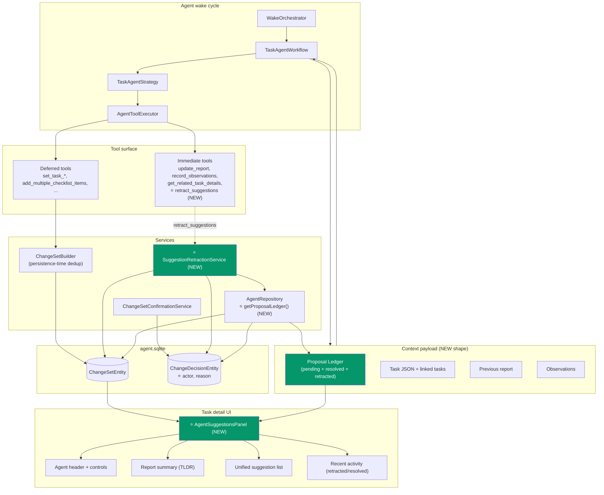
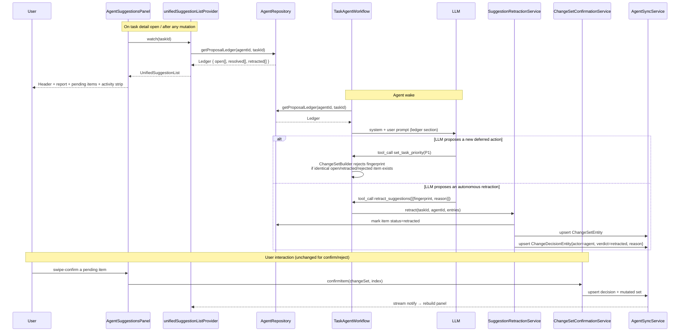
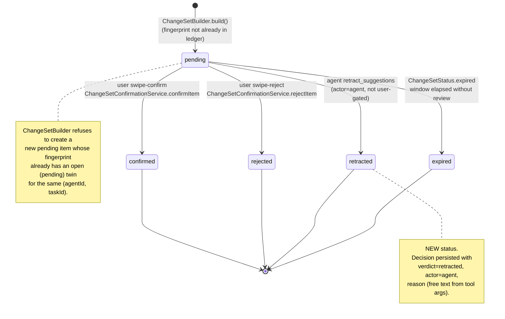
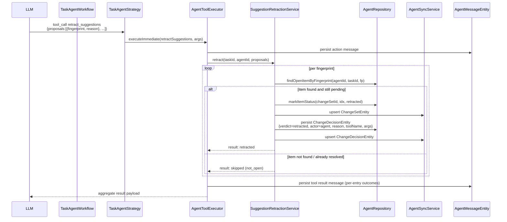
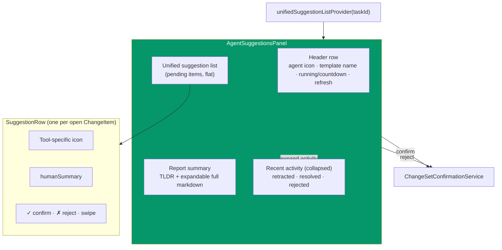
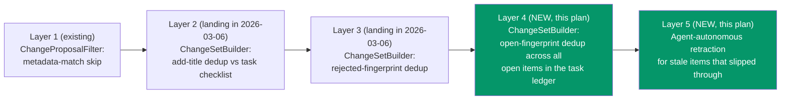

# Agent Suggestion Consolidation

**Date:** 2026-04-18
**Priority:** P0 (Launch Strategy & UI Polish spin-off)
**Status:** Plan

## 1. Executive Summary

Today, the task agent surfaces its work to the user through **three disconnected surfaces** on the task detail page:

1. `TaskAgentReportSection` — agent header + running state + narrative report (TLDR + expandable body).
2. `ChangeSetSummaryCard` — pending deferred-tool proposals (swipeable confirm/reject tiles).
3. On project detail: `ProjectAgentReportCard` with its own separate `_ProjectRecommendationTile` list.

The LLM's picture of what it has already suggested is also fragmented: it receives the current pending `ChangeSetEntity` (via `_formatPendingProposals`) plus a bounded `getRecentDecisions` window. It does *not* receive a single coherent ledger, so it proposes redundant actions (e.g. "set priority P1" when the task is already P1), re-proposes rejected items once the rejection falls out of the recent window, and cannot explicitly retract stale proposals it made earlier.

This plan consolidates both the UI and the agent's memory of its own suggestions into a **single unified list** backed by a **proposal ledger**, adds an **autonomous retraction** path so the agent can clean up its own stale proposals without user confirmation, and makes **duplicate proposals structurally impossible at the persistence layer**.

The scope is deliberately narrower than "rewrite the agent." We reuse the existing `ChangeSetEntity` / `ChangeItem` data model, the existing `ChangeSetConfirmationService` mutation path, the existing `AgentToolExecutor` audit trail, and the existing `AgentSyncService` cross-device sync. What we add is a ledger view over that data, a new `retracted` state, a new immediate tool, and a consolidated widget.

### Relationship to prior plans

- `2026-03-06_fix_duplicate_checklist_suggestions.md` — silent server-side filtering for checklist add-redundancy and rejection-fingerprint dedup. **This plan builds on that**: it assumes those three layers ship, and adds a fourth layer (ledger-aware LLM reasoning + autonomous retraction) for proposals that slip through or become stale between wakes.
- `2026-02-27_change_set_confirmation_ui.md` — original Phase-3 UI that introduced `ChangeSetSummaryCard`. This plan **supersedes the two-card layout** (`TaskAgentReportSection` adjacent to `ChangeSetSummaryCard`) with a single panel.
- `2026-03-07_individually_rejectable_label_changes.md` — per-label explosion + `aiSuppressedLabelIds` feedback loop. Compatible; the unified list simply renders each exploded label item as one ledger row.

## 2. Current State (verified against the codebase)

### 2.1 Rendering surfaces

| Surface | Widget | File |
|---|---|---|
| Agent header + report | `TaskAgentReportSection` → `AgentReportSection` | `lib/features/agents/ui/task_agent_report_section.dart`, `lib/features/agents/ui/agent_report_section.dart` |
| Pending proposals | `ChangeSetSummaryCard` → `_ChangeSetCard` → `_ChangeItemTile` | `lib/features/agents/ui/change_set_summary_card.dart` |
| Project recommendations | `ProjectAgentReportCard` → `_ProjectRecommendationTile` | `lib/features/projects/ui/widgets/project_agent_report_card.dart` |

Both task-level widgets are mounted sequentially inside `TaskForm` (`lib/features/tasks/ui/task_form.dart`), which is the root of the visual fragmentation.

### 2.2 Persistence & state

- `ChangeItem` (Freezed, `lib/features/agents/model/change_set.dart`) — `{toolName, args, humanSummary, status, groupId?}` plus static `fingerprint(ChangeItem)` and `fingerprintFromParts(toolName, args)`.
- `ChangeItemStatus` enum (`lib/features/agents/model/agent_enums.dart`): `pending`, `confirmed`, `rejected`, `deferred`.
- `ChangeSetStatus` enum: `pending`, `partiallyResolved`, `resolved`, `expired`.
- `ChangeDecisionVerdict` enum: `confirmed`, `rejected`, `deferred`.
- `ChangeSetEntity` / `ChangeDecisionEntity` — variants of `AgentDomainEntity` (`lib/features/agents/model/agent_domain_entity.dart`), persisted via Drift in `agent.sqlite`.
- One pending `ChangeSetEntity` per `(agentId, taskId)` today: `ChangeSetBuilder.build()` merges new items into an existing pending set instead of creating a second one.

### 2.3 Context passed to the agent each wake

In `TaskAgentWorkflow._buildUserMessage()` / `_buildSystemPrompt()` (`lib/features/agents/workflow/task_agent_workflow.dart`):

- `_formatPendingProposals(List<ChangeSetEntity>)` — only the currently-pending set.
- `_formatDecisionHistory(List<ChangeDecisionEntity>)` — bounded `getRecentDecisions` window.

These are two separate prose sections, not one ledger, and resolved sets drop out of view entirely.

### 2.4 Available tools (task agent)

Immediate: `update_report`, `record_observations`, `get_related_task_details`.
Deferred (routed through `ChangeSetBuilder`): `set_task_title`, `update_task_estimate`, `update_task_due_date`, `update_task_priority`, `set_task_status`, `set_task_language`, `add_multiple_checklist_items`, `update_checklist_items`, `assign_task_labels`, `create_follow_up_task`, `migrate_checklist_items`, `create_time_entry`.

No existing tool allows the agent to *withdraw* a proposal it already persisted.

## 3. Target Architecture

Three concurrent changes, each independently shippable:

1. **Proposal ledger** — one structured, status-sorted view of every `ChangeItem` the agent has ever produced for this task, derived from existing `ChangeSetEntity` + `ChangeDecisionEntity` data. Used both by the LLM (prompt context) and the UI (unified list).
2. **Autonomous retraction** — a new immediate tool `retract_suggestions` plus a new `ChangeItemStatus.retracted` state and `ChangeDecisionVerdict.retracted` verdict with an `actor` field (`user | agent`). No user gate on the retraction itself; the user sees the effect reflected in the ledger.
3. **Unified panel** — replace the two task-level widgets with a single `AgentSuggestionsPanel` whose children are: (a) agent header, (b) report summary, (c) flat list of ledger rows filtered to `open` status, (d) collapsed "recent activity" affordance that surfaces confirmed/rejected/retracted items.

### 3.1 Overall architecture



*Green = new components introduced by this plan.*

### 3.2 Data flow



### 3.3 Proposal lifecycle (state diagram)



Confirmed / rejected / retracted / expired items remain in the ledger (they are the agent's memory of what it has already tried) but are excluded from the active pending list in the UI.

### 3.4 Retraction protocol



The `AgentToolExecutor` already implements the audit trail required by ADR 0004 (action message before execution, tool result message after, post-mutation vector clock capture). `SuggestionRetractionService` reuses that wrapper like any other mutating tool — retraction is authenticated, scoped, and suppression-aware for free.

### 3.5 Unified UI composition



The panel replaces **both** `TaskAgentReportSection` and `ChangeSetSummaryCard` in `TaskForm`. `AgentReportSection` (TLDR parsing + expand/collapse) is reused in-place inside the panel; `_ChangeItemTile` logic moves into `SuggestionRow` without behavioural changes to confirm/reject/time-entry rendering.

## 4. Data Model Changes

### 4.1 Enum extensions

`lib/features/agents/model/agent_enums.dart`:

```dart
enum ChangeItemStatus {
  pending,
  confirmed,
  rejected,
  deferred,
  retracted, // NEW
}

enum ChangeDecisionVerdict {
  confirmed,
  rejected,
  deferred,
  retracted, // NEW
}

enum DecisionActor { // NEW enum
  user,
  agent,
}
```

### 4.2 ChangeDecisionEntity extension

`lib/features/agents/model/agent_domain_entity.dart` — add two fields to the `changeDecision` factory:

- `DecisionActor actor` (default `user` so pre-existing rows deserialize cleanly).
- `String? reason` (the free-text justification supplied either by user rejection reason or by the agent on retraction). The rejection-reason code path already populates this today; we are reusing the slot.
- `Map<String, dynamic>? args` — already planned by `2026-03-06_fix_duplicate_checklist_suggestions.md` step 3a for fingerprint matching. Confirm this lands first; this plan assumes it does.

Migration strategy: Drift schema bump, new nullable columns, backfill `actor = user` on rows without an actor. No schema break on the sync wire format because `AgentDomainEntity` is serialized via JSON with forward-compatible nullability.

### 4.3 Repository API additions

`lib/features/agents/database/agent_repository.dart`:

```dart
/// Returns a single chronological ledger of every ChangeItem ever proposed
/// by [agentId] for [taskId], annotated with current status and resolution
/// metadata. Open items come from pending/partiallyResolved ChangeSetEntities;
/// resolved/retracted items come from resolved/expired sets joined with
/// their ChangeDecisionEntity records.
Future<ProposalLedger> getProposalLedger(String agentId, {required String taskId});

/// Transitions a single ChangeItem's status within its ChangeSetEntity.
/// Used only by SuggestionRetractionService (user confirm/reject still
/// go through ChangeSetConfirmationService). Throws if the item is not
/// currently pending (idempotency guard against double-retract).
Future<ChangeSetEntity> markItemRetracted(
  String agentId,
  String changeSetId,
  int itemIndex,
);
```

`ProposalLedger` is a new value class:

```dart
class ProposalLedger {
  final List<LedgerEntry> open;      // status == pending
  final List<LedgerEntry> resolved;  // confirmed | rejected | retracted | expired
}

class LedgerEntry {
  final String changeSetId;
  final int itemIndex;
  final String toolName;
  final Map<String, dynamic> args;
  final String humanSummary;
  final String fingerprint;
  final ChangeItemStatus status;
  final DateTime createdAt;
  final DateTime? resolvedAt;
  final DecisionActor? resolvedBy; // user | agent | null (if open/expired)
  final ChangeDecisionVerdict? verdict;
  final String? reason;
}
```

## 5. Agent Context Payload Updates

### 5.1 Replace two sections with one

Today `_buildUserMessage` emits:
- `## Pending proposals` (from `_formatPendingProposals`)
- `## Recent user decisions` (from `_formatDecisionHistory`)

Replace both with:
- `## Proposal ledger` (new `_formatProposalLedger(ProposalLedger)`)

The ledger section is status-grouped and compact. Example shape (illustrative, exact wording tuned with the prompt engineer):

```
## Proposal ledger

Open (3):
- [fp=a7c…] set_task_priority P1 — proposed 2026-04-18 09:14Z
- [fp=b21…] add_multiple_checklist_items "Write migration" — proposed 2026-04-18 09:14Z
- [fp=c8e…] update_task_due_date 2026-04-25 — proposed 2026-04-17 18:02Z

Resolved (recent, bounded):
- [fp=d10…] set_task_title "…" — confirmed by user 2026-04-17 17:44Z
- [fp=e9f…] assign_task_label Backend — rejected by user 2026-04-17 17:44Z
  reason: "irrelevant to this task"
- [fp=f42…] set_task_priority P2 — retracted by agent 2026-04-17 18:02Z
  reason: "duplicate of open fp=a7c…"
```

Bounding: include all `open`, all `retracted` (agent's own history), and user-resolved items within a rolling window (proposal: 14 days or last 50 decisions, whichever is smaller — tune empirically).

### 5.2 `TaskAgentWorkflow.execute()` wiring

Replace the two existing `Future.wait` branches for `getPendingChangeSets` + `getRecentDecisions` with a single `agentRepository.getProposalLedger(agentId, taskId: taskId)`. Keep the existing ChangeSetBuilder input signature: it still needs the open subset for persistence-time dedup, which the ledger provides as `ledger.open`.

## 6. Prompt & Directive Amendments

All edits live in `_buildSystemPrompt()` of `TaskAgentWorkflow` and the task-agent template directives.

### 6.1 New directive block

```
## Suggestion hygiene

You are shown a proposal ledger listing every suggestion you have ever
made for this task, including its current status.

1. Before proposing a deferred action, check the ledger.
   - If an identical OPEN item already exists, do NOT re-propose it.
   - If an identical item was RETRACTED or REJECTED, only re-propose
     when the task context has materially changed, and explain the
     change in your report.

2. Review open items every wake. For each open item, decide whether it
   is still useful. If an open item is now redundant with the current
   task state (e.g. the user already made the change manually, or the
   priority is already what you proposed), call `retract_suggestions`
   with that item's fingerprint and a short reason.

3. Retraction is not a failure. It is how you keep your proposal list
   clean and trustworthy. The user will see that you retracted a stale
   suggestion and will trust your other suggestions more.
```

### 6.2 Retraction tool description (system-level)

The `retract_suggestions` description (shown to the model via its JSON Schema) should emphasize:

- It takes **fingerprints**, not indices (fingerprint is shown in every ledger row).
- It applies only to items currently in `pending` status. Items already confirmed/rejected/retracted are no-ops.
- The `reason` is required and is stored on the decision record as agent self-reporting.

## 7. Tooling: `retract_suggestions`

### 7.1 Registry & names

`lib/features/agents/tools/agent_tool_registry.dart`:

- Add `retractSuggestions` constant to `TaskAgentToolNames`.
- Append `AgentToolDefinition` for `retract_suggestions` to `taskAgentTools`.
- **Do not** add to `deferredTools` — retraction is immediate by design.
- **Do not** add to `explodedBatchTools` — the tool natively accepts a list.

JSON Schema sketch:

```json
{
  "name": "retract_suggestions",
  "description": "Withdraw one or more of your own previously-proposed actions that are no longer relevant. The user is not prompted; the retraction is recorded and the items are removed from the active suggestion list.",
  "parameters": {
    "type": "object",
    "required": ["proposals"],
    "properties": {
      "proposals": {
        "type": "array",
        "minItems": 1,
        "items": {
          "type": "object",
          "required": ["fingerprint", "reason"],
          "properties": {
            "fingerprint": { "type": "string" },
            "reason": { "type": "string", "minLength": 1, "maxLength": 500 }
          }
        }
      }
    }
  }
}
```

### 7.2 Executor & service

- `SuggestionRetractionService` (new, `lib/features/agents/service/suggestion_retraction_service.dart`) implements the per-fingerprint logic in §3.4.
- Wired into `TaskAgentStrategy.processToolCalls()` alongside the other immediate tools. Reuses `AgentToolExecutor` wrapping so ADR 0004 audit + vector-clock capture applies.
- Returns a structured result per entry (`retracted` | `not_open` | `not_found`) which the LLM reads back in the tool-result message.

### 7.3 Dispatcher changes

None. `TaskToolDispatcher` is the confirmation-time mutation dispatcher; retraction never touches the journal domain entity, only the agent-side `ChangeSetEntity` + `ChangeDecisionEntity`.

## 8. UI Consolidation

### 8.1 New widget

`lib/features/agents/ui/agent_suggestions_panel.dart`:

```
AgentSuggestionsPanel({ required String taskId })
  ├── _PanelHeader           // was TaskAgentReportSection header row
  ├── _PanelReportBody       // reuses AgentReportSection widget as-is
  ├── _UnifiedSuggestionList // flat list of SuggestionRow
  └── _RecentActivityStrip   // collapsed; expandable
```

### 8.2 New provider

`lib/features/agents/state/unified_suggestion_providers.dart`:

```dart
@riverpod
Future<UnifiedSuggestionList> unifiedSuggestionList(Ref ref, String taskId) async {
  final agentId = await ref.watch(taskAgentProvider(taskId).future);
  if (agentId == null) return UnifiedSuggestionList.empty();
  ref.watch(agentUpdateStreamProvider(agentId));
  final ledger = await ref
      .read(agentRepositoryProvider)
      .getProposalLedger(agentId, taskId: taskId);
  return UnifiedSuggestionList(
    header: await ref.watch(agentHeaderStateProvider(agentId).future),
    report: await ref.watch(agentReportProvider(agentId).future),
    openItems: ledger.open,
    recentActivity: ledger.resolved,
  );
}
```

The old `pendingChangeSetsProvider(taskId)` is kept temporarily for backward compatibility during the rollout, then removed once all call sites migrate (search shows only `ChangeSetSummaryCard` uses it — removal is safe after §9 phase 4).

### 8.3 TaskForm wiring

`lib/features/tasks/ui/task_form.dart`:

Replace:

```dart
TaskAgentReportSection(taskId: taskId),
ChangeSetSummaryCard(taskId: taskId),
```

with:

```dart
AgentSuggestionsPanel(taskId: taskId),
```

### 8.4 Retracted-item UX

When an item transitions `pending → retracted`, the panel provider stream notifies and the row exits the open list. The recent-activity strip (collapsed by default) gains a line like:

> *Agent retracted "Set priority P2" — reason: duplicate of open suggestion.*

This gives the user visibility (trust) without a confirmation prompt.

### 8.5 Project parity (optional, follow-up)

`ProjectAgentReportCard` + `_ProjectRecommendationTile` have the same structural problem at project scope. This plan scopes to **task agents**. A follow-up plan should apply the same consolidation to project agents (`ProjectRecommendationEntity` has its own lifecycle enum; the ledger shape generalizes).

## 9. Anti-Duplication by Design

Four complementary layers; the first three exist or are being added by the 2026-03-06 plan; the fourth is new here.



Layer 4 turns "no duplicate fingerprints within pending change sets" into "no duplicate fingerprints across any open item in the ledger." Because today there is one pending set per `(agentId, taskId)` this is a minor generalization, but it becomes load-bearing once we retain retracted items in the ledger — the fingerprint check explicitly excludes `retracted`/`rejected` from the *open* set so the agent can legitimately re-propose after material change.

Layer 5 is the corrective backstop: if the LLM did propose a redundant action that wasn't caught by layers 1–4 (e.g. a semantically duplicate proposal with different args), the agent itself can retract it on the next wake when it sees the current state in the ledger.

## 10. Implementation Phases

Phases are ordered so each can ship independently and is individually testable.

### Phase 1 — Data model foundations
- Add `ChangeItemStatus.retracted`, `ChangeDecisionVerdict.retracted`, `DecisionActor` enum.
- Add `actor` + `reason` fields to `ChangeDecisionEntity` (reuse `reason` if already present; `actor` is new).
- Drift schema bump + migration + regenerated `*.g.dart` / `*.freezed.dart` via `make build_runner`.
- Update existing `ChangeSetConfirmationService.rejectItem` / `confirmItem` to set `actor = user`.
- Unit tests for round-trip serialization.

### Phase 2 — Proposal ledger
- Add `AgentRepository.getProposalLedger(agentId, taskId:)` + `ProposalLedger` / `LedgerEntry` types.
- Unit tests for ledger aggregation (mix of open, resolved, retracted items across multiple sets).
- Replace `getPendingChangeSets` + `getRecentDecisions` calls in `TaskAgentWorkflow.execute()` with a single ledger fetch.
- Rewrite `_formatPendingProposals` + `_formatDecisionHistory` → `_formatProposalLedger`.
- Prompt snapshot tests asserting the new section appears once and contains fingerprints.

### Phase 3 — Retraction tool
- Add `SuggestionRetractionService`.
- Register `retract_suggestions` in `AgentToolRegistry.taskAgentTools` (and `TaskAgentToolNames`).
- Add directive block §6.1 to the task-agent system prompt template.
- Wire into `TaskAgentStrategy` as an immediate tool; route through `AgentToolExecutor`.
- Integration test: seed two open ChangeItems; simulate LLM calling `retract_suggestions` with one fingerprint; assert `ChangeItemStatus.retracted`, `ChangeDecisionEntity(verdict=retracted, actor=agent, reason=…)` persisted; assert the other item is untouched; assert audit messages are present.
- Edge-case tests: retract an already-confirmed item → `not_open`; retract an unknown fingerprint → `not_found`; retract the same fingerprint twice in one call → idempotent.

### Phase 4 — UI consolidation
- New `AgentSuggestionsPanel` widget + `unifiedSuggestionListProvider`.
- Reuse `AgentReportSection`, `_ChangeItemTile` logic (extract to `SuggestionRow`).
- Wire into `TaskForm` in place of `TaskAgentReportSection` + `ChangeSetSummaryCard`.
- Delete the two replaced widgets and the now-unused `pendingChangeSetsProvider(taskId)` (keep `projectPendingChangeSetsProvider` for project parity plan).
- Widget tests for: pending list rendering, confirm/reject behaviour preservation, retracted-item animation out, recent-activity expand/collapse, empty-ledger fallback.

### Phase 5 — Duplicate-prevention tightening & docs
- Extend `ChangeSetBuilder.build()` fingerprint dedup from "pending sets only" to "open ledger items" (layer 4 in §9).
- Update `lib/features/agents/README.md` with a new "Proposal ledger & retraction" section and the state diagram from §3.3.
- Update `docs/adr/0004-task-agent-tool-execution-policy.md` to note that `retract_suggestions` is an immediate tool that executes against agent-side state only (no journal mutation), and therefore does not require category scope beyond the task's own scope.

## 11. Test Strategy

Co-locate tests with source (`test/features/agents/...`). Use `test/mocks/mocks.dart`, `test/helpers/fallbacks.dart`, `setUpTestGetIt()`, and `makeTestableWidget()` per `AGENTS.md`.

Meaningful assertions per phase:

- **Phase 1**: round-trip a `ChangeDecisionEntity` with `actor=agent, verdict=retracted, reason="duplicate"` through Drift; assert every field survives. Migration test: seed pre-migration row, migrate, assert `actor=user` default.
- **Phase 2**: build a ledger from two resolved + one pending set; assert open count, resolved ordering, fingerprint uniqueness, and status grouping. Prompt snapshot test asserts the `## Proposal ledger` section contains `Open (N)` and stable fingerprints.
- **Phase 3**: one file-level `_TestBench` that spins up agent DB + fake sync + fake dispatcher; shared helper stubs. Cases: successful retraction of pending item; no-op on already-resolved; unknown fingerprint returns `not_found`; double-retract idempotency; audit messages present.
- **Phase 4**: widget tests use `_pumpPanel(tester, {...})` helper. Cases: renders agent header + report + list; swipe-confirm calls `ChangeSetConfirmationService.confirmItem` with the right `(changeSet, index)`; when agent retracts, row disappears from open list and activity strip gains a line with the reason; empty ledger shows header only.
- **Phase 5**: `ChangeSetBuilder` unit test: seed a ledger with one open + one retracted fingerprint; propose both; assert open duplicate is suppressed but retracted-and-now-proposed-again is allowed.

Follow `test/README.md` on `fakeAsync`, deterministic `DateTime(2026, 4, 18)`, no `DateTime.now()`, no real timers.

## 12. Risks & Open Questions

- **Concurrency**: user swipes "confirm" at the exact moment the agent calls `retract_suggestions`. Resolution: `markItemRetracted` throws if the item is not `pending`; `ChangeSetConfirmationService.confirmItem` already re-reads the persisted entity before mutating. Last writer wins, but both paths record a decision, so the audit trail remains intact. Document the race in `AGENTS.md`.
- **Sync**: retracted status must propagate via `AgentSyncService` exactly like confirmed/rejected. Since we reuse the existing `upsertEntity` path on both `ChangeSetEntity` and `ChangeDecisionEntity`, no sync-layer changes expected. Verify with a two-device integration test in the existing sync test harness.
- **Prompt length**: the ledger grows over the life of a task. Cap resolved entries in the prompt to N (proposal: 50) sorted by recency. Full ledger still lives in the DB; the prompt trims.
- **Expired items**: today `ChangeSetStatus.expired` exists but is rarely observed in prod. The ledger groups `expired` under resolved but doesn't treat it specially. If needed, a follow-up can add an `expire_stale_suggestions` periodic job — out of scope here.
- **Project agents**: intentionally out of scope. `ProjectRecommendationEntity` has its own enum and UI; applying the same pattern there is a clean follow-up once this ships.
- **Backwards compatibility with the 2026-03-06 plan**: this plan assumes that plan's Step 3a (adding `args` to `ChangeDecisionEntity`) lands first. If it does not, the ledger cannot reconstruct fingerprints for historical rejections. Sequence the merges accordingly.

## 13. File Change Summary

| File | Change |
|---|---|
| `lib/features/agents/model/agent_enums.dart` | Add `retracted` to `ChangeItemStatus` / `ChangeDecisionVerdict`; add `DecisionActor` enum |
| `lib/features/agents/model/agent_domain_entity.dart` | Add `actor`, `reason` to `changeDecision` factory |
| `lib/features/agents/database/agent_database.dart` | Schema bump + migration for new columns |
| `lib/features/agents/database/agent_repository.dart` | Add `getProposalLedger`, `markItemRetracted`; add `ProposalLedger` / `LedgerEntry` types |
| `lib/features/agents/service/change_set_confirmation_service.dart` | Populate `actor=user` on decision records |
| `lib/features/agents/service/suggestion_retraction_service.dart` | NEW — implements retraction protocol |
| `lib/features/agents/tools/agent_tool_registry.dart` | Register `retract_suggestions` in `TaskAgentToolNames` + `taskAgentTools` |
| `lib/features/agents/tools/agent_tool_executor.dart` | Route `retract_suggestions` through immediate-tool path |
| `lib/features/agents/workflow/task_agent_strategy.dart` | Dispatch `retract_suggestions` to `SuggestionRetractionService` |
| `lib/features/agents/workflow/task_agent_workflow.dart` | Replace `_formatPendingProposals` + `_formatDecisionHistory` with `_formatProposalLedger`; swap context fetchers |
| `lib/features/agents/workflow/change_set_builder.dart` | Extend dedup from pending-sets-only to open-ledger (Layer 4) |
| `lib/features/agents/state/unified_suggestion_providers.dart` | NEW — `unifiedSuggestionListProvider` |
| `lib/features/agents/ui/agent_suggestions_panel.dart` | NEW — consolidated panel |
| `lib/features/agents/ui/suggestion_row.dart` | NEW — extracted from `_ChangeItemTile` |
| `lib/features/agents/ui/change_set_summary_card.dart` | DELETE after migration |
| `lib/features/agents/ui/task_agent_report_section.dart` | DELETE after migration (header moves into panel) |
| `lib/features/tasks/ui/task_form.dart` | Replace two widgets with one |
| `lib/features/agents/README.md` | Add "Proposal ledger & retraction" section + state diagram |
| `docs/adr/0004-task-agent-tool-execution-policy.md` | Note on immediate retraction tool |
| `test/features/agents/**` | New tests per §11 |

## 14. Success Criteria

1. The task detail page has exactly **one** agent-suggestions section, rendered by `AgentSuggestionsPanel`.
2. The agent's prompt contains a single `## Proposal ledger` block with fingerprints covering all open + bounded resolved items.
3. When the agent proposes an action whose fingerprint matches an existing open item, `ChangeSetBuilder` suppresses it at persistence time.
4. The agent can call `retract_suggestions` with one or more fingerprints; matching open items transition to `retracted`; a `ChangeDecisionEntity` with `actor=agent, verdict=retracted, reason=…` is persisted and synced; no user prompt appears.
5. The unified list shows only open items by default; retracted/confirmed/rejected items are visible through the recent-activity affordance.
6. Zero analyzer warnings, zero formatter drift; all new and existing tests green via `dart-mcp.analyze_files` + `dart-mcp.run_tests`.
7. Feature README + ADR 0004 reflect the new tool and ledger contract.
