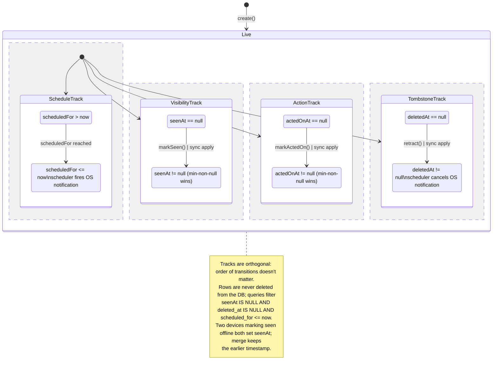

# Synced Notifications — Data & Sync Layer Implementation Plan

**Date:** 2026-05-17 (revised after code-grounded review)
**Status:** Draft — incorporates review fixes; ready for implementation review
**Scope:** Data model, persistence, cross-device sync, and macOS/iOS scheduler for a new notification system. UI (bell button, dialog) and Linux OS-trigger wiring are explicitly out of scope.

## Changelog (review-driven revisions)

This draft was revised against `feat/agent_notifications` after two rounds of code-grounded review. Decisions baked into the body below:

**Round 1**

- **Storage** → separate Drift database (`notifications_db.dart`), following the same pattern as `ai_config_db`, `settings_db`, `agent_db`. Primary reason: decouples notification writes from the journal writer lock — `QueueApplyAdapter._writesJournalDb` (`queue_apply_adapter.dart:315`) already opts those sibling DBs out, and frequent state flips would otherwise serialise unrelated journal readers. Avoiding a `JournalDb.schemaVersion` bump (currently 42 at `lib/database/database.dart:115`) is a secondary nicety, not the driver.
- **Tombstone** → `deleted_at DATETIME` instead of `deleted BOOLEAN`. Same `min-non-null wins` merge rule applies; pending-row queries filter on `deleted_at IS NULL`.
- **Scheduling future dates** → add a new method `NotificationService.scheduleNotificationAt(DateTime when, …)` that honours full `year/month/day`. The existing `scheduleNotification` (`lib/services/notification_service.dart:182`) keeps its "today at HH:MM" semantics so habit/task reminder callers don't regress.
- **Conflict handling for mutable fields** → LWW on `updatedAt`, deterministic, no `Conflict` row. The existing Conflicts table + UI are typed end-to-end to `JournalEntity` (`database.dart:881`, `conflict_detail_route.dart:115`, `conflict_list_item_view_model.dart:45`); generalising the envelope is out of scope.
- **State-update merging** → **dropped** for `SyncNotificationStateUpdate`. State flips ride the outbox individually; sequence-log gap recovery handles redundancy. This avoids the new `coveredVectorClocks` plumbing the journal-merge path uses (`outbox_service.dart:971-994`).
- **Naming** → pub-sub key `inboxNotification` (avoids collision with the existing `aiResponseNotification` at `db_notification.dart:97` and the OS-notification connotation). Config flag `enableSyncedAlertsFlag` (avoids collision with the existing `enableNotificationsFlag` in `lib/utils/consts.dart`).
- **Module shape** → `repository/`, `state/`, `scheduler/`, `README.md`. Extends the `lib/features/ratings/` shape (which has `repository/`, `state/`, `ui/`, `data/`, `README.md` — no `scheduler/`).
- **Meta type** → keep a dedicated `NotificationMeta` (parallel to `Metadata`, not a sidecar) because `scheduledFor`/`seenAt`/`actedOnAt` are notification-specific and overlap is narrow. `originatingHostId` lives on `NotificationMeta` itself (rather than only on the `SyncMessage` variant) so it survives JSON round-trips at the entity level; the deviation from `Metadata` is intentional.

**Round 2**

- **Due-now firing** → add a new `NotificationService.showNotificationNow(...)` method that calls `flutterLocalNotificationsPlugin.show(...)` immediately. The previous draft proposed reusing `scheduleNotification(...)` for due-now rows, but that method always builds a `zonedSchedule` for today at `notifyAt.hour/minute/second` (`notification_service.dart:200-212`) — if `scheduled_for` is earlier today or a few seconds before the scheduler tick, it would silently schedule in the past.
- **OS notification ID** → deterministic stable hash of `notification.id` via **FNV-1a-32 → mask to 31 bits**. `String.hashCode` is *not* contractually stable across Dart runs (Dart docs note `Object.hashCode` is a hash-table contract, not a persisted-identifier contract) and must not be used for cross-restart cancellation. Algorithm spec + test vectors live in the scheduler implementation; tests assert known UUID → ID pairs.
- **Backfill recovery** → explicit branches must be added in `BackfillResponseHandler` for the two new payload types, mirroring the journal/link/agent branches at `backfill_response_handler.dart:173, :574, :805`. Without these, a missed `SyncNotificationStateUpdate` cannot be resent on request.
- **QueueApplyAdapter** → both new variants are added to the `_writesJournalDb` switch (`queue_apply_adapter.dart:315`) and return `false`. Notifications live in their own Drift database; wrapping their apply in a `JournalDb` writer transaction would serialise unrelated readers for no reason.

Citation fixes from the review: `sync_message.dart:30` (union opener; `aiConfig` precedent at `:70`), `notification_service.dart:182` (`scheduleNotification` opens here; `zonedSchedule` is the inner call at `:214`), `db_notification.dart:89` (correct), conflict routing actually lives at `database.dart:881` (not `sync_event_processor_journal_handlers.dart:88`).

## Goal

Introduce a notification system that surfaces AI inference results and task suggestions to the user across all their devices. Notifications must:

- Sync between macOS / iOS / Linux via the existing Matrix-based sync engine.
- Track `seen` and `acted_on` state that converges across devices without user-visible conflicts.
- Support both instant ("just generated, show now") and scheduled ("show at 09:00 tomorrow") delivery.
- Support retraction (a local agent decides the suggestion is no longer relevant before the notification fires).

## Design summary

Add a new top-level synced entity `NotificationEntity` — **not** a `JournalEntity` variant — with:

- Its own freezed sealed union in `lib/classes/notification_entity.dart`.
- Its own **separate Drift database** (`lib/database/notifications_db.dart` + `notifications_db.drift`, `schemaVersion = 1`), siblings: `ai_config_db`, `settings_db`, `agent_db`. Keeps notification writes off the `JournalDb` writer lock — the same reason those other sibling DBs return `false` from `QueueApplyAdapter._writesJournalDb` (`queue_apply_adapter.dart:315`).
- Its own `SyncMessage` variant(s) plumbed through the existing outbox / processor pipeline.
- **Monotonic state flags** (`seenAt`, `actedOnAt`, `deletedAt`) so the common case ("dismissed on phone, then on laptop") converges deterministically.
- **LWW on `updatedAt` for mutable content fields** (`title`, `body`, `suggestionCount`, `scheduledFor`). Concurrent edits never land in the journal-typed `Conflict` table.

### Why a separate entity, not a `JournalEntity` variant

- Notifications are ephemeral system state, not user-authored content. Mixing them into `journal` pollutes every journal query and the polymorphic discriminator.
- Precedent: `aiConfig` (`lib/features/sync/model/sync_message.dart:70`) and `themingSelection` (`:79`) are independent `SyncMessage` variants with their own persistence.

### Why monotonic state flags

`seen` and `acted_on` are one-way: once true, always true. Merge rule = `min` of non-null timestamps. Two devices dismissing offline both produce `seenAt != null`; we keep the earlier one. No `Conflict` row, no user prompt. The vector clock still travels for sequence tracking and gap recovery — resolution is just field-level rather than row-level for these specific flags.

### Why LWW for mutable fields (not the Conflicts table)

The journal-entry conflict path cannot be reused: `detectConflict` (`lib/database/database.dart:881`) is typed `JournalEntity existing, JournalEntity updated`, and both the list/detail conflict UI deserialize `conflict.serialized` as a `JournalEntity` (`conflict_list_item_view_model.dart:45`, `conflict_detail_route.dart:115`). A notification dropped in would either fail to deserialize or render as garbage.

Generalising the envelope/UI is significantly larger scope and lives in a future PR. For this data layer, mutable notification fields converge via **last-writer-wins on `meta.updatedAt`**, deterministic across devices, with no user-visible conflict prompt. Notifications are ephemeral; a conflict dialog for a `body` divergence would be heavyweight UX even if the path existed.

### Lifecycle

A notification's "state" is a tuple of one time-driven dimension (`scheduledFor`) and three orthogonal monotonic flags (`seenAt`, `actedOnAt`, `deletedAt`). Each flag transitions at most once per device; cross-device merge takes min-non-null. Rows persist after the terminal flags are set — tombstones are retained so concurrent devices converge instead of resurrecting deleted rows. (This belongs in the eventual `lib/features/notifications/README.md`; kept here for reviewer orientation.)



## Data model

**New file: `lib/classes/notification_entity.dart`**

```dart
@freezed
sealed class NotificationEntity with _$NotificationEntity {
  const factory NotificationEntity.taskSuggestion({
    required NotificationMeta meta,
    required String linkedTaskId,
    required int suggestionCount,
    required String title,
    required String body,
  }) = TaskSuggestionNotification;

  const factory NotificationEntity.taskOverdue({
    required NotificationMeta meta,
    required String linkedTaskId,
    required String title,
    required String body,
  }) = TaskOverdueNotification;

  // Future variants: agentMessage, reminderDigest, etc.

  factory NotificationEntity.fromJson(Map<String, dynamic> json) =>
      _$NotificationEntityFromJson(json);
}

@freezed
class NotificationMeta with _$NotificationMeta {
  const factory NotificationMeta({
    required String id,                  // UUID v5 from (type, sourceId, …) for natural dedup
    required DateTime createdAt,
    required DateTime updatedAt,
    required DateTime scheduledFor,      // == createdAt for "instant"; future for scheduled
    required VectorClock vectorClock,
    required String originatingHostId,
    DateTime? seenAt,                    // monotonic: first non-null wins
    DateTime? actedOnAt,                 // monotonic: first non-null wins
    DateTime? deletedAt,                 // retraction tombstone
    String? category,                    // for grouping/filtering
  }) = _NotificationMeta;
}
```

## Drift schema

**New file: `lib/database/notifications_db.drift`**, owned by a new `@DriftDatabase` class in `lib/database/notifications_db.dart` (sibling pattern to `settings_db.dart`, `editor_db.dart`, `fts5_db.dart`). `schemaVersion = 1`; `m.createAll()` runs on first open.

```sql
CREATE TABLE notifications (
  id TEXT NOT NULL PRIMARY KEY,
  created_at DATETIME NOT NULL,
  updated_at DATETIME NOT NULL,
  scheduled_for DATETIME NOT NULL,
  seen_at DATETIME,
  acted_on_at DATETIME,
  deleted_at DATETIME,
  linked_entity_id TEXT,
  type TEXT NOT NULL,
  category TEXT,
  vector_clock TEXT NOT NULL,
  originating_host_id TEXT NOT NULL,
  serialized TEXT NOT NULL
) AS NotificationDbEntity;

CREATE INDEX notifications_scheduled_for_idx ON notifications(scheduled_for);
CREATE INDEX notifications_linked_idx ON notifications(linked_entity_id);
CREATE INDEX notifications_pending_idx ON notifications(seen_at, deleted_at, scheduled_for);
```

Named queries:

- `upcoming` — `scheduled_for > :now AND seen_at IS NULL AND deleted_at IS NULL`
- `dueNow(:now)` — `scheduled_for <= :now AND seen_at IS NULL AND deleted_at IS NULL`
- `unseenCount` — count(*) where `seen_at IS NULL AND deleted_at IS NULL AND scheduled_for <= :now`
- `forLinkedEntity(:id)` — all rows for a given `linked_entity_id` (covers tasks today; future variants like `agentMessage` may link to non-task entities)

Because this is a brand-new Drift database (not a new table in `JournalDb`), there is no `onUpgrade` arm to write and no `JournalDb.schemaVersion` bump. The journal DB stays at `schemaVersion = 42` (`lib/database/database.dart:115`).

## Sync touch points

Following the path the sync layer already uses for new entity types:

### 1. `lib/features/sync/model/sync_message.dart`

Add two variants:

```dart
const factory SyncMessage.notification({
  required String id,
  required String jsonPath,                 // attachment-backed full payload
  required VectorClock vectorClock,
  required String originatingHostId,
  List<VectorClock>? coveredVectorClocks,
}) = SyncNotification;

const factory SyncMessage.notificationStateUpdate({
  required String id,
  DateTime? seenAt,
  DateTime? actedOnAt,
  DateTime? deletedAt,
  required VectorClock vectorClock,
  required String originatingHostId,
}) = SyncNotificationStateUpdate;
```

Splitting the full notification from state-only updates keeps state flips small enough to ride `outboxBundle`, while full notifications travel as their own attachment-backed message (consistent with `SyncJournalEntity`).

State updates **do not merge in the outbox**. The existing journal-merge path (`outbox_service.dart:971-994`) preserves `coveredVectorClocks` so receivers can pre-mark superseded counters and avoid false gap detection. Replicating that for state updates (new `findPendingByXxx` query keyed on `(notificationId, payloadType=stateUpdate)`, plus a `coveredVectorClocks` field on `SyncNotificationStateUpdate`) is significant new infrastructure for marginal payload savings. Instead, each flip is its own outbox row; sequence-log gap recovery handles missed flips.

### 2. `lib/features/sync/sequence/sync_sequence_payload_type.dart`

Add `notification` and `notificationStateUpdate` enum cases so gap detection covers them. The 4 existing cases (`journalEntity`, `entryLink`, `agentEntity`, `agentLink`) are unchanged.

### 3. `lib/features/sync/matrix/sync_event_processor.dart`

- Extend `_prepareForMessage` (~line 399) to resolve the attachment for `SyncNotification`. `SyncNotificationStateUpdate` is inline — falls through to the default passthrough arm.
- Extend `_applyMessage` (~line 480): for `SyncNotification`, upsert the row with LWW on `meta.updatedAt`; for `SyncNotificationStateUpdate`, call `notificationsDb.mergeState(...)` (min-non-null wins on `seenAt`/`actedOnAt`/`deletedAt`).
- Add both new variants to `_originatingHostIdOf` (line 360).

### 4. `lib/features/sync/outbox/outbox_service.dart`

- `enqueueNotification(entity)` — enriches with vector clock, full-payload attachment. Follows the `_enqueueJournalEntity` shape but **without** the merge path (notifications are not edited in tight loops).
- `enqueueNotificationStateUpdate(id, ...)` — uses the simple `_enqueueSimple` path (subject `notificationStateUpdate`), one outbox row per flip, no merge. Mirrors `_enqueueAiConfig` / `_enqueueThemingSelection` (`outbox_service.dart:~1382`).

### 5. `lib/features/sync/matrix/matrix_message_sender.dart`

Add `_sendNotificationPayload` mirroring `_sendJournalEntityPayload` (`matrix_message_sender.dart:368`) for full notifications: read JSON from disk, upload via `_sendFile`, return the normalized message. State updates ride the existing text-event path used by `SyncAiConfig` / `SyncThemingSelection`.

### 6. `lib/features/sync/queue/queue_apply_adapter.dart`

Extend `_writesJournalDb` (line 315) with explicit arms for both new variants:

```dart
notification: (_) => false,
notificationStateUpdate: (_) => false,
```

`NotificationsDb` is a separate Drift database, so wrapping these applies in the `JournalDb` writer transaction would serialise unrelated readers with no benefit. The default-to-`true` fallback mentioned in the file's leading comment is explicitly opted out of here.

### 7. `lib/features/sync/backfill/backfill_response_handler.dart`

`BackfillResponseHandler` switches over `SyncSequencePayloadType` in three places that all need notification + notificationStateUpdate arms:

- `_loadPayloadVectorClock` (line 173) — load the vector clock for a payload by ID. Add cases that query `NotificationsDb` for the row's `vector_clock` column.
- `_processRequest` (line 574) — when a peer requests a missed counter, look up the row, send the payload, or send a `deleted` response. For `notificationStateUpdate`, the resend path needs to reconstruct the state from `seen_at`/`acted_on_at`/`deleted_at` columns since state updates are not stored as separate rows.
- `_processResponseEntry` (line 805) — verify the entry exists locally before marking the counter as backfilled. Add cases that call into `NotificationsDb.notificationById` and `_tryVerifyAndMarkBackfilled` with the notification's vector clock extractor.

Without these arms, the dispatcher hits an unhandled enum case and a missed `SyncNotificationStateUpdate` cannot be resent on demand — the recovery story in §"Sync touch points" depends on this wiring being complete.

## Repository / controller layer

**New module: `lib/features/notifications/`** — extends the `lib/features/ratings/` shape (`repository/`, `state/`, `ui/`, `data/`, `README.md`) with a `scheduler/` directory:

```text
notifications/
├── repository/
│   └── notification_repository.dart
├── state/
│   └── notification_controller.dart
├── scheduler/
│   └── notification_scheduler.dart
└── README.md
```

**`NotificationRepository`** — injects `NotificationsDb`, `VectorClockService`, `OutboxService`, `DomainLogger`. Exposes:

- `create(NotificationEntity)` — assigns metadata, persists, enqueues sync, asks scheduler to register the OS trigger if `scheduledFor > now`.
- `markSeen(id)` / `markActedOn(id)` — monotonic flag update, enqueues `notificationStateUpdate`.
- `retract(id)` — sets `deletedAt = now`, enqueues state update, asks scheduler to cancel any pending OS notification.
- `mergeState(incoming)` — applies min-non-null on `seenAt` / `actedOnAt` / `deletedAt` for incoming sync.
- `applyRemote(incoming)` — LWW on `meta.updatedAt` for mutable content fields (`title`, `body`, `suggestionCount`, `scheduledFor`).

**Riverpod controllers** (`@riverpod`, functional, return parent type for codegen compatibility):

- `unseenNotificationsCount` — drives the future bell badge.
- `notificationsForTask(taskId)` — for per-task surfacing.
- `pendingNotifications` — for the future dialog.

**Reactivity:** hook into the existing `UpdateNotifications` stream (`lib/services/db_notification.dart:89`). Add a new key `inboxNotification` (not `notificationsNotification`, which would collide visually with OS notifications and with the existing `aiResponseNotification` at `db_notification.dart:97`). Trigger providers from both local writes and incoming sync apply.

## OS-notification trigger layer

**`lib/features/notifications/scheduler/notification_scheduler.dart`** — thin bridge over `NotificationService` (`lib/services/notification_service.dart:182`). Runs after sync apply and after local writes:

1. Query `notifications.scheduled_for <= now AND seen_at IS NULL AND deleted_at IS NULL` (due-now) and `scheduled_for > now AND …` (upcoming).
2. **Due-now:** call a **new** method `notificationService.showNotificationNow(...)` that delegates to `flutterLocalNotificationsPlugin.show(id:, title:, body:, ...)` for immediate display. The existing `scheduleNotification` is not safe here: it always builds `TZDateTime` from `now.year/month/day` plus only `notifyAt.hour/minute/second` (`notification_service.dart:200-212`), so a row whose `scheduled_for` is earlier today (or a few seconds before the scheduler tick) would be scheduled in the past.
3. **Upcoming:** call a **new** method `notificationService.scheduleNotificationAt(DateTime when, …)` that honours full `year/month/day`. Adding a new method (rather than changing `scheduleNotification`) preserves the today-only contract for habit/task reminder callers.
4. **OS notification ID** is computed deterministically from `notification.id` (UUID string) via **FNV-1a-32 hashed to a 31-bit positive int** (`hash & 0x7fffffff`). `String.hashCode` must not be used: `Object.hashCode` is a hash-table contract and not guaranteed stable across Dart runs, so a retraction after restart could fail to cancel. The FNV-1a implementation lives next to the scheduler with a unit test that asserts known `UUID → int` pairs to lock the algorithm in. No in-memory cache; a retraction recomputes the same ID and calls `flutterLocalNotificationsPlugin.cancel(id:)` (`notification_service.dart:248`).
5. On `mergeState` setting `seenAt` or `deletedAt`: cancel the OS notification on this device using the deterministic ID.

OS-trigger logic stays outside the sync layer; it reacts to DB state via the `inboxNotification` pub-sub key.

## Conflict handling — what goes where

| Field | Strategy | Why |
|---|---|---|
| `seenAt`, `actedOnAt`, `deletedAt` | min-non-null wins | Monotonic — deterministic, no user prompt |
| `title`, `body`, `suggestionCount`, `scheduledFor` | LWW on `meta.updatedAt` | Deterministic, no `Conflict` row. The existing Conflicts table + UI are typed end-to-end to `JournalEntity` (see Design summary); reusing them is out of scope |

Vector clocks still travel on `SyncNotification` for sequence tracking and gap recovery — they're not consulted for LWW resolution of mutable fields. The common case (dismiss on phone, then dismiss on laptop) produces zero conflicts.

## Domain logging

All sync-side logging via `DomainLogger.log(LogDomains.sync, …, subDomain: 'notifications')` (`lib/services/domain_logging.dart:13`). No `captureEvent` duplication — single source of truth per project memory.

## Testing plan

Per `AGENTS.md` and `test/README.md` — one test file per source file, deterministic dates, no `Future.delayed`, fakeAsync for time-based code:

- `test/classes/notification_entity_test.dart` — JSON round-trip, freezed equality, variant coverage.
- `test/database/notifications_db_test.dart` — upsert, named queries, state merge (min-wins), LWW on mutable content fields.
- `test/features/sync/notification_sync_test.dart` — outbox enqueue → claim → send → apply → DB row; mocks from `test/mocks/mocks.dart`.
- `test/features/sync/backfill/notification_backfill_test.dart` — `_loadPayloadVectorClock`, `_processRequest`, `_processResponseEntry` arms for the two new payload types; covers the "missed state flip" recovery path end-to-end.
- `test/features/sync/queue/queue_apply_adapter_test.dart` — extend existing test to assert `_writesJournalDb` returns `false` for both new variants.
- `test/features/notifications/repository/notification_repository_test.dart` — `create`, `markSeen`, `markActedOn`, `retract`, `applyRemote`; fakeAsync + fixed `DateTime(2026, 5, 17)` style dates.
- `test/features/notifications/scheduler/notification_scheduler_test.dart` — due-now fires via `showNotificationNow`; upcoming via `scheduleNotificationAt`; cancel on state merge; FNV-1a hash known-vectors test (e.g. `"00000000-0000-0000-0000-000000000000" → <fixed int>`).

Full line coverage on changed code per the project's coverage bar.

## Migration / rollout

- **No migration on `JournalDb`.** The new `NotificationsDb` is a separate Drift database starting at `schemaVersion = 1`; `m.createAll()` runs on first open. `JournalDb.schemaVersion` (`lib/database/database.dart:115`) stays at 42.
- Add `enableSyncedAlertsFlag` (not `enableSyncedNotificationsFlag`, which collides visually with the existing `enableNotificationsFlag` in `lib/utils/consts.dart` for OS notifications). Wire it through `consts.dart` + `lib/database/journal_db/config_flags.dart` + `expectedFlags` in `database_test.dart` + the flags page in `lib/features/settings/ui/pages/flags_page.dart`. Required UI bindings: `displayedItems`, `_iconForFlag`, `_titleForFlag`, `_subtitleForFlag`, plus ARB entries in all locale files.
- Feature ships dark; turning the flag on enables both write-side (repository emits `SyncNotification`/`SyncNotificationStateUpdate`) and scheduler-side (OS notifications start firing).

## Out of scope (separate PRs)

- UI: bell button, dialog, badging.
- Linux OS-trigger plumbing (data layer is platform-agnostic).
- Wiring local AI agents to call `notificationRepository.create(...)`.
- Changelog and flatpak metainfo updates land with the user-visible PRs, not this data-layer one.

## Open questions

Resolved by the revision (kept here as a record of the decision):

- ~~Conflict UX for content fields~~ → **LWW on `meta.updatedAt`** (see Conflict handling table). Existing Conflicts table is JournalEntity-typed and out of scope to generalise.
- ~~Sequence tracking for state updates~~ → **yes**, via `sync_sequence_log` entries. State updates do **not** merge in the outbox; each flip is a separate sequence-tracked row, so a missed flip can be recovered via gap detection.
- ~~Config flag name~~ → `enableSyncedAlertsFlag` (avoids collision with existing `enableNotificationsFlag`).

Still open — please confirm before implementation:

1. **Dedup key for `taskSuggestion`.** Should a second batch of suggestions on the same task **replace** the first row (one row, `suggestionCount` incremented) or **append** (new row each batch)? Determines the UUID v5 namespace input — `(type, linkedTaskId)` for replacement, `(type, linkedTaskId, generatedAt)` for append. Recommend replacement: keeps `unseenCount` honest, avoids cluttering the future bell dialog with stale variants.
2. **Scheduling horizon.** Cap on how far in the future a notification can be scheduled? Affects eager OS-schedule materialisation (all upcoming registered now) vs lazy periodic sweep (a tick rescans the DB every N minutes). Recommend a 7-day eager horizon + periodic sweep for anything further, but worth a confirm.
