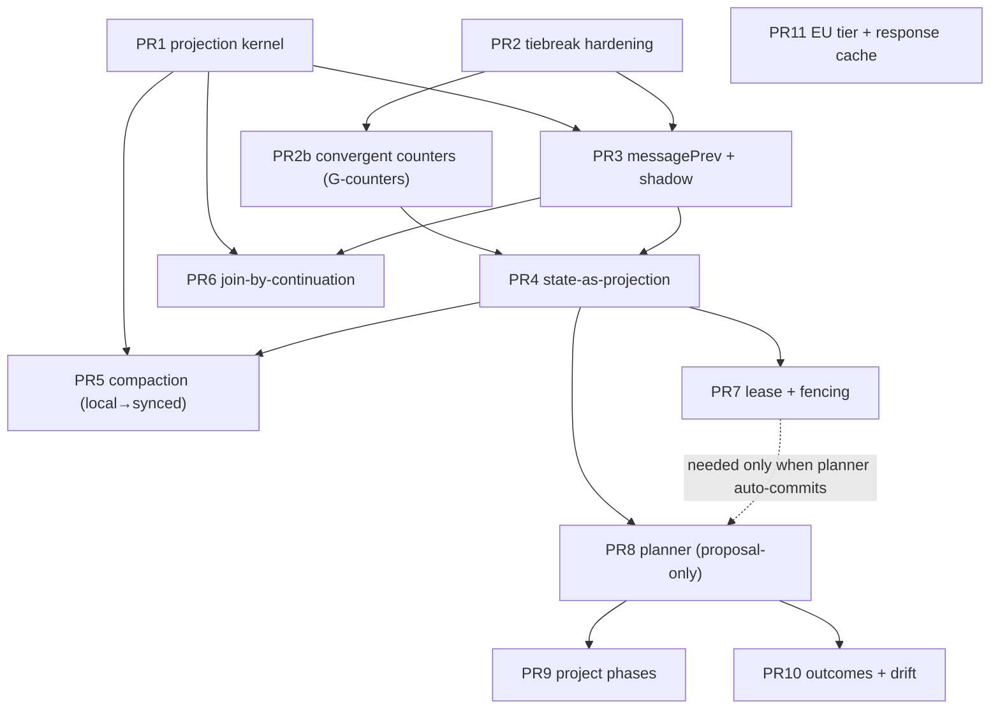

# Daily OS AI Runtime — Implementation Roadmap

- Status: Plan · Date: 2026-05-30
- Design baseline (read these first): [`../daily_os_ai_runtime_architecture.md`](../daily_os_ai_runtime_architecture.md) and ADRs [0016](../adr/0016-agent-state-as-log-projection.md), [0017](../adr/0017-deterministic-log-compaction.md), [0018](../adr/0018-convergent-multi-device-execution.md), [0019](../adr/0019-attention-negotiation-protocol.md).
- This doc is the **sequence of PRs and their dependencies**. The architecture doc/ADRs are the *why/what*; this is the *order*. The first PR has its own detailed plan: [`2026-05-30_projection_kernel_plan.md`](./2026-05-30_projection_kernel_plan.md).

> **Prerequisite:** the design baseline above currently lives on PR #3237 (`docs/daily_os_runtime_vision`), not yet on `main`. Treat that as the reference; if it hasn't merged, branch from it (or from `main` after it merges).

## Guiding principles (non-negotiable ordering rules)

1. **Convergence is correctness; the lease is an optimization.** Build the convergent projection *before* anything writes new synced derived state.
2. **Each PR lands independently** and is reviewable on its own. Prefer pure-logic + tests before touching production paths.
3. **The planner is proposal-only until trust is calibrated** — no autonomous mutation before the lease + fencing exist.
4. **Nothing new is synced before it can converge.** New derived state (summaries, projections) ships *local-only* first, promoted to synced only after the convergence foundation lands.

## Current-state anchors (what already exists in the code)

- Append-only `AgentMessageEntity` log + 13-variant `AgentLink` graph in `agent.sqlite`; `AgentSyncService` over Matrix; `vector_clock.dart` (four-way `VclockStatus`, element-wise-max `merge`).
- `WakeOrchestrator` (in-process single-flight + VC self-suppression); `ChangeSet`/`ChangeDecision` human gate; `DayPlan` (capacity + energy bands); `ProfileResolver`; souls (`antiSycophancyPolicy`); health import (`HealthService` → `QuantitativeEntry`/`WorkoutEntry`).
- **Gaps to close** (per §3 of the architecture doc): `prevMessageId`/`messagePrev` causal chaining is *declared but not populated*; agent entities are `upsertEntity`'d in place; compaction scaffolding (`summary*`/head pointers) has no schema or production path; sync applies concurrent agent payloads by arrival order; execution is in-process single-flight only (no cross-device coordinator).

## PR sequence

Grouped into the six phases of §10. Each PR: **Goal · Depends on · Touches · Defers · Done when · Realizes.**

### Phase 1 — Convergence foundation

**PR 1 — Projection kernel (pure, property-tested, unused in production)**
- **Goal:** deterministic `canonicalOrder` + `project` over an event-set view; prove permutation-invariance and multi-head tolerance.
- **Depends on:** nothing.
- **Touches:** new `lib/features/agents/projection/` module; `vector_clock.dart` (read-only). No DB/sync/UI.
- **Defers:** production wiring, `messagePrev` population, compaction.
- **Done when:** analyze clean; Glados property tests pass (permutation-invariance, causal respect, deterministic `(hostId,id)` tiebreak, multi-head, two-device convergence).
- **Realizes:** §4, §8; ADR 0016 rule 4. **→ detailed plan in the kernel-plan doc.**

**PR 2 — Deterministic tiebreak hardening (existing sync)** — detailed plan: [`2026-05-30_deterministic_tiebreak_plan.md`](./2026-05-30_deterministic_tiebreak_plan.md).
- **Goal:** make the existing concurrent-branch LWW a true total order. The handler already resolves vector-clock dominance (`a_gt_b`/`equal`/`b_gt_a`); only the `concurrent` case falls through to arrival-order. Break that tie deterministically using **metadata already present at the decision point** — `updatedAt` LWW first, then a replica-independent key derived from the two events' **vector clocks** (or the envelope's `originatingHostId`). This does **not** depend on a production per-entity `hostId`; the tiebreak-key source is settled in the PR 2 plan.
- **Depends on:** none — independent of PR 1 *and* PR 3. (Conceptually validated by PR 1's total-order discipline, but PR 2 resolves *competing versions of one id*, where the vector clock — not PR 1's `(hostId, id)` order over *distinct* events — is the natural discriminator, so it needs nothing from PR 3's deferred `hostId` sourcing.)
- **Touches:** a new pure `resolveConcurrent` comparator + `sync_event_processor_agent_handlers.dart` (the `concurrent` branch) + concurrent-application tests.
- **Defers:** HLC/bounded-drift for clock-skew on the LWW primary (separate, only if skew bites); an authoring-`hostId` column (only if a true authoring host is later needed).
- **Done when:** two devices applying the same concurrent pair in either arrival order deterministically agree; equal-`updatedAt` ties covered; non-concurrent branches unchanged.
- **Realizes:** ADR 0018 rule 5; §8.

**PR 2b — Convergent agent-state counters (per-host G-counters)** — detailed plan: [`2026-05-31_convergent_counters_plan.md`](./2026-05-31_convergent_counters_plan.md).
- **Goal:** make the cumulative agent-state counters converge to the *exact* total across devices, even under partition (PR 2's deterministic tiebreak converges but is *lossy* on counters — it picks one side, dropping the other's increments). `wakeCounter`, `slots.totalSessionsCompleted`, `slots.weeklyReviewCount` become **per-host G-counters** — `Map<hostId,int>`, value = sum of entries, merge = element-wise max (the same shape as a vector clock / `processedCounterByHost`, reusing `VectorClock.merge`). No lost increments, ever.
- **Depends on:** PR 2 (extends the concurrent-resolution path with a *per-field* merge instead of whole-row LWW). Independent of PR 3.
- **Touches:** counter fields on `AgentStateEntity`/`AgentSlots` (`int` → `Map<hostId,int>`; freezed regen + `int`→map data migration seeding `{migrating-host: current}` so the sum is preserved); the read-modify-write increment sites (`wakeCounter + 1` → bump the local host's entry, host from `VectorClockService`); the sync apply path (counter fields merge element-wise-max; the rest of the row stays LWW/projection).
- **Defers:** `toolCounterByKey` → count-from-log over synced `toolEffect` links (synced source; nested per-host G-counter only if that proves insufficient); `consecutiveFailureCount` stays **best-effort/LWW** (it *resets* on success, so it is not grow-only and is ill-defined across a partition).
- **Done when:** a partition+heal sim shows each counter equals the true sum of per-device increments on every device (no lost increments); non-counter fields unchanged.
- **Realizes:** the "no lost increments" guarantee; supersedes the count-from-log framing for the monotonic counters (and the §11 / PR 10 counter-CRDT flag for *agent-state* counters specifically).

**PR 3 — `messagePrev` wiring + shadow projection** — detailed plan: [`2026-05-30_messageprev_shadow_projection_plan.md`](./2026-05-30_messageprev_shadow_projection_plan.md).
- **Goal:** populate `messagePrev` (and/or `prevMessageId`) when persisting messages so the log is a real DAG; compute the kernel's projection **in shadow** (alongside the mutable rows) and assert equality on the forward corpus.
- **Depends on:** PR 1, PR 2.
- **Touches:** zero call sites — `AgentSyncService.upsertEntity` **routes** local message writes to a private `_appendMessage` (the ~18 message-persisting sites already funnel through it), so chaining can't be bypassed by construction. `_appendMessage` stamps `prevMessageId`, creates the `messagePrev` link, and **maintains `recentHeadMessageId`** (which is *declared but never written* today — head maintenance is net-new). Plus the shadow harness (the adapter `agentEventsFromLog` already merged in #3246). **No DB schema migration** — entities are a `serialized` JSON blob and `messagePrev` uses the existing links table.
- **Cross-wake chaining:** `threadId = job.runKey` (per-wake), so the chain spans wakes off the agent's *global* head — not per-thread (which would be a head-per-wake forest).
- **Defers:** flipping reads (PR 4); join-on-resume → pick-one-head, joins in PR 6; the authoring-`hostId` message field (its own increment).
- **Migration/back-compat — backfill (decided):** a one-time per-agent migration chains the existing prefix by `(createdAt, id)` and sets `recentHeadMessageId`, so legacy agents become a single continuous head and "bridge" is automatic. Shadow-equality is scoped to forward activity until backfill runs. Counter/slot *seeding* is the separate PR 4 concern (count-from-log + PR 2b G-counters + Form-A cache-seed). Mixed-version sync degrades gracefully (dangling parents → roots). See the plan's Risks & migration section.
- **Done when:** every post-PR-3 message carries a causal parent edge; shadow projection matches live state across the forward corpus (legacy divergence documented, not asserted away).
- **Realizes:** §8 (DAG); ADR 0016.

### Phase 2 — State as a projection

**PR 4 — State-as-projection migration (Move 1)** — detailed plan: [`2026-05-30_state_as_projection_plan.md`](./2026-05-30_state_as_projection_plan.md).
- **Goal:** flip reads to the projection; demote authoritative mutable `AgentStateEntity` to a **regenerable cache that is still synced** (kept for cold-start-from-artifacts + cheap reads), with the log authoritative and the cache reconciled against the projection. User-authored docs keep the `Version`/`Head` snapshot pattern.
- **Depends on:** PR 3 (shadow equivalence proven first) and **PR 2b** — the
  monotonic agent-state counters (`wakeCounter`, the `slots` session counters)
  are already per-host G-counters, which is what keeps them exact across
  partition+heal; PR 4 reads them as-is and does not re-home them.
- **Touches:** `agent_repository` reads, state resolution in workflows; grow `project()`/`AgentProjection` to the full derived state; classification of `AgentStateEntity`/`AgentSlots` fields (derived ← log/links · **monotonic counters → PR 2b per-host G-counters** · event-sourced counters such as `toolCounterByKey` → count-from-log over synced links · runtime-local scheduling → don't sync · config → re-home · `processedCounterByHost` → sequence layer). Reconcile = lazy-on-read gated by a head-set/`frontierDigest` check, coalesced background refold, **strict reconcile at wake start** (aligns with the PR 7 lease).
- **Defers:** removing the cache rows entirely (optional later); compaction's `frontierDigest`/bounded working set (PR 5). The monotonic counters need **no count-from-log** — PR 2b's per-host G-counters already converge them; count-from-log is reserved for counters with a synced event source.
- **Done when:** derived state is read from the projection; the read-modify-write `wakeCounter + 1` pattern is gone; concurrent multi-device edits **self-heal** on agent-derived state and counters stay exact across partition+heal (sim test) — resolving PR 2's convergent-but-lossy counter limitation. Once the cache is a pure fold of a convergent log, LWW on it is self-healing, so PR 2's resolver drops to a transient-cache role.
- **Realizes:** §2/§4 Move 1; ADR 0016.

### Phase 3 — Long-horizon memory

**PR 5 — Compaction as a local read-side cache → then synced**
- **Goal:** activate the summary scaffolding: maximal-complete-checkpoint selection over causal frontiers, `frontierDigest` (coverage) + `contentDigest` (text), eager merge-summary on budget overflow. Ship **unsynced** first.
- **Depends on:** PR 1 (kernel) for local-only; **promote to synced** depends on PR 4.
- **Touches:** new compaction behavior; summary digest schema; wake context assembly (stable prefix = soul→tools→summary→recent tail; `currentLocalTime` last).
- **Defers:** merge-summary tuning; cross-device promotion until PR 4.
- **Done when:** long-lived agents read frozen-summary + tail; **replay-from-summary is equivalent to replay-from-genesis in the scoped sense** — identical *projection state* (heads, pointers, derived fields), preserved *provenance* (the summary records which frontier it covers via `frontierDigest`), and byte-identical replay of the *uncovered tail*. This is **not** a claim of byte-identical or semantically-lossless reproduction of the summarized prose (infeasible for LLM/text summaries); the equivalence is over projected state + coverage metadata + tail, not over the summary text itself. Two devices summarizing the same trunk converge (sim test).
- **Realizes:** §6; ADR 0017.

**PR 6 — Join-by-continuation (fork healing)**
- **Goal:** lazy, capped, content-addressed join node (`id = hash("join-v1" + sorted parent-head ids)`); deterministic payload, canonical envelope reconciliation.
- **Depends on:** PR 1, PR 3 (DAG).
- **Touches:** projection (head detection), a join-emitting behavior, sync envelope reconciliation for content-addressed events.
- **Done when:** two devices concurrently emitting a join over the same heads write one merged node (sim test); context/prefix stay bounded under repeated forks.
- **Realizes:** §8; ADR 0018 rule 8.

### Phase 4 — Execution safety

**PR 7 — Executor lease + fencing**
- **Goal:** side-effect-boundary lease (`(agentId, behaviorKind)`, `(userId, dayId, planner)`) + monotonic fencing token; offline reconciliation (idempotent + fenced); side-effect idempotency key `agentId + behaviorKind + frontierDigest + triggerId + toolName` (stable, source-derived `triggerId`).
- **Depends on:** PR 4 (convergent projection). **Decision required:** lease backend — and the two candidates are **not** interchangeable. A *designated-primary election over eventually-synced app state* is **best-effort attention negotiation only**: under partition, both sides can believe they hold it, so it cannot provide linearizable ownership or a monotonic fence on its own. A hard lease + fencing token (the actual safety property PR 7 needs) requires either an external coordinator with linearizable compare-and-swap, or restricting auto-commit to genuinely idempotent + fenced side effects so that a double-execution under partition is provably safe. **PR 7 must not try to derive linearizable ownership from eventually-synced state** — pick the external coordinator for irreversible effects, and reserve synced-state primary-election for reversible/idempotent ones.
- **Touches:** `WakeOrchestrator` (`canExecute()` gate, extending VC self-suppression to inter-device); side-effecting tool paths; idempotency-key plumbing.
- **Done when:** partition+heal sim shows no duplicate committed schedule and no divergence; stale fencing tokens rejected on reconnect.
- **Realizes:** §8; ADR 0018 rules 1–3, 9.

### Phase 5 — The executive-assistant loop

**PR 8 — Planner MVP (proposal-only)**
- **Goal:** `attention_request` events (impact/priority/deadline-slack/energy-fit/cadence + **evidence references** + bounded fields) as new `AgentDomainEntity` + `AgentLink` types; a planner behavior that ranks by **fact-derived** utility; a **deterministic non-negotiable verifier** (recurrence + preemption, checked against health actuals, with manual override/bypass); VOI gate; output = `ChangeSet` proposal. **No auto-mutations.**
- **Depends on:** PR 4 (projection). (Auto-commit later needs PR 7.)
- **Touches:** new event/edge types; planner behavior; verifier; `ChangeSet` emission; `DayPlan` (awards → `PlannedBlock`).
- **Defers:** auto-resolution of anything irreversible; auto-commit (needs lease).
- **Done when:** competing bids produce a deterministic, fact-grounded ranking; non-negotiables can't be violated by a model; proposals appear in the existing gate.
- **Realizes:** §5, §9; ADR 0019. **Open decision to resolve here:** bid-vs-blackboard primary abstraction; VOI weighting.

**PR 9 — Project phases + recurring attention-requests**
- **Goal:** project phase model (`active`/`monitoring`/`paused`…); a phase can emit a standing recurring `attention_request` ("monitoring → 15 min weekly").
- **Depends on:** PR 8.
- **Realizes:** §5.

**PR 10 — Outcome tracking + drift nudges**
- **Goal:** outcomes as typed graph entities (4DX lead/lag), bound to health actuals; drift-detection behavior → `ChangeSet` nudge; receptivity from activity signals.
- **Depends on:** PR 8.
- **Defers:** counter-CRDT for cumulative measurements (flag from §11).
- **Realizes:** §9.

### Phase 6 — Inference tiers

**PR 11 — EU fallback tier + content-addressed response cache**
- **Goal:** thin provider adapter behind `ProfileResolver` (on-device → EU → proprietary); content-addressed **response cache** with the two-keys rule (verbatim prompt for replay; frontier+`triggerId` behavior key for active dedup); model-version pinning; per-provider compliance verification.
- **Depends on:** `ProfileResolver` baseline (mostly independent); benefits from PR 7's idempotency key.
- **Realizes:** §7, Thread D.

## Dependency graph

## Cross-cutting

- **Test harness:** the two-device convergence simulator built in PR 1 is reused by PR 3/4/5/6/7. Treat it as shared infrastructure.
- **Decisions to resolve along the way:** lease backend (PR 7); bid-vs-blackboard primary abstraction and VOI weighting (PR 8); counter-CRDT for cumulative outcomes (PR 10); per-provider compliance/pinning (PR 11). All are flagged in §11 of the architecture doc.
- **Testing conventions:** pure logic uses Glados property tests; service/workflow tests stay deterministic example tests with mocks and fixed clocks (`test/README.md`, `daily_os_next/README.md` → Testing Strategy). No real timers; deterministic dates.

## Definition of "alive"

The runtime is "alive" at the end of Phase 5: per-task/project agents post evidence-backed `attention_request`s, a planner ranks them against your energy bands and hard non-negotiables, and surfaces a max-impact day plan through the `ChangeSet` gate — converging across devices, with long-horizon memory via compaction. Phase 6 makes inference vendor-agnostic and on-device-first.
