# Agent Input Capture + Log Compaction — Implementation Plan (PR 5)

- Status: **Plan** · Date: 2026-06-01
- Part of: [`2026-05-30_daily_os_runtime_implementation_roadmap.md`](./2026-05-30_daily_os_runtime_implementation_roadmap.md) (PR 5 — *"Compaction as a local read-side cache → then synced"*).
- Design baseline (read first): [ADR 0020](../adr/0020-agent-input-capture.md) (per-source content-addressed input capture) and [ADR 0017](../adr/0017-deterministic-log-compaction.md) (deterministic compaction). Both build on [ADR 0016](../adr/0016-agent-state-as-log-projection.md) (state as a log projection) and converge via [ADR 0018](../adr/0018-convergent-multi-device-execution.md).
- Depends on (**all merged**): PR 1 (projection kernel — `canonicalOrder`/`project`/`AgentProjection`), PR 3 (`messagePrev` DAG + head maintenance + `compareShadowProjection`), PR 4 (state-as-projection: reads flipped to `reconciledAgentState`, the cache is regenerable). PR 5 realizes ADRs **0020 + 0017 together** because they share one mechanism (the frontier/coverage over content-addressed payloads).

## Why this is one PR, not two

ADR 0020 (capture) and ADR 0017 (compaction) are the *same* mechanism seen from two ends. Capture puts the agent's **inputs** into the log as per-source, content-addressed payloads; compaction folds a **frontier** of those (plus message events) into a checkpoint and selects the active one. They share `contentDigest`, the frontier, and the coverage/retention rule, so splitting them would duplicate that machinery. This PR lands both.

## The problem we are actually solving (grounded in the code)

A task-agent wake does **not** replay the agent's own message thread — the conversation is recreated fresh each wake (`task_agent_workflow.dart:299`). Its context is rebuilt every wake from **user-generated content + the last report + the latest project report**:

- `## Current Task Context` = `buildTaskDetailsJson` → `generate(id)` (`ai_input_repository.dart:76`) walks **every linked journal entry** and emits `logEntries` — full text notes **and full audio transcripts** (`:92-136`) — plus checklist items and time. This is the entire user-generated task log, and it grows without bound over a task's life. It is rebuilt with a `getLinkedEntities` + an N+1 `journalEntityById` walk **every wake**.
- `## Parent Project Context` = the latest project-agent report (compact `oneLiner`/`tldr` only — `buildProjectContextJsonForTask`, `:236`).
- `## Current Report` = the agent's own last report (full body).

Then the **entire assembled prompt is persisted as one blob, every wake** — `AgentMessagePayloadEntity{content:{'text': userMessage}}` + a `user` message, synced via Matrix (`task_agent_workflow.dart:308-331`). A task with 50 wakes therefore has the full content duplicated ~50× in the synced agent log. **This is exactly the "whole rendered-context blob per wake" alternative ADR 0020 explicitly rejects** (§Rejected alternatives): any single-byte edit re-stores the whole context and collapses per-source provenance into an opaque lump.

So PR 5 delivers two wins from one mechanism:

1. **Bound the wake context** — long-lived agents read `active summary + uncovered tail`, not the whole task log.
2. **Slow the log's growth** — persist each *source* once per *distinct content version* (deduped by `contentDigest`), not the whole prompt every wake.

## The model (load-bearing decisions — settled with the user)

- **Capture inputs into the log; the fold never re-reads the journal.** What the agent fed the model is recorded as append-only payloads (ADR 0020 rule 1). Replay/projection is then a pure function of the log (ADR 0016).
- **Full content-bearing snapshots, not reference-only.** Rationale: the agent log already dwarfs UGC in growth *and already mirrors all content per wake* (the blob above), so per-source dedup is **strictly less** duplication than today; it removes the per-wake N+1 journal walk; and content travels with the synced log (a device can wake without the journal fully synced). Reference-only is rejected (breaks replay purity, loses point-in-time provenance, busts the prefix cache on every cosmetic edit).
- **Per-source, content-addressed, provenance-on-the-reference.** Each distinct source (task description, each comment, each transcript, each image-analysis result) → one `AgentMessagePayloadEntity` keyed **purely by `contentDigest`** (content only, no entity id), so identical text dedupes across wakes *and* agents. Provenance (`contentEntryId` → journal entity) + canonical ordering (`sourceCreatedAt`, `sourceId`) live on the **`messagePayload` link**, so one shared payload carries many provenances (ADR 0020 rules 2/4).
- **Capture the rendered text, not raw artifacts.** Audio → its transcript text; image → its analysis result; heavy binaries stay referenced+hashed in the journal (ADR 0020 rule 5). Capture is bounded by the prompt budget.
- **Granularity is fine (per source), never coarser** — one payload per distinct content piece, not one blob per wake.
- **The trigger-token stream is a wake *hint*, not the change ledger.** Multiple signals coalesce (`WakeQueue.mergeTokens` unions tokens — `wake_queue.dart:99`; 120 s throttle window — `wake_orchestrator.dart:161`; single-flight per agent; safety-net drain). Coalescing is lossless at the *set-of-changed-ids* level but lossy at the per-edit timeline. So capture **reconciles current sources against the agent's coverage at wake time** and captures state per source (deduped by hash); coalesced multi-edits collapse to one capture of the final state, which is exactly right for a state projection. Missed signals / dormancy self-heal because we diff against current sources, not the lossy stream.
- **Deletion = soft-retract from active consideration, never a log deletion.** A deleted/unlinked source is *not* removed from the log (it stays auditable). A **retraction event** is appended; the **active input frontier excludes retracted sources** so day-to-day wakes are not reminded of intentionally-deleted content, while a **detailed-recap/audit path** can still replay the original snapshot *and* the retraction. This mirrors the existing append-only soft-retract pattern (`ChangeDecisionVerdict.retracted`).
- **Summaries are append-only checkpoints selected by the projection (ADR 0017), not LWW pointer writes.** The persisted `latestSummaryMessageId`/`recentHeadMessageId` are a *local cache*; the projection selects the **maximal complete materialized checkpoint** whose frontier is ancestral to every head. `frontierDigest` = hash of the covered id set (coverage); `contentDigest` = hash of the summary text (artifact identity). Two devices summarizing the same trunk converge.

## What already exists (scaffolding to activate, not invent)

| Primitive | Where | Use in PR 5 |
| --- | --- | --- |
| `AgentMessagePayloadEntity` (normalized large content) | `agent_domain_entity.dart:86` | the per-source payload; **re-key id = `contentDigest`** |
| `AgentLink.messagePayload` / `AgentLinkTypes.messagePayload` | `agent_link.dart:39`, `agent_constants.dart:16` | the reference; **add `contentEntryId` + `sourceCreatedAt` + `sourceId`** (provenance + ordering) |
| `AgentMessageEntity.contentEntryId` | `agent_domain_entity.dart` | already links a message to a source entry |
| `AgentMessageKind.summary` + `summaryStartMessageId`/`summaryEndMessageId`/`summaryDepth` | `agent_enums.dart:320`, `agent_domain_entity.dart:78-80` | the checkpoint event |
| `AgentStateEntity.latestSummaryMessageId` / `recentHeadMessageId` | `agent_domain_entity.dart:51-52` | local cache pointers (projection is authoritative) |
| `AgentEventKind.summary` + adapter | `agent_event.dart:21`, `agent_event_adapter.dart:13` | kernel already classifies summary events |
| projection kernel + `deriveAgentState`/`reconcileAgentState` | `lib/features/agents/projection/` | extend `project()` to select the active checkpoint |
| `estimateTokens` / `kChunkTargetTokens` | `ai_input_repository`→`text_chunker.dart:77` | the budget-overflow trigger (no per-model context window exists yet — see Risks) |
| sha256 + canonical-key pattern | `run_key_factory.dart` | reuse for the `contentDigest` helper (`sha256-v1`, base64url, JCS) |
| deletion signal | `journal_repository.dart:95,118,343` (`deletedAt` + `UpdateNotifications.notify`) | drives retraction capture |

## Lifecycle

```mermaid
stateDiagram-v2
  [*] --> Idle
  Idle --> Capturing: wake fires
  Capturing --> Capturing: per source — hash rendered text; dedupe payload by contentDigest; append messagePayload link (provenance + ordering); append retraction for deleted/unlinked sources
  Capturing --> Assembling: input frontier recorded on the wake message
  Assembling --> Running: stable prefix (soul → tools → active summary → uncovered tail, canonical order) + currentLocalTime last
  Running --> Appending: emit reasoning/report events to log
  Appending --> BudgetCheck: uncovered tail beyond model budget?
  BudgetCheck --> Compacting: yes
  BudgetCheck --> Idle: no
  Compacting --> Idle: append summary checkpoint over the frontier; projection selects the active checkpoint
```

## Increments

Each increment: analyzer-clean, targeted tests green, one logical commit. Pure logic gets Glados property tests (per repo policy). Reads are **not** flipped until shadow-equivalence + convergence are proven (C1–C4 before C5).

### C1 — Content-addressed capture helper + payload re-key (pure)
- New `contentDigest(...)` helper: canonical JSON (sorted keys, RFC 3339 UTC, normalized numbers) → `sha256` → `sha256-v1:<base64url>` (ADR 0017 §6 / 0020 rule 2). Reuse the `run_key_factory` crypto pattern. **Glados**: digest is permutation-invariant over map keys and stable across re-encode.
- A pure capture model: `(List<RenderedSource>) → (List<payload>, List<messagePayload link>)` where `RenderedSource = {contentEntryId, sourceCreatedAt, sourceId, renderedText}`. Payload id = `contentDigest(renderedText)`; identical text → one payload, many links. **Glados**: dedup across sources, link count = source count, canonical assembly order = sort by `(sourceCreatedAt, sourceId)`.
- Add `contentEntryId` + `sourceCreatedAt` + `sourceId` to `MessagePayloadLink` (freezed regen; serialized link, defaulted → back-compatible). No production wiring yet.

### C2 — Capture on wake (replace the whole-blob persistence)
- At wake assembly, render the current sources (the existing `generate()` walk feeds `RenderedSource`s) and **capture per-source** via C1 instead of persisting one prompt blob. Replace `task_agent_workflow.dart:308-331`. Record the **per-wake input frontier** (the set of `messagePayload` references on the wake message).
- Detect deletions/unlinks from the trigger-token delta + journal `deletedAt`; append a **retraction event** for sources previously captured but now gone. Active projection excludes them; audit retains them.
- Live prompt assembly stays as-is for this increment (still reads the journal) — only *persistence* changes. Verify: re-wake with no content change emits **zero** new payloads (pure dedup).

### C3 — Active-checkpoint selection in the projection (pure)
- Extend `project()`/`AgentProjection` to compute the **active checkpoint** = maximal complete materialized `summary` whose frontier ⊆ every head; expose `frontierDigest`, the **uncovered tail** (original non-summary events not covered), and incomparable-maxima → meet (common-base) fallback (ADR 0017 §Decision 3). Retracted sources are excluded from the active frontier.
- **Glados**: permutation-invariance of selection; two devices with the same event set select the same checkpoint; concurrent summaries over the same frontier break ties by `(contentDigest, id)`.

### C4 — Compaction behavior + flip wake assembly
- Background/inline compaction: when the uncovered tail exceeds the model budget (`estimateTokens` + a model-budget constant), summarize the bounded frontier into an append-only `summary` checkpoint (decisions/open commitments/non-negotiables preserved; redundant chatter dropped — ADR 0017 Decision 4). `latestSummaryMessageId` updated as a cache only.
- **Flip assembly**: `## Current Task Context` becomes `active summary + uncovered tail` assembled from the **log** in canonical order, replacing the `buildTaskDetailsJson` full reconstruction. Stable prefix fixed: soul/anti-sycophancy → tools → rolling summary → recent tail; `currentLocalTime` last (ADR 0017 Decision 6). This is where context shrinks and the prefix cache warms.

### C5 — Convergence verification + sync confidence
- Two-device sim (reuse the PR 1 convergence harness): same sources captured on both devices → identical payload set (content-addressed); concurrent summaries of the same trunk converge to one active checkpoint; retraction converges. Captures/summaries are already-synced append-only content, so this is a *proof* step, not new wiring — but reads stay on the convergent projection.
- READMEs: flip the agents README "Memory compaction: prepared, not active" section to active; document capture + retraction + assembly. Add the compaction lifecycle Mermaid.

## Migration path for existing agents (1K+ live)

**Lazy, on next wake — no batch job, no history rewrite.** This matches the PR 3/4 discipline (avoid mass operations across the live fleet) and degrades gracefully so there is no behaviour cliff at rollout.

1. **Seed-from-current-state on the first post-C2 wake.** The wake already renders the current source set; C2 simply captures it *per source* (content-addressed) instead of as one prompt blob. That establishes the capture baseline. Cost is one-time and proportional to the agent's *current* content — a handful of payloads — and it is spread across whenever each agent happens to next wake, not a startup thundering-herd. From then on, dedup by `contentDigest` means only **deltas** create new payloads.
2. **No retroactive decomposition of history.** The agent's existing per-wake whole-prompt blob payloads are immutable historical events — they **stay in the log, auditable**, and are *not* parsed back into per-source payloads (lossy and pointless: we have the current content). They are distinguishable by shape (one blob via `AgentMessageEntity.contentEntryId`) from new captures (per-source `messagePayload` **links** carrying provenance), so the **active content frontier reads only the new per-source captures** and excludes the legacy blobs. Legacy blobs are audit/recap-only.
3. **The legacy blob tail is frozen, not growing.** After C2 no new blobs are written, so that tail stops accumulating; combined with per-source dedup going forward, total log growth drops sharply. Reclaiming the frozen blob rows is an *optional* later step (the roadmap's "remove cache rows entirely") — never a destructive step in this PR.
4. **Graceful read-flip (C4).** Before an agent has accumulated a `summary` checkpoint, `active summary + uncovered tail` has no summary yet, so the tail = the seeded current content — i.e. **identical to what the agent loads today**. Existing agents behave the same at first and only diverge (benefit) once they accumulate enough to cross the budget and compact. No cliff, no forced re-summarization of history.
5. **Retraction needs no backfill.** It only applies forward (a source deleted *after* capture). Content deleted before an agent's seed wake is simply never in the current source set, so it is absent from the frontier from the start.

Shadow-equivalence (C3) is therefore scoped to **forward** activity, exactly as in PR 3/4 — legacy divergence is documented, not asserted away.

## Other risks

- **No per-model context window in config.** `AiConfigModel` has only `maxCompletionTokens` (`ai_config.dart:74`). C4 needs an input budget. Start with a conservative per-model constant + `estimateTokens`; a real context-window field is a follow-up, not a blocker.
- **Recursive-summary drift** (ADR 0017 Consequences): mitigated by stored provenance + `contentDigest` + regenerability; on-device budget thresholds need tuning for small contexts.
- **Retraction completeness** depends on the deletion signal reaching the agent. The wake-time reconcile against current sources (not the lossy trigger stream) is the backstop — a source absent from the current set is retracted regardless of whether its delete signal was coalesced away.

## Done when

- Per-source content-addressed capture replaces the per-wake prompt blob; re-waking with no content change emits no new payloads.
- Long-lived agents read `active summary + uncovered tail`; the whole-task-log reconstruction is gone from the wake path.
- Deleted content is retracted from day-to-day consideration but remains auditable.
- Replay-from-summary is equivalent in the scoped sense (identical projected state + coverage metadata + byte-identical uncovered tail), and two devices converge (sim).
