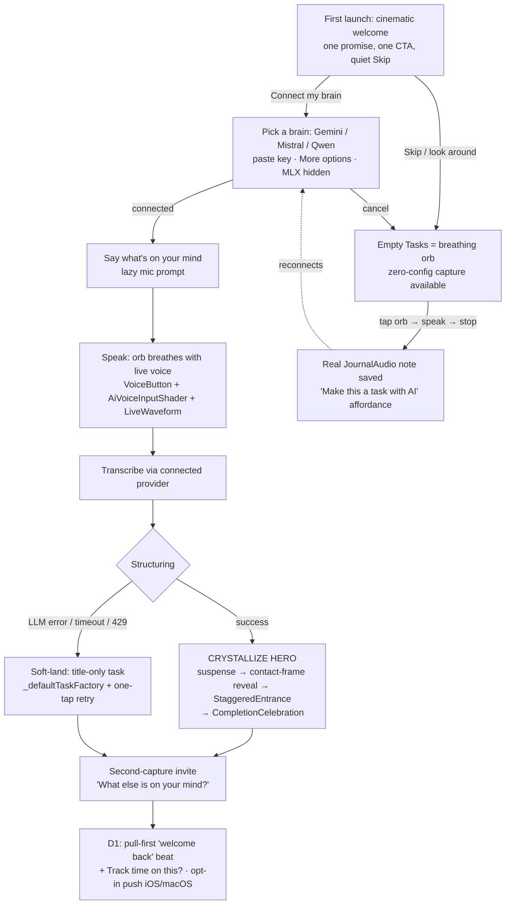

# Lotti FTUE — "Connect your brain, watch a thought become a task"

## Context

Lotti is enormously valuable once you "get it" — dictate a raw thought, watch it become a
structured task/plan, track where your time actually goes, let AI plan a sustainable day. But
that value is **invisible to a brand-new user**: today a fresh install lands on an empty Tasks
screen with no guidance. There is no onboarding — only a "What's New" modal, an AI-provider
prompt, a `seen_`-prefix hint system, and per-feature empty states.

The goal of this work is a **best-in-class, animated, genuinely delightful first-time-user
experience** that grabs the new user's hand and guides them to the core "aha," so that
measurably more people stick: higher **D3 / D7 / D30** retention. The FTUE itself is the growth
lever (open-source, no marketing budget).

This plan was produced by a **7-expert simulated panel** (FTUE/activation, behavioral science,
UX/cognitive-load, motion design, consumer-onboarding, retention/growth, plus a contrarian
minimalist) across an independent-recommendation round + two critique/scoring rounds, then
**adjudicated against the real codebase** (every load-bearing claim was verified — see
Appendix B). Panel confidence rose 6.1 → 6.4/10 across rounds; the score was held down almost
entirely by one tension — *"the marquee structuring magic is provider-gated and can't fire
keyless"* — which **the product owner resolved** by embracing a required provider gate, framed as
part of the magic. That decision removes the panel's central worry; the residual risk it flagged
(the API-key paste is a real activation cliff) becomes a **thing we instrument and measure**,
not a thing we pretend away.

### Locked product decisions (these govern; they override panel defaults where they conflict)
1. **Platform:** one adaptive concept across mobile (bottom-nav) and desktop (sidebar).
2. **Aha moment:** *Voice → real structured task*, fired on the user's **first** capture.
3. **Philosophy:** *invite, don't force* — short, skippable welcome; non-blocking nudges later.
4. **Provider setup is required and gates the magic.** The FTUE includes picking an inference
   provider (**Gemini / Mistral / Qwen**, presented as equals, no pre-selected default) and
   pasting an API key. Mistral noted as fullest for voice (Voxtral realtime transcription).
5. **Gate position: Hybrid** — a premium welcome that frames provider setup as *"connect your
   AI brain"* (not a settings chore), then straight into the real voice→task magic.
6. **Reconciliation of (3) and (4):** the gate is **skippable**. Skipping costs *structure*, not
   the *artifact* — a skipper can still capture a real zero-config voice note (a genuine win and
   a Zeigarnik open loop) and is nudged, non-blockingly, to connect a brain later.

---

## North-star concept

**"Connect your brain, then watch a thought become a task."** A short, cinematic welcome makes
one promise and frames provider setup as unlocking the magic (not a chore). The user picks a
brain (Gemini/Mistral/Qwen) and pastes a key, then is immediately invited to *speak* — the orb
breathes with **their own voice** (the existing dBFS-reactive shader, our most-finished asset),
their words are transcribed for real, and the loose transcript **crystallizes** into a structured
task (title + checklist) that lands with a celebration. The aha is **real**, **theirs**, and
arrives on capture #1.

Anyone who isn't ready to paste a key can **skip** into the app and still get a real
zero-config voice *capture* (orb delight + a saved note), with a standing, non-blocking "connect a
brain to make this a task" affordance on that note — the open loop that pulls them back.

---

## The first session, moment by moment

### Moment A — Cinematic welcome (first launch only)
- One promise line + one primary CTA ("Connect your brain") + a quiet, always-visible **Skip /
  look around**. Contents arrive on a `StaggeredEntrance` cascade. Adaptive container via
  `ModalUtils`/`WoltModalSheet` (bottom-sheet on mobile, dialog on desktop). ~10–15s, skippable.

### Moment B — Connect your brain (the required gate, framed as magic)
- **Exactly the main event, low decision-load:** three provider tiles — **Gemini · Mistral ·
  Qwen** (no pre-selected default) — + a key-paste field, framed *"pick the brain that turns your
  words into tasks."* `AnimatedModalItem` hover/tap on tiles. A **"More options"** tertiary
  disclosure holds the rest (OpenAI/Ollama). **MLX is excluded from the FTUE** (multi-GB download
  belongs in Settings → "go fully private," later).
- Each tile deep-links to where to grab a free key. Mistral tile notes "fullest voice."
- **Connect does NOT celebrate** — a quiet ~150ms checkmark cross-fade. The burst is reserved for
  the task payoff alone (the panel's "one owner of the peak" rule).
- **Cancel/skip** → lands in the app on the empty-Tasks orb (Moment S), zero-config capture still
  available, with a standing "connect a brain" nudge. The legacy `AiSetupPromptService` auto-open
  is suppressed during the FTUE so it can never double-prompt.

### Moment C/D — Speak (lazy mic + the dBFS orb)
- "Say what's on your mind." Tapping the orb fires the OS mic prompt inline with a one-line why;
  **light haptic on record-start**. The orb core breathes with live voice level
  (`AiVoiceInputShader` + `LiveWaveform`, driven by `captureControllerProvider`'s dBFS stream —
  already wired, no new wiring). A dismissible rotating example hint defeats blank-mic freeze
  ("Try: 'remind me to call the dentist and book the car service.'"). A first-class **"Rather
  type?"** path serves the mic-shy/denied cohort (real artifact, tagged as a distinct cohort).
- On stop: **light haptic** + a one-shot settle (~180ms `short3`). Audio persists as a real
  `JournalAudio` via `SpeechRepository.createAudioEntry` (no provider/linkedId/categoryId needed).
- Short/silent (<~3s) → gentle "say a bit more," never a garbage artifact.

### Moment E — The crystallize hero (the aha)
The only net-new animation; it **is** the aha. Built on one `AnimationController` as a
frame-by-frame timeline (not prose):
- **Into-hero seam:** the note card hands off to a suspense state; transcript prose visible/dimmed
  while inference runs.
- **Suspense (indeterminate, honest 2–12s, never a fake timer):** `AiThinkingShaderPresence` over
  the dimmed transcript.
- **Reveal (punctual):** prose alpha 1→0 over ~200ms (`emphasizedAccelerate`); card alpha 0→1
  starting at the **60% mark** of the prose fade — a contact-frame overlap so it reads as
  *transformation*, not disappear-then-appear. Title row + checklist rows assemble via
  `StaggeredEntrance` (parameterize its curve/duration, or correct the spec to its real
  `easeOutCubic`/360ms — decide in build, don't ship a mismatch).
- **Editable + "tap to edit" cue at reveal** — the result must read as editable, or a mediocre AI
  result lands as final and inverts the peak. Announce as a live region for screen readers
  ("Task created: <title>, N items").
- **Degraded variant:** bare title (no checklist) → title card lands with a single-element
  pop+glow. Never animates into an empty skeleton.
- **Failure path (mandatory):** LLM error / timeout / 429 / no network → soft-land on a
  **title-only task** built from the transcript (`_defaultTaskFactory`) with one-tap retry. Tagged
  `floor`, never counted as the real aha.

### Moment F — Celebrate, then the loop
- `CompletionCelebration` fires **only** on the real structured task (glow + unclipped overlay
  burst + anchorScale + single haptic, ~1400ms, tap-to-dismiss, reduced-motion drops burst /
  holds glow / keeps haptic — verified honored).
- **One owner of the post-celebration frame:** the **second-capture invite** ("That's one —
  what else is on your mind?"), framed generously, trivially dismissible. It ships as an
  *instrumented hypothesis* (does the second-capture cohort return better?), not an asserted fact.
  The D1 return chip is demoted onto the task card **after** the user takes/declines that invite —
  never competing in the same frame.

The user ends in a non-empty Tasks list with their **real first task** — never a sample.

---

## Progressive disclosure (D0 → D30)

**v1 build scope is D0 + D1 only.** Everything past D1 is an explicit, **kill-gated hypothesis**
(a roadmap, not a spec). Governing rule: disclose a feature only when the user has produced the
prerequisite artifact (**data-gated, not calendar-gated**); one nudge at a time, chip-not-modal,
keyed to a `seen_` flag, never two stacked.

| Day | Status | Revealed | Gate |
|---|---|---|---|
| **D0** | **BUILD** | Connect brain → voice → real structured task; nothing else | First launch |
| **D1** | **BUILD** | Next-launch return beat + "Track time on this?" chip | A task exists AND user returns |
| **D3** | *Hypothesis* | Insights (variable reward) | Time tracked AND D1 kill-gate met |
| **D7** | *Hypothesis* | AI Daily OS; minimal capture-cadence streak (reuse habits heatmap) | ≥2 active days AND D1 proven |
| **D14+** | *Hypothesis* | Projects, linking, sync, categories, dashboards | Related artifacts exist |

**Replay:** the existing "Reset In-App Hints" maintenance action makes the aha re-watchable,
surfaced as "Show me the magic again" on the empty Tasks state.

---

## The retention loop (why they come back)

- **D0 — artifact + (optional) second rep.** The user leaves with a real task they made *by
  talking* (endowment). A skipper leaves with an untranscribed note = a concrete open loop.
- **D1 — pull-first return, reward before ask.** Primary mechanism is a **next-launch "welcome
  back / yesterday you captured this" beat** keyed off the persisted onboarding-state store —
  because push is unavailable on Linux/Windows/Android (verified). On **iOS/macOS only**, an
  opt-in "remind me tomorrow?" chip asks notification permission *there* (justified by the user's
  own tap) and offers a one-tap **life-anchor** ("after I wake up" / "on my commute" / "end of
  day") to convert an app-event into a self-initiated habit. Declined/unsupported → next-launch
  beat carries it.
- **D1 — second pillar opens.** "Track time on this?" chip introduces where-your-attention-goes.
- **D3+ — withheld until proven.** Insights (D3), capture-cadence streak (D7, cheap reuse of the
  existing habits heatmap — a thin number, never a candy-crush meter), Daily OS (D7, the real D30
  driver). Built only if the D0→D1 data clears the kill-gate.

---

## Delight & animation spec (mapped to verified components)

Animation is the cheap part; the **transcript→{title,checklist} transform is the expensive
net-new work.** v1 ships three load-bearing beats; the rest defers to a polish pass.

| Beat | Component | Status |
|---|---|---|
| **Listen ("it hears me")** | `VoiceButton` + `AiVoiceInputShader` + `LiveWaveform` | dBFS-reactive end-to-end via `captureControllerProvider` — **already wired**, cheapest beat. Use the component's native idle breath (`breathPeriod`); don't hand-roll a competing breath. |
| **Crystallize (hero)** | NET-NEW single-controller timeline | Prototype against real streamed model output before any motion polish. |
| **Celebrate** | `CompletionCelebration` | Reuse as-is; reduced-motion honored. |

- **Reduced-motion is a real, multi-widget build task (verified):** `AiVoiceInputShader`,
  `VoiceButton`, and `LiveWaveform` have **no `disableAnimations` handling** — the accessible
  Day-0 hero currently has no static story. Add static variants + tests for all three (mirror how
  `CompletionCelebration`/`StaggeredEntrance` already do it). Confirm `AiThinkingShaderPresence`
  honors reduced-motion or specify a static substitute.
- **Haptics** on record-start and record-stop/settle (not only at the celebration).
- All copy localized across the 6 ARB files, informal tone (du/tu/tú; Romanian formal).

---

## Build phases (each shippable; mapped to real files)

### Phase 0 — Measurement substrate (ships FIRST, before any FTUE UI)
- **Goal:** make the funnel queryable and the goal falsifiable before building anything visible.
- **Scope:** (1) a persisted **onboarding-state record** — `install_first_seen_utc`, active-days
  set, funnel-step booleans + timestamps, `reached_real_aha` bool; (2) a **queryable append-only
  event table** (counts/enums/bucketed-timings only — never transcript/audio/thought content;
  off-device emission behind explicit opt-in); (3) a **local funnel-report debug surface**
  (landing → connect → capture → {floor | real_aha}, cohorted by platform/provider, TTFV split);
  (4) a **baseline/holdout** (persist a pre-FTUE baseline cohort flag, or a small in-build holdout
  on the bare empty state).
- **Code:** verified — `SettingsDb` is `schemaVersion = 1`; `captureEvent`/`logging_service` is
  fire-and-forget text-log; `UserActivityService` is in-memory; **no install-date row exists.**
  Add a dedicated Drift append-only event table as source of truth (migration to v2), keep
  onboarding-state as derived/cached values on it (do **not** run two stores). `AppPrefs` `seen_`
  keys are for hint suppression only, not the metrics store. Reuse the maintenance/debug page
  pattern for the report surface.

### Phase 1 — Welcome + "Connect your brain" (the framed gate)
- **Goal:** ship the cinematic welcome and the required-but-skippable provider connect.
- **Scope:** welcome (StaggeredEntrance, one CTA, quiet skip); provider modal (Gemini/Mistral/Qwen
  tiles, no default, key paste, "More options", MLX excluded); quiet connect confirmation; skip →
  empty-Tasks orb + standing "connect a brain" nudge; suppress legacy `AiSetupPromptService`
  auto-open during FTUE; wire connect-funnel events.
- **Code:** extend the existing `gemini_ftue_setup.dart` pattern to **Mistral and Qwen FTUE setup
  paths** (net-new, parallel). Modal via `ModalUtils`/`WoltModalSheet` + `AnimatedModalItem`.
  Empty-Tasks-state via the Tasks tab page + `EmptyStateWidget`. **Confirm each of the three
  providers can do transcription *and* structuring** (Mistral=Voxtral+chat ✓; Gemini multimodal ✓;
  Qwen/Alibaba — verify audio support, else highlight only the capable ones). Copy in all ARBs.

### Phase 2 — The voice→task aha (real, on first capture)
- **Goal:** deliver the real "watch it become a task" magic on capture #1, never a counterfeit.
- **Scope:** "say what's on your mind" → reuse `VoiceButton`/`VoiceOrbZone`/`AiVoiceInputShader`/
  `LiveWaveform` (lazy mic, dBFS orb, haptics, short3 settle) → transcribe via connected provider
  → **net-new transcript→{title,checklist} structuring** → crystallize hero (suspense →
  contact-frame reveal → StaggeredEntrance) → `CompletionCelebration`. In-place edit + "tap to
  edit" cue. Failure soft-land to title-only task + retry. "Rather type?" path.
- **Code:** **NET-NEW** — the transcript→{title,checklist} transform (no such `SkillType`; current
  enum is `{transcription, imageAnalysis, imageGeneration, promptGeneration,
  imagePromptGeneration}`). Build it as a single-shot structuring call on the connected provider's
  chat model returning `{title, checklist[]}`, then **materialize via the existing
  `create_task_from_phrase` / `_defaultTaskFactory` pipeline** (title-only) **+ `AutoChecklistService`**
  (checklist on the created task; requires an existing `taskId`). Parameterize `StaggeredEntrance`
  or correct the spec. **ADD reduced-motion static variants + tests** for `AiVoiceInputShader`,
  `VoiceButton`, `LiveWaveform`. **Prototype the transform against real streamed output before any
  motion polish.**
- **Watch:** `connect → real_aha` rate; `structuring_failed{reason}`; created-then-deleted rate
  (anti-aha); heavy-edit rate.

### Phase 3 — D1 return loop + second pillar
- **Goal:** bring users back on D2 on **every** platform, and open time-tracking.
- **Scope:** next-launch "welcome back / yesterday you captured this" beat (universal,
  permission-free, the primary trigger); deferred-cohort D1 landing (note flagged "unfinished",
  orb guidance persists); **iOS/macOS only** opt-in "remind me tomorrow?" chip with life-anchor +
  JIT notification permission; "Track time on this?" chip; generous dismissible second-capture
  invite (instrumented hypothesis); replay via Reset-In-App-Hints.
- **Code:** verified — `notification_service._skipNotificationsOnCurrentPlatform` skips
  Linux/Windows; `_requestPermissions` covers iOS/macOS only (no Android). So the next-launch beat
  (keyed off Phase-0 state) is the **primary** trigger; push is an iOS/macOS bonus. `seen_` flags
  via `AppPrefs`. Second-capture re-enters the Phase-2 orb flow.
- **Watch (named D1 kill-gate):** % of session-1-activated users who **return AND capture on D1**
  (provisional ≥25%); below it, D3/D7/D14 loops are **not** built.

---

## Instrumentation (so we know if D3/D7/D30 moved)

- **Substrate first (Phase 0):** the Drift event table + onboarding-state record + local
  funnel-report. Current text-log + in-memory activity service cannot answer conversion questions.
- **Headline metric = `real_aha`** (a real-LLM structured task — title+checklist — landed).
  Track the **skip/capture-only** path and the failure **`floor`** (title-only) path as separate
  lines; never blend them into the headline.
- **The provider gate is the cliff — instrument it as first-class:** `provider_modal_shown →
  provider_connected` (per provider), `key_paste_error{invalid|quota|network}`. This is the
  activation risk the gate decision introduces; we measure it, not assume it away.
- **TTFV:** pin clock-start at `welcome_shown`; report **p50 and p90** (never mean). The
  connect-then-capture path includes fetching a key — report it, don't gate it to <90s.
- **~10-event funnel:** `install_first_seen`; `welcome_shown` (skip as a dimension);
  `provider_connected | provider_skipped`; `mic_permission_outcome`; `first_audio_captured`
  (+duration); `make_task` / structuring start; `real_aha` (+bucketed time-to-aha);
  `structuring_floor_used`; `second_capture_started`+`_completed`; `return_nudge_scheduled` +
  `notification_permission_outcome` (segmented by platform); `next_launch_return_beat_shown`;
  `return_session{dayBucket}`.
- **Counter-metrics / anti-vanity:** never let modal-views proxy for activation;
  created-then-deleted-within-session and heavy-edit rate on aha tasks; **captured-but-never-
  structured stuck-rate** with a named ceiling + window (the skip-cohort "orphaned note"
  measure); attach `reduced_motion_active` to every event (confirm the accessible path converts).
- **D30 proxy computable in v1:** active-days-in-first-7 (real D30 cohorts are months away at OSS
  volume). **Pre-register** the D1 kill-gate number before data exists; name a floor-N below which
  numbers are read as directional only; wire a qualitative-review trigger when stuck-rate or
  `structuring_failed` crosses its ceiling.

---

## Critical files

**New feature dir:** `lib/features/onboarding/` (`ui/pages`, `ui/widgets`, `state`, `services`).

**Reuse (do not rebuild):**
- Voice/listen: `lib/features/daily_os_next/ui/widgets/{voice_button,voice_orb_zone,live_waveform}.dart`,
  `lib/features/ai/ui/animation/ai_voice_input_shader.dart`,
  `lib/features/daily_os_next/state/{capture_controller,capture_dbfs}.dart`.
- Capture persistence: `lib/features/speech/repository/speech_repository.dart` (`createAudioEntry`).
- Provider setup pattern: `lib/features/ai/ui/settings/services/gemini_ftue_setup.dart`;
  suppress auto-open in `.../ai_setup_prompt_service.dart`.
- Task/checklist materialization: `lib/features/daily_os_next/agents/service/day_agent_capture_service.dart`
  (`create_task_from_phrase`, `_defaultTaskFactory`), `lib/features/ai/services/auto_checklist_service.dart`.
- Motion: `lib/features/design_system/components/celebration/completion_celebration.dart`,
  `.../motion/staggered_entrance.dart`.
- Modals: `lib/widgets/modal/modal_utils.dart`, `lib/widgets/modal/animated_modal_item.dart`.
- Empty state: `lib/widgets/ui/empty_state_widget.dart`; Tasks tab page (empty-state-as-welcome).
- Persistence/notifications: `lib/services/app_prefs_service.dart`, `lib/database/settings_db.dart`,
  `lib/services/notification_service.dart`.
- FTUE entry hook: `lib/beamer/beamer_app.dart` (where What's New / AI-provider modals auto-show).

**Net-new:** the transcript→{title,checklist} structuring call (Phase 2); Mistral & Qwen FTUE
setup paths (Phase 1); the Drift event table + onboarding-state record + funnel-report surface
(Phase 0); reduced-motion variants for the three voice widgets; the crystallize-hero timeline.

**Tokens & l10n:** all spacing/typography/color/radii via `context.designTokens`; motion via the
motion tokens; all copy in `lib/l10n/app_*.arb` (6 languages, informal), then `make l10n` +
`make sort_arb_files`.

---

## Open questions (genuine product-owner calls)

1. **Provider parity for the FTUE.** Mistral (Voxtral+chat) and Gemini (multimodal) can do
   transcription *and* structuring. Confirm **Qwen/Alibaba** supports audio transcription in our
   integration; if not, do we keep it in the FTUE tile set (chat-only, no first-capture voice) or
   surface only the voice-capable providers there?
2. **D1 kill-gate number.** Is ≥25% (session-1-activated → D1 return-and-capture) the right
   provisional bar? All D3/D7/D14 build is gated on it, so it must be owned before Phase 0 ships.
3. **Baseline strategy.** Pre-FTUE baseline cohort vs. a small in-build holdout on the bare empty
   state? (At OSS volume even a holdout may be underpowered.)
4. **Android/desktop permission-free return.** Worth funding a home-screen/desktop **widget**
   (yesterday's capture + record button) as the platform-native D1 trigger where push is absent?
5. **Second-capture invite & capture-cadence streak.** Ship both as instrumented D7-gated
   hypotheses (this plan's stance), or treat as fixed loop parts?

---

## Verification (how to confirm it works end-to-end)

- **Per phase, before "done":** `dart-mcp.analyze_files` clean (zero warnings/infos), `fvm dart
  format .`, targeted `dart-mcp.run_tests` green for new/changed files. Then broader runs.
- **Phase 0:** seed test rows → the funnel-report surface renders; `reached_real_aha` and
  active-days **persist across restart**; baseline/holdout flag is set on the right cohort.
- **Phase 1:** fresh-install run → welcome appears once; connect each of Gemini/Mistral/Qwen with a
  test key (and an invalid key → graceful error); **Skip** → lands on the orb with the standing
  nudge and no double-prompt from the legacy service.
- **Phase 2:** with a provider connected, dictate a real thought → transcript → structured task
  (title+checklist) → celebration; force an LLM failure → title-only soft-land + retry;
  **reduced-motion ON** → all three voice widgets render statically and the path still converts;
  screen-reader announces the reveal.
- **Phase 3:** simulate a next launch → "welcome back" beat shows the real artifact; iOS/macOS →
  opt-in reminder schedules; Linux/Windows/Android → next-launch beat is the trigger (no crash,
  no silent dead-end); "Track time on this?" works.
- **Cross-cutting:** verify on mobile (bottom-nav) **and** desktop (sidebar) layouts; confirm all
  copy localized; widget/coverage tests for every new/touched widget per repo standards; update
  the `lib/features/onboarding/` README and add a CHANGELOG entry under the current `pubspec.yaml`
  version + the matching `flatpak/com.matthiasn.lotti.metainfo.xml` entry.

---

## Appendix A — Preserved dissents (from the panel; kept on the record)

- **Contrarian (partially upheld):** a zero-LLM "structured task" pre-provider is a counterfeit
  (no transcript exists to structure). **Upheld** — we never ship a fake structured task; the skip
  path is honestly a *captured note*, and the real structuring is the (now up-front) gated magic.
  His cost-discipline produced the cut of MLX and the scripted-demo from the FTUE.
- **Activation Specialist (upheld):** a co-equal "just save my voice" exit at the gate makes the
  conversion target unreachable. **Reflected** — the skip is honest but subordinate, and we
  instrument the connect-funnel as the activation cliff the gate decision introduces.
- **Behavioral Scientist (upheld, load-bearing):** the only push trigger is iOS/macOS-only →
  the return loop is re-architected around a **pull-first** next-launch beat.
- **Onboarding Lead & Retention Analyst (upheld):** split `real_aha` from capture/floor; define a
  baseline; make the kill-gate a concrete number — all reflected in Instrumentation.
- **Motion Director (upheld, verified):** the listening idiom is the existing dBFS-reactive shader
  (the VU-meter spec and "new dBFS wiring" task were phantom work and are deleted); reduced-motion
  spans three widgets, not one.

## Appendix B — Code verification (all load-bearing claims checked)

CONFIRMED: reusable dBFS voice UI in `daily_os_next`; zero-config `createAudioEntry`; transcription
is provider-gated and `SkillType` has no task/checklist value; `create_task_from_phrase` /
`_defaultTaskFactory` (title-only) / `AutoChecklistService` (needs existing `taskId`); notifications
skip Linux/Windows and request iOS/macOS only; `AiSetupPromptService` auto-opens + `gemini_ftue_setup`
exists; `CompletionCelebration`/`StaggeredEntrance` honor reduced-motion. PARTIALLY: the three voice
widgets lack reduced-motion handling (real work). REFUTED (→ net-new in Phase 0): no queryable event
store (only text logging), no install-date row.

---

*Provenance: designed via a 7-expert simulated panel (independent recommendations → 2 critique/
scoring rounds → code-adjudicated synthesis), then refined against product-owner decisions
(2026-06-21). A working copy also lives at `~/.claude/plans/all-right-so-this-witty-thimble.md`.*
