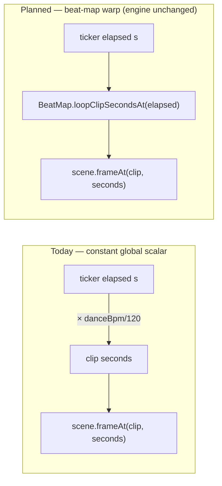
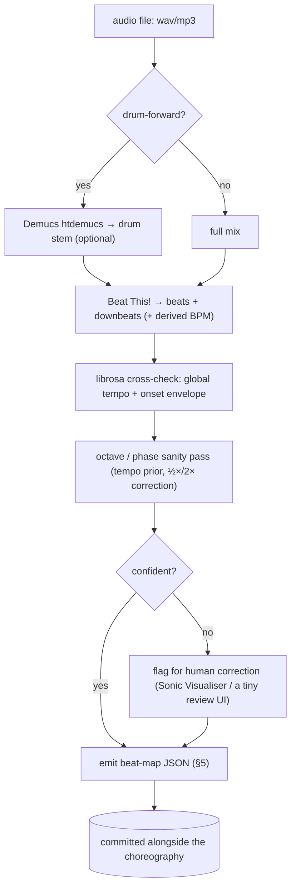

# Dance Audio Analysis — Beat Alignment & Choreography Support (Research + Plan)

**Status:** Research complete; the offline tooling (`tools/dance_audio`) and the
Dart `BeatMap` consumer are **built, tested, and committed**, and downbeat
feasibility is **verified on a real track** (rung 3 is viable). §15 plans the
first wiring (implementation deferred). This document is the landscape survey +
integration design for *audio-analysis support* of the character dance; the
movement-vocabulary / choreography work is a separate, ongoing track.
**Created:** 2026-06-27
**Owner:** main thread (synthesizing four verified web-research passes + codebase grounding)
**Scope (locked with stakeholder):** Research + plan document. Depth concentrated
on **getting the dance on-beat** (tempo / beat / downbeat tracking); the later
rungs (structure, vocals, lyrics, AI choreographer) are surveyed lighter as
"future rungs." Beat/downbeat rungs are now built (offline tool + Dart
`BeatMap`, committed); later rungs remain a lighter survey.
**Companion doc:** [`2026-06-22_bones_animation_framework.md`](./2026-06-22_bones_animation_framework.md)
(the rig/runtime framework this builds on).

---

## 1. Goal (as stated by the stakeholder)

The character engine (`lib/features/character/`) can now make a hand-rigged "cat
in a suit" trio dance an Afrobeats groove smoothly. Motion is reviewed offline by
rendering frame **film strips / contact sheets** and feeding them to a model's
image analysis — that loop works. The current weakness: alignment to a real song
is **manual**. You match a BPM slider by eye and hit play at roughly the right
moment; it looks smooth against a same-BPM track but is **not locked to the
actual beat**, and there is no good way to dial in the start offset or follow a
track whose tempo breathes.

The ask, in increasing rungs of quality:

1. **On beat (the first step).** Import a track, run an **offline analysis pass**,
   and get an annotated event list — primarily *where the beats are* — so the
   dance lands on the real beat instead of a guessed constant BPM.
2. **Richer structure.** Downbeats (the "1"), sections (intro / verse / chorus),
   and eventually vocal activity ("who is singing", mouth-open), even lyrics /
   sheet-music, to inform a full choreography.
3. **Generalize.** More dance styles beyond Afrobeats. A **movement vocabulary**
   — like a design system: *atoms* (extend a leg, flex a foot) compose into
   *molecules* (named moves: a Shaku pocket, a Gbese toe-flick), which compose
   into *organisms* (full choreographies). An **AI choreographer** assembles that
   vocabulary onto the beat grid.

Hard constraints / posture from the stakeholder:

- **Offline, authoring-time, Python is fine.** The analysis does **not** need to
  run inside the Flutter app or be triggered by Dart. It only needs to be
  available to the coding agent at the time we author a choreography. (A future
  in-app "import a track and hit play" surface is desirable but explicitly *not*
  this step — see §10 for why that distinction matters for licensing.)
- The output must be **deterministic and reviewable**, matching the engine's
  existing "same `(clip, time)` ⇒ identical pixels" discipline.

---

## 2. Where we are today (codebase grounding)

Two facts about the current implementation define the entire integration surface.

**2.1 The dance is already authored in *musical* time.**
`DancePhrase` (`lib/features/character/model/dance_phrase.dart`) addresses
choreography by **frame** over a looping phrase: `phaseOf(frame) = frame /
frameCount`. Frames map to musical counts (the README's "frame 16 right-foot
plant", "count-8 loop pickup"). Support spans, body grooves, IK target arcs and
move cues are all keyed to frames, then compiled into the engine's normalized
`0..1` phase channels. **The phrase is genre-/tempo-agnostic data on a beat
grid** — it does not know seconds. This is exactly the right shape to drive from
detected beats.

**2.2 The mapping from musical time → wall-clock seconds is a single global scalar.**
Today the demo turns BPM into a uniform time-scale and nothing more:

```dart
// character_demo.dart:46,47,173
const double kAuthoredDanceBpm = 120;   // the phrase was authored at 120 BPM
const double kDefaultDanceBpm  = 124;
final timeScale = _clip.name == CatClips.dance.name
    ? _danceBpm / kAuthoredDanceBpm     // e.g. 124/120 = 1.033×
    : 1;
// character_view.dart:175 — the ticker's elapsed time is simply scaled:
final seconds = (_offset + _elapsed).inMicroseconds / 1e6 * widget.playbackRate;
// → CharacterPainter(timeSeconds: seconds) → scene.frameAt(clip, seconds)
```

That is a **constant-tempo, zero-phase** model. Its limits are precisely the
stakeholder's pain:

- **No phase anchor.** The loop restarts at `t = 0`; there is no notion of *which
  audio beat* the phrase's frame 0 lands on, so the start offset is eyeballed.
- **Constant tempo only.** Real records (and live-feel Afrobeats especially) drift
  and push/pull; a single ratio cannot follow them, so the dance and the track
  slide apart over a verse.
- **BPM is hand-entered.** You guess it on a slider (80–240).



**The central design move:** replace the scalar `× playbackRate` with a
**beat-map warp** that converts wall-clock time → clip seconds such that the
phrase's beat grid lands on the *detected* beat times. Everything inside
`frameAt` — clip evaluation, IK, contact pinning, head stabilization, the
byte-identical film-strip property — stays **untouched**; we only warp the time
that goes in. (Determinism is preserved because the beat map is a fixed data
artifact, not a live clock.)

---

## 3. The bridge concept: a beat grid / beat map

Every system that aligns musical time (bars/beats/counts) to wall-clock audio
time when tempo is **not** constant uses the same idea — DAW *warp markers*
(Ableton: "everything between two warp markers is time-stretched to fit"
[[Ableton manual]](https://www.ableton.com/en/manual/audio-clips-tempo-and-warping/)),
rhythm-game timing maps (osu! `TimingPoints`, StepMania `OFFSET`/`BPMS`/`STOPS`
[[osu!]](https://osu.ppy.sh/wiki/en/Client/File_formats/osu_(file_format)) ·
[[StepMania]](https://github.com/stepmania/stepmania/wiki/sm)): a list of
**anchors** `(musical position, time in seconds)` plus a rule to interpolate
between them.

For us the anchors are simply the **detected beat timestamps**. Author in beat
space; warp by piecewise-linear interpolation over those anchors:

```
# seconds for a (possibly fractional) beat index b, with b_i <= b < b_{i+1}
t(b) = t_i + (b - b_i) · (t_{i+1} - t_i) / (b_{i+1} - b_i)

# inverse — musical position for a wall-clock time t (for "where are we now")
b(t) = b_i + (t - t_i) · (b_{i+1} - b_i) / (t_{i+1} - t_i)
```

Because each inter-beat interval carries its own local tempo, the warp **absorbs
drift and expressive timing for free**. A phrase accent authored "on count 4"
fires at the *measured* time of that beat, even if the track sped up. Downbeats
let a multi-bar loop align its bar phase (the "1").

This is the same maths the foot-lock locomotion table already does in
`character_scene.dart` (`_LocoTable` is a precomputed phase→offset curve with
linear interpolation between samples) — so the pattern is idiomatic to this
codebase, not foreign.

---

## 4. Tooling landscape (concentrated on beat / downbeat)

All claims below were verified in this pass against primary sources (GitHub
`LICENSE` files, PyPI, arXiv/ISMIR PDFs). License and maintenance are called out
because two of the historically "best" tools are traps.

### 4.1 Recommended stack

| Role | Pick | Why |
|---|---|---|
| **Beat + downbeat workhorse** | **Beat This!** (`beat-this`, CPJKU, ISMIR 2024) | Only current top-tier *joint beat+downbeat* tracker with **MIT on both code and weights**, clean `pip install beat-this`, transformer, no madmom in the default path. `File2Beats(...)(audio) → (beats, downbeats)` in seconds. [[repo]](https://github.com/CPJKU/beat_this) [[paper]](https://arxiv.org/abs/2407.21658) |
| **DSP fallback / utilities** | **librosa** (ISC) | Pure-Python, always installs (3.8–3.13). `beat.beat_track`, `beat.plp` (better under varying tempo), `onset.*`, `segment.*`. Global tempo + onsets + a sanity cross-check. **No downbeats.** [[docs]](https://librosa.org/doc/main/generated/librosa.beat.beat_track.html) |
| **Pre-process (optional)** | **Demucs `htdemucs`** (MIT) | Separate the **drum stem** and track beats on it — drum-forward dance music gives a cleaner onset signal; stem-aware tracking measurably lifts downbeat accuracy. Also the feedstock for the future vocal rungs (§9). ~9 dB MUSDB SDR, CPU-runnable. [[repo]](https://github.com/adefossez/demucs) |
| **Structure (optional, later)** | **All-In-One** (`allin1`, MIT code) | One model → beats + downbeats + tempo + **functional segments** (intro/verse/chorus). Worth it only when you want sections; heavy install (NATTEN + Demucs + madmom-from-git). [[repo]](https://github.com/mir-aidj/all-in-one) |

### 4.2 Avoid / handle with care

- **madmom** (`DBNDownBeatTrackingProcessor`) — long the SOTA reference, but: its
  **code is BSD while the pretrained models it cannot run without are CC BY-NC-SA
  4.0 — NonCommercial *and* ShareAlike** (the `LICENSE` explicitly includes
  pickled Processors and says commercial use needs written permission from G.
  Widmer) [[LICENSE]](https://github.com/CPJKU/madmom/blob/main/LICENSE). NC is a
  *different axis* from copyleft — being OK with GPL does **not** clear it. Its
  PyPI build (0.16.1, 2018) is also broken on Python 3.10+ / NumPy ≥1.24; only
  the unreleased git `main` works. **Anything that hard-depends on it inherits the
  trap: BeatNet, and All-In-One.** Fine for purely personal/non-commercial
  authoring; a landmine if beat detection ever ships in a commercial/non-free app.
- **aubio** — GPL-3.0, stale since 2019, broken on Python 3.12+, classic-DSP
  accuracy below librosa. No reason to choose it.
- **Essentia** (AGPLv3 + paid commercial), **tempocnn** (AGPL-3.0) — acceptable to
  *run as offline build tooling* (copyleft attaches to distributing the tool's
  source, not to the beat-annotation data it emits), but flag for any in-app use.

### 4.3 Accuracy gotchas that matter for "on-beat" (must design around)

- **Tempo octave / half-double errors.** The classic failure: the tracker locks to
  ½ or 2× the true BPM. Catastrophic for a dancer (half-time ⇒ hits every *other*
  beat). This is why benchmarks report octave-tolerant *Accuracy2* far above
  *Accuracy1*. **Mitigate:** pass a tight tempo prior / expected BPM range; the
  madmom DBN's 55-BPM floor is a known forcer of double-time on slow tracks. Cross-
  check two estimators and correct ½×/2× consistency.
- **Downbeat phase ambiguity ("which beat is 1").** Even with the right beat
  *period*, the bar phase is often off by 1–3 beats; downbeat F-measure is always
  well below beat F-measure (Beat This! GTZAN: **89.1 beat vs 78.3 downbeat**).
  For "land the big hit on the 1," budget a correction/QA step.
- **Afrobeats / syncopation is the real risk.** Every standard benchmark (GTZAN,
  Ballroom, Harmonix) is Western, 4/4, stable-tempo. On the syncopated *Salsa*
  set, baseline trackers drop to ~0.66 F-measure vs ~0.95 on Ballroom
  [[TISMIR]](https://transactions.ismir.net/articles/10.5334/tismir.183). There is
  **no established West-African/Afrobeats beat benchmark.** Beat This! is the best
  starting point (most genre-diverse training; Candombe 99.7/99.7) but **do not
  assume the ~0.9 numbers transfer** — keep a human-correctable annotation step.
- **DBN-free continuity.** Beat This! trades a slightly lower *continuity*
  (CMLt/AMLt) for its high F-measure; for long loops, light post-processing to
  enforce a locally-constant beat period removes isolated phase slips.

### 4.4 "How well is it aligned?" — the metrics to report

Use `mir_eval.beat` [[src]](https://github.com/craffel/mir_eval/blob/master/mir_eval/beat.py).
The two numbers worth quoting:

- **F-measure (±70 ms window)** — fraction of beats in the right place; the
  intuitive "the dance hits the beat" number.
- **CMLt / CMLc** (Correct Metrical Level, total / longest-continuous) — "stayed
  at the right tempo and phase." For a loop that must not drift, CMLt matters more
  than F-measure; CMLc predicts how long it stays glued before a visible slip. A
  high AMLt but low CMLt ⇒ locked to half/double time or the off-beat.

---

## 5. The data contract: a beat-map artifact

This JSON is the **interface between the Python analysis and the Dart
authoring/runtime**. It is the single deliverable of the offline pass; everything
in Dart consumes it and nothing else. Designed so `beats[]` is the source of
truth (mirrors `mir_eval` arrays and JAMS `beat` observations) and the rest is a
derived convenience cache.

```jsonc
{
  "schema_version": "1.0",
  "audio": { "path": "soso.wav", "duration_sec": 212.48, "sample_rate": 44100 },
  "analysis": {
    "tracker": "beat_this@1.1 (no-dbn) + demucs htdemucs drum stem",
    "created_utc": "2026-06-27T12:00:00Z",
    "human_corrected": false            // set true once a human fixes phase/octave
  },

  "tempo": {
    "global_bpm": 124.0,                // representative/median tempo
    "is_variable": true,               // false ⇒ a single constant tempo suffices
    "bpm_min": 122.1, "bpm_max": 126.4,
    "confidence": 0.93
  },
  "time_signature": { "numerator": 4, "denominator": 4, "is_constant": true },

  // Authoritative anchors: one row per detected beat. THIS is the beat grid.
  "beats": [
    { "index": 0, "time_sec": 0.182, "beat_in_bar": 1, "is_downbeat": true,  "confidence": 0.97 },
    { "index": 1, "time_sec": 0.665, "beat_in_bar": 2, "is_downbeat": false, "confidence": 0.95 },
    { "index": 2, "time_sec": 1.148, "beat_in_bar": 3, "is_downbeat": false, "confidence": 0.94 },
    { "index": 3, "time_sec": 1.632, "beat_in_bar": 4, "is_downbeat": false, "confidence": 0.96 },
    { "index": 4, "time_sec": 2.115, "beat_in_bar": 1, "is_downbeat": true,  "confidence": 0.97 }
    // … one entry per beat for the whole track
  ],

  // Derived convenience (piecewise-constant tempo, osu!/StepMania style).
  "tempo_segments": [
    { "start_beat": 0,  "start_time_sec": 0.182, "bpm": 124.0 },
    { "start_beat": 64, "start_time_sec": 31.15, "bpm": 122.1 }
  ],
  "offset_sec": 0.182,                  // time of beat 0 (StepMania #OFFSET analogue)
  "downbeats_sec": [0.182, 2.115, 4.048],

  // How an authored loop maps onto this track.
  "loop": {
    "length_beats": 8,                 // the DancePhrase loop spans N beats (here 2 bars of 4/4)
    "anchor_downbeat_index": 0         // which detected downbeat the phrase's frame 0 lands on
  },

  // ---- Later rungs populate these (all optional; absent ⇒ rung not run) ----
  "onsets":   [ { "time_sec": 0.182, "strength": 0.91 } ],         // accents
  "sections": [ { "start_sec": 0.0, "end_sec": 31.1, "label": "intro" } ],
  "energy":   { "hop_sec": 0.10, "rms": [/* normalized 0..1 over time */] },
  "vocal_activity": [ { "start_sec": 14.2, "end_sec": 21.7 } ]      // lead-vocal present
}
```

Notes baked in from the research: `confidence` per beat lets the runtime **hold
tempo through low-confidence regions** instead of snapping (the SMC "confidently
wrong" failure mode); `is_downbeat`/`beat_in_bar` carry the bar phase;
`is_variable` lets a consumer short-circuit to a single-BPM path.

---

## 6. The offline pipeline (Python, authoring-time)

A small, self-contained tool — a `tool/dance_audio/` script set or a sibling repo
— invoked by the coding agent, **not** by Flutter. It takes an audio file and
emits the §5 JSON.



Design points:

- **One workhorse + one cross-check.** Beat This! for beats/downbeats; librosa for
  a global-tempo and onset-strength second opinion to catch octave errors.
- **Tempo prior in, every time.** When the BPM is known (producer tag, DJ data, or
  the librosa estimate), pass a tight range to collapse the octave-error space.
- **Human-correctable by construction.** The schema's `human_corrected` flag and
  Sonic-Visualiser-compatible beat TSV (Beat This! emits this) make the manual
  fix a first-class, low-friction step rather than a fallback. For Afrobeats this
  is not optional polish — it is the safety net for an unbenchmarked genre.
- **Deterministic outputs.** Same audio + same tool version ⇒ same JSON; commit
  the JSON next to the choreography so reviews and film strips are reproducible.

---

## 7. Integration with the engine (minimal, deterministic)

The entire integration is "warp the input time"; no change to `frameAt` or any
solver. A small immutable `BeatMap` (parsed from the §5 JSON) plus a clock that
maps wall-clock elapsed → clip seconds.

```dart
// Illustrative — model/ layer, pure Dart, no Flutter.
class BeatMap {
  const BeatMap({required this.beatTimesSec, required this.loopLengthBeats,
                 required this.anchorBeatIndex});
  final List<double> beatTimesSec;   // detected beat anchors (the grid)
  final int loopLengthBeats;         // how many beats the DancePhrase loop spans
  final int anchorBeatIndex;         // which beat the phrase's frame 0 lands on

  /// Wall-clock seconds → musical beat position (piecewise-linear over anchors).
  double beatAt(double tSec) { /* invert the §3 t(b) map */ }

  /// Wall-clock seconds → CLIP seconds, so the loop's beat grid lands on the
  /// detected beats. Replaces the constant `× playbackRate` scalar. The clip
  /// stays authored in its own normalized time; we phase-warp into it.
  double clipSecondsAt(double tSec, {required double clipDuration}) {
    final beat = beatAt(tSec) - anchorBeatIndex;
    final loopPhase = (beat / loopLengthBeats) % 1.0;   // 0..1 within the loop
    return loopPhase * clipDuration;
  }
}
```

`CharacterView` then computes `timeSeconds` from `BeatMap.clipSecondsAt(elapsed,
…)` instead of `elapsed × playbackRate` when a beat map is supplied; with no beat
map it falls back to today's scalar (so existing demo/tests are unaffected).
Because `clipSecondsAt` is a pure function of the (fixed) beat map, the
film-strip "byte-identical renders" invariant holds: a given beat map yields a
deterministic time-warp, and you can even *render the strip on the beat grid*
(one cell per beat/subdivision) to review on-beat poses directly.

What this unlocks immediately:

- **Auto start-offset** (the manual-hit-play pain): `anchorBeatIndex` pins frame 0
  to a real downbeat.
- **Tempo that breathes:** the loop follows the track through drift.
- **Bar-correct hits:** downbeats align the phrase's "1".

What it deliberately does **not** change: the choreography content, the IK,
contact pinning, the backdrop, or the review harness.

---

## 8. The quality ladder (phased rollout)

```mermaid
stateDiagram-v2
  [*] --> R0
  R0: Rung 0 — manual BPM slider (today)
  R1: Rung 1 — offline beat detect → auto BPM + phase offset (still constant tempo)
  R2: Rung 2 — full beat-map warp (variable tempo; accents land on real beats)
  R3: Rung 3 — downbeats → multi-bar / bar-phase-correct loops
  R4: Rung 4 — structure + energy → choreography blocks & intensity (Effort) layer
  R5: Rung 5 — source separation + vocal activity → mouth-open / featured dancer
  R6: Rung 6 — AI choreographer assembles the movement vocabulary on the grid
  R0 --> R1 --> R2 --> R3 --> R4 --> R5 --> R6
```

| Rung | Adds | Tooling | Dart change | Effort |
|---|---|---|---|---|
| **0** | manual BPM (today) | — | — | done |
| **1** | auto BPM + start offset (constant tempo, auto-aligned) | Beat This! / librosa | parse `tempo` + `offset_sec`; set `anchorBeatIndex` | **S** |
| **2** | variable-tempo warp; on-beat through drift | Beat This! beats[] | `BeatMap.clipSecondsAt` (§7) | **S–M** |
| **3** | bar-phase correctness; multi-bar loops | Beat This! downbeats | use `is_downbeat`/`loop.length_beats` | **S** |
| **4** | per-section routines; intensity follows energy | All-In-One or librosa.segment; RMS | section→active-move-set; energy→Effort knobs | **M** |
| **5** | mouth-open, lead-vs-background | Demucs vocal stem → Silero VAD / RMS gate | drive face + featured dancer | **M** |
| **6** | audio-driven choreography from a vocabulary | the "music map" (§5) + vocabulary | the choreographer (separate track) | **L** |

Rungs 1–3 are the stakeholder's "first step" and are cheap because the phrase is
already beat-gridded. Rungs 4–6 are the "future" survey.

---

## 9. Later rungs — lighter survey

**Structure segmentation (Rung 4).** `allin1` is the only surveyed tool emitting
*functional* labels (intro/verse/chorus/…); `librosa.segment` (ISC, actively
maintained) gives boundary times + anonymous A/B/C clusters as a dependency-free
fallback. Section boundaries → top-level **choreography blocks** ("switch routine
at the chorus, build through the bridge"). An **energy/RMS envelope** (trivial in
librosa) → the **Effort/intensity layer** (§11) that modulates *how* a move is
performed, not *which* move.

**Source separation + vocal activity (Rung 5).** **Demucs `htdemucs`** (MIT,
~9 dB SDR, CPU-runnable) is the quality leader and does double duty: its **drum
stem** cleans beat tracking, its **vocal stem** feeds vocal detection. Important
caveat: there is **no mature pip-installable *singing*-VAD** — general VADs are
speech-tuned and transfer poorly (inaSpeechSegmenter literally tags singing as
"music"). The robust path is **Demucs vocal stem → RMS energy gate** (peer-
reviewed: separate-then-detect beats prior SOTA on polyphonic music), optionally
**Silero VAD** (MIT) on the stem. Output → mouth-open and "featured (singing)
dancer vs background."

**Lyrics / visemes (Rung 5+).** A layered pipeline, not one tool: **WhisperX**
(BSD-2, word timestamps, no transcript needed) for timed lyrics;
**Rhubarb Lip Sync** (MIT) for audio→viseme mouth shapes (Preston Blair A–H+X) —
note its decoupled `shape-id → artwork` mapping is exactly the indirection we'd
want. Both degrade on sung vocals; **AutoLyrixAlign** is the only singing-aware
aligner but is GPL-3.0 frozen research code. Treat as research, not near-term.

---

## 10. Licensing & deployment posture

The stakeholder's "offline, authoring-time, not in the app" framing is the load-
bearing constraint and it is *favourable*:

- **Running GPL/AGPL tools as build tooling is fine.** Copyleft attaches to
  distributing the *tool's* source, not to the **beat-annotation data** they emit.
  So Essentia (AGPL), aubio (GPL), tempocnn (AGPL) are acceptable to *run* offline.
- **NonCommercial is a separate axis.** madmom's CC BY-NC-SA models are
  *NonCommercial* — accepting GPL does **not** clear them, and "technology which
  utilises them in a commercial product" plausibly includes baking their beat
  annotations into a shipped app. For personal/non-commercial authoring: fine. For
  anything that ships commercially: avoid madmom (and its dependents BeatNet,
  All-In-One).
- **The one tool that travels into the product cleanly is Beat This! (MIT, code +
  weights).** If, later, beat detection moves *inside* the app, it is the only
  surveyed top-tier tracker with no license obstacle — another reason to make it
  the workhorse now.

**Recommendation:** standardize on **Beat This! + librosa + Demucs (all
MIT/ISC)** for the core path; reach for AGPL/madmom-bound tools only as offline
cross-checks, never as the shipping path.

---

## 11. Connecting audio analysis to the movement vocabulary

The vocabulary itself is a separate, ongoing track; this plan only defines **what
audio data the choreographer consumes** and how the existing model already maps
to the atoms/molecules/organisms idea. The prior-art research (AIST++/Bailando/
EDGE/ChoreoMaster, Laban/Eshkol-Wachman notation, game-dev motion graphs,
rhythm-game beatmaps, Rhubarb/JALI lip-sync) converges on a small set of
transferable patterns:

1. **Beat grid is the authoritative timeline.** A choreography = a beatmap:
   `(beat-index, move-id, params)` events on a tempo grid, tempo changes via
   timing points. (osu!, ChoreoMaster.) — *We already have the grid (DancePhrase
   frames) and §7 gives it real beat times.*
2. **Authored discrete vocabulary, not learned.** Atoms = per-limb angle-over-beat
   (an Eshkol-Wachman "limb × time" cell — our `DanceJointKey`/`DanceJointAccent`);
   molecules = named beat-quantized moves (our `DanceMoveCue` + `DanceMoveSignature`,
   "Shaku pocket", "Gbese toe-flick"); organisms = choreographies (our `DancePhrase`
   + `DanceRoleStyle`). Bailando validates the structure; we *author* the codebook
   rather than learning it via VQ-VAE.
3. **Body-channel split + additive layering.** Independent upper / lower /
   root(locomotion) streams compose simultaneously. *We already do this* —
   `LayeredJointChannel` / `LayeredRootChannel` / `LayeredIkTargetChannel` are
   exactly this; Bailando uses separate upper/lower codebooks + a velocity branch
   for the same reason.
4. **Move graph + rule-based path search as the "AI choreographer."** Nodes =
   moves, edges = legal beat-aligned transitions; pick a path whose accents land
   on the grid and whose style tags fit the section. Deterministic, art-directable —
   *retrieval/assembly, not generation* (ChoreoMaster, motion graphs). This suits
   a hand-authored rig with tens of moves far better than a generative net.
5. **Beat = velocity minimum, aligned to music beats.** AIST++'s **Beat Alignment
   Score** defines a "motion beat" as a local minimum of joint velocity (a
   momentary hold/accent) and scores how well those land on music beats. This is
   both an authoring rule ("land a stop on the beat") *and* a free automated QA
   metric for us (see §12).
6. **Effort layer separate from move identity.** Laban's Weight/Time/Flow (and
   JALI's parameterized visemes) → continuous knobs (sharp↔smooth, heavy↔light)
   that modulate amplitude/easing without changing which move it is. The §9 energy
   envelope feeds this.
7. **Symbolic-id → rig indirection + `{start,end,id}` timeline** (Rhubarb): the
   sequencer emits move-ids; a mapping layer binds ids to actual rig poses.

The **music features the choreographer consumes** are therefore *not* 35-dim
librosa stacks or Jukebox embeddings (those exist to let *learned* models
synthesize novel motion). They are the **sparse symbolic "music map" of §5**: beat
grid + downbeats + onset accents + section markers + an energy envelope — human-
readable, deterministic, art-directable. That is precisely what a graph/rule-based
choreographer needs, and it is the same artifact rungs 1–5 already build.

---

## 12. Validation — "how well aligned is it?"

We can measure alignment without leaving the existing review discipline:

- **Music beats** come from the §5 beat map.
- **Motion beats** = local minima of bone velocity, which the existing
  `TemporalMotionAnalyzer` (`runtime/temporal_motion_analyzer.dart`) already has
  the machinery to find — it records per-bone frame-to-frame displacement and
  acceleration over resolved frames. Extract velocity minima (e.g. on the support
  foot / COM) as motion beats.
- **Beat Alignment Score** (AIST++ formula) and `mir_eval`-style **F-measure /
  CMLt** between motion beats and music beats become a numeric, regression-testable
  "the dance lands on the beat" score — complementing the film-strip eyeball pass.
  Render film strips **on the beat grid** (one cell per beat) so reviewers see the
  on-beat pose directly.

---

## 13. Risks & open questions

- **Afrobeats accuracy is unproven.** No genre benchmark exists; budget for the
  human-correction step (§6) and consider a small hand-labelled validation set of
  the tracks you actually author to.
- **Downbeat phase** will sometimes be wrong even when the beat period is right;
  the "land the hit on the 1" rung (3) needs a correction/QA pass.
- **Loop ↔ track length mismatch.** A short phrase tiled across a long track needs
  a rule for non-integer bar counts and for section changes (rung 4).
- **In-app future.** If "import a track + hit play" ever moves on-device, the
  analysis must precompute to the §5 JSON at import (not real-time), and only
  MIT-licensed tooling (Beat This!) may travel into the app. This plan keeps the
  data contract identical for offline and future on-device, so that move is a
  packaging change, not a redesign.
- **Determinism vs. live audio.** The beat map is a fixed artifact; do not drive
  the warp from a live-decoded audio clock or the film-strip byte-identical
  invariant breaks. Precompute, commit, replay.

---

## 14. Recommended first concrete step

Smallest end-to-end slice that proves the whole spine (rungs 1–3 on one track):

1. **Stand up the offline tool** (`tool/dance_audio/`): `audio → Beat This!
   (+ librosa cross-check) → §5 beat-map JSON`, with a tempo prior and the
   `human_corrected` flag. Optionally Demucs drum-stem pre-pass.
2. **Define `BeatMap` in Dart** (`model/`) + `clipSecondsAt` (§7), with the no-map
   fallback to today's scalar so nothing existing breaks.
3. **Wire `CharacterView`** to use the beat map when present; keep the demo's BPM
   slider as the no-map path.
4. **Validate on one Afrobeats track** (e.g. the "soso" reference): generate the
   beat map, drive the existing trio, and report **BAS + F-measure/CMLt** (§12)
   plus an on-beat-grid film strip. That gives a real "how aligned is it" number
   instead of an eyeball.

This is deliberately the same shape the stakeholder asked for — "crunch the audio,
then see how well it's aligned" — and it leaves the choreography/vocabulary track
free to build on the §5 music map.

---

## 15. Integration plan — first wiring (beat-sync a 30s segment, looped phrase)

**Status (2026-06-27):** downbeat detection verified on a real Afrobeats track
(120 BPM, 4/4, downbeats 99% regular, no octave error) → rung 3 is viable. Dance
choreography dev is on halt at the current phrase (the recent commits are pure
`tune(character)` tweaks, no architectural impact). This is the first wiring.

### 15.1 Scope ("for now", per stakeholder)

- Sync the dance to the track's **beats/downbeats**.
- **Loop the single 32-frame `DancePhrase`** continuously until the segment ends —
  no per-section choreography yet (that is rung 4).
- Only a **30-second segment from the middle** of a song.

### 15.2 The fact that pins everything: the loop is 12 beats

`CatClips.dance` has `duration: 6` s and is authored at `kAuthoredDanceBpm = 120`,
so one loop = 6 s × 120/60 = **12 beats = 3 bars of 4/4** at the authored tempo.
(The 32 `frameCount` is the *addressing granularity*, not the beat count; the
character README's older "2 bars" note predates the current 12-count groove.)
Hence the loop binding is:

```dart
final binding = BeatLoopBinding.barAligned(beatMap, bars: 3); // loopLengthBeats = 12
```

Each loop spans exactly 3 bars and re-anchors frame 0 on a real downbeat.

### 15.3 The clock: drive the dance from the audio position

Today the dance time is a free-running ticker × a constant scalar. Beat-sync
requires the dance phase to be a function of **where the audio actually is**, so
the two can never drift apart:


A `Ticker` still drives 60 fps repaints, but each frame it **reads the player
position** instead of accumulating its own elapsed. `clipSecondsAt` warps that
position onto the detected beats (drift-following) and loops via its own modulo —
so the phrase repeats on-beat for the whole segment with no extra loop logic.

The project already ships **`media_kit`** (`pubspec.yaml`), so playback +
`position` need no new dependency.

### 15.4 The 30-second segment (offline)

Cut and analyse the window offline so the beat map is **relative to the segment**
(t = 0 at the segment start):

- Add `--start SEC --duration SEC` to `analyze.py` (`librosa.load` already takes
  `offset` / `duration`); emit a beat map for the 30 s window.
- Export the matching 30 s audio clip for the demo to play (ffmpeg, or the same
  trimmed decode). Original artwork → kept local, **gitignored, never committed**.
- **Seamless-loop refinement:** choose the window to start on a detected
  **downbeat** and span a whole number of 3-bar phrases (e.g. 15 bars ≈ 30 s at
  120 BPM = 5 phrases). Then both the audio-segment loop and the phrase loop stay
  phase-aligned across the segment seam. An arbitrary 30 s is fine for a first
  pass (minor seam at the wrap).

### 15.5 Where it lives (additive)

No change to the `frameAt` pipeline. Keep it additive:

- New dev surface `demo/character_dance_to_track_demo.dart`: a small stateful
  widget that owns a `media_kit` `Player`, loads the 30 s clip + its beat-map JSON
  from local paths, and paints via `CharacterPainter` directly, feeding
  `timeSeconds = beatMap.clipSecondsAt(player.position, …)`.
- It replicates the small backdrop-asset/ticker setup `CharacterView` does (or, if
  preferred later, add one optional `timeSecondsOverride` parameter to
  `CharacterView` — a minimal opt-in change to an existing file).

### 15.6 Determinism note

The live, audio-synced view is driven by a real-time audio clock, so it is **not**
byte-deterministic like the film strip (position jitters frame to frame) — that is
expected for live playback. The beat-map artifact and the offline frame-rendering
path stay deterministic (render at fixed `clipSeconds` for review).

### 15.7 Steps

1. `analyze.py`: add `--start/--duration`; produce a 30 s segment beat map (+ tests).
2. Cut the 30 s clip; pick the start on a downbeat spanning whole phrases.
3. New `demo/character_dance_to_track_demo.dart`: media_kit player + `BeatMap`
   clock + `CharacterPainter`, `BeatLoopBinding.barAligned(map, bars: 3)`.
4. Manual check: play the 30 s, confirm the phrase lands on the beat and
   re-anchors on downbeats; nudge the anchor if the "1" is off (downbeat phase is
   the least-reliable output).
5. (Optional, rung-3 validation) BAS: motion beats (velocity minima via
   `TemporalMotionAnalyzer`) vs the music beats.

## 15.8 Shipped beyond the first wiring (status)

The demo grew past the 30 s segment: it loops the phrase **beat-locked over the
whole track**, switches **dance ↔ idle by section energy**, shows **karaoke
captions**, and **lip-syncs the trio**.

- **Beats/structure (rungs 3–4):** full-track beat map + `sections[]` drive the
  loop and the dance/idle switch.
- **Vocals/lyrics (rung 5):** `transcribe.py --lyrics` force-aligns provided
  lyrics (lead/background + section tags) on a Demucs vocal stem.
- **Lip-sync (rung 5b):** `lipsync.py` runs **Rhubarb Lip Sync** (built natively
  from source for ARM64) over the vocal stem → a mouth-shape cue track. The demo
  maps each cue to a singing viseme (`singAh/Oh/Ee`, `teethOnLip`) with a real
  jaw drop, gated by the lyric voice tags (frontman = lead, backups = ad-libs /
  group hooks), with the head bobbing on the beat and dipping into loud
  syllables (`CharacterPainter.singingHeadMotion`). A 3-expert panel (lip-sync /
  vocal / animation), judging frames of the actual composition, rated it **9/10
  across all three**. See the `dance-lipsync` skill and `lib/features/character`.

## 16. Sources (verified this pass)

**Beat / downbeat / tempo:** Beat This! [[repo]](https://github.com/CPJKU/beat_this)
[[arXiv:2407.21658]](https://arxiv.org/abs/2407.21658) ·
librosa [[beat_track]](https://librosa.org/doc/main/generated/librosa.beat.beat_track.html) ·
madmom license trap [[LICENSE]](https://github.com/CPJKU/madmom/blob/main/LICENSE) ·
All-In-One [[repo]](https://github.com/mir-aidj/all-in-one) [[arXiv:2307.16425]](https://arxiv.org/abs/2307.16425) ·
syncopation gap [[Salsa/TISMIR]](https://transactions.ismir.net/articles/10.5334/tismir.183) ·
SMC failure-mode analysis (octave/continuity/55-BPM) [[arXiv:2605.12287]](https://arxiv.org/html/2605.12287v1) ·
mir_eval beat metrics [[src]](https://github.com/craffel/mir_eval/blob/master/mir_eval/beat.py) [[paper]](https://brianmcfee.net/papers/ismir2014_mireval.pdf).

**Stem demixing helps beat tracking:** Beat Transformer [[arXiv:2209.07140]](https://arxiv.org/pdf/2209.07140) ·
Drum-Aware Ensemble [[arXiv:2106.08685]](https://arxiv.org/pdf/2106.08685).

**Tempo-map / beat-grid representation:** Ableton warp markers [[manual]](https://www.ableton.com/en/manual/audio-clips-tempo-and-warping/) ·
osu! TimingPoints [[wiki]](https://osu.ppy.sh/wiki/en/Client/File_formats/osu_(file_format)) ·
StepMania OFFSET/BPMS/STOPS [[wiki]](https://github.com/stepmania/stepmania/wiki/sm) ·
JAMS [[repo]](https://github.com/marl/jams).

**Structure / separation / vocal / lyrics:** librosa.segment [[docs]](https://librosa.org/doc/main/segment.html) ·
MSAF [[repo]](https://github.com/urinieto/msaf) ·
Demucs [[repo]](https://github.com/adefossez/demucs) ·
Spleeter [[repo]](https://github.com/deezer/spleeter) ·
Silero VAD [[repo]](https://github.com/snakers4/silero-vad) ·
inaSpeechSegmenter [[repo]](https://github.com/ina-foss/inaSpeechSegmenter) ·
WhisperX [[repo]](https://github.com/m-bain/whisperX) ·
MFA [[repo]](https://github.com/MontrealCorpusTools/Montreal-Forced-Aligner) ·
Rhubarb Lip Sync [[repo]](https://github.com/DanielSWolf/rhubarb-lip-sync).

**Choreography / vocabulary prior art:** AIST++/FACT (Beat Alignment Score) [[paper]](https://ar5iv.labs.arxiv.org/html/2101.08779) ·
Bailando (choreographic memory / discrete units) [[arXiv:2203.13055]](https://arxiv.org/abs/2203.13055) ·
EDGE (editable, clip-stitching, PFC) [[arXiv:2211.10658]](https://ar5iv.labs.arxiv.org/html/2211.10658) ·
ChoreoMaster (graph-based, beat-aligned) [[paper]](https://netease-gameai.github.io/ChoreoMaster/Paper.pdf) ·
Laban Movement Analysis [[overview]](https://en.wikipedia.org/wiki/Laban_movement_analysis) ·
Eshkol-Wachman notation [[overview]](https://en.wikipedia.org/wiki/Eshkol-Wachman_movement_notation) ·
motion matching / graphs [[Game Anim]](https://www.gameanim.com/2016/05/03/motion-matching-ubisofts-honor/) ·
JALI [[project]](https://www.dgp.toronto.edu/~karan/jali/).

> Honesty flags carried from research: the SMC arXiv id parses as a mid-2026
> preprint (treat percentages as preprint-grade); "naive separated-audio into a
> mixture-trained tracker helps" is likely-but-not-isolated-proven (the strong
> evidence is for *stem-aware* trackers); no published singing-vs-speech VAD
> accuracy numbers exist; JAMS `beat_position` field names not re-verified this
> pass. None of these change the recommendations.
