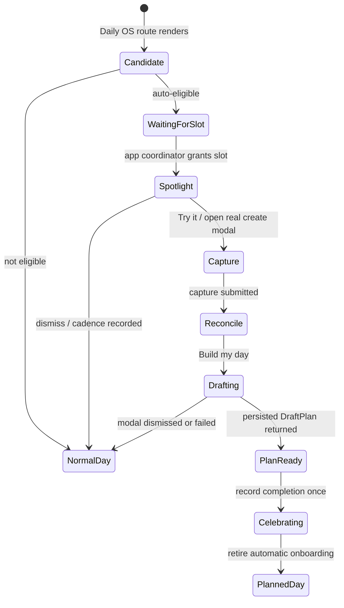
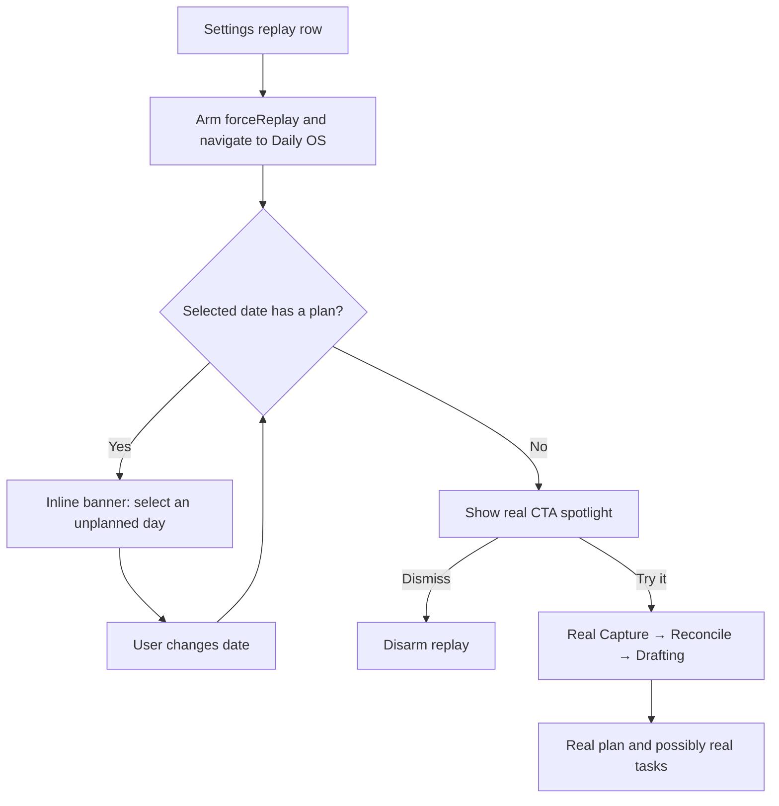

# Daily OS onboarding — teach the real check-in ritual

_2026-07-09 · revised 2026-07-10 after architecture review_

## Context

Lotti already has two onboarding surfaces, and neither teaches Daily OS Next:

1. **The general FTUE** (`lib/features/onboarding/`) teaches provider setup,
   recording, category selection, and a first structured task. Its payoff lands
   on a real `TaskDetailsPage`; it intentionally does not hand off to Daily OS.
2. **Daily OS Next's existing coachmarks**
   (`DailyOsPreferencesController.timelineGesturesLearned` and
   `dayFooterHintRetired`) explain gestures after a plan exists. They do not
   explain what the empty Day surface's mic CTA starts.

A first-time Daily OS user therefore sees a real but unexplained empty
`DayPage`: tracked time, `hasPlan: false`, and one "Speak a check-in" action.
The product model behind that action — Capture → Reconcile → Drafting — remains
invisible until the user tries it.

The original version of this plan proposed two separate onboarding moments:
first create a task, then create a day plan. That split does **not** match the
runtime architecture. Reconcile only chooses the items that should be placed;
new tasks are materialized by `create_task_from_phrase` during the Drafting
wake, and that same wake must finish with `draft_day_plan`. A successful real
flow therefore creates any new tasks and the day plan in one agent wake and
one user-facing ritual.

This revision teaches the two payoffs as **two narrated beats inside one real
walkthrough**, not as two visits with mutually incompatible data gates:

- **Beat 1 — turn speech into action:** Capture and Reconcile show how a check-in
  becomes structured, selectable work. Copy is careful not to claim a task
  already exists at Reconcile.
- **Beat 2 — build the day:** Drafting materializes approved new items as real
  tasks where needed and persists the complete `DraftPlan`. Completion copy can
  mention newly created tasks only when the implementation has verified them.

## Goals

- Teach the existing `DayPlanningCreate` ritual in the live Daily OS UI.
- Preserve one obvious action at every beat and a quiet way to hide coaching.
- Never replay a synthetic capture, task, or plan.
- Auto-show only to genuinely new Daily OS users on today's empty Day surface.
- Sequence behind every higher-priority auto-shown modal.
- Measure the Daily OS funnel without changing the meaning of the general FTUE
  funnel.
- Provide a replay path whose navigation, prerequisites, and side effects are
  explicit.

## Non-goals

- A second full-screen FTUE.
- A task-only variant of the Daily OS agent workflow.
- Teaching timeline gestures, refine, commit, or shutdown; existing coaching
  owns those later concepts.
- Automatically onboarding existing Daily OS dogfood users in v1.
- Making replay non-mutating. Replay uses the real workflow and says so before
  the user starts it.

## Existing building blocks

| Piece | File | Role in this plan |
|---|---|---|
| Empty Day surface and check-in CTA | `lib/features/daily_os_next/ui/pages/day_page.dart` | Hosts the only anchored spotlight. |
| Create modal | `lib/features/daily_os_next/ui/pages/day_planning_modal.dart` | Runs the real Capture → Reconcile → Drafting ritual. |
| Capture and Reconcile controllers | `lib/features/daily_os_next/state/` | Supply real stage state; onboarding does not fork their behavior. |
| Drafting controller | `lib/features/daily_os_next/state/drafting_controller.dart` | Supplies the only authoritative plan-ready signal. |
| `create_task_from_phrase` | `lib/features/daily_os_next/agents/service/day_agent_capture_service_tools.dart` | Materializes approved new capture items during Drafting. |
| `draft_day_plan` path | `lib/features/daily_os_next/agents/service/day_agent_plan_service.dart` | Persists the plan that completes the walkthrough. |
| `DailyOsPreferencesController` | `lib/features/daily_os_next/state/daily_os_preferences_controller.dart` | Precedent for `SettingsDb`-backed one-shot preferences, not the cadence implementation itself. |
| General FTUE cadence | `lib/features/onboarding/state/onboarding_trigger_service.dart` | Precedent for a pure eligibility predicate plus persisted shown-count/window state. |
| App-level auto-show orchestration | `lib/beamer/beamer_app.dart` | Owns priority between What's New, general FTUE/AI setup, and Daily OS onboarding. |
| Onboarding event store | `lib/database/onboarding_metrics_db.dart` | Physical append-only store; derived funnels must remain partitioned by event vocabulary. |
| Design-system motion and glass components | `lib/features/design_system/`, `lib/features/onboarding/ui/widgets/` | Visual language for the spotlight and page-local coach strip. |
| `CompletionCelebration` | `lib/features/design_system/components/celebration/` | Final payoff after a verified plan result. |

## Product and architecture decisions

### 1. One walkthrough, two payoff beats

There is one auto-show gate and one completion flag. The walkthrough starts on
the empty Day surface, follows the real modal through all three stages, and
completes only when Drafting returns a persisted plan.

The task beat is intentionally subordinate to the plan result:

- Reconcile says that approved new items **will become tasks when the day is
  built**.
- Drafting may emit a `dailyOsTaskMaterialized` metric only after the exact
  approved unlinked capture items can be re-read with new task IDs.
- If no new task was created — for example, the capture matched existing tasks
  or produced only day-level intent — completion copy celebrates the plan and
  does not make a false first-task claim.

This keeps onboarding honest without inventing a task-only production path.

### 2. Auto-eligibility is global and today-scoped

`isDailyOsOnboardingEligible` is a pure predicate over already-resolved inputs.
Auto-show requires all of the following:

- `dailyOsOnboardingEnabledFlag` is on;
- `dailyOsNextEnabledFlag` is on;
- the selected Daily OS date is local **today**;
- today has no active `DayPlanEntity`, so the real check-in CTA exists;
- no `DayPlanEntity` has ever existed for `daily_os_planner`, including a
  soft-deleted plan;
- the walkthrough is not completed;
- the shown count is below `dailyOsOnboardingMaxShows`;
- the first-show timestamp, when present, is still inside
  `dailyOsOnboardingWindow`; and
- the real planning flow reports a usable provider/profile configuration.

This predicate establishes **candidate eligibility** only. The overlay is
inserted after the separate app-level coordinator grants Daily OS the slot.

Use the same bounded cadence as the general FTUE for v1: four automatic shows
within fourteen days, stored under a dedicated `daily_os_onboarding_` key
prefix. A visible dismissal records a skip but does not mark completion; the
walkthrough may be offered again until the budget or window expires.

The crucial persistence query is **not** `currentDraftPlanProvider`, which is
scoped to one selected date. Add an `AgentRepository`/Drift existence query for
`agent_id = daily_os_planner AND type = dayPlan` that deliberately includes
soft-deleted rows. It returns a boolean/count without hydrating every plan.
This query is required in Phase 0 and is used by the walkthrough's auto-show
gate; it is not deferred to a later phase.

### 3. App-level overlay arbitration owns auto-show order

`DailyOsNextRoot` may expose whether the current route is a candidate, but it
must not independently insert and count an auto-shown overlay. `AppScreen` is
already the owner of cold-start modal order and remains the arbiter.

Priority for automatic surfaces is:

1. What's New
2. General FTUE or legacy AI setup
3. Daily OS onboarding

The coordinator grants exactly one active auto-show slot. Daily OS records
`Shown` only after its overlay has actually been inserted on the current route.
If a higher-priority modal is eligible, open, or scheduled for the same frame,
Daily OS remains pending and consumes no cadence. Dismissing What's New or the
general FTUE invalidates/re-evaluates the Daily OS candidate.

This requires an explicit integration in `lib/beamer/beamer_app.dart`; a
page-local post-frame callback is not sufficient.

### 4. Coaching is anchored once, then page-local

The empty Day surface uses `DailyOsOnboardingSpotlight`: a dimmed scrim, a
cut-out around the real check-in CTA, a short glass card, "Try it", and a quiet
dismiss. `_NoPlanFooter` must expose a `LayerLink` or be lifted into a public
widget so the overlay follows the real target.

Once the Wolt modal opens, do **not** attempt to keep one overlay alive across
Wolt page replacement. Each modal step instead receives an optional
`DailyOsOnboardingSession` and renders a small page-local
`DailyOsOnboardingCoachStrip`:

- Capture: "Say what is pulling at your attention."
- Reconcile: "Choose what belongs in this day. New items become tasks when the
  day is built."
- Drafting: "The planner is creating any needed tasks and fitting the work into
  the day."

The session carries a stable session ID, `auto|replay` origin, and whether tips
remain visible. Exactly-once event bookkeeping lives in the session controller,
not in individual widget-local booleans that disappear during Wolt page swaps.

Hiding tips disables coaching for the remainder of the current session without
interrupting the real modal. If the user continues and a plan lands, completion
still wins and permanently retires automatic onboarding.

Record `dailyOsWalkthroughSkipped` at most once per session when the user
dismisses the initial spotlight, hides tips, or closes an incomplete coached
modal. A later successful plan in the same session may legitimately record
completion as well: skip measures rejection of guidance, while completion
measures the real product outcome.

### 5. The modal returns a typed outcome

`showDayPlanningModal` currently returns `Future<void>`, so callers cannot
distinguish barrier/close dismissal from a successful create flow. Change the
create path to return a typed result, for example:

```dart
sealed class DayPlanningResult {
  const DayPlanningResult();
}

final class DayPlanningCreated extends DayPlanningResult {
  const DayPlanningCreated({
    required this.draft,
    this.createdTaskIds = const [],
  });

  final DraftPlan draft;
  final List<String> createdTaskIds;
}

final class DayPlanningAdapted extends DayPlanningResult {
  const DayPlanningAdapted({required this.draft});

  final DraftPlan draft;
}
```

`WoltModalSheet.show<DayPlanningResult>` returns `null` for a barrier/close
dismissal. Drafting pops `DayPlanningCreated` only after the persisted plan is
ready. The onboarding caller uses that result to record completion and show the
celebration exactly once; it never infers success merely because the modal
closed.

To populate `createdTaskIds`, snapshot the approved unlinked capture-item IDs
before Drafting, then re-read those exact items after the plan is ready. A
transition from no `matchedTaskId` to a concrete task ID is attributable to
this Drafting run. If that attribution cannot be made reliably in the Phase 1
spike, ship `createdTaskIds` empty and omit the task-specific celebration; do
not guess from timestamps or all tasks in the plan.

### 6. Reuse the metrics table, partition the derived funnels

The physical `OnboardingMetricsDb` remains appropriate: events are infrequent,
content-free, and low-cardinality. Reusing it must not silently alter the
general FTUE's `activeDayBuckets`, `activeDaysCount`, or
`activeDaysInFirst7`.

Add a Daily OS vocabulary:

- `dailyOsWalkthroughShown`
- `dailyOsWalkthroughSkipped`
- `dailyOsReconcileReached`
- `dailyOsDraftingStarted`
- `dailyOsTaskMaterialized` (`valueBucket` = `1`–`5`, where `5` means five or
  more tasks)
- `dailyOsWalkthroughCompleted`

Use `reason: auto|replay` where the origin matters. Never record transcript,
task title, category name, or plan content.

Refactor repository derivation into two explicit projections:

- `OnboardingFunnelState` filters to the existing general-FTUE event set before
  deriving its counts and active-day metrics.
- `DailyOsOnboardingFunnelState` filters to the Daily OS event set and exposes
  shown/skipped/reconcile/drafting/task/completion counts.

Unknown/future event names may remain stored, but neither projection treats
them as activity unless they belong to its declared vocabulary. Add regression
tests proving Daily OS events do not change the general FTUE active-day values.

### 7. Replay is armed guidance for a real no-plan day

Settings → Onboarding contains a "Replay Daily OS walkthrough" row whenever
either onboarding feature is enabled. Tapping it:

1. activates a `forceReplay` session that bypasses completion and cadence only;
2. navigates to Daily OS;
3. if the selected date has no plan, shows the spotlight immediately;
4. if the selected date has a plan, shows an inline replay banner explaining
   that the walkthrough needs an unplanned day and remains armed while the user
   selects one; and
5. clearly states before "Try it" that completing the walkthrough creates a
   real plan, and may create real tasks, for the selected date.

Replay does **not** bypass the feature flags, route availability, or the
requirement that the target date has no plan. It does not reset completion or
automatic cadence. Dismissing the replay banner/spotlight disarms the session.
Replay-origin metrics use `reason: replay` and do not affect automatic cadence.

Widen the Settings v2 tree guard from `enableOnboardingFtue` to
`enableOnboardingFtue || dailyOsOnboardingEnabled`, and add the new flag to
`SettingsTreeScopeHost`/`buildSettingsTree` inputs and tests.

## Runtime flow





## Build phases

### Phase 0 — Persistence, cadence, metrics, and arbitration

- Add `dailyOsOnboardingEnabledFlag` to config flags and the Flags settings
  page, default off.
- Add the lightweight, include-deleted `hasAnyDailyOsPlanEver` query through
  the Drift source and `AgentRepository`; regenerate code rather than editing
  generated files.
- Implement `isDailyOsOnboardingEligible` as a pure predicate and a dedicated
  cadence controller with completed, shown-count, and first-shown-at keys.
- Add the Daily OS event vocabulary and split the general/Daily OS funnel
  derivations before recording any new event type.
- Extend app-level auto-show arbitration so Daily OS cannot race What's New,
  general FTUE, or legacy AI setup.
- Add unit/property tests for every eligibility branch and arbitration order.

### Phase 1 — Result and session contracts

- Change `showDayPlanningModal` to return `DayPlanningResult?` and preserve
  existing Adapt behavior through `DayPlanningAdapted`.
- Pass an optional `DailyOsOnboardingSession` through the create modal pages.
- Return `DayPlanningCreated` only after Drafting has a persisted plan.
- Spike reliable `createdTaskIds` attribution from the approved unlinked
  capture-item IDs; omit task-specific copy if attribution is unavailable.
- Cover barrier dismissal, close dismissal, Drafting failure, successful
  create, successful adapt, and rapid double-action guards.

### Phase 2 — Spotlight, page-local coaching, and completion

- Build `DailyOsOnboardingSpotlight` for the empty Day CTA.
- Build `DailyOsOnboardingCoachStrip` and integrate it separately into Capture,
  Reconcile, and Drafting modal pages.
- Wire auto-show through the coordinator-granted session, recording `Shown`
  only when visible.
- Record stage events exactly once per session.
- On `DayPlanningCreated`, record completion, retire cadence, invalidate the
  current plan projection, and show `CompletionCelebration`.
- Use task-specific completion copy only when `createdTaskIds.isNotEmpty`.
- Add reduced-motion behavior: static scrim/card, no shimmer or stagger, same
  interaction and completion semantics.

### Phase 3 — Replay, localization, documentation, and release notes

- Add the Settings replay row and armed replay banner behavior.
- Widen Settings tree visibility to either onboarding feature flag.
- Localize all user-visible copy in all six primary ARB files, using the
  repository's informal/formal language rules; run `make sort_arb_files` and
  `make l10n`.
- Update `lib/features/daily_os_next/README.md` with the implemented state
  machine and overlay arbitration.
- Add CHANGELOG and matching Flatpak metainfo entries under the current
  `pubspec.yaml` version only when the feature becomes user-visible by default.

## Critical files

**New production files (expected):**

- `lib/features/daily_os_next/state/daily_os_onboarding_controller.dart`
- `lib/features/daily_os_next/ui/widgets/daily_os_onboarding_spotlight.dart`
- `lib/features/daily_os_next/ui/widgets/daily_os_onboarding_coach_strip.dart`

**Existing production files likely touched:**

- `lib/beamer/beamer_app.dart`
- `lib/features/agents/database/agent_database.drift`
- `lib/features/agents/database/agent_repo_core.dart`
- `lib/features/agents/database/agent_repository.dart`
- `lib/features/daily_os_next/state/drafting_controller.dart`
- `lib/features/daily_os_next/ui/pages/daily_os_next_root.dart`
- `lib/features/daily_os_next/ui/pages/day_page.dart`
- `lib/features/daily_os_next/ui/pages/day_planning_modal.dart`
- `lib/features/onboarding/model/onboarding_event.dart`
- `lib/features/onboarding/repository/onboarding_metrics_repository.dart`
- `lib/features/onboarding/ui/onboarding_settings_panel.dart`
- `lib/features/settings_v2/domain/settings_tree_data.dart`
- `lib/features/settings_v2/ui/settings_tree_scope.dart`
- `lib/database/journal_db/config_flags.dart`
- `lib/features/settings/ui/pages/flags_page.dart`
- `lib/features/daily_os_next/README.md`

Every source file gets its mirrored test file. Generated Drift, localization,
Freezed, and Riverpod files are regenerated, never edited directly.

## Risks and required spikes

- **Task attribution:** the plan must prove that a task ID came from one of the
  approved previously-unlinked capture items in this Drafting run. If it cannot,
  task-specific celebration is cut from v1; plan completion remains valid.
- **Overlay geometry:** only the Day CTA uses a tracking cut-out. Prototype its
  behavior across mobile/desktop resizing, keyboard appearance, accessibility
  text scale, and date changes before polishing animation.
- **Provider readiness:** eligibility must reuse the same readiness truth the
  real planning flow relies on. If no stable provider/profile readiness signal
  exists, add one before enabling auto-show; do not invite a user into a flow
  guaranteed to fail.
- **"Ever" semantics:** the existence query includes local soft-deleted plan
  tombstones. Document and test how synced tombstones behave; do not substitute
  the current month's active-plan dots provider.
- **Replay side effects:** replay creates real user data. The copy and tests must
  keep that explicit, and dismissal must leave no half-armed replay state.

## Testing strategy

- **Eligibility:** static boundary examples plus a `glados`-tagged property test
  proving every required false input blocks eligibility and only the complete
  true tuple allows it.
- **Persistence:** real in-memory `AgentDatabase` tests for zero, active, and
  soft-deleted plan rows; no mocked SQL behavior.
- **Arbitration:** provider/unit tests for the full priority matrix and a widget
  test proving cadence is not recorded while another modal owns the slot.
- **Metrics:** repository tests proving Daily OS events populate only
  `DailyOsOnboardingFunnelState` and never change general FTUE active-day or
  real-aha derivation.
- **Modal result:** targeted `day_planning_modal_test.dart` coverage for every
  dismissal/success result and created-task attribution branch.
- **Widgets:** meaningful interaction assertions for spotlight and coach strip,
  plus screenshot coverage on phone and desktop sizes and at large text scale.
- **Replay:** Settings → armed state → planned-date banner → unplanned-date
  spotlight → dismiss/success coverage.
- **Async discipline:** finite streams/fake time only; no `Future.delayed`, real
  timers, or open stream controllers at teardown.

## Verification

- Per phase: format with `fvm dart format .`, run targeted tests, and obtain a
  zero-warning analyzer result.
- Fresh state, both feature flags on, today unplanned, no historical plan, and
  no higher-priority modal: spotlight appears once and records one show.
- Same state while What's New or general FTUE owns the slot: no Daily OS overlay
  and no Daily OS shown-count/event until the slot is granted.
- Try it → real Capture → Reconcile → Drafting → persisted plan result → one
  completion event and one celebration; no success on barrier dismissal or
  Drafting failure.
- Existing user with a plan on any date, even when today is empty: no automatic
  walkthrough.
- Selecting an arbitrary past/future empty date: no automatic walkthrough.
- Settings replay while the selected date has a plan: armed banner explains the
  prerequisite; selecting an unplanned date reveals the spotlight; dismissal
  disarms replay.
- Daily OS events leave general FTUE active-day and activation metrics unchanged.
- Reduced motion, mobile/desktop layouts, and all supported locales retain the
  same functional flow.

---

*This plan intentionally follows the current agent workflow boundary. If a
future product change introduces a genuine task-only Daily OS command, a second
onboarding moment can be reconsidered then; v1 must not pretend that boundary
already exists.*
