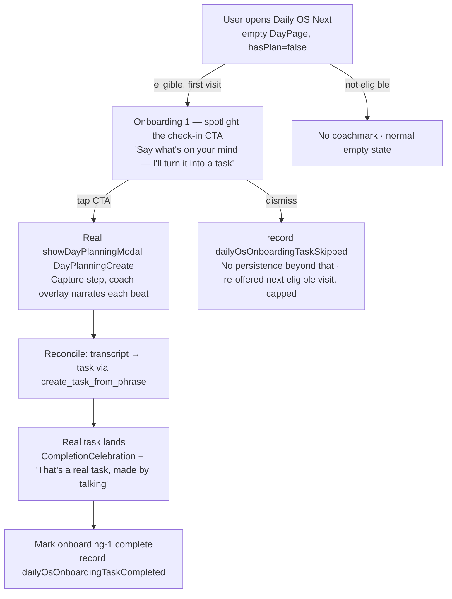
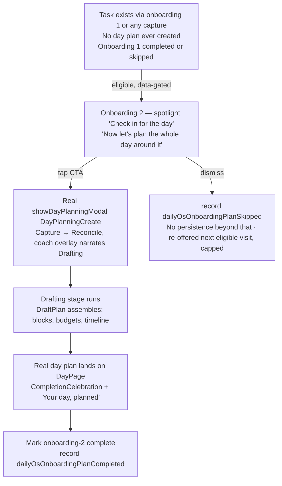

# Daily OS onboarding — teach the mic, then teach the day

_2026-07-09_

## Context

Lotti already has two onboarding surfaces, and neither one teaches Daily OS Next:

1. **The general FTUE** (`lib/features/onboarding/`, gated behind `enableOnboardingFtueFlag`,
   default off) is a one-time front-door flow: welcome → connect a provider → recording
   style → category → **first task**. Its payoff was deliberately redesigned
   (`docs/implementation_plans/2026-06-23_ftue_redesign.md`) to land the user on a real,
   in-progress `TaskDetailsPage` instead of the Daily OS `/calendar` surface — that hand-off
   was explicitly called "jarring and off-message" and cut. So today, by design, nobody who
   finishes the general FTUE is ever shown Daily OS Next.
2. **Daily OS Next's own coachmarks** (`DailyOsPreferencesController`:
   `timelineGesturesLearned`, `dayFooterHintRetired`) are narrow, one-shot hints about
   *gestures on an existing plan* (swipe/pinch the timeline, "talk to reshape the plan").
   They assume a plan already exists. Nothing teaches a first-time visitor what the empty
   state's single CTA (`_NoPlanFooter`, `day_page.dart`) even does.

The result: a brand-new user can go through the whole general FTUE, create one task by
voice, and then land on Daily OS Next's empty `DayPage` (`hasPlan: false`,
`DraftPlan.emptyForDay`) with a single unexplained mic button
(`key: daily_os_day_check_in_cta`) and zero context for what tapping it starts. Daily OS
Next's *entire* interaction model — Capture → Reconcile → Draft, run by a durable
`daily_os_planner` agent — is invisible until that tap.

Two distinct, already-real payoffs live behind that one CTA, and they are not the same code
path as the general FTUE's task step:

- **Task creation**, mediated by the day agent's `create_task_from_phrase` tool
  (`lib/features/daily_os_next/agents/service/day_agent_capture_service.dart`) during Capture/Reconcile — a spoken or
  typed phrase becomes a real task, exactly the way it happens in normal Daily OS use, not a
  scripted replay.
- **Day-plan creation**, the Drafting stage of the same ritual — the same capture, once it
  carries day-level intent (schedule, energy, meetings), becomes a full `DraftPlan` with
  timeline blocks and budgets.

This plan proposes two sequenced, Daily-OS-scoped onboarding moments — **first, creating a
task; second, creating a day plan** — that teach these two payoffs **in the real Daily OS
UI**, reusing the visual and motion language proven in `lib/features/onboarding/` (dark
cinematic accents, glass surfaces, staggered entrance, one CTA per beat, quiet skip,
reduced-motion parity) without replaying a second full-screen "fake" flow over a product
whose whole point is that the UI is agentic and real.

## What already exists to build on

| Piece | File | Reuse for |
|---|---|---|
| `DayPage` empty state / `_NoPlanFooter` CTA | `lib/features/daily_os_next/ui/pages/day_page.dart` | The anchor onboarding 1 spotlights — teach the CTA in place, don't replace it. |
| `showDayPlanningModal` / `DayPlanningCreate` / `DayPlanningAdapt` | `lib/features/daily_os_next/ui/pages/day_planning_modal.dart` | The real flow both onboardings narrate — no new modal is built; we coach the existing Capture → Reconcile → Draft ritual. |
| `create_task_from_phrase` tool | `lib/features/daily_os_next/agents/service/day_agent_capture_service.dart` | The real mechanism onboarding 1's "your first task" beat narrates. |
| Drafting stage / `DraftPlan` | `lib/features/daily_os_next/agents/service/day_agent_plan_service.dart`, `lib/features/daily_os_next/logic/day_agent_models.dart` | What onboarding 2's "your first day plan" beat narrates. |
| `DailyOsPreferencesController` (`timelineGesturesLearned`, `dayFooterHintRetired`) | `lib/features/daily_os_next/state/daily_os_preferences_controller.dart` | Established pattern for one-shot, `SettingsDb`-backed coachmark flags — extend with two more, following the exact same shape. |
| `isOnboardingWelcomeEligible` + `OnboardingWelcomeCadence` | `lib/features/onboarding/state/onboarding_trigger_service.dart` | Pattern to mirror for a Daily-OS-scoped eligibility gate: pure predicate + shown-count/window budget, sequenced behind other auto-shown overlays. |
| `OnboardingMetricsDb` / `OnboardingMetricsRepository` | `lib/database/onboarding_metrics_db.dart`, `lib/features/onboarding/repository/` | Existing content-free, append-only event store — extend its vocabulary rather than standing up a second store. |
| `NeuralConstellation` / `OnboardingBackdrop` / `_FrostedGlass` chips / `StaggeredEntrance` / motion tokens | `lib/features/onboarding/ui/widgets/`, `lib/features/design_system/theme/motion_tokens.dart` | Visual language to draw a lighter **spotlight/coachmark card** component from — not the full-screen backdrop, since this coaches over live content instead of replacing the screen. |
| `CompletionCelebration` | `lib/features/design_system/components/celebration/` | Payoff beat when the first task or first day plan actually lands. |
| `AppPrefs` `seen_` prefix / `clearPrefsByPrefix` + Settings → Onboarding replay row | `lib/services/app_prefs_service.dart`, `lib/features/onboarding/ui/onboarding_settings_panel.dart` | Precedent for a "replay this walkthrough" entry and a maintenance-page reset action. |

## Design questions this plan resolves (with a recommendation each)

1. **Presentation model: full-screen takeover vs. in-context coachmark?**
   Recommend **in-context coachmark** — a small anchored spotlight/callout card (dimmed
   backdrop with a cut-out around the real CTA, short copy, one primary action) rather than a
   second `OnboardingWelcomeModal`-style full-screen flow. Daily OS Next's value proposition
   *is* the real agentic UI; a scripted replica would teach a UI that doesn't exist. This also
   sidesteps the exact mistake the June FTUE redesign already fixed once (a synthetic payoff
   screen instead of the real thing).
2. **Does finishing the general FTUE suppress Daily OS onboarding 1?**
   Recommend **no** — keep them independent. The general FTUE's task step uses a one-shot
   structuring call (`OnboardingTaskStructuringService`); Daily OS Next's task creation is a
   different, agent-mediated code path the user has never seen exercised. Flag as an **open
   question for the product owner** in case telemetry later shows back-to-back task-creation
   coaching reads as repetitive.
3. **Trigger point and sequencing.**
   Onboarding 1 fires the first time `DailyOsNextRoot` renders the empty surface
   (`hasPlan == false`) for an eligible user. Onboarding 2 is **data-gated, not
   calendar-gated**: it fires once a task exists (via onboarding 1 or any Daily OS capture),
   no day plan has ever been created, **and** onboarding 1 is completed or skipped (so the two
   never stack) — mirroring the general FTUE's own progressive-disclosure rule. This gate is
   stated once here and referenced everywhere else in this doc rather than restated, to avoid
   drift between the mermaid diagrams, the progressive-disclosure table, and the phase
   descriptions.
   **v1 scoping call:** because onboarding 1's gate is "has never had a plan," anyone who
   already has a day plan when this ships — including current `daily_os_next` dogfood users —
   is permanently ineligible for *both* moments, with no baseline-cohort backfill (unlike the
   general FTUE's `recordAppFirstSeenIfAbsent`/`kFtueReleaseDateUtc` mechanism). Proposed as
   acceptable for v1 given the small existing user base; call out explicitly as an open
   question (#6 below) rather than silently scoping it out.
4. **Flagging.** A new dedicated `ConfigFlags` row, e.g. `dailyOsOnboardingEnabledFlag`,
   independent of `enableOnboardingFtueFlag` (a different surface, different owner) but with
   its eligibility check requiring `dailyOsNextEnabledFlag` to also be on — no point coaching
   a screen that's not reachable.
5. **Metrics store.** Recommend **reuse** `OnboardingMetricsDb`/`OnboardingMetricsRepository`
   rather than a second event table: add a handful of new `OnboardingEventName` values
   (`dailyOsOnboardingTaskShown`, `dailyOsOnboardingTaskCompleted`,
   `dailyOsOnboardingTaskSkipped`, `dailyOsOnboardingPlanShown`,
   `dailyOsOnboardingPlanCompleted`, `dailyOsOnboardingPlanSkipped`) to the existing, already
   content-free, already-queryable vocabulary — the `Skipped` pair matters as much as
   `Shown`/`Completed`: both moments treat dismissal as a real, capped-and-re-offered branch
   (see the two mermaid diagrams below), so without an explicit skip event that branch is
   unmeasurable and unenforceable, mirroring the general FTUE's own `welcomeSkipped` event.
6. **Replay entry.** The Settings → Onboarding page (`OnboardingSettingsBody`) is the obvious
   host by precedent — but its Settings v2 tree node is only shown
   `if (enableOnboardingFtue)` (`settings_tree_data.dart:89`), a flag independent of and
   unrelated to the `dailyOsOnboardingEnabledFlag` proposed in (4). Gating this feature's own
   replay entry behind a different feature's flag would make it unreachable for anyone with
   Daily OS onboarding on and the general FTUE flag off (its default). Recommend widening that
   tree node's guard to `enableOnboardingFtue || dailyOsOnboardingEnabledFlag`, so the page hosts
   both replay rows once either flag is on; a dedicated Daily OS settings entry point is the
   fallback if the settings tree doesn't want to mix the two features under one node.

## The two moments

Both moments share one component: a **`DailyOsOnboardingSpotlight`** — a dimmed scrim with a
cut-out around the target widget (the check-in CTA, or later the Drafting progress row),
short copy in a glass card, one primary action ("Try it") and a quiet dismiss, built from the
same `_FrostedGlass`/`StaggeredEntrance`/motion-token vocabulary as the general FTUE. Unlike
the general FTUE's full-screen `PageRouteBuilder`, this spotlight sits as an overlay
`Positioned`/`CompositedTransformFollower` layer above the real `DayPage`/modal content — the
user is always looking at the actual product.

## Progressive disclosure

| Stage | Status | Revealed | Gate |
|---|---|---|---|
| **Onboarding 1 — task** | Build | Spotlight on the check-in CTA; coach overlay through Capture → Reconcile → task-lands | `dailyOsOnboardingEnabledFlag` on, `dailyOsNextEnabledFlag` on, empty `DayPage`, not yet completed/exhausted |
| **Onboarding 2 — day plan** | Build | Spotlight on "check in for the day"; coach overlay through Drafting → plan-lands | See "Trigger point and sequencing" above |
| **Replay** | Build | Settings → Onboarding → "Replay Daily OS walkthrough" | User-initiated only, ignores the shown-count/window budget like the general FTUE's replay entry |
| Timeline-gesture depth (pinch/zoom/lane toggle) | *Already shipped* | `DailyOsPreferencesController.timelineGesturesLearned` | Out of scope here — existing coachmark, unchanged |

## Build phases

### Phase 0 — Eligibility + metrics substrate
- Add `dailyOsOnboardingEnabledFlag` to `ConfigFlags` (`lib/database/journal_db/config_flags.dart`)
  and the Settings → Flags page, default off.
- Add two `SettingsDb`-backed cadence flags mirroring `onboarding_trigger_service.dart`'s
  shape (pure `isDailyOsTaskOnboardingEligible` / `isDailyOsPlanOnboardingEligible`
  predicates + an `AsyncNotifier` cadence class), or extend `DailyOsPreferencesController`
  with two more one-shot booleans (`taskOnboardingCompleted`, `planOnboardingCompleted`) if a
  shown-count/window budget turns out to be unnecessary for this narrower flow — decide
  during build based on whether "show once, then never again" is sufficient (likely yes,
  unlike the general FTUE's multi-session budget, since the trigger here is data-gated, not
  calendar-gated).
- Add `dailyOsOnboardingTaskShown` / `TaskCompleted` / `TaskSkipped` / `PlanShown` /
  `PlanCompleted` / `PlanSkipped` to `OnboardingEventName` and wire
  `OnboardingMetricsRepository.recordEvent` calls at each beat, including both dismiss paths
  (mermaid nodes Z2/Z3 below) — not just the shown/completed beats.

### Phase 1 — Onboarding 1: creating a task
- Build `DailyOsOnboardingSpotlight` (presentational, reusable for both moments).
- Wire it above `DayPage`'s empty state, anchored to `_NoPlanFooter`'s CTA
  (`daily_os_day_check_in_cta` key already exists as a natural anchor/finder for tests).
- Narrate through the real `showDayPlanningModal(DayPlanningCreate())` — the spotlight
  overlay persists across the modal's Capture/Reconcile pages (a thin coach strip, not a
  blocking scrim, so the real modal stays fully usable) until a task lands.
- On task landing, fire `CompletionCelebration`, record completion, retire the gate.
- Escape hatches: dismiss any time (records `dailyOsOnboardingTaskSkipped`, no persistence
  penalty beyond the shown-count budget, same philosophy as the general FTUE's skip); a
  structuring failure inside the modal ends the coach overlay without blocking the user's own
  retry.

### Phase 2 — Onboarding 2: creating a day plan
- Data-gate per "Trigger point and sequencing" above: a task exists, no day plan has ever
  been created for the user, and onboarding 1 is completed or skipped. The "no day plan ever
  created" check needs a persistence-layer spike first — see Risks below, `daily_os_next` has
  no existing query for this today.
- Same `DailyOsOnboardingSpotlight` component, anchored to the check-in CTA again (copy
  reframed: "Now let's plan the whole day"), narrating through to the Drafting stage instead
  of stopping at Reconcile.
- On `DraftPlan` landing, `CompletionCelebration`, record completion, retire the gate.

### Phase 3 — Replay + polish
- Widen the Settings v2 "onboarding" tree node's guard (`settings_tree_data.dart:89`) from
  `enableOnboardingFtue` alone to `enableOnboardingFtue || dailyOsOnboardingEnabledFlag`, then add
  "Replay Daily OS walkthrough" row to `OnboardingSettingsBody` (or a sibling panel if the
  settings tree wants Daily OS content grouped separately — see design question 6).
- Reduced-motion pass on `DailyOsOnboardingSpotlight` (static scrim, no shimmer, matching the
  existing accessibility bar set by the general FTUE's voice widgets).
- Localize all copy across the 6 ARB files, informal tone, `make l10n` + `make sort_arb_files`.
- Update `lib/features/daily_os_next/README.md`'s state diagram to include the two coachmark
  entry points; CHANGELOG entry under the current `pubspec.yaml` version
  (`0.9.1036+4191` at time of writing) + matching `flatpak/com.matthiasn.lotti.metainfo.xml`
  entry, once this ships user-visibly (i.e., once the flag defaults on).

## Critical files

**New:**
- `lib/features/daily_os_next/ui/widgets/daily_os_onboarding_spotlight.dart` (shared coachmark component)
- `lib/features/daily_os_next/state/daily_os_onboarding_trigger_service.dart` (eligibility predicates + cadence, or an extension of `daily_os_preferences_controller.dart`)
- Six new `OnboardingEventName` values (shown/completed/skipped × task/plan) + repository
  wiring in the existing onboarding metrics module

**Touched:**
- `lib/features/daily_os_next/ui/pages/day_page.dart` (spotlight anchor + trigger wiring)
- `lib/features/daily_os_next/ui/pages/day_planning_modal.dart` (host the persisting coach strip across Capture/Reconcile/Drafting)
- `lib/database/journal_db/config_flags.dart`, `lib/features/settings/ui/pages/flags_page.dart` (new flag)
- `lib/features/onboarding/ui/onboarding_settings_panel.dart` (replay row)
- `lib/features/onboarding/model/onboarding_event.dart`, `lib/features/onboarding/repository/onboarding_metrics_repository.dart` (new events)
- `lib/features/daily_os_next/README.md` (state diagram update, per repo convention of documenting real lifecycles)

## Risks / unverified feasibility

These are engineering risks in the design above that have not been validated against the
actual framework/package behavior — called out explicitly rather than assumed away, since
this doc is a proposal, not a confirmed spec.

- **No precedent for an anchored spotlight/cutout overlay in this codebase.** The app's
  existing "coachmarks" (`DailyOsPreferencesController.timelineGesturesLearned` /
  `dayFooterHintRetired`) are static hint text, not a dimmed scrim with a cutout tracking a
  live widget. `DailyOsOnboardingSpotlight` as scoped here is a genuinely new UI primitive,
  not an extension of an existing one — budget real design/build time for it and prototype it
  early rather than treating it as a known quantity.
- **`_NoPlanFooter` is private.** `day_page.dart`'s empty-state CTA (`_NoPlanFooter`) is a
  private widget; anchoring an external overlay to it requires restructuring `day_page.dart`
  (exposing a `GlobalKey`/`LayerLink`, or lifting the footer out), not just wrapping it from
  outside.
- **Overlay persistence across `WoltModalSheet` pages is unverified.** Both moments need the
  coach strip to track through Capture → Reconcile → (Draft) as the user moves between pages
  inside `showDayPlanningModal`'s `WoltModalSheet`. Whether Wolt's page-transition model
  supports a stable overlay layer across page swaps — versus needing the coaching folded into
  each page's own content instead — has not been checked against the Wolt package's actual
  API. This should be spiked before Phase 1 is estimated, not assumed to just work.
- **The persistence layer for "has a day plan ever existed" hasn't been located, let alone
  confirmed cheap.** `daily_os_next` has no `repository/` directory at all (only `agents/`,
  `logic/`, `state/`, `ui/`, `util/`) and does not import legacy `daily_os`'s
  `DayPlanRepository` anywhere — confirmed by grep, zero hits. `currentDraftPlanProvider`
  (`state/day_agent_provider.dart`) is the only located read path today, and it's scoped to a
  single day, not an existence check across all days. This is a find-it spike before Phase 2
  is estimated, not a check-the-cost-of-a-known-query spike.
- **Fallback if the spotlight proves infeasible:** fold the coaching directly into `DayPage`'s
  empty state and the modal's own page content (inline banners/copy rather than a tracking
  overlay), losing the "point at the real thing" polish but keeping the sequencing and
  data-gating logic intact.

## Testing strategy

Mirrors this repo's established conventions (see `lib/features/onboarding`'s test tree and
`daily_os_next`'s existing `day_page_screenshots_test.dart` /
`day_planning_modal_screenshots_test.dart` precedent):
- **Pure predicates** (`isDailyOsTaskOnboardingEligible`, etc.) — exhaustive branch-level unit
  tests, no widget/DB plumbing, following `onboarding_trigger_service_test.dart`'s pattern.
- **`DailyOsOnboardingSpotlight`** — presentational widget tests (props/callbacks in,
  rendered copy + tap behavior out), plus a screenshot test given the existing precedent for
  this feature area.
- **Trigger wiring in `DayPage`** — `ConsumerWidget` tests with `ProviderScope` overrides,
  asserting the spotlight appears/doesn't appear per eligibility state, matching
  `day_page_test.dart`'s existing structure.
- **End-to-end narration through the modal** — extend `day_planning_modal_test.dart`-style
  coverage to assert the coach strip renders across Capture → Reconcile (onboarding 1) and
  through Drafting (onboarding 2), and disappears on completion/dismiss.
- **Metrics** — assert all six new events (including both `Skipped` variants) record exactly
  once each, following `onboarding_metrics_repository_test.dart`'s pattern.
- **Reduced motion** — static-frame assertions for the spotlight, mirroring how
  `VoiceButton`/`LiveWaveform`/`AiVoiceInputShader` are tested elsewhere.

## Open questions for the product owner

1. Should completing the **general FTUE's** first-task step suppress **Daily OS onboarding
   1**, or should both always run independently (current recommendation)?
2. Is a **shown-count/window budget** (like the general FTUE's 4-shows/14-days) needed for
   these two moments, or is "show once per moment, no cap" sufficient given they're
   data-gated rather than calendar-gated?
3. Should the **Settings → Onboarding** page host the Daily OS replay row, or does Daily OS
   want its own onboarding entry point in Settings (it already has its own preferences
   surface via `DailyOsPreferencesController`)?
4. Any **copy/tone** direction beyond "quiet, invite-not-force" (the general FTUE's locked
   philosophy) — e.g. should Daily OS's agentic framing ("the planner is thinking") get its
   own voice distinct from the general FTUE's "connect your brain" framing?
5. Timing relative to `dailyOsNextEnabledFlag`'s own rollout — does this onboarding ship
   behind its own flag while Daily OS Next is still being finished, or only once
   `dailyOsNextEnabledFlag` itself is closer to defaulting on?
6. Is it acceptable that **existing Daily OS Next users at ship time never see either
   onboarding moment** (no baseline-cohort backfill, per the v1 scoping call in "Trigger point
   and sequencing")? If not, this plan needs a `recordAppFirstSeenIfAbsent`-style mechanism
   added to Phase 0.

## Verification (how to confirm it works end-to-end, once built)

- Per phase: `dart-mcp.analyze_files` clean, `fvm dart format .`, targeted
  `dart-mcp.run_tests` green.
- Fresh state, both flags on → open Daily OS Next → spotlight appears on the check-in CTA →
  tap → real Capture/Reconcile/task-creation happens exactly as in normal use → celebration →
  spotlight retires and does not reappear.
- With a task present and no day plan → spotlight appears on the day-plan moment → tap →
  real Drafting happens → plan lands → celebration → spotlight retires.
- Dismiss either spotlight → confirm no persistence penalty beyond documented budget, and the
  real CTA remains fully usable underneath.
- Settings → Onboarding → replay row re-triggers both moments regardless of prior completion.
- Reduced-motion on → spotlight renders statically, flow still converts.
- Confirm on mobile (bottom-nav) and desktop (sidebar) layouts; confirm all copy localized;
  widget/coverage tests for every new/touched widget per repo standards.

---

*This plan is a proposal for review — presentation model, sequencing, and flagging above are
recommendations, not final decisions. Open questions section calls out where the product
owner's call is still needed before implementation starts.*
