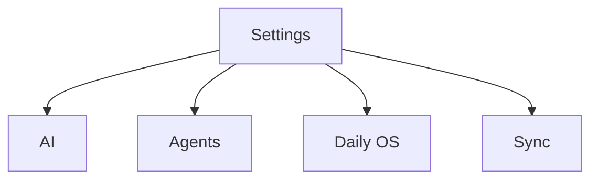
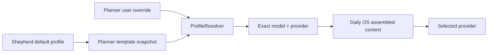

# Daily OS inference selection

**Date:** 2026-07-14
**Priority:** P1
**Status:** Implementation plan
**Scope:** A user-selected default inference profile for Daily OS, a persistent
planner-instance profile/model override, explicit provider data-transfer
disclosure, and first-class settings discoverability from Daily OS.

## Outcome

Daily OS gets one coherent inference-routing experience built from the shared
selection surfaces introduced in PR #3450:

- a default inference profile in a dedicated Daily OS settings panel;
- an optional profile or thinking-model override for the long-lived Daily OS
  planner instance;
- an always-available route to Daily OS settings from the Daily OS header;
- a contextual setup nudge when the inference route or preferred form of
  address is missing;
- exact model, serving-provider, and endpoint disclosure before selection;
- no provider denylist: every configured provider, including Google Gemini,
  remains selectable when it satisfies the Daily OS technical contract.

The privacy boundary is informed, explicit user choice. Daily OS **will send**
the context assembled for an inference run to the selected provider. It must
never imply that transfer is merely possible, silently choose a different
provider, or label a provider GDPR-compliant from its brand alone.

## Panel decision

### UX/UI

- Give Daily OS a dedicated Settings V2 destination rather than adding more
  product configuration to About.
- Keep the default profile and its effective thinking route visible without
  opening a modal.
- Make the instance/default relationship explicit through “Use Daily OS
  default” and “Override for this planner” modes.
- Provide a direct Daily OS header entry to settings at all times.
- When configuration is incomplete, add one calm setup surface inside Daily OS
  instead of relying on the global settings tree or permanent warning clutter.

### Architecture

- Keep the general default profile on the seeded Shepherd day-agent template,
  inside the synced agent domain.
- Keep planner-specific routing on `AgentConfig.inferenceSetup`.
- Reuse `ProfileResolver` as the single runtime resolution implementation.
- Generalize the existing task-agent thinking-model capability predicate so
  task agents and Daily OS consume the same technical eligibility contract.
- Compose Daily OS UI from `InferenceProfilePickerModal` and
  `InferenceProviderModelPickerModal`; do not reuse the task-specific
  `AgentModelSheet` wholesale.

### Data privacy

- Do not filter by provider brand or maintain a Daily OS provider denylist.
- Filter only for technical fitness and platform availability.
- Show whether the selected route is embedded/loopback or remote and identify
  the provider and endpoint host.
- Never claim GDPR compliance without auditable policy metadata covering the
  configured endpoint, account, region, contract, scope, and review date.
- Stop visibly when an explicit selection cannot be resolved. Never fall back
  to another provider.

## Grounding in the current codebase

### Shared selection surfaces

PR #3450 established the selection language this work must reuse:

- `InferenceProfilePickerModal` and `InferenceProfilePickerList` render
  inference profiles with design-system list rows and selected-state semantics.
- `InferenceProviderModelPickerModal` groups models by serving provider and
  independently marks the profile default and current selection.
- `SettingsPickerField` is the established closed-field representation.
- picker consumers preserve established data during background reloads instead
  of flashing to empty or loading shells.

The model picker currently short-circuits when exactly one model is eligible.
Daily OS needs an opt-out from that behavior so the provider/model route remains
visible and explicitly chosen even when there is only one candidate.

### Daily OS settings today

There is no dedicated Daily OS node in the Settings V2 tree. The greeting name
is rendered as a “Daily OS personalization” card inside `AboutBody` and stored
through `DailyOsPreferencesController` in device-local `SettingsDb`.

The settings redesign should move the personalization surface to the new Daily
OS panel. Compatibility can keep the same settings key; moving the UI must not
reset the value.

### One long-lived planner

`DayAgentService` owns one deterministic planner identity:

```text
daily_os_planner
```

Dates are workspaces carried by wake tokens, not separate agent identities.
The instance override therefore applies to the planner across all dates and
synced devices. UI copy must say “this planner,” not “this day.”

### Existing runtime resolution

`DayAgentWorkflow` already resolves inference through `ProfileResolver`.
`ProfileResolver.resolveDetailed` understands:

- typed direct thinking-model override;
- typed base profile;
- legacy agent profile;
- template-version profile;
- template profile;
- legacy model fallback.

Typed setups are authoritative and fail closed. This feature should extend the
write/UI side without adding a Daily OS-specific runtime resolver.

## Product semantics

### General default

The general Daily OS setting is a **default inference profile**. A profile is
the correct default unit because it:

- preserves the profile’s other capability slots for future Daily OS tools;
- carries one unambiguous configured `AiConfigModel.id` per slot;
- avoids overloading the legacy provider-native `modelId` field;
- stays consistent with category, template, and task-agent configuration.

The default profile’s thinking model and serving provider are shown as resolved
details. A direct thinking-model choice is an instance override in this P1, not
a new template-level legacy model mutation.

If a later product requirement needs a direct model as the global default, add
a typed template inference-selection value first. Do not write a local model
config ID into `AgentTemplateEntity.modelId`.

### Planner override

The planner has two visible modes:

1. **Use Daily OS default**
   - uses the current Shepherd default profile;
   - shows the effective model/provider route;
   - follows subsequent Daily OS default changes.
2. **Override for this planner**
   - chooses a base inference profile;
   - optionally chooses a direct thinking model;
   - retains the base profile’s non-thinking slots;
   - remains unchanged when the Daily OS default changes.

“Use profile default” clears only `thinkingModelOverrideId`. “Reset to Daily OS
default” replaces the entire planner setup with the current template-derived
selection.

### Existing legacy route

An installation can currently resolve the seeded Shepherd template through its
legacy Gemini model even when no profile has been explicitly selected. The
runtime resolver keeps this fallback so an already-running planner never breaks.

The Daily OS surface, however, treats "resolvable but no explicit profile" as
unconfigured: `hasInferenceRoute` requires both a resolvable route and an
explicit `template.profileId`, so the setup gate stays active until the user
makes a deliberate provider choice. This is the privacy-forward stance — Daily
OS does not silently route assembled planning context to a default provider the
user never chose. It blocks the inference-dependent check-in and sends the user
to setup instead, rather than presenting the legacy model as their selection.

## Information architecture

### Settings tree

Add a top-level `daily-os` leaf after Agents and before Sync:



Use a stable route such as:

```text
/settings/daily-os
```

Register the same body for desktop Settings V2 and the mobile settings route.
The panel owns its scrolling behavior explicitly in `panel_registry.dart`.

### Daily OS panel layout

Use design-system tokens and established settings components throughout.

1. **Personalization**
   - “Your name” field using the current `DAILY_OS_USER_NAME` value.
   - Helper copy explains that it controls how Daily OS addresses the user on
     this device.
2. **AI planner**
   - `SettingsPickerField`: “Default inference profile.”
   - Effective route: model name, publisher when known, serving provider.
   - Destination line: embedded/loopback or remote endpoint hostname.
   - Definitive data-transfer disclosure.
   - Provider-settings action when the route is missing or broken.
3. **Data scope**
   - Keep category inclusion/exclusion discoverable from the panel, reusing the
     existing preference controller and category selection interaction.

Do not use raw spacing, radius, color, or typography values. Follow the design
system exports and existing settings abstractions.

### Closed default field

The collapsed profile field should answer all of these without opening it:

- Which profile is selected?
- Which thinking model will Daily OS use?
- Which provider will receive the request?
- Is the endpoint on-device/loopback or remote?
- Is the saved selection unavailable?

Example:

```text
Default inference profile
Local Qwen
Qwen 3.6 · via Ollama · Runs on this device
```

Remote example:

```text
Default inference profile
Gemini
Gemini 3 Flash · via Google Gemini · Remote · generativelanguage.googleapis.com
```

### Data-transfer disclosure

The wording is definitive.

General form:

> Daily OS sends relevant tasks, captures, plans, learned preferences, and
> other assembled planning context to the selected provider for processing.

Remote route:

> Daily OS sends the assembled planning context to {provider} at {hostname}
> for remote processing.

Genuinely on-device/loopback route:

> Daily OS sends the assembled planning context to the selected local provider
> for processing. It remains on this device.

Do not call a private-network host or arbitrary custom base URL “on this
device.” Only embedded runtimes and validated loopback endpoints qualify.

The disclosure describes the assembled inference context, not the entire
database. Runtime logs remain content-free under the existing agent logging
rules.

## Discoverability from Daily OS

Discoverability has two layers: a permanent entry point and a contextual setup
nudge.

### Permanent entry point

Add “Daily OS settings” to the Day header overflow menu for planned and
unplanned days. It navigates directly to `/settings/daily-os`.

Keep “Inspect agent” as the diagnostic/internal route. Settings and Agent
Internals solve different user needs and must remain separate menu actions.

### Contextual readiness state

Replace the onboarding-only readiness boolean with a shared, richer state:

```text
DailyOsSetupStatus
  hasResolvableInferenceRoute
  hasExplicitInferenceChoice
  inferenceIssue
  hasPreferredName
```

Suggested inference issues:

- `none`
- `notSelected`
- `providerNotConfigured`
- `selectionUnavailable`
- `platformUnavailable`

The onboarding eligibility provider consumes this shared readiness state rather
than owning a second inference-readiness implementation.

### Missing inference route

A missing or broken inference route is blocking because the create ritual will
fail when drafting starts.

- Show a high-priority but non-alarmist setup card directly under the Day
  header.
- Change the empty-day primary action from “Speak a check-in” to “Set up Daily
  OS” while the route is unavailable.
- Tapping it navigates to the AI planner section of Daily OS settings.
- Do not open Capture and let it fail later.
- On a planned day, keep the plan readable and show the same repair card; block
  only actions that require a new inference run.

Suggested copy:

```text
Choose how Daily OS should think
Select the profile, model, and provider that will process your Daily OS context.
[Set up AI]
```

### Missing preferred name

The preferred name is optional and must never block planning.

- Show a gentle personalization nudge when no name is set.
- Keep “Speak a check-in” enabled when inference is ready.
- Action copy: “Add how you’d like to be addressed.”
- Navigate to the Daily OS personalization section and focus the name field.
- Retire the nudge reactively as soon as a non-empty name is saved.

### Both values missing

Render one setup card, not two competing banners:

```text
Finish setting up Daily OS
○ Choose AI profile and provider — Required
○ Add how you’d like to be addressed — Optional
[Open Daily OS settings]
```

The required inference item determines the primary CTA behavior. The optional
name item never blocks it once inference becomes ready.

### Nudge lifecycle

- Do not auto-open Settings.
- Do not repeatedly toast on page entry.
- Do not permanently occupy the surface after both items are configured.
- Preserve the last established readiness state during background refreshes so
  the card and primary CTA do not flash.
- If a configured provider/profile is later deleted, the repair nudge returns
  immediately and no remote fallback is selected.

## Technical eligibility and privacy presentation

### Shared technical policy

Extract a generic agentic-thinking predicate from
`isTaskAgentThinkingModel`:

```text
isAgenticThinkingModel(model)
  supports function calling
  accepts text input
  produces text output
```

Build a shared catalog around explicit use-case requirements:

```text
InferenceUseCaseRequirements
  required input modalities
  required output modalities
  requiresFunctionCalling
  platform constraints

InferenceSelectionCatalog
  eligible profiles
  eligible models
  referenced providers
  resolved route details
  endpoint presentation metadata
```

The Daily OS policy permits every `InferenceProviderType`. Google Gemini,
OpenAI, Anthropic, Mistral, Melious, Alibaba, OpenRouter, custom
OpenAI-compatible endpoints, and local providers remain eligible when their
configured model satisfies the technical contract.

### Profile eligibility

A profile is offered when:

- its thinking slot resolves to an `AiConfigModel`;
- that model satisfies the agentic-thinking contract;
- its `AiConfigInferenceProvider` exists and is usable;
- it is available on the current platform.

Only the thinking slot is relevant to P1 eligibility because it is the slot the
current day-agent workflow executes. Preserve optional slots for runtime use and
future capabilities.

An already-selected profile that becomes invalid stays visible as unavailable
so the user understands what broke. It is not offered as a new valid choice.

### Endpoint classification

Provider type alone is insufficient for privacy presentation because base URLs
are configurable.

- embedded runtime: on-device;
- validated `localhost`, `127.0.0.0/8`, or `::1`: loopback/on-device;
- every other host: remote or network endpoint;
- malformed/missing custom host: unknown endpoint, treated as non-local for
  presentation and safety.

Do not infer contractual privacy or residency from these transport categories.

### Recommendation without exclusion

Local routes can be placed in a “Recommended for privacy” section or sorted
before remote routes. This affects presentation only:

- every technically eligible provider remains selectable;
- provider text remains visible;
- recommendation is never encoded as a hidden filter;
- no brand receives a GDPR badge without auditable policy metadata.

## Persistence and precedence

### Default source

Persist the Daily OS default as `dayAgentTemplateId`’s `profileId` and create the
corresponding template version through `AgentTemplateService.updateTemplate`.
Do not place the inference default in `DailyOsPreferencesController`; that
controller is device-local and is appropriate for the greeting name and UI
preferences, not synced execution routing.

### Planner setup

Use the existing `AgentInferenceSetup` fields:

- `baseProfileId`: selected profile config ID;
- `thinkingModelOverrideId`: direct `AiConfigModel.id`, never
  `providerModelId`;
- `origin`: `templateSnapshot` while following the default, `user` for an
  explicit planner override;
- `originEntityId`: `dayAgentTemplateId` for a copied default.

Update the type and field docstrings that currently say the typed setup is only
for task agents. The model and resolver are already generic enough for the day
agent.

### Default propagation

Create a Daily OS inference settings coordinator that performs the user-visible
default mutation:

1. validate the selected profile against the current catalog;
2. update the Shepherd template and version;
3. load `daily_os_planner`, if it exists;
4. if its setup is absent/legacy or has `templateSnapshot` origin, copy the new
   profile into a typed template snapshot and clear its direct model override;
5. if its setup has `user` origin, leave it unchanged;
6. publish the existing agent/config update notifications;
7. complete persistence before closing the picker and showing success.

Nested agent sync transactions already share their buffer, so the coordinator
should use an outer transaction where the current services permit it. A failed
write must not leave the UI claiming the new default is active.

### New planner creation

`DayAgentService.getOrCreatePlannerAgent` should create a typed setup when the
template has a profile:

```text
mode: configured
origin: templateSnapshot
baseProfileId: template.profileId
originEntityId: dayAgentTemplateId
```

Retain the legacy model fallback when the template has no profile so existing
installations keep working until the user selects a route.

### Avoid a new inherit enum

Do not add `AgentInferenceSetupMode.inherit` in this P1. Older clients currently
deserialize unknown setup modes as `disabled`; syncing a new enum value would
make the planner unexpectedly stop on those clients. Existing
`templateSnapshot` origin plus explicit default propagation expresses the
needed behavior without a cross-version enum hazard.

### Runtime behavior

The runtime stays:



Rules:

- resolve the exact persisted model/provider;
- persist `AiConfigModel.id` for direct overrides;
- never substitute another provider when resolution fails;
- show a repair state before a user starts another inference-dependent action;
- keep existing plans and non-inference reads available during repair.

## Picker changes and reuse

### Profile picker

Extend the shared profile picker through optional presentation data rather than
forking a Daily OS modal. The Daily OS caller needs to show:

- effective thinking-model name;
- model publisher when known;
- serving-provider name;
- local/remote endpoint classification;
- unavailable state.

Existing callers that pass no presentation data retain the PR #3450 behavior.

### Model picker

Add an option such as:

```text
autoSelectSingleCandidate: true
```

Keep `true` as the compatibility default. Daily OS passes `false`, ensuring the
single candidate still appears with provider identity and definitive transfer
disclosure before the user selects it.

The provider-first navigation, default marker, selected marker, ordering, and
modal layout stay shared.

### Save behavior

Match the corrected task-agent flow from PR #3450:

- selection is terminal only after persistence succeeds;
- success closes the selection/setup surface and shows a scoped toast;
- failure keeps the surface open and reports the error there;
- background refresh retains the current rendered data.

## Suggested code organization

Names are illustrative; preserve the existing project naming style during
implementation.

### New Daily OS files

```text
lib/features/daily_os_next/state/daily_os_setup_status_provider.dart
lib/features/daily_os_next/state/daily_os_inference_options_provider.dart
lib/features/daily_os_next/agents/service/daily_os_inference_settings_service.dart
lib/features/daily_os_next/ui/settings/daily_os_settings_body.dart
lib/features/daily_os_next/ui/settings/daily_os_inference_settings_section.dart
lib/features/daily_os_next/ui/widgets/daily_os_setup_nudge.dart
```

Each new source file gets one mirrored test file.

### Existing files likely touched

```text
lib/features/settings_v2/domain/settings_tree_data.dart
lib/features/settings_v2/ui/detail/panel_registry.dart
lib/features/settings_v2/ui/labels/settings_tree_labels.dart
lib/features/settings/settings_location.dart (or the current route mapping)
lib/features/settings/ui/pages/advanced/about_page.dart
lib/features/daily_os_next/state/daily_os_preferences_controller.dart
lib/features/daily_os_next/state/daily_os_onboarding_trigger_service.dart
lib/features/daily_os_next/agents/service/day_agent_service.dart
lib/features/daily_os_next/ui/pages/daily_os_next_root.dart
lib/features/daily_os_next/ui/pages/day_page.dart
lib/features/daily_os_next/ui/pages/day_page_header.dart
lib/features/agents/model/agent_config.dart
lib/features/agents/state/task_agent_model_providers.dart
lib/features/ai/ui/widgets/inference_profile_picker_modal.dart
lib/features/ai/ui/widgets/inference_provider_model_picker_modal.dart
```

Generated `*.g.dart` and `*.freezed.dart` files are regenerated, never edited
directly.

## Implementation sequence

### Phase 1 — Shared policy and readiness

1. Extract `isAgenticThinkingModel` and keep task-agent behavior unchanged.
2. Add endpoint classification as pure, tested logic.
3. Add the Daily OS selection catalog with no provider-type exclusions.
4. Extract shared Daily OS inference readiness from the onboarding trigger.
5. Add `DailyOsSetupStatus`, including explicit-choice and preferred-name
   state.
6. Keep all Phase 1 tests green before adding UI files.

### Phase 2 — Persistence

1. Generalize `AgentInferenceSetup` documentation beyond task agents.
2. Add the Daily OS inference settings coordinator.
3. Write the Shepherd default and version snapshot.
4. Propagate to template-following planners only.
5. Update planner creation to write `templateSnapshot` typed setup.
6. Add profile/model override and reset operations for the planner.
7. Test transactional failure and no-silent-fallback behavior.

### Phase 3 — Dedicated settings panel

1. Add the Settings V2 tree node, labels, route, and panel registration.
2. Extract Daily OS personalization from About without changing its stored key.
3. Add the default profile picker and resolved route summary.
4. Add definitive local/remote data-transfer disclosure.
5. Add provider repair/navigation actions.
6. Preserve established content during background refreshes.

### Phase 4 — Planner override UI

1. Add the inference section to the day-agent instance detail.
2. Render default vs override mode and origin.
3. Reuse the profile picker.
4. Reuse the provider-first model picker with single-candidate auto-selection
   disabled.
5. Add “Use profile default” and “Reset to Daily OS default.”
6. Surface broken and cross-platform unavailable selections.

### Phase 5 — In-product discoverability

1. Add the permanent Day-header “Daily OS settings” action.
2. Add the combined setup nudge below the Day header.
3. Guard the empty-day check-in CTA when inference is not ready.
4. Keep the CTA enabled for missing-name-only state.
5. Deep-link/focus the relevant settings section.
6. Return the nudge reactively if a provider/profile is deleted later.

### Phase 6 — Localization, documentation, and release metadata

1. Add all user-visible copy to `app_en.arb`, `app_cs.arb`, `app_de.arb`,
   `app_es.arb`, `app_fr.arb`, and `app_ro.arb`.
2. Use informal German/French/Spanish and the established formal Romanian
   register.
3. Run `make sort_arb_files` and `make l10n`.
4. Update `lib/features/daily_os_next/README.md` architecture-first, including
   setup state and inference precedence diagrams.
5. Update `lib/features/agents/README.md` for typed day-agent setup and default
   propagation.
6. Update `lib/features/ai/README.md` for the new shared picker options and
   endpoint disclosure.
7. Add a user-visible CHANGELOG entry under the current pubspec version and the
   matching Flatpak metainfo release entry.

## Test plan

### Pure policy tests

- every provider enum remains eligible when paired with a technically capable
  model and usable configuration;
- Gemini/Google is explicitly included;
- function-calling, text-input, and text-output requirements are enforced;
- local recommendation changes ordering/presentation, never membership;
- embedded, loopback, remote, malformed, and custom endpoint classifications;
- missing model/provider rows fail closed;
- selected unavailable rows remain representable;
- candidate ordering is deterministic.

Use Glados for catalog/filter invariants because this is non-trivial pure logic.
Tag every property test with `glados`.

### Persistence tests

- changing the general default updates the Shepherd template and active
  version;
- a missing planner is not created merely by viewing settings;
- a newly created planner receives a template snapshot;
- an absent/legacy or template-snapshot planner follows a default change;
- a user-origin planner override does not change;
- changing profile clears a direct model override;
- direct overrides persist `AiConfigModel.id`;
- reset copies the latest default;
- a failed transaction leaves both template and planner unchanged;
- provider/profile deletion produces a broken state with no fallback.

### Settings UI tests

- the Daily OS node appears in desktop and mobile settings;
- personalization moved from About without losing the value;
- default profile, effective model, provider, and endpoint render;
- definitive transfer copy renders for local and remote routes;
- Google appears when configured and eligible;
- a legacy route is labeled as legacy, not user-selected;
- picker persistence succeeds before close;
- save failure keeps the picker open;
- background reload preserves the established field value;
- unavailable selection exposes a repair action;
- 200% text scale retains model/provider identity and actions.

### Planner override UI tests

- “Use Daily OS default” renders effective default and origin;
- choosing a profile writes a user override;
- choosing a direct model distinguishes “Default” from “Selected”;
- the single eligible model still opens a visible picker;
- “Use profile default” clears only the model override;
- “Reset to Daily OS default” clears the user override;
- broken/deleted selection remains visible;
- desktop-only selection is explained on unsupported platforms.

### Discoverability tests

- Day header always exposes “Daily OS settings”;
- missing inference route renders the setup card;
- missing inference route changes/guards the empty-day primary CTA;
- tapping the guarded CTA navigates to settings and does not open Capture;
- planned-day content remains readable while inference actions are blocked;
- missing name alone renders a gentle nudge and does not block check-in;
- both missing values render one combined card;
- name save retires the optional row reactively;
- inference save restores the ordinary check-in CTA reactively;
- deleting the active provider makes the repair nudge return;
- background refresh does not flash the nudge or CTA state.

### Runtime tests

- DayAgentWorkflow uses the exact selected profile route;
- direct thinking override replaces only the thinking route;
- model/provider identity is stable across resolution;
- missing explicit model/provider stops the wake;
- no alternate provider is selected automatically;
- legacy route remains compatible until an explicit selection is written.

## Validation workflow

During implementation:

1. register the repository root with `dart-mcp.add_roots`;
2. run `dart-mcp.analyze_files` after each coherent slice;
3. run `fvm dart format .` frequently;
4. run targeted tests for the touched source/test pairs through
   `dart-mcp.run_tests`;
5. run `make build_runner` through MCP only when generated agent models change;
6. run `make sort_arb_files` and `make l10n` after localization edits;
7. rerun targeted picker, Daily OS settings, planner service, resolver, and
   runtime tests;
8. finish with analyzer zero warnings/infos and all requested tests passing.

Do not run the full test suite unless specifically requested. Do not report
completion until compilation, analysis, and the relevant tests succeed.

## PR and release workflow

1. Create a focused feature branch and implementation commits using
   Conventional Commits.
2. Include desktop and mobile screenshots of:
   - configured Daily OS settings;
   - remote-provider disclosure;
   - missing-provider setup nudge;
   - missing-name-only nudge;
   - planner override with profile default vs selected model.
3. Open the PR with explicit privacy behavior and data-flow notes.
4. Run local UX/UI, architecture, and privacy panel reviews.
5. Address Gemini and CodeRabbit comments based on the implemented contract;
   add regression tests for every behavior-changing fix.
6. Re-run formatting, targeted tests, localization generation, and analysis.
7. Merge only with clean CI and zero analyzer findings.
8. Release through the existing all-platform process with matching CHANGELOG
   and Flatpak metainfo entries.

## Acceptance criteria

- Daily OS has a dedicated, directly reachable settings panel.
- Daily OS settings are always reachable from the Daily OS header.
- The default profile is user-selectable and shows its effective model,
  provider, and destination.
- Every technically eligible configured provider remains selectable, including
  Google Gemini.
- Local routes can be recommended without hiding remote routes.
- The UI states definitively that Daily OS sends the assembled planning context
  to the selected provider.
- The planner can follow the Daily OS default or retain an explicit profile or
  thinking-model override.
- Default changes never overwrite a user-origin planner override.
- A missing/broken provider redirects the user to setup before a check-in flow
  that requires inference.
- A missing preferred name is discoverable but never blocks planning.
- Both missing values render one coherent setup card.
- Deleted or unavailable selections never trigger silent provider fallback.
- Background refresh preserves established UI instead of flashing loading,
  empty, error, or setup states.
- All user-visible text is localized in the required ARB files.
- Feature READMEs, CHANGELOG, and Flatpak metainfo match the shipped behavior.
- Analyzer output is clean and all targeted tests pass.
