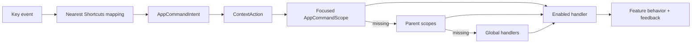

# Desktop Keyboard Command System Implementation Plan

**Status:** In progress
**Date:** 2026-07-15
**Architecture:** [ADR 0030](../adr/0030-desktop-keyboard-command-system.md)

## Outcome

Desktop users can navigate, search, open, edit, save, cancel, reorder, and
confirm work throughout Lotti without a pointer. A typed command catalog drives
execution, macOS menus, a command palette, and fully localized shortcut help.

## Delivery Sequence

1. Add the pure command model/catalog, scoped dispatcher, shortcut formatter,
   focus-region controller, and their tests.
2. Mount the command host in the localized app shell. Wire keyboard activity,
   global create/navigation/zoom commands, stable Primary+1...8 navigation,
   F6 region traversal, and inactive-tab focus exclusion.
3. Add the Primary+K command palette, Primary+?/F1 quick help, and the complete
   `/settings/keyboard-shortcuts` catalog page. Add every visible string to the
   six primary ARBs and generate localization.
4. Convert macOS File/View commands and add Go/Help menus as catalog adapters.
5. Migrate journal refresh, editor/form save, habit save, creation, and zoom
   away from `hotkey_manager`; then remove the dependency.
6. Establish reusable design-system keyboard contracts: visible token-backed
   focus, roving list focus, focus-aware hover affordances, keyboard-resizable
   dividers, modal focus trapping/restoration, and local command scopes.
7. Sweep Tasks, Daily OS, Projects, Habits, Dashboards, Journal, Events,
   Settings, and their dialogs. Long lists use one Tab entry plus arrows,
   Home/End, Page Up/Down, Enter, Primary+F, and selection scrolling. Trees,
   tabs, calendars, pickers, checklists, reorderables, charts, image viewers,
   and scrubbers use their conventional local bindings. Pointer-only actions
   gain standard buttons or explicit Focus/Actions/Semantics.
8. Update feature READMEs, CHANGELOG `0.9.1045`, and Flatpak metainfo. Format,
   generate localization, analyze with zero diagnostics, and run targeted
   source-mirrored tests after every slice.

## Default Bindings

"Primary" is Command on macOS and Control on Windows/Linux.

| Command | Binding |
| --- | --- |
| Command palette | Primary+K |
| Shortcut help | Primary+? and F1 |
| New text entry / task / screenshot | Primary+N / Primary+T / Primary+Alt+S |
| Tasks through Settings | Primary+1 through Primary+8, fixed semantic map |
| Zoom in / out / reset | Primary+Plus / Primary+Minus / Primary+0 |
| Save / refresh / search | Primary+S / Primary+R / Primary+F |
| Create in current context | Primary+Shift+N |
| Next / previous region | F6 / Shift+F6 |
| Activate / rename / delete / cancel | Enter or Space / F2 / Delete / Escape |
| Reorder | Alt+Up / Alt+Down |

## Keyboard Interaction Contract

- Tab/Shift+Tab cross controls or enter/leave a composite region.
- Arrows navigate inside a composite; Home/End select its limits.
- Enter activates; Space toggles where the control has selectable state.
- Escape cancels editing or closes the top modal and restores invoking focus.
- Destructive actions always keep their confirmation; keyboard users are never
  required to hold a key.
- Hover-only controls appear on focus. Every focusable action has a visible
  token-backed focus state and useful semantics.

## Verification

- Pure tests: catalog uniqueness, platform bindings, scope conflicts, search
  ranking, repeat policy, and locale/platform key formatting.
- Dispatcher tests: nearest-scope precedence, fallback, disabled/disposed
  scopes, re-entry, text-input safety, activity updates, and palette snapshots.
- Widget tests: palette/help search and navigation, focus restoration, settings
  routing, native-menu adaptation, and every modified interaction primitive.
- Keyboard-only journeys for all eight destinations: navigate, focus search,
  move through a list, open detail, edit/save/cancel, use a modal, and confirm a
  destructive action.
- Manual matrix: macOS, Windows, Linux; English, Czech, German, Spanish, French,
  Romanian; German/French layouts; light/dark and large text.

Run `make l10n`, `make sort_arb_files`, `fvm dart format .`, analyzer checks,
and targeted tests. The repository-wide suite remains opt-in because of its
runtime cost.
