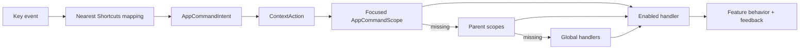

# Desktop Keyboard Command System Implementation Plan

**Status:** Completed (v1)
**Date:** 2026-07-15
**Architecture:** [ADR 0030](../adr/0030-desktop-keyboard-command-system.md)

## Outcome

Desktop users have one lifecycle-safe command layer for global navigation and
high-value contextual actions. A typed command catalog drives execution, macOS
menus, a command palette, and fully localized shortcut help. Existing
control-local keyboard behavior remains local to the control.

## Delivery Sequence

1. Add the pure command model/catalog, scoped dispatcher, shortcut formatter,
   focus-region controller, and their tests.
2. Mount the command host in the localized app shell. Wire keyboard activity,
   global create/navigation/zoom commands, stable Primary+1...8 navigation,
   F6 region traversal, and inactive-tab focus exclusion.
3. Add the Primary+K command palette, Primary+?/F1 quick help, and the complete
   `/settings/keyboard-shortcuts` catalog page. Add every visible string to the
   six primary ARBs and generate localization.
4. Convert macOS File/View commands and add Go/Help menus as catalog adapters.
5. Migrate journal refresh, editor/form save, habit save, creation, and zoom
   away from `hotkey_manager`; then remove the dependency.
6. Establish reusable keyboard contracts through focus regions, visible
   token-backed focus, keyboard-resizable dividers, modal focus restoration,
   accessible confirmation, and local command scopes.
7. Wire all eight desktop destinations globally and add contextual command
   scopes to Tasks, Projects, Habits, Journal, entry/project editors, and
   creation dialogs. Keep conventional bespoke interactions—inline editing,
   image-viewer Escape, and saved-filter row actions—local to their controls.
8. Update feature READMEs, CHANGELOG `0.9.1047`, and Flatpak metainfo. Format,
   generate localization, analyze with zero diagnostics, and run targeted
   source-mirrored tests after every slice.

All eight steps are delivered. The catalog also documents conventional local
bindings for composite controls. A control only advertises those actions in
the palette when its mounted scope provides an enabled handler; adding richer
arrow-key behavior to other legacy composites remains normal feature work, not
an unused global command registration.

## Default Bindings

"Primary" is Command on macOS and Control on Windows/Linux.

| Command | Binding |
| --- | --- |
| Command palette | Primary+K |
| Shortcut help | Primary+? and F1 |
| New text entry / task / screenshot | Primary+N / Primary+T / Primary+Alt+S |
| Tasks through Settings | Primary+1 through Primary+8, fixed semantic map |
| Zoom in / out / reset | Primary+Plus / Primary+Minus / Primary+0 |
| Save / refresh / search | Primary+S / Primary+R / Primary+F |
| Create in current context | Primary+Shift+N |
| Next / previous region | F6 / Shift+F6 |
| Activate / rename / delete / cancel | Enter or Space / F2 / Delete / Escape |
| Reorder | Alt+Up / Alt+Down |

## Keyboard Interaction Contract

- Tab/Shift+Tab cross controls or enter/leave a composite region.
- Arrows navigate inside a composite; Home/End select its limits.
- Enter activates; Space toggles where the control has selectable state.
- Escape cancels editing or closes the top modal and restores invoking focus.
- Destructive actions always keep their confirmation; keyboard users are never
  required to hold a key.
- Hover-only controls appear on focus. Every focusable action has a visible
  token-backed focus state and useful semantics.

## Verification

- Pure tests: catalog uniqueness, platform bindings, scope conflicts, search
  ranking, repeat policy, and locale/platform key formatting.
- Dispatcher tests: nearest-scope precedence, fallback, disabled/disposed
  scopes, re-entry, text-input safety, activity updates, and palette snapshots.
- Widget tests: palette/help search and navigation, focus restoration, settings
  routing, native-menu adaptation, and every modified interaction primitive.
- App-shell tests cover stable destination mapping and inactive-tab focus
  exclusion. Feature tests cover contextual refresh/search/create/save paths.
- Interaction tests cover tree arrows, divider resizing, accessible
  confirmation, and palette focus restoration.

Recommended release QA remains a manual matrix across macOS, Windows, and
Linux; all six primary locales; non-US punctuation layouts; light/dark themes;
and large text.

Run `make l10n`, `make sort_arb_files`, `fvm dart format .`, analyzer checks,
and targeted tests. The repository-wide suite remains opt-in because of its
runtime cost.
