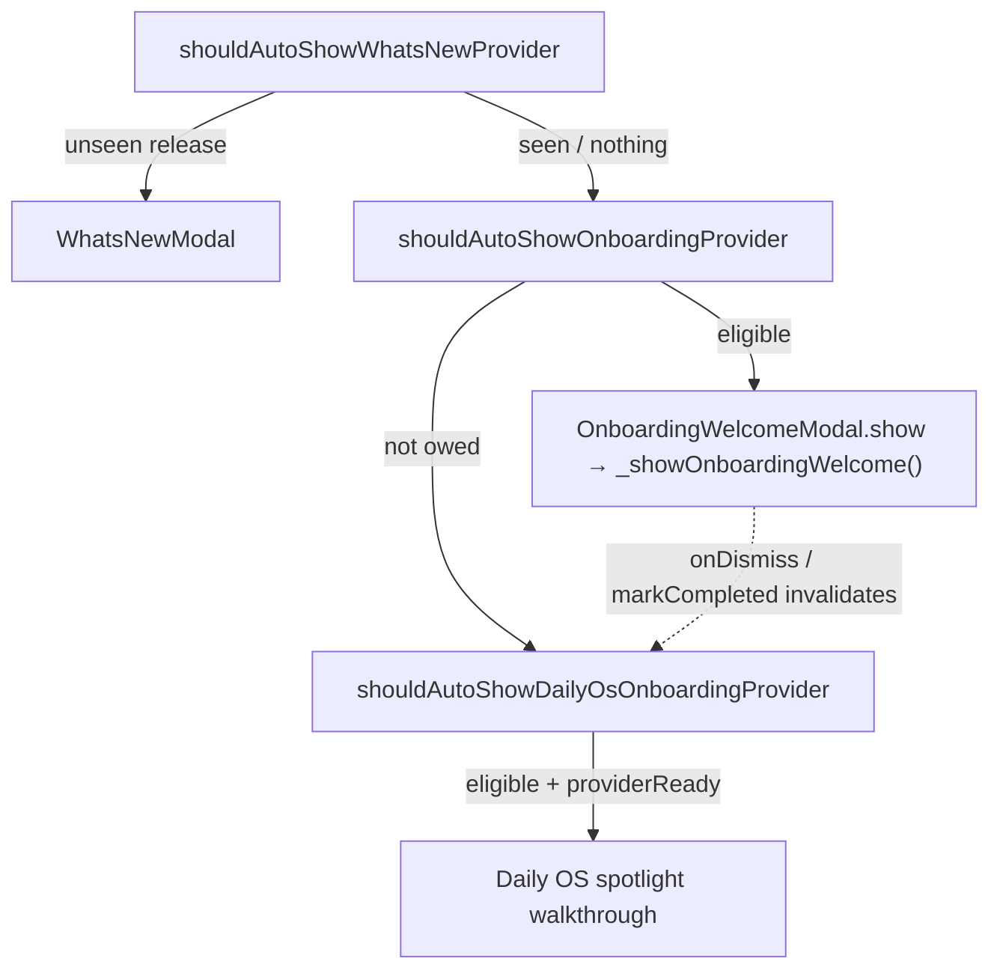

# Wiring onboarding to auto-show on new *and* existing installs

_2026-07-15 · plan for review_

## TL;DR

The entire onboarding auto-show machinery is **already built, wired, and
tested** — cadence bookkeeping, What's New sequencing, `BeamerApp` listeners,
eligibility predicates, and a Settings replay entry. Both flows are dark for one
reason only: their two master config flags default **off**, and *nothing* flips
them on for any cohort.

| Flag | Default | Who sees onboarding today |
| --- | --- | --- |
| `enableOnboardingFtueFlag` | `false` | nobody |
| `dailyOsOnboardingEnabledFlag` | `false` | nobody |

So the answer to "is a fresh install already showing this?" is **no** — and
neither is anyone else. The work is a controlled **rollout**, not new plumbing.

The one real trap: naively flipping the defaults to `true` covers fresh installs
but **misses existing installs that already have a `false` flag row**, because
`initConfigFlags` uses `insertFlagIfNotExists` (insert-only, never updates an
existing row). A one-time force-enable is needed to reach the beta/dev cohort
that already ran a build carrying these flags.

---

## What already exists (verified in code)

### The auto-show chain — fully wired in `lib/beamer/beamer_app.dart`

`_AppScreenState.build` subscribes three sequenced listeners:



- `beamer_app.dart:513` listens to `shouldAutoShowOnboardingProvider` and calls
  `_showOnboardingWelcome()` (records the show in the cadence, opens
  `OnboardingWelcomeModal`).
- `beamer_app.dart:539` listens to `shouldAutoShowDailyOsOnboardingProvider` and
  arms the Daily OS walkthrough via `_tryShowDailyOsOnboarding()`.
- `_showAiSetupPrompt()` (`beamer_app.dart:289`) already **defers to the FTUE
  welcome** when `enableOnboardingFtueFlag` is on: it early-returns instead of
  opening the legacy provider-selection modal. So flipping the flag on cleanly
  *replaces* the old prompt — the two are mutually exclusive by construction.

### Eligibility predicates — pure, complete, and tested

- **FTUE welcome** (`onboarding_trigger_service.dart`,
  `isOnboardingWelcomeEligible`) gates on: flag on, no unseen What's New, not
  `completed`, not `reachedRealAha`, `shownCount < 4`, and within a 14-day
  window from first show.
- **Daily OS walkthrough** (`daily_os_onboarding_trigger_service.dart`,
  `isDailyOsOnboardingEligible`) adds: welcome not still owed, selected date is
  today, no active plan today, never had *any* plan (incl. soft-deleted),
  `providerReady` (a resolvable planner thinking route), not completed, same
  count/window budget.

### Cadence, completion, and replay

- Per-install bookkeeping lives in `SettingsDb` under `welcome_*` /
  `daily_os_onboarding_*` keys (`shown_count`, `first_shown_at`, `completed`) —
  independent of the config flag, which is only the master switch.
- Settings → Onboarding replay entry (`onboarding_settings_panel.dart`) lets a
  user re-run the welcome manually at any time.
- Metrics: `recordAppFirstSeenIfAbsent()` already runs at startup
  (`get_it.dart:208`) and tags existing-vs-new users via
  `hasExistingUserData` (`countAllJournalEntries() > 0`). That signal is
  reusable for the rollout backfill below.

**Conclusion:** the only missing piece is turning the flags on for everyone who
hasn't been through onboarding — across all cohorts — without nagging users who
are already fully set up.

---

## The cohort problem

`initConfigFlags` (`config_flags.dart`) runs on every startup and seeds via
`insertFlagIfNotExists`, which **never overwrites an existing row**
(`database_config_flags.dart:99`). Consequences of a bare default flip
`false → true`:

| Cohort | Flag row today | After default flip only | After Step 2 migration |
| --- | --- | --- | --- |
| Fresh install | none | inserts `true` ✅ | unchanged `true` ✅ |
| Existing user, never ran an FTUE-flag build | none | inserts `true` ✅ | unchanged `true` ✅ |
| Existing user, ran a beta/dev build (row = `false`) | `false` | stays `false` ❌ missed | force-set `true` ✅ |
| User who deliberately toggled it off in Flags | `false` | stays `false` ✅ | force-set `true` ⚠️ overridden once |

The 3rd and 4th rows are indistinguishable by flag value alone — both are just a
`false` row — so the Step 2 migration force-enables **both**. That means a
deliberate opt-out made *before* the migration is overridden exactly once (the
⚠️ above); we cannot tell it apart from the beta/dev cohort we're trying to
reach.

This is an accepted trade-off, not a bug, for two reasons: (1) these flags only
ever shipped in dev/beta builds whose own comments read "still being built," so
a *deliberate* opt-out — as opposed to an untouched default `false` — is
implausible in the wild; and (2) the run-once marker means any opt-out made
*after* the migration is honored permanently, since we never re-force. If
preserving a pre-migration opt-out ever became a hard requirement, it would need
a separate "user touched this flag" marker written by `toggleConfigFlag`, which
does not exist today — call that out of scope unless product asks for it.

---

## Proposed plan

### Step 1 — Flip the defaults (covers fresh installs + never-seen cohort)

In `config_flags.dart`, change both flags' seed `status` to `true`. Update the
explanatory comments (they currently say "off by default … still being built").

### Step 2 — One-time force-enable migration (covers the beta/dev cohort)

Add a startup routine adjacent to `initConfigFlags` (called from `get_it.dart`),
guarded by a `SettingsDb` marker so it runs exactly once per install:

```text
key: onboarding_rollout_v1_applied
if marker absent:
  // upsertConfigFlag takes a ConfigFlag, not (name, bool) — it overwrites.
  upsertConfigFlag(ConfigFlag(name: enableOnboardingFtueFlag, status: true))
  upsertConfigFlag(ConfigFlag(name: dailyOsOnboardingEnabledFlag, status: true))
  <Step 3 backfill here>
  saveSettingsItem(onboarding_rollout_v1_applied, 'true')
```

`upsertConfigFlag` (`database_config_flags.dart:109`) overwrites, unlike the
insert-only seeder. The marker means a user who *later* turns a flag off in the
Flags page keeps it off — we never re-force.

> **Decision A — keep the flags or delete them?** Precedent: the Daily OS
> *surface* was "released to everyone" (commit `8ea3d5a3`) by **deleting** its
> flag and hardcoding `isDailyOsPageEnabled => true`. We *could* do the same for
> onboarding (drop the flag gate, keep only the cadence/completed gates).
> **Recommendation: keep both flags** as a field kill-switch — onboarding is
> interruptive and worth being able to disable remotely/per-user if the flow
> misbehaves. Steps 1+2 give full coverage without losing the switch.

### Step 3 — Don't nag users who are already set up (the key UX call)

The user's ask: existing users who "never went through this" — *especially those
with no providers* — should see it. Today's FTUE predicate already satisfies
that: pre-FTUE users have no `welcome_completed`, no onboarding metrics
(`reachedRealAha = false`), and empty cadence — so the welcome **will** auto-show
once the flag is on. ✅

But the FTUE welcome is a *"connect your brain / create a provider"* flow.
An existing user who **already has a working provider + categories** but never
saw onboarding would be dropped into a redundant provider-setup flow. The
current predicate has no "already configured" guard.

> **Decision B — how to treat already-configured existing users?**
>
> - **Option B1 (recommended):** In the Step 2 migration, backfill
>   `welcome_completed = true` for installs that already have a working
>   provider/profile setup — reuse the exact `providerReady` signal the Daily OS
>   gate computes (`hasResolvableDailyOsPlannerThinkingRoute`). Net effect: the
>   welcome auto-shows only to genuinely un-set-up users (no provider), which is
>   precisely the cohort the request calls out. Already-configured users can
>   still replay it from Settings. The Daily OS walkthrough (Step 4) then becomes
>   their first prompt instead, which fits — they have a provider, they just
>   never planned a day.
> - **Option B2:** Show the welcome to *every* not-completed user regardless of
>   existing providers (literal reading of the request). Simpler, but pushes a
>   provider-creation flow at people who already have one.
>
> Recommendation: **B1**. It matches intent ("never gone through this") without
> nagging configured users, and cleanly hands them to the Daily OS beat.

### Step 4 — Daily OS walkthrough sequencing (already correct, just note it)

No code change needed, but worth confirming the resulting funnel for each cohort:

```mermaid
stateDiagram-v2
  [*] --> FreshInstall
  FreshInstall --> Welcome: no provider → FTUE welcome (connect)
  Welcome --> DailyOS: provider now ready, welcome retired
  DailyOS --> [*]: day plan created → both completed

  [*] --> ExistingConfigured
  ExistingConfigured --> DailyOS2: B1 marks welcome completed; providerReady=true
  DailyOS2 --> [*]: first day plan → completed

  [*] --> ExistingNoProvider
  ExistingNoProvider --> Welcome
```



The Daily OS gate's `providerReady` check means a no-provider user never sees the
walkthrough into a flow that would fail — it only surfaces after a provider
exists (via the welcome, or pre-existing). `welcomeStillOwed` keeps the two from
racing on the same cold start. Both behaviors are already implemented.

---

## Risks & edge cases

- **Re-force on every launch** — prevented by the `onboarding_rollout_v1_applied`
  marker; the `_vN` suffix leaves room for a deliberate future re-rollout.
- **`providerReady` read at migration time** — it touches the agent repo,
  template service, and profile resolver, which are **Riverpod providers**
  (`agentRepositoryProvider`, `agentTemplateServiceProvider`,
  `profileResolverProvider`), *not* `get_it` singletons. `get_it` init runs
  before the `ProviderContainer` is active, so the flag flip (Step 2) can live in
  `get_it.dart`, but the B1 backfill that reads `providerReady` must be deferred
  to where the container exists — either a startup widget after `ProviderScope`
  is up, or by registering those services in `get_it` too. Wrap in try/catch and
  default to "not configured" (show the welcome) on any read failure, so a hiccup
  never *suppresses* onboarding.
- **Legacy `ai_setup_prompt_dismissed`** — some existing users dismissed the old
  prompt. With the FTUE flag on, `_showAiSetupPrompt` early-returns, so that key
  no longer gates anything; the welcome's own `completed`/cadence keys take over.
  No migration needed, but call it out in QA.
- **Reduced-motion / test cohorts** — the Flags page still lists both flags, so
  QA can toggle per device; keeping the flags (Decision A) preserves this.

---

## Open questions for you

1. **Decision A:** keep both flags as kill-switches (recommended), or delete them
   and hardcode-on like the Daily OS surface was?
2. **Decision B:** B1 (backfill `welcome_completed` for already-configured users,
   recommended) or B2 (show welcome to everyone not-completed)?
3. Should the rollout ship both flows at once, or stage FTUE welcome first and
   Daily OS walkthrough a release later?
4. Any need for a remote kill-switch beyond the local flag (e.g. tie to a synced
   setting), or is per-install sufficient for now?

---

## Suggested implementation checklist (post-approval)

- [ ] `config_flags.dart`: default both flags `true` + update comments.
- [ ] New `onboardingRolloutV1` startup routine + `onboarding_rollout_v1_applied`
      marker: the flag flip in `get_it.dart` after flag seeding; the B1 backfill
      deferred to where the Riverpod `ProviderContainer` is available.
- [ ] `upsertConfigFlag` with `ConfigFlag(name: …, status: true)` instances for
      both flags inside the guard.
- [ ] (B1) backfill `welcome_completed = true` when `providerReady`, guarded +
      try/catch — run this part where the Riverpod `ProviderContainer` is
      available (not in raw `get_it` init), since `providerReady` reads Riverpod
      providers.
- [ ] Tests: cohort matrix (fresh / never-seen / beta-false-row / opted-out /
      existing-configured / existing-no-provider) → asserts on final flag state
      and `shouldAutoShow*` eligibility.
- [ ] Update `lib/features/onboarding/README.md` and
      `lib/features/daily_os_next/README.md` rollout sections (drop "still being
      built / off by default").
- [ ] CHANGELOG entry under `0.9.1047` (user-visible: onboarding now shows on
      first run and for un-set-up upgraders) + matching `metainfo.xml` line.
