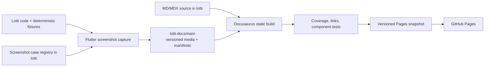

# Automated, versioned manual system

_2026-07-17 · implementation plan_

## TL;DR

Lotti needs a documentation system that can ship with V1 and stay accurate
without turning every UI change into a manual screenshot exercise. The system
will live with the application source so documentation, screenshot cases, and
release behavior can change in one pull request:

- `lotti` owns the Docusaurus site, Markdown/MDX source, screenshot case
  definitions, validation, tests, and CI orchestration.
- `lotti-docs/main` owns generated manual screenshots and their manifests.
- GitHub Actions publishes generated static output to GitHub Pages; generated
  output is never committed, and Pages never runs Flutter or recreates media.
- the default manual version is the latest published App Store version;
  development and older releases remain addressable through permanent URLs.

The existing [manual](../MANUAL.md) is migration input. Its Daily OS section is
substantial and current enough to seed the MVP, while the Categories, Habits,
Measurables, and Dashboards material needs validation and new screenshots. The
empty and explicitly outdated sections must not be reproduced as if complete.

The MVP is a GitHub Pages-hosted static Docusaurus site with task-oriented
navigation, local full-text search, breadcrumbs, light/dark mode, version
selection, and an interactive screenshot component that follows the site theme
and lets readers switch between mobile and desktop. English coverage of every
app page is the active completion target. Multilingual publishing is explicitly
deferred until that English manual is complete and verified.

---

## Goals

1. Publish a polished V1 manual quickly without creating a second application
   or content platform to maintain.
2. Keep manual source, UI implementation, and screenshot capture cases in
   lockstep in the `lotti` repository.
3. Generate deterministic mobile/desktop and light/dark screenshots from
   synthetic data.
4. Store generated media in `lotti-docs/main`, organized by app version.
5. Give every published app version a permanent manual URL.
6. Default the manual root to the latest version actually available in the App
   Store, not merely the newest commit or TestFlight build.
7. Fail builds on missing pages, missing screenshot variants, broken internal
   links, or mismatched screenshot manifests.
8. Keep routine maintenance to editing MDX and, when needed, adding a
   screenshot case.
9. Require every app screenshot embedded in the manual to use a registered
   four-variant case; direct links to one-off generated images are invalid.
10. Cover and verify every app page in English before beginning translated
    manual rollout.

## Non-goals for the MVP

- Multilingual routes, translated prose, language selection, and browser
  language detection. These follow only after full English coverage.
- Replacing the existing `lotti-docs/whats-new` feed.
- Running a CMS, database, search server, or JavaScript application server in
  production.
- Capturing every platform's operating-system chrome.
- Building a full visual-regression approval product.
- Rewriting every legacy manual section before the site can launch.
- Configuring a custom domain. The repository-prefixed GitHub Pages URL is
  acceptable for the initial publication.

---

## Current repository evidence

The repository already contains most of the hard screenshot plumbing:

- `integration_test/manual_screenshots_test.dart` drives a full in-memory app
  shell and captures the AI provider onboarding flow.
- `integration_test/manual_screenshot_utils.dart` writes screenshots to
  `LOTTI_SCREENSHOT_DIR` and supports desktop and device capture paths.
- `test/features/daily_os_next/screenshot_harness.dart` supplies deterministic
  device dimensions, real fonts, fixed-frame settling, and external output.
- opt-in screenshot suites already cover Daily OS, Settings, Categories,
  Dashboards, Insights, and other useful surfaces.
- the Makefile already has macOS and Linux manual screenshot targets.
- `/home/parallels/github/lotti-docs` is an existing sibling checkout whose
  `main` branch already stores versioned screenshots and What's New assets.

The implementation should consolidate and orchestrate these capabilities, not
replace them with Playwright, Puppeteer, or a second Flutter automation stack.

---

## Architecture decision

### Static site generator: Docusaurus

Use Docusaurus 3 in docs-only mode.

Reasons:

- native documentation sidebars and breadcrumbs;
- native light/dark color mode;
- first-class documentation navigation, with a small custom release dropdown;
- Markdown for ordinary pages and MDX where an interactive screenshot is
  needed;
- static output that GitHub Actions can deploy directly to GitHub Pages;
- React component support for switching image theme and viewport without
  authoring four images manually on every page;
- a healthy upstream, unlike starting a new system on Material for MkDocs after
  it entered maintenance mode.

Use `@easyops-cn/docusaurus-search-local` for a build-time, browser-side search
index. Production search must not depend on Algolia or another hosted service.
Pin Docusaurus, the local-search plugin, Node, and all transitive dependencies
through `package-lock.json`.

### Shortlist comparison

| System | Strengths for Lotti | Important trade-off | Verdict |
| --- | --- | --- | --- |
| Docusaurus 3 | Sidebar, breadcrumbs, MDX, color mode, static output, React extension points | Built-in version freezing duplicates source, so Lotti must use tag-based builds instead | **Choose** |
| VitePress | Very small, fast, polished Vue-based docs | No first-class version lifecycle; custom screenshot and release navigation work is comparable to Docusaurus but with fewer docs-specific primitives | Strong runner-up |
| Material for MkDocs | Excellent navigation and search with a huge documentation user base | Python theme ecosystem plus the project's announced maintenance trajectory make it a poor new V1 foundation in 2026 | Do not start new |
| Antora | Excellent multi-repository, multi-component, deeply versioned documentation | Its content-component model is heavier than a single-app manual and interactive MDX-style media needs more custom work | Too heavy |
| GitBook | Polished hosted authoring and search | A separate hosted CMS weakens lockstep repository builds and adds platform ownership | Excluded |

Docusaurus is not chosen for its source-copying version command. It is chosen
for the reader experience and MDX component model. Lotti's release lifecycle is
implemented independently with Git tags and immutable static directories.

### Runtime and ownership flow



### Repository boundary

Checked into `lotti`:

- site configuration and dependency locks;
- current and frozen manual source;
- future localized manual source and locale coverage metadata, after English
  completion;
- navigation and screenshot UI components;
- screenshot case definitions and deterministic fixtures;
- coverage metadata and validation scripts;
- site tests;
- CI workflows and deployment/synchronization scripts.

Checked into `lotti-docs/main`:

- optimized generated screenshots;
- one manifest per development/release screenshot set;
- no application source or manual prose.

Generated Docusaurus build output remains an artifact and is not committed to
either repository.

---

## Target file layout

```text
lotti/
├── docs-site/
│   ├── package.json
│   ├── package-lock.json
│   ├── docusaurus.config.ts
│   ├── sidebars.ts
│   ├── docs/                         # current/development manual
│   │   ├── index.mdx
│   │   ├── getting-started/
│   │   ├── plan-and-capture/
│   │   ├── organize-and-reflect/
│   │   ├── ai-and-automation/
│   │   ├── sync-and-data/
│   │   └── reference/
│   ├── i18n/
│   │   ├── cs/docusaurus-plugin-content-docs/current/
│   │   ├── de/docusaurus-plugin-content-docs/current/
│   │   ├── en-GB/docusaurus-plugin-content-docs/current/
│   │   ├── es/docusaurus-plugin-content-docs/current/
│   │   ├── fr/docusaurus-plugin-content-docs/current/
│   │   └── ro/docusaurus-plugin-content-docs/current/
│   ├── metadata/
│   │   ├── features.json
│   │   └── releases.json
│   ├── src/
│   │   ├── components/ManualScreenshot/
│   │   ├── css/custom.css
│   │   └── pages/index.tsx
│   ├── scripts/
│   │   ├── validate-manual.mjs
│   │   ├── build-screenshot-manifest.mjs
│   │   └── sync-screenshot-media.mjs
│   └── tests/manual-site.spec.ts
├── test/manual_screenshots/
│   ├── screenshot_harness.dart
│   ├── screenshot_registry.dart
│   ├── manual_screenshots_test.dart
│   └── cases/
└── .github/workflows/manual.yml

lotti-docs/
└── manual/screenshots/
    ├── development/
    │   ├── manifest.json
    │   └── <case-id>/
    └── <app-version>/
        ├── manifest.json
        └── <case-id>/
```

The exact capture cases may continue to reuse feature-local opt-in screenshot
tests. The manual registry is an orchestration and contract layer; it should not
duplicate large fixture builders that already exist and are maintained with a
feature.

---

## Expert panel consultation

### Information architecture expert

- **Automation:** make feature coverage machine-readable, but organize the
  sidebar around user goals rather than Flutter feature folders.
- **Established pattern:** progressive disclosure—Start, Plan and Capture,
  Organize and Reflect, AI and Automation, Sync and Data, Reference.
- **Pitfalls:** migrating empty or stale legacy headings makes a new manual look
  complete when it is not. Track `draft`, `migrated`, and `verified` explicitly.
- **Timing:** the navigation model, landing page, and strongest existing guides
  fit in day one; a verified V1-wide content inventory needs follow-up review.

### Software documentation specialist

- **Automation:** validate structure, links, screenshots, and feature/page
  mapping; do not try to automate truthfulness of prose.
- **Established pattern:** task-oriented pages with prerequisites, an outcome,
  numbered actions, expected result, and troubleshooting only where needed.
- **Pitfalls:** narrating every control, writing from implementation names, and
  letting screenshots carry instructions that should remain searchable text.
- **Timing:** a credible MVP can migrate Daily OS, tasks, setup, and core
  organization in a day. Editorial verification of every feature cannot.

### DevOps and automation engineer

- **Automation:** reuse deterministic Flutter widget harnesses; generate four
  variants, optimize them, record checksums and dimensions, and fail before
  publishing incomplete media.
- **Established pattern:** immutable release artifacts, reproducible builds,
  protected credentials, scoped commits to the media repository, and an
  on-demand path identical to the scheduled path.
- **Pitfalls:** committing raw capture staging, regenerating old releases,
  letting nightly jobs push partial sets, or building screenshots on the web
  server.
- **Timing:** site CI plus one proven screenshot case is realistic on day one.
  Generalizing every existing feature harness into the complete matrix is not.

### Documentation UX designer

- **Automation:** make the site theme select the screenshot theme automatically
  and remember the reader's mobile/desktop preference locally.
- **Established pattern:** persistent sidebar on wide screens, focused drawer
  on mobile, breadcrumbs, local search, readable line length, and stable URLs.
- **Pitfalls:** showing four images at once, tiny phone screenshots inside a
  desktop frame, decorative animation that competes with instructions, or a
  version selector that silently changes the current page to an unrelated one.
- **Timing:** the polished shell and responsive screenshot component fit in the
  MVP; usability testing and visual refinements follow after real content is in
  place.

### Panel consensus

A one-day MVP is realistic if “MVP” means a deployable static site, the initial
information architecture, strict checks, tag-based version contract, and at
least one end-to-end automated screenshot case. A fully verified V1 manual with
every major feature and a complete screenshot matrix is a short follow-on
project, not honest one-day work.

---

## Information architecture

The manual must follow user goals rather than the implementation directory
tree.

1. **Start here**
   - What Lotti is
   - Install and first launch
   - Create your first task
   - Set up AI
   - Sync another device
2. **Plan and capture**
   - Daily OS
   - Voice capture
   - Tasks and checklists
   - Journal and logbook
   - Time tracking
3. **Organize and reflect**
   - Projects
   - Categories and labels
   - Habits
   - Measurables
   - Dashboards
   - Insights
4. **AI and automation**
   - Providers and local inference
   - Inference profiles
   - Agents
   - Reviewing suggestions
   - Privacy and data boundaries
5. **Sync and data**
   - Encrypted sync
   - Adding another device
   - Export and backup
   - Diagnostics and recovery
6. **Reference**
   - Settings
   - Keyboard shortcuts
   - Platform differences
   - Troubleshooting
   - Version history

The first public snapshot can launch with the strongest verified material
already available. The active content phase then continues through this entire
inventory until every reachable app page, dialog, and major workflow has
verified English coverage. Unvalidated pages must be marked incomplete rather
than filled with placeholder prose.

### Deferred localization contract

This contract is intentionally parked until every English app page is covered
and the English accuracy audit passes.

- English (`en`) is the canonical authoring locale and source of truth.
- The manual publishes `en`, `en-GB`, `cs`, `de`, `es`, `fr`, and `ro`, matching
  `AppLocalizations.supportedLocales`.
- A visible language selector is available in the global navigation on desktop
  and mobile.
- On a reader's first visit, locale routing selects the best supported browser
  language. An explicit reader selection wins thereafter.
- A missing translated page resolves to the English page with a clear locale
  fallback notice; it must never become a broken route or silently show stale
  prose as current.
- Site chrome and manual prose are localized separately, and CI reports both
  coverage sets.
- Product terms and UI labels should be sourced from the corresponding app ARB
  where practical so the manual and application do not drift.
- Translation review keeps one QA-notes document per locale. Each observation
  records the ARB key, current app wording, screen/context, why it feels off,
  and a possible direction; manual work must not change app translations unless
  a separate localization change is explicitly authorized.
- German, French, and Spanish translations keep Lotti's informal voice;
  Romanian keeps the existing formal `dvs.` register.
- Screenshot fixtures remain deterministic and use one declared UI locale per
  case. Translated prose must not require duplicating the four-variant image
  matrix unless localized UI text materially changes the instruction.

---

## Screenshot system

### Canonical matrix

Every screenshot case referenced by an MVP page must provide the complete
matrix:

| View | Logical size | Theme | File suffix |
| --- | ---: | --- | --- |
| Mobile | 402 × 874 | Light | `mobile-light` |
| Mobile | 402 × 874 | Dark | `mobile-dark` |
| Desktop | 1440 × 900 | Light | `desktop-light` |
| Desktop | 1440 × 900 | Dark | `desktop-dark` |

Capture PNG from Flutter for fidelity. The media preparation step may create
WebP output for the published manual, but it must not discard dimensions,
checksums, or the app revision from the manifest.

### Stable paths

```text
manual/screenshots/development/tasks/create/mobile-light.webp
manual/screenshots/development/tasks/create/mobile-dark.webp
manual/screenshots/development/tasks/create/desktop-light.webp
manual/screenshots/development/tasks/create/desktop-dark.webp

manual/screenshots/1.0.0/tasks/create/mobile-light.webp
...
```

Published version directories are immutable. `development/` is replaceable and
may be refreshed on every successful nightly or on-demand capture.

### Manifest contract

Each version directory contains `manifest.json`:

```json
{
  "schemaVersion": 1,
  "appVersion": "1.0.0",
  "appCommit": "0123456789abcdef",
  "generatedAt": "2026-07-17T02:37:00Z",
  "cases": {
    "tasks/create": {
      "variants": {
        "mobile-light": {
          "path": "tasks/create/mobile-light.webp",
          "width": 804,
          "height": 1748,
          "sha256": "..."
        }
      }
    }
  }
}
```

The manual build fails when:

- the manifest app commit does not match the requested target commit;
- a referenced case is absent;
- any required variant is absent or empty;
- dimensions do not match the declared viewport and pixel ratio;
- two case IDs resolve to the same output;
- a release build tries to overwrite an existing immutable version without an
  explicit repair mode.

### Authoring component

MDX authors use:

```mdx
<ManualScreenshot
  caseId="tasks/create"
  alt="New task form with title, category, and due-date controls"
/>
```

`ManualScreenshot` must:

- resolve media from the active documentation version;
- select light or dark media from Docusaurus color mode;
- expose an accessible Mobile/Desktop segmented control;
- update every mounted screenshot when any segmented control changes;
- remember the chosen viewport in local storage and synchronize open tabs;
- update immediately when the site theme changes;
- render intrinsic width and height to avoid layout shift;
- support an optional caption and click-to-zoom link;
- display a useful build-time error for an unknown case rather than silently
  publishing a broken image.

### Initial case catalog

MVP cases, in priority order:

1. `daily-os/capture-review`
2. `daily-os/reconcile`
3. `daily-os/agenda`
4. `daily-os/timeline`
5. `daily-os/arrange`
6. `categories/list`
7. `categories/edit`
8. `habits/list`
9. `habits/completion`
10. `measurables/list`
11. `measurables/edit`
12. `dashboards/list`
13. `dashboards/detail`
14. `ai/provider-setup`
15. `settings/home`

Task creation, sync import/status, and onboarding follow immediately when their
fixtures are stable enough for the complete matrix. Legacy one-off app images
must be upgraded to registered cases or removed; the validator rejects direct
`lotti-docs` media links in authored pages.

---

## Documentation versioning

Do not use Docusaurus's source-freezing command. It copies the complete docs
tree for every release, which would create hundreds of checked-in copies of a
page such as the task guide. Git already provides the source history we need.

There is exactly one authored manual tree: `docs-site/docs/`. A release tag
preserves the exact manual source that shipped with that app version. CI builds
that tagged source into an immutable static deployment directory. The current
branch builds the `development` directory.

### URL contract

```text
https://<manual-domain>/manual/development/
https://<manual-domain>/manual/1.0.0/
https://<manual-domain>/manual/1.0.1/
```

The manual root resolves to the latest published App Store version. The app may
link directly to its own version using the marketing version from
`PackageInfo.version`; Flutter build metadata after `+` is not part of the
manual URL. A small release manifest populates the dropdown with links to the
independently built version directories.

### Release lifecycle

1. `docs-site/docs/` represents development.
2. Merges to `main` build and publish the development manual.
3. The release workflow checks out the exact app release tag; that Git snapshot
   already contains the matching manual source.
4. CI generates the complete screenshot
   set into a clean `lotti-docs` worktree.
5. After validation, CI commits the versioned media and manifest to
   `lotti-docs/main`.
6. The tagged manual is built with `MANUAL_VERSION=<marketing-version>` against
   that exact media commit and deployed to an immutable version directory.
7. A scheduled App Store Connect check promotes that version to the manual root
   only after Apple reports it as publicly distributed.
8. Older version URLs and screenshot directories remain unchanged.

If a published App Store version has no matching Git tag, static build, or
screenshot manifest, promotion fails and raises an actionable CI failure. It
must never fall back silently to development documentation.

This keeps source storage proportional to actual edits: if one paragraph in the
task page changes, Git stores that change once. Repeated compiled HTML and media
live in the deployment/media layer, where immutable release artifacts belong,
and can always be reproduced from the tag.

---

## CI/CD design

### Pull request validation

Trigger when a pull request changes:

- `docs-site/**`;
- the manual screenshot registry or referenced capture suites;
- `docs/MANUAL.md` during migration;
- feature paths listed in `metadata/features.json`.

PR jobs:

1. install locked Node and Flutter dependencies;
2. validate page metadata and navigation;
3. validate screenshot references against the current `lotti-docs` manifest;
4. run changed/targeted screenshot cases when capture code changed;
5. build Docusaurus with broken links treated as errors;
6. run site component tests;
7. upload the built site and temporary screenshots as review artifacts;
8. never push media from an untrusted pull request.

### Main/nightly build

1. check out `lotti/main` and `lotti-docs/main` as siblings;
2. capture the development screenshot catalog into a clean staging directory;
3. generate optimized media and manifest;
4. run all manual validation;
5. update `lotti-docs/manual/screenshots/development` only after validation;
6. commit and push generated development media to `lotti-docs/main` when it
   changed;
7. build the manual against the resulting docs commit;
8. deploy the static artifact;
9. deploy the source-only Pages artifact using the repository's `GITHUB_TOKEN`.

Use a non-round scheduled minute and retain `workflow_dispatch` for on-demand
rebuilds. A concurrency group must cancel superseded development builds while
release builds use a version-specific group and are never cancelled by a later
development run.

### Credentials

CI requires:

- read access to `lotti`;
- a narrowly scoped token or deploy key with write access only to
  `lotti-docs`;
- GitHub's built-in Pages token and OIDC identity for the static site artifact;
- App Store Connect read credentials for stable-version promotion.

Secrets must not be exposed to pull requests from forks.

---

## Coverage and quality gates

### Automated checks

- Docusaurus production build succeeds.
- Internal links and image references resolve.
- Every sidebar item resolves to a page.
- Every feature in `metadata/features.json` has at least one owned page or an
  explicit `planned` status.
- Every automated screenshot reference has meaningful alt text.
- Every referenced case has the complete four-variant matrix.
- Manifest version and commit match the requested app ref.
- Generated images are non-empty and have expected dimensions.
- The site theme toggle changes the selected screenshot source.
- The Mobile/Desktop control changes every screenshot source immediately,
  retains the preference across pages, and synchronizes open tabs.
- Version selection keeps the reader on the equivalent page where possible.
- The root version resolver chooses the configured stable version.
- Search returns a known page for a stable query.
- Scheduled checks validate external links.

### Human review checklist

- The workflow matches the released app, not merely an implementation plan.
- UI labels match the application's English localization.
- The reader can tell when the described task is complete.
- Mobile and desktop differences are explained where they affect behavior.
- Screenshots add information and contain no personal data or credentials.
- Troubleshooting steps are safe and reversible.
- The page is understandable without relying on text embedded in a screenshot.

Automation can enforce structure and provenance. It cannot decide whether an
instruction is genuinely useful.

---

## Implementation phases

### Phase 1 — Site skeleton and manual migration

- Create `docs-site` with Docusaurus, TypeScript, local search, docs-only
  routing, dark/light mode, breadcrumbs, and a version dropdown.
- Add the goal-oriented sidebar.
- Implement `ManualScreenshot` with viewport and theme selection.
- Split the useful parts of `docs/MANUAL.md` into MVP pages.
- Add a migration notice to `docs/MANUAL.md` only after the new site is usable;
  do not remove it during the MVP.

Exit criteria:

- local development server starts;
- production build succeeds;
- all migrated pages are navigable and searchable;
- no authored page embeds a legacy one-off `lotti-docs` screenshot.

### Phase 2 — Media contract and deterministic matrix

- Add screenshot registry metadata and case IDs.
- Reuse the existing Daily OS, Settings, Categories, Dashboards, and Insights
  opt-in harnesses.
- Generalize capture inputs so every MVP case supports both canonical viewports
  and themes.
- Add manifest generation, dimension/checksum validation, and clean output into
  `../lotti-docs/manual/screenshots/<version>`.
- Generate the development catalog without touching unrelated untracked media
  already present in `lotti-docs`.

Exit criteria:

- at least the Daily OS and Settings MVP cases have a complete matrix;
- the manifest ties media to the current `lotti` commit;
- no generated image exists in the `lotti` working tree.

### Phase 3 — CI and version snapshots

- Add PR, main, nightly, release, and on-demand workflow entry points.
- Add safe sibling-repository checkout and push behavior.
- Add tag-based immutable builds and permanent version paths.
- Add source-only static deployment through GitHub Pages Actions artifacts.
- Add App Store stable-version resolution, initially as a scheduled job.

Exit criteria:

- a main build can refresh development media and deploy the manual without
  manual file copying;
- a release build can create an immutable version and refuse accidental
  overwrite;
- GitHub Pages serves the versioned static snapshot without committed build
  output;
- screenshot media remains independently versioned in `lotti-docs/main`.

### Phase 4 — V1 content completeness

- Inventory every reachable app page, dialog, and major workflow and map each
  one to an English manual page or an explicitly documented parent page.
- Add task creation/checklists, sync setup/status, onboarding, journaling, time
  tracking, projects, labels, backup/export, settings, and troubleshooting
  pages until the inventory has no uncovered entries.
- Add corresponding deterministic screenshot cases.
- Run a page-by-page product review against the release candidate.
- Remove or redirect the legacy monolithic manual after the new manual is the
  canonical destination.

### Phase 5 — Multilingual manual, after English completion

- Enable Docusaurus locales for every locale in
  `AppLocalizations.supportedLocales`.
- Add the global locale dropdown and first-visit browser-language detection.
- Add English fallback behavior and an explicit fallback banner for untranslated
  pages.
- Add locale coverage metadata and CI checks for navigation, links, search, and
  page parity in every locale.
- Translate site chrome first, then task-critical V1 pages, then the remaining
  reference material.
- Document the translation contribution workflow and the app-ARB terminology
  sync process.
- Add and maintain locale-specific app-label QA notes without applying those
  observations to the application's ARB files in this phase.

Exit criteria:

- every supported locale has a valid manual root and working language selector;
- browser preferences resolve to the best supported locale on first visit;
- every English page is reachable in every locale through either a reviewed
  translation or an explicit English fallback;
- localized search indexes, internal links, and production builds pass CI;
- locale coverage is visible and cannot regress silently.

---

## Day-to-day contributor workflow

### Prose-only change

1. Edit or add a page under `docs-site/docs`.
2. Reference existing screenshot case IDs where useful.
3. Run the fast local validation and preview using the existing sibling media.
4. Open a pull request.
5. Review the generated site artifact.
6. Merge; the development manual deploys automatically.

### Translation change

This workflow remains inactive until Phase 4 is complete.

1. Update the English source first when behavior has changed.
2. Update the matching locale page under `docs-site/i18n/<locale>/` or leave the
   page on the explicit English fallback path.
3. Reuse terminology from the matching `lib/l10n/app_<locale>.arb` strings.
4. Record questionable app labels in that locale's QA-notes document; do not
   edit the ARB as part of manual translation work.
5. Run locale coverage, link, search, and production-build checks.
6. Preview the affected locale and verify the language selector preserves the
   equivalent page.
7. Merge; CI publishes every locale from the same application revision.

### New or changed screenshot

1. Add or update a deterministic case near the feature harness.
2. Use fixed dates, fixed locale, synthetic content, production fonts, and
   explicit readiness assertions.
3. Run the case with `LOTTI_SCREENSHOT_DIR` pointing into a staging directory in
   `../lotti-docs`.
4. Validate the four variants and generated manifest.
5. Reference the stable case ID from MDX.
6. Let main/nightly CI update committed development media after merge.

### App release

1. Ensure current manual validation is green.
2. Freeze the marketing version.
3. Capture screenshots from the exact release ref.
4. Commit immutable media to `lotti-docs/main`.
5. Deploy the versioned manual as a Pages preview artifact.
6. Promote it to stable when App Store Connect reports public distribution.

---

## Risks and mitigations

### Two repositories can drift

Mitigation: every media manifest records the app commit and marketing version;
the site build rejects mismatches. CI builds against the `lotti-docs` commit it
just created, not an eventually consistent branch checkout.

### Nightly automation could publish a broken screen

Mitigation: cases assert meaningful screen state before capture, manifests
enforce dimensions and completeness, and stable releases are immutable. The
nightly job updates development only.

### Full four-variant capture becomes slow

Mitigation: use fast widget capture by default, retain real-renderer integration
capture only for shaders/platform-sensitive cases, and run only changed cases on
pull requests. Nightly/release builds run the full catalog.

### Docusaurus local search is a community plugin

Mitigation: pin it exactly, retain a smoke test for a known query, and keep the
search boundary isolated so Pagefind or another local indexer can replace it
without rewriting content.

### Immutable deployment storage grows

Mitigation: source is never duplicated. Git tags preserve the Markdown, while
compiled static directories and media are release artifacts. Retain supported
versions online, archive old static builds when useful, and reproduce any
archived version from its app tag. Content-addressed web assets can also be
deduplicated by the deployment layer later without changing authoring.

### Legacy content looks authoritative when it is not

Mitigation: migrate page by page, mark validation state in feature metadata,
and omit empty legacy sections until they are written and verified.

---

## English manual definition of done

The MVP is complete when:

- the Docusaurus site and lockfile are checked into `lotti`;
- the goal-oriented navigation, breadcrumbs, local search, theme toggle, and
  version UI work;
- every reachable app page, dialog, and major workflow appears in the English
  coverage inventory and is documented by a verified page or documented parent
  guide;
- `docs/MANUAL.md` has been split into useful, navigable pages without
  pretending its empty sections are complete;
- every app image uses `ManualScreenshot`, switches theme automatically, and
  follows one persisted global mobile/desktop choice;
- the media manifest format and `lotti-docs` directory contract are implemented
  and tested;
- a focused set of deterministic capture cases produces external media without
  adding images to `lotti`;
- production build, manual validation, and targeted site tests pass;
- CI can build the manual and publish artifacts safely;
- the development manual is live on GitHub Pages without committing generated
  Docusaurus output or running Flutter in the Pages deployment job;
- contributor and release workflows are documented.

Multilingual work begins only after these English coverage and verification
criteria pass.
