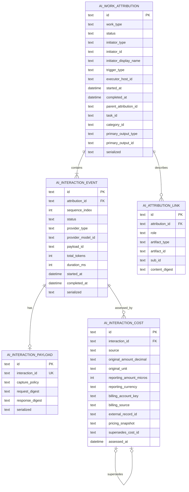

# AI Consumption Attribution System

- Status: **Implemented; final verification and independent re-review pending**
- Date: **2026-07-18**
- Scope: coding prompts, image generation, image analysis, audio transcription,
  agent-generated reports, and future AI work types
- Existing foundation:
  [`lib/features/ai_consumption/README.md`](../../lib/features/ai_consumption/README.md)

## Independent review gates

The first implementation audit did **not** sign off the branch. It identified
gaps in pre-call coverage, actor identity, exact cost capture, transcript
lifecycle ownership, recovery invocation, payload bounds, strict agent output
publication, dashboard hierarchy, detail completeness, and exceptional UI
states. Those findings drove a remediation pass. Fresh architecture and UI/UX
reviews must score the final commit; no previous score is carried forward.

## Implementation status

The production implementation includes the schema-v2 Drift migration,
typed attribution/cost/payload/link models, durable publication saga and stale
recovery, carrier projection, Matrix convergence, conservative legacy
backfill, and the shared localized attribution summary/details surface. Strict
carrier-backed integration covers skill-driven prompts, image generation,
image analysis, transcription, and agent reports. Direct realtime/batch
transcript writers create durable pending state before the provider call,
group verification calls under the same attribution, and terminalize success,
failure, and cancellation explicitly. Carrier-less AI chat, onboarding,
chat-audio, and agent-compaction calls use the shared pre-call capture boundary
and report `partial` rather than inventing output lineage. Embeddings and the
legacy unified inference path retain honest interaction-level compatibility
records.

The append-only cost model supports provider-reported, local-compute,
legacy-reported, estimated, reconciled, and unknown evidence today. A remote
billing importer and a versioned pricing catalog remain optional future
extensions; neither is required for the local audit record or current cost
rollups.

## Executive decision

Build attribution as a two-level audit model:

1. **`AiWorkAttribution` is the top-level record for one logical, user-visible
   piece of AI work.** It answers who initiated it, why it ran, what it created,
   when it ran, and its total effective cost.
2. **`AiInteractionEvent` is one backend call made while producing that work.**
   It records provider/model, request and response metadata, usage, duration,
   outcome, and cost evidence.

The existing `AiConsumptionEvent` and `consumption_events` table are already
close to the second concept. They should be evolved in place into interaction
events, not replaced with another competing usage ledger.

Do **not** put creator, prompt, response, and a single cost directly on every
work-type entity. That would repeat the current inconsistency in several new
shapes, cannot represent multi-call agent/image workflows, and would make cost
aggregation prone to double counting.

Do **not** make a remote billing service the only source of cost truth. Lotti is
local-first and must retain the immutable evidence available at call time.
External billing data may later supersede an estimate through an append-only
cost assessment, but the audit trail remains local and syncable.

## Pre-implementation baseline findings

The codebase already records one immutable `AiConsumptionEvent` per backend
call in `ai_consumption.sqlite`, syncs it over Matrix, and projects token, cost,
and environmental fields for aggregation. The existing event contains useful
ownership dimensions (`taskId`, `categoryId`, `entryId`, `agentId`,
`wakeRunKey`, `threadId`, `promptId`, `skillId`, and `configId`).

It does not yet provide work attribution:

- `entryId` generally identifies the **input/source entry**, not the newly
  generated result.
- The event has no creator/initiator actor.
- One user-visible work item cannot own several backend calls.
- Coding prompts are persisted as `AiResponseEntry`, image generation produces
  a `JournalImage`, image analysis mutates a source image's `entryText`, and
  transcription appends an `AudioTranscript`; none exposes one consistent
  attribution reference.
- `AudioTranscript` has no stable id, so two transcripts under the same audio
  entry cannot be referenced unambiguously.
- `AiResponseData` stores substantial request/response data, while transcripts
  and image analysis do not use the same interaction envelope.
- Cost is currently a nullable `double credits` and only Melious supplies it.
  There is no distinction between reported, estimated, reconciled, zero-cost,
  and unknown cost.
- Recording is explicitly best-effort and never throws. That is suitable for
  optional impact telemetry, but not sufficient for a user-visible audit claim
  that every generated work item is attributable.

## Terminology and invariants

- **Work item:** The logical result a person recognizes: a coding prompt,
  generated image, image-analysis result, transcript, or agent report.
- **Attribution:** The immutable audit header for one work item or one terminal
  failed attempt.
- **Interaction:** One request to one AI backend. A work item owns one or more.
- **Artifact link:** A typed link between attribution and an output, source, or
  context entity in the journal/agent domain.
- **Initiator:** The actor that caused the work to happen. This is the answer to
  “who created this?” It is not necessarily the device that executed the call.
- **Executor:** The device/node and provider that performed the work.
- **Effective cost:** The newest valid cost assessment in an append-only
  supersession chain for an interaction.

Load-bearing invariants:

1. Every new persisted AI-generated artifact has exactly one primary
   `attributionId`.
2. One attribution may own many interactions and many output artifacts.
3. One interaction belongs to exactly one attribution for new writes.
4. Cost is recorded once per interaction and aggregated upward; it is never
   copied onto every output artifact.
5. A batch call that produces several images has one interaction cost. Each
   image may display the shared attribution, but aggregates count the cost once.
6. Original provider usage and price evidence is immutable. Corrections append
   a superseding assessment instead of rewriting history.
7. Binary audio/image content is referenced and hashed, never duplicated as
   base64 inside attribution JSON.
8. A display-name snapshot is retained so attribution remains readable after
   an agent, device, skill, or account is renamed/deleted.
9. Legacy events without attribution remain valid consumption history and are
   explicitly marked as legacy/unresolved rather than guessed.

## Domain model

### `AiWorkAttribution`

```dart
@freezed
abstract class AiWorkAttribution with _$AiWorkAttribution {
  const factory AiWorkAttribution({
    required String id,
    required AiWorkType workType,
    required AiWorkStatus status,
    required AiActorSnapshot initiator,
    required AiTriggerSnapshot trigger,
    required AiExecutorSnapshot executor,
    required AiPrivacyClassification privacyClassification,
    required DateTime startedAt,
    required DateTime completedAt,
    required VectorClock? vectorClock,
    String? parentAttributionId,
    String? taskId,
    String? categoryId,
    String? primaryOutputType,
    String? primaryOutputId,
    String? errorCode,
    String? errorSummary,
    @Default(1) int schemaVersion,
  }) = _AiWorkAttribution;
}
```

Recommended enums:

```dart
enum AiWorkType {
  codingPrompt,
  textGeneration,
  imageGeneration,
  imageAnalysis,
  audioTranscription,
  agentReport,
  embeddingIndexing,
  internalInference,
}

enum AiWorkStatus { succeeded, failed, cancelled, abandoned, partial }

enum AiActorType { human, agent, automation, system }

enum AiTriggerType { manual, automatic, scheduled, synced, agentTool, migration }
```

Persist enum names, not indexes. Additive enum changes are compatible; renames
require an explicit wire migration.

`AiActorSnapshot` should contain:

- `type`
- stable `id`
- `displayName` at execution time
- optional `humanPrincipalId` when an automation/agent acts on behalf of a
  known person

Human ids should be `matrix:<mxid>` when logged in. Offline-only installations
should use a generated, SettingsDb-backed `local:<uuid>` principal rather than a
hard-coded “me”; otherwise two offline creators become indistinguishable after
sync. The UI may localize the current principal as “You” without storing that
word in the record.

`AiTriggerSnapshot` should contain `type` and the relevant `skillId`,
`promptId`, `profileId`, `agentId`, `wakeRunKey`, or automation rule id. It
captures why the run occurred without forcing those concepts into actor
identity.

`AiExecutorSnapshot` should contain the vector-clock `hostId`, the node display
name snapshot from `SyncNodeProfile`, and app version. Provider/model identity
remains interaction-specific because a multi-call workflow can use different
models.

### `AiInteractionEvent`

The target model is an evolution/rename of `AiConsumptionEvent`:

```dart
@freezed
abstract class AiInteractionEvent with _$AiInteractionEvent {
  const factory AiInteractionEvent({
    required String id,
    required String? attributionId, // null only for legacy rows
    required int sequenceIndex,
    required AiInteractionKind kind,
    required AiInteractionStatus status,
    required DateTime startedAt,
    required DateTime completedAt,
    required InferenceProviderType providerType,
    required VectorClock? vectorClock,
    String? parentInteractionId,
    String? providerRequestId,
    String? modelConfigId,
    String? providerModelId,
    String? inferenceProfileId,
    String? payloadId,
    String? errorCode,
    String? errorSummary,
    int? durationMs,
    int? inputTokens,
    int? outputTokens,
    int? cachedInputTokens,
    int? thoughtsTokens,
    int? totalTokens,
    int? audioInputMilliseconds,
    int? audioOutputMilliseconds,
    int? inputImageCount,
    int? outputImageCount,
    String? taskId,
    String? categoryId,
    String? sourceEntryId,
    String? agentId,
    String? wakeRunKey,
    String? threadId,
    int? turnIndex,
  }) = _AiInteractionEvent;
}
```

Keep `sourceEntryId` semantically distinct from the generated artifact links.
The existing `entryId` column is migrated/aliased to `sourceEntryId`; it must
not be presented as the output.

Capture terminal failed and cancelled calls too. Providers may charge for a
failed or disconnected response, and the absence of an output should not erase
that consumption.

Recommended interaction enums:

```dart
enum AiInteractionKind {
  chatCompletion,
  textGeneration,
  audioTranscription,
  realtimeTranscription,
  imageAnalysis,
  imageGeneration,
  embedding,
}

enum AiInteractionStatus { succeeded, failed, cancelled, partial }
```

`AiInteractionKind` describes the backend operation, while `AiWorkType`
describes the user-visible result. They intentionally differ: one cover-art
work item may contain a chat-completion interaction that writes the image
prompt followed by an image-generation interaction.

### `AiInteractionPayload`

Request/response evidence must use a normalized envelope rather than arbitrary
provider JSON as the query model:

```dart
@freezed
abstract class AiInteractionPayload with _$AiInteractionPayload {
  const factory AiInteractionPayload({
    required String id,
    required String interactionId,
    required List<AiContentPart> request,
    required List<AiContentPart> response,
    required Map<String, Object?> parameters,
    required String requestDigest,
    required String responseDigest,
    required AiPayloadCapturePolicy capturePolicy,
    required AiPrivacyClassification privacyClassification,
    required DateTime createdAt,
    required VectorClock? vectorClock,
    Map<String, Object?>? providerMetadata,
  }) = _AiInteractionPayload;
}
```

Content parts should support `text`, `toolCall`, `toolResult`,
`attachmentReference`, and `omitted`. Attachment references carry domain id,
file id/path-independent attachment id, media type, byte length, and SHA-256;
they never carry raw base64. Provider metadata is allow-listed and must never
contain API keys, authorization headers, signed URLs, or unredacted secrets.

The capture policy is explicit:

- `fullText`: exact textual messages/tool calls plus binary references.
- `referenceOnly`: digests and links because authoritative content already
  exists in the agent log or journal entity.
- `redacted`: selected content was removed before persistence.
- `metadataOnly`: usage/model/timing only, used when privacy settings prohibit
  content capture.

```dart
enum AiPayloadCapturePolicy {
  fullText,
  referenceOnly,
  redacted,
  metadataOnly,
}
```

Privacy is decided at capture time, not deferred:

- `referenceOnly` is the default for all sources and the only content mode
  synchronized automatically.
- Exact full text may be retained locally only after a deliberate user opt-in;
  it is never Matrix-synced by the attribution subsystem.
- Private sources force `referenceOnly`. Mixed-source prompts inherit the
  strongest (`private`) classification.
- Attribution and payload envelopes carry `privacyClassification` explicitly.
- Purge appends and syncs a redaction tombstone for payload evidence while
  retaining non-content usage, cost, actor, timestamp, and digest-algorithm
  facts. Purged content digests are retained only when policy allows; otherwise
  the tombstone records that the digest was intentionally removed.
- Diagnostics export and screenshot-safe presentation exclude payload content,
  private source/category names, and actor ids by default.

Default policy: synchronized evidence is always `referenceOnly`, using
attachment/domain references and versioned digests. Deliberately opted-in exact
text is local-only and never added to the Matrix envelope. This meets audit
needs without multiplying or newly synchronizing private content.

### Artifact links

```dart
@freezed
abstract class AiAttributionLink with _$AiAttributionLink {
  const factory AiAttributionLink({
    required String id,
    required String attributionId,
    required AiAttributionLinkRole role,
    required AiArtifactType artifactType,
    required String artifactId,
    String? subId,
    String? contentDigest,
  }) = _AiAttributionLink;
}

enum AiAttributionLinkRole { output, source, context }

enum AiArtifactType {
  journalEntry,
  journalAiResponse,
  journalImage,
  journalAudio,
  agentReport,
  agentMessage,
}
```

`artifactId` is the owning entity id. `subId` addresses a nested artifact such
as one transcript within a `JournalAudio`. These are typed cross-database
references, not SQL foreign keys: the journal, agent, and consumption stores
have independent SQLite connections and sync independently. Dangling links are
therefore a supported temporary state while sync catches up.

### Work-type mapping

| Work type | Primary output reference | Source/context reference | Required carrier change |
| --- | --- | --- | --- |
| Coding prompt | `journalAiResponse:<AiResponseEntry.id>` | source entry and parent task | Add optional `attributionId` to `AiResponseData`; always populate on new writes |
| General text generation | `journalAiResponse:<AiResponseEntry.id>` | source entry/task | Same as coding prompt |
| Generated image | `journalImage:<JournalImage.id>` | prompt response, task, reference images | Add optional `attributionId` to `ImageData` |
| Image analysis | `journalAiResponse:<AiResponseEntry.id>` | analyzed `JournalImage.id` | Persist analysis as an `AiResponseEntry`; linked display may still project text onto the image during compatibility phase |
| Audio transcript | `journalAudio:<JournalAudio.id>#<transcriptId>` | audio entry and linked task | Add optional stable `id` and `attributionId` to `AudioTranscript`; new writes require both |
| Agent report | `agentReport:<AgentReportEntity.id>` | agent, thread, task/project/day | Add `aiAttributionId` to report provenance (defaulted for old rows) |

Persisting image analysis as its own linked response is important. Appending AI
text directly into `JournalImage.entryText` destroys the boundary between user
text and generated analysis and cannot be attributed reliably after edits.

## Entity relationship diagram



External artifact targets (`AiResponseEntry`, `JournalImage`, `JournalAudio`,
and `AgentReportEntity`) are intentionally not drawn as SQL-owned rows because
they live in other databases. `AI_ATTRIBUTION_LINK` is the boundary.

## Database schema and indexes

Retain the blob-plus-projection pattern already used by `ai_consumption`:
serialized JSON is the lossless sync source; typed columns are query
projections.

Target Drift/SQLite changes for `ai_consumption.sqlite` schema version 2:

```sql
CREATE TABLE ai_work_attributions (
  id TEXT NOT NULL PRIMARY KEY,
  work_type TEXT NOT NULL,
  status TEXT NOT NULL,
  initiator_type TEXT NOT NULL,
  initiator_id TEXT NOT NULL,
  initiator_display_name TEXT NOT NULL,
  trigger_type TEXT NOT NULL,
  executor_host_id TEXT,
  started_at DATETIME NOT NULL,
  completed_at DATETIME NOT NULL,
  parent_attribution_id TEXT,
  task_id TEXT,
  category_id TEXT,
  primary_output_type TEXT,
  primary_output_id TEXT,
  serialized TEXT NOT NULL,
  schema_version INTEGER NOT NULL DEFAULT 1
);

CREATE TABLE ai_attribution_links (
  id TEXT NOT NULL PRIMARY KEY,
  attribution_id TEXT NOT NULL,
  role TEXT NOT NULL,
  artifact_type TEXT NOT NULL,
  artifact_id TEXT NOT NULL,
  sub_id TEXT,
  content_digest TEXT,
  serialized TEXT NOT NULL,
  FOREIGN KEY (attribution_id) REFERENCES ai_work_attributions(id)
);

CREATE TABLE ai_interaction_payloads (
  id TEXT NOT NULL PRIMARY KEY,
  interaction_id TEXT NOT NULL UNIQUE,
  capture_policy TEXT NOT NULL,
  request_digest TEXT NOT NULL,
  response_digest TEXT NOT NULL,
  serialized TEXT NOT NULL
);

CREATE TABLE ai_interaction_costs (
  id TEXT NOT NULL PRIMARY KEY,
  interaction_id TEXT NOT NULL,
  source TEXT NOT NULL,
  original_amount_decimal TEXT,
  original_unit TEXT,
  reporting_amount_micros INTEGER,
  reporting_currency TEXT,
  provider_type TEXT,
  billing_account_key TEXT,
  billing_source TEXT,
  external_record_id TEXT,
  supersedes_cost_id TEXT,
  assessed_at DATETIME NOT NULL,
  pricing_snapshot TEXT,
  serialized TEXT NOT NULL,
  CHECK (
    external_record_id IS NULL OR (
      provider_type IS NOT NULL AND
      billing_account_key IS NOT NULL AND
      billing_source IS NOT NULL
    )
  )
);

-- Local crash-recovery journal. This table is never Matrix-synced.
CREATE TABLE pending_ai_attributions (
  id TEXT NOT NULL PRIMARY KEY,
  started_at DATETIME NOT NULL,
  last_updated_at DATETIME NOT NULL,
  serialized TEXT NOT NULL
);
```

Alter `consumption_events` rather than renaming it in the first migration:

```sql
ALTER TABLE consumption_events ADD COLUMN attribution_id TEXT;
ALTER TABLE consumption_events ADD COLUMN sequence_index INTEGER;
ALTER TABLE consumption_events ADD COLUMN interaction_status TEXT;
ALTER TABLE consumption_events ADD COLUMN completed_at DATETIME;
ALTER TABLE consumption_events ADD COLUMN payload_id TEXT;
ALTER TABLE consumption_events ADD COLUMN provider_request_id TEXT;
ALTER TABLE consumption_events ADD COLUMN error_code TEXT;
```

The Dart domain can be renamed to `AiInteractionEvent` in the same phase while
the physical table stays stable. A later cleanup may rename the table after all
sync compatibility windows close.

Required indexes:

```sql
CREATE INDEX idx_attribution_output
  ON ai_work_attributions(primary_output_type, primary_output_id);
CREATE INDEX idx_attribution_task_created
  ON ai_work_attributions(task_id, completed_at)
  WHERE task_id IS NOT NULL;
CREATE INDEX idx_attribution_actor_created
  ON ai_work_attributions(initiator_id, completed_at);
CREATE INDEX idx_attribution_type_created
  ON ai_work_attributions(work_type, completed_at);
CREATE INDEX idx_attribution_link_target
  ON ai_attribution_links(artifact_type, artifact_id, sub_id);
CREATE INDEX idx_interaction_attribution_sequence
  ON consumption_events(attribution_id, sequence_index);
CREATE INDEX idx_cost_interaction_assessed
  ON ai_interaction_costs(interaction_id, assessed_at);
CREATE UNIQUE INDEX idx_cost_external_record
  ON ai_interaction_costs(
    provider_type,
    billing_account_key,
    billing_source,
    external_record_id
  ) WHERE external_record_id IS NOT NULL;
```

Use a unique constraint for `(attribution_id, role, artifact_type, artifact_id,
COALESCE(sub_id, ''))`; Drift may require expressing this as an index in the
`.drift` file.

## Cost tracking and linking

### Cost evidence hierarchy

Every terminal interaction receives one cost state:

1. `providerReported` — authoritative amount returned with the response.
2. `externallyReconciled` — authoritative billing export/API amount, appended
   later and superseding an earlier assessment.
3. `locallyEstimated` — usage multiplied by an immutable pricing snapshot.
4. `localCompute` — zero monetary API charge, with local duration/energy data
   recorded separately when available.
5. `unknown` — neither price nor adequate usage is available. Unknown must not
   be displayed as zero.

Provider-reported cost wins at call completion. External reconciliation may
supersede it if the provider's invoice is more authoritative. Estimation is
only used when no reported amount exists.

Canonical cost domain model:

```dart
enum AiCostSource {
  externallyReconciled,
  providerReported,
  locallyEstimated,
  localCompute,
  unknown,
  legacyReported,
}

@freezed
abstract class AiInteractionCost with _$AiInteractionCost {
  const factory AiInteractionCost({
    required String id,
    required String interactionId,
    required AiCostSource source,
    required DateTime assessedAt,
    required VectorClock? vectorClock,
    String? originalAmountDecimal,
    String? originalUnit,
    int? reportingAmountMicros,
    String? reportingCurrency,
    String? supersedesCostId,
    String? providerType,
    String? billingAccountKey,
    String? billingSource,
    String? externalRecordId,
    Map<String, Object?>? pricingSnapshot,
  }) = _AiInteractionCost;
}
```

Cost assessments are immutable. The effective assessment is selected from
records that are not superseded by another known record. If sync produces
several concurrent leaves, every device uses the same deterministic order:
source authority (`externallyReconciled` > `providerReported` >
`legacyReported` > `locallyEstimated` > `localCompute` > `unknown`), then
`assessedAt`, then lexical `id`. A reconciler should normally point
`supersedesCostId` at the prior effective assessment; the deterministic order
is the convergence backstop, not the routine update mechanism.

`externalRecordId` is unique within a provider billing source and makes import
idempotent. An `unknown` assessment has null amounts. A `localCompute`
assessment may have a zero reporting amount, but the UI must distinguish that
known zero from unknown.

### Representation

Do not use `double` as provider evidence. Preserve the provider amount as
canonical decimal text plus its unit (for example `"0.000000125"` + `USD`),
validated by a strict decimal parser before persistence. This retains arbitrary
provider precision. Derive integer reporting microunits (`1 currency unit =
1,000,000 micros`) with an explicit round-half-even rule for dashboard
aggregation; the exact decimal remains available for audit.

Keep two amounts when normalization is needed:

- `originalAmountDecimal` + `originalUnit`: exact validated provider evidence,
  such as `EUR`, `USD`, or `meliousCredit`.
- `reportingAmountMicros` + `reportingCurrency`: amount used by Lotti's cost
  dashboard, with the conversion rule/rate and timestamp frozen inside
  `pricingSnapshot`.

Until multi-currency conversion is implemented, aggregate original amounts by
unit and only sum the existing Melious credit/EUR-compatible reporting amount
under the explicit approximation already used by the UI. Never silently add
USD and EUR.

The Melious adapter must retain the raw billing decimal from provider JSON;
parsing into `double` first is not accepted because precision has already been
lost before attribution sees it. The pricing snapshot for estimates contains provider, provider model id,
effective date, input/output/cached/reasoning/audio/image unit prices, currency,
catalog version, and calculation formula version. Historical estimates never
change when the live catalog changes.

Cost supersession validation rejects self-links, cycles, cross-interaction
links, dangling predecessors at final selection, and authority downgrades.
`externalRecordId` uniqueness is scoped by `(providerType, billingAccountKey,
billingSource, externalRecordId)`. The SQL schema carries all four fields.
Concurrent valid leaves converge by authority, assessment time, then lexical id;
unknown-cost aggregation always returns both the known total and unknown count.

### Rollups

The effective attribution cost is a query result:

```text
attribution cost
  = sum(effective cost assessment for each distinct interactionId)
```

Task/category/actor/work-type totals aggregate distinct interactions through
their attribution or the denormalized interaction owner snapshot. Do not store
an authoritative total on `AiWorkAttribution`; that total becomes stale when a
cost is reconciled. A materialized read projection/cache is acceptable if it is
fully rebuildable from interactions and cost assessments.

Environmental impact stays interaction-scoped alongside cost. It can continue
to use the existing projected fields initially, then move to the same
assessment/evidence pattern if multiple impact sources need reconciliation.

### External billing integration

No external service is required for v1. If one is added later, it must:

- match on `providerRequestId` first, then a documented fallback key;
- append a new `AiInteractionCost` with `supersedesCostId`;
- never overwrite original usage/provider evidence;
- expose unmatched invoice rows for diagnostics instead of guessing;
- be idempotent by provider invoice line id.

## Capture lifecycle and reliability

```mermaid
stateDiagram-v2
  [*] --> Pending: mint attribution, interaction, and intended output ids
  Pending --> Calling: durably persist pending session before inference
  Calling --> EvidenceDurable: provider completes; commit interaction, cost, and sanitized recovery capsule
  EvidenceDurable --> EvidencePublished: enqueue existing-compatible consumption envelope
  EvidencePublished --> PersistingOutput: publication barrier opens
  PersistingOutput --> Finalizing: output carrier stores terminal attribution envelope
  Finalizing --> Succeeded: project attribution + links; clear pending session
  Calling --> Failed: persist failed terminal evidence + attribution
  Calling --> Cancelled: persist cancelled terminal evidence + attribution
  Pending --> Abandoned: recovery finds no provider completion
  EvidencePublished --> Partial: executor is permanently lost before output
  PersistingOutput --> Repaired: output exists; idempotent projection repair runs
  Repaired --> Succeeded
```



Introduce an `AiAttributionSession` coordinator. Call sites provide work type,
initiator, trigger, and source/context references once. The session mints ids,
wraps every backend call, captures payload/usage/cost, and finalizes after the
output is persisted.

Use a persisted saga with stable idempotency keys for `begin`, each interaction,
evidence publication, output persistence, attribution projection, and cleanup.
The small local `pending_ai_attributions` table is written **before inference**.
Provider completion durably commits terminal interaction/cost evidence and a
sanitized `AiAttributionRecoveryCapsule` to the consumption store before the
output carrier is allowed to enter its journal/agent sync path. The capsule
contains actor/trigger/executor snapshots, intended pre-minted output refs,
privacy classification, and non-secret evidence sufficient for another device
to display or finalize a partial/abandoned attribution if the executor is
permanently lost.

The output carrier then stores the terminal attribution envelope. New clients
project the top-level attribution/link tables idempotently from that carrier;
the recovery capsule is the executor-loss fallback. On startup or inbound apply:

- a pending session or recovery capsule with an output carrier bearing its
  `attributionId` is
  finalized/repaired;
- a pre-call pending session with no evidence after the recovery threshold is
  finalized as `abandoned`;
- published terminal evidence with no output becomes `partial` and remains
  auditable on peers even if the executor never returns;
- already-finalized ids are a no-op.

There is no cross-database transaction between journal/agent and consumption
stores. Reliability comes from the durable evidence publication barrier,
pre-minted output ids, the carrier's terminal envelope, recovery capsule,
idempotent steps, and repair—not from pretending the writes are atomic.

Change the guarantee boundary: optional environmental enrichment may remain
best-effort, but durable enqueue of the attribution session must be required
before a successful generated artifact is presented as fully saved. A local
write failure may queue repair; it must not be silently swallowed forever.

## Sync design

Do **not** add new `SyncMessage` union variants or
`SyncSequencePayloadType` values during the N/N−1 compatibility window. The
current unions have no fallback and old clients would discard unknown variants;
payload-type ordinals are persisted and cannot be repurposed.

Compatibility protocol:

1. Extend `AiConsumptionEvent` JSON additively with interaction evidence and a
   sanitized recovery capsule. It continues to travel as the existing
   `SyncMessage.consumptionEvent` and existing append-only sequence payload
   ordinal. Old clients ignore the added JSON fields while retaining legacy
   token/credit/impact projections.
2. Extend output carriers (`AiResponseData`, `ImageData`, `AudioTranscript`, and
   agent-report provenance) with optional/defaulted terminal attribution
   envelopes. They continue through their existing journal/agent sync messages.
3. Dual-write legacy `responseType`, token, `credits`, impact, and owner columns
   for the whole window so old dashboards remain correct.
4. New clients materialize attribution/link/payload/cost tables from either the
   interaction recovery capsule or output carrier. Projection is idempotent by
   stable record ids and can replay after reordered delivery.
5. Exact payload text is local-only. Synchronized capsules carry reference-only
   content parts, versioned digests, classification, usage, and exact cost
   evidence, keeping the existing inline event bounded. The serialized capsule
   has a hard measured-size limit; overflow replaces optional metadata with an
   `omitted` part rather than introducing an incompatible attachment protocol.
6. If an old client reserializes and relays a carrier without unknown fields,
   the independently published consumption recovery capsule remains the audit
   source. If it relays the consumption event without unknown fields, the output
   carrier remains the source. Neither domain alone is the only copy.
7. Retirement requires telemetry/maintenance evidence that every active known
   node has run the attribution-capable version for the agreed support window,
   N/N−1 reordered/backfill tests remain green, and no legacy-only writes were
   observed during one release cycle. Only then may a later ADR introduce
   dedicated sync variants/ordinals.

Versioned wire DTOs:

```dart
const kAiAttributionInlineEvidenceMaxBytes = 64 * 1024;
const kAiAttributionDigestAlgorithm = 'sha256-v1';

@freezed
abstract class AiAttributionRecoveryCapsule {
  const factory AiAttributionRecoveryCapsule({
    required String id, // uuid-v5(attributionId, 'recovery-v1')
    required String attributionId,
    required AiWorkType workType,
    required AiActorSnapshot initiator,
    required AiTriggerSnapshot trigger,
    required AiExecutorSnapshot executor,
    required AiPrivacyClassification privacyClassification,
    required DateTime startedAt,
    required List<AiArtifactReference> intendedOutputs,
    required String digestAlgorithm,
    @Default(0) int omittedReferenceCount,
    String? parentAttributionId,
    String? taskId,
    String? categoryId,
    @Default(1) int schemaVersion,
  });
}

@freezed
abstract class AiTerminalAttributionEnvelope {
  const factory AiTerminalAttributionEnvelope({
    required String id, // uuid-v5(attribution.id, 'terminal-v1')
    required AiWorkAttribution attribution,
    required String digestAlgorithm,
    @Default(1) int schemaVersion,
  });
}
```

All timestamps serialize as UTC RFC 3339. Link ids are UUIDv5 over canonical
`(attributionId, role, artifactType, artifactId, subId)`; interaction/cost ids
are pre-minted UUIDv4 unless an external reconciliation id supplies the stable
idempotency key. Canonical JSON uses lexically sorted object keys.

The UTF-8 encoded inline interaction evidence (payload + cost + capsule) may
not exceed 64 KiB. Deterministic overflow handling is: remove allow-listed
provider metadata; replace any remaining text content parts with `omitted` while
retaining their digests; sort non-primary references by canonical reference key
and retain the longest prefix that fits; store the removed count in
`omittedReferenceCount`. Required identity, primary output, privacy, usage,
cost, digest, and schema fields are never dropped. Failure to fit those required
fields rejects publication and surfaces a repairable local error.

All terminal records use UUIDv4 ids minted on the executing host and are
append-only/idempotent-by-id. Sync order is not guaranteed:

- attribution may arrive before its journal/agent output;
- interaction may arrive before attribution;
- a cost reconciliation may arrive after both.

Repositories and UI must tolerate these temporary gaps. Notifications should
use `notifyUiOnly` so per-call writes never feed the agent wake loop.

Wire compatibility rules:

- new optional/defaulted fields on journal/agent Freezed models;
- no unknown sync union cases are emitted during compatibility;
- enum names are stable;
- serialized version fields are explicit;
- legacy `SyncMessage.consumptionEvent` remains readable throughout rollout.

Executor identity is validated against the existing sync envelope's
`originatingHostId`/vector-clock provenance on inbound apply. A mismatching
claimed executor is retained only as untrusted diagnostics and never presented
as verified creator/executor identity.

## Service and API changes

Lotti is currently a local Flutter application, not a client of a central
Lotti REST backend. The primary API is therefore an internal Dart service plus
the Matrix sync protocol. Do not introduce a network server solely for this
feature.

Recommended application service:

```dart
abstract interface class AiAttributionService {
  Future<AiAttributionSession> begin(AiAttributionStart command);
  Future<AiInteractionResult<T>> captureInteraction<T>(
    AiAttributionSession session,
    AiInteractionCommand<T> command,
  );
  Future<AiWorkAttribution> complete(
    AiAttributionSession session, {
    required List<AiArtifactReference> outputs,
  });
  Future<AiWorkAttribution> fail(
    AiAttributionSession session,
    Object error,
  );
  Future<AiAttributionDetails?> getForArtifact(
    AiArtifactReference artifact,
  );
  Future<AiAttributionDetails?> getById(String id);
}
```

The capture boundary is implemented below provider selection and above concrete
HTTP/native adapters, with a required `AiAttributionContext` propagated from
the workflow. It has three explicit contracts:

```dart
abstract interface class AiInteractionCapture {
  Future<T> captureUnary<T>(AiUnaryInteraction<T> interaction);
  Stream<T> captureStream<T>(AiStreamInteraction<T> interaction);
  Future<AiRealtimeSession<T>> captureRealtime<T>(
    AiRealtimeInteraction<T> interaction,
  );
}
```

- `captureUnary` records request, response/error, usage, duration, retries, and
  cost around one future (image generation, unary transcription, embeddings).
- `captureStream` observes subscription, cancellation, partial chunks, the
  provider usage trailer, completion/error, and exactly-once terminal evidence
  without changing back-pressure.
- `captureRealtime` owns WebSocket/native session open/close, partial versus
  final outputs, reconnect attempts, cancellation, duration/audio units, and
  exactly-once terminal evidence.

Concrete provider repositories may not call transport/native inference without
one of these classified wrappers. A source-controlled inventory test enumerates
all entry points and fails for an unclassified one, including unified inference,
skill inference, AI chat replies, agent conversations, batch chat audio,
realtime transcription, Whisper, MLX audio, Ollama/oMLX, image generation,
image analysis/OCR, embeddings, Daily OS capture transcription, and any
non-persisted result. Non-user-visible embeddings still receive interaction
evidence under an internal work attribution so consumption is complete.

DTOs/views:

- `AiAttributionStart`: work type, initiator, trigger, executor, parent
  attribution, task/category, source/context links.
- `AiInteractionCommand`: kind, provider/model/profile, sanitized request
  envelope, and the call closure/adapter.
- `AiAttributionSummary`: creator display, work type, completed time, status,
  effective cost, call count, model names.
- `AiAttributionDetails`: summary plus artifact links, ordered interactions,
  cost evidence, usage, payload envelope, and diagnostics.
- `AiArtifactReference`: artifact type/id/sub-id.

### Creator resolution matrix

The workflow resolves actor data once and propagates it through
`AiAttributionContext`; provider adapters never invent creator identity.

| Workflow | Initiator shown as creator | Trigger | Human principal | Executor |
| --- | --- | --- | --- | --- |
| Manual prompt/transcript/analysis/image | Current human principal | `manual` | Current principal | Local executing host |
| Automatic transcript/analysis after a newly created source | `automation:<skillId>` | `automatic` | Inherited initiating human when known | Local or pinned remote host |
| Synced-node automatic inference | Original automation/agent snapshot from dispatch request | `synced` with original trigger metadata | Propagated original human principal | Receiving pinned host, validated against sync provenance |
| Manually woken agent report | Agent id/display snapshot | `manual` | Human who requested the wake | Host running the wake |
| Scheduled/automatic agent report | Agent id/display snapshot | `scheduled` or `automatic` | Agent owner when known | Host running the wake |
| Agent tool starts child AI work | Calling agent | `agentTool` | Inherited human principal | Host running the child call |
| Automatic analysis of generated image | Analysis automation/skill | `automatic` + parent attribution id | Inherited from image-generation attribution | Host running analysis |
| Migration/backfill | `system:migration` only as audit-row creator | `migration` | Unknown unless exact evidence exists | Migrating host |

If a legacy/source workflow has no person identity evidence, the record says
creator unavailable; it never substitutes the executor device or current
viewer. Inbound executor claims are checked against origin host/vector-clock
provenance. Actor display names are snapshots, while the UI localizes the
current matching human principal as “You”.

Repository queries:

- `getAttribution(id)`
- `getAttributionForArtifact(reference)`
- `listInteractions(attributionId)` ordered by `sequenceIndex`
- `effectiveCostsForInteractions(ids)`
- `newestAttributionsInRange(...)`
- `totalsForTask/Category/Actor/WorkType(...)`
- `repairMissingAttributions()`

If a server API is later required, map the same DTOs to:

- `GET /ai-attributions/{id}`
- `GET /ai-artifacts/{type}/{id}/attribution?subId=...`
- `GET /ai-attributions?from=&to=&workType=&creatorId=&taskId=`
- `GET /ai-attributions/{id}/interactions`
- `POST /ai-interactions/{id}/cost-assessments` for trusted reconciliation

Creation remains an internal trusted workflow endpoint; arbitrary clients
should not be able to forge creator/cost audit records.

## UI/UX

### Artifact-level attribution

Every generated artifact surface gets one compact, reusable
`AiAttributionSummaryRow` using design-system components/tokens:

- creator/initiator avatar or icon and display snapshot;
- “Created by …” plus automatic/agent/manual trigger context;
- model summary;
- completed time;
- effective cost, or explicit “Cost not reported”; and
- a details action.

The row has one exact two-tier anatomy across work types:

- **Primary line:** initiator + trigger, with non-success status on this line.
- **Secondary line:** model summary + localized completion time + a localized
  call count only when there is more than one interaction.
- **Cost:** trailing on wide layouts; reflowed onto the secondary line on narrow
  layouts. Cost certainty is textual (`Estimated`, `Provider reported`,
  `Reconciled`, `No API charge`, or `Cost not reported`), never color-only.
- **Action:** the entire surface is one semantics/focus target labelled “View
  AI details”, with one chevron. Text fragments and icons are not independent
  tap targets.

At 200% text scale the two lines reflow vertically without clipping,
horizontal scrolling, or ellipsizing the creator/cost state. Executor device
is omitted from the compact row unless it materially explains local execution;
it is always available in details.

Examples of useful labels:

- “Created by you · Claude … · €0.04”
- “Created by Task Agent · automatic · 3 calls · €0.12”
- “Transcribed automatically on Mac mini · local model · no API charge”
- “Cost not reported” (never “€0.00” for unknown)

All strings must be localized in every required ARB file. Actor names, model
ids, and currency values are data, not localized literals.

Release placement/density contract:

- Generated prompt/AI response: immediately below generated content, before
  secondary copy/expand actions.
- Image detail: below the image/caption. Compact journal-image list thumbnails
  do not show attribution in v1.
- Transcript: compact metadata in the transcript's collapsed header; full
  attribution disclosure inside the expanded transcript.
- Agent report: directly below the TLDR/report content, before proposals or
  recommendations.
- Impact dashboard: the attribution/work item is the parent row and its
  interactions expand beneath it.

### Detail sheet/page

Use one shared details-content widget in the established adaptive containers:

- phone/narrow pane: a full-height adaptive Wolt bottom sheet with named-route
  semantics;
- desktop: the established sized Wolt side sheet so the source artifact stays
  visible; and
- dashboard deep links: the same details content, preserving filters, scroll
  position, and focus when the user returns.

Reuse `ModalUtils` and the existing `SizedWoltSideSheetType`; do not introduce
new geometry. The details surface shows, in this order:

1. localized work-type title and status;
2. overview: creator, trigger, completion time, duration, total effective cost
   and source, model summary, and call count;
3. output/source/context links with navigation when the target is available;
4. ordered, collapsed interactions showing operation, model/provider, status,
   usage summary, and per-call effective cost;
5. a collapsed “Sensitive AI content” disclosure containing request/response
   and parameters;
6. cost evidence history and the pricing snapshot; and
7. advanced diagnostics: executor device, stable ids, digests, and explicitly
   labelled copy actions.

Private content must not appear in list previews or screenshots by default.
The request/response section should require deliberate expansion, respect the
artifact's privacy semantics, and never display secret headers.

The sensitive-content disclosure explains that prompts, transcripts, and
responses may contain private information. Its content is absent from preview
and screen-reader semantics until deliberately expanded, never auto-expands
when navigating from the ledger, and exposes explicit localized copy buttons.
`redacted`, `omitted`, `referenceOnly`, and `metadataOnly` are rendered as
intentional explanatory states rather than empty panels. Screenshot-safe mode
and the strongest source privacy classification take precedence.

Exceptional-state presentation matrix:

| State | Compact/detail presentation |
| --- | --- |
| pending/finalizing | Preserve the artifact and show “Saving AI details…” as subtle local status |
| dangling sync reference | “Details are still syncing”; keep known audit facts readable |
| failed | Failure status + available interaction/cost evidence; no output link required |
| cancelled | Cancelled status + any incurred usage/cost |
| partial | Partial status on primary line; identify available/missing outputs in details |
| abandoned | Interrupted status with recovery explanation |
| legacy | “Legacy AI work” + “Creator unavailable”; details action remains useful when evidence exists |
| unknown cost | “Cost not reported” |
| known local zero | “No API charge” |
| estimate | Visible “Estimated” text/badge plus amount |
| reported/reconciled | Explicit cost-source text in details |
| unavailable/deleted artifact | Retain readable typed reference and say the target is unavailable |
| redacted/omitted/reference-only/metadata-only | Explain the capture policy; never render a blank content card |

Accessibility contract:

- one deterministic semantics node for the compact row, including action,
  creator, status, and cost state;
- Enter/Space activation, token-driven visible focus, and focus restoration
  when details close;
- localized expanded/collapsed labels, state, and hints for disclosures;
- named-route and heading semantics in the details container;
- established minimum target sizes and no swipe/double-tap-only actions;
- status and cost certainty never rely on hue or motion; and
- widget coverage at 200% text scale, narrow phone, desktop, light/dark,
  keyboard-only navigation, screen-reader order, and reduced motion.

Use plural/select ARB messages for call counts and actor/trigger variants; do
not build sentences from separately translated fragments joined with a middle
dot. Dates, times, decimals, and currencies use locale-aware formatters. Model,
actor, and device names are data and receive directionality isolation where
needed. Screenshot-safe views omit private source/category labels from previews,
semantics, and filter chips until the user deliberately leaves safe mode.

### Impact dashboard

Evolve the existing call ledger rather than building another dashboard:

- render attribution/work items as parent rows with expandable child calls;
- add creator and work-type filters;
- add status and cost-source filters;
- distinguish unknown/estimated/reported/reconciled cost;
- navigate from a call to its attribution and output;
- preserve per-call charts and task/category aggregates;
- count calls from interaction rows and work items from attribution rows, with
  both labels explicit; and
- preserve dashboard filters, scroll position, and focus across details.

Use stale-while-revalidate provider behavior so background sync does not flash
the existing dashboard into a loading or empty shell.

## Phased implementation plan

Each phase ends analyzer-clean, formatted, with targeted tests green. Do not
run the full suite unless explicitly requested; run the feature/database test
folders and directly affected work-type tests.

### Phase 0 — Coverage inventory and decisions

- Enumerate every AI backend adapter/call site, including unified inference,
  skill inference, AI chat replies, conversation/agent turns, batch chat audio,
  realtime transcription, Whisper, MLX audio, Ollama/oMLX, image generation,
  automatic image analysis/OCR, embeddings, Daily OS capture transcription,
  and non-persisted inference results.
- Record for each path: initiator, trigger, source, output, provider/model,
  usage availability, cost availability, and current persisted payload.
- Decide the initial reporting currency. Synchronized content capture is
  already fixed at `referenceOnly`; exact opted-in text remains local-only.
- Add contract tests that fail when a known production call path has no
  attribution integration classification.

### Phase 1 — Schema and pure domain model

- Add Freezed domain models/enums for attribution, actors, triggers, artifact
  refs/links, payload envelopes, and cost assessments.
- Add schema-v2 migration and conversion tests for all new tables/columns.
- Keep `consumption_events` physical table and backward JSON decoding.
- Add pure effective-cost selection and aggregation logic.
- Use Glados for invariants: append-order independence of cost supersession,
  no double counting across multiple output links, stable artifact reference
  round trips, and aggregation by distinct interaction id.
- Regenerate code; do not edit generated files.

### Phase 2 — Attribution coordinator and sync

- Implement `AiAttributionService`, pending-session persistence, idempotent
  finalization, recovery, and repair.
- Extend the existing recorder or replace call-site use with a session-aware
  adapter. Retain a compatibility method for legacy one-call recording while
  migrating call sites.
- Extend the existing consumption and output-carrier envelopes additively;
  retain the existing sync message and sequence payload types, add inbound
  projection/idempotency checks, and use UI-only notifications.
- Add two-device convergence tests with deliberately reordered attribution,
  interaction, output, payload, and cost arrival.

### Phase 3 — One vertical slice: coding prompts

- Integrate skill-based and legacy coding prompt generation first because
  `AiResponseEntry` already preserves most request/response data.
- Pre-mint `attributionId`, capture the backend interaction, write it into
  `AiResponseData`, finalize after entry/link persistence, and expose the
  attribution summary/details UI on generated prompt cards.
- Verify manual and automatic triggers, linked task/source navigation, failed
  calls, unknown cost, and Melious-reported cost.
- Treat this as the production proving slice before multiplying migrations.

### Phase 4 — Remaining work types

- Audio transcription: add stable transcript ids and attribution ids; cover
  cloud, local, realtime/final transcript, manual, automatic, and synced-node
  execution.
- Image analysis: persist a linked `AiResponseEntry` as the authoritative
  generated result; retain compatibility projection only while old UI paths
  require it.
- Image generation: attribute the final `JournalImage`; keep prompt-generation
  and image-generation calls in one attribution when they are one user action.
  Automatic post-generation analysis gets a child attribution through
  `parentAttributionId`.
- Agents: one attribution per generated report/wake result, containing all
  model-turn interactions. Individual turns remain drill-down calls, not
  separate user-visible work items.
- Audit the Phase 0 inventory and make zero unclassified production paths the
  merge gate.

### Phase 5 — Cost estimation and reconciliation

- Add a versioned pricing catalog only after reported-cost capture is stable.
- Estimate from provider usage with frozen snapshots; never infer missing usage.
- Add optional external reconciliation import/API and unmatched-line UI.
- Move dashboard queries to effective integer-microunit cost while retaining a
  compatibility read for legacy `credits`.

### Phase 6 — Broader UI and cleanup

- Add the shared attribution row/details surface to all artifact views.
- Add creator/work-type/cost-source dashboard filters and attribution grouping.
- Remove compatibility paths only after old synced clients/data are supported
  for the agreed window.
- Update the AI and AI-consumption feature READMEs in full, including final
  runtime and sync Mermaid diagrams.

## Migration and backfill

### Existing consumption events

Do not fabricate a creator or output link from incomplete data.

- Preserve every row and its id/vector clock.
- Set new `attributionId`, interaction status, payload id, and normalized cost
  fields to null for legacy rows.
- Create a legacy `AiInteractionCost` only when `credits` is non-null, with
  source `legacyReported`, original unit `meliousCredit`, and a note that the
  historic UI treated it as approximately EUR.
- Continue including unattributed legacy calls in historical consumption
  totals; label them “Legacy call — creator unavailable” in drill-down UI.

### Existing AI work items

Backfill conservatively in an idempotent background job:

1. `AiResponseEntry`: a candidate may be linked to a legacy consumption event
   when work type, source/prompt/skill/model, and a narrow timestamp window form
   a unique match.
2. `AudioTranscript`: add deterministic legacy `subId` from owning audio id +
   transcript index + canonical content digest. Creator remains unknown unless
   a unique consumption-event match exists.
3. Generated images: only link when explicit generation lineage already exists
   and produces a unique match.
4. Image text already flattened into `JournalImage.entryText`: do not split or
   claim which portion was AI-generated. Mark as unresolvable legacy content.
5. Agent reports: link only when report/thread/wake timestamps and ids uniquely
   identify the interaction set.

Backfilled records use `triggerType: migration`, `initiatorType: system`, and
an explicit confidence (`exact` or `inferred`) in migration metadata. The UI
must say “Creator unavailable” for inferred legacy ownership; “system migration”
is the actor that created the audit row, not a claim about the original work.

The job checkpoints progress, is safe to resume, has dry-run counts, and never
rewrites existing journal/agent content solely to improve a guess. New writes
are prioritized; historical completeness is best effort.

### Version compatibility

All carrier fields are optional/defaulted for deserializing old synchronized
entities. New runtime code treats missing attribution as legacy, not as an
error. Once the minimum supported sync version understands the new messages,
the integration can become mandatory for every new AI call path.

## Testing strategy

### Pure model/property tests

- JSON round trips for every enum/union and legacy missing fields.
- Artifact reference equality and stable serialization.
- Effective-cost supersession is deterministic and selects exactly one leaf.
- Multiple output links never multiply interaction cost.
- Mixed currencies are grouped, never naively summed.
- Actor display snapshots survive source deletion/rename.
- Glados tests carry the mandatory `glados` tag.

### Database/migration tests

- Upgrade a schema-v1 fixture with representative legacy events.
- Verify all rows, JSON, vector clocks, and old aggregate totals survive.
- Test indexes with `EXPLAIN QUERY PLAN` for artifact reverse lookup,
  attribution interaction ordering, and range aggregation.
- Test idempotent inserts, duplicate links, cost supersession, pending-session
  recovery, and repair.
- Mirror database part-file layout if the implementation splits query mixins.

### Service tests

- one-call success, multi-call success, partial success, failure, cancellation,
  crash after output write, crash before output write, and recovery;
- manual human, automatic skill, scheduled agent, synced-node execution;
- provider-reported, locally estimated, local-zero, reconciled, and unknown cost;
- payload redaction and secret allow-list enforcement;
- no attribution failure can corrupt or duplicate the generated artifact;
- retries are idempotent by session/interaction id.

### Sync tests

- two devices receive records in every meaningful order;
- replayed ids do not duplicate rows or cost;
- payload attachment digest verification;
- legacy clients/events remain readable;
- notifications refresh UI without triggering an agent wake;
- a creator/device renamed after sync still renders the stored snapshot.

### Work-type integration tests

For each work type, assert meaningful behavior:

- output carrier has the expected attribution id;
- reverse lookup returns the same attribution;
- source and output links navigate to the correct distinct entities;
- ordered interactions show correct provider/model/usage;
- displayed creator/trigger and cost state are correct;
- multi-output/multi-call workflows do not double count;
- background refresh preserves the already-rendered attribution UI.

Use centralized mocks/fallbacks, `setUpTestGetIt`/`tearDownTestGetIt`, test data
factories, `makeTestableWidget`, deterministic dates, and no real delays/timers.

### Verification commands per phase

1. Register the repository root with dart-mcp.
2. Run `dart-mcp.analyze_files` for changed files and address every diagnostic.
3. Run `fvm dart format .`.
4. Run targeted database/model/service/widget tests with
   `dart-mcp.run_tests`.
5. Regenerate Freezed/Drift/l10n through the repository commands when needed,
   then re-run analysis and targeted tests.

## Security, privacy, and retention

- Never persist API keys, auth headers, cookies, signed URLs, or provider SDK
  objects without an allow-list conversion.
- Treat prompts, transcripts, images, tool calls, and model responses as user
  content, not telemetry.
- Inherit the strongest privacy classification among source artifacts.
- Never duplicate binary media in attribution storage.
- Keep request/response content collapsed in UI and excluded from ordinary
  analytics projections.
- Define payload deletion/redaction separately from accounting retention. If a
  user purges content, retain non-content usage/cost/audit facts and replace the
  payload with a verifiable redaction tombstone where policy permits.
- Avoid logging payload content and actor ids in ordinary error messages.
- Document that local database protection follows device/platform storage; do
  not claim encryption at rest unless it is actually implemented and verified.

## Observability and operational checks

Add privacy-safe counters:

- generated artifacts missing attribution;
- attributions missing primary output;
- interactions missing attribution (excluding legacy);
- unknown/reported/estimated/reconciled cost counts;
- pending sessions by age;
- repair successes/failures;
- unmatched external billing lines; and
- payload redaction/metadata-only counts.

Expose a maintenance check that reports and repairs consistency without dumping
prompt/response content. A release gate should require zero new-work missing
attributions in integration fixtures.

## Risks and mitigations

| Risk | Mitigation |
| --- | --- |
| Cross-database write is interrupted | Pre-minted id on the output carrier, durable pending session, idempotent repair |
| Cost is double-counted for batches or agent turns | Cost belongs to distinct interactions; outputs only link to attribution |
| Provider pricing changes rewrite history | Immutable pricing snapshot and append-only supersession |
| Request payload duplicates private/large data | Content parts, reference-only mode, attachment hashes, no base64 |
| Sync order leaves temporary dangling references | Typed nullable resolution and eventual refresh; no cross-DB FK assumption |
| “Creator” conflates user, automation, agent, and device | Separate initiator, trigger, executor, and optional human principal |
| Legacy matching makes false claims | Exact/unique-only matching; unknown creator is an acceptable result |
| Mutable image text cannot be attributed | Persist image analysis as its own linked AI response |
| Best-effort recorder silently loses mandatory audit | Required pending-session write plus visible recovery metrics |
| Old clients cannot decode new sync messages | Additive/defaulted models, compatibility gate, retained legacy message path |

## Acceptance criteria

- Every newly generated coding prompt, image, image analysis, transcript, and
  agent report has a reverse-resolvable `AiWorkAttribution`.
- The artifact UI immediately shows initiator, trigger context, time, model
  summary, and cost state.
- Every backend call, including failed charged calls, is an interaction under
  exactly one new attribution.
- Request/response parameters and content/reference metadata are inspectable
  without storing secrets or duplicate media bytes.
- Multi-call and multi-output workflows aggregate cost exactly once per
  interaction.
- Cost distinguishes reported, estimated, reconciled, local-zero, and unknown.
- Existing consumption history and aggregates survive migration.
- Legacy creator/output uncertainty is represented honestly, not guessed.
- Attribution, links, interactions, payloads, and costs converge across devices
  and tolerate arrival in any order.
- Analyzer reports zero diagnostics and all targeted affected tests pass before
  implementation is reported complete.

## Deliberate non-goals for the first implementation

- Building a centralized billing server.
- Reconstructing authorship for flattened legacy image-analysis text.
- Uploading raw audio/image bytes into the attribution database.
- Supporting invoice reconciliation before provider-reported capture and the
  core attribution flow are stable.
- Treating cost estimates as invoices.
- Deleting old consumption rows or rewriting historical vector clocks.

## Recommended first PR boundary

The safest first implementation PR is Phases 1–3: schema/domain/coordinator,
sync support, and a complete coding-prompt vertical slice with UI and tests.
It proves identity, multi-database repair, payload capture, and cost linkage on
an output type that already stores request/response text. Audio, image, and
agent integrations should follow as separate focused PRs, with the Phase 0
inventory preventing any path from being forgotten.
